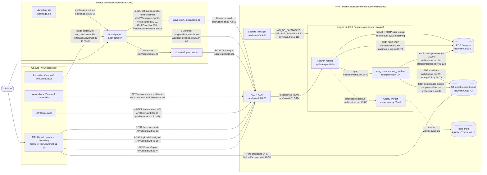
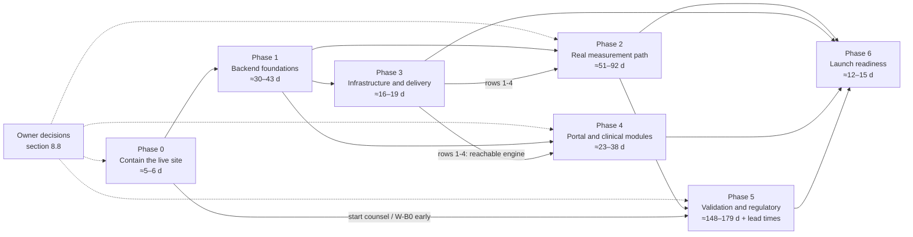

# StrataMetric / AI Wound Scan — Engineering Handoff

Repository: `AlbaceteMedDev/WoundsAre3D` at commit `26f6d76` · Document date: 2026-09-08

This document is the complete technical handoff for the AI Wound Scan proof of concept: what was built, how it works, what is measured to work, what does not, and the ordered work required to reach a production system. It is written to be read by an engineer or an AI assistant that has the accompanying source bundle and no other context. Chapter 00 is the measured state; chapters 01–07 describe each part of the system; chapter 08 is the complete verified gap register with the phased roadmap and the decisions only the owner can make; chapter 09 explains how to run, verify and continue the work.

The verified gap register also ships as data next to this document: `docs/handoff/register.json` (every field per finding), `docs/handoff/register.md` (a flat table) and `docs/handoff/evidence/` (the raw test and probe output this document cites).

Conventions: code is cited as `path/from/repo/root:line`; findings are cited as `[source-Gn]` / `[contract-source-Fn]` / `[critic-Gn]` and defined in chapter 08; severities are blocker / major / minor / info.

## Table of contents

- [00. Measured state of the repository](#00-measured-state-of-the-repository)
  - [Test and build results](#test-and-build-results)
  - [Live production probes (stratametricai.com, Vercel)](#live-production-probes-stratametricaicom-vercel)
  - [What is deployed where](#what-is-deployed-where)
  - [Repository shape](#repository-shape)
  - [The accompanying code bundle](#the-accompanying-code-bundle)
- [01. Overview, architecture, repository layout, current state](#01-overview-architecture-repository-layout-current-state)
  - [1.1 What the product is](#11-what-the-product-is)
  - [1.2 Repository layout](#12-repository-layout)
  - [1.3 System architecture](#13-system-architecture)
  - [1.4 End-to-end flow of one measurement, designed vs actual](#14-end-to-end-flow-of-one-measurement-designed-vs-actual)
  - [1.5 Real vs stub vs missing](#15-real-vs-stub-vs-missing)
  - [1.6 Deployment topology today](#16-deployment-topology-today)
  - [1.7 Numbers](#17-numbers)
  - [1.8 History](#18-history)
  - [1.9 Reading order](#19-reading-order)
- [02. Measurement engine (woundscan-engine)](#02-measurement-engine-woundscan-engine)
  - [2.1 Package layout](#21-package-layout)
  - [2.2 Request lifecycle of POST /measurements](#22-request-lifecycle-of-post-measurements)
  - [2.3 Mathematics as implemented](#23-mathematics-as-implemented)
  - [2.4 API surface](#24-api-surface)
  - [2.5 Identity, sessions, JWT, RBAC, audit chain](#25-identity-sessions-jwt-rbac-audit-chain)
  - [2.6 Storage](#26-storage)
  - [2.7 ML](#27-ml)
  - [2.8 Output and business modules](#28-output-and-business-modules)
  - [2.9 Configuration](#29-configuration)
  - [2.10 Tests](#210-tests)
  - [2.11 Packaging](#211-packaging)
  - [2.12 Engine gap summary](#212-engine-gap-summary)
- [03. iOS capture app (woundscan-ios)](#03-ios-capture-app-woundscan-ios)
  - [3.1 Project](#31-project)
  - [3.2 Architecture](#32-architecture)
  - [3.3 Screen-by-screen flow](#33-screen-by-screen-flow)
  - [3.4 Capture](#34-capture)
  - [3.5 Networking](#35-networking)
  - [3.6 Portal embed](#36-portal-embed)
  - [3.7 Persistence and device security](#37-persistence-and-device-security)
  - [3.8 Build, signing, distribution](#38-build-signing-distribution)
  - [3.9 Tests](#39-tests)
  - [3.10 iOS gap summary](#310-ios-gap-summary)
- [04. Web (woundscan-web)](#04-web-woundscan-web)
  - [4.1 Project setup](#41-project-setup)
  - [4.2 Routing map](#42-routing-map)
  - [4.3 Marketing site](#43-marketing-site)
  - [4.4 Provider portal](#44-provider-portal)
  - [4.5 Authentication](#45-authentication)
  - [4.6 API routes](#46-api-routes)
  - [4.7 3D viewer](#47-3d-viewer)
  - [4.8 Mobile capture handoff](#48-mobile-capture-handoff)
  - [4.9 Deployment](#49-deployment)
  - [4.10 Tests and lint](#410-tests-and-lint)
  - [4.11 Web gap summary](#411-web-gap-summary)
- [05. Infrastructure, CI/CD and operations](#05-infrastructure-cicd-and-operations)
  - [5.1 Terraform layout](#51-terraform-layout)
  - [5.2 dev vs prod](#52-dev-vs-prod)
  - [5.3 Secrets](#53-secrets)
  - [5.4 Networking and TLS](#54-networking-and-tls)
  - [5.5 Compute](#55-compute)
  - [5.6 Data](#56-data)
  - [5.7 Observability and security services](#57-observability-and-security-services)
  - [5.8 CI](#58-ci)
  - [5.9 Docker and compose](#59-docker-and-compose)
  - [5.10 Documentation vs reality](#510-documentation-vs-reality)
  - [5.11 Infra gap summary](#511-infra-gap-summary)
- [06. Cross-component contracts, environment/secrets matrix, security and PHI posture](#06-cross-component-contracts-environmentsecrets-matrix-security-and-phi-posture)
  - [6.1 iOS ↔ engine contract](#61-ios--engine-contract)
  - [6.2 Web ↔ engine contract](#62-web--engine-contract)
  - [6.3 Environment and secrets matrix](#63-environment-and-secrets-matrix)
  - [6.4 Hostnames and URL topology](#64-hostnames-and-url-topology)
  - [6.5 Security and PHI posture](#65-security-and-phi-posture)
  - [6.6 Verified attack paths](#66-verified-attack-paths)
  - [6.7 What is correct today](#67-what-is-correct-today)
  - [6.8 Contract and security gap summary](#68-contract-and-security-gap-summary)
- [07. Regulatory, validation and clinical-claims audit](#07-regulatory-validation-and-clinical-claims-audit)
  - [7.1 Intended regulatory positioning — what the docs and site currently claim](#71-intended-regulatory-positioning--what-the-docs-and-site-currently-claim)
  - [7.2 Claims register](#72-claims-register)
  - [7.3 Traceability reality](#73-traceability-reality)
  - [7.4 Uncertainty and 95% CI](#74-uncertainty-and-95-ci)
  - [7.5 PDF report disclosure vs actual method](#75-pdf-report-disclosure-vs-actual-method)
  - [7.6 Validation program required](#76-validation-program-required)
  - [7.7 Submission and quality-system artefacts needed](#77-submission-and-quality-system-artefacts-needed)
  - [7.8 Regulatory gap summary](#78-regulatory-gap-summary)
- [08. Gap register, roadmap to production, and owner decisions](#08-gap-register-roadmap-to-production-and-owner-decisions)
  - [8.1 How to read this register](#81-how-to-read-this-register)
  - [8.2 Summary counts](#82-summary-counts)
  - [8.3 Blockers (24 canonical)](#83-blockers-24-canonical)
  - [8.4 Major findings (60 canonical)](#84-major-findings-60-canonical)
  - [8.5 Minor and informational findings (61 canonical)](#85-minor-and-informational-findings-61-canonical)
  - [8.6 Duplicate map, folded items and resolved contradictions](#86-duplicate-map-folded-items-and-resolved-contradictions)
  - [8.7 Phased roadmap to production](#87-phased-roadmap-to-production)
  - [8.8 Decisions only the owner can make](#88-decisions-only-the-owner-can-make)
  - [8.9 Estimate roll-up](#89-estimate-roll-up)
- [09. How to run, test, verify and bundle; working instructions](#09-how-to-run-test-verify-and-bundle-working-instructions)
  - [9.1 Prerequisites and what the sandbox lacks](#91-prerequisites-and-what-the-sandbox-lacks)
  - [9.2 Engine — install, run, test, verify](#92-engine--install-run-test-verify)
  - [9.3 Web — install, dev, build, run](#93-web--install-dev-build-run)
  - [9.4 iOS — generate, open, run, and why it can't be built here](#94-ios--generate-open-run-and-why-it-cant-be-built-here)
  - [9.5 Full-stack local topology](#95-full-stack-local-topology)
  - [9.6 Reproducing the key defects](#96-reproducing-the-key-defects)
  - [9.7 The accompanying bundle](#97-the-accompanying-bundle)
  - [9.8 Working instructions for ChatGPT on this codebase](#98-working-instructions-for-chatgpt-on-this-codebase)

---

# 00. Measured state of the repository

Everything in this section was executed or probed directly against commit `26f6d76` on 2026-09-07. Treat it as the baseline the rest of this document is written against. Where `README.md`, `PRODUCTION.md`, or `RUNBOOK.md` disagree with this section, this section wins — those files predate most recent work and several of their claims are stale.

## Test and build results

| Component | Command | Result |
|---|---|---|
| Engine — unit + regulatory + benchmarks (what `engine-ci.yml` gates on) | `pytest tests/unit tests/regulatory tests/benchmarks` | **327 passed, 5 skipped, 0 failed** (11.9 s) |
| Engine — integration | `pytest tests/integration` | **36 passed** (7.8 s). Runs against FastAPI `TestClient` in-process; does not hit a real Postgres or S3 |
| Engine — full suite with coverage | `pytest --cov=woundscan tests/` | **363 passed, 5 skipped**; **coverage 90%** — exactly the `fail_under = 90` gate in `pyproject.toml`, i.e. zero margin |
| Engine — regulatory traceability | `python scripts/check_traceability.py` | **OK: 48 requirements traced** |
| Engine — total collected | `pytest --collect-only` | 368 tests |
| Web — typecheck | `npm run typecheck` (`tsc --noEmit`) | clean |
| Web — lint | `npm run lint` | clean |
| Web — build | `npm run build` | clean |
| Web — tests | `npm test` (`vitest run --passWithNoTests`) | **0 test files exist.** The suite passes vacuously. There is no test coverage of the web app at all |
| iOS | — | Not buildable in this environment (Linux). `ios-ci.yml` also does not fail on build error (`\|\| echo ... skip`), so CI has never actually gated an iOS build |

Notes on the engine run:
- `torch` is **not** installed (it is an optional extra, `pip install -e ".[ml]"`). Every ML module was therefore exercised on its non-torch fallback path. There are **no trained model weight files** (`*.pt`, `*.pth`, `*.onnx`, `*.mlmodel`, `*.safetensors`) anywhere in the repository.
- The 5 skipped tests are 2 Postgres `testcontainers` tests (no Docker daemon in the test environment) and 3 torch U-Net tests (torch not installed).
- Warnings worth fixing before they become errors: `np.trapz` deprecated (`geometry/volume.py:101-102`), `passlib` uses the deprecated `crypt` module (breaks on Python 3.13), a class-scoped fixture defined as an instance method in `tests/unit/test_bundle_adjustment.py`.

## Live production probes (stratametricai.com, Vercel)

The marketing site and the provider portal are deployed together from `woundscan-web/` as a single Next.js app. The following was observed against the live site:

| Probe | Observation | Consequence |
|---|---|---|
| `POST /api/auth/login` with `nobody@example.invalid` / `not-a-real-password` | **HTTP 200**, body `{"status":"ok","mode":"demo"}`, and a `ws_session` cookie granting `role: "clinician"`, `userId: "demo-clinician"`, 12-hour expiry | **Anyone can log into the portal with any credentials.** `src/app/api/auth/login/route.ts` falls back to a demo session whenever the engine is unreachable (1.5 s timeout) or `WS_DEMO_MODE=1`. No `API_URL` is configured on Vercel, so the engine is always unreachable and the fallback always fires |
| Inspect the `ws_session` cookie | URL-encoded JSON `{token, expiresAt, role, userId}`; `httpOnly`, `secure`, `sameSite=strict`; **no signature or MAC** | `src/lib/auth.ts` `getSession()` just `JSON.parse`s it. A client can forge `role: "admin"`. Today this only exposes sample data; with a real engine it would expose whatever the portal renders from the cookie's role without re-checking the engine |
| `GET /dashboard` unauthenticated | 307 → `/login` | Server-side session gate works; it is the gate's input (the cookie) that is untrustworthy |
| `GET /` | Marketing site, server-rendered per request (`cache-control: private, no-cache, no-store`) | `page.tsx` calls `getSession()` and redirects logged-in users to `/dashboard`, which forces dynamic rendering of the homepage on every hit |
| Apex `stratametricai.com` | 308 → `www.stratametricai.com` | Fine; note it when scripting checks |

No PHI is exposed by either finding because the deployed portal renders only `src/lib/sample.ts` demo data. Both are nonetheless **production blockers** and are entered in the gap register (section 08) as `web-portal` blockers.

## What is deployed where

| Thing | State |
|---|---|
| Marketing site + portal shell (Vercel, `stratametricai.com`) | **Live.** Auto-deploys from `main` via the Vercel GitHub integration; there is no `vercel.json` in the repo — all config is in the Vercel dashboard |
| Engine (FastAPI + Celery + Postgres + Redis + S3) | **Not deployed anywhere.** `PRODUCTION.md` says the dev Terraform environment was "partially applied (ACM cert + ALB + ECS task def)"; that cannot be verified from the repo (no state file is committed, by design). Assume nothing is running |
| iOS app | `PRODUCTION.md` says "Build 8 is in TestFlight". Not verifiable from the repo. The app's default API base URL points at `https://woundscan.albacetemeddev.com`, which does not resolve to a running engine |
| Database schema | No Alembic migrations exist (`alembic` is a dependency but there is no `migrations/` directory). The only path is `Base.metadata.create_all` |
| Trained ML models | None in repo |
| Fiducial (ArUco) sticker printable | None in repo; `RUNBOOK.md` promises one "in a follow-up" |
| User/clinician seed script | None; `RUNBOOK.md` promises `scripts/seed_user.py` "in a follow-up". `scripts/` contains only `check_traceability.py` and `make_icon.py` |

## Repository shape

```
WoundsAre3D/                     118 commits on main
├── woundscan-engine/    152 files  ~14,500 LOC  Python 3.11 · FastAPI · SQLAlchemy · Celery · numpy/scipy/opencv · reportlab · fhir.resources
├── woundscan-web/       125 files  ~11,900 LOC  Next.js 14 (App Router) · React 18 · TypeScript · Tailwind · three.js · recharts · zod · swr
├── woundscan-ios/        34 files   ~2,300 LOC  SwiftUI · ARKit · AVFoundation · SceneKit · xcodegen
├── infrastructure/        8 files     ~950 LOC  Terraform (vpc, s3, rds, ecs, alb modules; dev + prod envs)
├── .github/workflows/     4 files              engine-ci, web-ci, ios-ci, regulatory — none of them deploy
├── bin/                   4 files              asc, ship-ios, screenshots, asc-metadata.json — App Store Connect helpers
├── README.md · PRODUCTION.md · RUNBOOK.md      Stale in places; see above
```

## The accompanying code bundle

Two zip files accompany this document, built from the same commit:

- `stratametric-source-26f6d76.zip` (~0.6 MB, 530 files) — every source, config, test, doc and script file. Excludes: `node_modules`, `.next`, `.venv`, `.git`, `__pycache__`, coverage data, `tsconfig.tsbuildinfo`, lockfiles, fonts, and all PNG assets.
- `stratametric-assets-26f6d76.zip` (~5.5 MB) — the excluded binary assets and lockfiles: `woundscan-web/public/` (logos, icons, share card, demo OBJ), `woundscan-web/scripts/fonts/`, the iOS app icon, `uv.lock`, `package-lock.json`.

Unzip both into the same directory to reconstruct the tree. The canonical source is the GitHub repository `AlbaceteMedDev/WoundsAre3D`, branch `main`.

**Not included, deliberately:** the nClouds Statement of Work (marked confidential on every page — share it with ChatGPT separately if the roadmap in section 08 needs it), any AWS/Vercel/Apple credentials, and `.env` files (none are committed).

---

# 01. Overview, architecture, repository layout, current state

StrataMetric AI Wound Scan (repository `WoundsAre3D`, formerly WoundScan) is a three-tier wound-measurement product: a SwiftUI/ARKit iPhone app that is meant to capture a LiDAR depth burst, probe depths and a boundary polygon; a Python/FastAPI "engine" that turns those inputs into volume, surface area, depth, perimeter, 95% confidence intervals, a quality grade, graft-size recommendations, a PDF/FHIR report and a 3D mesh; and a Next.js site that serves both the public marketing page and the clinician portal. At commit `26f6d76` (2026-09-07) the engine's mathematics, tests and HTTP surface are real, but nothing is persisted, no LiDAR depth ever reaches the math, the only login is an env-gated dev credential, the iOS capture flow never makes a network call, and the deployed portal at stratametricai.com runs with no engine behind it and accepts any credentials [00.md]. Terraform for AWS exists for a dev and a prod environment; prod cannot serve traffic as written and neither is verifiably applied. This chapter states what the product is from the code, how the components are meant to connect, how they connect today, and the numbers that the rest of the document is built on. Chapters 02–09 go into each component; the gap register (chapter 08) carries all 217 findings cited here as `[id]`.

## 1.1 What the product is

**What a clinician does (from the code, not the copy).** On the phone, the clinician signs in with email, password and a six-digit TOTP (`woundscan-ios/WoundScan/UI/Screens/LoginView.swift:13-47`) and lands on a five-tab shell in which Dashboard, Patients and Wounds are the web portal inside a `WKWebView` and only Capture is native (`woundscan-ios/WoundScan/UI/Screens/MainTabView.swift:6-21`). Capture is a six-step state machine — warm-up, burst, probe entry, boundary, uploading, result (`woundscan-ios/WoundScan/UI/Screens/CaptureFlowView.swift:11-19`). The burst step gates the shutter on motion score, 200–400 mm distance, near-perpendicular pitch and ARKit `.normal` tracking (`CaptureFlowView.swift:113-118`) and then collects 60 `ARFrame`s with `sceneDepth` (`woundscan-ios/WoundScan/Capture/ARKitCapture.swift:44-47,64-73`). The clinician is then meant to place probe-depth anchors (at least five) and confirm a wound boundary, after which the app is supposed to upload the artifacts, submit a measurement and show the result with a SceneKit 3D mesh (`woundscan-ios/WoundScan/UI/Screens/MeasurementDetailView.swift:207-221`). On the desktop portal the clinician opens a wound record with trajectory charts, graft applications, notes and a reimbursement estimate (`woundscan-web/src/app/(portal)/wounds/[id]/page.tsx:44-63`), a three-column 3D mesh workspace (`woundscan-web/src/components/mesh/MeshWorkspace.tsx:55-59`), records a UDI-traceable graft application (`woundscan-web/src/components/GraftPanel.tsx:130`), drafts and signs a progression note (`woundscan-web/src/components/NotesPanel.tsx:310`), runs a Medicare PFS estimate (`woundscan-web/src/components/ReimbursementPanel.tsx:45`) and downloads the PDF (`wounds/[id]/page.tsx:156`). A second, browser-only 2D photo path exists: a QR "capture handoff" from desktop to phone camera (`woundscan-web/src/components/portal/boards/CaptureHandoff.tsx:36-85`, `woundscan-web/src/components/mobile/MobileCapture.tsx:63-77`) that never reaches the engine [contract-web-engine-F4].

**What the engine computes.** `POST /measurements` runs `run_measurement_pipeline` synchronously in the request thread (`woundscan-engine/src/woundscan/api/routes/measurements.py:38-42`). From the clinician boundary polygon (mm) it rasterises a wound-local grid (`woundscan-engine/src/woundscan/api/pipeline.py:144`), applies a tabulated probe-compression correction to every probe depth (`pipeline.py:162-164`), fuses probe anchors and camera anchors with a heteroscedastic Matérn-5/2 Gaussian process into a posterior depth mean and std on the grid (`pipeline.py:180-194`; `woundscan-engine/src/woundscan/fusion/gaussian_process.py:79`), then integrates: volume by composite Simpson (`woundscan-engine/src/woundscan/geometry/volume.py:18-77`), 3D bed area by the gradient integral (`woundscan-engine/src/woundscan/geometry/surface_area.py:33`), polygon perimeter (`woundscan-engine/src/woundscan/geometry/perimeter.py:10`), footprint, max and mean depth (`pipeline.py:212-218`), and 95% CIs on volume and area by 300-sample Monte Carlo over the posterior std (`pipeline.py:220-237`; `woundscan-engine/src/woundscan/geometry/uncertainty.py:178,242`). It then runs six geometric plausibility checks and a temporal check against the previous visit (`pipeline.py:240-255`), a composite A/B/C/F quality grade (`pipeline.py:265-274`), graft sizing and product recommendation (`pipeline.py:280-297`), a provenance record with input/intermediate hashes and algorithm versions (`pipeline.py:314-337`) and a Wavefront OBJ of the fused surface (`pipeline.py:200-204`). Other routes derive a reportlab PDF (`woundscan-engine/src/woundscan/output/pdf_report.py:50`), a FHIR R4 Observation bundle (`woundscan-engine/src/woundscan/output/fhir_export.py:72`), per-wound progression trends (`woundscan-engine/src/woundscan/api/routes/wounds.py:101-134`), template progression notes hashed with SHA-256 (`woundscan-engine/src/woundscan/notes/generator.py:92`), a CY2025 Medicare PFS estimate (`woundscan-engine/src/woundscan/billing/medicare.py:165`) and a graft-application ledger (`woundscan-engine/src/woundscan/api/routes/grafts.py:78-201`). The camera anchors are placeholders: 200 points at depth 0 and confidence 0.7 synthesised inside the mask (`pipeline.py:100-121,167`), so the reported geometry is a GP interpolation of the probe depths, never of LiDAR data [engine-core-math-G2] [engine-api-auth-storage-G3].

**What the portal shows.** Fourteen pages under `woundscan-web/src/app/(portal)/` and three under `src/app/admin/`. Two of them — `wounds/[id]` and `wounds/[id]/mesh` — fetch the engine; the other twelve portal pages and all three admin pages render literal JSX or fixtures from `woundscan-web/src/lib/sample.ts` (12 named patients with MRNs, 8 orders, 7 claims) [contract-web-engine-F7]. When the engine is unreachable the two live pages silently substitute a hash-seeded fake progression (`wounds/[id]/page.tsx:68`; `sample.ts:137-197`) and the bundled synthetic OBJ (`woundscan-web/src/app/api/proxy/[...path]/route.ts:66-67`) [contract-web-engine-F6]. The public site is a 15-section marketing page plus `/demo`, which mounts the same mesh workspace on `public/demo-wound.obj`; its technical claims are audited in chapter 07.

## 1.2 Repository layout

Counts are from `git ls-files`; lines exclude `uv.lock`, `package-lock.json`, PNG/OBJ/TTF assets. 330 tracked files, 34,456 lines in total.

| Path | What it is | Files | Lines | Chapter |
|---|---|---|---|---|
| `woundscan-engine/` | Python 3.11 package `woundscan` (FastAPI, SQLAlchemy, Celery, numpy/scipy/opencv, reportlab), tests, docs, Docker | 152 | 15,481 (14,480 `.py`) | 02 |
| `woundscan-engine/src/woundscan/api/` | app factory, 10 routers, pipeline orchestrator, Celery worker, pydantic models | 19 | 1,996 | 02 |
| `woundscan-engine/src/woundscan/{capture,fusion,geometry,synthesis}/` | measurement core: ingestion dataclasses, GP/TPS/BA/Kalman/force correction, integrators, synthetic ground truth | 28 | 3,251 | 02 |
| `woundscan-engine/src/woundscan/{ml,quality,validation,monitoring}/` | segmentation/tissue/probe/fiducial models, per-pixel confidence, plausibility + grade, Prometheus/OTel/structlog | 26 | 1,751 | 02 |
| `woundscan-engine/src/woundscan/{output,graft,billing,notes}/` | PDF/FHIR/CSV/OBJ/provenance/plot, graft sizing + catalogue, Medicare estimator, note generator | 15 | 1,426 | 02 |
| `woundscan-engine/src/woundscan/{auth,storage}/` | bcrypt/TOTP/JWT/RBAC/audit chain; SQLAlchemy models, S3 wrapper, tamper evidence | 10 | 817 | 02, 06 |
| `woundscan-engine/tests/` | 30 unit, 3 regulatory, 2 benchmark, 4 integration files; 368 collected tests | 39 | 4,932 | 02, 07, 09 |
| `woundscan-engine/docs/` | architecture, deployment, math_reference, ml_models, regulatory_traceability, validation_protocol | 6 | 768 (with README) | 02, 07 |
| `woundscan-engine/{Dockerfile,docker-compose.yml,pyproject.toml,scripts/,examples/}` | image, local stack, packaging + pytest/coverage config, traceability checker, icon script, geometry demo | 7 | — | 02, 05, 09 |
| `woundscan-web/` | Next.js 14 App Router, React 18, TypeScript, Tailwind, three.js, recharts, zod | 124 | 12,800 (10,857 `.tsx`, 894 `.ts`) | 04 |
| `woundscan-web/src/app/(portal)/` | 14 auth-gated portal pages | 15 | 2,446 | 04 |
| `woundscan-web/src/app/api/` | login, 4 capture-handoff routes, phantom submit, catch-all engine proxy | 7 | 261 | 04, 06 |
| `woundscan-web/src/app/admin/` | 3 placeholder admin pages | 3 | 117 | 04 |
| `woundscan-web/src/components/marketing/` | 15 homepage sections + 10-view simulated portal tour | 31 | 3,883 | 04, 07 |
| `woundscan-web/src/components/{portal,mesh,mobile}/` | AppShell chrome, boards, R3F mesh viewer, phone capture | 15 | 2,684 | 04 |
| `woundscan-web/src/lib/` | zod schemas, cookie session, in-memory capture store, formatters, demo fixtures | 5 | 538 | 04, 06 |
| `woundscan-web/{public,scripts}/` | brand PNGs, `demo-wound.obj`, OG-card generator + OFL fonts | 18 | — | 04 |
| `woundscan-ios/` | SwiftUI + ARKit + SceneKit app, xcodegen `project.yml`, tracked `.xcodeproj`, 3 unit tests | 34 | 3,099 (2,226 `.swift`) | 03 |
| `infrastructure/terraform/` | modules `vpc`, `s3`, `rds`, `ecs`, `alb`; environments `dev`, `prod`; README | 8 | 997 (948 `.tf`) | 05 |
| `.github/workflows/` | `engine-ci`, `web-ci`, `ios-ci`, `regulatory` — none deploy | 4 | 196 | 05 |
| `bin/` | `asc` (App Store Connect API), `ship-ios`, `screenshots`, `asc-metadata.json` | 4 | 1,039 | 03, 05 |
| `README.md`, `PRODUCTION.md`, `RUNBOOK.md`, `.gitignore` | root docs, stale in places [00.md] | 4 | 844 | 05, 09 |

There is no root `docs/` directory; the only documentation set is `woundscan-engine/docs/`. There is no `vercel.json`, no `alembic.ini`/`migrations/`, no `.env`, no `conftest.py`, no `.swiftlint.yml`, no model weight file and no phantom data anywhere in the tree [00.md].

## 1.3 System architecture

### As designed

The design is stated in `woundscan-engine/docs/architecture.md:38-65` (data flow), `:77-82` (async path), the root `README.md:76-113`, and the Terraform dev environment. Edge labels are the call sites that implement, or were written to implement, each hop.



### As it actually works today

Solid edges are live code paths that execute; dashed edges are calls that exist but dead-end or are never invoked. The engine box is not deployed anywhere; it runs only under `docker compose` or the in-process test client [00.md].

```mermaid
flowchart LR
  browser([Browser])
  phone([iPhone, TestFlight build per PRODUCTION.md:70])

  subgraph vercel["stratametricai.com — Vercel, auto-deploy from main, no vercel.json"]
    mkt["Marketing page\napp/page.tsx (dynamic per request)"]
    loginr["api/auth/login/route.ts"]
    cookie["ws_session = URL-encoded JSON, unsigned\nlib/auth.ts:22,31"]
    gate["(portal)/layout.tsx:15-16 cookie presence check"]
    pages["12 portal + 3 admin pages\nlib/sample.ts fixtures / literal JSX"]
    wound["wounds/[id] + wounds/[id]/mesh"]
    proxyr["api/proxy/[...path]/route.ts"]
    demoobj["public/demo-wound.obj"]
    handoff["api/capture/* in-process Map\nlib/captureStore.ts:27-33"]
  end

  subgraph ios["iOS app"]
    loginv["LoginView.swift:55-57"]
    capflow["CaptureFlowView.swift"]
    upv["UploadingView\nCaptureFlowView.swift:400-409"]
    wk["PortalWebView.swift"]
    dead["APIClient presignedUploads/createMeasurement/getMeasurement\nAPIClient.swift:46-67 — zero call sites"]
  end

  subgraph engine["Engine — NOT DEPLOYED (local docker compose / TestClient only)"]
    auth["POST /auth/login\nroutes/auth.py:44 → _is_dev_user :70-91"]
    jwt["get_identity HS256 verify\napi/auth.py:26-47, key default :17-23"]
    routes["31 routes\napi/main.py:69-78"]
    dicts[("module-level dicts\nmeasurements.py:26-27, wounds.py:16, grafts.py:26, notes.py:36, phantom.py:15, api/audit.py:7")]
    pipe["run_measurement_pipeline\npipeline.py:124"]
    synth["_synthetic_camera_anchors depth=0\npipeline.py:100-121,167"]
    presign["/uploads/presigned → http://localhost:9000/key\nuploads.py:49"]
    pgmod["storage/postgres.py — 0 importers under api/"]
    s3mod["storage/s3.py — 0 importers under api/"]
    celery["worker.py:35-45 task — 0 dispatchers"]
  end

  subgraph tf["Terraform (not verifiably applied)"]
    dev["dev: ALB+ACM+RDS+ECS wired\ndev/main.tf:53-129; needs pre-existing secret :49-51"]
    prod["prod: ECS+RDS, no ALB/cert/domain, only WS_DB_PASSWORD\nprod/main.tf:69-80"]
  end

  browser --> mkt
  browser -- "any credentials\nlogin/page.tsx:21-25" --> loginr
  loginr -. "fetch http://localhost:8000/auth/login, 1.5 s abort\nlogin/route.ts:4,15-21 → ECONNREFUSED" .-> engine
  loginr -- "demo session, role clinician, 12 h\nlogin/route.ts:47-54" --> cookie
  cookie --> gate
  gate --> pages
  gate --> wound
  wound -. "SSR fetch API_URL (localhost)\nwounds/[id]/page.tsx:20,29" .-> engine
  wound -- "fallback mockProgression\nwounds/[id]/page.tsx:68" --> pages
  wound -- "/api/proxy/measurements/:id/mesh\nMeshWorkspace.tsx:58" --> proxyr
  proxyr -. "fetch API_URL, 3 s abort\nproxy/route.ts:54,62" .-> engine
  proxyr -- "on failure serve demo OBJ / 503\nproxy/route.ts:66-67,71" --> demoobj
  browser -- "QR handoff photo, unauthenticated\nCaptureHandoff.tsx:36, MobileCapture.tsx:121" --> handoff

  phone --> loginv
  loginv -. "POST https://woundscan.albacetemeddev.com/auth/login\nAppState.swift:15; APIClient.swift:26-44 — host has no engine; decode rejects microseconds APIClient.swift:149" .-> auth
  phone --> capflow
  capflow -- "burst → probes(0,0) → 24-vertex circle\nCaptureFlowView.swift:31,33,338-347,385-390" --> upv
  upv -. "onResult never called — flow hangs\nCaptureFlowView.swift:35,400-409" .-> dead
  wk -. "loads apiBaseURL host with raw-JWT cookie\nAppState.swift:24-32; PortalWebView.swift:55-62 → portal login page" .-> gate

  auth --> jwt
  jwt --> routes
  routes --> dicts
  routes -- "sync\nmeasurements.py:38-42" --> pipe
  pipe --> synth
  pipe -- "OBJ via mesh_sink\npipeline.py:200-204 → measurements.py:45" --> dicts
  routes --> presign
  routes -. "never imported" .-> pgmod
  routes -. "never imported" .-> s3mod
  routes -. "never enqueued" .-> celery
  tf -. "no CI/CD; engine-ci.yml:99-107 builds an untagged local image" .-> engine
```



What is wired today, in one sentence each:

- Browser → Vercel: live; every login succeeds in demo mode because `API_URL` is unset and the route falls back after a 1.5 s timeout (`login/route.ts:4,20-26,47-54`) [contract-env-secrets-F1] [contract-security-phi-F1] [web-portal-G7].
- Browser → engine: never reaches an engine; the proxy and SSR fetches target `http://localhost:8000` (`proxy/route.ts:6`; `wounds/[id]/page.tsx:20`) [contract-env-secrets-F9].
- iOS → engine: two of six client calls have call sites (`LoginView.swift:57`, `MeasurementDetailView.swift:211`); login cannot decode the engine's microsecond timestamps (`APIClient.swift:146-152`) [ios-app-G2] [contract-ios-engine-F1]; the capture flow stops at `UploadingView` [ios-app-G1] [contract-ios-engine-F3].
- iOS → portal: the WKWebView derives the portal origin from the API host (`AppState.swift:24-32`) and seeds a cookie the portal cannot parse (`PortalWebView.swift:55-62` vs `lib/auth.ts:22`) [ios-app-G3] [ios-app-G15].
- Engine → Postgres/S3/Redis: zero imports of `storage/` under `api/` and zero Celery dispatches; every route reads and writes module-level dicts [engine-api-auth-storage-G2] [engine-api-auth-storage-G9] [engine-output-business-G1].
- Engine → depth data: none; `depth_burst_s3_keys`, `rgb_s3_key`, `poses`, `intrinsics` are accepted by the request model (`woundscan-engine/src/woundscan/api/models/measurement.py:59-84`) and never read [engine-api-auth-storage-G3].
- Terraform → anything: no workflow runs `terraform` or pushes an image; prod defines no ALB, certificate, domain, environment map or JWT secret (`prod/main.tf:69-80`) [infra-ci-ops-G1] [infra-ci-ops-G2] [contract-env-secrets-F8].

## 1.4 End-to-end flow of one measurement, designed vs actual

"Designed" is `woundscan-engine/docs/architecture.md:40-65` and `RUNBOOK.md:159-199` (Path A steps 3–4). Status vocabulary: **works** (executes as designed), **partial** (executes with a defect or placeholder input), **stub** (code path exists but returns a placeholder), **missing** (no code path), **unreachable** (real code that no live path can reach).

| # | Step | Designed behaviour | Actual behaviour | file:line | Status | Finding |
|---|---|---|---|---|---|---|
| 1 | Sign in (iOS) | DB user lookup, bcrypt + per-user TOTP; JWT issued | Only `_is_dev_user` (fixed `dev@local/dev/000000`, gated by `WS_ALLOW_DEV_LOGIN=1`); user/org UUIDs hardcoded; `expires_at` has microseconds, iOS `.iso8601` decoder throws, UI shows "Sign-in failed" on HTTP 200 | `routes/auth.py:44,55-57,80-91`; `APIClient.swift:149`; `LoginView.swift:59-61` | stub / broken | [engine-api-auth-storage-G1] [ios-app-G2] [contract-ios-engine-F2] |
| 2 | Select or create wound | `POST /wounds`, pick `wound_id` for the capture | iOS has no wound UI; `Wound.swift` has zero call sites; `wound_id` is mandatory on presign and measurement | `CaptureFlowView.swift:6-46`; `Models/Wound.swift:3-16`; `uploads.py:17`; `measurement.py:67` | missing | [contract-ios-engine-F5] |
| 3 | Warm-up and guidance | Wait for ARKit `.normal` tracking, fiducial visible | `stage = .ready` after a fixed 500 ms regardless of ARKit support; `fiducialDetected` is never assigned so the tile is always "place sticker"; `ARSession.run` invoked twice | `CapturePipeline.swift:31-37`; `ARKitCapture.swift:17`; `CaptureFlowView.swift:42-44,84-86` | partial | [ios-app-G12] [ios-app-G6] |
| 4 | 60-frame LiDAR burst | RGB + depth + confidence + poses + intrinsics captured | Real on device; depth copied as raw `Float32` metres including row padding with no width/height metadata; RGB never encoded; no timeout on the burst continuation; 60 full-res buffers held in memory | `ARKitCapture.swift:64-73,94-101`; `CapturePipeline.swift:52-115` | partial | [ios-app-G8] [ios-app-G13] |
| 5 | Fiducial (ArUco) detection | Marker IDs, corners, rvec/tvec for scale and pose | On-device `FiducialLiveCheck` is a Vision rectangle count, not ArUco, and has zero call sites; engine `detect_aruco` exists but the pipeline never calls it and `compute_scale_check` is wrong for the documented 4-marker layout | `FiducialDetection.swift:11-24`; `capture/fiducial.py:43-145` | stub | [ios-app-G6] [engine-core-math-G4] |
| 6 | Probe-depth entry | Tap on photo to place ≥5 anchors, auto-detect optional | No photo; "Add anchor" appends a record at `xMm:0, yMm:0`; result discarded by the caller; engine probe detector returns `[]` unconditionally | `CaptureFlowView.swift:31,338-347`; `ml/probe_detection.py:60-66` | stub | [ios-app-G7] [engine-ml-quality-validation-G3] |
| 7 | Boundary annotation | ML proposes the outline, clinician adjusts | Grey placeholder; button emits a hardcoded 24-vertex 20 mm circle; result discarded; engine boundary model has no weights and is never invoked | `CaptureFlowView.swift:33,370-396`; `ml/boundary_segmentation.py:160` | stub | [ios-app-G7] [engine-ml-quality-validation-G1] |
| 8 | Presigned upload URLs | `POST /uploads/presigned` → S3 presigned PUTs | iOS never calls it; engine fabricates `http://localhost:9000/<key>`; `S3Storage` has no presigned-PUT method and is never imported by `api/` | `APIClient.swift:46-58`; `uploads.py:43-51`; `storage/s3.py:95-101` | stub | [engine-api-auth-storage-G4] [contract-ios-engine-F4] |
| 9 | Upload binaries to S3 | Durable queue, retry, offline persistence | `UploadService` is in-memory, unused, no Content-Type, drops jobs after 4 attempts | `UploadService.swift:10,21,48-55` | unreachable | [ios-app-G5] [contract-ios-engine-F9] |
| 10 | Submit measurement | `POST /measurements` with S3 keys, poses, fiducials, boundary, probes | `CreateMeasurementPayload` is never instantiated; `UploadingView` shows a spinner and never invokes `onResult` | `CaptureFlowView.swift:35,400-409`; `APIClient.swift:60-63` | missing (client) | [ios-app-G1] [contract-ios-engine-F3] |
| 11 | Route handling | Check wound exists and belongs to caller's org; check `CREATE_MEASUREMENT` permission | Neither check exists; pipeline runs synchronously in the request; result cached in a dict; audit entry to an in-memory logger | `measurements.py:30-58`; `api/audit.py:7` | partial | [engine-api-auth-storage-G5] [contract-security-phi-F4] |
| 12 | Fetch depth burst from S3 and project into wound frame via poses + fiducials | `architecture.md:49` | `_synthetic_camera_anchors`: 200 uniformly sampled in-mask points, depth 0, confidence 0.7; no S3 key is ever read | `pipeline.py:100-121,167` | stub | [engine-api-auth-storage-G3] [engine-core-math-G2] |
| 13 | Force correction | Per-tissue, per-force table with sigma inflation | Executes, but tissue is always `"granulation"` and probe sigma always 0.5 mm; coefficients have no provenance | `pipeline.py:156,163`; `fusion/force_correction.py:49-68` | partial | [engine-core-math-G5] |
| 14 | GP fusion | Heteroscedastic Matérn-5/2 GP over probe + camera anchors, lengthscale optimised | Executes; zero-mean prior with fixed 1 mm² signal variance shrinks depth toward 0 and caps std at 1 mm; optimisation disabled so lengthscale is always 8 mm; the "camera" anchors are the zero-depth placeholders from step 12 | `gaussian_process.py:51-60,170`; `pipeline.py:180-194` | partial | [engine-core-math-G1] |
| 15 | Geometry | V (Simpson), 3D SA (gradient integral), perimeter, footprint, max/mean depth | Executes and is validated <2% on analytic shapes | `pipeline.py:212-218`; `geometry/volume.py:18-77`; `geometry/surface_area.py:33` | works | — |
| 16 | Monte Carlo 95% CI on V and SA | 1000 samples from the GP posterior | 300 samples of Gaussian-smoothed noise scaled by pointwise std; coverage never tested; depth, perimeter, footprint get no CI | `pipeline.py:220-237`; `uncertainty.py:84-175,230-236` | partial | [contract-regulatory-F5] [engine-core-math-G10] |
| 17 | Plausibility and temporal checks | Geometric sanity + change-rate vs stored history | Executes; prior values come from the request body, not storage; box-bound check passes any volume when `max_depth == 0` | `pipeline.py:240-255`; `validation/plausibility.py:57`; `validation/temporal_plausibility.py:38-47` | partial | [engine-ml-quality-validation-G14] |
| 18 | Quality grade A/B/C/F | 7 measured sub-scores from photo/depth/consistency | Five of eight inputs are constants (0.7, 0.0, 0.8, 0.7, 1.0); grade depends only on probe count and fiducial count/reprojection; F is unreachable with ≥1 probe | `pipeline.py:258-274`; `validation/quality_score.py:113-121` | stub | [engine-ml-quality-validation-G4] [engine-ml-quality-validation-G5] |
| 19 | Graft recommendation | Filter catalogue by indication/contraindication, size, sort by cost | Executes against 4 fictional products; indication hardcoded `"DFU"`; `selected_product_ids` ignored; area formula double-counts the perimeter term | `pipeline.py:278-297`; `graft/product_db.py:61-104`; `graft/sizing.py:74-80` | partial | [engine-output-business-G3] [engine-output-business-G4] [engine-output-business-G5] |
| 20 | Provenance | SHA-256 of every input artifact, model hashes, git SHA | Hashes boundary, probes, fused depth/std only; `git_sha="unknown"`, model versions `fallback-*-v0` with empty SHA | `pipeline.py:302-337`; `pipeline.py:58-69` | partial | [engine-output-business-G7] [contract-regulatory-F9] |
| 21 | Mesh export | OBJ of the fused surface for the viewers | Executes; served from `_MESH_CACHE`; +Z-into-wound convention that the web viewer does not flip | `pipeline.py:200-204`; `measurements.py:98-125`; `MeshCanvas.tsx:226,283` | works (in-memory) | [ios-app-G11] [web-portal-G2] |
| 22 | Persist | Row to Postgres with provenance JSON, PDF/binaries to S3, audit hash-chain entry | Dicts only; `pdf_s3_key` is a fabricated string; audit chain in-memory, `HashChainEntry` discarded so `verify_chain` can never run | `measurements.py:26-27,43-45`; `pipeline.py:371`; `auth/audit_log.py:69-73` | missing | [engine-api-auth-storage-G2] [engine-api-auth-storage-G8] [engine-output-business-G1] |
| 23 | Async path | Large jobs enqueued to Celery, iOS polls `GET /measurements/{id}` | Task defined, nothing calls `.delay`/`.apply_async`; no job-status endpoint; iOS never polls | `worker.py:35-45`; `APIClient.swift:65-67` | unreachable | [engine-api-auth-storage-G9] |
| 24 | Result on phone | Metric cards + SceneKit mesh | `ResultView` and `MeasurementDetailView` only reachable from step 10, which never completes; `downloadMesh` itself is correct | `CaptureFlowView.swift:413-468`; `MeasurementDetailView.swift:207-221` | unreachable | [ios-app-G1] |
| 25 | Result on portal | Wound appears in list, detail shows V/SA/CI/grade/grafts, PDF and FHIR download | Wound list never calls `GET /wounds`; detail page fetches progression/grafts/notes only when `API_URL` is reachable, else fabricates them; PDF link returns a 503 JSON body in demo mode; FHIR has no web consumer | `wounds/page.tsx:38-60`; `wounds/[id]/page.tsx:44-68,156`; `proxy/route.ts:71` | partial | [contract-web-engine-F6] [contract-web-engine-F7] [contract-web-engine-F3] |
| 26 | PDF and FHIR export | Report with disclosed methodology; conformant R4 bundle | Regenerated per request from the dict; patient `'opaque'`, clinician `'dev'` printed; methodology string claims camera fusion; provenance printed as Python repr; FHIR references `Patient/opaque`, no profile, CI in `referenceRange` | `measurements.py:181-210,148-178`; `pdf_report.py:162-168`; `fhir_export.py:51,61-68` | partial | [engine-api-auth-storage-G12] [engine-output-business-G6] [engine-output-business-G8] [contract-regulatory-F6] |
| 27 | Sign-off | Locks the measurement, records signer | Audit entry only; `signed_off_at/by` never written; no permission check | `measurements.py:79-95` | stub | [engine-api-auth-storage-G11] |

Net: with a real engine running locally and the dev backdoor enabled, the only path that produces a measurement end-to-end is a hand-built `POST /measurements` (what `tests/integration/test_pipeline.py` and `test_api.py` do); no clinician-operated path from iPhone to portal exists today [engine-tests-docs-packaging-G2].

## 1.5 Real vs stub vs missing

Status vocabulary: **real** (implemented and exercised on a live path), **partial** (implemented with a placeholder input, defect or in-memory persistence), **unwired** (implemented and tested but reachable only from tests), **stub** (returns a placeholder), **mock** (hardcoded demo data), **missing** (no code).

### Engine (`woundscan-engine`)

| Capability | Where | Status | Finding |
|---|---|---|---|
| FastAPI app, 31 routes, OpenAPI, CORS, request-duration metric | `api/main.py:30-80` | real (CORS `*`, `/docs` and `/metrics` public) | [engine-api-auth-storage-G15] [engine-api-auth-storage-G14] |
| Login | `api/routes/auth.py:33-91` | stub (env-gated fixed credential) | [engine-api-auth-storage-G1] [contract-env-secrets-F3] |
| JWT issue/verify (HS256, 15 min) | `auth/sessions.py:77-100`; `api/auth.py:17-47` | real; key defaults to a public constant; no revocation, no refresh | [engine-api-auth-storage-G7] [engine-api-auth-storage-G6] |
| bcrypt, TOTP, recovery codes | `auth/identity.py:41-54`; `auth/mfa.py` | unwired (zero callers in `src`) | [contract-security-phi-F8] |
| RBAC matrix | `auth/rbac.py:27-52` | partial (enforced on 2 admin routes only) | [engine-api-auth-storage-G5] |
| Tenant isolation on wounds/measurements/phantom | `wounds.py:53-64`; `measurements.py:61-178`; `phantom.py:46-48` | missing | [contract-security-phi-F4] |
| Audit log + hash chain | `auth/audit_log.py:44-73`; `storage/tamper_evidence.py:49-79` | partial (in-memory, chain unverifiable) | [engine-api-auth-storage-G8] [contract-security-phi-F6] |
| Postgres models (9 tables), session helper | `storage/postgres.py` | unwired; no users table, no migrations, no RLS, no column encryption | [engine-api-auth-storage-G2] [engine-api-auth-storage-G13] |
| S3 wrapper (put with sha256 + object lock, signed GET) | `storage/s3.py` | unwired; no presigned PUT | [contract-env-secrets-F5] |
| Presigned uploads | `api/routes/uploads.py:32-52` | stub (`http://localhost:9000`) | [engine-api-auth-storage-G4] |
| Wounds CRUD + progression trend | `api/routes/wounds.py` | partial (dict-backed, no org scoping; trend math real) | [engine-api-auth-storage-G5] |
| Measurement create/get/mesh/pdf/fhir/sign-off | `api/routes/measurements.py` | partial (dict-backed; sign-off is audit-only) | [engine-api-auth-storage-G11] [engine-api-auth-storage-G12] |
| Pipeline orchestration | `api/pipeline.py:124-373` | partial (synthetic camera anchors, hardcoded quality/tissue/indication) | [engine-api-auth-storage-G3] [engine-api-auth-storage-G18] |
| Capture ingestion: depth frame, multiframe average, point cloud, photo, polarization | `capture/depth_map.py:68`; `multiframe.py:16`; `point_cloud.py:29` | unwired | [engine-core-math-G2] |
| ArUco detection + scale check | `capture/fiducial.py:43-145` | unwired; scale check wrong for 4-marker layout | [engine-core-math-G4] |
| Force correction | `fusion/force_correction.py:72-97` | partial (unsourced coefficients) | [engine-core-math-G5] |
| GP fusion | `fusion/gaussian_process.py:79-175` | partial (mis-specified prior) | [engine-core-math-G1] |
| TPS interpolation, bundle adjustment, Kalman temporal fusion | `fusion/interpolation.py:17`; `bundle_adjustment.py:57`; `temporal.py:78` | unwired | [engine-core-math-G7] |
| Volume, surface area, perimeter, mean depth | `geometry/volume.py`; `surface_area.py`; `perimeter.py` | real | [engine-core-math-G9] [engine-core-math-G12] |
| Undermining | `geometry/undermining.py:58` | unwired and physically wrong | [engine-core-math-G3] |
| Shape descriptors | `geometry/shape_descriptors.py` | unwired | [engine-core-math-G12] |
| Monte Carlo uncertainty | `geometry/uncertainty.py:178,242` | real (loosely tied to GP posterior; never coverage-tested) | [engine-core-math-G10] [contract-regulatory-F5] |
| Synthetic wound generators + degradation | `synthesis/*` | real (analytic); clinical/irregular truth is tautological | [engine-core-math-G6] [engine-core-math-G11] |
| Boundary segmentation (U-Net + HSV fallback) | `ml/boundary_segmentation.py:160` | stub in practice (no weights, torch not installed, never invoked) | [engine-ml-quality-validation-G1] [engine-ml-quality-validation-G2] |
| Tissue classification | `ml/tissue_classification.py:80-87` | stub (HSV thresholds, no ML branch) | [engine-ml-quality-validation-G3] |
| Probe-tip detection | `ml/probe_detection.py:60-66` | stub (returns `[]`) | [engine-ml-quality-validation-G3] |
| Robust fiducial detector | `ml/fiducial_robust.py:35` | unwired | [engine-ml-quality-validation-G16] |
| Model registry / weight hashing | `ml/model_registry.py` | unwired | [engine-ml-quality-validation-G12] |
| Per-pixel quality components + confidence map | `quality/*` | unwired (dead code; motion units bug) | [engine-ml-quality-validation-G4] [engine-ml-quality-validation-G9] |
| Quality grade | `validation/quality_score.py` | partial (constant-driven inputs) | [engine-ml-quality-validation-G4] [engine-ml-quality-validation-G10] |
| Geometric + temporal plausibility | `validation/plausibility.py`; `temporal_plausibility.py` | real (one bypass) | [engine-ml-quality-validation-G14] |
| Camera–probe consistency | `validation/consistency.py:47` | unwired | [engine-ml-quality-validation-G5] |
| Phantom calibration | `validation/phantom_calibration.py`; `api/routes/phantom.py` | partial (no data, duplicate math, dict-backed) | [engine-ml-quality-validation-G11] |
| Prometheus metrics | `monitoring/metrics.py` | partial (only request duration observed) | [engine-ml-quality-validation-G6] |
| OpenTelemetry tracing | `monitoring/tracing.py` | stub (exporter not installed, no spans) | [engine-ml-quality-validation-G7] |
| PHI-redacting error reporter | `monitoring/error_reporting.py` | stub (never called) | [engine-ml-quality-validation-G8] |
| PDF report | `output/pdf_report.py:50` | partial | [engine-output-business-G6] [engine-output-business-G13] |
| FHIR bundle | `output/fhir_export.py:72` | partial (non-conformant) | [engine-output-business-G8] |
| CSV export, trajectory PNG | `output/csv_export.py:40`; `trajectory_plot.py:14` | unwired | [engine-output-business-G12] |
| OBJ mesh export | `output/mesh_export.py:20` | real (open height-field) | [engine-output-business-G14] |
| Provenance record | `output/provenance.py:86` | partial | [engine-output-business-G7] |
| Graft sizing + recommendation | `graft/sizing.py:50`; `recommendation.py:48` | partial | [engine-output-business-G4] [engine-output-business-G5] |
| Product catalogue | `graft/product_db.py:61-104` | mock (4 invented products) | [engine-output-business-G3] |
| Graft application ledger + expiring inventory | `api/routes/grafts.py` | partial (dict-backed, org-scoped) | [engine-api-auth-storage-G20] |
| Medicare PFS estimator | `billing/medicare.py:165` | partial (CY2025 constants, structurally wrong ≥100 cm²) | [engine-output-business-G2] |
| Progression notes generate/sign/list | `notes/generator.py:92`; `api/routes/notes.py` | partial (dict-backed; interpretive text; 500 on zero prior) | [engine-output-business-G9] [engine-output-business-G10] [engine-output-business-G11] |
| Celery worker | `api/worker.py` | unwired (never enqueued) | [engine-api-auth-storage-G9] |
| Test suite (368 tests, 90% coverage) | `tests/` | real; tautological benchmarks; validates placeholders | [engine-tests-docs-packaging-G1] [engine-tests-docs-packaging-G2] [engine-tests-docs-packaging-G4] |
| Traceability checker | `scripts/check_traceability.py` | partial (file existence only) | [engine-tests-docs-packaging-G3] [contract-regulatory-F4] |
| Docker image, compose stack | `Dockerfile`; `docker-compose.yml` | partial (root, unpinned, dev secrets, idle Postgres/Redis) | [engine-tests-docs-packaging-G7] [engine-tests-docs-packaging-G8] |
| Alembic migrations, user seeding script, fiducial sticker | — | missing | [engine-api-auth-storage-G13] [00.md] |

### iOS (`woundscan-ios`)

| Capability | Where | Status | Finding |
|---|---|---|---|
| App entry, auth gate, tab shell | `App/*.swift`; `MainTabView.swift:3-22` | real | — |
| Login form → `/auth/login` | `LoginView.swift:52-62`; `APIClient.swift:26-44` | partial (always fails on decode) | [ios-app-G2] |
| Session persistence (Keychain) | `Services/AuthService.swift:19-30` | stub (empty bodies) | [ios-app-G4] [contract-security-phi-F19] |
| Idle timeout, 401 handling, token refresh | — | missing | [ios-app-G4] [contract-ios-engine-F7] |
| ARKit session, 60-frame burst, live guidance metrics | `Capture/ARKitCapture.swift` | partial (no timeout; fiducial flag never set) | [ios-app-G13] [ios-app-G6] |
| Frame → artifact conversion | `Capture/CapturePipeline.swift:52-115` | partial (metres not cm, no metadata, no RGB) | [ios-app-G8] |
| Fiducial detection | `Capture/FiducialDetection.swift` | stub (rectangle count, unused) | [ios-app-G6] |
| Probe entry, boundary annotation | `CaptureFlowView.swift:314-396` | stub (hardcoded values, results discarded) | [ios-app-G7] |
| Presign / upload / create measurement / poll | `APIClient.swift:46-67`; `UploadService.swift` | unwired (dead code) | [ios-app-G1] [ios-app-G5] |
| Wire models matching engine schemas | `Models/CaptureSession.swift`; `MeasurementResult.swift`; `CreateMeasurementPayload.swift` | real (field-for-field) | [contract-ios-engine-F11] |
| Wound model / wound selection | `Models/Wound.swift` | stub | [contract-ios-engine-F5] |
| Result screen + mesh download | `CaptureFlowView.swift:413-468`; `MeasurementDetailView.swift` | unreachable | [ios-app-G1] [ios-app-G11] |
| SceneKit OBJ viewer | `UI/Components/WoundMeshView.swift` | real | — |
| Demo mesh | `UI/Components/DemoMesh.swift`; `MeshDemoView.swift` | mock | — |
| Portal WebView + cookie SSO | `UI/Components/PortalWebView.swift` | partial (cookie format wrong, wrong host, PHI persists on disk) | [ios-app-G3] [ios-app-G15] [ios-app-G10] |
| "Recent captures" history | `MainTabView.swift:84-92` | stub (static text; no engine list endpoint) | [contract-ios-engine-F10] |
| API base URL override (`WS_API_BASE_URL`) | `AppState.swift:10-16` | stub (key defined nowhere; old-brand host hardcoded) | [ios-app-G14] [contract-env-secrets-F4] |
| Unit tests | `WoundScanTests/CaptureSessionTests.swift` | partial (3 Codable checks) | [ios-app-G19] |
| CI | `.github/workflows/ios-ci.yml` | stub (wrong workspace path, failure swallowed) | [ios-app-G9] [infra-ci-ops-G9] |
| App Store tooling (`bin/asc`, `bin/ship-ios`, `bin/screenshots`) | `bin/` | real but laptop-bound; metadata old-brand, no privacy URL | [ios-app-G17] [ios-app-G18] [infra-ci-ops-G16] |

### Web (`woundscan-web`)

| Capability | Where | Status | Finding |
|---|---|---|---|
| Marketing homepage (15 sections), SEO/OG/JSON-LD, theme | `src/app/page.tsx`; `layout.tsx`; `components/marketing/*` | real (claims audited in ch. 07) | [web-marketing-G1] [web-marketing-G2] [web-marketing-G3] [web-marketing-G7] |
| Simulated portal tour (10 views) | `components/marketing/tour/*` | mock | [web-marketing-G4] |
| Public `/demo` mesh viewer | `src/app/demo/page.tsx` | real (synthetic OBJ, hardcoded stats) | [web-marketing-G9] |
| Login route | `src/app/api/auth/login/route.ts` | partial (demo bypass on any failure) | [contract-env-secrets-F1] [web-portal-G7] |
| Session cookie | `src/lib/auth.ts` | partial (unsigned JSON) | [contract-security-phi-F2] [contract-web-engine-F2] |
| Portal auth gate | `src/app/(portal)/layout.tsx:15-16` | partial (presence only) | [contract-security-phi-F2] |
| Logout | `src/app/logout/page.tsx` | broken (HTTP 500 live) | [web-portal-G1] |
| Engine proxy | `src/app/api/proxy/[...path]/route.ts` | partial (open relay, demo OBJ substitution) | [web-portal-G6] [contract-security-phi-F17] |
| Wound detail page | `src/app/(portal)/wounds/[id]/page.tsx` | partial (silent mock fallback, ordering inverted) | [contract-web-engine-F6] [web-portal-G3] |
| Mesh page + workspace + canvas | `wounds/[id]/mesh/page.tsx`; `components/mesh/*` | partial (Z-sign inverted vs engine; fabricated length/width/tissue) | [web-portal-G2] [web-portal-G10] |
| Notes panel | `components/NotesPanel.tsx` | partial (reimbursement checkbox inert) | [web-portal-G5] [contract-web-engine-F10] |
| Graft panel | `components/GraftPanel.tsx` | real (needs UUID wound ids) | — |
| Reimbursement panel | `components/ReimbursementPanel.tsx` | real | — |
| Trajectory chart, trend badge | `components/TrajectoryChart.tsx`; `TrendBadge.tsx` | real (unsorted input) | [web-portal-G3] |
| Dashboard, patients, wounds list, notes, inventory, routes, orders, claims, compliance, reports, settings | `src/app/(portal)/*` | mock | [contract-web-engine-F7] [web-portal-G13] [web-portal-G15] |
| Admin products / audit / ML pages | `src/app/admin/*` | stub (no fetch; engine endpoints exist) | [web-portal-G8] |
| AppShell, Sidebar, Topbar, StatusBar | `components/portal/*` | partial (hardcoded identity, uptime, "SOC 2") | [web-portal-G9] |
| Phone capture handoff (`/capture/handoff`, `/m/[id]`, 4 API routes) | `components/portal/boards/CaptureHandoff.tsx`; `mobile/MobileCapture.tsx`; `lib/captureStore.ts` | partial (unauthenticated, in-process Map, never reaches engine) | [web-portal-G4] [contract-web-engine-F4] [contract-security-phi-F16] |
| Phantom submit route | `src/app/api/phantom/submit/route.ts` | unwired (no page posts; redirect target absent) | [contract-web-engine-F9] |
| zod schemas / `apiFetch` | `src/lib/api.ts` | partial (schemas real; `apiFetch` dead) | [contract-web-engine-F8] |
| Security headers | `next.config.mjs:5-18` | partial (no CSP; camera policy blocks own capture page) | [web-marketing-G13] [contract-web-engine-F5] |
| Tests | `vitest run --passWithNoTests` | missing (0 files) | [contract-web-engine-F13] [00.md] |
| Vercel deployment | dashboard-only config | real (live) | [contract-env-secrets-F9] |

### Infrastructure, CI/CD, operations

| Capability | Where | Status | Finding |
|---|---|---|---|
| VPC, subnets, NAT, route tables | `modules/vpc/main.tf:5-110` | real | — |
| VPC flow logs | `modules/vpc/main.tf:16-42` | partial (IAM role has no permissions policy) | [infra-ci-ops-G6] |
| S3 artifact bucket (object lock, SSE-KMS, versioning) | `modules/s3/main.tf` | real (lifecycle expires at lock end; no bucket policy) | [contract-security-phi-F13] |
| RDS Postgres 15 (CMK, PI, pgaudit) | `modules/rds/main.tf` | real (secret version read at plan; no `force_ssl`) | [infra-ci-ops-G4] [contract-security-phi-F12] |
| ECS Fargate cluster/task/service/autoscaling | `modules/ecs/main.tf` | partial (no worker, no `kms:Decrypt`, root container) | [infra-ci-ops-G3] [infra-ci-ops-G5] |
| ALB + HTTPS listener (TLS 1.3 policy) | `modules/alb/main.tf` | real (dev only; no WAF, no access logs) | — |
| Dev environment wiring | `environments/dev/main.tf` | real (complete env/secret maps; requires pre-existing `woundscan/dev/jwt-signing`, manual ACM CNAME) | [infra-ci-ops-G4] [infra-ci-ops-G11] [infra-ci-ops-G13] |
| Prod environment | `environments/prod/main.tf` | partial — cannot serve traffic (no ALB/cert/domain/env/JWT secret/task policy) | [infra-ci-ops-G1] [infra-ci-ops-G2] [contract-security-phi-F11] |
| Redis/ElastiCache, Celery worker service | — | missing | [infra-ci-ops-G5] |
| CloudWatch alarms, SNS, CloudTrail, AWS Config, Security Hub standards, VPC endpoints, AWS Backup, WAF, Route53 | — | missing | [infra-ci-ops-G7] [infra-ci-ops-G8] |
| GuardDuty, Security Hub account | `prod/main.tf:82-86` | real (prod only) | — |
| Engine CI (ruff, black, pytest, coverage 90%, integration, docker build) | `.github/workflows/engine-ci.yml` | real; mypy/bandit/pip-audit non-blocking | [infra-ci-ops-G10] [engine-tests-docs-packaging-G5] |
| Web CI (lint, typecheck, vacuous test, build) | `web-ci.yml` | real | [infra-ci-ops-G18] |
| iOS CI | `ios-ci.yml` | stub | [infra-ci-ops-G9] |
| Regulatory CI (traceability + `-m regulatory`) | `regulatory.yml` | partial (PR-only, shallow check) | [infra-ci-ops-G18] |
| CD (ECR push, terraform apply, Vercel) | — | missing | [infra-ci-ops-G10] [contract-env-secrets-F13] |
| Secrets in CI | — | none referenced | [contract-env-secrets-F13] |
| Root docs (`README.md`, `PRODUCTION.md`, `RUNBOOK.md`) | root | partial (stale on persistence, async, ML, RLS, alarms, test count) | [engine-tests-docs-packaging-G6] [infra-ci-ops-G14] |
| Terraform hygiene (variables, tfvars, lock file, fmt/validate) | `.gitignore:44-50` | partial | [infra-ci-ops-G14] |

## 1.6 Deployment topology today

**Live: stratametricai.com.** The marketing site and portal shell deploy together from `woundscan-web/` through the Vercel GitHub integration on `main`; all Vercel configuration (root directory, env vars, domains) lives in the dashboard because there is no `vercel.json` in the repo [00.md]. Apex `stratametricai.com` 308-redirects to `www.`; `GET /` is server-rendered per request with `cache-control: private, no-cache, no-store` because `app/page.tsx:28` calls `getSession()` [00.md] [web-marketing-G7]. `GET /dashboard` without a cookie 307-redirects to `/login` [00.md].

**No engine behind the site.** `API_URL` is not set on Vercel, so every server-side engine call targets `http://localhost:8000` (`login/route.ts:4`; `proxy/route.ts:6`; `wounds/[id]/page.tsx:20`; `wounds/[id]/mesh/page.tsx:11`) and fails inside its timeout [contract-env-secrets-F9]. The observed consequence: `POST /api/auth/login` with `nobody@example.invalid` / `not-a-real-password` returned HTTP 200, `{"status":"ok","mode":"demo"}` and a `ws_session` cookie with `role: "clinician"`, `userId: "demo-clinician"`, 12-hour expiry [00.md] [contract-env-secrets-F1] [web-marketing-G5]. The cookie is URL-encoded JSON with no signature, so a client can also forge `role: "admin"` [00.md] [contract-security-phi-F2]. Every portal page therefore renders `src/lib/sample.ts` fixtures, the mesh workspace renders `public/demo-wound.obj`, and no PHI is exposed because none exists behind the site [00.md]. The login page never surfaces the `mode: "demo"` field, so a user cannot tell [web-portal-G7]; `/logout` returns HTTP 500 [web-portal-G1].

**Engine: not deployed.** No process anywhere serves the FastAPI app. `PRODUCTION.md:9-10` says the dev Terraform environment was "partially applied (ACM cert + ALB + ECS task def)"; no state file is committed, so this is unverifiable and must be assumed not running [00.md]. `RUNBOOK.md:291-298` says dev has no RDS while `environments/dev/main.tf:53-67` declares one — the docs and the code disagree on what dev even is [infra-ci-ops-G14]. No workflow builds a tagged image, pushes to ECR, runs `terraform`, or references a secret; `engine-ci.yml:99-107` builds an untagged local image and discards it [infra-ci-ops-G10] [contract-env-secrets-F13].

**Prod Terraform cannot serve traffic as written.** `environments/prod/main.tf:69-80` passes no `target_group_arn`/`enable_lb`, so there is no ALB, no ACM certificate and no public hostname, and task ingress is restricted to `10.0.0.0/8` (`modules/ecs/main.tf:121-129`) [infra-ci-ops-G1] [contract-env-secrets-F8]. The task receives only `WS_DB_PASSWORD` (`prod/main.tf:77-79`) and no `environment` map, so the engine would use `WS_DB_HOST=localhost`, `WS_S3_BUCKET=woundscan-artifacts` (the bucket is `woundscan-prod-artifacts`, `modules/s3/main.tf:14`), and the literal JWT key `INSECURE_DEV_KEY_DO_NOT_USE_IN_PRODUCTION` (`api/auth.py:17-23`) [infra-ci-ops-G2] [contract-env-secrets-F2] [contract-env-secrets-F6]. The execution role has no `kms:Decrypt` while the prod secret is KMS-encrypted (`prod/main.tf:56`; `modules/ecs/main.tf:80-92`), so the task would fail to start [infra-ci-ops-G3]. Both environments create `aws_secretsmanager_secret.db_password` without a version while `modules/rds/main.tf:64-66` reads the version at plan time, so a first `apply` fails until the value is set out of band, and `RUNBOOK.md:236-239` tells the operator to create the secret before Terraform does [infra-ci-ops-G4] [contract-env-secrets-F7]. No Redis, worker service, alarms, CloudTrail or WAF exist in either environment [infra-ci-ops-G5] [infra-ci-ops-G7] [infra-ci-ops-G8]. Even a fully wired engine would refuse every login, because with `WS_ALLOW_DEV_LOGIN` unset there is no credential path (`routes/auth.py:80`) [contract-env-secrets-F3].

**iOS: TestFlight, unverifiable.** `PRODUCTION.md:70` says build 8 is in TestFlight; `woundscan-ios/WoundScan/Info.plist:22` carries `CFBundleVersion 9`. The app's only API host is `https://woundscan.albacetemeddev.com` (`AppState.swift:15`), which is claimed only by the dev ACM certificate (`dev/main.tf:79`) and resolves to no running engine [00.md] [contract-env-secrets-F4]. Old-brand identifiers (bundle `com.albacetemeddev.woundscan`, team `RWG4WRX8A8`, "WoundScan" strings, `albacetemeddev.com` support URLs) remain across iOS, Terraform and App Store metadata while the web canonical origin is `stratametricai.com` [contract-env-secrets-F10] [infra-ci-ops-G16].

**Local development is the only working topology.** `woundscan-engine/docker-compose.yml` starts Postgres 15, Redis 7, the API and a worker with `WS_ALLOW_DEV_LOGIN=1` and a dev JWT key (`:31-38,51-58`); the API never touches the Postgres or Redis containers [engine-tests-docs-packaging-G8]. Chapter 09 gives the exact commands.

## 1.7 Numbers

All engine and web figures are measured at commit `26f6d76` [00.md].

| Metric | Value | Source |
|---|---|---|
| Engine tests collected | 368 (299 unit, 23 regulatory, 10 benchmark, 36 integration) | [00.md]; `engine-tests-docs-packaging` map |
| Engine CI-gated run (`tests/unit tests/regulatory tests/benchmarks`) | 327 passed, 5 skipped, 0 failed, 11.9 s | [00.md] |
| Engine integration run | 36 passed, 7.8 s (in-process `TestClient`, no Postgres/S3/Redis) | [00.md] |
| Engine full run with coverage | 363 passed, 5 skipped; coverage 90% against `fail_under = 90` (zero margin) | [00.md] [engine-tests-docs-packaging-G4] |
| Skips | 2 testcontainers Postgres (no Docker), 3 torch U-Net (torch not installed); never executed in CI | [00.md] [engine-tests-docs-packaging-G9] |
| Regulatory traceability | "OK: 48 requirements traced" — file-existence check; all 48 node ids resolve; 298 of 346 unique collected nodes untraced | [00.md] [contract-regulatory-F4] |
| Tests that are tautological (truth computed by the function under test) | 10 benchmark cases + REQ-ACC-005 | [engine-tests-docs-packaging-G1] |
| Physical, phantom or clinical data in repo | none | [contract-regulatory-F1] |
| Trained model weights in repo | none | [00.md] [engine-ml-quality-validation-G1] |
| Web typecheck / lint / build | clean / clean / clean | [00.md] |
| Web tests | 0 test files (`--passWithNoTests`) | [00.md] |
| iOS tests | 3 (Codable round-trips); not run by CI | `WoundScanTests/CaptureSessionTests.swift` [ios-app-G19] |
| Engine HTTP routes | 31 (+ `/docs`, `/openapi.json`); 10 exercised by the web, 6 defined by iOS (2 with call sites) | `api/main.py:69-78`; `contract-web-engine`; `contract-ios-engine` |
| Engine `WS_*` environment variables read | 21 across 5 files; dev Terraform wires 10 (2 secrets, 8 env), prod wires 1 | `contract-env-secrets` matrix |
| Portal pages backed by engine data | 2 of 14 (both with silent mock fallback); admin 0 of 3 | [contract-web-engine-F7] |
| Lines of code (excl. lockfiles/binaries) | engine 15,481 (14,480 `.py`, of which 4,932 tests); web 12,800; iOS 3,099; Terraform 948; workflows 196; `bin/` 1,039; root docs 766 | §1.2 |

**Findings by severity** (232 reported: 145 scoped to a single subsystem, 72 from cross-component contracts, 15 from the completeness pass; 145 canonical after folding duplicates that share a root cause — chapter 08 explains the mapping):

| Severity | Reported | Canonical |
|---|---|---|
| blocker | 40 | 24 |
| major | 103 | 60 |
| minor | 77 | 52 |
| info | 12 | 9 |
| **Total** | **232** | **145** |

**Canonical findings by source** (the source that carries the fullest description of each root cause):

| Source | blocker | major | minor | info | Total | Chapter |
|---|---|---|---|---|---|---|
| engine-api-auth-storage | 5 | 4 | 3 | 0 | 12 | 02, 06 |
| engine-core-math | 2 | 4 | 4 | 0 | 10 | 02 |
| engine-ml-quality-validation | 1 | 6 | 6 | 0 | 13 | 02 |
| engine-output-business | 0 | 9 | 5 | 1 | 15 | 02 |
| engine-tests-docs-packaging | 2 | 6 | 6 | 0 | 14 | 02, 09 |
| ios-app | 4 | 8 | 4 | 0 | 16 | 03 |
| web-marketing | 1 | 2 | 7 | 0 | 10 | 04, 07 |
| web-portal | 2 | 7 | 4 | 0 | 13 | 04 |
| infra-ci-ops | 4 | 6 | 4 | 0 | 14 | 05 |
| contract-env-secrets | 0 | 0 | 0 | 1 | 1 | 06 |
| contract-ios-engine | 0 | 0 | 1 | 1 | 2 | 06 |
| contract-web-engine | 0 | 1 | 1 | 1 | 3 | 06 |
| contract-security-phi | 1 | 3 | 0 | 1 | 5 | 06 |
| contract-regulatory | 2 | 0 | 0 | 0 | 2 | 07 |
| critic | 0 | 4 | 7 | 4 | 15 | 08 |
| **Total** | **24** | **60** | **52** | **9** | **145** | 08 |

The 24 canonical blockers (40 reported entries before duplicates were folded) cluster into six root causes, each of which appears under several sources: no production authentication (engine login stub, public JWT default, web demo bypass, unsigned cookie); no persistence (dict-backed routes, unwired Postgres/S3, in-memory audit); no capture-to-engine path (iOS dead-end, placeholder presign, timestamp decode, synthetic camera anchors); no tenant isolation; prod infrastructure that cannot start or be reached; and validation that is synthetic-only and partly tautological while the deployed copy claims otherwise. Chapter 08 orders them.

## 1.8 History

| Item | Value |
|---|---|
| First commit | 2026-04-30 ("Initial commit", then two "Add files via upload") |
| Last commit | 2026-08-17 (`26f6d76`, PR #46 — repoints the site's contact links to the new-brand domain) |
| Commits on `main` | 118 |
| Commits by month | 2026-04: 4; 2026-05: 97; 2026-07: 8; 2026-08: 9 (none in June) |
| Last change per component | Terraform 2026-05-04 (`96181f9`, ALB module fix; the HTTPS listener landed in `8715d57`); engine 2026-05-15 (`2a3031e`, coverage 75% → 90%); iOS 2026-05-15 (`b2aff56`); every commit since touches only `woundscan-web/` (`#42`–`#46` on 2026-08-17) |
| Default branch | `main` (`origin/main` = `26f6d76`) |
| Remote branches | 29 including `main`: `chore/engine-bump-coverage-gate`, `chore/engine-bundle-adjustment-coverage`, `chore/engine-celery-coverage`, `chore/engine-coverage-to-90`, `chore/engine-fiducial-coverage`, `chore/engine-ml-torch-coverage`, `chore/engine-output-coverage`, `chore/engine-postgres-coverage`, `chore/engine-s3-test-coverage`, `chore/engine-tracing-coverage`, `chore/engine-trajectory-coverage`, `chore/logo-wordmark`, `chore/logo-wound-white`, `chore/update-logo`, `chore/woundscan-engine-uv-lock`, `feature/mesh-viewer-demo-route`, `feature/portal-followup`, `feature/provider-portal`, `feature/web-demo-mode`, `fix/ios-xcode-cloud-build`, `fix/logo-alpha-overflow`, `fix/portal-webview-swift6`, `prod/asc-screenshots`, plus five session branches under a tooling prefix that the CI workflows also trigger on (`engine-ci.yml:5`, `web-ci.yml:5`, `ios-ci.yml:5`) |
| Notable history | The eleven `chore/engine-*-coverage` branches correspond to the push from 72% to the 90% gate (`RUNBOOK.md:430-431`; `tests/unit/test_coverage_fillers.py:1`); `feature/web-demo-mode` introduced the login fallback now live in production; the web phantom page was deleted in `a6c7c2e`; `project.pbxproj` was committed in `b2aff56` for Xcode Cloud |
| Tags / releases | none |

## 1.9 Reading order

Read chapter 02 first and in full: it is the engine, it holds all of the real mathematics and the only test suite, and every other component is defined by what it sends to or receives from `POST /measurements`; keep `api/pipeline.py` open while reading it, because the placeholders at `pipeline.py:100-121` and `:258-274` are the single most important fact in this document. Then read chapter 06 before touching any client code — it fixes the wire and environment contracts (timestamp format, cookie format, `WS_*` names, the `+Z` mesh convention, progression ordering) that chapters 03 (iOS) and 04 (web) both depend on, so that a fix on one side is not undone by the other. Read chapter 03 and 04 in whichever order the current task requires; both are inventories of screens/pages with a status per item and can be consulted rather than read. Chapter 05 is needed the moment anything is to run outside a laptop: it says which Terraform is safe to apply, which is not, and what has to exist out of band first. Chapter 07 is for anyone changing marketing copy, the PDF methodology text, the traceability matrix or the validation suite — it lists each claim against the code and the artifacts a 510(k) path would require. Chapter 08 is the work plan: the full register in severity order, grouped into phases, with the decisions only the owner can make called out separately; use it to pick the next task, then come back to the component chapter for the file-level detail. Chapter 09 is operational — exact commands to run tests, boot the stack, reproduce the live probes and rebuild the source bundle — and should be executed, not read, before the first change is made.

---

# 02. Measurement engine (woundscan-engine)

`woundscan-engine` is the Python 3.11 service that is supposed to turn an iPhone capture (RGB photo, LiDAR depth burst, ArUco fiducials, clinician-traced boundary, probe depths) into a wound volume, 3D surface area, perimeter, depth statistics, uncertainty intervals, quality grade, graft recommendation, PDF/FHIR/OBJ exports and a provenance record. The geometry core (Simpson volume, gradient-integral surface area, polygon perimeter) is real and validated to sub-percent error against closed-form shapes; everything upstream and downstream of it is scaffolding. The only production path, `POST /measurements`, never fetches the S3 keys it receives, fuses the clinician's probe depths with 200 synthetic camera anchors at depth 0, grades every result A on hardcoded confidence constants, and stores the response in a per-process Python dict; no route touches Postgres or S3, the only login is an env-gated dev backdoor, no ML weights exist, and the audit chain cannot be verified. The suite is 368 tests, 363 pass, coverage sits at exactly the 90% gate, and 17 of the 33 regulatory/benchmark cases compare the integrator to itself [00.md]. This chapter inventories every module, walks the request lifecycle and the mathematics line by line, and closes with the full engine gap list (80 register entries) that chapter 08 schedules.

Path convention in this chapter: paths are relative to `woundscan-engine/` unless they begin with `.github/` or `infrastructure/`; `src/woundscan/` is written in full on first use in each table and as `src/…` in prose. Finding ids in brackets refer to `register.json`.

## 2.1 Package layout

`src/woundscan/` is 99 `.py` files, 9,247 lines (`wc -l`), 17 subpackages. `src/woundscan/__init__.py:5-6` defines `__version__ = ENGINE_VERSION = "1.0.0"`. "Tested by" lists the test files that import the module (grep of `from woundscan.` over `tests/`); "none" means no test file imports it directly.

### api/ (HTTP layer, orchestrator, worker)

| Module | Purpose | Key public symbols | Lines | Tested by |
|---|---|---|---|---|
| `src/woundscan/api/__init__.py` | package marker | — | 3 | — |
| `src/woundscan/api/main.py` | app factory: monitoring init, CORS `*`, request-duration middleware, `GET /metrics`, router registration, uvicorn `run()` | `create_app`, `app`, `run` | 90 | `tests/integration/test_api.py`, `test_api_extended.py` |
| `src/woundscan/api/auth.py` | `HTTPBearer` -> `verify_jwt` -> `Identity`; signing-key lookup with insecure fallback | `_signing_key`, `get_identity` | 47 | `tests/integration/test_api.py` (REQ-API-002), `test_api_extended.py` |
| `src/woundscan/api/audit.py` | process-global in-memory `AuditLogger` dependency | `get_audit_logger`, `_GLOBAL_AUDIT` | 11 | indirectly via integration tests |
| `src/woundscan/api/pipeline.py` | measurement orchestrator (grid -> force correction -> GP -> geometry -> plausibility -> quality -> grafts -> provenance) | `PipelineDependencies`, `run_measurement_pipeline`, `_grid_from_boundary`, `_synthetic_camera_anchors`, `_empty_response` | 414 | `tests/integration/test_pipeline.py` |
| `src/woundscan/api/worker.py` | Celery app + one task wrapping the pipeline; console script `woundscan-worker` | `celery_app`, `run_measurement_pipeline_async`, `run` | 50 | `tests/unit/test_celery_worker.py` |
| `src/woundscan/api/models/__init__.py` | package marker | — | 3 | — |
| `src/woundscan/api/models/measurement.py` | pydantic v2 request/response schemas | `ProbeMeasurementInput`, `FiducialDetectionInput`, `CameraIntrinsicsInput`, `CapturePoseInput`, `WoundBoundaryInput`, `CreateMeasurementRequest`, `UncertaintyValue`, `GraftRecommendationOut`, `QualityReportOut`, `MeasurementResponse` | 130 | `test_pipeline.py`, `test_celery_worker.py` |
| `src/woundscan/api/routes/__init__.py` | package marker | — | 3 | — |
| `src/woundscan/api/routes/admin.py` | `/admin/products`, `/admin/audit`, `/admin/ml-metrics`; the only file that calls `has_permission` | `list_products`, `list_audit`, `ml_metrics`, `_require` | 57 | `test_api_extended.py` |
| `src/woundscan/api/routes/auth.py` | `/auth/login`, `/auth/logout`, `/auth/me`; dev-credential backdoor | `login`, `_is_dev_user`, `logout`, `me`, `LoginRequest`, `LoginResponse` | 115 | `test_api.py`, `test_api_extended.py` |
| `src/woundscan/api/routes/billing.py` | `POST /reimbursement/calculate` | `calculate`, `ReimbursementIn`, `ReimbursementOut` | 92 | `test_api_extended.py` |
| `src/woundscan/api/routes/grafts.py` | graft applications + expiring-inventory proxy over in-memory `_GRAFTS` | `create_application`, `list_applications`, `get_application`, `list_expiring_inventory`, `GraftApplicationIn/Out` | 201 | `test_api_extended.py` |
| `src/woundscan/api/routes/health.py` | `/healthz`, `/readyz`, `/version` | `healthz`, `readyz`, `version` | 24 | `test_api.py` (REQ-API-001) |
| `src/woundscan/api/routes/measurements.py` | create/get/sign-off/mesh/pdf/fhir over in-memory `_RESPONSE_CACHE`, `_MESH_CACHE` | `create_measurement`, `get_measurement`, `sign_off_measurement`, `get_measurement_mesh`, `get_measurement_pdf`, `get_measurement_fhir`, `_render_pdf_for` | 210 | `test_api.py`, `test_api_extended.py` |
| `src/woundscan/api/routes/notes.py` | generate/sign/list progression notes over in-memory `_NOTES` | `generate_note`, `sign_note`, `list_notes`, `GenerateNoteIn`, `NoteOut`, `_delta` | 254 | `test_api_extended.py` |
| `src/woundscan/api/routes/phantom.py` | submit/list phantom scans over in-memory `_PHANTOM_RECORDS` | `submit_phantom_scan`, `list_phantom_scans`, `PhantomScanIn` | 48 | `test_api.py` |
| `src/woundscan/api/routes/uploads.py` | `POST /uploads/presigned` returning fabricated `http://localhost:9000/<key>` URLs | `get_presigned_uploads`, `UploadRequest`, `PresignedUpload`, `UploadResponse` | 52 | `test_api.py` |
| `src/woundscan/api/routes/wounds.py` | wound create/get/list + per-wound progression trend over in-memory `_WOUNDS` | `create_wound`, `get_wound`, `list_wounds`, `get_progression`, `_compute_trend`, `WoundOut`, `ProgressionResponse` | 192 | `test_api.py`, `test_api_extended.py` |

### auth/

| Module | Purpose | Key public symbols | Lines | Tested by |
|---|---|---|---|---|
| `src/woundscan/auth/__init__.py` | re-exports | — | 42 | — |
| `src/woundscan/auth/audit_log.py` | `AuditAction` enum (14 actions) and `AuditLogger` that hash-chains entries into an in-memory list | `AuditAction`, `AuditLogger.log` | 74 | `tests/unit/test_auth.py` (REQ-AUTH-005) |
| `src/woundscan/auth/identity.py` | `Role` enum, `User`/`Identity` dataclasses, passlib bcrypt hash/verify | `Role`, `User`, `Identity`, `hash_password`, `verify_password` | 54 | `test_auth.py` (REQ-AUTH-001) |
| `src/woundscan/auth/mfa.py` | pyotp TOTP secret/verify, recovery codes | `generate_totp_secret`, `verify_totp_code`, `generate_recovery_codes` | 35 | `test_auth.py` (REQ-AUTH-002) |
| `src/woundscan/auth/rbac.py` | `Permission` enum (10) and role matrix | `Permission`, `has_permission` | 52 | `test_auth.py` (REQ-AUTH-004) |
| `src/woundscan/auth/sessions.py` | `Session` dataclass, in-memory `SessionStore`, HS256 JWT issue/verify (python-jose), 15-min expiry | `SESSION_TIMEOUT_MINUTES`, `Session`, `SessionStore`, `create_session`, `issue_jwt`, `verify_jwt` | 100 | `test_auth.py` (REQ-AUTH-003), `test_api_extended.py` |

### storage/

| Module | Purpose | Key public symbols | Lines | Tested by |
|---|---|---|---|---|
| `src/woundscan/storage/__init__.py` | re-exports | — | 26 | `tests/unit/test_postgres_storage.py` |
| `src/woundscan/storage/postgres.py` | `DatabaseSettings` (env prefix `WS_DB_`), 9 SQLAlchemy models, cached engine, `get_session` context manager | `DatabaseSettings`, `Base`, `Patient`, `Wound`, `Measurement`, `AuditLogEntry`, `PhantomScanRecord`, `SalineCrossCheck`, `GraftApplication`, `ReimbursementSetting`, `ProgressionNote`, `create_engine`, `get_session` | 254 | `test_postgres_storage.py` (7 SQLite-monkeypatched, 2 testcontainers skipped) |
| `src/woundscan/storage/s3.py` | `S3Settings` (env prefix `WS_S3_`), boto3 wrapper with sha256 metadata + governance object lock | `S3Settings`, `S3Storage.put_object/get_object/verify_object/signed_download_url` | 101 | `tests/unit/test_s3_storage.py` (moto) |
| `src/woundscan/storage/tamper_evidence.py` | hash-chain entry construction and verification | `HashChainEntry`, `compute_object_hash`, `append_to_chain`, `verify_chain` | 79 | `tests/unit/test_storage.py` (REQ-STO-001/002) |

### capture/

| Module | Purpose | Key public symbols | Lines | Tested by |
|---|---|---|---|---|
| `src/woundscan/capture/__init__.py` | re-exports (omits `CameraIntrinsics`, `compute_scale_check`, `write_ply`, `default_sigma_mm`) | — | 29 | — |
| `src/woundscan/capture/depth_map.py` | ARKit depth (m) -> cm with 0..2 confidence map | `CameraIntrinsics`, `DepthFrame`, `load_depth_frame` | 91 | `tests/unit/test_capture.py` (REQ-CAP-001), `test_capture_io.py` |
| `src/woundscan/capture/fiducial.py` | OpenCV ArUco detection + `solvePnP(IPPE_SQUARE)` per marker; mean-pairwise scale check | `FiducialDetection`, `detect_aruco`, `compute_scale_check` | 145 | `tests/unit/test_fiducial.py` |
| `src/woundscan/capture/multiframe.py` | pixelwise temporal mean/std with 3-sigma rejection (no registration) | `temporal_average_depth` | 69 | `test_capture.py` (REQ-CAP-002) |
| `src/woundscan/capture/multispectral.py` | container dataclass only | `MultispectralCapture` | 33 | none |
| `src/woundscan/capture/photo.py` | PIL load to `PhotoFrame` | `PhotoFrame`, `load_photo` | 68 | `test_capture_io.py` |
| `src/woundscan/capture/point_cloud.py` | pinhole back-projection (+ optional 4x4 pose), ASCII PLY writer | `PointCloud`, `depth_to_point_cloud`, `write_ply` | 102 | `test_capture.py`, `test_capture_io.py` |
| `src/woundscan/capture/polarization.py` | cross/parallel polarized pair -> diffuse, specular | `PolarizedCapture`, `extract_diffuse_specular` | 58 | `test_capture.py` (REQ-CAP-003) |
| `src/woundscan/capture/probe.py` | force/probe enums, `ProbeMeasurement`, per-probe sigma table | `ForceCategory`, `ProbeType`, `ProbeMeasurement`, `default_sigma_mm` | 85 | `tests/unit/test_fusion.py` |

### fusion/

| Module | Purpose | Key public symbols | Lines | Tested by |
|---|---|---|---|---|
| `src/woundscan/fusion/__init__.py` | re-exports (omits `initialize_temporal_state`) | — | 30 | — |
| `src/woundscan/fusion/bundle_adjustment.py` | per-view pose refinement by fiducial reprojection with `scipy.least_squares(method="lm")` | `BundleAdjustmentResult`, `run_bundle_adjustment` | 136 | `tests/unit/test_bundle_adjustment.py` (LM path in subprocess) |
| `src/woundscan/fusion/force_correction.py` | tabulated probe-compression correction per (tissue, force) with sigma inflation | `ForceCorrectionTable`, `default_correction_table`, `apply_force_correction` | 97 | `test_fusion.py` (REQ-FUS-003) |
| `src/woundscan/fusion/gaussian_process.py` | exact NumPy heteroscedastic GP: anisotropic Matern 5/2, per-point noise, optional L-BFGS-B lengthscale fit, FPS subsampling of camera anchors | `GPFusionResult`, `fuse_gaussian_process`, `_matern52`, `_select_inducing_points` | 180 | `test_fusion.py` (REQ-FUS-001), `tests/unit/test_gp_fusion.py` |
| `src/woundscan/fusion/interpolation.py` | regularized thin-plate spline with affine part | `thin_plate_spline` | 76 | `test_fusion.py` (REQ-FUS-002) |
| `src/woundscan/fusion/temporal.py` | 6-state constant-velocity Kalman filter over (V, S, h_max) with Mahalanobis outlier flag | `TemporalState`, `TemporalUpdate`, `kalman_update`, `initialize_temporal_state` | 155 | `test_fusion.py` (REQ-FUS-004/005) |

### geometry/

| Module | Purpose | Key public symbols | Lines | Tested by |
|---|---|---|---|---|
| `src/woundscan/geometry/__init__.py` | re-exports (omits `polygon_to_mask`, `polygon_area_mm2`, `ShapeDescriptors`) | — | 47 | — |
| `src/woundscan/geometry/perimeter.py` | polygon perimeter, shoelace area, polygon -> mask rasterization (skimage.draw) | `compute_perimeter_polygon`, `polygon_area_mm2`, `polygon_to_mask` | 70 | `tests/unit/test_perimeter_polygon.py`, `test_shape_descriptors.py` |
| `src/woundscan/geometry/shape_descriptors.py` | circularity, irregularity, PCA aspect ratio, convexity, elongation | `ShapeDescriptors`, `compute_circularity`, `compute_irregularity`, `compute_aspect_ratio`, `compute_convexity`, `compute_elongation`, `compute_shape_descriptors` | 108 | `test_shape_descriptors.py` |
| `src/woundscan/geometry/surface_area.py` | gradient-integral 3D bed area (Simpson), footprint area, marching-squares perimeter | `compute_surface_area`, `compute_footprint_area`, `compute_perimeter` | 152 | `tests/unit/test_geometry.py`, `test_surface_perimeter_irregular.py`, `tests/regulatory/*`, `tests/benchmarks/*` |
| `src/woundscan/geometry/uncertainty.py` | Monte Carlo propagation of a depth posterior (pointwise / correlated / full-cov) through V and SA | `UncertaintyResult`, `compute_volume_with_uncertainty`, `compute_surface_area_with_uncertainty`, `_sample_depth_fields` | 309 | `test_geometry.py`, `tests/regulatory/test_property_invariants.py` (REQ-INV-005), `tests/unit/test_graft.py` |
| `src/woundscan/geometry/undermining.py` | periodic cubic spline through (clock, extent) then wedge integration | `UnderminingMeasurement`, `integrate_undermining` | 111 | `tests/unit/test_undermining.py` |
| `src/woundscan/geometry/volume.py` | composite Simpson volume, trapezoid variant, area-weighted mean depth | `compute_volume`, `compute_volume_trapezoid`, `compute_mean_depth` | 124 | `test_geometry.py`, `tests/regulatory/*`, `tests/benchmarks/*` |

### synthesis/

| Module | Purpose | Key public symbols | Lines | Tested by |
|---|---|---|---|---|
| `src/woundscan/synthesis/__init__.py` | re-exports | — | 60 | — |
| `src/woundscan/synthesis/analytic_shapes.py` | hemisphere, cone, paraboloid, hemispheroid, flat disk with closed-form V/S/footprint | `AnalyticWound`, `hemisphere`, `cone`, `paraboloid`, `hemispheroid`, `flat_disk` | 309 | `test_geometry.py`, `tests/unit/test_synthesis.py`, `tests/regulatory/*`, `test_coverage_fillers.py` |
| `src/woundscan/synthesis/clinical_morphologies.py` | DFU/VLU/PI3/PI4/dehiscence/trauma generators (elliptical paraboloid + noise) | `diabetic_foot_ulcer`, `venous_leg_ulcer`, `pressure_injury_stage_3`, `pressure_injury_stage_4`, `surgical_dehiscence`, `traumatic_wound`, `_elliptical_paraboloid` | 164 | `test_synthesis.py`, `tests/benchmarks/test_clinical_accuracy.py` |
| `src/woundscan/synthesis/degradation.py` | LiDAR range noise, Gaussian "motion" blur, specular NaN dropout, lighting ramp | `DegradationConfig`, `add_sensor_noise`, `add_motion_artifact`, `add_specular_highlights`, `add_lighting_variation`, `degrade_synthetic_wound` | 171 | `test_synthesis.py` |
| `src/woundscan/synthesis/ground_truth.py` | `GroundTruth` record, relative error, tolerance assert, grid-independence check (never called) | `GroundTruth`, `compute_ground_truth`, `relative_error`, `assert_within_tolerance`, `grid_independence_check` | 109 | `test_synthesis.py`, `test_coverage_fillers.py` |
| `src/woundscan/synthesis/irregular_beds.py` | Perlin (`noise` pkg) or FFT band-limited overlay with edge taper; recomputes "truth" on the same grid | `IrregularConfig`, `add_perlin_noise`, `irregular_paraboloid` | 163 | `test_synthesis.py`, `test_surface_perimeter_irregular.py`, `tests/regulatory/test_synthetic_accuracy.py` |

### ml/

| Module | Purpose | Key public symbols | Lines | Tested by |
|---|---|---|---|---|
| `src/woundscan/ml/__init__.py` | re-exports; docstring claims "trained neural networks" | — | 29 | — |
| `src/woundscan/ml/boundary_segmentation.py` | inline 4-level U-Net (torch, lazily built) + HSV-red x inverse-Sobel fallback | `SegmentationResult`, `BoundarySegmentationModel`, `_UNet` | 201 | `tests/unit/test_boundary_segmentation.py` (subprocess; 3 torch tests skipped) |
| `src/woundscan/ml/fiducial_robust.py` | CLAHE + multi-scale retry + dedupe around `detect_aruco` | `RobustFiducialDetector` | 86 | `tests/unit/test_ml_supporting.py` |
| `src/woundscan/ml/model_registry.py` | `ModelCard`, sha256 of weight files, in-memory registry | `ModelCard`, `hash_weights_file`, `ModelRegistry`, `GLOBAL_REGISTRY` | 79 | `tests/unit/test_model_registry.py` |
| `src/woundscan/ml/probe_detection.py` | probe-tip detector wrapper; `detect()` returns `[]` on every branch | `ProbeDetection`, `ProbeDetectionModel` | 66 | `test_ml_supporting.py` |
| `src/woundscan/ml/tissue_classification.py` | 6-class tissue map; `classify()` always runs the HSV heuristic | `TissueClass`, `TissueClassificationResult`, `TissueClassificationModel` | 143 | `test_ml_supporting.py` |
| `src/woundscan/ml/models/__init__.py` | one-line docstring; no architectures or weights | — | 1 | none |
| `src/woundscan/ml/training/__init__.py` | one-line docstring; no training code | — | 1 | none |

### quality/

| Module | Purpose | Key public symbols | Lines | Tested by |
|---|---|---|---|---|
| `src/woundscan/quality/__init__.py` | re-exports; nothing outside `quality/` imports the package | — | 29 | — |
| `src/woundscan/quality/confidence.py` | version-locked 7-term weights, `compute_quality_components`, linear blend | `ConfidenceWeights`, `DEFAULT_WEIGHTS`, `QualityComponents`, `compute_quality_components`, `compute_confidence_map` | 125 | `tests/unit/test_quality.py` (REQ-Q-001/002), `test_coverage_fillers.py` |
| `src/woundscan/quality/edge_proximity.py` | distance-transform score saturating at 5 mm | `compute_edge_distance` | 30 | `test_quality.py` |
| `src/woundscan/quality/frame_consistency.py` | `exp(-(std_mm/1)^2)` over an (N,H,W) stack | `compute_frame_consistency` | 36 | `test_quality.py` (REQ-Q-004) |
| `src/woundscan/quality/lighting.py` | Gaussian low-pass luminance gradient -> `exp(-20 g)` | `compute_lighting_uniformity` | 39 | `test_quality.py` |
| `src/woundscan/quality/motion.py` | `CameraPose` + worst consecutive pose delta (per second, units bug) | `CameraPose`, `compute_motion_artifact` | 60 | `test_quality.py` |
| `src/woundscan/quality/specularity.py` | HSV bright x desaturated score | `compute_specularity` | 53 | `test_quality.py` (REQ-Q-003) |
| `src/woundscan/quality/texture.py` | 7x7 local luminance stdev, whole-image percentile normalised | `compute_texture_contrast` | 45 | `test_quality.py` |

### validation/

| Module | Purpose | Key public symbols | Lines | Tested by |
|---|---|---|---|---|
| `src/woundscan/validation/__init__.py` | re-exports | — | 41 | — |
| `src/woundscan/validation/consistency.py` | bilinear camera depth at probe anchors, z-score, pass if max\|z\| <= 3 | `CameraProbeAgreement`, `check_camera_probe_agreement` | 95 | `tests/unit/test_validation.py` (REQ-VAL-004) |
| `src/woundscan/validation/phantom_calibration.py` | phantom scan records, %-error, rolling mean, 3% drift alert | `PhantomScan`, `PhantomCalibration`, `record_phantom_scan` | 89 | `test_validation.py` (REQ-VAL-005) |
| `src/woundscan/validation/plausibility.py` | six geometric sanity checks | `PlausibilityCheck`, `run_geometric_plausibility_checks`, `all_passed` | 94 | `test_validation.py` (REQ-VAL-001) |
| `src/woundscan/validation/quality_score.py` | A/B/C/F composite from 7 weighted sub-scores | `QualityGrade`, `QualityReport`, `compute_quality_grade` | 130 | `test_validation.py` (REQ-VAL-002/003) |
| `src/woundscan/validation/temporal_plausibility.py` | \|dV\|/day > 15% or \|dA\|/day > 10% versus previous visit | `TemporalPlausibilityCheck`, `check_temporal_plausibility` | 72 | `test_validation.py` (REQ-VAL-006) |

### monitoring/

| Module | Purpose | Key public symbols | Lines | Tested by |
|---|---|---|---|---|
| `src/woundscan/monitoring/__init__.py` | re-exports | — | 32 | `tests/unit/test_tracing.py` |
| `src/woundscan/monitoring/error_reporting.py` | structlog JSON pipeline; `ErrorReporter` redacts 9 top-level PHI keys; global `capture_exception` (never called from `api/`) | `ErrorReporter`, `init_error_reporting`, `capture_exception` | 79 | `tests/unit/test_coverage_fillers.py` |
| `src/woundscan/monitoring/metrics.py` | 4 Prometheus collectors; only `METRIC_REQUEST_DURATION_S` is ever observed | `METRIC_REQUEST_DURATION_S`, `METRIC_FUSION_DURATION_S`, `METRIC_MEASUREMENTS_TOTAL`, `METRIC_QUALITY_GRADE`, `init_metrics`, `record_quality_grade` | 38 | none (no test hits `/metrics`) |
| `src/woundscan/monitoring/tracing.py` | OTel `TracerProvider`; OTLP exporter import swallowed on failure; `tracer()` has no callers in `src/` | `init_tracing`, `tracer` | 58 | `test_tracing.py` |

### output/

| Module | Purpose | Key public symbols | Lines | Tested by |
|---|---|---|---|---|
| `src/woundscan/output/__init__.py` | re-exports (omits `grid_to_obj`) | — | 25 | — |
| `src/woundscan/output/csv_export.py` | 22-column `csv.DictWriter`; no route uses it | `COLUMNS`, `write_measurement_csv` | 49 | `tests/unit/test_output.py` |
| `src/woundscan/output/fhir_export.py` | hand-built FHIR Bundle of 3 Observations (LOINC 89261-2, 89262-0, 39125-0) | `build_fhir_observation_bundle` | 121 | `test_output.py` (REQ-OUT-002) |
| `src/woundscan/output/mesh_export.py` | depth grid + mask -> Wavefront OBJ height-field | `grid_to_obj` | 94 | `tests/unit/test_mesh_export.py` |
| `src/woundscan/output/pdf_report.py` | reportlab LETTER report from `ReportData` | `ReportData`, `build_pdf_report` | 180 | `tests/unit/test_output_render.py` |
| `src/woundscan/output/provenance.py` | frozen provenance record, dtype/shape-tagged sha256 of arrays, config hash | `InputHash`, `ProvenanceRecord`, `hash_bytes`, `hash_array`, `build_provenance_record` | 127 | `test_output.py` (REQ-OUT-001) |
| `src/woundscan/output/trajectory_plot.py` | 3-panel matplotlib PNG; no route or PDF consumer | `render_trajectory_png` | 49 | `tests/unit/test_trajectory_plot.py` (subprocess) |

### graft/, billing/, notes/

| Module | Purpose | Key public symbols | Lines | Tested by |
|---|---|---|---|---|
| `src/woundscan/graft/__init__.py` | re-exports | — | 17 | — |
| `src/woundscan/graft/product_db.py` | in-memory catalog of 4 invented products | `GraftProduct`, `ProductDatabase`, `default_product_db` | 105 | `tests/unit/test_graft.py` |
| `src/woundscan/graft/recommendation.py` | indication filter, per-product sizing, smallest stock >= recommended | `GraftRecommendation`, `recommend_grafts` | 94 | `test_graft.py` (REQ-GFT-003/004) |
| `src/woundscan/graft/sizing.py` | MC graft area `S + 2 delta P + 4 delta^2`, recommended = point + 2 std | `GraftSizing`, `compute_graft_size` | 93 | `test_graft.py` (REQ-GFT-001/002) |
| `src/woundscan/billing/__init__.py` | re-exports | — | 13 | — |
| `src/woundscan/billing/medicare.py` | CY2025 PFS RVU x GPCI x CF estimator for CPT 15271/15272/15273/15275/15276 + ASP product payment | `PlaceOfService`, `CPTRow`, `_CPT_TABLE`, `DEFAULT_CONVERSION_FACTOR_2025`, `GPCI`, `MedicareEstimate`, `estimate_reimbursement` | 242 | `tests/unit/test_billing_medicare.py` |
| `src/woundscan/notes/__init__.py` | re-exports (omits `GraftRecord`) | — | 13 | — |
| `src/woundscan/notes/generator.py` | deterministic plain-text visit note + sha256 + metadata, template `v1.2025.05` | `TEMPLATE_VERSION`, `ProgressionDelta`, `GraftRecord`, `NoteContext`, `generate_progression_note` | 204 | no direct unit test; via `test_api_extended.py` |

## 2.2 Request lifecycle of POST /measurements

The route is `src/woundscan/api/routes/measurements.py:30-58`. It depends on `get_identity` (bearer JWT) and `get_audit_logger`; it checks no permission, does not verify that `request.wound_id` exists in `_WOUNDS` or belongs to the caller's organization [engine-api-auth-storage-G5]. It builds a `mesh_holder` dict and calls `run_measurement_pipeline(request, _DEFAULT_DEPS, mesh_sink=...)` synchronously in the request thread (`:38-42`); `_DEFAULT_DEPS = PipelineDependencies(product_db=default_product_db())` (`:23-24`) so every field of `PipelineDependencies` keeps its default: `git_sha="unknown"`, `boundary_model_version="fallback-heuristic-v0"`, `tissue_model_version="fallback-heuristic-v0"`, `probe_model_version="fallback-none-v0"`, all sha256 `""` (`src/woundscan/api/pipeline.py:58-69`). The response is stored in `_RESPONSE_CACHE[measurement_id]` and the OBJ bytes in `_MESH_CACHE` (`:26-27, 43-45`), an audit entry goes to the in-process logger (`:46-57`), and HTTP 201 returns the `MeasurementResponse`. The Celery task at `src/woundscan/api/worker.py:35-45` is the only other caller of the pipeline; nothing enqueues it and it has no `mesh_sink` [engine-api-auth-storage-G9].

Inside `run_measurement_pipeline` (`pipeline.py:124-373`):

1. **Grid** (`:144`, `_grid_from_boundary` `:72-97`). From `request.boundary.vertices_mm` it builds a regular grid at 0.5 mm pitch with a 5 mm margin, at least 16x16 (`:82-83`), and rasterizes the polygon into `mask` with `polygon_to_mask` (`src/woundscan/geometry/perimeter.py:42-70`, hard dependency on `skimage.draw.polygon` at `:62`).
2. **Probe force correction** (`:148-164`). Every `ProbeMeasurementInput` becomes a `ProbeMeasurement` with `sigma_mm=0.5` regardless of `probe_type` (`:156`; `default_sigma_mm` at `src/woundscan/capture/probe.py:75-85` is never called), then `apply_force_correction(p, "granulation", table)` (`:163`) — tissue type is a literal because no classifier runs [engine-core-math-G5].
3. **Synthetic camera anchors** (`:167`, `_synthetic_camera_anchors` `:100-121`). **This is the placeholder.** 200 grid cells inside the mask are sampled with `np.random.default_rng(0)` (`:113-114`); their depth is `np.zeros_like(flat_x)` (`:119`) and their confidence `0.7` (`:120`). The docstring (`:103-107`) and the function docstring (`:133-137`) both admit it. The request fields `rgb_s3_key`, `depth_burst_s3_keys`, `poses`, `intrinsics`, `fiducial_marker_side_mm`, `fiducial_separation_mm`, `polarized_capture_s3_key`, `multispectral_capture_s3_keys` (`src/woundscan/api/models/measurement.py:69-81`) are never read anywhere in `pipeline.py` — **the S3 keys are ignored**; nothing in `api/` imports `storage/s3.py` [engine-api-auth-storage-G3], [engine-core-math-G2]. `capture/depth_map.py`, `multiframe.py`, `point_cloud.py`, `fiducial.compute_scale_check` and `quality/*` have no production caller.
4. **Empty guard** (`:169-172`). With zero probes the function returns `_empty_response` (`:381-414`): all-zero values, grade `F`, `plausibility_warnings=["no_anchor_points"]`, `pdf_s3_key=""`, `provenance={}`. This is the only way an F grade is produced [engine-ml-quality-validation-G4].
5. **GP fusion** (`:180-194`). `fuse_gaussian_process` receives the probes (sigma after correction) plus the 200 zero-depth anchors with `sigma_base_mm=1.0`, `max_camera_anchors=200`, `optimize_lengthscale=False` (lengthscale fixed at 8 mm). The posterior mean is clipped at 0 and masked (`:195`); std masked (`:196`). With 9 probes at 20 mm in a 20 mm-radius circle the in-mask mean collapses to 3.14 mm and V = 4.04 cm^3 versus 25.1 cm^3 true [engine-core-math-G2].
6. **Mesh** (`:200-204`). `grid_to_obj(X, Y, fused_depth_mm, mask)` is real and is what `GET /measurements/{id}/mesh` serves.
7. **Geometry** (`:206-218`). mm -> cm, then `compute_volume`, `compute_surface_area`, `compute_perimeter_polygon` (polygon, not mask), `footprint = sum(mask) * dx * dy`, `max_depth = max(depth_cm)`, `compute_mean_depth`.
8. **Uncertainty** (`:220-237`). `compute_volume_with_uncertainty` and `compute_surface_area_with_uncertainty` with `depth_std=std_cm`, `correlation_length_cm = gp.correlation_length_mm/10`, `n_samples=300` (the docs say 1000).
9. **Plausibility** (`:240-246`) and **temporal plausibility** (`:249-255`): the latter uses `request.days_since_last_visit`, `last_volume_cm3`, `last_area_cm2` supplied by the client, not stored history, so omitting them skips the check.
10. **Quality grade** (`:257-274`). `cp_max_z = 0.0` with the comment "populated by consistency check in production" (`:258`); `fid_reproj` is the **mean** of client-supplied `reprojection_error_pix` although the parameter is named `fiducial_max_reprojection_pix` (`:260-264`); `mean_confidence=0.7`, `frame_consistency_mean=0.8`, `ml_segmentation_confidence=0.7`, `photo_focus_score=1.0` are literals (`:266-273`). Grade therefore depends only on probe count and the client's fiducial count/error [engine-ml-quality-validation-G4], [engine-ml-quality-validation-G5].
11. **Graft recommendations** (`:276-297`). Only when `overlap_delta_cm is not None or selected_product_ids` — but `delta` is never passed on and `selected_product_ids` never filters; `wound_indication="DFU"` literal (`:284`), `perimeter_uncertainty_cm = 0.05 * perimeter_cm` literal (`:283`) [engine-output-business-G4].
12. **Provenance** (`:299-337`). Hashes only `boundary`, `probe` (x,y,depth), `fused_depth_mm`, `fused_std_mm` and a config dict `{dx_mm, dy_mm, n_grid_x, n_grid_y, n_anchors}`; `confidence_weights_version="v1.0.0"` literal (`:320`); RGB/depth/poses/intrinsics/fiducials are never hashed because never fetched [engine-output-business-G7].
13. **Response** (`:339-373`). `pdf_s3_key = f"measurements/{measurement_id}/report.pdf"` (`:371`) — **nothing is ever written to that key**; the PDF is regenerated on each `GET /pdf` [engine-output-business-G1].

Fabricated or placeholder fields in the returned `MeasurementResponse` (`measurement.py:110-130`): `volume`/`surface_area`/`max_depth_cm`/`mean_depth_cm` (derived from the zero-depth anchors, biased ~74-84% low), `quality.components` (5 of 7 constant, `camera_probe_agreement` always 1.0), `quality.grade` (A for any request with 9 probes and 4 fiducials at 1 px), `graft_recommendations` (DFU only), `pdf_s3_key` (dangling), `provenance.git_sha` (`"unknown"`), `provenance.*_model_version` (fallback strings), `provenance.*_model_sha256` (`""`), `provenance.confidence_weights_version` (literal). Real: `perimeter_cm`, `footprint_area_cm2`, `processing_duration_ms`, the OBJ mesh (of the wrong surface), the boundary/probe hashes.

In-memory caches touched per request: `_RESPONSE_CACHE`, `_MESH_CACHE` (`measurements.py:26-27`), `_GLOBAL_AUDIT` (`src/woundscan/api/audit.py:7`); `notes.py:19` and `wounds.py:113` import `_RESPONSE_CACHE` directly. All are lost on restart and diverge across replicas (prod `desired_count = 2`) [engine-api-auth-storage-G2].

## 2.3 Mathematics as implemented

### Capture and probe model

`ProbeMeasurement(x_mm, y_mm, depth_mm >= 0, force_category in {light, medium, firm}, probe_type, sigma_mm = 0.5, auto_detected, notes)` (`src/woundscan/capture/probe.py:38-72`). `default_sigma_mm` returns 1.0/0.5/0.7/1.5 mm for cotton tip / plastic gauge / Kundin gauge / other (`:75-85`), described as "calibrated values from internal phantom studies" with no data in the repository [engine-core-math-G5]. The intended camera path — `load_depth_frame` (m -> cm, `depth_map.py:68-91`), `temporal_average_depth` (per-pixel mean/std, 3-sigma rejection, no warping despite the module docstring, `multiframe.py:16-69`), `depth_to_point_cloud` (`x = (u - cx) z / fx`, `y = (v - cy) z / fy`, optional 4x4 pose, `point_cloud.py:57-70`), `detect_aruco` (`solvePnP` IPPE_SQUARE per marker, `fiducial.py:92-113`) — exists but is never invoked; there is no function that transforms a point cloud into the fiducial-anchored wound-local frame or fits the periwound skin plane, which is the missing stage between capture and fusion [engine-core-math-G2]. `compute_scale_check` (`fiducial.py:117-145`) averages all pairwise marker distances and compares to one expected separation; for the documented 4-corner square layout (`:3-5`) the two diagonals inflate the mean by 13.8%, so it would fail every correct capture at 2% tolerance [engine-core-math-G4].

### Force correction

`src/woundscan/fusion/force_correction.py:72-97`:

    d_corr  = max(0, d_meas - c(tissue, force))
    sigma'  = sqrt(sigma^2 + (0.5 c)^2)

`c` from the 18-entry table at `:49-66` (granulation 0.3/0.7/1.2 mm, slough 0.5/1.0/1.8, eschar 0.1/0.2/0.4, fibrous 0.2/0.4/0.8, epithelial 0.1/0.2/0.3, unknown 0.3/0.6/1.0), default 0.5 mm for unknown keys (`:35`), version `"v1.0.0"` (`:33, 68`). The 50% correction-uncertainty factor (`:86`) and every coefficient are assumptions ("calibrated on silicone phantoms", `:14`) with no dataset [engine-core-math-G5]. The pipeline always passes `"granulation"`.

### Gaussian-process fusion (`src/woundscan/fusion/gaussian_process.py`)

Kernel (`:51-60`), anisotropic Matern 5/2 with no amplitude:

    k(p, p') = (1 + sqrt5 r + (5/3) r^2) exp(-sqrt5 r),   r^2 = ((x-x')/l_x)^2 + ((y-y')/l_y)^2

Noise (`:117-123, 133`): probe points keep their (force-inflated) `sigma_i`; camera points get `sigma_c = sigma_base / clip(c, 0.05, 1)` — with the pipeline's `c = 0.7`, `sigma_c = 1.43 mm`. Camera anchors beyond `max_camera_anchors` are thinned by farthest-point sampling (`:63-76, 125-129`). Training matrix and posterior (`:161-172`):

    K   = k(X, X) + diag(sigma^2) + 1e-6 I
    alpha = K^-1 y                      (Cholesky, :162-163)
    mean(x*) = k(x*, X) alpha           (:166-167)
    var(x*)  = 1 - || L^-1 k(X, x*) ||^2   (:169-171)

Negative log marginal likelihood (`:136-145`): `0.5 y^T alpha + sum log L_ii + (n/2) log 2 pi`, minimized with unbounded L-BFGS-B over `(log l_x, log l_y)` (`:147-155`); on optimizer failure the initial params are kept but `nll = res.fun` is still reported (`:153-155`). Output `correlation_length_mm = sqrt(l_x l_y)` (`:177`). Pipeline: `optimize_lengthscale=False`, so `l = 8 mm` always (`pipeline.py:193`).

What is mis-specified [engine-core-math-G1]: (a) the prior is `N(0, 1 mm^2)` — there is no mean function and no signal-variance hyperparameter, so depths of 5-30 mm are shrunk toward 0 between anchors and `var <= 1 mm^2` by construction; 9 probes all at 20 mm (probe-only, no camera anchors) give an in-wound mean of 13.0 mm (17.7 mm midway between adjacent probes, 5.6 mm near the edge); (b) with optimization enabled the lengthscale runs to ~72,000 mm on a constant field; (c) the `_gpytorch_backend` switch in the docstring (`:12-15`) does not exist [engine-core-math-G8]. Correct formulation: `k = sigma_f^2 * matern52`, `y_centered = y - m(X)` with `m` = sigma-weighted mean of probe depths (or a plane/TPS prior mean), optimize `(log sigma_f, log l_x, log l_y)` with bounds roughly `l in [2, 100] mm` and weak priors, `var = sigma_f^2 (1 - ||L^-1 k||^2)`, use `res.x` only on success. The existing tests (`tests/unit/test_fusion.py:59-95` asserts `|center - 5| < 0.5` at one grid point with agreeing camera anchors) cannot detect the shrinkage. Combined with the zero-depth anchors the production result for the integration-test bowl (r = 20 mm, 9 probes at 10 mm) is V = 2.01 cm^3 with the placeholder anchors, 7.67 cm^3 probe-only, against 6.28 cm^3 for the analytic paraboloid (4.19 cm^3 cone) — and the test band `0.5 < V < 30` (`tests/integration/test_pipeline.py:108`) accepts all three [engine-tests-docs-packaging-G2].

TPS fallback (`interpolation.py:17-76`: `U(r^2) = r^2 log r`, affine part, ridge `1e-6`) and per-view bundle adjustment (`bundle_adjustment.py:57-136`: LM on 6-DoF corrections, exceptions swallowed at `:116-117`, `converged = mean residual < 0.5 px`) are implemented and unwired [engine-core-math-G7]. Kalman temporal fusion (`temporal.py:78-130`: state `(V, S, h_max, dV/dt, dS/dt, dh/dt)`, constant-velocity `F`, `Q = G diag(0.01, 0.05, 0.005) G^T` in per-day units, Mahalanobis outlier at 3 sigma) is unwired; the pipeline uses the scalar checks in `validation/temporal_plausibility.py` instead.

### Geometry

Volume (`src/woundscan/geometry/volume.py:18-77`): `V = ∬_R d(x, y) dA`, composite Simpson along x then y (`scipy.integrate.simpson`, `:75-76`), depth masked to 0 outside `R` (`:72`), requires >= 3 points per axis and non-negative depth (`:56-64`). `compute_volume_trapezoid` (`:80-103`) uses `np.trapz` (deprecated on numpy 2.x, `:101-102`) and skips the >= 3-point and non-negativity checks [engine-core-math-G9]. Mean depth = `V / (sum(mask) dx dy)` (`:106-124`). Validated: hemisphere/cone/paraboloid/hemispheroid volume errors 1e-6..1e-4 relative at n = 301 against the closed forms at `src/woundscan/synthesis/analytic_shapes.py:111, 155, 208, 273, 305` [engine-tests-docs-packaging-G1].

Footprint area: `sum(mask) * dx * dy` (`surface_area.py:92-101`; `pipeline.py:216`).

3D surface area (`surface_area.py:33-89`): `S = ∬_R sqrt(1 + d_x^2 + d_y^2) dA` with `np.gradient` central differences (`:76`), integrand zeroed outside the mask (`:85`) and Simpson (`:87-88`). The masked integrand is a step at the edge, so the rule loses its 4th-order accuracy there; cone/paraboloid/oblate SA errors are 1e-3..4e-2 relative; hemisphere SA is never asserted anywhere and measures 4.74% / 4.13% / 3.51% at n = 201/301/401 [engine-core-math-G6]. Undermining, tunnels and vertical walls are explicitly out of scope (`:14-24`).

Perimeter: production uses `compute_perimeter_polygon` = sum of closed-polygon segment lengths (`perimeter.py:10-27`; `pipeline.py:214`). The mask alternative `compute_perimeter` (`surface_area.py:104-152`) uses `skimage.measure.find_contours` at level 0.5; its non-square-pixel branch is an empty `pass` (`:124-128`) [engine-core-math-G12]. Shoelace area `polygon_area_mm2` (`perimeter.py:30-39`).

Max depth: `max(depth_cm)` over the clipped grid (`pipeline.py:217`); mean depth as above.

Undermining (`undermining.py:58-111`): clock -> theta at `:48-55`, periodic `CubicSpline` (`:101`), 360-point quadrature (`:103-110`):

    V = 1/2 * sum(u^2 h) dtheta      S = 2 * sum(u h) dtheta

Both are wrong: they integrate a wedge from the origin, not an annulus outside the wound edge, and the function has no edge-radius input `R(theta)`. For `u = 5 mm, h = 8 mm` the code returns 628 mm^3 versus 3142 / 5655 / 8168 mm^3 for `R = 10 / 20 / 30 mm`; entering both 0 and 12 o'clock crashes the spline; `tests/unit/test_undermining.py:22-36` enshrines `pi u0^2 h` and `4 pi u0 h`. Correct: `V = h ∫ (R u + u^2/2) dtheta`, floor+ceiling `2 ∫ (R u + u^2/2) dtheta`, lateral wall `h ∫ (R + u) dtheta`; the module is unwired and the "sidewall fitting module" it references does not exist [engine-core-math-G3].

Shape descriptors (`shape_descriptors.py`): circularity `4 pi A / P^2` (`:30-35`), irregularity `1 - circularity` (`:38-40`), aspect ratio = ratio of singular values of the centred vertex matrix (`:43-55`, PCA, not the documented minimum-area ellipse), convexity `A / A_hull` (`:58-75`), elongation `1 - 1/AR` (`:78-83`). Not used by the pipeline or provenance [engine-core-math-G12].

### Uncertainty (`src/woundscan/geometry/uncertainty.py`)

`_sample_depth_fields` (`:84-175`) draws `n_samples` depth fields; the pipeline path is the correlated one (`:147-168`): white noise -> `gaussian_filter(sigma_pix = correlation_length / dx, mode="constant")` -> divided by one global empirical std -> multiplied by the per-pixel `depth_std` -> added to the mean -> clipped at 0 (`:172-173`). `compute_volume_with_uncertainty` / `compute_surface_area_with_uncertainty` (`:178-239, 242-309`) then run `compute_volume` / `compute_surface_area` per sample and report `mean`, `std (ddof=1)`, `ci_95 = [P2.5, P97.5]`, `median`. Why the reported CI is not calibrated: (1) the input `depth_std` comes from a GP whose posterior std is capped at 1 mm regardless of data and whose mean is fed fake anchors; (2) the Gaussian-smoothing sigma is set equal to the Matern lengthscale (`pipeline.py:225, 234`) — different correlation semantics; (3) the global rescale after `mode="constant"` under-disperses border pixels (0.80 at an edge, 0.57 at a corner for a unit field) and the clipping biases the mean upward for shallow beds (+0.30 for mean 0.2, std 1) [engine-core-math-G10]; (4) `n_samples=300` not the documented 1000; (5) the only "calibration" test (`tests/regulatory/test_property_invariants.py:72-83`, REQ-INV-005) asserts the point estimate lies inside its own CI, which cannot fail, and never perturbs the input or counts hit-rate against analytic truth [engine-tests-docs-packaging-G14]. `graft/sizing.py` consumes `UncertaintyResult.mean/std` as a Gaussian, so graft sizes inherit all of this.

### Quality grading (`src/woundscan/validation/quality_score.py:69-130`)

Sub-scores (`:82-101`): `confidence = clip(mean_confidence)`; anchors `n < 5 -> n/10`, else `min(1, 0.5 + (n-5)/8)`; camera-probe `clip(1 - (z_max - 1)/3)`; fiducial `0.5 min(1, count/4) + 0.5 clip(1 - (reproj - 1)/4)`; frame consistency, ML confidence, focus clipped. Weights (`:113-121`): 0.25 / 0.20 / 0.15 / 0.15 / 0.10 / 0.10 / 0.05; grade A >= 0.85, B >= 0.70, C >= 0.50, else F (`:50-57`); recommendation proceed / proceed / review_with_caution / recapture_recommended (`:60-66`). With the pipeline's constants: 1 anchor, 0 fiducials -> 0.545 (C, the minimum reachable with any probe); 9 anchors, 0 fiducials -> 0.725 (B); 9 anchors, 4 fiducials at 1 px -> 0.875 (A). F is unreachable with >= 1 probe [engine-ml-quality-validation-G4]. Every threshold is an uncited constant; `plausibility.py:53-57` uses factor 1.05 while its docstring says 1.2 and passes any volume when `max_depth == 0`; `temporal_plausibility.py:32-33` is symmetric 15%/10% while the docstring says 10% heal / 30% worsen; phantom drift is 3% (`phantom_calibration.py:68`) against the protocol's 2% [engine-ml-quality-validation-G10], [engine-ml-quality-validation-G14].

## 2.4 API surface

All routers are included with no extra prefix at `src/woundscan/api/main.py:69-78`. "Bearer" = `Depends(get_identity)`. Storage column names the module-level object actually read or written.

| Method | Path | Auth | RBAC | Request model | Response | Storage touched | Status | Findings |
|---|---|---|---|---|---|---|---|---|
| GET | `/metrics` (`main.py:63-67`) | none | none | — | Prometheus text | — | works; only request-duration has samples; raw-path labels | [engine-ml-quality-validation-G6], [engine-api-auth-storage-G14] |
| GET | `/docs`, `/openapi.json` (`main.py:38`) | none | none | — | Swagger UI | — | works, public | [engine-api-auth-storage-G14] |
| GET | `/healthz` (`routes/health.py:12-14`) | none | none | — | `{"status":"ok"}` | — | works | — |
| GET | `/readyz` (`health.py:17-19`) | none | none | — | `{"status":"ready"}` | — | stub (checks nothing) | [engine-api-auth-storage-G14] |
| GET | `/version` (`health.py:22-24`) | none | none | — | `{"engine_version":"1.0.0"}` | — | works | — |
| POST | `/auth/login` (`routes/auth.py:33-67`) | none | none | `LoginRequest{email,password,totp_code}` | `LoginResponse{token,expires_at,role}` | `_GLOBAL_AUDIT` | stub: only `_is_dev_user`; fixed user/org/CLINICIAN; microsecond datetimes | [engine-api-auth-storage-G1], [engine-api-auth-storage-G10] |
| POST | `/auth/logout` (`auth.py:94-106`) | bearer | none | — | `{"status":"logged_out"}` | `_GLOBAL_AUDIT` | stub: token stays valid | [engine-api-auth-storage-G6] |
| GET | `/auth/me` (`auth.py:109-115`) | bearer | none | — | `{user_id, role, organization_id}` | — | works (email never in token) | — |
| POST | `/uploads/presigned` (`routes/uploads.py:32-52`) | bearer | none | `UploadRequest{wound_id, artifact_type(str), file_count}` | `UploadResponse{uploads[{s3_key, upload_url, method}]}` | — | stub: `http://localhost:9000/<key>`, no validation | [engine-api-auth-storage-G4] |
| POST | `/wounds` (`routes/wounds.py:37-50`) | bearer | none | `CreateWoundRequest` | `WoundOut` (no organization_id) | `_WOUNDS` | partial | [engine-api-auth-storage-G2], [engine-api-auth-storage-G5] |
| GET | `/wounds` (`wounds.py:62-64`) | bearer | none | — | `list[WoundOut]` all orgs | `_WOUNDS` | broken tenancy | [engine-api-auth-storage-G5] |
| GET | `/wounds/{wound_id}` (`wounds.py:53-59`) | bearer | none | — | `WoundOut` | `_WOUNDS` | broken tenancy | [engine-api-auth-storage-G5] |
| GET | `/wounds/{wound_id}/progression` (`wounds.py:101-134`) | bearer | none | — | `ProgressionResponse{points, trend}` | `_RESPONSE_CACHE` | partial (trend math real; >= 10% area rule) | [engine-api-auth-storage-G5], [engine-output-business-G10] |
| POST | `/measurements` (`routes/measurements.py:30-58`) | bearer | none (CREATE_MEASUREMENT unchecked) | `CreateMeasurementRequest` | `MeasurementResponse` 201 | `_RESPONSE_CACHE`, `_MESH_CACHE`, `_GLOBAL_AUDIT` | broken: synthetic anchors, ignored S3 keys | [engine-api-auth-storage-G3], [engine-core-math-G2] |
| GET | `/measurements/{id}` (`measurements.py:61-76`) | bearer | none | — | `MeasurementResponse` | `_RESPONSE_CACHE` | partial, no tenancy | [engine-api-auth-storage-G5] |
| POST | `/measurements/{id}/sign-off` (`measurements.py:79-95`) | bearer | none (SIGN_OFF_MEASUREMENT unchecked) | — | `{"status":"signed_off"}` | `_GLOBAL_AUDIT` only | stub: no state change | [engine-api-auth-storage-G11] |
| GET | `/measurements/{id}/mesh` (`measurements.py:98-125`) | bearer | none | — | `model/obj` bytes | `_MESH_CACHE` | works (mesh of a wrong surface) | [engine-output-business-G14] |
| GET | `/measurements/{id}/pdf` (`measurements.py:128-145, 181-210`) | bearer | none (EXPORT_PHI unchecked) | — | `application/pdf` | `_RESPONSE_CACHE` | partial: `patient_token="opaque"`, `clinician_id="dev"`, regenerated each call | [engine-api-auth-storage-G12], [engine-output-business-G6] |
| GET | `/measurements/{id}/fhir` (`measurements.py:148-178`) | bearer | none (EXPORT_PHI unchecked) | — | FHIR Bundle dict | `_RESPONSE_CACHE` | partial: `Patient/opaque` | [engine-output-business-G8] |
| POST | `/phantom` (`routes/phantom.py:27-43`) | bearer | none | `PhantomScanIn` | `{status, volume_error_pct, surface_area_error_pct, drift_alert}` (200) | `_PHANTOM_RECORDS` | partial; 3% hardcoded again | [engine-ml-quality-validation-G11] |
| GET | `/phantom` (`phantom.py:46-48`) | bearer | none | — | last 100 records, all orgs | `_PHANTOM_RECORDS` | broken tenancy | [engine-api-auth-storage-G5] |
| GET | `/admin/products` (`routes/admin.py:22-36`) | bearer | none | — | 4 hardcoded products | `_PRODUCT_DB` | mock | [engine-output-business-G3], [engine-api-auth-storage-G17] |
| GET | `/admin/audit` (`admin.py:39-45`) | bearer | READ_AUDIT_LOG | — | last 200 in-memory entries | `_GLOBAL_AUDIT` | partial | [engine-api-auth-storage-G8] |
| GET | `/admin/ml-metrics` (`admin.py:48-57`) | bearer | READ_ML_METRICS | — | all-`null` + note | — | stub | [engine-api-auth-storage-G17], [engine-ml-quality-validation-G15] |
| POST | `/grafts/applications` (`routes/grafts.py:78-138`) | bearer | none | `GraftApplicationIn` | `GraftApplicationOut` 201 | `_GRAFTS`, `_GLOBAL_AUDIT` (as CREATE_MEASUREMENT) | partial (expiry/area validation real) | [engine-api-auth-storage-G20] |
| GET | `/grafts/applications` (`grafts.py:141-154`) | bearer | none | `?wound_id` | `list[GraftApplicationOut]` | `_GRAFTS` | partial, org-filtered | — |
| GET | `/grafts/applications/{id}` (`grafts.py:157-165`) | bearer | none | — | `GraftApplicationOut` | `_GRAFTS` | partial, org-filtered | — |
| GET | `/grafts/inventory/expiring` (`grafts.py:168-201`) | bearer | none | `?days=60` | roll-up of applied lots | `_GRAFTS` | partial (proxy, not stock) | [engine-api-auth-storage-G20] |
| POST | `/reimbursement/calculate` (`routes/billing.py:50-92`) | bearer | none | `ReimbursementIn` | `ReimbursementOut` | — | works; unknown `pos_code` -> 500 | [engine-output-business-G2], [engine-api-auth-storage-G16] |
| POST | `/notes` (`routes/notes.py:116-212`) | bearer | none | `GenerateNoteIn` (extras silently dropped) | `NoteOut` 201 | `_RESPONSE_CACHE`, `_NOTES`, `_GLOBAL_AUDIT` | partial; 500 when prior area/volume = 0 | [engine-output-business-G9], [engine-output-business-G11], [engine-api-auth-storage-G19] |
| POST | `/notes/{note_id}/sign` (`notes.py:215-240`) | bearer | none | — | `NoteOut` | `_NOTES` | partial: flips two dict fields, no signer | [engine-output-business-G9] |
| GET | `/notes` (`notes.py:243-254`) | bearer | none | `?wound_id` | `list[NoteOut]` | `_NOTES` | partial, org-filtered | — |

No exception handlers are registered (`main.py:30-80`); a `ValueError` from `PlaceOfService(req.pos_code)` (`billing.py:69`, `notes.py:152`) becomes a bare 500 [engine-api-auth-storage-G16]. CORS is `allow_origins=["*"]` (`main.py:42-48`) [engine-api-auth-storage-G15].

## 2.5 Identity, sessions, JWT, RBAC, audit chain

**What exists.** `Role{clinician, reviewer, admin}` and dataclasses `User` (documented as "stored row in `users` table" — no such table) and `Identity{user_id, email, role, organization_id, session_id}` (`src/woundscan/auth/identity.py:10-38`); bcrypt `hash_password`/`verify_password` via passlib (`:41-54`); TOTP `verify_totp_code` (6/8 digits, window +-1) and `generate_recovery_codes` (`auth/mfa.py:15-35`); `create_session` (random `session_id`, `expires_at = now + 15 min`, `sessions.py:64-74`), `issue_jwt` (HS256 claims `sid, sub, role, org, iat, exp`, `:77-89`), `verify_jwt` (`:92-100`); an in-memory `SessionStore` with `put/get/delete/touch` (`:34-61`); `Permission` (10 values) and the role matrix `_ROLE_PERMISSIONS` (`rbac.py:14-52`): clinician = READ_OWN_PATIENTS, CREATE_MEASUREMENT, SIGN_OFF_MEASUREMENT; reviewer = READ_OWN_PATIENTS, READ_ORG_PATIENTS, SIGN_OFF_MEASUREMENT; admin = all except CREATE_MEASUREMENT and SIGN_OFF_MEASUREMENT; `AuditAction` (14) and `AuditLogger.log` which calls `append_to_chain` and keeps `chain_self_hash` (`audit_log.py:48-74`); `append_to_chain`/`verify_chain` (`storage/tamper_evidence.py:49-79`).

**What is wired.** `get_identity` (`api/auth.py:26-47`) verifies the HS256 signature and `exp`, then builds `Identity` from the claims — `email` is always `""` because `issue_jwt` never emits it. Login (`routes/auth.py:33-67`) has exactly one credential path, `_is_dev_user` (`:70-91`): `WS_ALLOW_DEV_LOGIN == "1"`, plain-string compare of `WS_DEV_USER`/`WS_DEV_PASSWORD` (defaults `dev@local`/`dev`), and either a real TOTP check against `WS_DEV_TOTP_SECRET` or `totp == WS_DEV_TOTP` (default `000000`). A successful login always yields `user_id 00000000-…-0001`, `org 00000000-…-0010`, role `clinician` (`:55-57`). `has_permission` is called only from `routes/admin.py:17-19` for `/admin/audit` and `/admin/ml-metrics`.

**What is not.** No users/organizations/sessions tables; `verify_password` has zero callers in `src/`; no seed script, no user CRUD (`MANAGE_USERS`, `MANAGE_PRODUCTS` unused) [engine-api-auth-storage-G1], [engine-api-auth-storage-G17]. `SessionStore` is never instantiated in `src/`, `get_identity` never consults it, `touch` has no caller, there is no refresh endpoint: logout is audit-only and every token hard-expires 15 min after login [engine-api-auth-storage-G6]. `_signing_key` silently returns `"INSECURE_DEV_KEY_DO_NOT_USE_IN_PRODUCTION"` when `WS_JWT_SIGNING_KEY` is unset (`api/auth.py:17-23`); prod terraform injects no such secret, and a token forged with the constant and `role=admin` was accepted by `/admin/audit` [engine-api-auth-storage-G7]. No route enforces tenancy: wounds, measurements, mesh/PDF/FHIR, sign-off, progression and phantom lists are readable and writable across organizations; a reviewer can create measurements and a clinician can export PHI [engine-api-auth-storage-G5]. The audit log is the process-global `AuditLogger()` (`api/audit.py:7`): entries hold only `chain_self_hash`, the `HashChainEntry` (`payload_json`, `previous_hash`) is discarded (`audit_log.py:69-73`), `verify_chain` has no caller in `src/`, the `audit_log` table has no chain columns and is never written [engine-api-auth-storage-G8]. `READ_PATIENT`, `READ_WOUND`, `EXPORT_CSV`, `UPDATE_PRODUCT`, `DEPROVISION_USER`, `PERMISSION_DENIED` are never emitted; notes and grafts are audited as `CREATE_MEASUREMENT`/`SIGN_OFF_MEASUREMENT` (`notes.py:205, 234`, `grafts.py:124`). The RLS claim at `rbac.py:3-4` and `postgres.py:11-13` has no SQL behind it anywhere in the repository.

## 2.6 Storage

### SQLAlchemy models (`src/woundscan/storage/postgres.py`)

`DatabaseSettings` (`:41-59`): `WS_DB_HOST=localhost`, `WS_DB_PORT=5432`, `WS_DB_DATABASE=woundscan`, `WS_DB_USER=woundscan`, `WS_DB_PASSWORD=woundscan`, also read from a `.env` file; `dsn` -> `postgresql+psycopg2://…`. `create_engine` caches a singleton with `pool_pre_ping` (`:231-238`); `get_session` commits on success, rolls back on exception, closes in `finally` (`:241-254`). All `DateTime` columns are naive.

| Table (class) | Lines | Columns |
|---|---|---|
| `patients` (`Patient`) | `:66-76` | `id` UUID pk; `opaque_token` str unique idx; `encrypted_mrn`, `encrypted_first_name`, `encrypted_last_name`, `encrypted_dob` Text (no encryption code exists); `organization_id` UUID; `created_at`; `deleted_at`? |
| `wounds` (`Wound`) | `:79-87` | `id` pk; `patient_id` fk `patients.id` idx; `anatomic_location`; `wound_type`; `onset_at`?; `created_at`; `notes`? — no `organization_id`; API uses `patient_token`, not `patient_id` |
| `measurements` (`Measurement`) | `:90-112` | `id` pk; `wound_id` fk idx; `clinician_id`; `captured_at`; `processed_at`; `volume_cm3`, `volume_ci_low/high`; `surface_area_cm2`, `surface_area_ci_low/high`; `max_depth_cm`; `mean_depth_cm`; `perimeter_cm`; `footprint_area_cm2`; `quality_grade` str(1); `quality_score`; `provenance_json` JSONB; `s3_artifact_prefix`; `signed_off_at`?; `signed_off_by`? |
| `audit_log` (`AuditLogEntry`) | `:115-124` | `id` pk; `occurred_at` idx; `user_id`?; `organization_id`?; `action`; `resource_type`; `resource_id`; `metadata_json` JSONB — no `sequence`/`previous_hash`/`self_hash` |
| `phantom_scans` (`PhantomScanRecord`) | `:127-136` | `id` pk; `clinician_id` idx; `phantom_catalog_id`; `captured_at`; `measured_volume_cm3`; `measured_surface_area_cm2`; `true_volume_cm3`; `true_surface_area_cm2` |
| `saline_cross_checks` (`SalineCrossCheck`) | `:139-145` | `id` pk; `measurement_id` fk; `saline_volume_ml`; `captured_at`; `notes`? — no route exists |
| `graft_applications` (`GraftApplication`) | `:148-182` | `id` pk; `wound_id` fk idx; `measurement_id` fk?; `organization_id` idx; `applied_by`; `applied_at` idx; `product_id`; `product_name`; `udi_di`?; `serial_number`; `lot_number`; `expiration_date` Date; `manufacture_date`?; `package_size_cm2`; `applied_area_cm2`; `waste_area_cm2` default 0; `hcpcs_code`?; `cpt_code`?; `notes`? |
| `reimbursement_settings` (`ReimbursementSetting`) | `:185-200` | `id` pk; `organization_id` unique idx; `pos_code` str(2); `locality_id` str(8); `wage_index`; `geographic_practice_cost_index` default 1.0; `last_updated` — never read |
| `progression_notes` (`ProgressionNote`) | `:203-224` | `id` pk; `wound_id` fk idx; `measurement_id` fk?; `organization_id` idx; `authored_by`; `authored_at`; `template_version`; `body_text`; `body_sha256` str(64); `is_signed` default false; `signed_at`?; `amends_note_id` fk self?; `metadata_json` JSONB — no `signed_by` |

No `users`, `organizations`, `sessions`, `products` tables. No `alembic.ini` or `migrations/` despite `postgres.py:15`; the only schema path is `Base.metadata.create_all` [00.md], [engine-api-auth-storage-G13].

### S3Storage (`src/woundscan/storage/s3.py`)

`S3Settings` (`:21-34`, prefix `WS_S3_`): `region=us-east-1`, `bucket=woundscan-artifacts`, `endpoint_url`, `access_key_id`, `secret_access_key`, `enable_object_lock=True`, `retention_days=2190`. `S3Storage.put_object` adds `Metadata.sha256` and, when object lock is on, `ObjectLockMode=GOVERNANCE` with a retain-until date (`:58-79`) — the bucket must be created with object lock or every put fails; `get_object` returns bytes + metadata sha (`:81-87`); `verify_object` re-hashes (`:89-93`); `signed_download_url` presigns `get_object` only (`:95-101`) — there is no presigned PUT helper, which `/uploads/presigned` would need [engine-api-auth-storage-G4]. A new boto3 client is created per call (`:47-56`).

### In-memory state and the worker

| Object | File:line | Holds |
|---|---|---|
| `_WOUNDS: dict[UUID, dict]` | `api/routes/wounds.py:16` | wounds (with raw `patient_token`) |
| `_RESPONSE_CACHE: dict[UUID, MeasurementResponse]` | `api/routes/measurements.py:26` | every measurement; read by `wounds.py:113`, `notes.py:19` |
| `_MESH_CACHE: dict[UUID, bytes]` | `measurements.py:27` | OBJ bytes |
| `_PHANTOM_RECORDS: list[dict]` | `api/routes/phantom.py:15` | phantom scans, all orgs |
| `_GRAFTS: dict[UUID, dict]` | `api/routes/grafts.py:26` | graft applications |
| `_NOTES: dict[UUID, dict]` | `api/routes/notes.py:36` | notes incl. signed state |
| `_GLOBAL_AUDIT = AuditLogger()` | `api/audit.py:7` | audit entries |
| `_PRODUCT_DB`, `_DEFAULT_PRODUCT_DB` | `admin.py:14`, `measurements.py:23` | two independent copies of the catalog |

Nothing under `api/` imports `storage.postgres` or `storage.s3`; `DatabaseSettings`/`S3Settings`/`get_session`/`S3Storage` are reached only by `tests/unit/test_postgres_storage.py` and `test_s3_storage.py` [engine-api-auth-storage-G2], [engine-output-business-G1]. The Celery app (`api/worker.py:19-32`) reads `WS_CELERY_BROKER/BACKEND/EAGER` at import and defines one task; no `.delay`/`.apply_async` exists in `src/`, there is no job-status route, and terraform deploys no worker [engine-api-auth-storage-G9].

**What it would take to wire** (register estimates): a repository layer over `get_session` as a FastAPI dependency; `organization_id` + `clinician_id` on `wounds`/`measurements`/`phantom_scans`, `users`/`organizations`/`sessions` tables, `signed_by` on notes, `mesh_s3_key`/`pdf_s3_key` on measurements; Alembic baseline and `alembic upgrade head` in deploy; `S3Storage.put_object` for OBJ/PDF/FHIR at `POST /measurements` and `presigned_put_url` for uploads; persist `AuditLogger` entries with `sequence/previous_hash/payload_json/self_hash`; `WS_DB_*`/`WS_S3_*`/`WS_JWT_SIGNING_KEY` into the prod ECS task (`infrastructure/terraform/environments/prod/main.tf:77-79` injects only `WS_DB_PASSWORD`) — [engine-api-auth-storage-G2] 1-2 weeks, [engine-api-auth-storage-G13] 3-4 days, [engine-api-auth-storage-G8] 2-3 days, [engine-api-auth-storage-G4] 1 day, [engine-output-business-G1] 3-5 days.

## 2.7 ML

| Model | Module | Architecture in code | Weight files | Loading path | Fallback | Production caller |
|---|---|---|---|---|---|---|
| Boundary segmentation | `src/woundscan/ml/boundary_segmentation.py` | inline torch U-Net, 4 levels 32->256 ch, built lazily inside `_UNet.__init__` (`:45-98`); `ImportError` -> `net=None` | none | `torch.load(str(path), map_location)` without `weights_only` (`:150-152`); any exception swallowed (`:156-157`) | HSV `red_score = (1 - |h|) s`, times `1 - clip(5 sobel)`, threshold 0.4 else top-10% (`:183-201`); hue wrap-around bug at `:189` | none — `api/` never imports `woundscan.ml` |
| Tissue classification | `src/woundscan/ml/tissue_classification.py` | none; docstring says "U-Net++ or DeepLabV3" (`:11`); `classify()` unconditionally calls `_classify_fallback` (`:80-87`), `depth_cm` ignored | none | none | HSV rules for 6 classes normalised to sum 1 (`:101-123`) | none |
| Probe-tip detection | `src/woundscan/ml/probe_detection.py` | none; `detect()` returns `[]` on both branches with a "stub" comment (`:60-66`); `ultralytics` not a dependency | none | none | empty list | none; iOS hard-codes `autoDetected=false` |
| Robust fiducial | `src/woundscan/ml/fiducial_robust.py` | not learned: CLAHE + `detect_aruco` + 0.75/1.5 rescale retry + dedupe by lowest reprojection (`:43-86`); `min_marker_pixels` unused; promised contour/template fallback absent | n/a | n/a | n/a | none — pipeline trusts client-supplied `request.fiducials` |
| Registry | `src/woundscan/ml/model_registry.py` | `ModelCard`, `hash_weights_file` (returns `""` for a missing file, `:47-48`), `ModelRegistry`, `GLOBAL_REGISTRY` (`:79`) | — | never populated | — | none; provenance takes strings from `PipelineDependencies` |

Search for `*.pt`, `*.pth`, `*.onnx`, `*.mlmodel`, `*.safetensors` over the repository returns nothing [00.md], [engine-ml-quality-validation-G1]. `ml/models/__init__.py` and `ml/training/__init__.py` are one-line docstrings. The `version` property of all three wrappers returns the weight-file stem whenever a file exists at the path, even if torch is absent or the file is junk, so a heuristic result can carry a real-looking model version (`boundary_segmentation.py:137-141`, `tissue_classification.py:74-78`, `probe_detection.py:54-58`); `tests/unit/test_boundary_segmentation.py:149-154` asserts this mislabel [engine-ml-quality-validation-G2]. The torch path has no pad-to-multiple-of-8, no normalisation, full-resolution CPU inference [engine-ml-quality-validation-G13]. The `ml` extra (`pyproject.toml:46-49`: `torch>=2.2`, `torchvision>=0.17`) is installed by no CI job and not by the Dockerfile, so the U-Net cannot run in the shipped image; the three `TestUNetPath` tests (`test_boundary_segmentation.py:136-158`) are skipped everywhere torch is absent, and when run they load random weights the test itself saves [engine-tests-docs-packaging-G9]. Consequence for provenance: every record permanently reads `boundary/tissue = fallback-heuristic-v0`, `probe = fallback-none-v0`, sha256 `""`. The owner decision (chapter 08) is (a) ship without ML — 1-2 days to remove claims and build a manual boundary editor — or (b) obtain/train weights, add a weights-dir/S3 setting, a startup loader, `POST /segmentation`, and registry-fed provenance — 4-8 weeks plus validation [engine-ml-quality-validation-G1], [engine-ml-quality-validation-G3].

## 2.8 Output and business modules

**PDF report** (`src/woundscan/output/pdf_report.py:50-180`, reportlab LETTER). Prints, in order: title "WoundScan Measurement {id}"; `Patient: {patient_token}`, `Wound`, `Captured`, `Clinician: {clinician_id}` (`:83-88`); a Measurements table with Volume and 3D SA plus 95% CI, Max/Mean depth without CI (`:91-117`); `Quality Grade: X` and a component table (`:120-133`); Graft Recommendations paragraphs when present, product name interpolated into reportlab markup unescaped (`:136-148`); optional photo thumbnail with exceptions swallowed (`:150-160`); Methodology = the caller's string (`:162-163`); Provenance = `provenance_json.split(",")` in Courier 8 pt (`:166-168`); italic disclaimer "Clinical Decision Support. Not for diagnostic use…" (`:171-176`). Fabricated: the route passes `patient_token="opaque"` and `clinician_id="dev"` (`routes/measurements.py:186, 189`), `provenance_json=str(response.provenance)` — a Python dict repr — (`:208`), and a methodology string claiming fusion "over probe + camera anchors" (`:201-207`) while the anchors are zeros. `confidence_map_png` is declared (`:47`) and never drawn; perimeter, footprint, warnings, trajectory, signature block and page numbers are absent [engine-output-business-G6], [engine-output-business-G13]. `graft_recommendations` in the PDF use `required_cm2` from the double-counted formula below.

**FHIR export** (`src/woundscan/output/fhir_export.py:72-121`). `Bundle{type: collection}` with three `Observation`s: volume LOINC 89261-2 (cm3), 3D surface area 89262-0 (cm2), max depth 39125-0 (cm); status final, category exam, `subject = Patient/{patient_token}` (`:51`, always `Patient/opaque` from the route), `effectiveDateTime`, `valueQuantity` with UCUM unit == code, `identifier[{value}]` without system, 95% CI stuffed into `referenceRange` (`:61-68`). No `Bundle.id/timestamp`, `fullUrl`, `Observation.id`, performer, device, bodySite; mean depth/perimeter/footprint not exported; `fhir.resources` is a declared dependency (`pyproject.toml:37`) imported nowhere; LOINC codes unverified [engine-output-business-G8].

**OBJ mesh export** (`src/woundscan/output/mesh_export.py:20-94`). One vertex per masked cell plus 4-connected neighbours (`:54-70`), two CCW triangles per quad when all four corners exist and at least one is in the mask (`:77-91`); header comment `# Units: millimeters; +Z = depth below skin` (`:46-47`). Convention: **+Z points into the wound** (`:8-10`; `routes/measurements.py:109-110`); the iOS viewer flips Z on load and renders double-sided. It is an open height-field, not the "closed surface" the docstring claims (`:5`) [engine-output-business-G14]. Pure-Python nested loops.

**Provenance** (`src/woundscan/output/provenance.py`). `hash_array` = sha256 of `dtype + shape + C-contiguous bytes` (`:78-83`); `ProvenanceRecord` (`:38-71`) with `to_json` (sorted, compact) and `to_dict`; `config_hash` = sha256 of sorted-JSON config (`:107, 125`). Populated by the pipeline as described in 2.2; raw capture artifacts, `git_sha` and model hashes are placeholders [engine-output-business-G7]. The `measurements.provenance_json` column is never written.

**Narrative / notes** (`src/woundscan/notes/generator.py:92-204`, `TEMPLATE_VERSION = "v1.2025.05"`). Sections: header + Patient/Wound; OBJECTIVE (V, SA, max/mean depth, perimeter, grade; wound bed %; drainage/odor/periwound/pain); PROGRESSION SINCE LAST VISIT with arrows and a verdict line `HEALING / WORSENING … warrants reassessment / STABLE` driven by `pct_area_change <= -10` / `>= +10` (`:38-45, 153-158`) although the docstring cites the 4-week/50% standard [engine-output-business-G10]; GRAFTS APPLIED (SN/Lot/Exp); BILLING INFORMATION (estimate only); CLINICIAN ADDENDUM; footer. `sha = sha256(body)` (`:194`); metadata records template version, ids, captured_at, tissue types, graft count, reimbursement total — not the subjective fields, progression, grafts or addendum, so regeneration cannot be proven (`:195-203`). Crash: `prior_area_cm2 == 0.0` leaves `pct_area_change=None` (`routes/notes.py:108-112`) and `:139` formats `None` with `+.1f` -> 500 [engine-output-business-G11]. Signing (`routes/notes.py:215-240`) sets `is_signed`/`signed_at` on the dict, records no signer, does not re-hash, has no amendment endpoint [engine-output-business-G9]. Multi-graft visits pass `max(package_size)` to the estimator (`notes.py:146-160`) [engine-output-business-G16].

**Grafts and the catalog** (`src/woundscan/graft/`). `default_product_db` (`product_db.py:61-105`) holds four invented products — ALG-DUO-S / ALG-DUO-L "AlgiDuo" (Acme Bio, delta 0.5 cm), DERM-MAT-2 "DermMatrix" (DermCorp, delta 2.0), AMNI-X "AmniX Membrane" (HeritagePlacenta, delta 0.3, contraindicated ActiveInfection); `GraftProduct` (`:18-44`) has no UDI-DI, HCPCS, cost, FDA pathway or IFU citation; there is no products table or write endpoint [engine-output-business-G3]. Sizing (`sizing.py:50-93`):

    A_graft = S + 2 delta P + 4 delta^2        (:74, :78-80)
    recommended = A_point + 2 std(A_samples)    (:83)

with `S ~ N(mean, std)` from `UncertaintyResult` and `P ~ N(P, sigma_P)`. The `2 delta P` term double-counts the offset: a rectangle offset by `delta` on every side has area `S + delta P + 4 delta^2`, a convex footprint `S + delta P + pi delta^2` (Steiner); 5x5 cm with `delta = 0.5` gives true 36.0 vs code 46.0 cm^2 (+28%), which moves the selected stock size [engine-output-business-G5]. `recommend_grafts` (`recommendation.py:48-94`) filters by indication and contraindication, sizes each product, picks the smallest stock >= recommended, sorts by selected size (the docstring's cost sort has no cost data). `/grafts/applications` does not use this package and accepts any `product_id` string [engine-api-auth-storage-G20].

**Reimbursement estimator** (`src/woundscan/billing/medicare.py`). Fee-schedule year **CY2025**: `_CPT_TABLE` (`:66-107`) holds RVUs for 15271, 15272, 15273 (mislabelled "peds/infants"), 15275, 15276 "from CY 2025 PFS Final Rule, Addenda B & C" with no data file; `DEFAULT_CONVERSION_FACTOR_2025 = 32.3465` (`:112`); `GPCI` defaults 1.0/1.0/1.0 with no locality table (`:116-121`). `estimate_reimbursement` (`:165-242`): primary 15271 or 15275 by region (`:191-196`); `payment = (work*GPCI_w + PE(facility?)*GPCI_pe + MP*GPCI_mp) * CF` (`:139-162`); add-on units `ceil((area - 25)/25)` (`:200-203`); product payment `= (package_size or applied) * drug_asp_per_cm2` added for every POS including facility (`:208-211`); JW-wastage and facility notes are strings only (`:213-224`). **Area-band error**: any wound >= 100 cm^2 is billed as 15271 + N x 15272 instead of the 15273/15274 family (15274, 15277, 15278 are absent; 15273 is present but unreachable), and the CY2026 CF ($33.40 non-QP / $33.57 QP) and the CY2026 incident-to skin-substitute payment ($127.14/cm^2, non-351 products) are not modelled; the `ReimbursementSetting` table is never read [engine-output-business-G2]. Tests check arithmetic relationships, never a published dollar value.

**Undermining**: see 2.3; nothing in the request model or pipeline carries undermining measurements [engine-core-math-G3].

**Trajectory plot** (`src/woundscan/output/trajectory_plot.py:14-49`): 3-panel matplotlib Agg PNG (V, SA, max depth vs time). No route and no PDF embedding; dead code, as is `csv_export.write_measurement_csv` (`csv_export.py:40-49`) and the `EXPORT_CSV` audit action [engine-output-business-G12].

**Phantom calibration** (`src/woundscan/validation/phantom_calibration.py`): `PhantomScan.volume_error_pct / surface_area_error_pct` (`:38-52`), `PhantomCalibration.latest / in_drift_alert (> 3%) / recent_volume_error_pct(n=3)` (`:55-83`), `record_phantom_scan` (`:86-89`). `routes/phantom.py` does not use it: it re-implements the error formula inline (`:32-37`), hardcodes 0.03 a second time (`:42`), appends to `_PHANTOM_RECORDS` and never writes `PhantomScanRecord`. No phantom data or fixtures exist anywhere [engine-ml-quality-validation-G11].

**Saline validation**: only the `saline_cross_checks` table (`storage/postgres.py:139-145`) exists; no route, no module, no test.

## 2.9 Configuration

Every `os.environ` / `BaseSettings` read in `src/` (grep for `os.environ|getenv|BaseSettings|env_prefix`).

| Variable | File:line | Default | Required in prod |
|---|---|---|---|
| `WS_JWT_SIGNING_KEY` | `src/woundscan/api/auth.py:18` | silent fallback `"INSECURE_DEV_KEY_DO_NOT_USE_IN_PRODUCTION"` (`:22`) | **yes**; must fail fast when absent [engine-api-auth-storage-G7] |
| `WS_ALLOW_DEV_LOGIN` | `src/woundscan/api/routes/auth.py:80` | unset (all logins 401) | must be **unset**; `"1"` in `docker-compose.yml:38, 58` and in tests |
| `WS_DEV_USER` | `routes/auth.py:83` | `dev@local` | no (dev backdoor) |
| `WS_DEV_PASSWORD` | `routes/auth.py:84` | `dev` | no |
| `WS_DEV_TOTP` | `routes/auth.py:85` | `000000` | no |
| `WS_DEV_TOTP_SECRET` | `routes/auth.py:88` | unset | no |
| `WS_CELERY_BROKER` | `src/woundscan/api/worker.py:20` | `redis://localhost:6379/0` | only if the worker is ever used |
| `WS_CELERY_BACKEND` | `worker.py:21` | `redis://localhost:6379/1` | same |
| `WS_CELERY_EAGER` | `worker.py:23` | `"0"` | no (`"1"` = in-process; dev terraform sets it) |
| `WS_DB_HOST`, `WS_DB_PORT`, `WS_DB_DATABASE`, `WS_DB_USER`, `WS_DB_PASSWORD` | `src/woundscan/storage/postgres.py:44-52` (prefix `WS_DB_`, also `.env`) | `localhost` / `5432` / `woundscan` / `woundscan` / `woundscan` | yes once storage is wired; **not read at runtime today** |
| `WS_S3_REGION`, `WS_S3_BUCKET`, `WS_S3_ENDPOINT_URL`, `WS_S3_ACCESS_KEY_ID`, `WS_S3_SECRET_ACCESS_KEY`, `WS_S3_ENABLE_OBJECT_LOCK`, `WS_S3_RETENTION_DAYS` | `src/woundscan/storage/s3.py:24-34` (prefix `WS_S3_`, also `.env`) | `us-east-1` / `woundscan-artifacts` / `None` / `None` / `None` / `True` / `2190` | yes once storage is wired; **not read at runtime today** |
| `OTEL_EXPORTER_OTLP_*` | would be read by `OTLPSpanExporter()` at `src/woundscan/monitoring/tracing.py:44-48` | exporter default | ineffective: the exporter package is not declared or installed, import swallowed [engine-ml-quality-validation-G7] |

No variable configures weight locations, model versions, CORS origins, the metrics port, thresholds, the fee-schedule year or the product catalog; none of `output/`, `graft/`, `billing/`, `notes/`, `ml/`, `quality/`, `validation/` reads any setting. The chapter 06 matrix covers what terraform and Vercel actually inject.

## 2.10 Tests

Counts from `evidence/engine-tests.txt` and `pytest --collect-only` [00.md]: **368 collected** = unit 299 cases (30 files, 297 `def test_` plus 2 extra parametrize cases at `tests/unit/test_synthesis.py:51`) + regulatory 23 cases (11 defs, parametrized) + benchmarks 10 cases (2 defs, parametrized) + integration 36 (`test_api.py` 9, `test_api_extended.py` 23, `test_pipeline.py` 4). The CI gate command `pytest tests/unit tests/regulatory tests/benchmarks` gives **327 passed, 5 skipped** in 11.9 s; `pytest tests/integration` **36 passed**; the full coverage run **363 passed, 5 skipped, 3401 statements / 338 missed = 90%** against `fail_under = 90` (`pyproject.toml:132`) — zero margin. `scripts/check_traceability.py` prints `OK: 48 requirements traced`.

Markers (`pyproject.toml:81-90`): `slow`, `regulatory`, `integration`, `benchmark` under `--strict-markers`; only `regulatory` (`tests/regulatory/*.py:19, 26`) and `benchmark` (`tests/benchmarks/test_clinical_accuracy.py:23`) are applied; `integration` and `slow` are declared and unused; `asyncio_mode = auto` with zero async tests. There is no `conftest.py`; `tests/integration/test_api.py:13-17` and `test_api_extended.py:23-27` set `WS_JWT_SIGNING_KEY`, `WS_ALLOW_DEV_LOGIN=1` and `WS_DEV_*` via bare `os.environ` assignments with no teardown [engine-tests-docs-packaging-G10].

Coverage gate and filler: `tests/unit/test_coverage_fillers.py:1` states its purpose ("push 87.7% -> 90%+") and covers `monitoring/error_reporting`, `synthesis/ground_truth`, `quality/confidence` in isolation. Three files run the code under test in a child interpreter so their lines are not counted: `test_trajectory_plot.py`, `test_boundary_segmentation.py` (whole modules) and the LM path of `test_bundle_adjustment.py`; their docstrings blame a Python 3.12/numpy 1.26 race that matches no pinned environment (CI, Dockerfile and venv are 3.11) [engine-tests-docs-packaging-G4].

**Tautological cases — 17 of 33 regulatory + benchmark cases cannot fail.** The generators compute `true_volume`/`true_surface_area` with `compute_volume`/`compute_surface_area` on the identical array, `dx`, `dy` and mask the test re-feeds (`src/woundscan/synthesis/irregular_beds.py:135-147`, `clinical_morphologies.py:53-57`); measured relative error is exactly 0.0. REQ-INV-005 asserts the point estimate lies inside its own MC interval. Test ids:

| # | Node id | Why non-informative | Finding |
|---|---|---|---|
| 1-3 | `tests/regulatory/test_synthetic_accuracy.py::test_REQ_ACC_005_irregular_paraboloid[0]`, `[1]`, `[2]` | truth = same functions on same grid (`:74-82`) | [engine-tests-docs-packaging-G1], [engine-core-math-G6] |
| 4-8 | `tests/benchmarks/test_clinical_accuracy.py::test_clinical_morphology_geometry[diabetic_foot_ulcer-0.005-0.005]`, `[venous_leg_ulcer-…]`, `[pressure_injury_stage_3-…]`, `[pressure_injury_stage_4-…]`, `[surgical_dehiscence-…]` | same (`:30-45`) | [engine-tests-docs-packaging-G1] |
| 9-13 | `tests/benchmarks/test_clinical_accuracy.py::test_dfu_population_consistency[0]` … `[4]` | same (`:48-55`) | [engine-tests-docs-packaging-G1] |
| 14-17 | `tests/regulatory/test_property_invariants.py::TestUncertaintyCalibration::test_volume_ci_contains_truth_when_noise_is_small[0]` … `[3]` | `ci_low <= compute_volume(same depth) <= ci_high` (`:72-83`); `w.true_volume` unused | [engine-tests-docs-packaging-G14] |

The 16 informative cases are REQ-ACC-001 (x4), -002 (x3), -003 (x3), -004, -006 (`test_synthetic_accuracy.py:34-70, 86-95`, genuine closed-form checks) and the four `TestInvariants` properties (`test_property_invariants.py:22-68`). Other suite-level gaps: `tests/unit/test_undermining.py:22-36` locks in the wrong wedge formula; no test asserts GP unbiasedness on a constant field; `tests/integration/test_pipeline.py:108` accepts `0.5 < V < 30`; no test scrapes `/metrics`, exercises tenancy, logout revocation, sign-off state, or a real credential path; `test_api_extended.py:317-323` posts note fields that do not exist on `GenerateNoteIn` [engine-api-auth-storage-G21], [engine-output-business-G15].

**Skipped (5).** `tests/unit/test_postgres_storage.py::TestPostgresRoundTrip::test_schema_creates_all_tables` and `::test_graft_application_round_trip` — skipif at `:170-173` when the Docker daemon is unreachable (they would run on GitHub-hosted `ubuntu-latest`, unverified: CI logs expired); `tests/unit/test_boundary_segmentation.py::TestUNetPath::test_loads_random_weights_and_runs_forward`, `::test_corrupt_weights_falls_back_silently`, `::test_ensure_loaded_is_idempotent` — skipif at `:136` when torch is absent, which is always the case in CI (`[ml]` never installed) [engine-tests-docs-packaging-G9].

**CI gates that cannot fail.** `.github/workflows/engine-ci.yml:35` `mypy src/woundscan || true` (238 strict errors in 52 files today), `:95` `bandit -r src/woundscan -ll || true` (2 medium+ findings), `:97` `pip-audit --strict || true` [engine-tests-docs-packaging-G5]. Lint/format run on `src/` only (`:31, 33`); `tests/` has 23 ruff findings and 11 unformatted files [engine-tests-docs-packaging-G12]. `regulatory.yml:3-6` runs only on `pull_request`; `check_traceability.py` verifies only that the file before `::` exists (30 of 47 regulatory+integration nodes have no matrix row) [engine-tests-docs-packaging-G3]. `docs/regulatory_traceability.md:13` says "<1%" for REQ-ACC-005 while the test asserts 0.5%; `:19` claims "95% CI contains truth".

## 2.11 Packaging

**pyproject.toml.** setuptools package `woundscan-engine 1.0.0`, `requires-python >= 3.11` (`:9`); 31 runtime dependencies (`:12-43`) including `numpy>=1.26,<2.2`, `alembic` (unused), `celery`, `boto3`, `fhir.resources` (unused), `opentelemetry-*` but **not** `opentelemetry-exporter-otlp`. Extras (`:45-72`): `ml = [torch>=2.2, torchvision>=0.17]` — used only by `ml/boundary_segmentation.py:49-51`; `synthesis-extras = [noise>=1.2.2]` — used only by `synthesis/irregular_beds.py:66-67` (with it the Perlin path scales raw `pnoise2`, without it the FFT fallback is unit-std-normalised, so "ground truth" differs by environment) [engine-core-math-G11], [engine-tests-docs-packaging-G11]; `gp = [GPy]` — imported nowhere (dead) [engine-core-math-G8]; `dev` — pytest, pytest-cov, hypothesis, black, ruff, mypy, bandit, pip-audit, moto[s3], pypdf, testcontainers[postgres]. Console scripts (`:74-76`): `woundscan-api -> woundscan.api.main:run` (uvicorn `0.0.0.0:8000`), `woundscan-worker -> woundscan.api.worker:run` (`worker --loglevel=INFO --concurrency=2`). ruff selects `E,F,I,W,UP,C4,SIM,RET` and ignores rule codes (`B008`, `N806`, `N803`, `N817`) that are never selected (`:100-109`); mypy `strict = true` with the pydantic plugin (`:114-125`); coverage source `src/woundscan`, omit `__init__.py`, `fail_under = 90` (`:127-138`).

**uv.lock.** Present (`version = 1`, `revision = 3`, `requires-python >= 3.11`, 9 resolution markers, `uv.lock:1-14`) and pins `numpy 1.26.4` (`:1813-1814`), `scipy 1.12.0` (`:2983-2984`), `torch 2.11.0` (`:3220-3221`), `gpy 1.13.2`, `noise 1.2.2`. **Consumed by nothing**: no `uv` invocation in the Dockerfile, any workflow or the README; the Dockerfile and all CI jobs `pip install` against the pyproject ranges, and the repo `.venv` resolved numpy 2.1.3 / scipy 1.17.1 — which is why commit `80ad0f7` reverted `np.trapezoid` to `np.trapz` (deprecated on 2.x) [engine-core-math-G9], [engine-tests-docs-packaging-G7].

**Dockerfile.** `FROM python:3.11-slim AS base` (tag only, no digest, `:1`); `apt-get install build-essential libgl1 libglib2.0-0 libpq-dev curl` (`:8-15`); `COPY pyproject.toml README.md src/` and `pip install .` (`:19-22`) — no extras, so torch is never in the image; `EXPOSE 8000` (`:24`); `HEALTHCHECK curl /healthz` every 30 s (`:26-27`); `CMD ["woundscan-api"]` (`:29`). No `USER` (runs as root), single stage despite `AS base`, `build-essential`/`libpq-dev` retained although `psycopg2-binary` wheels are used, no `.dockerignore` (context ships `.venv`, `tests/`, `.coverage`), lockfile ignored; the `docker-build` CI job only builds, never runs, the image [engine-tests-docs-packaging-G7].

**docker-compose.yml.** `postgres:15-alpine` with `POSTGRES_PASSWORD=woundscan`, host port 5432 (`:2-16`); `redis:7-alpine`, host port 6379 (`:18-26`); `api` built from `.` with `WS_DB_*`, `WS_CELERY_*`, `WS_JWT_SIGNING_KEY=dev-only-do-not-use-in-prod`, `WS_ALLOW_DEV_LOGIN="1"`, port 8000 (`:28-45`); `worker` = same image with `command: ["woundscan-worker"]` and the same environment (`:47-63`); named volume `pgdata`. No `WS_S3_*`. Because the API never reads `WS_DB_*` and never enqueues, Postgres and Redis are idle, the worker consumes an empty queue, and all state vanishes on `docker compose restart api`; Postgres major drifts between compose (15), `docs/deployment.md` (15) and `tests/unit/test_postgres_storage.py:179` (16) [engine-tests-docs-packaging-G8], [engine-tests-docs-packaging-G15].

**Worker entrypoint.** `src/woundscan/api/worker.py:48-50` starts Celery with concurrency 2; the module docstring (`:1-9`) promises `job_id` polling that no route implements [engine-api-auth-storage-G9].

## 2.12 Engine gap summary

All 80 register entries whose `source` starts with `engine-`, grouped by subsystem; severities and estimates are verbatim from `register.json`. Full evidence, description and remediation text are in chapter 08.

### engine-core-math (12)

| Id | Severity | Title | Estimate |
|---|---|---|---|
| engine-core-math-G1 | blocker | GP fusion prior is mis-specified (zero mean, fixed 1 mm^2 signal variance, unbounded lengthscale) | 1-2 d |
| engine-core-math-G2 | blocker | No real camera depth reaches the math: pipeline feeds placeholder zero-depth camera anchors and the capture->wound-local projection is absent | 1-2 wk |
| engine-core-math-G3 | major | Undermining volume/surface formulas are physically wrong and the module is unwired; sidewall module absent | 1-2 d |
| engine-core-math-G4 | major | Fiducial scale check is wrong for the documented 4-corner marker layout and unused | 2-4 h |
| engine-core-math-G5 | major | All calibration constants are assumed, not measured, and several are silently hardcoded on the production path | 1-2 wk |
| engine-core-math-G6 | major | Regulatory and benchmark 'ground truth' for irregular and clinical wounds is tautological | 4-8 h |
| engine-core-math-G7 | major | Kalman temporal fusion, bundle adjustment and TPS fallback are implemented but not wired; docs claim otherwise | 3-5 d |
| engine-core-math-G8 | minor | GPyTorch/GPy sparse backend is claimed but absent; unused optional extra | 1-2 h |
| engine-core-math-G9 | minor | np.trapz is deprecated on numpy 2.x; lockfile and dev venv disagree on numpy major version | 1 h |
| engine-core-math-G10 | minor | Monte Carlo correlated-noise sampler is loosely tied to the GP posterior | 4-8 h |
| engine-core-math-G11 | minor | Synthesis determinism depends on the optional `noise` package; degradation config has dead fields; multiframe docstring overstates registration | 2-4 h |
| engine-core-math-G12 | minor | Small correctness/API polish items in geometry | 1-2 h |

### engine-api-auth-storage (21)

| Id | Severity | Title | Estimate |
|---|---|---|---|
| engine-api-auth-storage-G1 | blocker | No production login path exists - only the env-gated dev backdoor | 3-5 days |
| engine-api-auth-storage-G2 | blocker | All clinical data lives in per-process Python dicts; Postgres models are never used | 1-2 weeks |
| engine-api-auth-storage-G3 | blocker | Pipeline ignores uploaded S3 keys and synthesizes camera depth (depth=0) | 1-2 weeks (depends on capture/fusion subsystem) |
| engine-api-auth-storage-G4 | blocker | /uploads/presigned returns fake http://localhost:9000 URLs; no presigned PUT implementation | 1 day |
| engine-api-auth-storage-G5 | blocker | No tenant isolation on wounds/measurements/phantom and no RBAC outside /admin | 2-3 days |
| engine-api-auth-storage-G7 | blocker | JWT signing key silently falls back to a hardcoded constant; prod terraform does not inject one | 0.5 day |
| engine-api-auth-storage-G6 | major | Sessions are not server-side: logout is a no-op, no idle refresh, hard 15-minute expiry | 2 days |
| engine-api-auth-storage-G8 | major | Audit log is in-memory only and its hash chain can never be verified | 2-3 days |
| engine-api-auth-storage-G10 | major | Datetimes serialize with microseconds; iOS ISO8601 decoder will reject them | 0.5 day |
| engine-api-auth-storage-G11 | major | Measurement sign-off changes no state | 1 day |
| engine-api-auth-storage-G12 | major | PDF/FHIR exports embed placeholder identifiers and are never stored | 1-2 days |
| engine-api-auth-storage-G13 | major | Schema is unmanaged: no Alembic migrations, no RLS, no column encryption, naive DateTimes, missing tables | 3-4 days |
| engine-api-auth-storage-G9 | minor | Celery worker is deployed but unreachable: nothing enqueues, no job-status API | 2-3 days |
| engine-api-auth-storage-G14 | minor | Readiness probe, metrics and docs are unguarded or misleading | 0.5 day |
| engine-api-auth-storage-G15 | minor | CORS wildcard | 0.25 day |
| engine-api-auth-storage-G16 | minor | No global exception handling or request-id; enum ValueErrors become 500s | 0.5 day |
| engine-api-auth-storage-G17 | minor | /admin/ml-metrics is a stub and product/user management endpoints are absent | 2-3 days |
| engine-api-auth-storage-G18 | minor | Provenance and quality inputs are hardcoded placeholders | 1 day (after G3) |
| engine-api-auth-storage-G19 | minor | Notes: no amendment flow, misused audit actions, schema drift | 1 day |
| engine-api-auth-storage-G20 | minor | Grafts: HCPCS/CPT not derived from catalogue; inventory is a proxy; audit action misused | 1-2 days |
| engine-api-auth-storage-G21 | minor | Test suite cannot catch the above because it only exercises the dev backdoor and in-memory paths | 2-3 days |

### engine-ml-quality-validation (16)

| Id | Severity | Title | Estimate |
|---|---|---|---|
| engine-ml-quality-validation-G1 | blocker | No trained weights, no loading path, and no ML model is ever invoked by the API | (a) 1-2 days; (b) 4-8 weeks incl. data/labelling, plus regulatory validation |
| engine-ml-quality-validation-G2 | major | Fallback output is mislabelled with the weights-file name when torch is absent or weights are corrupt | 0.5 day |
| engine-ml-quality-validation-G3 | major | Tissue classifier has no ML branch; probe detector is a hard stub | 2-4 weeks each with data; 0.5 day to remove |
| engine-ml-quality-validation-G4 | major | Per-pixel quality/confidence subsystem is dead code; grade uses hardcoded constants | 1-2 weeks (depends on capture ingestion being built) |
| engine-ml-quality-validation-G5 | major | Camera-probe consistency check never runs | 2 days once depth ingestion exists |
| engine-ml-quality-validation-G6 | major | Business metrics are declared but never incremented; RUNBOOK alarms reference empty series | 1 day |
| engine-ml-quality-validation-G7 | major | Tracing has no exporter and no spans | 1 day |
| engine-ml-quality-validation-G8 | major | Error reporter is initialised but never used; exceptions bypass PHI sanitisation | 1 day |
| engine-ml-quality-validation-G9 | minor | Motion-artifact thresholds have a units bug (mm vs mm/s) that saturates any real burst | 0.5 day |
| engine-ml-quality-validation-G10 | minor | All quality/validation thresholds are assumed constants with no data derivation and internal doc/code mismatches | 2-3 days engineering + validation study time |
| engine-ml-quality-validation-G11 | minor | Phantom calibration: no data, duplicate logic, in-memory storage, ORM table never written | 1 day (code); phantom procurement external |
| engine-ml-quality-validation-G12 | minor | Model registry never populated; empty-hash cards possible | 0.5 day |
| engine-ml-quality-validation-G13 | minor | U-Net inference path is not production-safe | 0.5-1 day |
| engine-ml-quality-validation-G14 | minor | Plausibility box-bound check passes any volume when max_depth is 0 | 15 min |
| engine-ml-quality-validation-G15 | minor | Docs, admin endpoint and marketing overstate ML/monitoring capability | 0.5 day |
| engine-ml-quality-validation-G16 | minor | RobustFiducialDetector: unused field, missing promised fallback, not used by pipeline | 1-2 days |

### engine-output-business (16)

| Id | Severity | Title | Estimate |
|---|---|---|---|
| engine-output-business-G1 | blocker | All outputs served from process-local dicts; nothing persisted to S3/Postgres despite response claiming a PDF S3 key | 3-5 days |
| engine-output-business-G2 | major | Medicare estimator is CY2025-only, hardcoded, and structurally wrong for >=100 cm2 wounds and 2026 skin-substitute policy | 3-4 days plus an annual update procedure |
| engine-output-business-G3 | major | Graft product catalog is fictional placeholder data with no UDI/HCPCS/cost and no way to load a real list | 2-3 days plus data sourcing |
| engine-output-business-G4 | major | Pipeline ignores wound indication, selected products, overlap delta and contraindications when recommending grafts | 1 day |
| engine-output-business-G5 | major | Graft area formula double-counts the perimeter offset term | 0.5 day plus validation sign-off |
| engine-output-business-G6 | major | PDF discloses inaccurate methodology and prints provenance as Python repr with hardcoded patient/clinician identifiers | 1-2 days |
| engine-output-business-G7 | major | Provenance record omits raw capture artifacts and carries placeholder git/model identities | 2 days (artifact hashing depends on S3 fetch work in the capture/pipeline subsystem) |
| engine-output-business-G8 | major | FHIR bundle is not a conformant/usable R4 payload | 1-2 days |
| engine-output-business-G9 | major | Note signing is not audit-defensible: in-memory, no signer on the note, no hash re-verification, no amendment, generic audit actions | 2 days |
| engine-output-business-G10 | major | Notes auto-generate interpretive clinical trajectory statements with a threshold that contradicts the documented rule | 0.5 day plus review |
| engine-output-business-G11 | minor | POST /notes returns 500 when a prior area/volume of 0.0 is supplied | 1 hour |
| engine-output-business-G12 | minor | CSV export and trajectory plot are dead code; EXPORT_CSV audit action never used | 0.5-1 day |
| engine-output-business-G13 | minor | reportlab markup injection via unescaped product names, rationale and provenance text | 1 hour |
| engine-output-business-G15 | minor | Integration test for /notes posts non-existent field names, so the real subjective fields are untested | 1 hour |
| engine-output-business-G16 | minor | Reimbursement embedded in notes uses max package size across multiple grafts | 1 hour |
| engine-output-business-G14 | info | OBJ mesh is an open height-field, not the 'closed surface' the docstring promises; pure-Python loops | 0.5 day |

### engine-tests-docs-packaging (15)

| Id | Severity | Title | Estimate |
|---|---|---|---|
| engine-tests-docs-packaging-G1 | blocker | Tier-3 benchmarks and REQ-ACC-005 compare the integrator to itself | 1-2 days |
| engine-tests-docs-packaging-G2 | blocker | Integration suite validates placeholders (in-memory stores, stub presign, zero-depth camera anchors) | 3-5 days test work after storage wiring exists |
| engine-tests-docs-packaging-G3 | major | 'Traced' means only that a test file exists; docs claim bidirectional mapping to passing tests | 0.5 day |
| engine-tests-docs-packaging-G4 | major | Coverage gate sits at exactly 90% with fillers and unmeasured subprocess tests | 1 day |
| engine-tests-docs-packaging-G5 | major | mypy, bandit, pip-audit are non-blocking while docs advertise mypy strict | 1-3 days depending on mypy error volume |
| engine-tests-docs-packaging-G6 | major | Docs and README are stale on persistence, async, ML, metrics port, RLS, Alembic, test count | 1 day |
| engine-tests-docs-packaging-G7 | major | Dockerfile runs as root, unpinned, single-stage, ignores uv.lock, no ML extras | 0.5-1 day |
| engine-tests-docs-packaging-G8 | major | docker-compose ships dev secrets and dev-login, and its Postgres/Redis are unused by the app | 0.5 day |
| engine-tests-docs-packaging-G14 | major | REQ-INV-005 tests point-estimate-in-CI, not truth coverage | 1-2 hours |
| engine-tests-docs-packaging-G9 | minor | CI never executes the torch or testcontainers tests (the 5 skips) | 0.5-1 day |
| engine-tests-docs-packaging-G10 | minor | No conftest; integration fixtures mutate os.environ globally without teardown | 1-2 hours |
| engine-tests-docs-packaging-G11 | minor | Dead 'gp' extra and environment-dependent 'Perlin' noise backend | 1-2 hours |
| engine-tests-docs-packaging-G12 | minor | Tests are excluded from lint/format enforcement | 1 hour |
| engine-tests-docs-packaging-G13 | minor | Utility scripts are misdocumented or non-portable | 1 hour |
| engine-tests-docs-packaging-G15 | minor | Postgres version drift between compose, docs and tests | 10 minutes |

Totals: 12 blocker, 34 major, 33 minor, 1 info. The blockers cluster into four dependencies that chapter 08 orders: capture ingestion + GP mean function ([engine-core-math-G1], [engine-core-math-G2], [engine-api-auth-storage-G3], and the [engine-ml-quality-validation-G1] scope decision), persistence + presigned uploads ([engine-api-auth-storage-G2], [engine-api-auth-storage-G4], [engine-output-business-G1]), identity + tenancy + signing key ([engine-api-auth-storage-G1], [engine-api-auth-storage-G5], [engine-api-auth-storage-G7]), and the validation-evidence integrity of the regulatory suite ([engine-tests-docs-packaging-G1], [engine-tests-docs-packaging-G2]).

---

# 03. iOS capture app (woundscan-ios)

`woundscan-ios/` is a 2,226-line SwiftUI iPhone app (24 Swift files, iOS 17.0, iPhone-only, no third-party dependencies) whose job is to drive an ARKit + LiDAR capture of a wound, collect probe depths and a boundary polygon, upload the artifacts to S3 through presigned URLs, POST a measurement to the engine (chapter 02) and render the returned OBJ mesh in SceneKit; every non-capture screen is the Next.js portal (chapter 04) embedded in a `WKWebView`. What actually works on a device today: the live ARKit preview with distance / level / motion / tracking guidance tiles, a 60-frame depth burst held in memory, the SceneKit mesh viewer on a synthetic demo mesh, and a login form. What does not: native login (the engine's timestamps cannot be decoded on iOS 17/18 and the engine has no production credential path), the portal tabs (wrong origin and a cookie the portal cannot parse), and the capture flow itself, which discards the probe and boundary results and stops forever on an "Uploading and processing…" spinner without making a single network call. No session, artifact or upload is ever written to disk, CI never compiles the app and never fails, and the only tests are three Codable checks. The app is not buildable in a Linux environment and the "Build 8 in TestFlight" claim cannot be verified from the repository [00.md]; the app's default API host `https://woundscan.albacetemeddev.com` does not resolve to a running engine [00.md].

## 3.1 Project

### Targets and build settings (`woundscan-ios/project.yml`)

| Setting | Value | Where |
|---|---|---|
| Project name / generator | `WoundScan`, generated by xcodegen (`xcodegen generate`) | `woundscan-ios/project.yml:1`, `woundscan-ios/README.md:28-36` |
| Bundle id | `com.albacetemeddev.woundscan` (prefix `com.albacetemeddev`) | `woundscan-ios/project.yml:3,45` |
| Deployment target | iOS 17.0 | `woundscan-ios/project.yml:4-5`, `WoundScan.xcodeproj/project.pbxproj:459,522` |
| Swift | 5.10, `SWIFT_STRICT_CONCURRENCY: complete`, `SWIFT_TREAT_WARNINGS_AS_ERRORS: YES`, `-warnings-as-errors` | `woundscan-ios/project.yml:11,15-17` |
| Device family | iPhone only (`TARGETED_DEVICE_FAMILY "1"`, `UIDeviceFamily [1]`); the test target is `"1,2"` | `woundscan-ios/project.yml:41-42,46`, `project.pbxproj:351,366,385,400` |
| Team / signing (base) | `DEVELOPMENT_TEAM RWG4WRX8A8`, `CODE_SIGN_STYLE Automatic`, `ENABLE_BITCODE NO` | `woundscan-ios/project.yml:12-14` |
| Release signing | Manual, `Apple Distribution`, profile `WoundScan App Store` | `woundscan-ios/project.yml:50-53`, `project.pbxproj:375-383` |
| Targets | `WoundScan` (application, sources `WoundScan/`) and `WoundScanTests` (bundle.unit-test, depends on `WoundScan`) | `woundscan-ios/project.yml:20-60` |
| Packages / frameworks | none: `packageProductDependencies = ()` on both targets, no Frameworks build phase (Sources + Resources only) | `project.pbxproj:216-217,225-228,234-235` |
| Tracked Xcode project | `WoundScan.xcodeproj` (pbxproj `objectVersion = 77`, requires Xcode 15+) is committed "so Xcode Cloud has something to build"; `WoundScan.xcworkspace/` is gitignored | `project.pbxproj:6`, `.gitignore:32-35`, commit `b2aff56` |

### Info.plist (`woundscan-ios/WoundScan/Info.plist`)

| Key | Value | Line | Note |
|---|---|---|---|
| `CFBundleShortVersionString` / `CFBundleVersion` | `1.0` / `9` | 19-22 | `bin/ship-ios` bumps `CFBundleVersion`; `DeviceSettingsView` hardcodes "v1.0.0" instead of reading these [ios-app-G16] |
| `LSApplicationCategoryType` | `public.app-category.medical` | 23-24 | |
| `NSCameraUsageDescription` | "Required to capture wound photos and LiDAR depth." | 25-26 | The only permission the code exercises (ARKit) |
| `NSLocationWhenInUseUsageDescription` | "Optional; used to tag scans with clinic location." | 27-28 | No CoreLocation usage anywhere [ios-app-G16] |
| `NSPhotoLibraryUsageDescription` | "Required to save and review captured wound images." | 29-30 | No Photos usage anywhere [ios-app-G16] |
| `UIBackgroundModes` | empty | 31-32 | No background upload session (see 3.7) |
| `UIRequiredDeviceCapabilities` | `arm64`, `arkit` | 37-41 | There is no App Store capability key for LiDAR; non-LiDAR iPhones can install the app and reach a shutter that never enables [ios-app-G12]. `woundscan-ios/README.md:42` claims an `arkit.lidar` capability that does not exist |
| `UISupportedInterfaceOrientations` | portrait only | 42-45 | |
| `NSAppTransportSecurity` | **absent** | — | ATS defaults apply: TLS for every named host, no cleartext exception. A plain-`http` presigned upload URL (which is what the engine returns today) is refused on device [contract-ios-engine-F4]. `RUNBOOK.md:172-173` tells developers to point the app at `http://<LAN-IP>:8000`; nothing in the plist supports that |
| `WS_API_BASE_URL` | **absent** | — | Read by `AppState.defaultAPIBaseURL()` but defined nowhere (not in Info.plist, project.yml or pbxproj), so the override is dead config [ios-app-G14] |
| `CFBundleURLTypes` | absent | — | No deep links / universal links |

### Entitlements, capabilities, privacy manifest

- **Entitlements: none.** No `.entitlements` file exists and no `CODE_SIGN_ENTITLEMENTS` build setting is set (`find woundscan-ios -name '*.entitlements'` is empty; `project.pbxproj` has no such key). No Keychain sharing, push, associated domains, or app groups.
- **Privacy manifest (`PrivacyInfo.xcprivacy`): absent.** It is not yet mandatory for this binary because the code uses no required-reason API (no `UserDefaults`, no file-timestamp, disk-space, boot-time or keyboard APIs) and no third-party SDK (`PRODUCTION.md:130` "Third-Party SDKs: none"). It becomes mandatory the moment Keychain/`UserDefaults`/file persistence is added under [ios-app-G4] and [ios-app-G5]; budget it with that work (est. 0.25 engineer-days).
- **App Privacy labels (App Store Connect "nutrition labels"):** nothing in the repository documents them; `bin/asc-metadata.json` carries description/keywords/URLs only. Given the embedded portal handles PHI, the owner must declare Health & Fitness, Contact Info and Identifiers data types in App Store Connect before submission (owner action; chapter 08).

### Build tooling and CI

- Local build: `brew install xcodegen && cd woundscan-ios && xcodegen generate && open WoundScan.xcodeproj` (`woundscan-ios/README.md:31-36`); the tracked `.xcodeproj` means `xcodegen generate` is optional. Requires macOS + Xcode 15.4+ (`.github/workflows/ios-ci.yml:22`, `RUNBOOK.md:31-35`). Not buildable on Linux; requires macOS with Xcode [00.md].
- **CI does not build the app.** `.github/workflows/ios-ci.yml:30-38` runs `xcodebuild -workspace WoundScan.xcworkspace … build` — that workspace does not exist (only `WoundScan.xcodeproj/project.xcworkspace` does, and `.gitignore:35` ignores a top-level one) — and appends `|| echo "iOS workspace not yet generated; skip until xcodegen run"`, so the job is green on every push. SwiftLint runs only if pre-installed and there is no `.swiftlint.yml` in the repo (`ios-ci.yml:23-29`). There is no `xcodebuild test` step. Net signal from CI: zero [ios-app-G9] [00.md].

## 3.2 Architecture

There are no separate view-model classes; the `ObservableObject`s (`AppState`, `CapturePipeline`, `ARKitCapture`, `UploadService`) play that role and are listed as "observable" below. Lines are `wc -l` on the file.

| Path (under `woundscan-ios/`) | Type | Responsibility | Lines | Engine endpoint touched |
|---|---|---|---|---|
| `WoundScan/App/WoundScanApp.swift` | app entry | `@main`; creates `AppState`, injects it as environment object, forces `.light` color scheme (:11). No `scenePhase` observation | 14 | — |
| `WoundScan/App/RootView.swift` | view | `appState.isAuthenticated ? MainTabView() : LoginView()` (:8-12) | 15 | — |
| `WoundScan/App/AppState.swift` | observable + model | In-memory `session: AuthSession?` (:7), `apiBaseURL` from Info.plist `WS_API_BASE_URL` or hardcoded default (:10-16), `portalURL` derivation (:24-32), `signIn`/`signOut` (:34-40); `AuthSession {token, expiresAt, role}` with `isValid = Date() < expiresAt` (:43-51) | 51 | — |
| `WoundScan/Models/Wound.swift` | model | `Wound`, `Patient` structs; camelCase, no CodingKeys; zero call sites [contract-ios-engine-F5] | 16 | (would be `/wounds`; no client exists) |
| `WoundScan/Models/CaptureSession.swift` | model | Wire records `CameraIntrinsicsRecord` (:5-12), `CameraPoseRecord` (:15-19), `FiducialRecord` (:22-28), `ProbeRecord` (:31-53), `BoundaryRecord` (:56-59); aggregate `CaptureSessionArtifacts` (:62-81, zero call sites) | 81 | — |
| `WoundScan/Models/MeasurementResult.swift` | model | `Decodable` mirror of engine `MeasurementResponse` with explicit snake_case CodingKeys (:24-42) + `UncertaintyValue`, `QualityReport`, `GraftRecommendationOut` | 90 | response of `POST /measurements`, `GET /measurements/{id}` |
| `WoundScan/Networking/APIClient.swift` | service | `URLSession` JSON client with Bearer auth and in-memory token (:13-24); `login` (:26-44), `presignedUploads` (:46-58), `createMeasurement` (:60-63), `getMeasurement` (:65-67), `downloadMesh` (:69-86), generic `request` (:88-122); `JSONEncoder.iso` (:137-144) and `JSONDecoder.iso` (:146-152) | 152 | `POST /auth/login`, `POST /uploads/presigned`, `POST /measurements`, `GET /measurements/{id}`, `GET /measurements/{id}/mesh` |
| `WoundScan/Networking/CreateMeasurementPayload.swift` | model | `Encodable` mirror of engine `CreateMeasurementRequest`, 18 fields with explicit CodingKeys (:25-44); never instantiated | 45 | request body of `POST /measurements` |
| `WoundScan/Services/AuthService.swift` | service (stub) | `signIn` wraps `APIClient.login`; `loadPersisted` returns nil (:19-22), `save` empty (:24-26), `signOut` empty (:28-30); zero call sites | 31 | `POST /auth/login` (via APIClient) |
| `WoundScan/Services/MeshService.swift` | service | Thin wrapper over `APIClient.downloadMesh`; zero call sites | 13 | `GET /measurements/{id}/mesh` |
| `WoundScan/Services/UploadService.swift` | observable + service | In-memory PUT queue, `maxInFlight 3`, 2^n backoff up to 4 attempts (:26-46), raw `PUT` (:48-55); zero call sites | 73 | `PUT {upload_url}` (S3 presigned) |
| `WoundScan/Capture/ARKitCapture.swift` | observable + service | Owns `ARSession`; world tracking + sceneDepth config (:38-56); 60-frame burst via continuation (:64-74, :78-111); guidance metrics: centre depth (:113-128), pitch (:130-138), motion score (:143-153) | 154 | — |
| `WoundScan/Capture/CapturePipeline.swift` | observable | `start()` → `.ready` after fixed 500 ms (:31-37); `captureBurst()` (:39-50); `processFrames` → `CaptureArtifacts {intrinsics, depthBlobs, confidenceBlobs, poses}` (:52-89, :110-115) | 119 | — |
| `WoundScan/Capture/FiducialDetection.swift` | service (stub) | `FiducialLiveCheck.detect` = `VNDetectRectanglesRequest` count (:11-24); not ArUco; zero call sites | 24 | — |
| `WoundScan/UI/Components/ARLivePreview.swift` | component | `ARSCNView` bound to the shared `ARSession` (:13-29) | 30 | — |
| `WoundScan/UI/Components/DemoMesh.swift` | component (mock) | Generates a 41×41 Gaussian-depression OBJ in memory (:11-38), mirror of web `/public/demo-wound.obj` | 39 | — |
| `WoundScan/UI/Components/PortalWebView.swift` | component | `WKWebView` with persistent data store (:22), cookie seeding (:49-65), `PortalTab` wrapper (:74-89) | 89 | portal routes (chapter 04), not the engine |
| `WoundScan/UI/Components/WoundMeshView.swift` | component | SceneKit OBJ viewer: parser for `v`/`f` incl. quads and `v/vt/vn` (:124-150), recentre + Z flip (:152-158), depth gradient colours (:160-167, :222-240), smooth normals (:169-176), PBR material (:203-209), mm→unit scaling (:212-216), camera framing (:73-87), 3-light rig (:89-117), auto-rotate/wireframe (:43-71) | 241 | — |
| `WoundScan/UI/Screens/CaptureFlowView.swift` | view | Capture state machine (:11-45) and every step view: `WarmupView` (:50-88), `BurstCaptureView` (:109-147), `GuidancePanel` + tiles (:177-278), `ProbeEntryView` (:314-366), `BoundaryAnnotationView` (:370-396), `UploadingView` (:400-409), `ResultView` (:413-468) | 468 | (`ResultView` builds an `APIClient` for the mesh, :463-464) |
| `WoundScan/UI/Screens/LoginView.swift` | view | Email / password / TOTP form (:13-34), `signIn()` (:52-62), DEBUG-only link to `MeshDemoView` (:36-46) | 63 | `POST /auth/login` (:57) |
| `WoundScan/UI/Screens/MainTabView.swift` | view | 5-tab bar (:5-20); `MoreMenu` with 8 portal rows + Local section (:24-61); `PortalRow` (:63-82); `HistoryView` static (:84-92); `DeviceSettingsView` (:94-130) | 130 | — |
| `WoundScan/UI/Screens/MeasurementDetailView.swift` | view | Full-screen mesh viewer + metric cards for a `MeasurementResult`; `loadMesh` (:207-221) | 222 | `GET /measurements/{id}/mesh` (:211) |
| `WoundScan/UI/Screens/MeshDemoView.swift` | view (mock) | `WoundMeshView` on `DemoMesh.makeOBJ()` with auto-rotate / wireframe toggles (:6-37) | 37 | — |
| `WoundScanTests/CaptureSessionTests.swift` | test | 3 Codable tests (:5-28) | 29 | — |
| **Total** | | | **2,226** | |

Call-site facts that define the real architecture (all verified by grep over `woundscan-ios/`): the only live engine calls are `APIClient.login` from `LoginView.swift:57` and `APIClient.downloadMesh` from `MeasurementDetailView.swift:211`. `presignedUploads`, `createMeasurement`, `getMeasurement`, `UploadService.enqueue`, `AuthService`, `MeshService`, `FiducialLiveCheck`, `CaptureSessionArtifacts`, `CreateMeasurementPayload`, `Wound` and `Patient` have zero callers [contract-ios-engine-F3] [ios-app-G16]. `ARKitCapture.pause()` (`ARKitCapture.swift:58-61`) is never called, so the AR session keeps running after the user leaves the Capture tab.

## 3.3 Screen-by-screen flow

### Launch → Login

1. `WoundScanApp.swift:3-12` creates `AppState` and shows `RootView`. `AppState.session` starts `nil`; `AuthService.loadPersisted()` is a stub and is never called, so every cold start lands on `LoginView` (`RootView.swift:8-12`) [ios-app-G4].
2. `LoginView.swift:13-34`: email, password, 6-digit TOTP; the button is disabled until all three are filled (:34). `signIn()` (:52-62) constructs a fresh `APIClient(baseURL: appState.apiBaseURL)` (:55), calls `login` (:57) and, on success, `appState.signIn(session)` (:58). Every error, including a decoding error after an HTTP 200, is collapsed to "Sign-in failed. Verify credentials and TOTP code." (:60).
3. **Dead end 1 — native login cannot succeed.** The engine returns `expires_at` with microseconds; `JSONDecoder.iso` rejects it on iOS 17/18 → `APIError.decoding` → the generic message [ios-app-G2] [contract-ios-engine-F1]. Independently, the engine's `/auth/login` only accepts the `WS_ALLOW_DEV_LOGIN=1` dev triple, so a production engine returns 401 for everyone [contract-ios-engine-F2]. Data that moves: `{email, password, totp_code}` out; nothing usable comes back.
4. A `#if DEBUG` section (:36-46) links to `MeshDemoView` without login — the only way to reach the mesh viewer today.

### Main tab bar (`MainTabView.swift:5-20`)

| Tab | View | Line | What loads |
|---|---|---|---|
| Dashboard | `PortalTab(path: "/dashboard")` | :6-7 | `WKWebView` at `portalURL + /dashboard` with a seeded `ws_session` cookie — see 3.6 |
| Patients | `PortalTab(path: "/patients")` | :9-10 | same |
| Capture | `CaptureFlowView()` | :12-13 | native capture flow (below) |
| Wounds | `PortalTab(path: "/wounds")` | :15-16 | same as Dashboard; the app has no native wound list or picker [contract-ios-engine-F5] |
| More | `MoreMenu` | :18-19 | 8 `PortalRow`s (`/notes`, `/inventory`, `/routes`, `/orders`, `/claims`, `/compliance`, `/reports`, `/settings`, :31-38), plus Local: `HistoryView` (:41-45), `MeshDemoView` (:46-50), `DeviceSettingsView` (:51-55) |

**Dead end 2 — every portal screen shows the portal's own login form or nothing.** All 11 embedded screens (3 tabs + 8 rows) fail for two independent reasons: the cookie format [ios-app-G3] and the origin derivation [ios-app-G15] (3.6).

`HistoryView` (:84-92) is one static `Text("Captures uploaded from this device appear here.")`; nothing is stored locally and the engine has no measurement-list endpoint [contract-ios-engine-F10]. `DeviceSettingsView` (:94-130) shows a Safari link to `portalURL` (:100-110), the role, a Sign out button that only calls `appState.signOut()` (:114-116; memory-only, no `POST /auth/logout`, no WebKit data cleared) and a hardcoded "WoundScan iOS v1.0.0" (:122) [ios-app-G16].

### Capture flow (`CaptureFlowView.swift`)

`Step` enum: `warming → capturing → probeEntry → boundary → uploading → result(MeasurementResult) | failed(String)` (:11-19). The switch at :21-41 wires each step; `.task { await pipeline.start() }` (:42-44) starts ARKit.

| Step | View | Lines | User does | Data produced | Where it goes |
|---|---|---|---|---|---|
| `.warming` | `WarmupView` | :50-88 | Frames the wound over the live `ARLivePreview` (:57) with `GuidancePanel` (:62) and `InstructionCard` (:64, :90-105: "30 cm above", "calibration sticker", "steady"); taps **Start capture**, enabled when `pipeline.stage == .ready` (:80) | — | `WarmupView.onAppear` calls `pipeline.start()` again (:84-86), so `ARSession.run(.resetTracking)` runs twice; `.ready` is a fixed 500 ms timer, not a tracking check [ios-app-G12] |
| `.capturing` | `BurstCaptureView` | :109-147 | Aims the `Reticle` (:126, :280-293); shutter enabled only when `canCapture` (:113-118): motion ≥ 0.6, distance 200-400 mm, pitch within 25° of 90°, tracking `.normal`; taps shutter → `pipeline.captureBurst()` (:138-141) | 60 `CapturedFrame`s → `CaptureArtifacts` (3.4) | Stored in `pipeline.capturedArtifacts` (`CapturePipeline.swift:45`) and never read again. Progress bar (:131-136) is bound to `.capturing(progress:)` which never advances; frame counter (:137, :156) does |
| `.probeEntry` | `ProbeEntryView` | :314-366 | Sets depth (Stepper 0-50 mm, 0.5 mm steps, :328) and force (segmented, :330-335), taps **Add anchor** ≥ 5 times (:362) | `[ProbeRecord]` all at `xMm: 0, yMm: 0`, `probeType: .cottonTip` (:337-348) | **Discarded**: `ProbeEntryView { _ in step = .boundary }` (:31) [ios-app-G7] |
| `.boundary` | `BoundaryAnnotationView` | :370-396 | Sees a grey placeholder rectangle (:381-383) under copy claiming "ML proposes the wound boundary" (:377); taps **Use proposed boundary** | `BoundaryRecord` = fixed 24-vertex circle, radius 20 mm (:385-390) | **Discarded**: `BoundaryAnnotationView { _ in step = .uploading }` (:33) [ios-app-G7] |
| `.uploading` | `UploadingView` | :400-409 | Waits | — | **Dead end 3.** The view is a `ProgressView` + "Uploading and processing…" (:404-407). It stores `onResult` (:401) and never calls it; nothing presigns, PUTs or POSTs. `step` stays `.uploading` forever [ios-app-G1] [contract-ios-engine-F3] |
| `.result` | `ResultView` | :413-468 | Reads volume / SA / max depth / quality / graft / plausibility (:438-459); taps **View 3D reconstruction** (:421-436) | — | **Unreachable** (only `UploadingView.onResult` sets `.result`, :35). The `fullScreenCover` (:462-466) builds a new `APIClient`, calls `setToken(appState.session?.token)` and presents `MeasurementDetailView` |
| `.failed` | `Text` | :38-39 | — | — | Never assigned by any code path |

`MeasurementDetailView.swift`: `loadMesh()` (:207-221) calls `api.downloadMesh`; a 404 is shown as "This measurement doesn't have a 3D reconstruction yet." (:213-214), other HTTP codes as "Failed to load mesh (HTTP n)" (:215), including a 401 that is never turned into a sign-out [contract-ios-engine-F7]. The engine serves the mesh from a per-process dict, so 404 after any restart or on a different replica [ios-app-G11] [contract-ios-engine-F8]. Metric cards (:104-172) and the quality card (:174-201) are complete.

### Summary of the gaps between "launch" and "report"

A clinician can: open the app → fail to log in. With [ios-app-G2] and [contract-ios-engine-F2] fixed: log in → see 11 portal screens that all bounce to the web login → capture a burst → enter five (0,0) probes → accept a circle → wait forever. To get from there to a report the app needs, in order: a wound picker [contract-ios-engine-F5], real probe/boundary annotation [ios-app-G7], engine-consumable artifacts [ios-app-G8], a coordinator that presigns / uploads / POSTs [ios-app-G1], a working presign on the engine [contract-ios-engine-F4], and a persisted result store on the engine [contract-ios-engine-F8]. The PDF report itself (`pdf_s3_key`) is never fetched by the app at all; there is no PDF viewer or share sheet (est. 0.5 engineer-days once a result exists).

## 3.4 Capture

### ARSession configuration (`ARKitCapture.swift`)

- Capability guard: `ARWorldTrackingConfiguration.supportsFrameSemantics([.sceneDepth, .smoothedSceneDepth])` (:39-42); on failure `isReady = false` and the method returns silently — `CapturePipeline.start()` still flips `stage` to `.ready` 500 ms later (`CapturePipeline.swift:31-37`), so on a non-LiDAR iPhone the Start button enables and the shutter can never enable (`distanceMm` stays `nil`) with no message [ios-app-G12].
- Configuration: `ARWorldTrackingConfiguration` with `.sceneDepth` (:44) and `.smoothedSceneDepth` when supported (:45-47); video format = first `supportedVideoFormats` entry with `imageResolution.width >= 1920` (:48-52); plane detection off, lighting estimation left at default; `session.run(config, options: [.resetTracking, .removeExistingAnchors])` (:54); `isReady = true` immediately (:55) without waiting for `trackingState == .normal`.
- Delegate: `nonisolated func session(_:didUpdate:)` (:78) reads `frame.sceneDepth ?? frame.smoothedSceneDepth` (:79), `capturedImage`, `timestamp`, `camera`, `trackingState`, computes centre depth and pitch off-actor (:84-85), then hops to the main actor per frame (:87) to publish metrics and append burst frames.
- Preview: `ARLivePreview.swift:13-21` binds an `ARSCNView` to the same `ARSession` at 60 fps with an empty `SCNScene`. Simulator has no ARKit, so capture is device-only.

### LiDAR depth burst

| Property | Value | Where |
|---|---|---|
| Frame count | 60 (`frameLimit` default, `captureBurst(frameLimit: 60)`) | `ARKitCapture.swift:64`, `CapturePipeline.swift:42` |
| Trigger / completion | `withCheckedThrowingContinuation` (:69-73); frames appended only while `burstActive` **and** a depth map is present (:93); resumes when `burstFrames.count >= frameLimit` (:103-109) | `ARKitCapture.swift:64-109` |
| Timeout / cancellation | **None.** If ARKit stops delivering depth frames the continuation never resumes and `burstActive` is never reset, so a second tap throws `NSError(domain: "ARKitCapture", code: 1)` (:65). Retaining 60 consecutive `capturedImage` buffers starves ARKit's camera buffer pool, which makes a stall likely rather than hypothetical | [ios-app-G13] |
| Per-frame payload (`CapturedFrame`, :31-36) | `timestamp: TimeInterval` (ARKit frame time), `depth: ARDepthData` (`depthMap` + optional `confidenceMap`), `pixelBuffer: CVPixelBuffer` (ARKit's native `capturedImage`, biplanar YCbCr, never converted), `camera: ARCamera` (intrinsics + transform) | `ARKitCapture.swift:94-101` |
| RGB resolution | ≥ 1920 wide per the format filter (1920×1440 on current LiDAR iPhones) | `ARKitCapture.swift:48-52` |
| Depth pixel format | `kCVPixelFormatType_DepthFloat32`, metres (`ARKitCapture.swift:122` comment is correct; `CapturePipeline.swift:53` comment says "cm" and is wrong) [ios-app-G8]. ARKit's LiDAR depth map is 256×192 on current devices — far below the RGB resolution — and its dimensions are never recorded | `CapturePipeline.swift:91-98` |
| Confidence | `ARDepthData.confidenceMap` (8-bit, `ARConfidenceLevel` 0/1/2) is copied byte-for-byte into `confidenceBlobs` (`CapturePipeline.swift:57-59, :100-107`) and **never used** to mask or weight depth on device; the engine has no decoder for it either [ios-app-G8] | |
| Memory (est.) | 60 × (1920×1440 YCbCr 4:2:0 ≈ 4.1 MB) ≈ 250 MB of camera buffers + 60 × (256×192×4 B ≈ 0.2 MB) depth + confidence, all retained until `processFrames` runs [ios-app-G13] | |

### Intrinsics and extrinsics (`CapturePipeline.swift:52-89`)

- **Intrinsics** are taken from the **first** frame only (:60-69): `fx = intrinsics[0,0]`, `fy = [1,1]`, `cx = [2,0]`, `cy = [2,1]` (correct for simd column-major), `width/height = camera.imageResolution`. These describe the RGB frame, not the 256×192 depth map; no scale factor or depth dimensions are recorded, so the engine cannot apply them to the depth blob. If the burst is empty a zero record is produced (:69).
- **Extrinsics / poses**: one `CameraPoseRecord` per frame (:71-81): `positionM = transform.columns.3.xyz`, `rotationQuat = simd_quatf(rotation 3×3)` as `[x, y, z, w]`, `timestampS = frame.timestamp`. Encoded to `position_m` / `rotation_quat` / `timestamp_s` by `JSONEncoder.iso`'s `.convertToSnakeCase` (`APIClient.swift:141`), matching engine `CapturePoseInput` (`woundscan-engine/src/woundscan/api/models/measurement.py:40-43`).
- **Motion score** (`ARKitCapture.swift:143-153`): wall-clock camera-position speed mapped 0-50 mm/s → 1..0. **Pitch** (:130-138): angle of the camera forward vector below horizontal; the UI treats 90° as "parallel to skin" (`CaptureFlowView.swift:116, :207`). **Distance** (:113-128): the single centre pixel of the depth map, ×1000.

### Probe (fiducial) detection

- `ARKitCapture.fiducialDetected` (:17) is `@Published` but **never assigned** anywhere; its only reader is `FiducialTile` (`CaptureFlowView.swift:185, :230-240`), which therefore always shows the yellow "place sticker" state [ios-app-G6].
- `FiducialLiveCheck.detect` (`FiducialDetection.swift:11-24`) runs a `VNDetectRectanglesRequest` (aspect 0.95-1.05, `minimumSize 0.02`, up to 8 observations, orientation `.right`) and returns only a **count**. It is not ArUco: no dictionary decode, no marker id, no corner refinement, no `solvePnP`, so `FiducialRecord {markerId, cornersPix, rvec, tvec, reprojectionErrorPix}` (`CaptureSession.swift:22-28`) can never be filled on device. Zero call sites; no OpenCV in the project. The engine's API pipeline does not run ArUco on the RGB either — `request.fiducials` only feeds the quality score — so metric scale recovery currently happens nowhere on either side [ios-app-G6]. The physical ArUco sticker printable does not exist in the repo [00.md].
- Defaults the payload would carry: `fiducialMarkerSideMm = 10`, `fiducialSeparationMm = 50` (`CaptureSession.swift:70-71`).

### Probe-depth entry and boundary annotation

Described in 3.3: probes are `ProbeRecord(xMm: 0, yMm: 0, depthMm, forceCategory, probeType: .cottonTip, autoDetected: false, notes: "")` (`CaptureFlowView.swift:337-348`) with no photo to tap on; the boundary is a hardcoded 20 mm circle (:385-390). Both results are discarded by the caller (:31, :33) [ios-app-G7]. `ProbeRecord.id` is also serialised as an extra `id` key that the engine ignores only because pydantic defaults to `extra='ignore'` [contract-ios-engine-F11].

### Session timeout

There is no capture-session timeout, no burst timeout [ios-app-G13], no idle logout [ios-app-G4], and `ARKitCapture.pause()` (:58-61) has no callers, so the AR session (camera + LiDAR) keeps running while the user is on another tab.

### Artifacts produced in memory and where they go

| Artifact | Format | Produced at | Destination |
|---|---|---|---|
| `depthBlobs: [Data]` (≤ 60) | Raw `bytesPerRow × height` bytes of the Float32-metre depth map, **row padding included, no width/height/stride header** | `CapturePipeline.swift:54-56, :91-98` | `CaptureArtifacts` → `pipeline.capturedArtifacts` (:45); never read, never uploaded [ios-app-G8] [ios-app-G1] |
| `confidenceBlobs: [Data]` (≤ 60) | Raw 8-bit confidence map, same padding problem | `CapturePipeline.swift:57-59, :100-107` | same |
| `intrinsics: CameraIntrinsicsRecord` | fx, fy, cx, cy, width, height (RGB frame) | `CapturePipeline.swift:60-69` | same |
| `poses: [CameraPoseRecord]` (≤ 60) | position m, quaternion xyzw, timestamp s | `CapturePipeline.swift:71-81` | same |
| RGB frame | **Never produced.** `CapturedFrame.pixelBuffer` is never encoded (no JPEG/HEIC/PNG), so the mandatory `rgb_s3_key` (`measurement.py:70`) has no source | — | [ios-app-G8] |
| `[ProbeRecord]` | JSON-ready | `CaptureFlowView.swift:337-348` | discarded (:31) |
| `BoundaryRecord` | JSON-ready | `CaptureFlowView.swift:385-390` | discarded (:33) |
| `FiducialRecord[]` | — | never constructed | — |
| `CreateMeasurementPayload` | JSON (18 keys) | never constructed | — |

Nothing is written to disk at any point (no `FileManager`, `UserDefaults`, Core Data or Keychain usage in any Swift file). The blob byte contract (`depth_burst_s3_keys` contents) is undefined on both sides: the engine never fetches or decodes the blobs and synthesises camera anchors instead (`woundscan-engine/src/woundscan/api/pipeline.py:100-121, :133-137`) [ios-app-G8].

## 3.5 Networking

### Client (`APIClient.swift`)

`@MainActor final class APIClient` holds `baseURL`, `URLSession.shared` (default timeouts, no custom configuration) and a private in-memory `token` (:13-15, :22-24). `request<T>` (:88-122) sets `Content-Type: application/json`, adds `Authorization: Bearer` when `requireAuth` (default true; throws `APIError.noToken` if absent, :97-100), maps non-2xx to `APIError.http(code, body)` (:113-116) and decodes with `JSONDecoder.iso` (:117-121). There is no shared instance: `LoginView.swift:55` and `CaptureFlowView.swift:463-464` each construct their own and copy the token from `AppState`.

### Base URL derivation and the hardcoded old-brand host

`AppState.defaultAPIBaseURL()` (`AppState.swift:10-16`) reads `Bundle.main` key `WS_API_BASE_URL` and falls back to `https://woundscan.albacetemeddev.com`. The key is defined nowhere (Info.plist, project.yml, pbxproj, scheme), so the fallback always applies [ios-app-G14]; `PRODUCTION.md:134-138` describes the key as if it existed, and `RUNBOOK.md:172-173` tells developers to edit the Swift source to point at a LAN engine. That host is the pre-rebrand name: the product is now "StrataMetric — AI Wound Scan" at `stratametricai.com` (`woundscan-web/src/app/layout.tsx:6,45`), while the app still carries the old name in its bundle id, login title (`LoginView.swift:48`), settings screen (`MainTabView.swift:122`) and App Store copy (`bin/asc-metadata.json:2`). `woundscan.albacetemeddev.com` does not resolve to a running engine and the engine is not deployed anywhere [00.md]; the terraform dev environment issues its ACM certificate for that host (`infrastructure/terraform/environments/dev/main.tf:79`), and prod has no ALB or hostname at all (chapter 05).

### Endpoints called (or defined) and their Codable models

| iOS method | HTTP | Path | Request model → JSON keys | Response model ← JSON keys | Engine route | Call sites | State |
|---|---|---|---|---|---|---|---|
| `login` (`APIClient.swift:26-44`) | POST | `/auth/login` | private `Req {email, password, totp_code}` (:27-31) | private `Res {token, expires_at: Date, role}` (:32-36) → `AuthSession` | `woundscan-engine/src/woundscan/api/routes/auth.py:33-67` (`LoginRequest` :21-24, `LoginResponse` :27-30) | `LoginView.swift:57` | Schema matches; **fails at decode** on iOS 17/18 [contract-ios-engine-F1]; engine only has dev login [contract-ios-engine-F2] |
| `presignedUploads` (:46-58) | POST | `/uploads/presigned` | `Req {wound_id: UUID, artifact_type: String, file_count: Int}` (:47-51) | `Res {uploads: [PresignedUpload {s3_key, upload_url, method}]}` (:52-54, :125-135) | `routes/uploads.py:32-52` | **none** | Schema matches; engine returns `http://localhost:9000/{key}` placeholders and has no presigned-PUT implementation [contract-ios-engine-F4] |
| `createMeasurement` (:60-63) | POST | `/measurements` | `CreateMeasurementPayload` (`CreateMeasurementPayload.swift:5-44`): `wound_id, captured_at, intrinsics{fx,fy,cx,cy,width,height}, rgb_s3_key, depth_burst_s3_keys[], poses[{position_m,rotation_quat,timestamp_s}], fiducials[{marker_id,corners_pix,rvec,tvec,reprojection_error_pix}], fiducial_marker_side_mm, fiducial_separation_mm, boundary{vertices_mm}, probe_measurements[{x_mm,y_mm,depth_mm,force_category,probe_type,auto_detected,notes,(id)}], overlap_delta_cm?, selected_product_ids[], polarized_capture_s3_key?, multispectral_capture_s3_keys[], days_since_last_visit?, last_volume_cm3?, last_area_cm2?` | `MeasurementResult` (`MeasurementResult.swift:3-43`): `measurement_id, wound_id, captured_at, processed_at, processing_duration_ms, volume{mean,std,ci_95_low,ci_95_high}, surface_area{…}, max_depth_cm, mean_depth_cm, perimeter_cm, footprint_area_cm2, quality{grade,overall_score,components,recommendation}, graft_recommendations[{product_id,product_name,overlap_delta_cm,required_cm2,selected_size_cm2?,rationale}], plausibility_passed, plausibility_warnings[], temporal_warnings[], pdf_s3_key`; engine's extra `provenance` ignored | `routes/measurements.py:30-58` (201); `CreateMeasurementRequest` `api/models/measurement.py:59-84`; `MeasurementResponse` :110-130 | **none** | Request matches 1:1 incl. enum patterns (`measurement.py:17-18`) and ≥3-vertex validator (:51-56); response would **fail at decode** on `processed_at` [contract-ios-engine-F1] |
| `getMeasurement` (:65-67) | GET | `/measurements/{id}` | path `id.uuidString` | `MeasurementResult` | `routes/measurements.py:61-76` | **none** | Same decode failure; backed by per-process `_RESPONSE_CACHE` [contract-ios-engine-F8] |
| `downloadMesh` (:69-86) | GET | `/measurements/{id}/mesh` | path param; manual Bearer header (:72-73) | raw `Data` (Wavefront OBJ, `model/obj`) | `routes/measurements.py:98-125` (`_MESH_CACHE`) | `MeasurementDetailView.swift:211` | Shape OK; 404 after restart / on other replica [ios-app-G11]; caller unreachable [contract-ios-engine-F3] |
| `UploadService.runJob` (`UploadService.swift:48-55`) | PUT | `{upload_url}` | raw `job.data`; **no Content-Type, no hash header** | any 2xx | object store (none today) | **none** | [contract-ios-engine-F9] [contract-ios-engine-F4] |
| — (no client) | POST/GET | `/wounds`, `/wounds/{id}`, `/wounds/{id}/progression` | — | — | `routes/wounds.py:37-64, :101-134` | — | **Missing.** `wound_id` is mandatory on presign and measurement but the app never creates or selects one; `Wound.swift` has camelCase fields without CodingKeys and `JSONDecoder.iso` has no `convertFromSnakeCase`, so `WoundOut` could not be decoded anyway [contract-ios-engine-F5] |
| — (no client) | POST/GET | `/auth/logout`, `/auth/me` | — | — | `routes/auth.py:94-106, :109-115` | — | **Missing.** Sign-out is local only; no foreground revalidation [contract-ios-engine-F7] |
| — | GET | measurement list | — | — | does not exist on the engine | — | `HistoryView` cannot be populated [contract-ios-engine-F10] |

Encoders: `JSONEncoder.iso` = `.iso8601` dates + `.convertToSnakeCase` keys (`APIClient.swift:137-144`); `JSONDecoder.iso` = `.iso8601` dates, **no** key strategy (:146-152) — models that need snake_case on the way in must declare explicit `CodingKeys`, which `MeasurementResult` does and `Wound` does not.

### The `.iso8601` microsecond decoding failure

- Engine side: `expires_at = datetime.now(UTC) + 15 min` (`woundscan-engine/src/woundscan/auth/sessions.py:11, :65-73`, returned at `routes/auth.py:67`) and `processed_at = datetime.now(UTC)` (`api/pipeline.py:300, :394`) are serialised by pydantic ≥ 2.5 (`woundscan-engine/pyproject.toml:18`) with microseconds, e.g. `"2026-09-07T16:36:26.856783Z"` (verified against the engine under `TestClient`). `captured_at` is echoed as the app sent it (no fraction) and is unaffected.
- iOS side: `JSONDecoder.iso` uses `dateDecodingStrategy = .iso8601` (`APIClient.swift:149`), and no `ISO8601DateFormatter` / `.withFractionalSeconds` exists anywhere in the app.
- OS boundary: on **iOS 17.x** Foundation's `.iso8601` strategy is `ISO8601DateFormatter` with `.withInternetDateTime` only — fractional seconds fail with `DecodingError.dataCorrupted("Expected date string to be ISO8601-formatted.")`; on **iOS 18.x** the swift-foundation `JSONDecoder` parses with `Date.ISO8601FormatStyle(includingFractionalSeconds: false)`, which before Swift 6.2 also rejects a fractional part; on **iOS 26+** the Swift 6.2-era parser treats fractional seconds as optional and the same JSON decodes. The app's deployment target is iOS 17.0, so the defect is live on every supported OS except the newest, and testing only on a current device masks it [contract-ios-engine-F1] [ios-app-G2].
- Effect: `login` throws `APIError.decoding` after an HTTP 200 → "Sign-in failed" (`LoginView.swift:59-61`); `createMeasurement` / `getMeasurement` would fail identically. Fix (1-2 hours per the register): a `.custom` date strategy that tries `[.withInternetDateTime, .withFractionalSeconds]` then `[.withInternetDateTime]`, plus an XCTest decoding both literal forms, and optionally second-precision serialisation on the engine.

### Token storage, 401, refresh, logout

- **Token storage:** in memory only — `AppState.session` (`AppState.swift:7`) and each `APIClient.token` (`APIClient.swift:15`). Nothing in Keychain, `UserDefaults` or files; a relaunch always returns to `LoginView` [ios-app-G4].
- **Expiry handling:** `isAuthenticated` is `session?.isValid` = `Date() < expiresAt` (`AppState.swift:18-20, :48-50`), a computed property re-evaluated only when a `@Published` value changes; there is no timer, `onChange` or `scenePhase` hook (`WoundScanApp.swift:7-13`), so an expired session keeps `MainTabView` on screen while every call fails [contract-ios-engine-F7].
- **401 handling: absent.** `request` throws `APIError.http(401, body)` (`APIClient.swift:113-116`); no caller maps it to `signOut()`; `MeasurementDetailView` renders it as "Failed to load mesh (HTTP 401)" (:212-216) [ios-app-G4].
- **Refresh: absent on both sides.** The engine's auth router exposes only `/login`, `/logout`, `/me` (`routes/auth.py`); the 15-minute sliding `SessionStore.touch` promised by the `Session` docstring (`sessions.py:17-22, :55-61`) has no caller in `api/`, and `get_identity` (`api/auth.py:26-47`) only verifies the JWT signature and `exp`. The app therefore has 15 minutes of API access per login and must re-login by hand [contract-ios-engine-F7].
- **Logout stub:** `AuthService.signOut()` is an empty method (`AuthService.swift:28-30`) with no callers; `AppState.signOut()` sets `session = nil` (`AppState.swift:38-40`) and never calls `POST /auth/logout` (which on the engine only writes an audit row and revokes nothing) [contract-ios-engine-F7].
- **Error UX:** `LoginView.signIn` shows one string for transport, HTTP and decoding errors (`LoginView.swift:59-61`), so credential failures and contract failures are indistinguishable in the field [contract-ios-engine-F2].

### `UploadService.swift`

`@Published pending: [UploadJob]` (:10) with `UploadJob {id, url, data: Data, s3Key, attempt}` (:67-73), `maxInFlight = 3` (:15), `pump()` loop (:26-46) that retries with `2^attempt` seconds of backoff up to 4 attempts and silently drops the job afterwards (:35-41); `completed()` runs after the sleep so a job in backoff still occupies an in-flight slot (:39-43). The PUT (:48-55) sends no `Content-Type` and no integrity header, whereas the engine's own S3 writes attach `ContentType` and `x-amz-meta-sha256` (`woundscan-engine/src/woundscan/storage/s3.py:64-70`). The header comment "Persisted across app launches" (:7) is false; there is no disk persistence, no `NWPathMonitor`, no background `URLSessionConfiguration` [contract-ios-engine-F9] [ios-app-G5]. Zero callers.

## 3.6 Portal embed

### `PortalWebView.swift`

- `WKWebViewConfiguration` with `websiteDataStore = .default()` — the **persistent** store (:21-23); `allowsBackForwardNavigationGestures = true` (:24); a `Coordinator: WKNavigationDelegate` that implements nothing beyond tracking `lastLoadedURL` (:67-69); no JavaScript bridge, no `WKUserContentController`, no navigation policy (external links open inside the web view), no error page.
- `updateUIView` (:32-46) loads once per URL; because it returns early when `lastLoadedURL == url` (:33-34), a token that changes after the first load (e.g. after re-login) is never re-seeded.
- `seedSessionCookie` (:49-65) writes an `HTTPCookie` with `domain = url.host`, `path = "/"`, `name = "ws_session"`, **`value = <raw engine JWT>`**, `secure: false`, `expires = now + 12 h` into `websiteDataStore.httpCookieStore`, then loads the page.
- `PortalTab` (:74-89) wraps the view in a `NavigationStack` with `url = appState.portalURL + path` and `sessionCookie = appState.session?.token`; `PortalRow` (`MainTabView.swift:63-82`) does the same via `NavigationLink`.

### Cookie format: what iOS seeds vs what the portal parses

| | iOS (`PortalWebView.swift:55-62`) | Portal (`woundscan-web/src/lib/auth.ts`) |
|---|---|---|
| Cookie name | `ws_session` | `ws_session` (:16) |
| Value | raw JWT string | `encodeURIComponent(JSON.stringify({token, expiresAt, role, userId}))` (:9-14, :31) |
| Parse | — | `JSON.parse(decodeURIComponent(c.value))` (:22); any throw → `null` (:25-27) |
| `userId` source | — | JWT `sub` claim decoded in `/api/auth/login` (`src/app/api/auth/login/route.ts:37-43, :57-67`) |
| Flags | `secure: false` | `httpOnly: true`, `secure` in production, `sameSite: "strict"` (:32-34) |
| Consequence | `getSession()` returns `null` → `src/app/(portal)/layout.tsx:15-16` redirects every portal page to `/login` | |

So all 11 embedded screens show the portal's own login form [ios-app-G3] [contract-ios-engine-F6]. If the user then logs in inside the web view, the portal's login route sets its own httpOnly cookie in the persistent data store — and because no `API_URL` is configured on Vercel, that route grants a demo clinician session to any credentials [00.md] (chapter 04). The register's preferred fix is a portal endpoint that exchanges a Bearer token for the portal cookie server-side, keeping it httpOnly; the quick fix is to build the JSON in Swift with `userId` from the JWT `sub`, URL-encode it and set `secure: true` (0.5-1 day, both sides).

### URL derivation vs the real topology

`AppState.portalURL` (`AppState.swift:22-32`): `localhost`/`127.0.0.1` → `http://host:3000`; otherwise strip a leading `api.` from the API host and keep the scheme. With the default `https://woundscan.albacetemeddev.com` there is no `api.` prefix, so `portalURL == apiBaseURL` — the portal tabs request `https://woundscan.albacetemeddev.com/dashboard` etc. from whatever answers on the engine host. Three topologies matter:

1. **What is actually deployed:** the marketing site and the provider portal are one Next.js app on Vercel at `stratametricai.com` (apex 308 → `www.stratametricai.com`), and no engine is deployed anywhere [00.md]. The app never points at that origin; the embedded tabs target a host with nothing behind it.
2. **What `PRODUCTION.md:52-66` documents:** engine behind the AWS ALB at `woundscan.albacetemeddev.com`, portal on Vercel at a separate domain such as `portal.albacetemeddev.com`, and a claim that `portalURL` "automatically resolves" (:63-66). It does not: in that topology the tabs load FastAPI, which registers no `/dashboard` route (`woundscan-engine/src/woundscan/api/main.py:63-78`) [ios-app-G15].
3. **The only topology the heuristic supports:** engine on `api.<host>` and portal on `<host>`, or both behind one reverse proxy on the same host. Nothing in `infrastructure/` implements either — the ALB module has a single target group forwarding everything to the FastAPI container (chapter 05).

Fix per the register: make `WS_API_BASE_URL` and a new `WS_PORTAL_BASE_URL` explicit per-configuration Info.plist values fed from an xcconfig, drop the prefix heuristic, and decide the domain scheme (`api.stratametricai.com` + `www.stratametricai.com` is the natural fit for what is live) [ios-app-G15] [ios-app-G14]; owner decision in chapter 08. `DeviceSettingsView`'s "Open portal in Safari" link (`MainTabView.swift:100-110`) uses the same `portalURL` and is wrong for the same reason.

All 11 portal paths the app references (`/dashboard`, `/patients`, `/wounds`, `/notes`, `/inventory`, `/routes`, `/orders`, `/claims`, `/compliance`, `/reports`, `/settings`) exist under `woundscan-web/src/app/(portal)/`. The web app also ships its own browser-based "capture from phone" handoff (`woundscan-web/src/app/(portal)/capture`, `src/components/mobile/MobileCapture.tsx`, in-memory `captureStore.ts` with a 30-minute TTL at :25) — a 2D-photo path that bypasses the iOS app and LiDAR entirely; which capture path is canonical is a product decision (chapters 04 and 08).

## 3.7 Persistence and device security

| Concern | State | Evidence |
|---|---|---|
| Keychain | **Absent.** `AuthService.loadPersisted/save/signOut` are comment-only stubs (:19-30); `keychainKey` (:7) unused; no `SecItem*` anywhere; `AuthService` has no callers | `AuthService.swift:3-31` [ios-app-G4] |
| Auth token | In memory (`AppState.session`, `APIClient.token`); lost on relaunch; never revalidated with `/auth/me`; no 401 → sign-out | `AppState.swift:7,18-20,48-50`; `APIClient.swift:15,113-116` [ios-app-G4] [contract-ios-engine-F7] |
| WebKit data | **Persisted on disk and never cleared.** `WKWebsiteDataStore.default()` keeps portal cookies (including any httpOnly session created via the web login form), HTTP cache and localStorage of patient/wound pages across relaunch and sign-out; `AppState.signOut` does not call `removeData`; the seeded cookie is `secure: false` | `PortalWebView.swift:22,60`; `AppState.swift:38-40` [ios-app-G10] |
| Pending uploads | Not persisted; `UploadService.pending` is an in-memory array holding full `Data` blobs; unused | `UploadService.swift:10,67-73` [ios-app-G5] [contract-ios-engine-F9] |
| Capture artifacts | RAM only (`CapturePipeline.capturedArtifacts`); nothing written to disk, so nothing to protect but nothing survives a crash or relaunch | `CapturePipeline.swift:17,45` |
| Data Protection classes | Not applicable yet — no file I/O in native code; when persistence is added, use `.completeFileProtection` / `kSecAttrAccessibleWhenUnlockedThisDeviceOnly` as the register prescribes | [ios-app-G4] [ios-app-G5] |
| Idle timeout | **None on device.** The only 15-minute logic is the server JWT expiry (`sessions.py:11,73`); `README.md:97` claims a "15-minute idle session timeout" the app does not implement; no `scenePhase` handling | `WoundScanApp.swift:7-13` [ios-app-G4] |
| Transport | ATS defaults (TLS required, no exception); no certificate pinning; `URLSession.shared` | `Info.plist` (no ATS key) |
| Logging | No `print`/`os_log`/`Logger` calls in the app; no PHI is logged | grep over `woundscan-ios/` |
| Biometric / passcode gate, screenshot blocking, app-switcher privacy overlay, jailbreak detection, pasteboard hygiene | Absent. None is a register finding; they are standard hardening items for a PHI app and should be scoped with [ios-app-G4] (est. 1-2 engineer-days for the set) | — |
| Background modes | None declared; no background `URLSession`, so an upload cannot survive the app being suspended | `Info.plist:31-32` [ios-app-G5] |

## 3.8 Build, signing, distribution

### What exists

| Item | Detail | Where |
|---|---|---|
| Shared scheme `WoundScan` | Build (all actions), Test = Debug with `WoundScanTests` not skipped (:25-42), Launch = Debug, Profile/Archive = Release (:64-87); no environment variables or launch arguments, so no per-scheme API override | `woundscan-ios/WoundScan.xcodeproj/xcshareddata/xcschemes/WoundScan.xcscheme` |
| Debug signing | Automatic, team `RWG4WRX8A8`, identity `iPhone Developer` | `project.yml:12-13`; `project.pbxproj:343,438-441` |
| Release signing | Manual, `Apple Distribution`, provisioning profile `WoundScan App Store` — the profile and certificate must be installed on the build Mac; neither is in the repo | `project.yml:50-53`; `project.pbxproj:375-383` |
| Export options | `method app-store-connect`, `teamID RWG4WRX8A8`, `signingStyle manual`, profile map for `com.albacetemeddev.woundscan`, `uploadSymbols true`, `uploadBitcode false`, `stripSwiftSymbols true` | `woundscan-ios/ExportOptions.plist:5-27` |
| `bin/ship-ios` | macOS-only shipper: bumps `CFBundleVersion` via PlistBuddy (:48-56), optional marketing bump (:58-61), `xcodebuild archive` Release `generic/platform=iOS` with `xcbeautify` fallback (:68-82), `-exportArchive` with `ExportOptions.plist` (:89-93), reads the shipped build number back out of the `.ipa` and re-syncs Info.plist (:101-115), names `WoundScan-build-N.ipa` (:117-118); `--auto` uploads with `xcrun altool --apiKey/--apiIssuer` (:123-133), default opens Transporter (:135-141). `--auto` validates `ASC_API_KEY_PATH` but never hands it to `altool`, which looks in `~/.appstoreconnect/private_keys/AuthKey_<ID>.p8` [ios-app-G17] | `bin/ship-ios` |
| `bin/asc` | App Store Connect API helper (Python, PyJWT ES256, 19-min JWT, :58-76). Env `ASC_API_KEY_ID`, `ASC_API_ISSUER_ID`, `ASC_API_KEY_PATH` (:59-61), expected from gitignored `bin/.asc-env` (:22-23; `.gitignore:66`). Subcommands `whoami`, `list-apps`, `show-version`, `set-metadata` (creates version + en-US localization, patches copy and `copyright`/`releaseType`), `attach-build`, `upload-screenshots` (deletes the `APP_IPHONE_67` set, re-uploads with md5 and ordering), `submit` (reviewSubmissions flow, idempotent draft reuse) (:549-557). Hardcodes bundle id (:48) and a developer home path in the install hint (:44) | `bin/asc` |
| `bin/asc-metadata.json` | App Store copy: description promising "Capture a 60-frame ARKit burst, get back surface area, volume, max depth…" (:2), keywords (:3), support/marketing URLs on `albacetemeddev.com` (:4-5), copyright 2026 Albacete MedDev LLC (:7), `releaseType MANUAL` (:8). The description describes a flow the shipped binary cannot complete (3.3) and uses the old brand | `bin/asc-metadata.json` |
| `bin/screenshots` | Composes six 1320×2868 App Store PNGs from `WoundScan Updated *.png` desktop portal renders at the repo root (:49-110) that are gitignored (`.gitignore:69`) and absent, with a macOS-only font path (:37); every shot depicts the web portal, not the app, which App Review guideline 2.3.3 may reject [ios-app-G18] | `bin/screenshots` |
| Xcode Cloud | The `.xcodeproj` is tracked for it (`.gitignore:32-34`), but no `ci_scripts/` or Xcode Cloud workflow exists in the repo | — |

### What does not exist

- **No verifiable TestFlight or App Store state.** `PRODUCTION.md:70` says "Build 8 is in TestFlight" and lists the remaining App Store Connect steps (:68-94); `Info.plist:22` is at build 9. Neither is verifiable from the repository [00.md]. `RUNBOOK.md:350-363` describes TestFlight distribution to three pilot clinicians as a future step.
- **No xcconfig / per-configuration API or portal URL** [ios-app-G14] [ios-app-G15]; no fastlane; no Debug/Staging/Release environment split.
- **No App Privacy labels, no privacy manifest, no export-compliance declaration** in the repo (3.1). The app uses only HTTPS (exempt encryption) — `ITSAppUsesNonExemptEncryption` is not set, so App Store Connect will ask on every build.
- **No CI build or test gate** [ios-app-G9]; no SwiftLint config; no code-signing in CI (no certificates/profiles as secrets in `.github/workflows/`).
- **No crash reporting / analytics SDK** (deliberate: "Third-Party SDKs: none", `PRODUCTION.md:130`); `uploadSymbols true` means Xcode Organizer crash logs are the only signal.
- **No rebrand:** bundle id, product name, strings and store copy are all "WoundScan / Albacete MedDev" while the web product is "StrataMetric AI Wound Scan" (3.5). Changing the bundle id after the App Store record exists is not possible; the display name, icon and copy can change (owner decision, chapter 08).

## 3.9 Tests

| Test | File:lines | What it asserts | Gap it leaves |
|---|---|---|---|
| `testProbeRecordCoding` | `woundscan-ios/WoundScanTests/CaptureSessionTests.swift:5-15` | `JSONEncoder.iso` output contains `"firm"` and `"kundin_gauge"` | Does not check key names (`x_mm`, `force_category`) or the extra `id` key [contract-ios-engine-F11] |
| `testBoundaryRecordEncodes` | :17-21 | Encoded data is non-empty | Nothing about `vertices_mm` |
| `testCameraIntrinsicsRoundTrip` | :23-28 | Encode → decode equality | Passes only because the struct's keys have no camelCase (decoder has no `convertFromSnakeCase`) |

That is the entire suite: one file, three tests, 29 lines, target `WoundScanTests` (`project.yml:55-60`, `TARGETED_DEVICE_FAMILY "1,2"` unlike the app's `"1"`). Nothing exercises `JSONDecoder.iso` against an engine-shaped timestamp (which would have caught [ios-app-G2]), `CreateMeasurementPayload` key parity with `CreateMeasurementRequest`, `PortalWebView` cookie format, `WoundMeshView` OBJ parsing (quads, `v/vt/vn`, degenerate input), `ARKitCapture` pitch/motion/centre-depth maths, `UploadService` retry/backoff, or the `CaptureFlowView` state machine; there are no UI tests, snapshot tests, or recorded engine fixtures [ios-app-G19] [contract-ios-engine-F12].

Where they run: locally only, on macOS — `xcodebuild test -project WoundScan.xcodeproj -scheme WoundScan -destination 'platform=iOS Simulator,name=iPhone 15 Pro'` (`woundscan-ios/README.md:49-53` omits `-project` but works from inside `woundscan-ios/`); the shared scheme already has a Test action. CI never invokes `xcodebuild test` (`ios-ci.yml:30-38`) [ios-app-G9], and a Linux environment cannot run them at all [00.md]. Nothing else in the repository (engine or web tests) validates the iOS wire contract; the engine integration tests exercise `/auth/login`, `/uploads/presigned` and `/measurements` only with `WS_ALLOW_DEV_LOGIN=1` and never with an iOS-shaped payload [contract-ios-engine-F12].

## 3.10 iOS gap summary

All 31 register entries with source `ios-app` or `contract-ios-engine`. Estimates are the register's where present; contract findings carry no register estimate, so those are marked "est." (engineer-days) and, where the finding duplicates an `ios-app` gap, point to it.

| Id | Severity | Title | Estimate |
|---|---|---|---|
| [contract-ios-engine-F1] | blocker | Engine datetimes carry microseconds; Swift `.iso8601` decoder rejects them, so login and measurement responses always fail to decode | est. 0.25 (same fix as G2) |
| [contract-ios-engine-F2] | blocker | Engine `/auth/login` has no production credential path; only the `WS_ALLOW_DEV_LOGIN` stub exists | est. 2-3 (engine; chapter 02) + 0.25 iOS error surfacing |
| [contract-ios-engine-F3] | blocker | Capture flow never uploads artifacts or creates a measurement; the upload/measurement API surface is dead code | est. 3-5 (same work as G1) |
| [contract-ios-engine-F4] | blocker | `/uploads/presigned` returns hard-coded `http://localhost:9000` URLs; no presigned-PUT implementation and no ATS exception on iOS | est. 1 (engine presign) + 0.25 iOS headers |
| [ios-app-G1] | blocker | Capture flow never uploads or creates a measurement — dead-ends at `UploadingView` | 3-5 days iOS + engine coordination |
| [ios-app-G2] | blocker | Login always fails: `.iso8601` decoder rejects engine's fractional-second timestamps | 1-2 hours |
| [ios-app-G3] | blocker | Portal SSO broken: `ws_session` cookie value format does not match the web app | 0.5-1 day (both sides) |
| [ios-app-G15] | blocker | Portal URL derivation assumes an `api.` prefix that production does not use | 1 hour |
| [contract-ios-engine-F5] | major | No wound is ever created or selected on iOS, but `wound_id` is mandatory on both engine endpoints; the iOS `Wound` model cannot decode engine `WoundOut` | est. 1-2 |
| [contract-ios-engine-F6] | major | Embedded-portal SSO is broken: cookie format mismatch and `portalURL` resolves to the API host | est. 1 (same work as G3 + G15) |
| [contract-ios-engine-F7] | major | 15-minute JWT with no refresh endpoint, no 401 handling on iOS, and logout that neither side actually performs | est. 1-2 iOS (same as G4) + 1 engine refresh/revocation |
| [contract-ios-engine-F8] | major | Measurement and mesh state lives in per-process dicts while prod runs 2+ ECS replicas; GET after POST can 404 from the app | est. 1 (engine; same as G11) |
| [ios-app-G4] | major | No session persistence, no Keychain, no on-device idle timeout or 401 handling | 1-2 days |
| [ios-app-G5] | major | "Offline queue" does not exist: `UploadService` is in-memory and unused | 2-3 days |
| [ios-app-G6] | major | Fiducial detection is unwired and is not ArUco | 2-4 days |
| [ios-app-G7] | major | Probe entry and boundary annotation are placeholders with hardcoded values | 3-5 days |
| [ios-app-G8] | major | Depth/RGB artifacts are not in an engine-consumable format; RGB never captured | 1-2 days iOS + engine decoder |
| [ios-app-G9] | major | iOS CI cannot fail and never runs tests | 1-2 hours |
| [ios-app-G10] | major | PHI persists on disk via WKWebView default data store and is never cleared | 0.5 day |
| [ios-app-G11] | major | Mesh viewer depends on engine's process-local cache (404 after restart) | 1 day (engine) |
| [ios-app-G13] | major | Burst capture can hang forever and holds ~60 full-resolution frames in memory | 0.5-1 day |
| [contract-ios-engine-F9] | minor | `UploadService` is not the durable offline queue its header claims; jobs are dropped silently and in-flight slots are held during backoff | est. 0.5 (folds into G5) |
| [contract-ios-engine-F10] | minor | App presents "Recent captures" but the engine has no measurement-list endpoint | est. 1 (engine list endpoint + iOS binding) |
| [ios-app-G12] | minor | Warmup readiness is fake; double ARSession start; no LiDAR runtime gate or user message | 0.5 day |
| [ios-app-G14] | major (group severity; see chapter 08) | API base URL override is dead config; production URL hardcoded | 1 hour |
| [ios-app-G16] | minor | Dead code and doc drift (unused models/services, static `HistoryView`, hardcoded version, unused permission strings) | 0.5 day |
| [ios-app-G17] | minor | `bin/ship-ios --auto` validates `ASC_API_KEY_PATH` but never gives it to `altool` | 30 minutes |
| [ios-app-G18] | minor | App Store screenshot pipeline depends on absent, gitignored inputs and shows the web portal instead of the app | 0.5-1 day |
| [ios-app-G19] | minor | Test coverage limited to three Codable checks | 1-2 days |
| [contract-ios-engine-F11] | info | `ProbeRecord` serialises an extra `id` key; tolerated only because engine models use pydantic's default `extra='ignore'` | est. 0.25 |
| [contract-ios-engine-F12] | info | No cross-repo contract tests: iOS tests never decode engine JSON, engine tests only run with the dev-login flag | est. 1-2 |

Sequencing that follows from the dependencies above (detailed roadmap in chapter 08): fix G2/F1, G14, G15 and G9 first (under a day combined, and they make every later change testable and observable); then G4/F7 and G10 (session and PHI hygiene); then the capture chain G13 → G8 → G7 → F5 → G1/F3 in lockstep with the engine's F4 and F8; G6 (scale recovery) is the one item that needs an explicit ownership decision (on-device OpenCV vs server-side ArUco) before it can be estimated with confidence.

---

# 04. Web (woundscan-web)

`woundscan-web/` is one Next.js 14 App Router application that serves two surfaces from a single Vercel deployment at stratametricai.com: a public marketing homepage (15 section components, a public `/demo` 3D viewer, SEO/OG/JSON-LD) and a cookie-gated provider portal (14 pages under `src/app/(portal)/`, 3 legacy admin pages, a phone-to-desktop photo handoff, and 7 server-side route handlers that front the FastAPI engine). Only two portal pages (`/wounds/[id]` and `/wounds/[id]/mesh`) ever contact the engine, and both silently substitute hash-seeded fake data when it is absent; the other 12 portal pages and all 3 admin pages render `src/lib/sample.ts` fixtures or inline constants. Login falls back to an unsigned 12-hour "clinician" cookie for any credentials whenever the engine is unreachable, which is the permanent state of the live site because no engine is deployed [00.md]. The 3D viewer is the one production-grade component, but it assumes the opposite Z sign from the engine's OBJ export, so only the bundled synthetic mesh renders correctly. There are zero web tests; CI runs lint, typecheck and build only. The chapter closes with all 41 register findings for this subsystem.

## 4.1 Project setup

**Framework.** Next.js 14.2.35 (resolved; `package.json:19` pins `^14.2.5`) with the App Router under `src/app/`, React 18.3.1, TypeScript 5.9.3 with `strict` and `noUncheckedIndexedAccess` (`tsconfig.json:7-8`), `@/*` mapped to `src/` (`tsconfig.json:18-21`), bundler module resolution (`:12`). `next.config.mjs:3-4` sets `reactStrictMode` and disables the `X-Powered-By` header; there is no `images`, `rewrites`, `redirects` or `basePath` configuration and no `src/middleware.ts` anywhere in the tree.

**Security headers.** `next.config.mjs:5-17` applies five headers to `/(.*)`: HSTS (2 years, includeSubDomains, preload), `X-Content-Type-Options: nosniff`, `X-Frame-Options: DENY`, `Referrer-Policy: strict-origin-when-cross-origin`, and `Permissions-Policy: camera=(), microphone=(), geolocation=()`. There is no Content-Security-Policy [web-marketing-G13]; the camera denial also applies to the phone capture page `/m/[id]` [contract-web-engine-F5]. The live probe confirms exactly these five headers are served (`evidence/live-login-probe.txt:15-22`).

**Tailwind token system.** `tailwind.config.ts:3` defines `token(name) => rgb(var(--name) / <alpha-value>)`; every colour in `theme.extend.colors` (`:10-32`) resolves to an RGB-triplet CSS variable so Tailwind alpha modifiers (`bg-accent/10`) work. Tokens are declared as space-separated triplets in `src/styles/globals.css:7-38` (light, on `:root`) and `:40-71` (dark, on `.dark`). Dark mode is class-based (`tailwind.config.ts:7`); the accent flips from cyan `8 145 178` (`globals.css:20`) to gold `212 169 74` (`:53`), with `--gold` (`:37`, `:70`) used for the wordmark "Metric" and the `+` on instrument chips (`:230-245`). A legacy `brand-*` alias (`tailwind.config.ts:24-31`) keeps older classes compiling. `--wm-metric` (`globals.css:36`, `:69`) is defined but referenced nowhere; `Wordmark.tsx:24` hardcodes `text-[#0891b2] dark:text-[#22d3ee]` instead [web-marketing-G9]. `compliance/page.tsx:244-245` builds class names dynamically (`border-${tone}/40`), which the JIT compiler cannot see (`tailwind.config.ts:6` content glob) and no safelist exists, so those borders are not generated.

**Fonts.** `src/app/layout.tsx:3,21-40` loads Sora (display, `--font-display`), IBM Plex Mono (`--font-mono`) and DM Sans (body, `--font-body`) through `next/font/google`, which fetches the font files at build time; `tailwind.config.ts:33-37` maps `font-display`/`font-sans`/`font-mono` to those variables. The OG card script uses a different set (Outfit, Work Sans, JetBrains Mono from `scripts/fonts/`, `scripts/generate-og.py:28-33`) [web-marketing-G12].

**Theme runtime.** `ThemeBootstrap.tsx:7-14` injects an inline pre-hydration script (`layout.tsx:175`) that reads `localStorage['ws-theme']` or `prefers-color-scheme` and toggles `.dark` on `<html>`; `ThemeToggle.tsx:22-27` flips the class and persists the choice. `BrandImage.tsx:33-55` renders both light and dark PNG variants through `next/image` and shows one via `dark:hidden` / `dark:block`.

**npm scripts** (`package.json:5-13`): `dev`, `build`, `start`, `lint` (`next lint`), `typecheck` (`tsc --noEmit`), `test` (`vitest run --passWithNoTests`), `test:watch`. There is no `og` script for `scripts/generate-og.py` and no `format` script although `prettier` is a devDependency (`package.json:38`).

**Dependencies** (resolved versions from `node_modules`; declared ranges in `package.json:14-42`):

| Package | Resolved | Used by | Used? |
|---|---|---|---|
| next | 14.2.35 | everything | yes |
| react / react-dom | 18.3.1 | everything | yes |
| three | 0.169.0 | `components/mesh/MeshCanvas.tsx:12-13`, `components/marketing/HeroScene.tsx:6-7` | yes |
| @react-three/fiber | 8.18.0 | `MeshCanvas.tsx:4`, `HeroScene.tsx:4` | yes |
| @react-three/drei | 9.122.0 | `MeshCanvas.tsx:5-11` (Bounds, Grid, Html, OrbitControls, useBounds), `HeroScene.tsx:5` | yes |
| recharts | 2.15.4 | `components/TrajectoryChart.tsx:3-11` only | yes |
| zod | 3.25.76 | `lib/api.ts` schemas; parsed only in `(portal)/wounds/[id]/page.tsx:48-60` and `mesh/page.tsx:23` | yes |
| qrcode.react | 4.2.0 | `components/portal/boards/CaptureHandoff.tsx:4,130` | yes |
| swr | 2.4.1 | no import in `src/` | no [web-portal-G11] |
| date-fns | 3.6.0 | no import in `src/` | no [web-portal-G11] |
| clsx | 2.1.1 | no import in `src/` | no [web-portal-G11] |
| sharp | 0.35.3 | never imported; only relevant to self-hosted `next/image` | no (Vercel) [web-portal-G11] |
| typescript | 5.9.3 | `typecheck` | yes |
| eslint / eslint-config-next | 8.57.1 / 14.2.35 | `lint`; eslint 8 is end-of-life | yes [web-portal-G11] |
| tailwindcss / postcss / autoprefixer | 3.4.19 / 8.5.13 / 10.5.0 | `postcss.config.cjs:1-6` | yes |
| vitest | 1.6.1 | `test` script; zero test files | vacuous [contract-web-engine-F13] |
| prettier | ^3.3.3 | no config file, no script | no |
| @types/node, @types/react, @types/react-dom, @types/three | — | typecheck | yes |

The R3F 8 / drei 9 / three 0.169 line is one major behind (R3F 9 and drei 10 require React 19) [web-portal-G11].

## 4.2 Routing map

Every file under `src/app/` (35 files). "Cookie gate" means `(portal)/layout.tsx:15-16` redirects to `/login` when `getSession()` returns null; it checks presence and expiry of the cookie only.

| Path | File (`src/app/…`) | Kind | Auth gating | Data source | Status |
|---|---|---|---|---|---|
| `/` | `page.tsx` | page, RSC, dynamic per request | none; redirects cookie holders to `/dashboard` (`:28-29`) | static section components | real |
| (root) | `layout.tsx` | root layout | — | static metadata, JSON-LD (`:119-169`) | real |
| `/demo` | `demo/page.tsx` | page, statically prerendered | none | `public/demo-wound.obj` + hardcoded numbers (`:52-61`) | real viewer, mock numbers |
| `/login` | `login/page.tsx` | client page | none | `POST /api/auth/login` (`:21-25`) | partial (demo fallback) |
| `/login` | `login/layout.tsx` | layout (metadata, noindex `:7-11`) | — | — | real |
| `/logout` | `logout/page.tsx` | RSC page | — | `cookies().delete()` during render (`:5`, `lib/auth.ts:41`) | broken: HTTP 500 [web-portal-G1] |
| `/m/[id]` | `m/[id]/page.tsx` | page, `force-dynamic` (`:3`) | none by design | `/api/capture/sessions/*` | partial [contract-web-engine-F4] |
| 404 | `not-found.tsx` | page (noindex `:7`) | none | static | real |
| `/robots.txt` | `robots.ts` | metadata route | — | static list (`:12`) | real; 4 portal paths missing [web-marketing-G11] |
| `/sitemap.xml` | `sitemap.ts` | metadata route | — | `/` and `/demo`, `lastModified = new Date()` (`:6`) | real |
| (portal) | `(portal)/layout.tsx` | layout: cookie gate (`:15-16`), `robots: noindex` (`:10-12`) | — | — | partial [contract-web-engine-F2] |
| `/dashboard` | `(portal)/dashboard/page.tsx` | page | cookie gate | `lib/sample.ts` (`:4`) + inline (`:10-19`, `:31-46`) | mock |
| `/patients` | `(portal)/patients/page.tsx` | page | cookie gate | `PATIENTS` (`:4`) + inline detail (`:128-131`) | mock; links to absent `/patients/[id]` (`:62`) |
| `/wounds` | `(portal)/wounds/page.tsx` | page | cookie gate | `PATIENTS.slice(0,10)` (`:38`), synthesised numbers (`:48-55`) | mock |
| `/wounds/[id]` | `(portal)/wounds/[id]/page.tsx` | page, RSC | cookie gate | engine via direct `fetch(API_URL)` (`:20-63`), `mockProgression` fallback (`:68`) | partial |
| `/wounds/[id]/mesh` | `(portal)/wounds/[id]/mesh/page.tsx` | page, RSC | cookie gate | engine progression (`:13-27`) or mock (`:34`); mesh via proxy | partial |
| `/capture/handoff` | `(portal)/capture/handoff/page.tsx` | page | cookie gate | `CaptureHandoff` board → Next in-memory store | partial |
| `/notes` | `(portal)/notes/page.tsx` | page | cookie gate | inline (`:4-18`, `:52-128`) | mock; no handlers |
| `/inventory` | `(portal)/inventory/page.tsx` | page | cookie gate | inline `LEDGER` (`:21-31`) | mock |
| `/routes` | `(portal)/routes/page.tsx` | page | cookie gate | inline `STOPS` (`:17-26`), SVG map (`:186-246`) | mock |
| `/orders` | `(portal)/orders/page.tsx` | page → `OrdersBoard` | cookie gate | `ORDERS` (`OrdersBoard.tsx:4`) + `CATALOG` (`:8-17`) | mock |
| `/claims` | `(portal)/claims/page.tsx` | page → `ClaimsBoard` | cookie gate | `CLAIMS`, `REIMBURSEMENT_TREND` (`ClaimsBoard.tsx:4`) + inline (`:13-34`) | mock |
| `/compliance` | `(portal)/compliance/page.tsx` | page | cookie gate | inline (`:4-36`) | mock |
| `/reports` | `(portal)/reports/page.tsx` | page | cookie gate | inline (`:7-55`) | mock |
| `/settings` | `(portal)/settings/page.tsx` | page | cookie gate | inline (`:29-106`) | mock |
| `/admin/audit` | `admin/audit/page.tsx` | page | own role gate (`:7`, role from cookie) | placeholder row (`:29-33`), no fetch | stub [web-portal-G8] |
| `/admin/ml` | `admin/ml/page.tsx` | page | own role gate (`:7`) | `—` values (`:15-17`) | stub |
| `/admin/products` | `admin/products/page.tsx` | page | own role gate (`:7-8`) | placeholder row (`:30-34`) | stub |
| `POST /api/auth/login` | `api/auth/login/route.ts` | route handler | none (credential exchange) | engine `/auth/login` or demo cookie | partial [contract-web-engine-F1] |
| `POST /api/capture/sessions` | `api/capture/sessions/route.ts` | route handler | none | `lib/captureStore.ts` | partial [web-portal-G4] |
| `GET /api/capture/sessions/[id]` | `api/capture/sessions/[id]/route.ts` | route handler | none | captureStore | partial |
| `POST /api/capture/sessions/[id]/upload` | `api/capture/sessions/[id]/upload/route.ts` | route handler | none (id is the bearer) | captureStore | partial |
| `GET /api/capture/sessions/[id]/image` | `api/capture/sessions/[id]/image/route.ts` | route handler | none | captureStore | partial |
| `POST /api/phantom/submit` | `api/phantom/submit/route.ts` | route handler | session cookie (`:7-8`) | engine `POST /phantom` | dead: no caller, redirects to absent `/phantom` [contract-web-engine-F9] |
| `* /api/proxy/[...path]` | `api/proxy/[...path]/route.ts` | route handler (GET/POST/PUT/PATCH/DELETE `:89-103`) | session cookie → Bearer (`:32-35`) | engine `${API_URL}/{path}` | partial [web-portal-G6] |

The admin pages sit outside the `(portal)` group, so they are not covered by the portal layout's gate or its `noindex`; each performs its own redirect and renders the legacy `components/Header.tsx` instead of `AppShell`.

## 4.3 Marketing site

`src/app/page.tsx:27-29` reads the session cookie and redirects signed-in users, which makes `/` a per-request server render (`cache-control: private, no-cache, no-store` observed live [00.md]) [web-marketing-G7]. Sections are composed in this order (`page.tsx:33-50`): `MarketingNav`, `Hero`, `StatsBand`, `AtAGlanceSection`, `ProblemSection`, `PipelineSection`, `ReportSection`, `DemoSection`, `PortalTourSection`, `TechnologySection`, `ArchitectureSection`, `PartnershipSection`, `ComplianceSection`, `BenefitsSection`, `CtaSection`, `Footer`. All live under `src/components/marketing/`. `Reveal.tsx:17-48` and `CountUp.tsx:21-73` drive scroll animations via IntersectionObserver; server-rendered HTML shows counters at 0 and revealed blocks at `opacity: 0` (`globals.css:275-283`) until hydration. `CountUp.tsx:36,43-46` honours `prefers-reduced-motion`; the three.js scenes and the pipeline auto-advance do not [web-marketing-G10].

**Navigation.** `MarketingNav.tsx:8-17` lists eight anchors (`#overview`, `#technology`, `#pipeline`, `#report`, `#demo`, `#portal`, `#platform`, `#compliance`); `#partnership` is linked only from `Footer.tsx:31`. The link bar is `xl:flex` (`:68`), so viewports below 1280 px get the hamburger sheet (`:86-129`) [web-marketing-G8]. "Portal sign in" CTAs (`MarketingNav.tsx:82,123`, `Hero.tsx:64`, `PortalTourSection.tsx:155`, `CtaSection.tsx:25`, `Footer.tsx:38`) all lead to `/login`, whose behaviour is described in 4.5 [web-marketing-G5].

### Claims by section

Support vocabulary follows the verified claims list in the web-marketing map: **engine-code** (real code backs it), **synthetic-tests-only** (code exists, validated only on synthetic geometry), **unsupported** (no code or evidence in the repository).

| # | Section (file) | Claim as written | Support | Backing / finding |
|---|---|---|---|---|
| 1 | Hero (`Hero.tsx:38-41,47-54`) | "true volume … from a four-second iPhone scan … area, depth and perimeter, each with a confidence interval. The note is written before you leave the room." | mixed | Volume integration is real (`woundscan-engine/src/woundscan/geometry/volume.py`); 60 frames is real iOS code; "four seconds" is asserted only in docs; CI exists only for volume and surface area (`api/pipeline.py:345-360`) [web-marketing-G2] [contract-regulatory-F2]; "before you leave the room" has no timing code |
| 2 | Hero stats (`Hero.tsx:73-75`) | "4 s LiDAR burst capture", "±0.3 mm instrument precision @95%", "< 5 min scan to report" | unsupported | No precision constant, phantom study or mm-level test anywhere in the repo; the only absolute depth assertion is a 3 mm unit-test tolerance [web-marketing-G1] [contract-regulatory-F2]; no SLA or timing benchmark for "< 5 min" |
| 3 | Hero credentials (`Hero.tsx:85`) | "Built with an AWS Premier Partner", "FDA 510(k)-ready architecture" | unsupported / synthetic-tests-only | Partnership is a business fact not verifiable from code; traceability matrix and CI checker exist but every traced test is synthetic and no design-control, risk, IEC 62304 or predicate artefacts exist [contract-regulatory-F10] |
| 4 | HeroScene HUD (`HeroScene.tsx:73-75,82`) | "LIDAR·BURST 60f/4.0s", "FUSION heteroscedastic-GP", "SEGMENT sam-vit-h", "uncertainty ±0.3 mm @95%" | mixed | 60 frames and GP fusion are real; "4.0 s" docs-only; "sam-vit-h" names a model that does not exist in the engine (a U-Net with a heuristic fallback ships, with no weights) [web-marketing-G3] [contract-regulatory-F7]; ±0.3 mm unsupported [web-marketing-G1] |
| 5 | HeroScene callouts (`HeroScene.tsx:168-170`) | "L 42.0 mm", "D 11.8 mm", "Bed 11.2 cm²" | unsupported | Hand-typed strings; the engine returns no length/width and the demo OBJ's measured max depth is 12.12 mm [web-marketing-G9] |
| 6 | StatsBand (`StatsBand.tsx:4-9`) | 60 frames / 4-second burst; 5 measurements per scan; "176+ automated engine tests, six validation layers"; "100% of reports carry full provenance + methodology" | mixed | 60 frames real; engine returns six quantities (`api/pipeline.py:345-360`); 176+ is stale (368 collected [00.md]) [web-marketing-G9]; Tier 3-5 layers are synthetic or prose-only; provenance/methodology sections are emitted by construction (`output/pdf_report.py`) |
| 7 | AtAGlance (`AtAGlanceSection.tsx:13`) | "no rulers, no disposable markers, no probe in the wound bed" | unsupported | Engine returns an F-grade zero result without probe points and fiducials drive the quality grade [contract-regulatory-F7] |
| 8 | AtAGlance (`:18`) | volume integrates the depth field; "Surface area, depth and perimeter come with it, each with a 95% confidence interval" | engine-code / unsupported | Simpson integration real (`geometry/volume.py`); CI only for V and SA [web-marketing-G2] |
| 9 | AtAGlance (`:23`) | notes "lock with a signature inside the 48-hour window auditors look for" | engine-code / unsupported | `POST /notes/{id}/sign` exists (`api/routes/notes.py:215-240`); no 48-hour rule, timer or scoring exists anywhere [web-marketing-G4] |
| 10 | AtAGlance (`:28`) | "HCPCS verification, LCD/NCD alignment … scored continuously on every open case" | unsupported | Only a reimbursement estimator (`billing/medicare.py`) and an `hcpcs_code` field exist; no LCD/NCD or scoring logic [web-marketing-G4] |
| 11 | AtAGlance (`:33`) | UDI/serial/lot captured, "traceable from manufacturer to application to the claim" | engine-code (partial) | Graft capture and listing are real (`api/routes/grafts.py`); claim linkage, expiry alerts and waste KPIs are not wired |
| 12 | AtAGlance (`:38`) | healing trajectories, stalled flags, route planning, tamper-evident audit chain | mixed | Trajectory/stalled flags real (`api/routes/wounds.py:105-134`); hash chain real (`storage/tamper_evidence.py`); route planning has no engine code and the portal page is a stylised SVG (`(portal)/routes/page.tsx:182-190`) [web-marketing-G4] |
| 13 | Problem (`ProblemSection.tsx:3-19`) | "proven inadequate under Medicare audit", "Claims … have faced denials", "Medicare payment … has declined substantially" | unsupported | Market/regulatory assertions with no citations |
| 14 | Pipeline (`PipelineSection.tsx:21-22,103-104`) | 60-frame burst; live motion + fiducial guidance; offline queue; "runs end-to-end on AWS … typically inside five minutes" | engine-code / unsupported | Burst, feedback and queue are iOS code (`woundscan-ios/WoundScan/Capture/ARKitCapture.swift`, `Services/UploadService.swift`); "on AWS" and "five minutes" have no backing; nothing is deployed [00.md] |
| 15 | Pipeline (`:29-30,37-38`) | heteroscedastic GP + Monte Carlo; "SAM-based boundary proposal"; "Versioned ML weights" | engine-code / unsupported | GP (`fusion/gaussian_process.py`) and MC (`geometry/uncertainty.py`) real but unit-tested on synthetic arrays only; SAM does not exist [web-marketing-G3]; registry exists but ships empty weight hashes [contract-regulatory-F9] |
| 16 | Pipeline (`:45-46`) | "true depth from a fitted reference plane", "peri-wound zone" | unsupported | No plane-fit code (`api/pipeline.py:217` uses `max(depth)`); no peri-wound area output [web-marketing-G4] [contract-regulatory-F7] |
| 17 | Pipeline (`:53-54`) | top-view and cross-section diagrams; plain-language summary "no diagnosis"; PDF/CSV/FHIR export | engine-code / unsupported | Exports real (`output/pdf_report.py`, `csv_export.py`, `fhir_export.py`); no diagram generator exists in `output/`; summary is a deterministic template, not generated narration |
| 18 | Report (`ReportSection.tsx:14-20`) | Length 42.0, Width 38.0, Max depth 11.8 "fitted reference plane", bed 11.2, peri-wound 18.4 | unsupported | Three of the five metrics are not engine outputs; disclosure at `:112-113` calls them synthetic |
| 19 | Report (`:224-225`) | "Exactly as rendered in the clinical report" | unsupported | Hand-drawn SVG; the PDF contains no such diagram [web-marketing-G4] |
| 20 | Report (`:275`) | "shaded band: ±0.3 mm measurement uncertainty (95% CI, Monte Carlo)" | unsupported | [web-marketing-G1] [contract-regulatory-F2]; the PDF prints no CI for depth |
| 21 | Report (`:286,317-318`) | "Bedrock-style" narration "generated with guardrails" | unsupported | No LLM or Bedrock code; `notes/generator.py` is template text [web-marketing-G3] |
| 22 | Demo (`DemoSection.tsx:31-35`) | "This is the actual portal viewer … the same component clinicians use" | engine-code | True: `components/mesh/MeshWorkspace.tsx` is mounted by `(portal)/wounds/[id]/mesh/page.tsx:52`; the numbers passed at `:47-56` are typed constants and Length/Width are fabricated inside the component (4.7) |
| 23 | PortalTour (`PortalTourSection.tsx:58-61`) | "This isn't a slideshow — it's the software. Ten working views … the admin console with a live tamper-evidence check" | unsupported | Views are client-side state machines over `lib/sample.ts` (`tour/*.tsx`); the "verify chain" is a 260 ms counter (`tour/AdminView.tsx:45-59`); only the Scan tab is the production component [web-marketing-G4] |
| 24 | PortalTour cards (`:134,142`) | 48-hour signatures, LCD/NCD scoring; "expiration alerts and waste tracking built in" | unsupported | See rows 9-11; `GET /grafts/inventory/expiring` exists on the engine (`api/routes/grafts.py:168`) but no web page calls it |
| 25 | Technology (`TechnologySection.tsx:19`) | ARKit+LiDAR+AVFoundation burst; "probe-entry auto-detection with manual fallback"; "Requires only an iPhone 12 Pro or later" | engine-code (partial) | Burst/feedback/queue are iOS code; probe auto-detection exists as an engine ML module, not in the iOS flow; device requirement is README-only with no capability check |
| 26 | Technology (`:26`) | "Each reported number carries its own confidence interval" | unsupported | [web-marketing-G2] |
| 27 | Technology (`:33-34`) | "A segmentation model (SAM)"; historical reproducibility with exact weights | unsupported | [web-marketing-G3]; `GLOBAL_REGISTRY` never populated, empty SHAs in provenance [contract-regulatory-F9] |
| 28 | Technology (`:40-41`) | length/width from point cloud; least-squares plane; boundary-integrated area; peri-wound as first-class output | mixed | Boundary-masked area and footprint are real (`api/pipeline.py:213-216`); length/width, plane fit and peri-wound are not [web-marketing-G4] |
| 29 | Technology (`:47`) | content-hashed inputs, versioned algorithms, hash chain, "bidirectional regulatory traceability matrix" | engine-code / synthetic-tests-only | Provenance and chain are real; the matrix is forward-only and file-level and 298 of 346 tests are untraced [contract-regulatory-F4] |
| 30 | Technology (`:54-55`) | "176+ automated tests spanning six validation layers … physical phantom calibration, clinical comparison harnesses" | synthetic-tests-only | Count stale [web-marketing-G9]; phantom calibration is a drift check on literal numbers with no phantom data; clinical harness has no implementation [contract-regulatory-F8] |
| 31 | Architecture (`ArchitectureSection.tsx:4-7,19-22,41-58,84-92`) | API Gateway/Lambda → SageMaker (SAM) + Bedrock → S3/DynamoDB; "the same architecture that carries forward into production"; engine "13 subpackages"; portal "TOTP MFA sign-in … hardened security headers" | unsupported / stale | The code comment (`:4`) says the diagram depicts the partner POC pipeline; `infrastructure/terraform` provisions ALB → ECS Fargate → RDS/S3 with KMS, no Lambda/SageMaker/Bedrock, DynamoDB only as the state lock [web-marketing-G3]; engine has 15 subpackages [web-marketing-G9]; TOTP is bypassed by the demo fallback [web-marketing-G5] |
| 32 | Partnership (`PartnershipSection.tsx:12-25,36-58`) | Built with nClouds, an AWS Premier Consulting Partner; POC delivered with AWS partner funding; competency chips (`:10`) | unsupported (business fact) | The relationship may be stated as fact; nothing in the repository outside this component references it, and the claim that the POC architecture "carries production" contradicts the Terraform in the repo (row 31) |
| 33 | Compliance (`ComplianceSection.tsx:6,37`) | "Operates today under the 21st Century Cures Act §3060 CDS exemption" | unsupported | The software acquires and processes LiDAR signals and images and emits quantitative measurements, which criterion (i) of §520(o)(1)(E) excludes; needs regulatory counsel, not copy [contract-regulatory-F7] |
| 34 | Compliance (`:9-10,38`) | "510(k)-ready architecture … without rewrite" | synthetic-tests-only | [contract-regulatory-F10] |
| 35 | Compliance (`:13-14,39`) | "TOTP MFA, RBAC, tamper-evident audit hash chain, encryption at rest/in transit with managed key rotation, hardened security headers" | engine-code (with caveats) | `auth/mfa.py`, RBAC, KMS rotation in Terraform and the five headers are real; the deployed login bypasses TOTP entirely [web-marketing-G5] [contract-web-engine-F1] and there is no CSP [web-marketing-G13] |
| 36 | Compliance (`:17-18,40`) | object-locked six-year retention, multi-AZ RDS, VPC flow logs, GuardDuty, Security Hub "in the production architecture" | engine-code (Terraform only) | Modules exist (`infrastructure/terraform/modules/{s3,rds,vpc}`, `environments/prod/main.tf`); nothing is applied [00.md]; dev uses 30-day retention and single-AZ |
| 37 | Benefits (`BenefitsSection.tsx:12,22`) | "No consumer or clinical smartphone tool offers this today"; "built with an AWS Premier Partner" | unsupported | Market assertion; see row 32 |
| 38 | Footer / Compliance disclaimer (`Footer.tsx:67-68`, `ComplianceSection.tsx:61-62`) | "For clinical decision support only. Not for diagnostic use." | engine-code (string only) | Same text as the PDF disclaimer (`output/pdf_report.py:173-174`) |

**Regulatory ids touching this surface:** [contract-regulatory-F2] (±0.3 mm), [contract-regulatory-F7] (CDS exemption, SOC 2, SAM, plane fit, no-probe), [contract-regulatory-F4] (traceability), [contract-regulatory-F8] (validation/ML docs), [contract-regulatory-F9] (empty model hashes), [contract-regulatory-F10] (no design-control artefacts). Chapter 07 carries the full treatment.

### Metadata, OG image, JSON-LD, sitemap, robots

- `layout.tsx:15-19` defines `SHARE_DESCRIPTION` and `SEARCH_DESCRIPTION`; the latter (meta description `:48`, WebSite `:137`, SoftwareApplication `:150`) states "Volume, surface area, depth, perimeter and footprint come back with 95% confidence intervals" [web-marketing-G2]. Default title `:45` "Measure True Wound Volume in 4 Seconds".
- OpenGraph/Twitter (`:73-94`) point at `/og-v2.png` 1200×630. The card is rendered by `scripts/generate-og.py` (Pillow, manual run): headline `:151` "Measure true wound volume / in 4 seconds, with an iPhone.", supporting copy `:157-161`, and three baked-in tags `:168` `VOLUME · AREA · DEPTH`, `±0.3 MM @ 95% CI`, `510(K)-READY ARCHITECTURE` [web-marketing-G1]. `:187-188` writes both `public/og-v2.png` and `public/og.png` (identical, 186,492 B). The script uses different fonts from the site [web-marketing-G12].
- Icons (`layout.tsx:96-104`) reference `/icon-light.png` and `/icon-dark.png`, each 1254×1254 and 0.93-1.02 MB, served raw for a favicon and apple-touch-icon [web-marketing-G6]. No `favicon.ico`, `icon.svg` or manifest exists in `public/`.
- JSON-LD (`layout.tsx:119-169`, injected `:176-180`): Organization (logo = the 1 MB icon `:127`, parent Albacete MedDev LLC `:130`), WebSite, and SoftwareApplication with a 12-item `featureList` (`:152-165`) including "composite Simpson's rule" (real), "Every measurement reported with a 95% confidence interval" (overstated), "Claims and documentation-compliance checks", "Route planning for mobile providers" (mock only) and `offers.availability = PreOrder` (`:166`).
- `sitemap.ts:5-11` lists `/` and `/demo` with `lastModified = new Date()` on every request. `robots.ts:12` disallows 12 prefixes but omits `/claims`, `/compliance`, `/inventory`, `/capture` [web-marketing-G11]; the portal layout's `noindex` mitigates.

### `/demo` and `public/demo-wound.obj`

`demo/page.tsx:28-65` is statically prerendered and mounts `MeshWorkspace` with `meshUrlOverride="/demo-wound.obj"` (`:51`), `measurementId="demo"` (`:50`) and typed constants `:52-61` (volume 4.32 cm³, area 11.2 cm², max depth **1.2** cm, mean 0.54, perimeter 12.8, grade A, depth series ending 1.2). Its metadata (`:3-14`) says "Orbit a real reconstructed wound mesh" while the body (`:41-42`) says the mesh is synthetic; `DemoSection.tsx:51,56` and `tour/ScanView.tsx:37,43` use max depth **1.18** for the same OBJ [web-marketing-G9].

`public/demo-wound.obj` is 92,141 B, header line `# WoundScan synthetic demo mesh (Gaussian wound bed, ~40mm × 40mm × 12mm deep)`, 1,681 vertices (41×41 grid at 1 mm), 3,200 faces, **z range −12.1216 … −0.0429** (measured). It is consumed by `HeroScene.tsx:112`, `DemoSection.tsx:46`, `tour/ScanView.tsx:33`, `demo/page.tsx:51` and served by the proxy as the engine fallback (`api/proxy/[...path]/route.ts:22-29`). No generator script exists in the web tree; `woundscan-ios/WoundScan/UI/Components/DemoMesh.swift:5-9,21-23` produces the same surface in Swift with `z = -depth·exp(-r²) + ripple`, i.e. negative-down. Its sign is the opposite of the engine's export convention (4.7).

## 4.4 Provider portal

### Shell

`components/portal/AppShell.tsx:12-23` (server component) composes `Sidebar`, `Topbar`, `<main>` and `StatusBar`, and hardcodes `auditCount={142}` (`:19`). Every page passes `user={{ name: "Dr. Rachel Morgan", role: session?.role ?? "clinician" }}` (e.g. `dashboard/page.tsx:27`, `wounds/[id]/page.tsx:85`); `session.userId` is never rendered [web-portal-G9].

- **Sidebar** (`Sidebar.tsx:13-26`): 12 nav items with `usePathname` active state (`:48-52`); no sign-out, no admin entries, no role awareness. A decorative "Platform status · All systems operational · v1.0.0 · region us-east-1" box with an animated ping (`:78-90`).
- **Topbar** (`Topbar.tsx`): title/subtitle, `MobileNav`, `ThemeToggle`, initials avatar (`:55-65`). The search input (`:20-29`), Location select (`:31-36`, options "Midtown/Westside/Bayonne clinic") and Clinician select (`:38-43`) have no state or handlers; the mobile search button (`:45-51`) is a no-op.
- **StatusBar** (`StatusBar.tsx:1-9,18-21`): defaults `systemStatus = 99.99`, `compliance = 98`, and the literal "Enterprise-grade security & compliance · HIPAA · SOC 2 Type II · 256-bit AES" with no data source [web-portal-G9] [contract-regulatory-F7].
- **MobileNav** (`MobileNav.tsx:10-23`): duplicates the NAV list; body-scroll lock and close-on-route-change (`:34-48`) work; decorative "All systems operational" footer (`:111-117`).
- Chart primitives `KpiTile.tsx`, `Donut.tsx:16-42`, `Sparkline.tsx:13-31` are pure presentational and correct; every value passed in is a literal at the call sites.

### Pages: real vs hardcoded

| Page | Real | Hardcoded / inert |
|---|---|---|
| `/dashboard` | Quick-action `Link`s (`:249-254`), `View claims`/`Route` links | Date "Tuesday, May 12, 2026" (`:26`); 6 KPIs (`:31-36`); 7 mini-stats (`:40-46`); `HEALING_TREND` sparkline with target 1.6 (`:63-67`); donut 38/33/18/11 (`:81-91`); 96% conic (`:105-121`); reimbursement $337,120 (`:128-133`); `ACTIVITY` list (`:155-163`); `VOLUME_TREND` bars (`:172-181`); `TODAY_VISITS` with 8 named patients (`:10-19`) |
| `/patients` | — | Subtitle "128 patients" (`:14`); 8 KPI tiles (`:18-25`); chips are `<span>`s (`:93-103`); "Showing 12 of 128" (`:38`); rows link to `/patients/{id}` which has no route (`:62`) [contract-web-engine-F9]; `PatientDetail` always shows `PATIENTS[0]` with typed captures/trend (`:129-131`), A1c/Wagner pills (`:145-146`), documentation flags (`:201-206`), `ScanThumb` SVG ellipses (`:221-242`) |
| `/wounds` | `Open 3D →` links | Area `18 + i*1.7`, volume `6 + i*0.4` (`:48-49`); grade `i % 4` (`:54-55`); "Stalled (3)" (`:18`); tabs are `<span>`s (`:75-85`); only `p1` maps to a UUID, others link `/wounds/p2/mesh` (`:60`) which the engine rejects with 422 [web-portal-G15] |
| `/wounds/[id]` | Three server-side engine fetches (`:44-63`) with zod parsing; `TrajectoryChart`, `GraftPanel`, `NotesPanel`, `ReimbursementPanel`, `TrendBadge`; PDF links per row (`:156`) | `fetchJson` swallows every error and non-2xx (`:22-38`); `mockProgression` fallback (`:68`); `latest = points[0]` (`:76`) assumes newest-first [web-portal-G3]; user name (`:85`); `patient_token = "opaque-token"` (`:100,182`); direct fetch has no timeout [contract-web-engine-F11] |
| `/wounds/[id]/mesh` | `MeshWorkspace` with `measurementId` from progression (`:53`) | Same fallback (`:34`); `latest = points[0]` (`:36`); `depthSeries = points.slice(0,12).reverse()` (`:67`) |
| `/capture/handoff` | QR pairing and polling (4.8) | Result metrics `—`/`auto-est`/`B` (`CaptureHandoff.tsx:169-172`); "Attach to wound case" has no handler (`:183`) |
| `/notes` | — | Entire note for one fictional patient is static JSX (`:52-128`); template tabs, "Use template", "+ New from data", "Save draft", "Sign & lock", "Export PDF" have no handlers (`:29-45,61-62,205`); 92% conic score (`:137-154`); checklist (`:162-170`); patient summary with MRN/A1c/ABI (`:177-184`); does not mount `NotesPanel` |
| `/inventory` | `ExpirationPill` uses `daysUntil` so pills change with the wall clock (`:172-177`) | 9-row `LEDGER` with GS1-style UDI strings, serials, lots (`:21-31`); 6 KPIs incl. "UDI compliance 100%" (`:42-47`); "+ Receive shipment" inert (`:60`); trace timeline (`:119-124`); lot donut (`:137-146`); category tiles (`:104-107`) |
| `/routes` | — | 8 `STOPS` with street addresses (`:17-26`); KPIs "42.6 mi −18% vs unoptimised" (`:37-42`); "Optimize Route" inert (`:53`); `MapStub` polyline with coordinates the comment calls made up (`:182-190`); checklists (`:120-139`) |
| `/orders` → `OrdersBoard` | Filter chips and search over `ORDERS` (`:27-38`) | `CATALOG` (`:8-17`); KPIs (`:45-50`); "+ New" (`:77`), catalog buttons (`:144-159`), "Reorder"/"View full tracking" (`:223-224`) inert; carrier "FedEx Priority" (`:215`); "UDI logged · linked to claim CLM-2026-00517" (`:227`) |
| `/claims` → `ClaimsBoard` | Filter/search/select over `CLAIMS` (`:41-56`) | `PAYER_MIX`, `AGING`, `DENIAL_REASONS` (`:13-34`); 6 KPIs (`:61-66`); "Export 837P" (`:93`); risk ring derived from status only (`:247-249`) with copy "Computed from objective measurement … LCD coverage rules" (`:278-280`); four `href="#"` artefact links (`:308-311`); "Open in EHR"/"Start correction" (`:315-317`) |
| `/compliance` | — | `HEAT`, `TOP_RISK` (named patients), `COMPLIANCE_DAYS` ("Notes signed within 48h 97%"), `RECENT_REVIEWS` ("Payer audit (Medicare) · 0 findings"), `ACTION_ITEMS` (`:4-36`); six score rings (`:47-52`); 10-item checklist (`:60-70`); dynamic Tailwind classes (`:244-245`) |
| `/reports` | — | All series (`:7-55`); 6 KPIs (`:66-71`); div bar charts; `INSIGHTS` prose (`:51-55`) |
| `/settings` | — | Practice name, NPI, Tax ID, phone, `ops@albacetemeddev.com` (`:29-34`); NYC/Bayonne addresses (`:38-40`); named clinicians (`:45-49`); toggles are `<span>`s (`:157-172`); integrations "connected" (`:62-67`); Security card "MFA Required (TOTP, FIDO2)… AES-256" (`:80-84`); "BAA on file signed Jan 14, 2026", "SOC 2 Type II · Q1 2026" (`:88-91`) [web-portal-G13] [contract-regulatory-F7] |
| `/admin/audit`, `/admin/ml`, `/admin/products` | Role gate | Placeholder rows "Loaded from /admin/… at runtime" (`audit:29-33`, `products:30-34`), `—` stats (`ml:15-17`); no fetch although `GET /admin/products|audit|ml-metrics` exist (`woundscan-engine/src/woundscan/api/routes/admin.py:22,39,48`); legacy `Header.tsx` links `/phantom` (`:25`, no page) and `/logout` (`:38`, 500); raw `bg-white`/`text-gray` classes ignore the theme [web-portal-G8] |

**Dead controls, consolidated:** Topbar search and both selects; `/patients` chips and detail buttons' targets; `/wounds` tabs; `/notes` every button; `/inventory` "+ Receive shipment"; `/routes` "Optimize Route", "View all checklists"; `/orders` "+ New", catalog tiles, "Reorder", "View full tracking"; `/claims` "Export 837P", artefact links, "Open in EHR/Start correction"; `/compliance` "Take action"; `/settings` "+ Add location", "+ New template", toggles; `MeshWorkspace` "+ New simulation", "+ Add Layer", wound-type select (4.7); `CaptureHandoff` "Attach to wound case"; `NotesPanel` reimbursement checkbox (server-side no-op, below).

### `lib/sample.ts`

Header comment `:1-5`: "Demo data for the portal until the engine endpoints are wired up … nothing here should leak into the real-data path." Contents (structure only): `Patient` type `:7-20` and 12 `PATIENTS` `:22-35` (full names, MRNs, ages, sexes, diagnoses, clinician, location, `healingPct`); `Order` `:37-46` and 8 `ORDERS` `:48-57` (products, prices, USPS-style tracking strings); `Claim` `:59-69` and 7 `CLAIMS` `:71-79` (CPT, payer, amounts, dates); `HEALING_TREND` `:81`, `VOLUME_TREND` `:92`, `REIMBURSEMENT_TREND` `:102`, `ACTIVITY` `:111`; FNV-1a `hashStr` `:128-135`; `mockProgression(woundId)` `:137-197`, which hashes the id into 8 weekly points built newest-first (`:145-147`, comment wrongly calls this "engine convention"), with ids `m-${id.slice(0,8)}-${i}` (`:160`, not UUIDs), `is_healing = pctArea < -5` (`:176`) versus the `TrendBadge.tsx:5` doc of ≥10%. `mockProgression` is the fallback on the real-data path of both engine-backed pages, contradicting the header. All fixtures are fictional but indistinguishable from records and ship in the production bundle [web-portal-G13]; `tour/shared.tsx:82-89` duplicates `hashStr`.

### Engine-backed panels

- **NotesPanel** (`components/NotesPanel.tsx`): `NoteForm:228-460` builds a `GenerateNoteIn`-shaped body (`:283-309`) and POSTs `/api/proxy/notes` (`:310-316`); `NoteRow:120-131` and `SignBanner:191-202` POST `/api/proxy/notes/{id}/sign`; tissue fractions must sum to 100 (`:262-264`); prior measurement is `measurements[idx+1]` (`:253-256`) and `days_since_prior` is clamped to ≥1 (`:273-281`), both assuming newest-first order [web-portal-G3] [contract-web-engine-F3]. The body never includes `grafts_applied`, and the engine only computes reimbursement when grafts are present (`woundscan-engine/src/woundscan/api/routes/notes.py:146`), so the "Include Medicare reimbursement estimate" checkbox and its six fields (`:421-449`) are inert server-side [web-portal-G5] [contract-web-engine-F10]. `measurement_id` must be a UUID (`notes.py:58`), so mock ids 422. The `woundId` prop is unused (`:44`). Errors surface as raw `res.text()` (`:315`).
- **GraftPanel** (`components/GraftPanel.tsx:109-142`): POSTs `/api/proxy/grafts/applications` with a body that matches `GraftApplicationIn`; `waste_area_cm2` omitted so the engine computes it. `ExpirationBadge:92-97` via `daysUntil`. Works only with a real engine and a UUID wound id.
- **ReimbursementPanel** (`components/ReimbursementPanel.tsx:29-57`): POSTs `/api/proxy/reimbursement/calculate`; body matches `ReimbursementIn`; renders `ReimbursementOut` (`:123-143`) without zod parsing [contract-web-engine-F8].
- **TrajectoryChart** (`components/TrajectoryChart.tsx:47-71`): three recharts panels in array order, no sort — demo data plots newest→oldest.
- **TrendBadge** (`components/TrendBadge.tsx:8-31`): pure render of the `trend` block; unaffected by point order.
- **lib/format.ts**: `fmtDate` (`:9-11`) parses date-only strings as UTC midnight and formats in the local zone, shifting a day in US zones and diverging between server and browser in client components [web-portal-G12].
- **lib/api.ts**: `apiFetch` (`:19-30`) and `NEXT_PUBLIC_API_URL` (`:10`) have no callers; `MeasurementSchema` (`:55-74`), `UncertaintySchema`, `QualitySchema`, `GraftRecommendationSchema` are never used; `ProgressionResponseSchema` (`:104-108`), `GraftApplicationListSchema` (`:135`), `NoteListSchema` (`:165`) are used; constants `:168-193` feed the forms. Field names match the engine's pydantic models one-for-one (contract-web-engine map) [contract-web-engine-F8].

## 4.5 Authentication

**Login flow.** `login/page.tsx:21-25` POSTs `{email, password, totp_code}` to `/api/auth/login`, checks only `res.ok` (`:26-27`) and pushes `/dashboard` (`:30`); the `{mode:'demo'}` body is never read. The form requires a 6-digit TOTP by HTML pattern (`:81,87`) and the copy promises "Email, password, and your six-digit TOTP code" (`:52`).

`api/auth/login/route.ts`: `API_BASE = process.env.API_URL ?? "http://localhost:8000"` (`:4`); `DEMO_MODE_FORCED = WS_DEMO_MODE === "1"` (`:5`). `tryRealLogin` (`:13-27`) POSTs to `${API_BASE}/auth/login` with `AbortSignal.timeout(1500)` (`:20`) and returns `null` on any non-2xx (`:22`) or any exception (`:24-26`). `POST` (`:29-55`) rejects only a missing email or password with 400 (`:31-33`); when the real login succeeds it decodes the JWT payload **without signature verification** (`decodeJwt:57-67`) to get `sub` and stores `{token, expiresAt, role, userId}`; otherwise (`:47-54`) it unconditionally sets `{token:"demo-session-token", expiresAt:+12h, role:"clinician", userId:"demo-clinician"}` and returns `{status:"ok", mode:"demo"}`. Wrong password, engine 401, engine 5xx, timeout and connection refused are indistinguishable [contract-web-engine-F1] [web-portal-G7] [web-marketing-G5]. The engine itself rejects every credential unless `WS_ALLOW_DEV_LOGIN=1` (`woundscan-engine/src/woundscan/api/routes/auth.py:70-91`, gate at `:80-81`), so with the documented production posture every login becomes demo. The live probe reproduced this: bogus credentials → HTTP 200 `{"status":"ok","mode":"demo"}` plus a clinician cookie [00.md] (`evidence/live-login-probe.txt:6,18`).

**Cookie format.** `lib/auth.ts:9-14` defines `Session = {token, expiresAt, role: "clinician"|"reviewer"|"admin", userId}`; `setSession` (`:30-38`) writes `encodeURIComponent(JSON.stringify(session))` into `ws_session` with `httpOnly`, `secure` only when `NODE_ENV === "production"` (`:33`), `sameSite: "strict"`, `expires`, `path: "/"`. No HMAC, no encryption. `getSession` (`:18-28`) does `JSON.parse(decodeURIComponent(value))` and rejects only an expired `expiresAt`. The live cookie shows the value URL-encoded twice (`%257B%2522token%2522…`, `live-login-probe.txt:18`): once by `auth.ts:31` and once by the cookie serializer; `getSession` decodes the second layer after the framework decodes the first. Consequence: any client can forge `role: "admin"` and a far-future expiry and pass `(portal)/layout.tsx:15-16`, the admin gates (`admin/*/page.tsx:7`) and the proxy's session check (`proxy/[...path]/route.ts:32-35`) [contract-web-engine-F2]. The engine still verifies its own HS256 bearer (`woundscan-engine/src/woundscan/api/auth.py:26-35`), so engine data is protected by the JWT alone; what a forged or demo cookie exposes is the portal shell, sample pages and capture endpoints [00.md].

**Gating.** `(portal)/layout.tsx:14-17` is the only gate for the 14 portal pages; it does not check role. `page.tsx:28-29` redirects any cookie holder from `/` to `/dashboard`. There is no `src/middleware.ts`, so `/api/capture/*` and `/m/[id]` are ungated and `/admin/*` rely on per-page checks.

**Logout.** `logout/page.tsx:4-7` is an async Server Component that calls `clearSession()` → `cookies().delete()` (`lib/auth.ts:40-42`) during render. Next 14.2 seals the request cookies for RSC renders, so the call throws and `GET /logout` returns HTTP 500 without clearing the cookie [web-portal-G1]. The only link to `/logout` is `components/Header.tsx:37-42` (admin pages); `Sidebar`, `Topbar` and `MobileNav` have no sign-out. A signed-in user therefore cannot reach the marketing page for 12 hours (demo) or until the engine expiry (real). Web logout never calls the engine's `POST /auth/logout`, and the engine's own logout does not revoke anything [contract-web-engine-F12].

**Proxy** (`api/proxy/[...path]/route.ts`): `force-dynamic` (`:8`); 401 without a session (`:32-35`); URL = `${API_BASE}/${path.join("/")}${search}` with **no path allowlist** (`:37-39`), so any engine route is reachable with the cookie's bearer; forwards method, `Content-Type`, `Accept`, `Authorization: Bearer <cookie token>` (`:41-46`) and the raw body for non-GET/HEAD (`:56-58`); `AbortSignal.timeout(3000)` (`:54`) is attached to the upstream fetch whose body is then streamed at `:86`, so a mesh or PDF that takes longer than 3 s is truncated mid-stream. On a network-level failure a `GET measurements/{id}/mesh` (`MESH_PATH_RE:19`) is answered with `public/demo-wound.obj`, status 200, `content-type: model/obj`, `x-ws-demo: 1` (`:22-29,66-68`); every other failure returns 503 `{error:"engine unavailable", demo:true}` (`:71`). When the engine answers any non-2xx for a mesh GET (401 for the demo token, 404 uncached, 422 non-UUID, 500) the demo OBJ is substituted as well (`:76-78`). Only six response headers pass through (`:10-17`). No consumer reads `x-ws-demo` (`MeshCanvas.tsx:194` uses `useLoader(OBJLoader, url)`), so a clinician cannot tell a real mesh from the placeholder [web-portal-G6] [contract-web-engine-F6].

## 4.6 API routes

| Route | File | Auth | Timeout | Behaviour |
|---|---|---|---|---|
| `POST /api/auth/login` | `api/auth/login/route.ts` | none | 1.5 s | 4.5; engine shape `{token, expires_at, role}` cast unchecked (`:23`) |
| `POST /api/capture/sessions` | `api/capture/sessions/route.ts:7-11` | **none** | — | `createSession(body.patientLabel)`; returns the full session JSON; `runtime = "nodejs"`, `force-dynamic` (`:4-5`) |
| `GET /api/capture/sessions/[id]` | `api/capture/sessions/[id]/route.ts:7-14` | **none** | — | strips `imageDataUrl`, returns `status`, `patientLabel`, `hasImage`; 404 unknown; polled every 2 s by the desktop (`CaptureHandoff.tsx:61-83`) and once by the phone (`MobileCapture.tsx:32`) |
| `POST /api/capture/sessions/[id]/upload` | `api/capture/sessions/[id]/upload/route.ts:7-22` | **none** (id is the bearer) | — | requires `imageDataUrl` starting `data:image/` (`:12-14`), ≤ 7,000,000 chars ≈ 5 MB (`:16-18`); stores base64 in process memory (`captureStore.ts:63-78`); 404 unknown; an expired session is returned unchanged (`captureStore.ts:71`) |
| `GET /api/capture/sessions/[id]/image` | `api/capture/sessions/[id]/image/route.ts:7-13` | **none** | — | returns the full data URL and notes to any holder of the 16-hex id, including after the 30-minute expiry until the 60-minute delete |
| `POST /api/phantom/submit` | `api/phantom/submit/route.ts` | session (`:7-8`) | none | multipart form → JSON (`:10-17`) → engine `POST /phantom` with Bearer (`:19-26`); any non-2xx → 500 (`:27-29`); success redirects to `/phantom?submitted=1` (`:30`), a route that does not exist; no page posts to it [contract-web-engine-F9] |
| `GET/POST/PUT/PATCH/DELETE /api/proxy/[...path]` | `api/proxy/[...path]/route.ts` | session → Bearer | 3 s incl. body | 4.5. Engine routes actually consumed through it: `measurements/{id}/mesh` and `/pdf` (`MeshWorkspace.tsx:58,212`; `wounds/[id]/page.tsx:156`), `notes` and `notes/{id}/sign` (`NotesPanel.tsx:123,195,311`), `grafts/applications` (`GraftPanel.tsx:130`), `reimbursement/calculate` (`ReimbursementPanel.tsx:45`) |

`lib/captureStore.ts`: `globalThis.__captureStore` Map (`:27-33`); `TTL_MS` 30 min (`:25`); `sweep()` marks `expired` after 30 min and deletes after 60 (`:35-43`); ids are 8 random bytes as 16 hex chars (`:80-86`); the docstring (`:9-10`) says "Development-only — wire to S3 + the engine for production". On Vercel, concurrent serverless instances and cold starts share no memory, so the desktop create, the phone poll/upload and the desktop image fetch can land on different processes [contract-web-engine-F4]. Direct engine fetches in the two wound pages (`wounds/[id]/page.tsx:29-32`, `mesh/page.tsx:18-21`) bypass the proxy and have no timeout [contract-web-engine-F11]; five files each declare their own `API_BASE` from `API_URL` [contract-web-engine-F8].

## 4.7 3D viewer

**Stack.** three 0.169.0, `@react-three/fiber` 8.18.0, `@react-three/drei` 9.122.0 (4.1). Three instances mount on the homepage (`HeroScene`, `DemoSection`, `tour/ScanView`) plus `/demo` and the portal mesh page.

**MeshCanvas pipeline** (`components/mesh/MeshCanvas.tsx`):

1. `<Canvas shadows dpr=[1,2] camera={position:[0,1.2,3.4], fov:38}` with `gl.localClippingEnabled` (`:58-63`); background/fog `#03060d` (`:64-65`); ambient + three directional lights, no HDR environment so it works offline (`:67-72`); drei `Bounds fit clip observe margin=1.15` (`:76`) and `FitOnVersion` re-fits on the "Fit to view" counter (`:154-160`); infinite `Grid` at y = −0.42 (`:101-113`); `OrbitControls` with pan/zoom, `autoRotate` at 0.7 (`:115-123`).
2. `WoundMesh` loads the OBJ with `useLoader(OBJLoader, url)` (`:194`); `useMemo` (`:202-231`) traverses child meshes and merges positions only via `mergeInto` (`:461-474`; dormant because the engine emits a single `o WoundSurface`, `woundscan-engine/src/woundscan/output/mesh_export.py:48`), computes the bounding box, translates to the centre (`:218`), scales the longest edge to 1.6 units (`:216-220`), applies `rotateX(-π/2)` (`:221`), recomputes normals (`:222`) and takes `depthRange` from the post-rotation **Y** extent (`:227-228`), keeping `bbox.realSize` in pre-rotation millimetres (`:229`).
3. Material (`:238-266`): wireframe `MeshBasicMaterial` cyan, or `MeshStandardMaterial` with `vertexColors` when any colour layer is on, else flat `#9b3838`; `DoubleSide`; a `clippingPlanes = [Plane((0,-1,0), 0.05)]` cross-section (`:233,260-263`) that removes everything above y = 0.05.
4. Vertex-colour pass (`:268-322`) with `t = (y − min)/range` where 0 = deepest: **heat** ramp indigo→cyan→yellow→red (`heatColor:432-454`), **depth** sky→indigo (`:295-299`), **"tissue"** = three depth bands coloured as granulation/slough/eschar (`:300-314`), i.e. depth banding, not tissue classification [web-portal-G10].
5. `BBoxAxes` (`:333-351`) draws L/W/D lines along post-rotation X/Y/Z but labels them with pre-rotation `realSize.x/y/z`, so "W" is drawn along the depth axis and "D" along the width axis.
6. `PlaceholderMesh` (`:389-430`), a rotating hemisphere, renders only when `meshUrl` is null, which never happens in the portal because `mockProgression` always yields points. HUD text "orient: free / lighting: studio" is literal (`:127-133`).

**Z-sign inversion.** The engine emits OBJ in millimetres with **+Z = depth into the wound** (`mesh_export.py:8-10`, header comment written at `:47`, docstring of `GET /measurements/{id}/mesh` at `woundscan-engine/src/woundscan/api/routes/measurements.py:109-110`) and states that the iOS viewer flips Z on load (`woundscan-ios/WoundScan/UI/Components/WoundMeshView.swift:157` negates z). `MeshCanvas.tsx:38-42` and `:197-201` claim that after `rotateX(-π/2)` "depth runs along −Y"; in three.js `(0,0,z).rotateX(-π/2)` maps +Z to **+Y**, so an engine crater renders as an upward dome, the colour ramps label the rim as deepest, and the cross-section keeps the deep half instead of the shallow rim. The viewer only looks right because `public/demo-wound.obj` uses the opposite sign (z from −12.12 at the centre to −0.04 at the rim, 4.3), and today the demo OBJ is the only mesh that ever reaches it (proxy substitution, 4.5). `HeroScene.tsx:122-131` applies the same centre/scale-to-1.9/`rotateX(-π/2)` sequence and shades by post-rotation Y (`:139-147`), so it inherits the same assumption [web-portal-G2]. Fix: negate Z before the rotation, regenerate the demo OBJ with the engine's `grid_to_obj`, and rewrite `BBoxAxes` from the post-rotation box.

**MeshWorkspace** (`components/mesh/MeshWorkspace.tsx`): three-column layout (`:66`). `meshUrl` = `meshUrlOverride` or `/api/proxy/measurements/{id}/mesh` (`:55-59`). Real controls: render-mode select (`:231-241`), display-layer checkboxes duplicated in the right panel and a popover menu (`:186-208,246-260`), auto-rotate, fit-to-view, cross-section (`:163-185`), "Generate Report" → `/api/proxy/measurements/{id}/pdf` in a new tab (`:210-223`, opens 503 JSON on the live site), "Export OBJ" download of the same mesh URL (`:274-283`), `DepthSparkline` (`:263-272`; `DepthSparkline.tsx:7-37`). Fabricated: **Length = √area × 1.4 and Width = √area × 0.95** (`:83-84`), tissue composition fixed at 62/28/10 in the legend (`:107-111`) and `TissueBar` (`:323-331`); inert: "+ New simulation" (`:73-79`), wound-type select (`:93-99`), "+ Add Layer" (`:114-116`); literal footer "AI Wound Scan v1.0.0" (`:299-301`) [web-portal-G10]. The engine's `MeasurementResponse` (footprint, perimeter, quality; `woundscan-engine/src/woundscan/api/pipeline.py:340-362`) is never fetched although `lib/api.ts:55-74` already types it.

## 4.8 Mobile capture handoff

**Desktop side** (`components/portal/boards/CaptureHandoff.tsx`): "Generate QR" POSTs `/api/capture/sessions` with an optional free-text patient label (`:36-40`, placeholder "e.g. P. Johnson · DFU R plantar" `:101`); renders `QRCodeSVG` of `${window.location.origin}/m/{id}` (`:24-28,130`); polls the session every 2 s (`:59-86`); on `uploaded` fetches `/image` and shows the photo (`:66-74,166`); on `expired` errors out (`:75-79`). Copy states "2D measurement only — for full 3-D mesh, use the iOS app" (`:156`) and "For depth + 3-D reconstruction, capture again from the iOS app" (`:197-198`). The four result tiles are literals (`:169-172`) and "Attach to wound case" has no handler (`:183`).

**Phone side** (`app/m/[id]/page.tsx:3-7`, `force-dynamic`, outside the portal group, no gate; `components/mobile/MobileCapture.tsx`): fetches the session (`:32`), shows the patient label on the public page (`:40,143-145`), then feature-detects `getUserMedia` (`:41-45`) → `ready-cam`. `startCamera` (`:63-77`) requests the environment camera at 1920 px; because `next.config.mjs:14` sends `Permissions-Policy: camera=()` for every path, the request rejects and the catch falls to `ready-file` (`:74-76`), whose `<input type="file" accept="image/*" capture="environment">` (`:191-201`) is HTML Media Capture and is not governed by Permissions-Policy, so the native camera still opens. Net effect: the in-page viewfinder is dead in production and the camera pane flashes before the picker, on first load and on every "Retake"/"Try again" (`:233,261`) [contract-web-engine-F5] [web-portal-G14]. The image is downscaled to 1600 px JPEG q0.85 through a canvas (`:293-308`) and POSTed as a data URL with notes (`:116-132`). Footer: "Clinical decision support · not for diagnostic use" (`:268-270`).

**What happens to the image.** It is held as base64 in the Node process `Map` (`captureStore.ts:63-78`), returned to any caller of `/image` for up to 60 minutes (4.6), displayed with `` on the desktop, and then discarded by the sweep. It is never sent to the engine (`/uploads/presigned` and `/measurements` are not referenced anywhere in the capture code), never persisted, never audited, and no measurement is produced [contract-web-engine-F4] [web-portal-G4].

## 4.9 Deployment

**Mechanism.** Vercel project with Root Directory `woundscan-web`, Next.js preset, custom domain `stratametricai.com` + `www` (`woundscan-web/README.md:14-23`, DNS instructions `:21-23`). Auto-deploys from `main` through the Vercel GitHub integration; there is no `vercel.json` anywhere in the repository and `woundscan-web/.gitignore` ignores `.vercel`, so every project setting lives only in the Vercel dashboard [00.md]. No CI workflow deploys (`.github/workflows/web-ci.yml` builds only). Apex `stratametricai.com` 308-redirects to `www` [00.md].

**Environment variables the code reads:**

| Variable | Read at | Default | Effect |
|---|---|---|---|
| `API_URL` | `api/auth/login/route.ts:4`, `api/proxy/[...path]/route.ts:6`, `api/phantom/submit/route.ts:4`, `(portal)/wounds/[id]/page.tsx:20`, `(portal)/wounds/[id]/mesh/page.tsx:11` | `http://localhost:8000` | Engine base URL for every server-side call; unreachable → demo fallbacks everywhere |
| `NEXT_PUBLIC_API_URL` | `lib/api.ts:10` | `http://localhost:8000` | Only `apiFetch`, which has no callers; dead, yet `PRODUCTION.md:54` and `RUNBOOK.md:340` tell operators to set it [contract-web-engine-F8] |
| `WS_DEMO_MODE` | `api/auth/login/route.ts:5,35` | unset | `"1"` skips the engine and always mints the demo cookie; it never gates the fallback |
| `NODE_ENV` | `lib/auth.ts:33` | set by `next build`/Vercel | `Secure` cookie flag only in production |

Engine-side variables that decide whether a real login can ever succeed (`WS_ALLOW_DEV_LOGIN`, `WS_DEV_USER`, `WS_DEV_PASSWORD`, `WS_DEV_TOTP`, `WS_DEV_TOTP_SECRET`, `woundscan-engine/src/woundscan/api/routes/auth.py:80-91`) belong to Chapter 02/06. **What is actually set on the Vercel project is unknown** — nothing in the repo records it. The live behaviour (every login returns `mode: "demo"` within the 1.5 s window) is consistent with `API_URL` unset or pointing at a host that refuses connections; no engine is deployed anywhere [00.md].

**What production does today** [00.md]: the marketing site renders per request; `POST /api/auth/login` accepts any non-empty email and password and issues a 12-hour clinician cookie; `/dashboard` and the other portal pages render `lib/sample.ts` and inline fixtures; `/wounds/{anything}/mesh` shows `mockProgression` numbers next to the bundled synthetic OBJ (proxy fallback); `GET /logout` returns 500.

**What the deployed site cannot do:** authenticate anyone against the engine or enforce TOTP [contract-web-engine-F1]; show, create or sign a real measurement, note, graft or reimbursement estimate — every proxied POST returns 503 `{demo:true}` and every PDF link opens that JSON [web-portal-G6]; serve an engine mesh (always the demo OBJ); reach the admin pages with the demo role (`clinician`) without forging the cookie [contract-web-engine-F2]; complete a phone handoff reliably across serverless instances [contract-web-engine-F4] or use the live viewfinder [contract-web-engine-F5]; sign out [web-portal-G1]; run any of the compliance, inventory, claims, routing or reporting features the copy describes, because they have no backend [contract-web-engine-F7].

## 4.10 Tests and lint

- **Tests:** none. `find src -name '*.test.*' -o -name '*.spec.*'` returns nothing, there is no `vitest.config.*`, and `package.json:11` runs `vitest run --passWithNoTests`, so `npm test` passes vacuously [00.md] [contract-web-engine-F13]. No Playwright or Cypress. Gaps that a first suite should cover: `lib/auth` cookie parsing and expiry, `captureStore` TTL, `mockProgression` determinism and ordering, `format.ts` date handling under `TZ=America/New_York`, the proxy fallback matrix, the login fallback, OBJ normalisation against an engine-generated fixture (Z sign), and a zod-vs-OpenAPI contract test including progression ordering.
- **Lint:** `.eslintrc.json:1-3` extends `next/core-web-vitals` and `next/typescript`; `npm run lint` is clean [00.md]. `npm run typecheck` (`tsc --noEmit`, strict + `noUncheckedIndexedAccess`) is clean [00.md]. `npm run build` is clean [00.md]. `prettier` is installed (`package.json:38`) with no config or script.
- **CI:** `.github/workflows/web-ci.yml:3-11` runs on pushes to `main` and the tooling-session branch prefix (see the workflow's `on.push.branches`) and on PRs when `woundscan-web/**` changes; job `lint-typecheck-test` (`:14-28`) on Node 20: `npm install --no-audit --no-fund`, `npm run lint`, `npm run typecheck`, `npm test --if-present`, `npm run build`. Nothing deploys, nothing runs the OG script, nothing checks anchors, metadata, accessibility or bundle size (web-marketing map, tests section).

## 4.11 Web gap summary

All register entries with source `web-marketing`, `web-portal` or `contract-web-engine` (41). Estimates are the register's own where present; `contract-web-engine` entries carry none, so an "est." in engineer-days is added here.

| Id | Severity | Title | Estimate |
|---|---|---|---|
| contract-web-engine-F1 | blocker | Login fallback grants a session for any credentials on engine error | est. 0.5 d (fail closed + demo banner; overlaps web-portal-G7) |
| web-portal-G1 | blocker | /logout throws 500 and no sign-out exists in portal chrome; demo cookie traps users on /dashboard for 12h | 1-2 hours |
| contract-web-engine-F2 | major | Session cookie is unsigned JSON; role and userId are trusted from the client | est. 1 d (signed/encrypted cookie + middleware) |
| contract-web-engine-F3 | major | Progression point ordering contract inverted between engine and web | est. 0.5 d (overlaps web-portal-G3) |
| contract-web-engine-F4 | major | Phone capture handoff is an in-process Map that never reaches the engine and cannot work on Vercel | est. 2 d (engine presigned-upload flow; overlaps web-portal-G4) |
| contract-web-engine-F6 | major | Silent substitution of fabricated clinical data when the engine is absent or errors | est. 1 d |
| contract-web-engine-F7 | major | 12 of 14 portal pages and all admin pages are hardcoded; engine endpoints that could back them are never called | est. 1 d to flag/hide unwired pages; 5-10 d to wire /wounds list, inventory/expiring, admin/* |
| web-marketing-G1 | blocker (group severity; see chapter 08) | Unsupported '±0.3 mm @95%' precision claim on hero, HUD, report and OG image | 2-3 hours copy + OG regen |
| web-marketing-G2 | major | '95% CI on every measurement / depth, perimeter, footprint' overstates engine output | 1 hour copy, or 1-2 days engine |
| web-marketing-G3 | major | Architecture diagram and 'SAM' segmentation describe systems not in this repo | half a day |
| web-marketing-G4 | major | Portal tour presents mock-only features as working software (48-h rule, HCPCS/LCD scoring, route optimisation, expiry/waste alerts, peri-wound area, length/width, top-view/cross-section diagrams) | copy: 2 hours; engine features: 1-2 weeks |
| web-marketing-G5 | major | Deployed 'Portal sign in' CTA grants a clinician session to any credentials when no engine is reachable | 1 hour |
| web-portal-G2 | major | Mesh viewer Z-sign convention is inverted relative to the engine; only the bundled demo OBJ renders correctly | 3-4 hours incl. verification against an engine-produced OBJ |
| web-portal-G3 | major | Progression ordering assumption (latest-first) breaks 'latest', 'prior', depth series and chart order against real engine data | 1-2 hours |
| web-portal-G4 | major | Capture-handoff API is fully unauthenticated and serves uploaded patient photos + labels by URL id | 1 day including storage swap |
| web-portal-G5 | major | NotesPanel reimbursement checkbox is inert server-side, demo measurement ids are not UUIDs, patient token is a literal | 3-4 hours |
| web-portal-G6 | major | Proxy 3s abort spans body streaming and swaps in the demo mesh on any engine error, with no visible indicator | 3-4 hours |
| web-portal-G7 | blocker (group severity; see chapter 08) | Login treats engine 401 and a 1.5s stall identically (demo), engine rejects everything unless WS_ALLOW_DEV_LOGIN=1, and the UI never shows demo mode | 2-3 hours |
| web-portal-G8 | major | Admin pages are stubs on a legacy Header with dead links, although the engine already exposes the data | 1 day |
| web-portal-G9 | major | Shell hardcodes identity, uptime, and compliance certifications; Topbar search/filters are decorative | 0.5 day |
| web-portal-G10 | major | MeshWorkspace fabricates length/width/tissue and ships inert controls; 'tissue' mode is depth banding | 0.5-1 day |
| contract-web-engine-F5 | minor | Global Permissions-Policy camera=() disables getUserMedia on the mobile capture page | est. 0.25 d (overlaps web-portal-G14) |
| contract-web-engine-F8 | minor | API client is dead, split across two env vars, and POST responses are not validated | est. 0.5 d |
| contract-web-engine-F9 | minor | Broken navigation targets: /phantom and /patients/{id} do not exist | est. 0.25 d |
| contract-web-engine-F10 | minor | Notes reimbursement option is a no-op and demo ids are not UUIDs | est. 0.5 d (overlaps web-portal-G5) |
| contract-web-engine-F11 | minor | Direct server-side engine fetches have no timeout | est. 0.1 d (folds into F8) |
| web-marketing-G6 | minor | ~1 MB PNG favicons/apple icon and JSON-LD logo | 1-2 hours |
| web-marketing-G7 | minor | Homepage is fully dynamic (uncached) because of getSession() | 1 hour |
| web-marketing-G8 | minor | Partnership section missing from nav; nav hidden below 1280px | 15 minutes |
| web-marketing-G9 | minor | Stale/inconsistent copy and demo numbers | 1-2 hours |
| web-marketing-G10 | minor | Accessibility and reduced-motion gaps | half a day |
| web-marketing-G11 | minor | robots.txt disallow list misses several portal paths | 5 minutes |
| web-marketing-G12 | minor | OG card pipeline is manual and uses different fonts from the site | 2-3 hours |
| web-marketing-G13 | minor | No CSP header despite 'hardened security headers' claim | half a day |
| web-portal-G11 | minor | Unused dependencies and dead client code; EOL/lagging majors | 1-2 hours to prune; 1-2 days for the upgrade |
| web-portal-G12 | minor | Date-only strings formatted in local TZ shift by one day and cause SSR/CSR hydration mismatches | 1 hour |
| web-portal-G13 | minor | Realistic PHI-shaped fixtures and real-looking practice identifiers are hardcoded and shipped in the bundle; sample data sits on the real-data path | 2 hours |
| web-portal-G14 | major (group severity; see chapter 08) | Global Permissions-Policy kills the live camera preview but not the handoff; no CSP | 1 hour |
| web-portal-G15 | minor | Wound list and boards link into non-existent or hardcoded targets | 2-3 hours |
| contract-web-engine-F12 | info | Logout does not revoke the engine session; engine JWT check ignores its session store | est. 0.5 d (engine SessionStore wiring + web call) |
| contract-web-engine-F13 | info | No web tests and no contract tests between zod schemas and pydantic models | est. 1-2 d for a first vitest + OpenAPI contract suite |

Order of work implied by the table: fail-closed login and a signed cookie (F1, F2, G7, G5), a working sign-out (G1), then the Z-flip and ordering normaliser (G2, G3/F3) before any engine is pointed at the portal, then the marketing-copy corrections (G1-G4) which are hours of work but carry the regulatory exposure described in Chapter 07.

---

# 05. Infrastructure, CI/CD and operations

`infrastructure/terraform/` holds ~950 lines of HCL in five single-file modules (vpc, s3, rds, ecs, alb) and two environment roots (dev, prod); it was written between 2026-05-01 and 2026-05-05 and has not been touched since, including through the July rebrand. The dev root is a complete wiring — VPC, KMS, object-locked S3, Secrets Manager, RDS, ACM certificate + HTTPS ALB, an ECS Fargate API service with environment, secrets and a task S3/KMS policy — while the prod root instantiates vpc/s3/rds/ecs plus GuardDuty and Security Hub and stops: no load balancer, no certificate, no environment map, no JWT secret, and an execution role that cannot decrypt the one secret it is given, so a prod task cannot start and, if it could, nothing could reach it [infra-ci-ops-G1] [infra-ci-ops-G2] [infra-ci-ops-G3]. Neither environment applies cleanly the first time in either order the documentation gives, because the RDS module reads a Secrets Manager version that nothing creates [infra-ci-ops-G4]. Nothing from this directory is running today: the engine is not deployed anywhere and the only live component is the Vercel-hosted web app, which the repository does not configure [00.md]. The four GitHub workflows test but never deploy; `ios-ci` is a permanent no-op, `mypy`/`bandit`/`pip-audit` are advisory, and no workflow references a secret, pushes an image, runs `terraform`, or validates the HCL [infra-ci-ops-G9] [infra-ci-ops-G10]. The engine image is a single-stage root container that ignores the committed lock file, and the compose stack's Postgres, Redis and worker are never used by the API. Thirty-two documented claims in `README.md`, `RUNBOOK.md`, `PRODUCTION.md`, `infrastructure/terraform/README.md` and `woundscan-engine/docs/deployment.md` contradict the code (5.10).

## 5.1 Terraform layout

| File | Lines | Role |
|---|---|---|
| `infrastructure/terraform/README.md` | 49 | Layout, bootstrap, secrets notes. Lists `modules/waf` and `modules/monitoring` (lines 12-13) and `environments/<env>/backend.tf` (line 36), none of which exist; omits the `alb` module that does. |
| `infrastructure/terraform/environments/dev/main.tf` | 171 | Dev root: backend, provider, KMS, secrets, ACM, IAM task policy, module calls, outputs. |
| `infrastructure/terraform/environments/prod/main.tf` | 86 | Prod root: backend, provider, KMS, secret, module calls, GuardDuty, Security Hub. No outputs. |
| `infrastructure/terraform/modules/vpc/main.tf` | 114 | VPC, subnets, IGW, NAT per AZ, route tables, flow logs. |
| `infrastructure/terraform/modules/s3/main.tf` | 85 | Object-locked artifact bucket. |
| `infrastructure/terraform/modules/rds/main.tf` | 120 | Postgres 15 instance, subnet group, SG, parameter group. |
| `infrastructure/terraform/modules/ecs/main.tf` | 226 | Cluster, log group, IAM roles, task SG, task definition, service, autoscaling. |
| `infrastructure/terraform/modules/alb/main.tf` | 146 | ALB, SG, target group, HTTP/HTTPS listeners. |

Conventions that apply everywhere: each module is one `main.tf` with `variable`, `resource` and `output` blocks inline; there is no `variables.tf`, `outputs.tf`, `versions.tf` or `backend.tf`; modules declare no `required_providers` and inherit `hashicorp/aws ~> 5.0` from the roots (`environments/dev/main.tf:1-8`, `environments/prod/main.tf:1-8`, `required_version >= 1.7.0`). `*.tfvars` and `.terraform.lock.hcl` are gitignored (`.gitignore:46,50`), so the provider version floats inside `~> 5.0` and the only inputs are `-var image=...` (dev) and `-var image=... [-var region=...]` (prod) [infra-ci-ops-G14]. Neither provider block sets `default_tags`; `HIPAA = "yes"` tags are placed by hand on the VPC (`modules/vpc/main.tf:12`), the bucket (`modules/s3/main.tf:19`) and the DB instance (`modules/rds/main.tf:94`) only. Both backends are inline S3 with the same DynamoDB lock table `woundscan-tf-lock` and buckets `woundscan-tf-state-dev` / `woundscan-tf-state-prod` in `us-east-1` (`dev:10-16`, `prod:10-16`); the state bucket and lock table are created by hand (`RUNBOOK.md:227-233`). Nothing in CI runs `terraform fmt`, `validate`, `plan`, `tflint`, `tfsec` or `checkov` (5.8).

History: `git log -- infrastructure` shows nine commits, all between 2026-05-01 (`d626bd2`, initial platform) and 2026-05-05 (`8715d57`, ACM + HTTPS for dev). `environments/prod/main.tf` was last changed in `0e7988c` (2026-05-02), the same commit that wired RDS, ALB and environment variables into dev. Every identifier is still old-brand (`woundscan-*`, `woundscan.albacetemeddev.com`) [contract-env-secrets-F10].

### 5.1.1 `modules/vpc`

| Resource | Name | Key settings (`modules/vpc/main.tf`) |
|---|---|---|
| `aws_vpc` | `this` | `cidr_block = var.cidr_block`, DNS hostnames + support on, tags `Name=<name>-vpc`, `HIPAA=yes` (5-14) |
| `aws_flow_log` | `this` | `traffic_type = ALL`, destination `cloud-watch-logs` → `aws_cloudwatch_log_group.flow`, `iam_role_arn = aws_iam_role.flow_log.arn` (16-22) |
| `aws_cloudwatch_log_group` | `flow` | `/aws/vpc/<name>-flow`, `retention_in_days = 365`, no `kms_key_id` (24-27) |
| `aws_iam_role` | `flow_log` | Trust policy for `vpc-flow-logs.amazonaws.com` only; **no permissions policy is attached anywhere** (29-42) [infra-ci-ops-G6] |
| `aws_subnet` | `public[count]` | One per AZ, `cidrsubnet(cidr, 4, i)` → a /20 per AZ, `map_public_ip_on_launch = false`, tag `Tier=public` (44-51) |
| `aws_subnet` | `private[count]` | One per AZ, `cidrsubnet(cidr, 4, i + len(azs))`, tag `Tier=private` (53-59) |
| `aws_internet_gateway` | `this` | (61-63) |
| `aws_eip` / `aws_nat_gateway` | `nat[count]` / `this[count]` | One EIP and one NAT gateway **per AZ**, placed in the matching public subnet (65-74) |
| `aws_route_table` / `aws_route` / association | `public`, `public_default` | Single public table, `0.0.0.0/0 → IGW`, all public subnets associated (76-91) |
| `aws_route_table` / `aws_route` / association | `private[count]`, `private_default[count]` | One private table per AZ, `0.0.0.0/0 → NAT[i]` (93-110) |

Variables: `name`, `cidr_block`, `azs` (1-3), all required, no defaults. Outputs: `vpc_id`, `public_subnet_ids`, `private_subnet_ids` (112-114). Not declared: VPC endpoints (S3 gateway, ECR, Secrets Manager, CloudWatch Logs, KMS — every AWS API call from a task therefore traverses a NAT gateway), network ACLs, default-SG lockdown, flow-log KMS key [infra-ci-ops-G8].

### 5.1.2 `modules/s3`

| Resource | Name | Key settings (`modules/s3/main.tf`) |
|---|---|---|
| `aws_s3_bucket` | `artifacts` | `bucket = "<name>-artifacts"`, `object_lock_enabled = true`, tags `Name`, `HIPAA=yes` (13-21) |
| `aws_s3_bucket_versioning` | `artifacts` | `Enabled` (23-28) |
| `aws_s3_bucket_server_side_encryption_configuration` | `artifacts` | `aws:kms` with `kms_master_key_id = var.kms_key_arn`; no `bucket_key_enabled` (30-39) |
| `aws_s3_bucket_object_lock_configuration` | `artifacts` | Default retention `mode = GOVERNANCE`, `days = var.retention_days` (41-50) |
| `aws_s3_bucket_public_access_block` | `artifacts` | All four blocks true (52-58) |
| `aws_s3_bucket_lifecycle_configuration` | `artifacts` | One rule, `filter {}` (whole bucket): optional `transition` to `GLACIER_IR` after `var.transition_to_glacier_after_days`; `expiration.days = var.retention_days`; `noncurrent_version_expiration.noncurrent_days = var.retention_days` (60-81) |

Variables: `name`, `kms_key_arn` (required, 1-2); `retention_days` default `2190` (3-6); `transition_to_glacier_after_days` default `null` (7-11). Outputs: `bucket_arn`, `bucket_name`, `kms_key_arn` (83-85). Because lifecycle expiry and the object-lock window are the same variable, every object is deleted the day its lock lapses — 30 days in dev, 6 years in prod — with no legal-hold carve-out [infra-ci-ops-G13] [contract-security-phi-F14]. Not declared: `aws_s3_bucket_policy` (no TLS-only deny, no writer restriction despite `woundscan-engine/docs/deployment.md:97`), access logging, replication, abort-incomplete-multipart rule [infra-ci-ops-G8].

### 5.1.3 `modules/rds`

| Resource | Name | Key settings (`modules/rds/main.tf`) |
|---|---|---|
| `aws_db_subnet_group` | `this` | `<name>-db` over `var.subnet_ids` (36-39) |
| `aws_security_group` | `db` | `<name>-db`, egress all (41-52) |
| `aws_security_group_rule` | `db_ingress_from_app[count]` | TCP 5432 from each `var.app_security_group_ids[i]` (54-62) |
| `data.aws_secretsmanager_secret_version` | `db_password` | `secret_id = var.db_password_secret_arn` — read at plan time (64-66) |
| `aws_db_instance` | `this` | `identifier = <name>-postgres`, `engine = postgres`, `engine_version = "15"` (major only), `instance_class`/storage from vars, `storage_type = gp3`, `storage_encrypted = true`, `kms_key_id = var.kms_key_arn`, `username = woundscan`, `password = data...secret_string` (79, lands in state), `db_name = woundscan`, `backup_retention_period`, `multi_az`, `deletion_protection` from vars, `performance_insights_enabled = true` (no PI KMS key), `enabled_cloudwatch_logs_exports = ["postgresql"]`, `apply_immediately = false`, `auto_minor_version_upgrade = true`, `copy_tags_to_snapshot = true`, `skip_final_snapshot = !var.deletion_protection`, tag `HIPAA=yes` (68-95) |
| `aws_db_parameter_group` | `this` | family `postgres15`; `shared_preload_libraries = pg_stat_statements,pgaudit` (`pending-reboot`), `log_statement = ddl`, `log_min_duration_statement = 1000` (97-116) |

Variables (1-34): `name`, `vpc_id`, `subnet_ids`, `kms_key_arn`, `db_password_secret_arn` (required); `instance_class` `db.t4g.medium`; `allocated_storage` 100; `max_allocated_storage` 1000; `multi_az` true; `deletion_protection` true; `backup_retention_period` 7; `app_security_group_ids` `[]`. Outputs: `endpoint`, `host`, `port` (118-120). Not declared: `rds.force_ssl` [contract-security-phi-F12], any `pgaudit.log` setting (pgaudit is loaded but emits nothing) [contract-security-phi-F14], `performance_insights_kms_key_id` [contract-security-phi-F13], IAM DB authentication, enhanced monitoring, `manage_master_user_password` (the fix for the bootstrap failure in 5.3).

### 5.1.4 `modules/ecs`

| Resource | Name | Key settings (`modules/ecs/main.tf`) |
|---|---|---|
| `aws_ecs_cluster` | `this` | `containerInsights = enabled` (46-53) |
| `aws_cloudwatch_log_group` | `app` | `/aws/ecs/<name>`, 365 days, no `kms_key_id` (55-58) |
| `aws_iam_role` | `task_execution` | Trust `ecs-tasks.amazonaws.com` (60-73) |
| `aws_iam_role_policy_attachment` | `task_execution` | `AmazonECSTaskExecutionRolePolicy` (ECR pull + CloudWatch Logs) (75-78) |
| `aws_iam_role_policy` | `task_execution_secrets[0]` | Only when `secret_arns` non-empty: `secretsmanager:GetSecretValue` on `values(var.secret_arns)`; **no `kms:Decrypt`** (80-92) [infra-ci-ops-G3] |
| `aws_iam_role` | `task` | Trust `ecs-tasks.amazonaws.com`; the module attaches **no** policy (94-97) |
| `aws_security_group` | `task` | `<name>-task`, egress all (99-109) |
| `aws_security_group_rule` | `task_ingress_from_lb[0]` | When `enable_lb`: `container_port` from `var.lb_security_group_id` (111-119) |
| `aws_security_group_rule` | `task_ingress_from_vpc[0]` | When not `enable_lb`: `container_port` from `10.0.0.0/8` (121-129) |
| `aws_ecs_task_definition` | `this` | `family = <name>`, `awsvpc`, `FARGATE`, `cpu = "2048"`, `memory = "4096"` (hard-coded), execution/task roles; one container `api`: `image = var.image`, `essential`, `portMappings [{containerPort, tcp}]`, `awslogs` to the group above with `stream-prefix = api`, `environment = [for k,v in var.environment]`, `secrets = [for k,arn in var.secret_arns : {name=k, valueFrom=arn}]`, `healthCheck` `curl -fsS http://localhost:<port>/healthz`, interval 30 s, retries 3, startPeriod 30 s, timeout 5 s (131-168). No `runtime_platform` (defaults to Linux/X86_64), no `user`, no `readonlyRootFilesystem`, no `ephemeral_storage`. |
| `data.aws_region` | `current` | (170) |
| `aws_ecs_service` | `this` | `desired_count = var.desired_count`, `launch_type = FARGATE`, `network_configuration` = `var.subnet_ids` + task SG, no `assign_public_ip` (false), dynamic `load_balancer` block only when `target_group_arn != null` (container `api`), `deployment_circuit_breaker {enable, rollback}` (172-197). No `depends_on` on any listener, no `enable_execute_command`, no `propagate_tags`. |
| `aws_appautoscaling_target` / `aws_appautoscaling_policy` | `this` / `cpu` | `ecs:service:DesiredCount` between `min_capacity` and `max_capacity`; target-tracking `ECSServiceAverageCPUUtilization` at 70 % (199-221) |

Variables (1-44): `name`, `vpc_id`, `subnet_ids`, `image` (required); `container_port` 8000; `secret_arns` `{}`; `environment` `{}`; `desired_count` 2; `min_capacity` 1; `max_capacity` 10; `target_group_arn` null; `lb_security_group_id` null; `enable_lb` false. Outputs: `service_name`, `task_role_arn`, `task_role_name`, `task_security_group_id` (223-226). The execution role is **not** an output, so the `kms:Decrypt` fix has to be made inside the module [infra-ci-ops-G3]. There is no second task/service for `woundscan-worker`; `grep -rni worker infrastructure/` is empty [infra-ci-ops-G5].

### 5.1.5 `modules/alb`

| Resource | Name | Key settings (`modules/alb/main.tf`) |
|---|---|---|
| `aws_security_group` | `alb` | `<name>-alb`, egress all (28-39) |
| `aws_security_group_rule` | `alb_ingress_http[0]` | `enable_https == false`: TCP 80 from `var.ingress_cidrs` (41-49) |
| `aws_security_group_rule` | `alb_ingress_http_redirect[0]`, `alb_ingress_https[0]` | `enable_https == true`: TCP 80 and 443 from `var.ingress_cidrs` (51-69) |
| `aws_lb` | `this` | `application`, public subnets, `drop_invalid_header_fields = true`, HTTP/2, idle 60 s; internet-facing (no `internal`); **no `access_logs` block** (71-82) |
| `aws_lb_target_group` | `this` | `port = container_port`, `HTTP`, `target_type = ip`, health check `var.health_check_path`, healthy 2 / unhealthy 3, interval 15 s, timeout 5 s, matcher 200, deregistration delay 30 s; no stickiness (84-101) |
| `aws_lb_listener` | `http` | Port 80: `forward` to the target group when HTTPS is off, else `redirect` 301 to `443/HTTPS` (103-127) |
| `aws_lb_listener` | `https[0]` | Port 443, `ssl_policy = ELBSecurityPolicy-TLS13-1-2-2021-06`, `certificate_arn = var.certificate_arn`, forward (129-141) |

Variables (1-26): `name`, `vpc_id`, `public_subnet_ids` (required); `container_port` 8000; `health_check_path` `/healthz`; `certificate_arn` null; `enable_https` false; `ingress_cidrs` `["0.0.0.0/0"]`. Outputs: `dns_name`, `zone_id`, `target_group_arn`, `security_group_id` (143-146). `enable_https` and `enable_lb` exist as separate booleans (rather than deriving from `certificate_arn`/`target_group_arn`) because `count` on an unknown value fails at plan time; commits `96181f9` and `59a9081` (2026-05-04) introduced them. No WAF association, no access logs, no listener rules beyond the default action.

### 5.1.6 Environment roots (resources declared directly, not via modules)

| Resource | dev (`environments/dev/main.tf`) | prod (`environments/prod/main.tf`) |
|---|---|---|
| `variable` | `image` (23) | `region` default `us-east-1` (23-26), `image` (28-31) |
| `aws_kms_key.data` | 7-day deletion window, rotation on, no `policy` (default account-root policy), no alias (25-29) | 30-day window, rotation on, no policy, no alias (33-37) |
| `aws_secretsmanager_secret.db_password` | `woundscan/dev/db-password`, AWS-managed key (45-47) | `woundscan/prod/db-password`, `kms_key_id = aws_kms_key.data.arn` (53-57) |
| `data.aws_secretsmanager_secret.jwt_signing` | `woundscan/dev/jwt-signing`, must pre-exist (49-51) | absent |
| `aws_acm_certificate.api` + `aws_acm_certificate_validation.api` | `woundscan.albacetemeddev.com`, DNS validation, `create_before_destroy` (78-89) | absent |
| `aws_iam_role_policy.task_s3` | S3 object + object-lock actions on the bucket, KMS Encrypt/Decrypt/GenerateDataKey/DescribeKey on the CMK, attached to `module.ecs.task_role_name` (131-166) | absent |
| `aws_guardduty_detector.this` | absent | `enable = true` (82-84) |
| `aws_securityhub_account.this` | absent | account enabled; no `aws_securityhub_standards_subscription` (86) |
| `output` | `acm_validation_record` (91-101), `alb_dns_name` (168-171, description still says `curl http://`) | none |

## 5.2 dev vs prod

| Item | dev (`environments/dev/main.tf`) | prod (`environments/prod/main.tf`) |
|---|---|---|
| Terraform / provider | `>= 1.7.0`, `aws ~> 5.0` (1-8) | same (1-8) |
| Backend | S3 `woundscan-tf-state-dev`, key `dev/terraform.tfstate`, DynamoDB `woundscan-tf-lock`, encrypt (10-16) | S3 `woundscan-tf-state-prod`, key `prod/terraform.tfstate`, same lock table (10-16) |
| Provider region | hard-coded `us-east-1` (19-21) | `var.region`, default `us-east-1` (19-26) |
| Variables | `image` (23) | `region`, `image` (23-31) |
| KMS key | `aws_kms_key.data`, 7-day window, rotation (25-29) | 30-day window, rotation (33-37) |
| `module.vpc` | `woundscan-dev`, `10.40.0.0/16`, AZs a/b → 2 public + 2 private /20s, 2 NAT gateways (31-36) | `woundscan-prod`, `10.50.0.0/16`, AZs a/b/c → 3 + 3 /20s, 3 NAT gateways (39-44) |
| `module.s3` | `woundscan-dev-artifacts`, `retention_days = 30`, no Glacier transition (38-43) | `woundscan-prod-artifacts`, retention default 2190, `GLACIER_IR` after 30 days (46-51) |
| DB password secret | `woundscan/dev/db-password`, AWS-managed key, no version (45-47) | `woundscan/prod/db-password`, CMK-encrypted, no version (53-57) |
| JWT secret | data source `woundscan/dev/jwt-signing` (49-51) | **none** |
| `module.rds` | `db.t4g.micro`, 20→100 GB, `multi_az = false`, `deletion_protection = false`, backups 1 day (53-67) | module defaults: `db.t4g.medium`, 100→1000 GB, multi-AZ, deletion protection, backups 7 days (59-67) |
| ACM certificate | `woundscan.albacetemeddev.com`, DNS validation + validation wait (78-89) | **none** |
| `module.alb` | `enable_https = true`, `certificate_arn` from validation (69-76) | **none** |
| `module.ecs` sizing | `woundscan-dev-api`, desired 1, min 1, max 2 (103-111) | `woundscan-prod-api`, desired 2, min default 1, max 10 (69-76) |
| `module.ecs` load balancer | `target_group_arn`, `enable_lb = true`, `lb_security_group_id` (112-114) | **none** → task ingress from `10.0.0.0/8` (`modules/ecs/main.tf:121-129`) |
| `module.ecs` `secret_arns` | `WS_DB_PASSWORD`, `WS_JWT_SIGNING_KEY` (115-118) | `WS_DB_PASSWORD` only (77-79) |
| `module.ecs` `environment` | `WS_DB_HOST = module.rds.host`, `WS_DB_PORT`, `WS_DB_DATABASE`, `WS_DB_USER`, `WS_S3_REGION`, `WS_S3_BUCKET = woundscan-dev-artifacts`, `WS_S3_RETENTION_DAYS = 30`, `WS_CELERY_EAGER = 1` (119-128) | **none** |
| Task-role policy | `aws_iam_role_policy.task_s3` (131-166) | **none** |
| GuardDuty | none | detector enabled (82-84) |
| Security Hub | none | account only (86) |
| Outputs | `acm_validation_record`, `alb_dns_name` (91-101, 168-171) | none |

Prod gaps, each blocking on its own:

1. **No ALB, ACM or HTTPS.** `environments/prod/main.tf:69-80` calls `module.ecs` without `target_group_arn`/`enable_lb`/`lb_security_group_id` and declares no `module.alb` or `aws_acm_certificate`; `modules/ecs/main.tf:121-129` therefore opens port 8000 only to `10.0.0.0/8`, and tasks sit in private subnets without public IPs (`modules/ecs/main.tf:179-182`). Nothing outside the VPC can reach the prod API. Fix: copy `environments/dev/main.tf:69-118` [infra-ci-ops-G1] [contract-env-secrets-F8] [contract-security-phi-F11].
2. **No `environment` block.** `environments/prod/main.tf:69-80` passes none, so the engine falls back to `host = "localhost"` (`woundscan-engine/src/woundscan/storage/postgres.py:48`), `bucket = "woundscan-artifacts"` (`woundscan-engine/src/woundscan/storage/s3.py:29`, while terraform creates `woundscan-prod-artifacts`, `modules/s3/main.tf:14` + `prod:48`), and Celery non-eager against `redis://localhost` (`woundscan-engine/src/woundscan/api/worker.py:20-23`). Fix: mirror `environments/dev/main.tf:119-128` [infra-ci-ops-G2] [contract-env-secrets-F6].
3. **No JWT secret.** `environments/prod/main.tf:77-79` injects only `WS_DB_PASSWORD`; `woundscan-engine/src/woundscan/api/auth.py:18-22` then signs and verifies with the literal `INSECURE_DEV_KEY_DO_NOT_USE_IN_PRODUCTION`, which makes every clinician/admin token forgeable [infra-ci-ops-G2] [contract-env-secrets-F2] [engine-api-auth-storage-G7].
4. **Execution role cannot decrypt the secret.** `environments/prod/main.tf:53-57` encrypts `woundscan/prod/db-password` with the customer-managed key; `modules/ecs/main.tf:80-92` grants the execution role `secretsmanager:GetSecretValue` only and `AmazonECSTaskExecutionRolePolicy` carries no KMS permission; the only `kms:Decrypt` in the repository is on the dev *task* role (`environments/dev/main.tf:158`). Every prod task fails at start with `ResourceInitializationError` [infra-ci-ops-G3].
5. **`desired_count = 2` with in-memory state.** `environments/prod/main.tf:75` runs two replicas of an API whose wounds, measurements, meshes, audit log and sessions are module-level dicts (`woundscan-engine/src/woundscan/api/routes/measurements.py:26-27`, `routes/wounds.py:16`, `api/audit.py:7`); each replica sees only what it created and everything vanishes on deploy. Dev can autoscale to 2 with no target-group stickiness (`modules/alb/main.tf:84-101`) [engine-api-auth-storage-G2] [contract-ios-engine-F8].
6. **Flow-log role without a policy.** `modules/vpc/main.tf:29-42` (both environments): the role can be assumed but cannot write to CloudWatch Logs; the flow log is created and never delivers [infra-ci-ops-G6].
7. **Secrets bootstrap chicken-and-egg.** `modules/rds/main.tf:64-66,79` reads a secret version at plan time; `environments/dev/main.tf:45-47` and `environments/prod/main.tf:53-57` create the secret with no `aws_secretsmanager_secret_version`; `RUNBOOK.md:236-239` and `infrastructure/terraform/README.md:43-46` tell the operator to `create-secret` first, which collides with the Terraform-managed resource. Detail in 5.3 [infra-ci-ops-G4] [contract-env-secrets-F7].
8. **No task-role S3/KMS policy.** Prod has no `aws_iam_role_policy` at all; the module attaches nothing to the task role (`modules/ecs/main.tf:94-97`); dev's grant is `environments/dev/main.tf:131-166` [infra-ci-ops-G2] [contract-env-secrets-F6].
9. **No `WS_CELERY_EAGER`, no Redis, no worker service** — harmless today because nothing enqueues, but prod is the one environment where the Celery default `redis://localhost:6379` would be reached if the worker path were ever used [infra-ci-ops-G5].
10. **No outputs.** Prod exposes no hostname, no bucket name, no DB endpoint for the next step of any deploy procedure.

Dev, the environment `RUNBOOK.md:201-205` designates for the PHI pilot, is single-AZ with 1-day backups, no deletion protection (so no final snapshot, `modules/rds/main.tf:92`) and 30-day artifact auto-deletion [infra-ci-ops-G13].

## 5.3 Secrets

| Secret name | Declared as | KMS key | Version created by Terraform | Read by |
|---|---|---|---|---|
| `woundscan/dev/db-password` | `resource aws_secretsmanager_secret.db_password` (`dev:45-47`) | AWS-managed `aws/secretsmanager` | no | `data.aws_secretsmanager_secret_version` (`modules/rds/main.tf:64-66`) → `aws_db_instance.password` (79); ECS secret `WS_DB_PASSWORD` (`dev:116`) |
| `woundscan/dev/jwt-signing` | `data aws_secretsmanager_secret.jwt_signing` (`dev:49-51`) — must exist before `plan` | whatever it was created with | n/a | ECS secret `WS_JWT_SIGNING_KEY` (`dev:117`) |
| `woundscan/prod/db-password` | `resource` (`prod:53-57`) | `aws_kms_key.data` (CMK) | no | RDS data source; ECS secret `WS_DB_PASSWORD` (`prod:78`) |
| `woundscan/prod/jwt-signing` | **absent** | — | — | — [contract-env-secrets-F2] |

KMS: one `aws_kms_key.data` per environment (`dev:25-29`, `prod:33-37`), rotation enabled, no `policy` argument — which yields the default account-root key policy, so IAM grants work and no key-policy statement is needed for IAM principals (the absence of a policy is not itself a weakness) [infra-ci-ops-G8]. The key encrypts S3 objects (`modules/s3/main.tf:36`), RDS storage (`modules/rds/main.tf:77`) and, in prod, the DB secret (`prod:56`); the dev task role is granted the four KMS actions on it (`dev:154-163`). It is **not** used for the two CloudWatch log groups, Performance Insights, or the flow-log group [contract-security-phi-F13]. No aliases, no `aws_secretsmanager_secret_rotation`, no `recovery_window_in_days` overrides.

How a task is supposed to read them: `modules/ecs/main.tf:158` turns `secret_arns` into `secrets = [{name, valueFrom = <secret ARN>}]`; at task start the ECS control plane, acting as the *execution* role, calls `GetSecretValue` and injects the whole secret string as the environment variable. The engine then reads `WS_JWT_SIGNING_KEY` via `os.environ` (`woundscan-engine/src/woundscan/api/auth.py:18`) and `WS_DB_PASSWORD` via pydantic `DatabaseSettings` with prefix `WS_DB_` (`woundscan-engine/src/woundscan/storage/postgres.py:44-52`). For a CMK-encrypted secret the execution role also needs `kms:Decrypt` on that key; it has none (5.2 item 4) [infra-ci-ops-G3]. Note the split read paths: `WS_DB_*`/`WS_S3_*` also honour a CWD `.env` file, `WS_JWT_*`/`WS_DEV_*`/`WS_CELERY_*` do not [contract-env-secrets-F15].

First-apply failure. `modules/rds/main.tf:64-66` is a `data` source, evaluated during plan/apply, keyed on the secret ARN that Terraform itself creates. Two orders are documented and both fail:

- Follow `RUNBOOK.md:236-239` / `infrastructure/terraform/README.md:43-46` and run `aws secretsmanager create-secret --name woundscan/dev/db-password` before `terraform apply`: the apply fails creating `aws_secretsmanager_secret.db_password` with `ResourceExistsException` (the same name also stays reserved for the 30-day recovery window if the secret is later deleted without `--force-delete-without-recovery`).
- Skip it: Terraform creates an empty secret, the deferred `aws_secretsmanager_secret_version` read finds no `AWSCURRENT` version and errors, and `aws_db_instance` is never created. `RUNBOOK.md:282-284` only runs `put-secret-value` in Step 2, after the Step 1 apply that has already failed.

Recovery without code changes: `terraform apply -target=aws_secretsmanager_secret.db_password -var image=...`, then `aws secretsmanager put-secret-value --secret-id woundscan/<env>/db-password --secret-string ...`, then a full apply; or `terraform import aws_secretsmanager_secret.db_password <arn>` for a secret created per the README. None of this is written down. The resulting password also sits in plaintext in the state file via `aws_db_instance.password` (`modules/rds/main.tf:79`), which contradicts `infrastructure/terraform/README.md:40` ("Terraform NEVER reads or writes secrets"). Preferred fix: drop the data source and `password`, set `manage_master_user_password = true` with `master_user_secret_kms_key_id = var.kms_key_arn`, output `aws_db_instance.this.master_user_secret[0].secret_arn`, and inject `valueFrom = "<arn>:password::"` (RDS-managed secrets are JSON `{username,password}`) together with the execution-role `kms:Decrypt` [infra-ci-ops-G4] [contract-env-secrets-F7]. Also create `woundscan/prod/jwt-signing` as a resource with a generated version and pass it in prod `secret_arns` [contract-env-secrets-F2].

Outside Terraform: no GitHub Actions workflow references `secrets.*` (5.8); App Store Connect credentials live only in the gitignored `bin/.asc-env` (`.gitignore:66`) [contract-env-secrets-F13]; `woundscan-engine/docker-compose.yml:37-38,57-58` commits `WS_JWT_SIGNING_KEY: dev-only-do-not-use-in-prod` and `WS_ALLOW_DEV_LOGIN: "1"` [contract-env-secrets-F12]; no `.env`, `.tfvars`, `.tfstate`, `.p8` or `.vercel` file is tracked [contract-env-secrets-F15]. The web tier's `API_URL` is set nowhere in the repository (no `vercel.json`, no CI secret, no terraform output) [contract-env-secrets-F9].

## 5.4 Networking and TLS

| Item | dev | prod | Source |
|---|---|---|---|
| VPC CIDR | `10.40.0.0/16` | `10.50.0.0/16` | `dev:34`, `prod:42` |
| AZs | `us-east-1a`, `us-east-1b` | `us-east-1a/b/c` | `dev:35`, `prod:43` |
| Public subnets (/20) | `10.40.0.0/20`, `10.40.16.0/20` | `10.50.0.0/20`, `.16.0/20`, `.32.0/20` | `modules/vpc/main.tf:44-51` |
| Private subnets (/20) | `10.40.32.0/20`, `10.40.48.0/20` | `10.50.48.0/20`, `.64.0/20`, `.80.0/20` | `modules/vpc/main.tf:53-59` |
| NAT gateways / EIPs | 2 / 2 | 3 / 3 | `modules/vpc/main.tf:65-74` |
| Public IPs on launch | off | off | `modules/vpc/main.tf:49` |
| VPC endpoints | none | none | [infra-ci-ops-G8] |
| Flow logs | declared, non-delivering | same | `modules/vpc/main.tf:16-42` [infra-ci-ops-G6] |

Security groups and ingress rules:

| Security group | Ingress | Egress | Where |
|---|---|---|---|
| `<name>-alb` (dev only) | TCP 80 and 443 from `ingress_cidrs` = `0.0.0.0/0` | all | `modules/alb/main.tf:28-69` |
| `<name>-task` | dev: TCP 8000 from the ALB SG (`modules/ecs/main.tf:111-119`); prod: TCP 8000 from `10.0.0.0/8` (121-129) | all | `modules/ecs/main.tf:99-129` |
| `<name>-db` | TCP 5432 from each `app_security_group_ids` entry = the task SG (`dev:60`, `prod:66`) | all | `modules/rds/main.tf:41-62` |

Load balancer and TLS (dev only): internet-facing ALB in the public subnets (`modules/alb/main.tf:71-82`); listener 80 returns `301` to `443` because `enable_https = true` (`dev:74`, `modules/alb/main.tf:116-126`); listener 443 uses `ELBSecurityPolicy-TLS13-1-2-2021-06` (TLS 1.2 and 1.3) with the ACM certificate (`modules/alb/main.tf:129-141`) and forwards to an IP target group on HTTP:8000 with `/healthz` health checks (`84-101`). ALB-to-task traffic is plain HTTP inside the VPC (`modules/alb/main.tf:87`) [contract-security-phi-F12]. `drop_invalid_header_fields` is on; access logs, WAF and any listener-level restriction are absent [infra-ci-ops-G8].

ACM and DNS: `aws_acm_certificate.api` requests `woundscan.albacetemeddev.com` with DNS validation (`dev:78-85`); `aws_acm_certificate_validation.api` (`dev:87-89`) has no `validation_record_fqdns`, so it polls until the certificate is issued and the apply stalls (provider default create timeout 75 minutes) until the operator adds the CNAME printed by output `acm_validation_record` (`dev:91-101`). No `aws_route53_zone`/`aws_route53_record` exists anywhere (`grep -rni route53 infrastructure/` is empty), so both the validation CNAME and the API hostname record are manual, at a DNS host `PRODUCTION.md:161` admits is unknown. The documents disagree on the hostname itself: `RUNBOOK.md:214` says `woundscan.albacetemed.com`, `RUNBOOK.md:340` says `api.woundscan.albacetemed.com`, `PRODUCTION.md:54-55` and the iOS default (`woundscan-ios/WoundScan/App/AppState.swift:15`) say `woundscan.albacetemeddev.com`, and the web's canonical origin is `stratametricai.com` (`woundscan-web/README.md:21`) [infra-ci-ops-G11] [contract-env-secrets-F4]. The dev output description `curl http://<this>/healthz` (`dev:170`) is wrong since the redirect was added.

Missing in prod: all of the above — no ALB, no SG for it, no certificate, no listener, no hostname, no output. A prod apply produces a service reachable only from `10.50.0.0/16` [infra-ci-ops-G1] [contract-env-secrets-F8]. Missing in both: WAF (`aws_wafv2_web_acl` + association), ALB access logs, VPC endpoints, NACLs, dev GuardDuty, and any ingress narrower than `0.0.0.0/0` for a service `RUNBOOK.md:204` scopes to three pilot clinicians [infra-ci-ops-G8]. The engine's CORS is `allow_origins=["*"]` (`woundscan-engine/src/woundscan/api/main.py:42-48`) and its port is hard-coded to 8000 (`main.py:90`); neither is environment-driven [contract-env-secrets-F11].

## 5.5 Compute

| Setting | dev | prod | Source |
|---|---|---|---|
| Cluster | `woundscan-dev-api`, Container Insights on | `woundscan-prod-api` | `modules/ecs/main.tf:46-53` |
| Task family / launch | same name, `FARGATE`, `awsvpc` | same | `131-134` |
| CPU / memory | 2 vCPU / 4 GiB (hard-coded) | same | `135-136` |
| Container | one, `api`, `image = var.image`, port 8000/tcp | same | `140-148` |
| Image source | `-var image=<ECR URI>`; no `aws_ecr_repository` in Terraform (`RUNBOOK.md:271` creates it by CLI); nothing builds or pushes it (5.8) | same | `dev:23`, `prod:28-31` |
| Platform | default Linux/X86_64 (no `runtime_platform`) → image must be built `--platform linux/amd64` (`RUNBOOK.md:259-268`) | same | `131-168` |
| Environment | 8 `WS_*` variables (`dev:119-128`) | none | |
| Secrets | `WS_DB_PASSWORD`, `WS_JWT_SIGNING_KEY` (`dev:115-118`) | `WS_DB_PASSWORD` (`prod:77-79`) | |
| Log config | `awslogs` → `/aws/ecs/<name>`, region from `data.aws_region`, prefix `api`, 365 days, no KMS | same | `55-58`, `149-156` |
| Container health check | `curl -fsS http://localhost:8000/healthz`, 30 s / 3 / 30 s start / 5 s | same | `159-165` |
| Service | desired 1, LB attached, circuit breaker + rollback | desired 2, no LB | `172-197`, `dev:109-114`, `prod:75` |
| Autoscaling | 1-2 tasks at 70 % CPU | 1-10 | `199-221` |
| Process model | single `uvicorn` process (`woundscan-api`, `woundscan-engine/src/woundscan/api/main.py:86-90`), root user, no worker service | same | `woundscan-engine/Dockerfile:29` |

IAM policies present and absent:

| Role | Present | Absent |
|---|---|---|
| `<name>-task-execution` | `AmazonECSTaskExecutionRolePolicy` (`modules/ecs/main.tf:75-78`); inline `secretsmanager:GetSecretValue` on the listed ARNs (80-92) | `kms:Decrypt`/`kms:DescribeKey` on the CMK — fatal in prod [infra-ci-ops-G3] |
| `<name>-task` | dev: `s3:GetObject/PutObject/DeleteObject/ListBucket`, `s3:Get/PutObjectLegalHold`, `s3:Get/PutObjectRetention` on the bucket and `/*`; `kms:Encrypt/Decrypt/GenerateDataKey/DescribeKey` on the CMK (`dev:131-166`) | prod: nothing [infra-ci-ops-G2]; dev's `DeleteObject` + `PutObjectRetention` on a GOVERNANCE-locked bucket are broader than needed [contract-security-phi-F13]; no `ssm:*` for ECS Exec |
| `<name>-flow-log` | trust policy only (`modules/vpc/main.tf:29-42`) | `logs:CreateLogStream/PutLogEvents/...` [infra-ci-ops-G6] |

Other compute facts: both health endpoints are constants (`woundscan-engine/src/woundscan/api/routes/health.py:12-19`), so the ALB and ECS keep a task in service with a wrong DB host, wrong bucket or missing JWT key — exactly the prod misconfiguration above; the ALB check should move to a dependency-aware `/readyz` while the container check stays static [infra-ci-ops-G17] [contract-env-secrets-F11]. Scaling beyond one task is unsafe until state leaves process memory [contract-ios-engine-F8]. The `api` container definition sets no `user`, and the image has no `USER` (5.9). One ordering risk is not in the register: `aws_ecs_service.this` references `module.alb.target_group_arn` but nothing makes it depend on the listeners (`modules/alb/main.tf:103-141`); ECS rejects a service whose target group has no listener yet, so a first dev apply can fail on resource ordering — pass the listener ARN into the module or add `depends_on` (est. 0.1 day; verify on first apply).

## 5.6 Data

RDS:

| Setting | dev | prod | Source |
|---|---|---|---|
| Identifier | `woundscan-dev-postgres` | `woundscan-prod-postgres` | `modules/rds/main.tf:69` |
| Engine | `postgres` `15` — major version only, `auto_minor_version_upgrade = true` | same | `70-71`, `89` |
| Class / storage | `db.t4g.micro`, 20→100 GB gp3 | `db.t4g.medium`, 100→1000 GB gp3 | `dev:61-63`; `6-17`, `75` |
| Encryption at rest | CMK (`aws_kms_key.data`) | CMK | `76-77` |
| Multi-AZ | no | yes | `dev:64`; `18-21` |
| Deletion protection / final snapshot | off / skipped | on / taken | `dev:65`; `22-25`, `92` |
| Automated backups | 1 day | 7 days | `dev:66`; `26-29`, `81` |
| Performance Insights | on, AWS-managed key | on | `84` [contract-security-phi-F13] |
| Log exports | `postgresql` | same | `85` |
| Parameter group | `<name>-postgres15`: `shared_preload_libraries = pg_stat_statements,pgaudit` (pending-reboot), `log_statement = ddl`, `log_min_duration_statement = 1000` | same | `97-116` |
| `rds.force_ssl` | absent; DSN has no `sslmode` (`woundscan-engine/src/woundscan/storage/postgres.py:55-59`) | absent | [contract-security-phi-F12] |
| `pgaudit.log` | absent (extension loaded, nothing audited) | absent | [contract-security-phi-F14] |
| Master user | `woundscan` / password from Secrets Manager, copied into state | same | `78-79` |
| Network | private subnets; SG 5432 from the task SG only; `publicly_accessible` unset (false) | same | `36-62`, `86-87` |
| Schema management | none: no Alembic `migrations/` directory; bootstrap is `Base.metadata.create_all` via an ECS `run-task` (`RUNBOOK.md:312-316`, `PRODUCTION.md:27-31`) | same | [00.md] |
| Consumed by the API | no — no route instantiates `DatabaseSettings`/`get_session`; all state is in-process | same | [engine-api-auth-storage-G2] |
| AWS Backup plan / cross-region copy | none | none | [infra-ci-ops-G8] [contract-security-phi-F14] |

S3:

| Setting | dev | prod | Source |
|---|---|---|---|
| Bucket | `woundscan-dev-artifacts` | `woundscan-prod-artifacts` | `modules/s3/main.tf:14`, `dev:40`, `prod:48` |
| Encryption | SSE-KMS with the CMK (bucket default; `S3Storage.put_object` does not request it explicitly) | same | `30-39` [contract-security-phi-F13] |
| Versioning | on | on | `23-28` |
| Object lock | `GOVERNANCE`, 30 days | `GOVERNANCE`, 2190 days | `41-50`, `dev:42` |
| Lifecycle | expire current + noncurrent at 30 days; no transition | `GLACIER_IR` after 30 days; expire current + noncurrent at 2190 days | `60-81`, `prod:50` |
| Public access | fully blocked | same | `52-58` |
| Bucket policy / access logs / replication | none | none | [infra-ci-ops-G8] |
| Engine's bucket name | `WS_S3_BUCKET = woundscan-dev-artifacts` injected (`dev:125`) — matches | **not injected**; engine default `woundscan-artifacts` (`woundscan-engine/src/woundscan/storage/s3.py:29`) does not exist | [contract-env-secrets-F6] [infra-ci-ops-G2] |
| Engine's retention | `WS_S3_RETENTION_DAYS = 30` (`dev:126`) matches the bucket | not injected; engine default `365*6 = 2190` (`s3.py:34`) happens to match | |
| Task access | dev task policy (`dev:131-166`) | none | [infra-ci-ops-G2] |
| Consumed by the API | no — `S3Storage` is never instantiated by a route; `POST /uploads/presigned` returns `http://localhost:9000/<key>` placeholders (`woundscan-engine/src/woundscan/api/routes/uploads.py:43-50`) | same | [contract-env-secrets-F5] |

GOVERNANCE mode can be overridden by any principal holding `s3:BypassGovernanceRetention`; COMPLIANCE mode is the retention mode that cannot [contract-security-phi-F13]. The lifecycle/lock coupling deletes PHI artifacts the moment the lock lapses (5.1.2) [infra-ci-ops-G13]. Terraform state itself lives in the hand-made `woundscan-tf-state-*` buckets with `encrypt = true` and contains the DB password (5.3).

## 5.7 Observability and security services

| Control | dev | prod | Detail | Finding |
|---|---|---|---|---|
| CloudWatch log group `/aws/ecs/<name>` | 365 days, **no KMS** | same | `modules/ecs/main.tf:55-58` | [infra-ci-ops-G8] [contract-security-phi-F13] |
| CloudWatch log group `/aws/vpc/<name>-flow` | 365 days, **no KMS** | same | `modules/vpc/main.tf:24-27` | [infra-ci-ops-G8] |
| VPC flow logs | declared; role has no `logs:*` → status "Access error", nothing delivered | same | `modules/vpc/main.tf:16-42` | [infra-ci-ops-G6] |
| ECS Container Insights | on | on | `modules/ecs/main.tf:49-52` | |
| RDS Performance Insights / log export | on (AWS key) / `postgresql` | same | `modules/rds/main.tf:84-85` | [contract-security-phi-F13] |
| GuardDuty | **absent** | detector enabled; findings routed nowhere | `prod:82-84` | [infra-ci-ops-G7] [infra-ci-ops-G8] |
| Security Hub | absent | account enabled, **no standards subscription** (FSBP, NIST, CIS) | `prod:86` | [infra-ci-ops-G8] |
| CloudTrail | absent | absent (may exist at account/org level outside this repository; unverifiable here) | `grep -rni cloudtrail infrastructure/` empty | [infra-ci-ops-G8] [contract-security-phi-F14] |
| AWS Config / HIPAA conformance pack | absent | absent | | [infra-ci-ops-G8] |
| CloudWatch alarms, SNS topics, EventBridge rules | **none** | **none** | `grep -rniE 'metric_alarm|sns|cloudwatch_event' infrastructure/` empty; `RUNBOOK.md:443-447` and `README.md:113` describe alarms that do not exist; `PRODUCTION.md:153-154` correctly lists them as TODO | [infra-ci-ops-G7] |
| Dashboards | none | none | no `aws_cloudwatch_dashboard`; `RUNBOOK.md:451` says "Wire these to Grafana or CloudWatch dashboards" | [infra-ci-ops-G7] |
| AWS Backup plan/vault | none | none | | [infra-ci-ops-G8] [contract-security-phi-F14] |
| WAF | none | none | `woundscan-engine/docs/deployment.md:13,44` and `infrastructure/terraform/README.md:12` claim it | [infra-ci-ops-G8] |
| Application metrics | `/metrics` served unauthenticated on the API port 8000 (`woundscan-engine/src/woundscan/api/main.py:63-67`), not 9090 as `docs/deployment.md:52` says; business counters declared but never incremented | same | | [engine-ml-quality-validation-G6] |
| Tracing | OTLP exporter package not installed; import failure swallowed; tracing is a no-op everywhere | same | `woundscan-engine/src/woundscan/monitoring/tracing.py:44-50` | [contract-env-secrets-F14] |
| Error reporting | structlog only, by design (no external DSN) | same | `woundscan-engine/src/woundscan/monitoring/error_reporting.py:1-8` | [contract-env-secrets-F14] |

What a HIPAA-grade baseline needs and this code lacks, in the order the register recommends: flow-log policy [infra-ci-ops-G6]; a `modules/monitoring` with SNS + alarms on ALB 5xx/unhealthy hosts, ECS CPU/memory/running tasks, RDS CPU/storage/connections, and an EventBridge rule forwarding GuardDuty findings ≥ 4 [infra-ci-ops-G7]; CloudTrail (multi-region, log-file validation, KMS, locked bucket) unless an org trail is documented, AWS Config with the `Operational-Best-Practices-for-HIPAA-Security` conformance pack, a Security Hub FSBP subscription, KMS on both log groups (needs a key-policy statement for `logs.<region>.amazonaws.com`), VPC interface endpoints (`ecr.api`, `ecr.dkr`, `secretsmanager`, `logs`, `kms`) plus an S3 gateway endpoint, WAF with the managed common/known-bad-inputs/IP-reputation rule sets, ALB access logs, an S3 bucket policy denying `aws:SecureTransport = false`, `rds.force_ssl = 1`, `performance_insights_kms_key_id`, an AWS Backup plan for the instance, and GuardDuty in dev [infra-ci-ops-G8].

## 5.8 CI

`.github/` contains exactly four files, all workflows (`git ls-files .github`); there is no `dependabot.yml`, `CODEOWNERS`, PR template, secret-scanning or terraform workflow. No workflow references `secrets.*`, `aws-actions/*`, `ecr`, `terraform` or `vercel` (`grep -rniE` over `.github/workflows` is empty for all of them). Actions are pinned by major tag (`actions/checkout@v4`, `setup-python@v5`, `setup-node@v4`, `upload-artifact@v4`), not by SHA. Branch protection cannot be read from the repository.

Run history (GitHub Actions API, queried 2026-09-07):

| Workflow | Total runs | Latest run | Result | Wall time | Observation |
|---|---|---|---|---|---|
| `engine-ci` | 52 | #52, 2026-05-15, push to `main` (merge of PR #23, coverage 75→90 %) | success | ~90 s | No commit has touched `woundscan-engine/**` since, so the path filter has kept it idle for four months; the freshest evidence that the engine is green is the local run in [00.md] |
| `web-ci` | 93 | #93, 2026-08-17, push of `26f6d76` (PR #46) | success | ~80 s | Runs on every web PR and push; vacuous test step (below) |
| `ios-ci` | 27 | #27, 2026-05-15, push to `main` (merge of PR #24) | success | **~14 s** | Every listed run completes in 13-18 s on `macos-14`; an Xcode build takes minutes. The `xcodebuild` step fails immediately and is swallowed (5.8.3) |
| `regulatory` | 33 | #33, 2026-05-15, PR (coverage 75→90 %) | success | ~55 s | Never runs on a push to `main` (PR-only trigger) |

### 5.8.1 `engine-ci.yml`

Triggers: `push` to `main` (plus one feature-branch glob, line 5) and `pull_request` to any base, both path-filtered to `woundscan-engine/**` and the workflow file itself (3-12). Runner `ubuntu-latest`, Python 3.11 with pip cache, `working-directory: woundscan-engine`. Five independent jobs:

| Job | Steps | Gates | Does not gate |
|---|---|---|---|
| `lint-and-typecheck` (15-35) | `pip install -e ".[dev]"`; `ruff check src/`; `black --check src/`; `mypy src/woundscan \|\| true` | ruff (31), black (33) | **mypy (35, `\|\| true`, comment "aspirational; doesn't block")** — 238 strict-mode errors in 52 files today [engine-tests-docs-packaging-G5] |
| `unit-and-regulatory` (37-59) | `pytest -q tests/unit tests/regulatory tests/benchmarks`; `pytest --cov=woundscan --cov-report=xml --cov-report=term tests/`; upload `coverage.xml` | both pytest runs; the second inherits `fail_under = 90` from `woundscan-engine/pyproject.toml:132` — measured 90 % exactly, zero margin [00.md] [engine-tests-docs-packaging-G4] | tests are excluded from ruff/black [engine-tests-docs-packaging-G12] |
| `integration` (61-77) | `pytest -q tests/integration` (36 tests, `TestClient` in-process, no real Postgres/S3 [00.md]) | yes | |
| `security-scan` (79-97) | `pip install bandit pip-audit` + `pip install -e .`; `bandit -r src/woundscan -ll \|\| true`; `pip-audit --strict \|\| true` | **nothing** | bandit (95) — 2 medium+ findings today; pip-audit (97) [engine-tests-docs-packaging-G5] [contract-security-phi-F20] |
| `docker-build` (99-107) | `docker build -t woundscan-engine:ci .` | build success | never runs, scans, tags with a SHA, logs in or pushes the image |

Every `pip install` resolves version ranges from `pyproject.toml`, not the committed `woundscan-engine/uv.lock`, so CI, the Dockerfile and the lock can disagree on major versions (numpy 1.26 in the lock vs 2.x permitted) [engine-core-math-G9]. The `[ml]` extra is never installed, so the three torch tests never execute in CI; the two testcontainers Postgres tests most likely do (GitHub-hosted runners have a Docker daemon) but their skip is silent [engine-tests-docs-packaging-G9]. `\|\| true` occurrences: lines 35, 95, 97.

### 5.8.2 `web-ci.yml`

Triggers: `push` to `main` (and the same feature glob) and `pull_request`, path-filtered to `woundscan-web/**`; the `pull_request` filter omits the workflow file itself (9-11) [infra-ci-ops-G18]. One job `lint-typecheck-test` on `ubuntu-latest`, Node 20: `npm install --no-audit --no-fund` (24 — not `npm ci`, so `package-lock.json` is not enforced, and `--no-audit` suppresses the only SCA step) [contract-security-phi-F20]; `npm run lint`; `npm run typecheck`; `npm test --if-present` → `vitest run --passWithNoTests` (`woundscan-web/package.json:11`) with **zero test files**, so it passes vacuously [00.md]; `npm run build`. No `\|\| true`; lint, typecheck and build are real gates. Deployment is not driven from here: Vercel's GitHub integration builds `main` on its own, and there is no `vercel.json` (the root directory, framework preset and `API_URL` live only in the Vercel dashboard) [00.md] [contract-env-secrets-F9].

### 5.8.3 `ios-ci.yml`

Triggers as above, path `woundscan-ios/**`, `pull_request` filter again omits the workflow file (9-11). One job `build-ios` on `macos-14`: `xcode-select -s /Applications/Xcode_15.4.app` (22); SwiftLint only `if command -v swiftlint` (24-29 — not installed on the runner, no `.swiftlint.yml` in the repo, so it prints "skipping"); then

```
xcodebuild -workspace WoundScan.xcworkspace -scheme WoundScan ... build \
  || echo "iOS workspace not yet generated; skip until xcodegen run"
```

(32-38). `WoundScan.xcworkspace` is gitignored (`.gitignore:35`) and absent; what is tracked is `WoundScan.xcodeproj/` with `project.pbxproj` and a shared scheme (`git ls-files woundscan-ios`). `xcodebuild` therefore fails on the first argument, the `\|\| echo` swallows it, and the job is green in ~14 s without compiling a line — consistent across all 27 runs. No `xcodebuild test` step exists although the shared scheme has a test action, and no archive or signing happens here (`bin/ship-ios` does that locally with `-project`, `bin/ship-ios:22,68-69`). The commit message of `b2aff56` (PR #24) records that Xcode Cloud builds this project outside the repository; nothing in the repository proves its status [infra-ci-ops-G9] [ios-app-G9] [contract-env-secrets-F13].

### 5.8.4 `regulatory.yml`

Trigger: `pull_request` only, paths `woundscan-engine/**` (3-6) — direct pushes to `main` skip it, so the traceability check has never run against `main` in CI (the regulatory *tests* still run there through `engine-ci`). One job `traceability-coverage` on `ubuntu-latest`, Python 3.11, `pip install -e ".[dev]"`, then `python scripts/check_traceability.py` (20-21) and `pytest -q -m regulatory --tb=short` (22-23). The script parses `docs/regulatory_traceability.md`, rejects duplicate REQ ids and checks that the file before `::` exists (`woundscan-engine/scripts/check_traceability.py:47-56`); it never resolves the test node or runs it, and 298 of 346 collected test nodes map to no requirement [contract-regulatory-F4]. `-m regulatory` selects the two files carrying the marker (`tests/regulatory/test_synthetic_accuracy.py`, `tests/regulatory/test_property_invariants.py`). Despite the job name, no coverage is measured [infra-ci-ops-G18].

### 5.8.5 What is missing from CI/CD

- **Deploy pipeline**: no ECR login/push, no `terraform plan` on PRs or `apply` on `main`, no `aws ecs update-service`, no one-shot migration `run-task`, no Vercel step — while `README.md:16` labels the directory "CI/CD pipelines", `RUNBOOK.md:326` says "CI will apply them in deploy" and `docs/deployment.md:81-82` says migrations are "auto-applied on deploy". Recommended shape: `deploy.yml` on push to `main` with `permissions: id-token: write`, `aws-actions/configure-aws-credentials` against a GitHub-OIDC IAM role, `aws-actions/amazon-ecr-login`, `docker buildx build --platform linux/amd64 --push` tagged with `github.sha`, then `terraform -chdir=infrastructure/terraform/environments/<env> apply -var image=<uri>` (plan posted on PRs) or `aws ecs update-service --force-new-deployment`, plus a `run-task` migration step [infra-ci-ops-G10] [contract-env-secrets-F13].
- **Infrastructure validation**: no `terraform fmt -check -recursive`, `terraform validate` (`init -backend=false`), `tflint`, `tfsec`/`checkov` [infra-ci-ops-G14] [contract-security-phi-F20].
- **Secret scanning**: no `gitleaks`/`trufflehog` workflow and no GitHub secret-scanning configuration in the repo [contract-security-phi-F20].
- **Blocking security gates**: `bandit`, `pip-audit` and `mypy` must lose `\|\| true` after triage; `npm audit` or an SCA step for the web [infra-ci-ops-G10].
- **iOS**: `-project WoundScan.xcodeproj`, `CODE_SIGNING_ALLOWED=NO build test`, drop the `\|\| echo`, add the workflow file to its own PR path filter, install or remove SwiftLint [infra-ci-ops-G9].
- **Regulatory**: add `push: branches: [main]`, and make `check_traceability.py` compare against `pytest --collect-only -q` [infra-ci-ops-G18].
- **Image**: scan (`trivy`/`grype`) and tag by SHA; run the container once against `/healthz` in CI.

### 5.8.6 Release helpers outside CI (`bin/`)

`bin/asc` (App Store Connect REST client, ES256 JWT), `bin/ship-ios` (bump `CFBundleVersion`, archive, export with `ExportOptions.plist`, upload via `altool` or Transporter), `bin/screenshots` (compose 1320×2868 PNGs with Pillow) and `bin/asc-metadata.json` are macOS-local tools, not CI. They read `ASC_API_KEY_ID`/`ASC_API_ISSUER_ID`/`ASC_API_KEY_PATH` from the gitignored `bin/.asc-env` (`bin/asc:22-23,59-61`, `.gitignore:66`); `bin/asc:44` hard-codes a developer's `/Users/gabea/...` venv path; `bin/ship-ios --auto` validates `ASC_API_KEY_PATH` but never passes it to `altool` (`bin/ship-ios:124-132`), which searches only its own key directories; `bin/screenshots` reads root-level PNGs that are gitignored (`.gitignore:69`) and a macOS-only font (`bin/screenshots:37`) [infra-ci-ops-G15]. `bin/asc-metadata.json` still carries WoundScan copy and `albacetemeddev.com` support/marketing URLs, has no `privacyPolicyUrl` (required for a medical app, `PRODUCTION.md:85`), and `bin/asc:326` uploads a single `APP_IPHONE_67` screenshot set [infra-ci-ops-G16] [contract-env-secrets-F10]. Signing identity is manual: team `RWG4WRX8A8`, bundle `com.albacetemeddev.woundscan`, profile `WoundScan App Store` (`woundscan-ios/ExportOptions.plist:7-17`, `woundscan-ios/project.yml:12,45,50-53`); current `CFBundleVersion` is 9 (`woundscan-ios/WoundScan/Info.plist:21-22`). Chapter 03 covers the build itself.

## 5.9 Docker and compose

`woundscan-engine/Dockerfile` (29 lines):

| Lines | Content | Assessment |
|---|---|---|
| 1 | `FROM python:3.11-slim AS base` | Single stage; the `AS base` alias is never used. Tag-only, no digest pin. |
| 3-6 | `PYTHONUNBUFFERED`, `PYTHONDONTWRITEBYTECODE`, `PIP_NO_CACHE_DIR`, `PIP_DISABLE_PIP_VERSION_CHECK` | fine |
| 8-15 | `apt-get install build-essential libgl1 libglib2.0-0 libpq-dev curl` | `build-essential`/`libpq-dev` stay in the runtime image; `psycopg2-binary` (`woundscan-engine/pyproject.toml:30`) makes them unnecessary. `libgl1`/`libglib2.0-0` serve OpenCV; `curl` serves the health checks. |
| 19-20 | `COPY pyproject.toml README.md ./` and `COPY src/ ./src/` | `uv.lock` is not copied; there is **no `.dockerignore`** (`ls woundscan-engine/.dockerignore` fails), so `docker build .` ships `.venv/`, `tests/`, `.coverage`, caches into the build context. |
| 21-22 | `pip install --upgrade pip wheel setuptools && pip install .` | Resolves `>=` ranges at build time; the committed `woundscan-engine/uv.lock` is consumed by nothing in the repository (no `uv` invocation in Dockerfile, CI or docs). No `[ml]` extra, so `import torch` in `woundscan-engine/src/woundscan/ml/boundary_segmentation.py:49-51` always fails inside the image and the U-Net path is never available in a container. |
| 24 | `EXPOSE 8000` | `docs/deployment.md:52` claims a second port 9090 for metrics; `/metrics` is on 8000. |
| 26-27 | `HEALTHCHECK` `curl -fsS http://localhost:8000/healthz`, 30 s / 5 s / 15 s / 3 | Static endpoint (5.5); ECS re-declares the same check. |
| 29 | `CMD ["woundscan-api"]` → `uvicorn` on `0.0.0.0:8000`, one worker | **No `USER` directive: the process runs as root.** No `--workers`, no `--proxy-headers`. |

Fix list (register): multi-stage build (builder installs, runtime copies site-packages), pinned base digest, a non-root `USER`, `.dockerignore`, install from the lock (`uv pip sync` or `pip install -r` exported from it), decide whether `[ml]` ships [engine-tests-docs-packaging-G7]. The image is built for the host architecture; because the task definition has no `runtime_platform`, ECS expects `linux/amd64` and Apple-Silicon builds must pass `--platform linux/amd64` (`RUNBOOK.md:259-268`).

`woundscan-engine/docker-compose.yml` (66 lines):

| Service | Image / build | Ports (host) | Environment | Consumed by the API? |
|---|---|---|---|---|
| `postgres` (2-16) | `postgres:15-alpine`, volume `pgdata`, `pg_isready` healthcheck | `5432:5432` | `POSTGRES_USER/PASSWORD/DB = woundscan` | **No.** No route imports `woundscan.storage.postgres`; all state is in-process and lost on `docker compose restart api` [engine-api-auth-storage-G2] |
| `redis` (18-26) | `redis:7-alpine`, `redis-cli ping` healthcheck | `6379:6379` | — | **No.** The API process never imports `woundscan.api.worker`, so it never builds a Celery app or connects [infra-ci-ops-G5] |
| `api` (28-45) | `build: .` | `8000:8000` | literal `WS_DB_*` (`woundscan`), `WS_CELERY_BROKER/BACKEND = redis://redis:6379/0,/1`, `WS_JWT_SIGNING_KEY = dev-only-do-not-use-in-prod`, `WS_ALLOW_DEV_LOGIN = "1"` | is the API |
| `worker` (47-63) | `build: .`, `command: ["woundscan-worker"]` | — | same block | **No.** Nothing calls `.delay()`/`apply_async`; the worker idles [engine-api-auth-storage-G9] |

Consequences: `RUNBOOK.md:119-127` and `README.md:44` present `docker compose up -d` as "Postgres + Redis + API + Celery worker", which starts all four, but only the API does anything; the committed dev credentials and the dev-login flag, the host-bound ports, and the absence of `env_file`/`${VAR:-default}` interpolation mean the file is unsafe to lift onto any shared host unchanged [contract-env-secrets-F12] [engine-tests-docs-packaging-G8] [contract-security-phi-F21]; Postgres is 15 here, `docs/deployment.md:73` says 15, and the testcontainers test uses `postgres:16-alpine` [engine-tests-docs-packaging-G15]. There is no compose healthcheck or `restart:` policy on `api`/`worker` (the Dockerfile `HEALTHCHECK` still applies to `api`), and no compose profile for the web app.

## 5.10 Documentation vs reality

| Document:line | Claim | Reality | Finding |
|---|---|---|---|
| `infrastructure/terraform/README.md:12-13` | `modules/waf` and `modules/monitoring` exist | Only `alb`, `ecs`, `rds`, `s3`, `vpc`; no WAF or alarm resource anywhere; `alb` is not listed | [infra-ci-ops-G14] [infra-ci-ops-G7] [infra-ci-ops-G8] |
| `infrastructure/terraform/README.md:36` | "See `environments/<env>/backend.tf`" | No `backend.tf`; backend inline at `dev:10-16`, `prod:10-16` | [infra-ci-ops-G14] |
| `infrastructure/terraform/README.md:40-47` | "Terraform NEVER reads or writes secrets"; seed with `create-secret` | Terraform declares the secret resource (`dev:45-47`, `prod:53-57`) and reads its value into state (`modules/rds/main.tf:64-66,79`) | [infra-ci-ops-G4] [contract-env-secrets-F7] |
| `infrastructure/terraform/README.md:10`, `README.md:110` | "Postgres 15 with encryption + multi-AZ" | Dev is single-AZ, no deletion protection, 1-day backups (`dev:64-66`) | [infra-ci-ops-G13] |
| `README.md:15` | `infrastructure/` holds "Terraform, Docker, deployment scripts" | Terraform only; Dockerfile/compose live in `woundscan-engine/`; no deployment scripts | — |
| `README.md:16`, `RUNBOOK.md:326` | `.github/workflows` are "CI/CD pipelines"; "CI will apply them in deploy" | No workflow pushes an image, runs terraform or deploys (`engine-ci.yml:99-107`) | [infra-ci-ops-G10] [contract-env-secrets-F13] |
| `README.md:111` | "S3 with object lock (6-year retention)" | Dev retention is 30 days (`dev:42`); 2190 is only the module default (`modules/s3/main.tf:3-6`) | [infra-ci-ops-G13] |
| `README.md:113`, `RUNBOOK.md:443-447`, `PRODUCTION.md:153-154` | CloudWatch alarms on 5xx, P95, F-grade rate, pool exhaustion | No `aws_cloudwatch_metric_alarm`/SNS anywhere; `PRODUCTION.md` itself marks them TODO | [infra-ci-ops-G7] |
| `README.md:113` | "GuardDuty + Security Hub" | Prod only (`prod:82-86`); dev has neither; no standards subscribed | [infra-ci-ops-G8] |
| `README.md:87`, `PRODUCTION.md:22`, `docs/deployment.md:66-69` | Celery worker service for async fusion | Task defined but never enqueued; no worker service or Redis in Terraform; dev sets `WS_CELERY_EAGER=1` (`dev:127`) | [infra-ci-ops-G5] [engine-api-auth-storage-G9] |
| `README.md:104` | "All security headers (HSTS, CSP, etc.)" | `woundscan-web/next.config.mjs:9-15` sets HSTS, nosniff, X-Frame-Options, Referrer-Policy, Permissions-Policy — no CSP | [web-marketing-G13] [contract-security-phi-F18] |
| `README.md:100`, `woundscan-web/README.md:27` | Portal auth is password + TOTP | Login route mints a 12-hour clinician session for any credentials when the engine is unreachable or non-2xx (`woundscan-web/src/app/api/auth/login/route.ts:13-27,35,47-54`); live probe confirmed [00.md] | [contract-env-secrets-F1] [infra-ci-ops-G12] |
| `PRODUCTION.md:8-10` | Dev "partially applied (ACM + ALB + ECS task def); RDS and the ECS service still need to be brought up" | `dev/main.tf` declares `module.rds` (53-67) and the ECS module always creates the service (`modules/ecs/main.tf:172-197`); applied state is unverifiable from the repo — assume nothing is running | [00.md] |
| `PRODUCTION.md:20` | `terraform plan` will show ElastiCache Redis | No ElastiCache resource in any file | [infra-ci-ops-G5] |
| `PRODUCTION.md:23-24` | "ACM cert exists; HTTPS listener needs to be enabled" | HTTPS listener + redirect enabled in dev since `8715d57` (`dev:74-75`, `modules/alb/main.tf:116-141`) | — |
| `PRODUCTION.md:41-42` | Cost basis "single t4g.small ECS, db.t4g.small RDS, t4g.micro Redis, ALB, NAT gateway" | Fargate 2 vCPU/4 GiB (`modules/ecs/main.tf:135-136`), `db.t4g.micro` (`dev:61`), no Redis, two NAT gateways (`modules/vpc/main.tf:70-74`); the figure is not derivable from the declared resources | — |
| `PRODUCTION.md:70` | "Build 8 is in TestFlight" | Repo `CFBundleVersion` is 9 (`woundscan-ios/WoundScan/Info.plist:21-22`); TestFlight state unverifiable from the repo | [00.md] |
| `PRODUCTION.md:90-91` | Screenshots needed at 1290×2796 and 1242×2208 | `bin/screenshots:26` renders 1320×2868 only; `bin/asc:326` uploads `APP_IPHONE_67` only | [infra-ci-ops-G16] |
| `PRODUCTION.md:148-149`, `docs/deployment.md:58-62` | Production uses a Secrets-Manager-backed `WS_JWT_SIGNING_KEY` | Prod injects no JWT secret and no environment (`prod:77-79`); engine uses the hard-coded key (`api/auth.py:18-22`) | [infra-ci-ops-G2] [contract-env-secrets-F2] |
| `RUNBOOK.md:13-14` | "Both paths assume the engine PR (#1) merges first" | Repo is at PR #46, `26f6d76`, 2026-08-17 | — |
| `RUNBOOK.md:236-239` then `242-244` | `create-secret woundscan/dev/db-password`, then `terraform apply` | Collides with the Terraform-managed resource (`ResourceExistsException`); skipping it fails on the missing version (`modules/rds/main.tf:64-66`) | [infra-ci-ops-G4] |
| `RUNBOOK.md:247-252` | Step 1 apply builds VPC, KMS, S3, ECS cluster + task definition, IAM | It also creates RDS, the secret, the ACM certificate (which blocks on DNS), the ALB and the ECS service (`dev:45-129`) | [infra-ci-ops-G4] |
| `RUNBOOK.md:291-298` | "Dev has no RDS … add an RDS module and wire `WS_DB_HOST`" | Dev has had `module.rds` and `WS_DB_HOST` since `0e7988c` (2026-05-02, `dev:53-67,120`) — the same day the note was added in `335adb4` | [infra-ci-ops-G13] [infra-ci-ops-G4] |
| `RUNBOOK.md:302`, `docs/deployment.md:42` | Point the subdomain at the ALB "via Route53" / Route53 hosted zone | No Route53 resource; validation CNAME and hostname record are manual (`dev:91-101`) | [infra-ci-ops-G11] |
| `RUNBOOK.md:214,340` vs `PRODUCTION.md:54-55` vs `woundscan-web/README.md:21` | API host `woundscan.albacetemed.com` / `api.woundscan.albacetemed.com` / `woundscan.albacetemeddev.com`; web `stratametricai.com` | The only certificate is for `woundscan.albacetemeddev.com` (`dev:79`); iOS defaults to it (`AppState.swift:15`) | [infra-ci-ops-G11] [contract-env-secrets-F4] |
| `RUNBOOK.md:435-436` | Follow-up: prod environment with cross-region S3 replication, multi-AZ everything, GuardDuty, Security Hub | `environments/prod` exists with GuardDuty/Security Hub and multi-AZ RDS, but no replication and no ALB/HTTPS | [infra-ci-ops-G1] [infra-ci-ops-G8] |
| `RUNBOOK.md:459-460`, `374-375` | Column-level encryption on PII; encrypt TOTP secret with KMS before storing | Columns are merely named `encrypted_*` (`woundscan-engine/src/woundscan/storage/postgres.py:70-73`); no encrypt/decrypt function or KMS client in the engine | [contract-security-phi-F5] |
| `woundscan-engine/src/woundscan/storage/postgres.py:15`, `docs/deployment.md:81-82` | Migrations managed by Alembic, auto-applied on deploy | No `migrations/` directory or `alembic.ini` (`PRODUCTION.md:27-28` and `RUNBOOK.md:307-308` say so correctly) | [00.md] [engine-api-auth-storage-G13] |
| `docs/deployment.md:13,26-27,44,52,79,84-89,97,99-106,111` | WAF, ElastiCache, metrics on 9090, RLS policies, bucket policy, alarms, cross-region replication | None exist; `/metrics` is on 8000 (`api/main.py:63-67`); no RLS DDL in the engine | [infra-ci-ops-G8] [infra-ci-ops-G7] [infra-ci-ops-G5] [engine-ml-quality-validation-G6] |
| `RUNBOOK.md:454` | "If synthetic/property/benchmark suites regress, CI blocks merge" | Pytest jobs do fail; mypy/bandit/pip-audit are `\|\| true`, ios-ci swallows build failures, branch protection unprovable | [infra-ci-ops-G10] [infra-ci-ops-G9] |
| `environments/dev/main.tf:170` (output description) | "Hit it with: `curl http://<alb>/healthz`" | Port 80 returns 301 to HTTPS (`dev:74-75`, `modules/alb/main.tf:116-126`); use `https://` and the certificate hostname | — |

## 5.11 Infra gap summary

All register entries with source `infra-ci-ops`:

| Id | Severity | Title | Estimate |
|---|---|---|---|
| infra-ci-ops-G1 | blocker | Prod has no ALB/ACM/HTTPS — API is unreachable from the internet | 0.5 day |
| infra-ci-ops-G2 | blocker | Prod ECS task has no environment variables and no JWT secret — localhost DB, wrong S3 bucket, insecure JWT key | 0.5 day |
| infra-ci-ops-G3 | blocker | Prod task launch will fail: execution role cannot decrypt the KMS-encrypted DB secret | 0.25 day |
| infra-ci-ops-G4 | blocker | Secrets bootstrap is a chicken-and-egg: first apply fails and the RUNBOOK ordering conflicts with Terraform | 0.5 day |
| infra-ci-ops-G6 | major | VPC flow logs will not deliver: flow-log IAM role has no permissions policy | 0.25 day |
| infra-ci-ops-G7 | major | No monitoring/alerting: zero CloudWatch alarms, no SNS, despite RUNBOOK/README/deployment.md claims | 1 day |
| infra-ci-ops-G8 | major | HIPAA technical controls missing: CloudTrail, AWS Config, Security Hub standards, encrypted log groups, VPC endpoints, WAF, ALB access logs, S3 TLS-only policy, RDS force_ssl, AWS Backup, dev GuardDuty | 2-3 days |
| infra-ci-ops-G9 | major | ios-ci is a silent no-op (wrong workspace path, failure swallowed) | 0.5 day |
| infra-ci-ops-G10 | major | Security/type gates are non-blocking and there is no CD at all | 1-2 days |
| infra-ci-ops-G12 | major | Web portal login has an always-on demo bypass — any credentials succeed when the engine is down or rejects them | 0.5 day |
| infra-ci-ops-G13 | major | Dev sizing is the documented PHI pilot target but is not HIPAA-durable: single-AZ, 1-day backups, no deletion protection, 30-day artifact auto-delete | 0.25 day |
| infra-ci-ops-G5 | minor | No Redis/ElastiCache and no Celery worker service anywhere, despite docs; prod does not set WS_CELERY_EAGER | 0.25 day for (a) keep-synchronous; 1-2 days for (b) real async |
| infra-ci-ops-G11 | minor | DNS/ACM is manual and hostnames disagree across docs | 0.5 day |
| infra-ci-ops-G14 | minor | Terraform hygiene: no variables/tfvars, lock file gitignored, no default_tags, no fmt/validate, README wrong on layout | 0.5 day |
| infra-ci-ops-G15 | minor | bin/ scripts are laptop-bound: screenshots need gitignored PNGs + macOS font, asc embeds a personal path, ship-ios --auto key path mismatch | 0.25 day |
| infra-ci-ops-G16 | minor | App Store metadata stale: no privacy policy URL, WoundScan/albacetemeddev branding vs StrataMetric AI rebrand, screenshot sizes | 0.25 day |
| infra-ci-ops-G17 | minor | Health checks are static; readiness does not verify DB/S3 | 0.25 day |
| infra-ci-ops-G18 | minor | regulatory.yml only on PRs; traceability check is shallow; web-ci PR filter misses its own file | 0.25 day |

Sum of the register estimates: about 9.5 engineer-days taking the low end of each range and option (a) for G5, about 13.5 days taking the high ends and option (b). G1-G4 (1.75 days together) are the minimum to make a prod apply produce a reachable, bootable API; they do not fix the engine-side blockers (in-memory state, no credential path) that make even a reachable prod unusable — see chapters 02 and 08.

`contract-env-secrets` entries that concern Terraform, CI, Docker or deployment configuration (no register estimates; added ones are marked "est."):

| Id | Severity | Title | Estimate |
|---|---|---|---|
| contract-env-secrets-F1 | blocker | Web login route grants a clinician session to any credentials when the engine is unreachable or WS_DEMO_MODE=1 (trigger: `API_URL` unset on Vercel) | see infra-ci-ops-G12 (0.5 day) |
| contract-env-secrets-F2 | blocker | WS_JWT_SIGNING_KEY silently defaults to a public string and prod terraform never sets it | covered by G2; plus engine startup check, est. 0.25 day |
| contract-env-secrets-F8 | blocker | Prod environment has no ALB, TLS certificate, or domain, so no public API hostname exists for prod | see infra-ci-ops-G1 (0.5 day) |
| contract-env-secrets-F4 | major | iOS API host is hardcoded to the old-brand domain and the WS_API_BASE_URL override is defined nowhere (the host is provisioned only by the dev ACM cert) | chapter 03; est. 0.5 day |
| contract-env-secrets-F6 | major | DB/S3/Redis config defaults to localhost and password 'woundscan'; prod terraform overrides none of it and bucket names disagree | see infra-ci-ops-G2; plus removing code defaults, est. 0.25 day |
| contract-env-secrets-F7 | major | Secrets Manager wiring is incomplete: db-password secrets have no version, dev jwt secret is a data source, prod has no jwt secret | see infra-ci-ops-G4 (0.5 day) |
| contract-env-secrets-F9 | major | Web API_URL is undefined in every deployment artifact; NEXT_PUBLIC_API_URL feeds dead code | est. 0.5 day (centralise, fail-closed, document the Vercel variable) |
| contract-env-secrets-F13 | major | CI references no secrets, has no deploy pipeline, the iOS job always no-ops, and security scans are non-blocking | see infra-ci-ops-G9 + G10 (1.5-2.5 days) |
| contract-env-secrets-F10 | minor | Old-brand identifiers remain baked into iOS, terraform, App Store tooling and parts of the web | owner decision on which names are permanent; est. 0.5 day after |
| contract-env-secrets-F11 | minor | CORS, bind address/port and readiness are hardcoded and not environment-driven | see infra-ci-ops-G17; plus `WS_CORS_ORIGINS`/`WS_PORT`, est. 0.25 day |
| contract-env-secrets-F12 | minor | docker-compose bakes dev secrets and exposes Postgres/Redis on host ports with no override mechanism | est. 0.25 day |
| contract-env-secrets-F14 | info | OTLP tracing depends on implicit OTEL_* env but the exporter package is not installed, so tracing is silently disabled everywhere | est. 0.25 day |
| contract-env-secrets-F15 | info | No secrets or .env files are tracked in git; .env handling is consistent only for `WS_DB_*`/`WS_S3_*` | est. 0.5 day (single Settings class) |

`contract-env-secrets-F3` (engine has no real credential path) and `contract-env-secrets-F5` (presigned uploads return localhost placeholders) are engine-code findings and are carried in chapters 02 and 06. Findings from other sources that this chapter relied on for infrastructure facts: engine-api-auth-storage-G2, engine-api-auth-storage-G7, engine-api-auth-storage-G9, engine-api-auth-storage-G13, engine-tests-docs-packaging-G4, -G5, -G7, -G8, -G9, -G12, -G15, engine-core-math-G9, engine-ml-quality-validation-G6, contract-ios-engine-F8, contract-regulatory-F4, contract-security-phi-F5, -F11, -F12, -F13, -F14, -F18, -F20, -F21, ios-app-G9, web-marketing-G13.

---

# 06. Cross-component contracts, environment/secrets matrix, security and PHI posture

The three components were written against the same wire schemas — every iOS `Codable` and every web zod schema matches its pydantic counterpart field-for-field — but no end-to-end path works today: the engine's only login is an env-gated dev stub, its timestamps break the iOS decoder, the iOS capture flow never calls the upload or measurement endpoints, the web reads progression points in the wrong order, and the portal mints a clinician session for any credentials whenever the engine is absent, which on the live site is always [00.md]. Configuration is the second break: the engine reads 20 `WS_*` variables but prod terraform injects exactly one (`WS_DB_PASSWORD`), so the JWT key, database host, bucket name and Celery broker all fall back to code defaults, and there is no prod ALB, certificate or hostname for either client to reach. The security primitives (bcrypt, TOTP, HS256, an RBAC matrix, a hash chain, SSE-KMS, private subnets) exist and are mostly correct in isolation, but the running API does not wire them: identity is taken from JWT claims signed with a public default key, no wound/measurement route is tenant-scoped, every store is a per-process dict, and the audit chain is never persisted or verified. Three attack paths were reproduced against the code (forged admin JWT, forged portal cookie, cross-organisation read/export/sign-off) and one against the live site (demo login). This chapter is the contract and posture inventory; the fixes are sequenced in chapter 08.

## 6.1 iOS ↔ engine contract

The app defines six HTTP calls in `woundscan-ios/WoundScan/Networking/APIClient.swift` and `Services/UploadService.swift`. All request and response keys were written side by side with the engine's pydantic models (`JSONEncoder.iso` uses `.convertToSnakeCase`, `APIClient.swift:137-143`; response models carry explicit snake_case `CodingKeys`). The contract fails at runtime, not at the schema level.

| # | iOS call (file:line) | Engine route (file:line) | Request shape | Response shape | Auth | Status | Finding |
|---|---|---|---|---|---|---|---|
| 1 | `POST /auth/login` — `APIClient.swift:26-44`, called from `UI/Screens/LoginView.swift:55-57` | `api/routes/auth.py:33-67` (`LoginRequest` :21-24, `LoginResponse` :27-30); mounted `api/main.py:70` | `{email, password, totp_code}` — matches | `{token, expires_at: Date, role}` — names/types match; `expires_at` is `now+15min` (`auth/sessions.py:73`) serialised with microseconds, and `JSONDecoder.iso` uses `.iso8601` (`APIClient.swift:149`) which rejects fractional seconds on iOS 17/18, so a 200 becomes `APIError.decoding` (`:117-121`) and the UI shows "Sign-in failed" (`LoginView.swift:59-61`) | none (`requireAuth:false`) | **breaks**: decode failure on success; and the engine 401s everything unless `WS_ALLOW_DEV_LOGIN=1` (`auth.py:44,80-81`) | [contract-ios-engine-F1] [contract-ios-engine-F2] |
| 2 | `POST /uploads/presigned` — `APIClient.swift:46-58`; **no call sites** | `api/routes/uploads.py:32-52` (`UploadRequest` :16-19, `PresignedUpload`/`UploadResponse` :22-29); mounted `main.py:71` | `{wound_id: UUID, artifact_type, file_count}` — matches | `{uploads:[{s3_key, upload_url, method}]}` via `CodingKeys` `APIClient.swift:130-134` — matches | Bearer | **never called**; would break: engine returns `http://localhost:9000/{key}` (`uploads.py:49`) and no S3 presign exists (`storage/s3.py:95-101` is GET-only) | [contract-ios-engine-F3] [contract-ios-engine-F4] |
| 3 | `POST /measurements` — `APIClient.swift:60-63`; **no call sites** (`UploadingView`, `CaptureFlowView.swift:400-409`, renders a spinner and never invokes `onResult`) | `api/routes/measurements.py:30-58` (201); `CreateMeasurementRequest` `api/models/measurement.py:59-84` | `CreateMeasurementPayload` (`Networking/CreateMeasurementPayload.swift`) matches 1:1 incl. enum patterns (`measurement.py:17-18`) and vertex≥3 validator; extra `ProbeRecord.id` (`Models/CaptureSession.swift:32`) is dropped by pydantic's default `extra='ignore'` | `MeasurementResult` (`Models/MeasurementResult.swift:3-43`) ↔ `MeasurementResponse` (`measurement.py:110-130`) — names/types match; `processed_at` (`api/pipeline.py:300,394`) carries microseconds → same decode failure as row 1 | Bearer | **never called**; would break on decode | [contract-ios-engine-F3] [contract-ios-engine-F1] [contract-ios-engine-F11] |
| 4 | `GET /measurements/{id}` — `APIClient.swift:65-67`; **no call sites** | `measurements.py:61-76` (404 if not in `_RESPONSE_CACHE`) | path param `uuidString` | `MeasurementResult` — same decode failure | Bearer | **never called**; would break; backed by per-process dict `measurements.py:26` | [contract-ios-engine-F1] [contract-ios-engine-F8] |
| 5 | `GET /measurements/{id}/mesh` — `APIClient.swift:69-86`, called from `UI/Screens/MeasurementDetailView.swift:211` (`Services/MeshService.swift:10-12` wrapper has no callers) | `measurements.py:98-125` (`model/obj`; 404 "Mesh not available") | path param; `Authorization: Bearer` set manually `APIClient.swift:72-73` | raw OBJ bytes; 404 mapped to "no 3D reconstruction yet" (`MeasurementDetailView.swift:212-216`) | Bearer | **works** in isolation; unreachable because `MeasurementDetailView` is presented from `ResultView` (`CaptureFlowView.swift:462-466`), which needs a `MeasurementResult` that row 3 never produces; mesh cached per process `measurements.py:27` | [contract-ios-engine-F3] [contract-ios-engine-F8] |
| 6 | `PUT {upload_url}` — `Services/UploadService.swift:48-55`; `UploadService` is never instantiated, `enqueue` (`:21`) has no callers | object store (engine hands out `localhost:9000`) | raw `job.data`; no `Content-Type`, no hash header (engine's own puts set `x-amz-meta-sha256`, `s3.py:64-70`) | any 2xx; else `URLError.badServerResponse` (`:52-54`) | none | **never called**; would fail (loopback on device; no ATS exception in `Info.plist:4-46` for any plain-http host) | [contract-ios-engine-F4] [contract-ios-engine-F9] |

Two structural gaps sit under the table. First, `wound_id` is mandatory on both `/uploads/presigned` (`uploads.py:17`) and `/measurements` (`measurement.py:67`), but the capture flow has no wound picker (`CaptureFlowView.swift:6-46`), `CaptureSessionArtifacts.woundId` (`CaptureSession.swift:63`) is never populated, and the "Wounds" tab is delegated to the portal WebView (`MainTabView.swift:15-16`); the engine does not validate the id either (`measurements.py:30-58` never consults `_WOUNDS`), so any UUID would be accepted and the measurement orphaned [contract-ios-engine-F5]. Second, the 15-minute JWT (`sessions.py:11,73`) has no refresh endpoint (the router exposes only login/logout/me, `auth.py:33-115`), iOS maps a 401 to `APIError.http` with no sign-out (`APIClient.swift:113-116`; shown as "Failed to load mesh (HTTP 401)", `MeasurementDetailView.swift:215`), `isAuthenticated` is only re-evaluated on a `@Published` change (`AppState.swift:18-20`), and `AppState.signOut` (`:38-40`) never calls `/auth/logout` — which itself only writes an audit row (`auth.py:94-106`) [contract-ios-engine-F7].

**Dead surface — engine endpoints iOS never calls**

| Endpoint | Engine file:line | Why it matters | Finding |
|---|---|---|---|
| `POST /wounds`, `GET /wounds`, `GET /wounds/{id}`, `GET /wounds/{id}/progression` | `wounds.py:37-64, 101-134` | Only source of the `wound_id` the capture needs. The iOS `Wound` model (`Models/Wound.swift:3-11`) is camelCase with no `CodingKeys` and `JSONDecoder.iso` has no `convertFromSnakeCase` (`APIClient.swift:146-152`), so `WoundOut` (`patient_token`, `anatomic_location`, `created_at`) could not be decoded even if a call were added | [contract-ios-engine-F5] |
| `POST /auth/logout`, `GET /auth/me` | `auth.py:94-106, 109-115` | Sign-out is local only (`AppState.swift:38-40`, `AuthService.swift:28-30` stub) | [contract-ios-engine-F7] |
| `POST /measurements/{id}/sign-off`, `GET …/pdf`, `GET …/fhir` | `measurements.py:79-95, 128-145, 148-178` | Sign-off and export are portal-only | — |
| `/grafts/*`, `/notes/*`, `/reimbursement/calculate`, `/phantom`, `/admin/*`, `/healthz`, `/readyz`, `/version`, `/metrics` | `grafts.py`, `notes.py`, `billing.py:50`, `phantom.py:27,46`, `admin.py:22-56`, `health.py:12-24`, `main.py:63` | Portal or ops surfaces; correct that iOS does not call them | — |

**Dead surface — iOS needs with no engine endpoint**

| iOS surface | file:line | Missing endpoint | Finding |
|---|---|---|---|
| `HistoryView` "Recent captures" (static placeholder) | `MainTabView.swift:84-92` | No measurement list; the router docstring promises "list" (`measurements.py:1`) but defines only create/get/sign-off/mesh/pdf/fhir (`:30-178`); the only aggregate is `GET /wounds/{id}/progression`, which needs a wound id the app never has | [contract-ios-engine-F10] |
| Session continuity across the 15-minute expiry | `AppState.swift:18-20, 48-50` | No `POST /auth/refresh`; `get_identity` never touches `SessionStore` (`api/auth.py:26-47`; `sessions.py:35-61` has no caller under `api/`) | [contract-ios-engine-F7] |
| Durable offline upload queue (header claims "Persisted across app launches") | `UploadService.swift:7,10` | In-memory `@Published` array; jobs dropped silently after 4 attempts (`:37-41`); `completed()` runs after the backoff sleep so the in-flight slot is held (`:39-43`) | [contract-ios-engine-F9] |

Nothing tests this contract from either side: `WoundScanTests/CaptureSessionTests.swift` never decodes a `LoginResponse`/`MeasurementResponse` fixture, `ios-ci.yml:30-38` runs `xcodebuild build` (not `test`) against a workspace that does not exist and swallows failure with `|| echo`, and the engine's integration tests only run with `WS_ALLOW_DEV_LOGIN=1` (`tests/integration/test_api.py:13-14`) [contract-ios-engine-F12] [00.md].

## 6.2 Web ↔ engine contract

The portal reaches the engine through three server-side paths — `src/app/api/auth/login/route.ts`, `src/app/api/proxy/[...path]/route.ts`, and direct `fetch` in the two wound pages — all keyed on `process.env.API_URL ?? "http://localhost:8000"` (`login/route.ts:4`, `proxy/[...path]/route.ts:6`, `(portal)/wounds/[id]/page.tsx:20`, `(portal)/wounds/[id]/mesh/page.tsx:11`, `api/phantom/submit/route.ts:4`). Only two of fourteen portal pages perform any data access (`grep` for `fetch(`/`API_URL`/`/api/proxy` under `src/app/(portal)` hits only `wounds/[id]/page.tsx` and `wounds/[id]/mesh/page.tsx`).

| # | Web call site (file:line) | Path | Engine route (file:line) | Validation on web | Shape match | Status | Finding |
|---|---|---|---|---|---|---|---|
| 1 | `api/auth/login/route.ts:15-23` | `POST /auth/login` | `auth.py:33-67` | none — unchecked cast to `{token, expires_at, role}` (`:23`) | ok | engine 401s unless `WS_ALLOW_DEV_LOGIN=1`; any `!res.ok` or throw → `null` (`:22-26`) → demo session (`:47-54`) | [contract-web-engine-F1] |
| 2 | `(portal)/wounds/[id]/page.tsx:44-50`; `mesh/page.tsx:18-23` (direct, not via proxy) | `GET /wounds/{id}/progression` | `wounds.py:101-134` | `ProgressionResponseSchema` (`lib/api.ts:104-108`) | fields ok (8 point + 12 trend); **ordering inverted** — engine sorts ascending by `captured_at` (`wounds.py:131`), web takes `points[0]` as latest (`page.tsx:76`, `mesh/page.tsx:36,53`), reverses a slice for the depth series (`mesh/page.tsx:67`), and `NotesPanel` takes `measurements[idx+1]` as the prior (`NotesPanel.tsx:48,253-256`); the mock is built newest-first with a comment calling that "engine convention" (`lib/sample.ts:145`) | **breaks** against a real engine: headline, PDF/OBJ target and note prior deltas all resolve to the oldest capture; sample ids `p2…` are not UUIDs → 422 → mock fallback | [contract-web-engine-F3] |
| 3 | `wounds/[id]/page.tsx:51-56` | `GET /grafts/applications?wound_id=` | `grafts.py:141-154` | `GraftApplicationListSchema` | ok (19 fields) | works; org-scoped on engine (`grafts.py:150`); `[]` on any error | — |
| 4 | `components/GraftPanel.tsx:113-136` via proxy | `POST /grafts/applications` | `grafts.py:78-138` | none (`res.json()` `:136`) | ok | works; `wound_id` must be UUID (`grafts.py:30`) so demo ids 422 | [contract-web-engine-F10] |
| 5 | `wounds/[id]/page.tsx:57-62` | `GET /notes?wound_id=` | `notes.py:243-254` | `NoteListSchema` | ok (13 fields) | works; org-scoped (`notes.py:251`) | — |
| 6 | `components/NotesPanel.tsx:283-316` via proxy | `POST /notes` | `notes.py:116-212` | none (`:316`) | ok | works; web never sends `grafts_applied`, engine computes reimbursement only when `grafts` non-empty (`notes.py:146`) → the "Include Medicare reimbursement estimate" option is a no-op; `measurement_id` must be UUID (`notes.py:58`) | [contract-web-engine-F10] |
| 7 | `NotesPanel.tsx:123, 195` via proxy | `POST /notes/{id}/sign` | `notes.py:215-240` | none | ok | works; 409 if already signed (`:226-229`); org-scoped (`:224`) | — |
| 8 | `components/ReimbursementPanel.tsx:35-51` via proxy | `POST /reimbursement/calculate` | `billing.py:50-92` | `ReimbursementOutSchema` exists (`api.ts`) but used only as a type (`:51`) | ok (9 fields) | works | [contract-web-engine-F8] |
| 9 | `components/mesh/MeshWorkspace.tsx:55-59` → `MeshCanvas` OBJLoader, via proxy | `GET /measurements/{id}/mesh` | `measurements.py:98-125` | none (binary) | ok | works; proxy serves `public/demo-wound.obj` with `x-ws-demo: 1` on network failure (`proxy/route.ts:19,27,66-67`) **and** on any non-2xx from a live engine (`:76-78`), so a real 404/401 is indistinguishable from the demo mesh | [contract-web-engine-F6] [contract-security-phi-F17] |
| 10 | `wounds/[id]/page.tsx:156`; `MeshWorkspace.tsx:212` (anchor) | `GET /measurements/{id}/pdf` | `measurements.py:128-145` | none (binary) | ok | works; in demo mode the proxy answers 503 JSON `{error:'engine unavailable', demo:true}` (`:71`), so the link opens a JSON error | — |
| 11 | `api/phantom/submit/route.ts:11-26` | `POST /phantom` | `phantom.py:27-43` | none | ok (5 fields) | **dead**: nothing posts to it; redirects to `/phantom?submitted=1` (`:30`) which has no page; `Header.tsx:25` links to `/phantom` → 404 | [contract-web-engine-F9] |
| 12 | `admin/products/page.tsx`, `admin/audit/page.tsx`, `admin/ml/page.tsx` (no fetch) | `GET /admin/products`, `/admin/audit`, `/admin/ml-metrics` | `admin.py:22-36, 39-45, 48-56` | n/a | **missing** | placeholder rows ("Loaded from /admin/audit at runtime", `admin/audit/page.tsx:29-33`) | [contract-web-engine-F7] |
| 13 | `lib/api.ts:19-30` `apiFetch` + `MeasurementSchema` | `GET /measurements/{id}` (implied) | `measurements.py:61-76` | `MeasurementSchema` matches `MeasurementResponse` (19 fields) | ok | **dead**: zero callers; reads `NEXT_PUBLIC_API_URL` (`api.ts:10`) while every live call uses `API_URL` | [contract-web-engine-F8] |

Engine endpoints with no web consumer: `POST /auth/logout` (web logout only deletes the cookie, `app/logout/page.tsx:5`), `GET /auth/me`, `POST/GET /wounds`, `GET /wounds/{id}`, `POST /measurements`, `POST /measurements/{id}/sign-off`, `GET /measurements/{id}/fhir`, `POST /uploads/presigned`, `GET /grafts/applications/{id}`, `GET /grafts/inventory/expiring` (the inventory page is hardcoded instead), `GET /phantom`, `/healthz`, `/readyz`, `/version`, `/metrics` [contract-web-engine-F7] [contract-web-engine-F12]. Timeouts are inconsistent: login 1.5 s (`login/route.ts:20`), proxy 3 s (`proxy/route.ts:54`) — short enough to abort a real pipeline run — and none on the two direct page fetches (`wounds/[id]/page.tsx:29-32`, `mesh/page.tsx:18-21`) [contract-web-engine-F11]. There are no web tests (`package.json:11` is `vitest run --passWithNoTests`; no `*.test.*` exists) and no zod↔pydantic contract test, which is how the ordering inversion went unnoticed [contract-web-engine-F13] [00.md].

**Page data sources** (which portal page reads real versus fabricated data)

| Page | Source | Evidence | Notes |
|---|---|---|---|
| `(portal)/dashboard` | `lib/sample.ts` | `dashboard/page.tsx:4,64,155,172` (HEALING_TREND, ACTIVITY, VOLUME_TREND); `:10-19` TODAY_VISITS inline; `:31-46,128-133` KPI literals | No engine call; date "Tuesday, May 12, 2026" (`:26`) and user "Dr. Rachel Morgan" (`:27`) hardcoded |
| `(portal)/patients` | `lib/sample.ts` | `patients/page.tsx:4,32-38,55` (PATIENTS); `:62` links `/patients/{id}` which has no route | 12 fictional patients with MRNs; "Showing 12 of 128" literal |
| `(portal)/wounds` | `lib/sample.ts` | `wounds/page.tsx:4,38`; `:48-55` area/volume/grade synthesised from the loop index; `:60` only `p1` maps to a UUID | Engine `GET /wounds` (`wounds.py:62-64`) never called |
| `(portal)/wounds/[id]` | **mixed** | `page.tsx:20` API_URL; `:22-38` `fetchJson` swallows all errors; `:44-63` progression/grafts/notes; `:65-68` `mockProgression` fallback; `:182` `patientToken="opaque-token"` literal | Only page (with mesh) that calls the engine; fallback is silent — no banner |
| `(portal)/wounds/[id]/mesh` | **mixed** | `mesh/page.tsx:13-27` fetch; `:34` mock fallback; `MeshWorkspace.tsx:58` mesh via proxy; `:83-84` Length/Width = `sqrt(area)×1.4/×0.95`; `:108-110` tissue 62/28/10 hardcoded | Stats from mock on the live site; OBJ is the bundled synthetic file; the fabricated Length/Width/tissue values render even with real data |
| `(portal)/claims` | `lib/sample.ts` | `components/portal/boards/ClaimsBoard.tsx:4,13-34,61-66,308-311` | No engine call; artifact links `href="#"` |
| `(portal)/orders` | `lib/sample.ts` | `boards/OrdersBoard.tsx:4,8-17,45-50,215-219` | No engine call |
| `(portal)/compliance` | inline | `compliance/page.tsx:4-36,47-52,141-144,203-206` | Named patients and audit results hardcoded |
| `(portal)/inventory` | inline | `inventory/page.tsx:21-31` LEDGER with fabricated UDIs; `:42-47,119-124` | `GET /grafts/inventory/expiring` (`grafts.py:168`) unused |
| `(portal)/notes` | inline | `notes/page.tsx:4-18,52-128,149-153` | "Save draft", "Sign & lock", "Export PDF" have no handlers; real note generation lives only in `NotesPanel` on the wound page |
| `(portal)/reports` | inline | `reports/page.tsx:7-55,66-71` | No engine call |
| `(portal)/routes` | inline | `routes/page.tsx:17-26,37-42,186-190` | Map stub with made-up coordinates; "Optimize Route" has no handler |
| `(portal)/settings` | inline | `settings/page.tsx:29-34` practice name/NPI/Tax ID/phone; `:33` old-brand email; `:45-49`; `:62-67` integrations marked "connected"; `:80-91` | Fabricated regulatory identifiers and integrations |
| `(portal)/capture/handoff` | inline + Next-local API | `boards/CaptureHandoff.tsx:36,63,68` (`/api/capture/*`); `:169-172` metrics literals; `:183` "Attach to wound case" no `onClick` | Never reaches the engine; see [contract-web-engine-F4] |
| `admin/products` | inline | `admin/products/page.tsx:7-8` cookie role gate; `:29-34` placeholder | Legacy `Header` layout |
| `admin/audit` | inline | `admin/audit/page.tsx:7` gate; `:29-33` placeholder | `GET /admin/audit` (`admin.py:39`) unused |
| `admin/ml` | inline | `admin/ml/page.tsx:7` gate; `:15-17,22` literals | `GET /admin/ml-metrics` (`admin.py:48`) unused |
| `m/[id]` (mobile capture) | inline | `m/[id]/page.tsx`; `components/mobile/MobileCapture.tsx:32,121` | Public by design; talks only to the in-memory `captureStore` |
| `demo` (public) | inline | `demo/page.tsx:51` `meshUrlOverride='/demo-wound.obj'`; `:52-61` literals | Same `MeshWorkspace` as the portal |
| AppShell chrome (every portal page) | inline | `components/portal/AppShell.tsx:19` `auditCount={142}`; `StatusBar.tsx:3-4` uptime 99.99 / compliance 98 defaults; `:20` "HIPAA · SOC 2 Type II · 256-bit AES"; `Topbar.tsx:31-43` static selects | Compliance claims rendered unconditionally |

**Demo-mode semantics, end to end.** There is no single demo flag; "demo" is the failure path of four independent pieces, and the only explicit switch (`WS_DEMO_MODE`) is read in one file.

| Stage | Trigger | Behaviour | Evidence |
|---|---|---|---|
| Login | `WS_DEMO_MODE=1` (engine never contacted), **or** any non-2xx from the engine (including a legitimate 401), **or** any exception including the 1500 ms `AbortSignal.timeout` | `tryRealLogin` returns `null`; handler sets `ws_session` = `{token:'demo-session-token', expiresAt:+12h, role:'clinician', userId:'demo-clinician'}` and answers `{status:'ok', mode:'demo'}`; the login page redirects to `/dashboard` on any 2xx and never reads `mode` | `login/route.ts:5,20,22,24-26,35,47-54`; `app/login/page.tsx:26-30` |
| Cookie | always | Session is `encodeURIComponent(JSON.stringify({token, expiresAt, role, userId}))`, httpOnly, sameSite=strict, `secure` only when `NODE_ENV==='production'`; `getSession()` `JSON.parse`s it and checks `expiresAt` — no signature, no MAC; `(portal)/layout.tsx:15-16` gates on presence, `admin/*/page.tsx:7-8` on the cookie's `role` | `lib/auth.ts:18-28,30-38` |
| Proxy | engine unreachable → mesh GET gets `public/demo-wound.obj` + `x-ws-demo: 1`; everything else 503 `{error:'engine unavailable', demo:true}`. Engine reachable but non-2xx on a mesh GET → demo OBJ as well | The `x-ws-demo` header has no consumer in the tree; the demo token is forwarded upstream as `Bearer demo-session-token`, which the engine rejects with 401 — which the proxy then converts to the demo OBJ | `proxy/[...path]/route.ts:19,27,42,54,66-67,71,76-78` |
| Pages | any error, timeout, 401, 404 or 422 on the direct progression fetch | `mockProgression(params.id)` hashes the wound id into 8 weekly fake captures with trend flags; grafts/notes become `[]`; `MeshCanvas` renders a rotating placeholder when there is no measurement id | `wounds/[id]/page.tsx:22-38,65-68`; `mesh/page.tsx:13-27,32-34`; `lib/sample.ts:137-197`; `MeshCanvas.tsx:385-430` |

Because the live deployment has no `API_URL`, every login on `stratametricai.com` takes the localhost → `ECONNREFUSED` → demo branch, and the probe with `nobody@example.invalid` / `not-a-real-password` received HTTP 200 `{"status":"ok","mode":"demo"}` and a 12-hour clinician cookie [00.md]. No banner, log line or response header distinguishes fabricated from real data except `x-ws-demo` on the OBJ, and the fallback would fire identically against a correctly configured engine whenever the password is wrong [contract-web-engine-F1] [contract-web-engine-F6].

## 6.3 Environment and secrets matrix

Column key: **compose** = `woundscan-engine/docker-compose.yml`; **dev tf** / **prod tf** = `infrastructure/terraform/environments/{dev,prod}/main.tf`; **CI** = `.github/workflows/*` (no workflow references `secrets.*`); **Vercel** = project dashboard (no `vercel.json` exists; `.vercel` is gitignored at `woundscan-web/.gitignore:1`). "n/a" means the consumer does not run in that context.

| Variable | Consumer — read at | Default in code | compose | dev tf | prod tf | CI | Vercel | Required (prod) | Finding |
|---|---|---|---|---|---|---|---|---|---|
| `WS_JWT_SIGNING_KEY` | engine — `api/auth.py:18`; used `auth/sessions.py:89,98` | `"INSECURE_DEV_KEY_DO_NOT_USE_IN_PRODUCTION"` (`:22`) | yes (`dev-only-do-not-use-in-prod`, `:37,57`) | yes — secret `woundscan/dev/jwt-signing` (`:49-51,117`) | **no** (`:77-79` carries only `WS_DB_PASSWORD`) | no | n/a | yes | [contract-env-secrets-F2] [contract-security-phi-F7] |
| `WS_ALLOW_DEV_LOGIN` | engine — `api/routes/auth.py:80` | unset → dev login disabled | yes `"1"` (`:38,58`) | no (correct) | no (correct) | tests set `1` (`tests/integration/test_api.py:14`) | n/a | must be absent — but it is the **only** credential path (`auth.py:44`), so prod cannot log anyone in | [contract-env-secrets-F3] [contract-ios-engine-F2] |
| `WS_DEV_USER` | engine — `auth.py:83` | `"dev@local"` | no | no | no | no | n/a | no | [contract-env-secrets-F3] |
| `WS_DEV_PASSWORD` | engine — `auth.py:84` (plain `!=` compare `:86`) | `"dev"` | no | no | no | no | n/a | no | [contract-env-secrets-F3] [contract-security-phi-F21] |
| `WS_DEV_TOTP` | engine — `auth.py:85` (static compare `:91`) | `"000000"` | no | no | no | no | n/a | no | [contract-env-secrets-F3] |
| `WS_DEV_TOTP_SECRET` | engine — `auth.py:88` → `auth/mfa.py:15-22` | `None` → falls back to static `WS_DEV_TOTP` | no | no | no | no | n/a | no | [contract-security-phi-F8] |
| `WS_DB_HOST` | engine — `storage/postgres.py:48` (prefix `WS_DB_`, `:44-46`; `.env` file also read) | `"localhost"` | yes `postgres` (`:31,51`) | yes `module.rds.host` (`:120`) | **no** (no `environment` map, `:69-80`) | no | n/a | yes | [contract-env-secrets-F6] |
| `WS_DB_PORT` | engine — `postgres.py:49` | `5432` | no | yes (`:121`) | no (default matches RDS) | no | n/a | no | [contract-env-secrets-F6] |
| `WS_DB_DATABASE` | engine — `postgres.py:50` | `"woundscan"` | yes (`:34,54`) | yes (`:122`) | no (default equals `rds/main.tf:80`) | no | n/a | no | — |
| `WS_DB_USER` | engine — `postgres.py:51` | `"woundscan"` | yes (`:32,52`) | yes (`:123`) | no (default equals `rds/main.tf:78`, the master user) | no | n/a | no | [contract-env-secrets-F6] |
| `WS_DB_PASSWORD` | engine — `postgres.py:52` | `"woundscan"` | yes `woundscan` (`:33,53`) | yes — secret `woundscan/dev/db-password` (`:45-47,116`) | yes — `woundscan/prod/db-password` (`:53-57,78`) | no | n/a | yes | [contract-env-secrets-F6] [contract-env-secrets-F7] |
| `WS_S3_REGION` | engine — `storage/s3.py:28` (prefix `WS_S3_`, `:24-26`) | `"us-east-1"` | no | yes (`:124`) | no (default equals `prod/main.tf:25`) | no | n/a | no | — |
| `WS_S3_BUCKET` | engine — `s3.py:29` | `"woundscan-artifacts"` | no | yes `woundscan-dev-artifacts` (`:125`) | **no** — terraform creates `woundscan-prod-artifacts` (`modules/s3/main.tf:14` + `prod/main.tf:48`) | no | n/a | yes | [contract-env-secrets-F6] |
| `WS_S3_ENDPOINT_URL` | engine — `s3.py:30` | `None` (AWS) | no | no | no | no | n/a | no | — |
| `WS_S3_ACCESS_KEY_ID` / `WS_S3_SECRET_ACCESS_KEY` | engine — `s3.py:31-32` → boto3 chain (`:50-56`) | `None` | no | no (task role + `task_s3` policy `:131-166`) | no (**no task S3/KMS policy at all**) | no | n/a | no (use task role) | [contract-env-secrets-F6] [contract-security-phi-F11] |
| `WS_S3_ENABLE_OBJECT_LOCK` | engine — `s3.py:33` | `True` (GOVERNANCE headers `:71-77`) | no | no | no | no | n/a | no | [contract-security-phi-F13] |
| `WS_S3_RETENTION_DAYS` | engine — `s3.py:34` | `2190` | no | yes `30` (`:126`) | no (default equals `modules/s3/main.tf:5`) | no | n/a | no | — |
| `WS_CELERY_BROKER` / `WS_CELERY_BACKEND` | engine — `api/worker.py:20-21` | `redis://localhost:6379/0`, `/1` | yes `redis://redis:6379` (`:35-36,55-56`) | no | no — and no Redis/ElastiCache exists in any terraform | no | n/a | latent (API never enqueues; only the `api` container runs, `modules/ecs/main.tf:142`, `Dockerfile:29`) | [contract-env-secrets-F6] [contract-security-phi-F12] |
| `WS_CELERY_EAGER` | engine — `worker.py:23` | `"0"` | no | yes `"1"` (`:127`) | no | no | n/a | no | — |
| `.env` (file) | engine — `postgres.py:45`, `s3.py:25` (pydantic-settings; only `WS_DB_*`/`WS_S3_*`, not the `os.environ` reads) | none present; gitignored (`.gitignore:65`) | n/a | n/a | n/a (image copies only `pyproject`/`src`, `Dockerfile:19-20`) | n/a | n/a | no | [contract-env-secrets-F15] |
| `OTEL_EXPORTER_OTLP_*` (implicit) | engine — `monitoring/tracing.py:44-48` | none; exporter import failure swallowed (`:49-50`); exporter package absent from `pyproject.toml:39-41` | no | no | no | no | n/a | no (tracing is a silent no-op everywhere) | [contract-env-secrets-F14] |
| `POSTGRES_USER` / `POSTGRES_PASSWORD` / `POSTGRES_DB` | compose only — `docker-compose.yml:5-7` | `woundscan` ×3; ports 5432/6379/8000 published to host (`:9,21,40`); no `${VAR}` interpolation | yes | n/a | n/a | n/a | n/a | no | [contract-env-secrets-F12] |
| `API_URL` | web (server) — `login/route.ts:4`, `proxy/[...path]/route.ts:6`, `phantom/submit/route.ts:4`, `wounds/[id]/page.tsx:20`, `mesh/page.tsx:11` | `"http://localhost:8000"` (five copies) | n/a | n/a | n/a | no | **not set** — inferred from the live probe [00.md]; documented only as a dashboard step (`PRODUCTION.md:52-56`) | yes | [contract-env-secrets-F9] [contract-env-secrets-F1] |
| `NEXT_PUBLIC_API_URL` | web (client bundle) — `lib/api.ts:10` | `"http://localhost:8000"` | n/a | n/a | n/a | no | unknown | no — feeds dead `apiFetch`; would expose the engine origin to browsers; still documented as required (`PRODUCTION.md:54`, `RUNBOOK.md:140`) | [contract-web-engine-F8] [contract-env-secrets-F9] |
| `WS_DEMO_MODE` | web — `login/route.ts:5,35` | unset — but demo also fires on any engine failure/non-2xx | n/a | n/a | n/a | no | unknown (behaviour identical either way today) | must be absent | [contract-env-secrets-F1] [contract-web-engine-F1] |
| `NODE_ENV` | web — `lib/auth.ts:33` (cookie `secure` flag) | set by Next.js | n/a | n/a | n/a | n/a | yes (platform) | yes | [contract-security-phi-F2] |
| `WS_API_BASE_URL` | iOS — `App/AppState.swift:11` (`Info.plist` key) | `https://woundscan.albacetemeddev.com` (`:15`) | n/a | n/a | n/a | no | n/a | yes — but the key is defined **nowhere** (`Info.plist:4-46`, `project.yml:25-42`, no `INFOPLIST_KEY_` in the pbxproj); `PRODUCTION.md:134-138` declares the hardcoded default to be the prod URL | [contract-env-secrets-F4] |
| `PRODUCT_BUNDLE_IDENTIFIER` | iOS — `project.yml:3,45`; `ExportOptions.plist:13`; `bin/asc:48`; keychain key `Services/AuthService.swift:7` | `com.albacetemeddev.woundscan` | n/a | n/a | n/a | n/a | n/a | yes (committed build setting) | [contract-env-secrets-F10] |
| `DEVELOPMENT_TEAM` / `teamID` | iOS — `project.yml:12`; `ExportOptions.plist:8` | `RWG4WRX8A8`; manual signing, profile "WoundScan App Store" (`project.yml:50-53`, `ExportOptions.plist:14`) | n/a | n/a | n/a | n/a | n/a | yes (committed) | [contract-env-secrets-F10] |
| `ASC_API_KEY_ID` / `ASC_API_ISSUER_ID` / `ASC_API_KEY_PATH` | release scripts — `bin/asc:59-61`; `bin/ship-ios:124-126,131-132` | none (scripts exit) | n/a | n/a | n/a | **no** — live only in gitignored `bin/.asc-env` (`.gitignore:66`); `bin/asc:44` hardcodes a `/Users/gabea/...` path | n/a | only if release is automated | [contract-env-secrets-F13] |
| GitHub Actions secrets | CI — `engine-ci.yml`, `web-ci.yml`, `ios-ci.yml`, `regulatory.yml` | none referenced | n/a | n/a | n/a | none; no ECR push, terraform apply, or Vercel deploy job (`engine-ci.yml:99-107` builds an untagged local image) | n/a | — | [contract-env-secrets-F13] |
| `var.image` | terraform — `dev/main.tf:23`; `prod/main.tf:28-31` | none | n/a | tfvars (gitignored `.gitignore:50`) | tfvars | no (nothing builds/pushes to ECR) | n/a | yes | [contract-env-secrets-F13] |
| `var.region` | terraform — `prod/main.tf:23-26`; dev hardcodes `us-east-1` (`:13,20,35,124`) | `us-east-1` | n/a | hardcoded | tfvars | n/a | n/a | no | — |
| Secrets Manager `woundscan/{dev,prod}/db-password` | terraform — `dev/main.tf:45-47`; `prod/main.tf:53-57`; read at plan time `modules/rds/main.tf:64-66,79` | resource created **without** `aws_secretsmanager_secret_version` → first apply fails; plaintext lands in tfstate (`:79`); `infrastructure/terraform/README.md:40-47` tells operators to `create-secret` out of band, which collides with the terraform-managed name | n/a | yes | yes | n/a | n/a | yes | [contract-env-secrets-F7] |
| Secrets Manager `woundscan/dev/jwt-signing` | terraform — `dev/main.tf:49-51` (`data` source, must pre-exist) | must be created by hand before plan | n/a | yes | **no prod equivalent** | n/a | n/a | yes | [contract-env-secrets-F7] |
| Terraform backend `woundscan-tf-state-{dev,prod}`, lock `woundscan-tf-lock` | terraform — `dev/main.tf:10-16`; `prod/main.tf:10-16` | hardcoded, S3-encrypted, shared lock table | n/a | yes | yes | n/a | n/a | yes | — |

**Terraform wiring gaps (prod as written cannot serve the engine)**

1. `WS_JWT_SIGNING_KEY` is absent from prod `secret_arns` (`prod/main.tf:77-79`); the engine then signs and verifies with the public literal (`api/auth.py:17-23`). Dev wires it (`dev/main.tf:117`) [contract-env-secrets-F2].
2. Prod passes no `environment` map to `module.ecs` (`prod/main.tf:69-80`; the module accepts one, `modules/ecs/main.tf:13-17`), so `WS_DB_HOST/PORT/DATABASE/USER` default to `localhost/5432/woundscan/woundscan` (`postgres.py:48-51`) instead of `module.rds.host` as dev does (`dev/main.tf:120-123`) [contract-env-secrets-F6].
3. `WS_S3_BUCKET/REGION/RETENTION_DAYS` are unset in prod; the default bucket `woundscan-artifacts` (`s3.py:29`) is not the `woundscan-prod-artifacts` terraform creates (`modules/s3/main.tf:14`, `prod/main.tf:48`) [contract-env-secrets-F6].
4. Prod attaches no S3/KMS policy to the task role (dev has `aws_iam_role_policy.task_s3`, `dev/main.tf:131-166`; prod has none), so even a correctly configured `S3Storage` would be denied [contract-security-phi-F11].
5. `aws_secretsmanager_secret.db_password` has no `aws_secretsmanager_secret_version` in either env (`dev/main.tf:45-47`, `prod/main.tf:53-57`) while `modules/rds/main.tf:64-66` reads the version at plan time → apply cannot succeed until a value is placed manually [contract-env-secrets-F7].
6. Dev's JWT secret is a `data` source that must pre-exist (`dev/main.tf:49-51`); prod has no JWT secret resource or data source [contract-env-secrets-F7].
7. `WS_CELERY_BROKER/BACKEND` are set in neither env and no Redis/ElastiCache is provisioned; dev masks it with `WS_CELERY_EAGER=1` (`dev/main.tf:127`), prod does not; only the `api` container is ever run (`modules/ecs/main.tf:142`, `Dockerfile:29`) [contract-security-phi-F12].
8. Prod has no ALB, ACM certificate or domain (no `module "alb"` / `aws_acm_certificate` in `prod/main.tf`; `module.ecs` gets no `target_group_arn`/`enable_lb`/`lb_security_group_id`), so task ingress falls back to `10.0.0.0/8` (`modules/ecs/main.tf:121-129`) and there is no public hostname for iOS or Vercel to reach [contract-env-secrets-F8] [contract-security-phi-F11].
9. `WS_ALLOW_DEV_LOGIN` is correctly absent from both envs, but because the engine has no other credential path (`routes/auth.py:44,70-91`) a deployed prod API cannot authenticate anyone [contract-env-secrets-F3].
10. Nothing in terraform or CI provisions the web tier's `API_URL` (Vercel) or an OTLP endpoint; both remain undefined [contract-env-secrets-F9] [contract-env-secrets-F14].

Also: the `waf/` and `monitoring/` modules listed in `infrastructure/terraform/README.md:12-13` do not exist (`modules/` contains `alb ecs rds s3 vpc`) [contract-env-secrets-F8]; no `.env`, tfvars, tfstate, `.p8` or `.vercel` file is tracked in git (`.gitignore:27-28,47-50,65-66`; `git ls-files` confirms) [contract-env-secrets-F15].

## 6.4 Hostnames and URL topology

Each component assumes a different topology, and none of them matches what is actually deployed.

| Component | Assumes | Where | Consistent? |
|---|---|---|---|
| iOS app | Engine at `https://woundscan.albacetemeddev.com`; portal derived by stripping an `api.` prefix that host lacks, so `portalURL == apiBaseURL` and the Dashboard/Patients/Wounds tabs (`MainTabView.swift:6-16`, `PortalWebView.swift:79`) load `/dashboard` etc. **from the FastAPI host**, which has no such routes (`main.py:69-78`); local dev → `http://localhost:3000` only when the host is `localhost` (`AppState.swift:27-28`) | `App/AppState.swift:15,24-32` | no — old brand; hostname provisioned only by the dev ACM cert |
| Web (server) | Engine at `http://localhost:8000` unless `API_URL` is set (five copies + `NEXT_PUBLIC_API_URL` in `lib/api.ts:10`) | `login/route.ts:4`, `proxy/[...path]/route.ts:6`, `phantom/submit/route.ts:4`, `wounds/[id]/page.tsx:20`, `mesh/page.tsx:11` | no — unreachable on Vercel; triggers demo auth |
| Web (canonical origin) | `https://stratametricai.com` — `metadataBase`, sitemap, robots host | `app/layout.tsx:6,43`; `app/sitemap.ts:3`; `app/robots.ts:14-15` | new brand; referenced by nothing in iOS, terraform or App Store metadata |
| Web (marketing copy) | `portal.stratametricai.com` | `components/marketing/PortalTourSection.tsx:78` | no such host in code or terraform |
| Web (parent org / old brand) | `https://albacetemeddev.com` as `authors`/`parentOrganization` (intentional); old-brand fixture email on the settings page | `app/layout.tsx:50`; `(portal)/settings/page.tsx:33` | mixed |
| `PRODUCTION.md` | Portal at `portal.albacetemeddev.com`, `API_URL=https://woundscan.albacetemeddev.com` | `PRODUCTION.md:52-59` | stale — contradicts the live site |
| Engine | Binds `0.0.0.0:8000` (not env-configurable); presigned uploads at `http://localhost:9000/{key}`; Redis at `localhost:6379`; Postgres at `localhost:5432`; bucket `woundscan-artifacts`; FastAPI title "WoundScan Engine" | `api/main.py:90,36`; `routes/uploads.py:49`; `api/worker.py:20-21`; `storage/postgres.py:48-49`; `storage/s3.py:29` | localhost defaults are dev-only; bucket name disagrees with prod terraform |
| Terraform dev | ACM cert for `woundscan.albacetemeddev.com` on a public ALB (`0.0.0.0/0` ingress default, `modules/alb/main.tf:22-26`), HTTP 301 → HTTPS, TLS 1.3 policy | `dev/main.tf:69-89`; `modules/alb/main.tf:103-141` | internally consistent; old brand |
| Terraform prod | No ALB, no certificate, no domain; bucket `woundscan-prod-artifacts`; state/secret names `woundscan-tf-state-prod`, `woundscan/prod/*` | `prod/main.tf:10-16,46-57,69-80` | no public entry point at all |
| Container health | `http://localhost:8000/healthz` inside the container; ALB target health also `/healthz`; `/readyz` is unconditional and unused | `Dockerfile:27`; `modules/ecs/main.tf:160`; `modules/alb/main.tf:8-11`; `routes/health.py:17-19` | fine; readiness is effectively unimplemented [contract-env-secrets-F11] |
| App Store metadata / screenshots | `supportUrl`/`marketingUrl` on `albacetemeddev.com`; "WOUNDSCAN · ALBACETE MEDDEV" eyebrow; footer `albacetemeddev.com` | `bin/asc-metadata.json:4-5`; `bin/screenshots:216,275` | old brand |
| iOS identity | `com.albacetemeddev.woundscan`, team `RWG4WRX8A8`, profile "WoundScan App Store", product strings "WoundScan" | `project.yml:3,12,45,53`; `ExportOptions.plist:8,13-14`; `LoginView.swift:48`; `MainTabView.swift:122` | internally consistent; old brand; bundle id and team id are effectively permanent once shipped |

The actual topology is: `stratametricai.com` on Vercel serving marketing site and portal shell from `woundscan-web/`, apex `308 → www.stratametricai.com`, and **no engine host anywhere** — `woundscan.albacetemeddev.com` does not resolve to a running engine and the prod terraform has nothing to resolve to [00.md]. Consequences: the iOS app cannot reach an API or the portal from its shipped default; the embedded-portal SSO could not work even with a reachable portal because `PortalWebView.swift:55-62` seeds `ws_session` with the raw JWT (`secure:false`, 12 h) whereas `lib/auth.ts:22` expects URL-encoded JSON and returns `null` on parse failure, landing every tab on `/login` [contract-ios-engine-F6] [contract-env-secrets-F4]; and the web tier's behaviour in production depends entirely on an untracked dashboard variable [contract-env-secrets-F9]. The decision on which old-brand identifiers are permanent (team id, bundle id, terraform state/secret/bucket names) versus to be migrated (ACM domain, iOS default host, App Store URLs, FastAPI title, screenshot strings) is an owner decision recorded in chapter 08 [contract-env-secrets-F10].

## 6.5 Security and PHI posture

Status vocabulary: **absent** = control not implemented; **implemented-not-invoked** = code exists with unit tests but the running API never calls it; **weak** = wired but bypassable or incomplete; **ok** = verified correct.

| Control area | Status | What exists / what is missing | Evidence (file:line) | Finding |
|---|---|---|---|---|
| Authentication — engine | absent | `login()` calls only `_is_dev_user`, gated on `WS_ALLOW_DEV_LOGIN=1`, plain string compares against `dev@local`/`dev`/`000000`, hardcoded user/org UUIDs and `CLINICIAN` role; `hash_password`/`verify_password` (bcrypt) and TOTP helpers are called only by tests; no `users` table in `storage/postgres.py` (models: patients, wounds, measurements, audit_log, phantom_scans, saline_cross_checks, graft_applications, reimbursement_settings, progression_notes); the docstring's `app.py` does not exist | `routes/auth.py:38-57,70-91`; `auth/identity.py:17-18,41-54`; `auth/mfa.py:15-22`; `storage/postgres.py:66-211` | [contract-security-phi-F3] [contract-ios-engine-F2] [contract-env-secrets-F3] |
| Authentication — web | weak | Any non-2xx/timeout/`WS_DEMO_MODE=1` → 12 h clinician session for any non-empty email/password, no TOTP | `login/route.ts:5,20,22,24-26,35,47-54` | [contract-security-phi-F1] [contract-web-engine-F1] [contract-env-secrets-F1] |
| JWT signing key | weak | Falls back to a public literal when unset; prod terraform injects none; `verify_jwt` accepts anything signed with it; `Identity` (role, org) is built from claims with no lookup | `api/auth.py:17-23,26-47`; `sessions.py:98`; `prod/main.tf:77-79` | [contract-security-phi-F7] [contract-env-secrets-F2] |
| Session lifecycle / revocation / idle timeout | implemented-not-invoked | `SessionStore.put/get/delete/touch` exists (in-memory only; the "Redis" in the docstring has no implementation) but is instantiated only in tests; `get_identity` checks signature+exp and ignores `sid`; `/auth/logout` writes an audit row and revokes nothing (verified: `/auth/me` still 200 after logout); fixed 15-minute `exp`, no refresh | `sessions.py:11,14-22,35-61,73`; `api/auth.py:26-47`; `routes/auth.py:94-106` | [contract-security-phi-F8] [contract-web-engine-F12] [contract-ios-engine-F7] |
| MFA (TOTP) | implemented-not-invoked | `verify_totp_code` (pyotp, ±1 window, digit/length check) is correct but reached only in the dev path when `WS_DEV_TOTP_SECRET` is set; otherwise `totp == "000000"` | `auth/mfa.py:15-22`; `routes/auth.py:88-91` | [contract-security-phi-F8] |
| RBAC | weak | Full `Permission`/role matrix exists; `has_permission` is called from exactly one place (`admin.py:18`, guarding `/admin/audit` and `/admin/ml-metrics`); `SIGN_OFF_MEASUREMENT`, `EXPORT_PHI`, `CREATE_MEASUREMENT` are never checked; web admin pages and nav trust the cookie's `role` | `auth/rbac.py:14-47`; `admin.py:17-19,41,50`; `admin/*/page.tsx:7-8`; `Header.tsx:26` | [contract-security-phi-F4] [contract-security-phi-F2] |
| Tenant isolation | weak | `create_wound` never stores `organization_id`; `get_wound`, `list_wounds` (returns every wound in the process), `get_progression`, and measurement get/sign-off/mesh/pdf/fhir check only cache membership; `GET /phantom` returns all orgs' records with `clinician_id`. Notes and grafts **do** scope by `identity.organization_id` and are the pattern to copy | `wounds.py:38-50,53-64,101-134`; `measurements.py:61-178`; `phantom.py:46-48`; correct: `notes.py:224,251`, `grafts.py:150,163,184` | [contract-security-phi-F4] |
| Audit logging / tamper chain | implemented-not-invoked | One module-level in-memory `AuditLogger` per process; `append_to_chain` runs per entry but only `chain_self_hash` is retained (no `previous_hash`/`payload_json`), so `verify_chain` — which has no non-test caller — could never be run against stored entries; restart resets `sequence=0`/`previous_hash=""`; `AuditLogEntry` table never written; no read audit on `get_wound`/`list_wounds`/progression/graft list/admin reads; login audit stores the workforce email in metadata | `api/audit.py:7`; `auth/audit_log.py:44-46,69-73`; `storage/tamper_evidence.py:61-79`; `postgres.py:115-124`; `routes/auth.py:65` | [contract-security-phi-F6] |
| PHI persistence | implemented-not-invoked | Every store is a per-process dict: `_WOUNDS`, `_RESPONSE_CACHE`/`_MESH_CACHE`, `_NOTES`, `_GRAFTS`, `_PHANTOM_RECORDS`; no route imports `storage.postgres`; no `migrations/` directory despite the docstring; no `CREATE POLICY`; `encrypted_*` columns have no encrypt/decrypt code; prod `desired_count=2` means replicas hold disjoint data and any deploy erases everything (web: photos + free-text `patientLabel` in a Next.js `globalThis` Map) | `wounds.py:16`; `measurements.py:26-27`; `notes.py:36`; `grafts.py:26`; `phantom.py:15`; `postgres.py:1-16,70-73`; `prod/main.tf:75`; `captureStore.ts:32-33` | [contract-security-phi-F5] [contract-ios-engine-F8] [contract-web-engine-F4] |
| Encryption in transit — public edge | absent (prod) / ok (dev) | Dev: ALB 443 with ACM cert, HTTP 301 → HTTPS, `ELBSecurityPolicy-TLS13-1-2-2021-06`, `drop_invalid_header_fields`. Prod: no ALB/listener at all. iOS ATS default enforces HTTPS (no `NSAppTransportSecurity` in `Info.plist`) | `modules/alb/main.tf:77,103-141`; `dev/main.tf:69-89`; `prod/main.tf:39-86` | [contract-security-phi-F11] [contract-env-secrets-F8] |
| Encryption in transit — in-VPC | weak | RDS parameter group lacks `rds.force_ssl=1`; DSN has no `sslmode`; Celery broker/backend plain `redis://` with the full `MeasurementResponse` written to the result backend; ALB → task is HTTP | `modules/rds/main.tf:97-116`; `postgres.py:55-59`; `worker.py:20-28,45`; `modules/alb/main.tf:87` | [contract-security-phi-F12] |
| Encryption at rest | ok with gaps | RDS `storage_encrypted` + CMK, S3 SSE-KMS default, Secrets Manager CMK, KMS rotation — correct. Gaps: ECS log group and VPC flow-log group have no `kms_key_id`; Performance Insights has no KMS key; no bucket policy denying `aws:SecureTransport=false` or non-KMS puts; object lock is GOVERNANCE (bypassable with `s3:BypassGovernanceRetention`) in both terraform and `put_object`; dev task role grants `s3:DeleteObject` and `s3:PutObjectRetention`; `put_object` does not request SSE-KMS explicitly | `modules/rds/main.tf:76-77,84`; `modules/s3/main.tf:30-39,41-50`; `prod/main.tf:33-37,56`; `modules/ecs/main.tf:55-58`; `modules/vpc/main.tf:24-27`; `dev/main.tf:139-147`; `s3.py:64-78` | [contract-security-phi-F13] |
| Logging / PHI redaction | implemented-not-invoked | `ErrorReporter.report` blanks nine literal keys only at the top level of an explicitly passed context, then logs `error_message=str(exc)` unredacted (pydantic `ValidationError`s embed submitted values); `capture_exception` has no caller; no global exception handler; structlog pipeline has no redaction processor or request id; Prometheus histogram labelled with the raw `request.url.path`, so unauthenticated `/metrics` leaks measurement/wound UUIDs with unbounded cardinality; `get_identity` echoes parser internals in "Malformed token: {e}" | `monitoring/error_reporting.py:27-52,60-69,74-79`; `main.py:50-67`; `api/auth.py:46` | [contract-security-phi-F15] [contract-security-phi-F9] |
| Input validation / upload surface | absent | `/uploads/presigned` fabricates `localhost:9000` URLs; `artifact_type` is an unconstrained string spliced into the S3 key; `file_count` unbounded; `CreateMeasurementRequest` lists (`poses`, `fiducials`, `probe_measurements`, `depth_burst_s3_keys`, boundary vertices) have no `max_length`; S3-key ownership never verified; GP fusion + two 300-sample Monte Carlo runs execute inline in the request; the Celery task is never enqueued (no `.delay`/`apply_async` in `src`). Correct: enum regex and `ge` constraints on probe/fiducial fields | `uploads.py:16-19,45,49`; `models/measurement.py:59-84` (good: `:16-18,26-27`); `pipeline.py:230-287`; `worker.py:35-45` | [contract-security-phi-F10] [contract-ios-engine-F4] |
| CORS / API hardening | weak | `allow_origins/methods/headers=['*']` (`allow_credentials=False` limits browser risk); Swagger at `/docs` in every environment; `/metrics` unauthenticated; no rate limiting (login brute force, pipeline CPU), no `TrustedHost`, no request-size cap, no security-header middleware, no exception handler; bind host/port and CORS not env-driven | `main.py:38,42-48,63-67,90` | [contract-security-phi-F9] [contract-env-secrets-F11] |
| Web headers / CSP | weak | Present on `/(.*)`: HSTS preload, `nosniff`, `X-Frame-Options DENY`, `Referrer-Policy`, `Permissions-Policy`, `poweredByHeader=false`. Absent: `Content-Security-Policy`, COOP/CORP. `Permissions-Policy: camera=()` denies `getUserMedia` on the app's own `/m/[id]` capture page (falls back to the HTML `capture=` file input, so uploads still work). No `middleware.ts`; each page calls `getSession()` itself | `next.config.mjs:4,8,10-14`; `MobileCapture.tsx:41-45,65,74-76` | [contract-security-phi-F18] [contract-web-engine-F5] |
| Web session cookie | weak | Unsigned URL-encoded JSON; `role`, `userId`, `expiresAt`, `token` all trusted from the client; `secure` only when `NODE_ENV==='production'`; httpOnly + sameSite=strict are set | `lib/auth.ts:22-23,31-37` | [contract-security-phi-F2] [contract-web-engine-F2] |
| Web proxy | weak | Authenticated (by the forgeable cookie) open relay of GET/POST/PUT/PATCH/DELETE to **any** engine path under `API_BASE` (`/admin/*`, `/docs`, `/metrics`, `/auth/logout` included); body buffered without limit; 3 s timeout; mesh non-2xx (incl. 401/403) replaced by the demo OBJ | `proxy/[...path]/route.ts:32-42,54,57,66-67,76-78` | [contract-security-phi-F17] |
| Phone capture handoff | weak | None of the four `/api/capture/*` handlers calls `getSession()`; anyone can create unlimited sessions holding up to 7 MB data URLs for 30 min with a free-text `patientLabel`; anyone with the 64-bit id (carried in the `/m/[id]` URL and QR) can read the photo; images plaintext in process memory, never audited, never forwarded to the engine or S3; not shareable across Vercel instances | `api/capture/sessions/route.ts:7-11`; `sessions/[id]/route.ts:7-14`; `[id]/upload/route.ts:7-22`; `[id]/image/route.ts:7-13`; `captureStore.ts:9-10,25,32-33,80-86` | [contract-security-phi-F16] [contract-web-engine-F4] |
| Secrets management | weak | Prod: only `WS_DB_PASSWORD` injected; no JWT secret; db-password secrets have no version; plaintext password read into tfstate; README instructs an out-of-band `create-secret` that collides with the managed resource. Compose bakes `WS_JWT_SIGNING_KEY`, `WS_ALLOW_DEV_LOGIN=1`, `POSTGRES_PASSWORD=woundscan`. No startup guard refuses the sentinel key, the default DB password, or dev login under a prod marker. Correct: nothing secret is tracked in git | `prod/main.tf:53-57,77-79`; `modules/rds/main.tf:64-66,79`; `terraform/README.md:40-47`; `docker-compose.yml:37-38,57-58`; `.gitignore:27-28,47-50,65-66` | [contract-env-secrets-F7] [contract-env-secrets-F12] [contract-security-phi-F21] [contract-env-secrets-F15] |
| Backups / detective controls | weak | Prod RDS: 7-day automated backups (module default), multi-AZ, deletion protection, final snapshot, tags copied — good; no `aws_backup_plan`/vault, no cross-region copy; `pgaudit` preloaded but no `pgaudit.log` parameter so it emits nothing; no `aws_cloudtrail` in either env; GuardDuty + SecurityHub prod only; VPC flow logs both; S3 lifecycle expires current and noncurrent versions at exactly `retention_days` with no legal-hold carve-out; dev: 1-day retention, no deletion protection | `modules/rds/main.tf:26-29,81-92,101-115`; `modules/s3/main.tf:60-81`; `prod/main.tf:82-86`; `modules/vpc/main.tf:16-27`; `dev/main.tf:65-66` | [contract-security-phi-F14] |
| Dependency / security scanning | implemented-not-invoked | `mypy`, `bandit -ll` and `pip-audit --strict` all `\|\| true`; web installs with `--no-audit` and has no SCA step; no tfsec/checkov, no secret scanning; iOS job builds a non-existent `.xcworkspace` and swallows failure with `\|\| echo`, so it is permanently green | `engine-ci.yml:35,95,97`; `web-ci.yml:24`; `ios-ci.yml:33,38`; `.gitignore:35` | [contract-security-phi-F20] [contract-env-secrets-F13] |
| iOS device security | absent | Token is never persisted — `AuthService.loadPersisted` returns `nil`, `save`/`signOut` are empty stubs, no Keychain/UserDefaults usage (accidentally safe; forces re-login every launch); `PortalWebView` writes the raw JWT into a `ws_session` cookie with `secure=false` and a 12 h expiry in the persistent default `WKWebsiteDataStore`; `NSPhotoLibraryUsageDescription` requested with no Photos API use; capture blobs memory-only; no encrypted offline queue despite docstrings | `Services/AuthService.swift:19-30`; `App/AppState.swift:7`; `PortalWebView.swift:22,55-64`; `Info.plist:29-30`; `UploadService.swift:7,10` | [contract-security-phi-F19] [contract-ios-engine-F9] |
| Fabricated data as record | weak | On any engine failure the wound pages render hash-seeded measurements and trend badges, the bundled OBJ, and hardcoded tissue percentages with no indicator; twelve portal pages and the status bar present fictional patients, MRNs, UDIs, an NPI, a Tax ID and "HIPAA · SOC 2 Type II" unconditionally | `wounds/[id]/page.tsx:22-38,65-68`; `MeshWorkspace.tsx:83-84,108-110`; `StatusBar.tsx:20`; `settings/page.tsx:29-34,62-67` | [contract-web-engine-F6] [contract-web-engine-F7] [contract-security-phi-F18] |

## 6.6 Verified attack paths

All four were reproduced: (a)–(c) with the FastAPI `TestClient` and the engine's own `issue_jwt`, (d) against the live site. Mechanisms are described; no payloads are given.

**(a) Forged admin JWT via the default signing key → `/admin/audit` and any organisation's wound.** `api/auth.py:17-23` returns the literal `INSECURE_DEV_KEY_DO_NOT_USE_IN_PRODUCTION` whenever `WS_JWT_SIGNING_KEY` is unset, and `prod/main.tf:77-79` never sets it, so a prod task signs and verifies with a string that is in the public repository. `issue_jwt` (`auth/sessions.py:77-89`) is plain HS256 over `{sid, sub, role, org, iat, exp}`; `verify_jwt` (`:92-100`) checks only that signature and expiry. `get_identity` (`api/auth.py:26-47`) then constructs `Identity(role, organization_id, …)` directly from those claims with no session or user lookup. Anyone who mints a token with `role: admin` and any `org` therefore passes `_require(Permission.READ_AUDIT_LOG)` on `/admin/audit` (`admin.py:39-45`; the ADMIN set in `rbac.py:38-47` includes it and `EXPORT_PHI`) and receives the last 200 audit entries including workforce emails (`routes/auth.py:65`). The same token — or a `clinician` one, since role is not checked there — reads any wound by id (`wounds.py:53-59`), enumerates every wound in the process (`:62-64`), and pulls any measurement's mesh, PDF and FHIR bundle (`measurements.py:98-178`). Reproduced: a self-signed admin JWT returned 200 from `/admin/audit`; an org-B clinician JWT returned org-A's wound with its `patient_token` and notes. Same-key exposure also exists locally via `docker-compose.yml:37,57`. [contract-security-phi-F7] [contract-env-secrets-F2] [contract-security-phi-F4]

**(b) Unsigned `ws_session` cookie → role escalation through the portal gates and proxy.** `lib/auth.ts:22` does `JSON.parse(decodeURIComponent(cookie))` and `:23` trusts the embedded `expiresAt`; nothing is signed or MAC'd (`:31-37`). The portal layout gate checks only that `getSession()` returns non-null (`(portal)/layout.tsx:15-16`), and every admin page compares `session.role` from that same client-supplied value (`admin/audit/page.tsx:7`, `admin/ml/page.tsx:7`, `admin/products/page.tsx:7-8`; `Header.tsx:26` shows admin nav on it). A visitor who sets a cookie with `role: "admin"` and a far-future expiry passes every server-side gate; there is no `middleware.ts` to centralise a check. The proxy (`proxy/[...path]/route.ts:32-42`) gates on the same `getSession()` and then forwards the cookie's `token` field as `Authorization: Bearer` to **any** path under `API_BASE` — there is no allowlist, so `/admin/*`, `/docs`, `/metrics`, `/phantom` and `/auth/logout` are all reachable through it. Combined with (a), the attacker places a forged engine JWT in the cookie's `token` field and the portal becomes a relay for cross-tenant PHI. Today the engine still 401s the fixed `demo-session-token`, so what a forged cookie alone exposes is the portal shell, the sample pages, the admin placeholders and the capture endpoints; with a real engine and the default key it exposes everything. Live probe confirmed the cookie format [00.md]. [contract-security-phi-F2] [contract-web-engine-F2] [contract-security-phi-F17]

**(c) Cross-organisation read, export and sign-off on wounds and measurements.** `create_wound` (`wounds.py:38-50`) stores `patient_token`, location, type and notes but never the caller's `organization_id`, so there is nothing to filter on later. `get_wound` (`:53-59`), `list_wounds` (`:62-64`, `_WOUNDS.values()` unfiltered) and `get_progression` (`:101-134`) take an `Identity` dependency for authentication only and never compare it to the record. Every measurement route — `get_measurement` (`measurements.py:61-76`), `sign_off_measurement` (`:79-95`), `get_measurement_mesh` (`:98-125`), `get_measurement_pdf` (`:128-145`), `get_measurement_fhir` (`:148-178`) — tests only `measurement_id in _RESPONSE_CACHE`/`_MESH_CACHE`. `list_phantom_scans` (`phantom.py:46-48`) returns every organisation's records with `clinician_id`. `has_permission` is invoked from one file (`admin.py:18`), so `SIGN_OFF_MEASUREMENT` and `EXPORT_PHI` (`rbac.py:19-20`) are never enforced; a clinician from org A can sign off org B's measurement and the audit row will record it as a legitimate action. The only cross-org tests are two admin-403 checks (`tests/integration/test_api_extended.py:365-373`). The fix pattern already exists in the same codebase: `notes.py:224,251` and `grafts.py:150,163,184` 404 unless `organization_id == identity.organization_id`. [contract-security-phi-F4]

**(d) Web demo login accepting any credentials on the live site.** `login/route.ts:4` resolves `API_BASE` to `http://localhost:8000` because `API_URL` is unset on Vercel; `tryRealLogin` (`:13-27`) gets `ECONNREFUSED` inside its 1500 ms window and returns `null` (`:24-26`), exactly as it also would on a 401 from a configured engine (`:22`) or when `WS_DEMO_MODE=1` (`:5,35`). The handler then unconditionally sets the 12-hour `demo-clinician` session (`:47-54`) and returns 200; `app/login/page.tsx:26-30` redirects to `/dashboard` on any 2xx without reading `mode`. The live probe with fabricated credentials returned `{"status":"ok","mode":"demo"}` and a clinician cookie; `/dashboard` unauthenticated correctly 307s to `/login`, so the gate works and its input is the problem [00.md]. No PHI is exposed today because the deployed portal renders only `lib/sample.ts`, but the same code path will admit anyone the moment a real engine is attached and a password is wrong. [contract-web-engine-F1] [contract-security-phi-F1] [contract-env-secrets-F1]

## 6.7 What is correct today

These are the controls verified as correctly implemented; the fixes above should be aligned to them rather than replace them [contract-security-phi-F22].

| Control | Evidence |
|---|---|
| Password hashing is bcrypt via passlib with auto salt; `verify_password` fails closed on exception | `auth/identity.py:41-54` |
| Session ids are 256-bit `secrets.token_urlsafe(32)` | `auth/sessions.py:67` |
| `jwt.decode` pins `algorithms=["HS256"]` — no `alg` confusion | `auth/sessions.py:98` |
| TOTP verification uses pyotp with a ±1 window and a 6/8-digit numeric check | `auth/mfa.py:15-22` |
| Notes and graft routes scope every read/sign by `identity.organization_id` and 404 rather than 403 on mismatch | `routes/notes.py:224,251`; `routes/grafts.py:150,163,184` |
| Enumerated inputs are regex/`ge`-constrained (`force_category`, `probe_type`, `depth_mm ≥ 0`, `rvec`/`tvec` length 3) | `api/models/measurement.py:16-18,26-27` |
| Tamper-evidence primitive (`verify_chain`) and hash-on-write S3 wrapper (`x-amz-meta-sha256`, `verify_object`) are correctly implemented and unit-tested — they just need callers | `storage/tamper_evidence.py:61-79`; `storage/s3.py:58-93` |
| RBAC matrix is a proper allow-list keyed on role | `auth/rbac.py:27-47` |
| Engine CORS disables credentials, so the wildcard origin cannot ride browser cookies | `api/main.py:47` |
| No third-party error reporter receives exception payloads (structlog to stdout by design) | `monitoring/error_reporting.py:3-7` |
| S3 artifact bucket: public-access block on all four flags, versioning enabled, SSE-KMS with the CMK by default, object lock enabled at bucket level with a default retention rule | `modules/s3/main.tf:23-28,30-39,41-50,52-58` |
| KMS data key rotates; Secrets Manager secret uses the CMK | `prod/main.tf:33-37,56`; `dev/main.tf:25-29` |
| RDS: `storage_encrypted` with the CMK; ingress only from the ECS task security group on 5432; multi-AZ, deletion protection, final snapshot and tag copy in prod; `apply_immediately=false`; minor upgrades on | `modules/rds/main.tf:54-62,76-77,81-92` |
| ECS and RDS in private subnets behind per-AZ NAT; public subnets do not auto-assign public IPs; VPC flow logs for all traffic | `modules/vpc/main.tf:16-27,44-59,65-75` |
| Dev ALB drops invalid header fields, redirects HTTP 301 → HTTPS, and pins `ELBSecurityPolicy-TLS13-1-2-2021-06` | `modules/alb/main.tf:77,116-126,134` |
| ECS execution role can read only the listed secret ARNs; deployment circuit breaker with rollback; container insights on | `modules/ecs/main.tf:80-92,193-196,49-52` |
| GuardDuty and Security Hub enabled in prod | `prod/main.tf:82-86` |
| `WS_ALLOW_DEV_LOGIN` defaults off and is absent from both terraform environments | `routes/auth.py:80-81`; `dev/main.tf`, `prod/main.tf` |
| Portal cookie is `httpOnly` + `sameSite: strict` (+ `secure` in production) | `lib/auth.ts:32-34` |
| Portal and signed-in surfaces are `noindex` and disallowed in `robots.txt`; sitemap and canonical origin are consistent | `(portal)/layout.tsx:10-12`; `app/robots.ts:12-15`; `app/sitemap.ts:3` |
| Web security headers: HSTS preload, `nosniff`, `X-Frame-Options DENY`, `Referrer-Policy`, `Permissions-Policy`, `X-Powered-By` suppressed | `next.config.mjs:4,10-14` |
| Web capture upload validates a `data:image/` prefix and caps the payload at 7,000,000 characters | `api/capture/sessions/[id]/upload/route.ts:12-18` |
| Capture session ids are 64 bits of CSPRNG (not enumerable) | `lib/captureStore.ts:80-86` |
| iOS ATS is at its default (HTTPS enforced — no `NSAppTransportSecurity` exception); the app never writes the token to disk | `Info.plist:4-46`; `Services/AuthService.swift:19-30` |
| No `.env`, tfvars, tfstate, `.p8`, `.vercel` or `bin/.asc-env` is tracked in git; terraform state is S3-encrypted with a DynamoDB lock | `.gitignore:27-28,47-50,65-66`; `prod/main.tf:10-16` |

## 6.8 Contract and security gap summary

Every register entry whose source is `contract-*`, grouped by contract. The `contract-regulatory-*` rows are listed here for completeness and are analysed in chapter 07. Severity is as recorded in the register.

**contract-ios-engine** (12)

| id | severity | title |
|---|---|---|
| contract-ios-engine-F1 | blocker | Engine datetimes carry microseconds; Swift .iso8601 decoder rejects them, so login and measurement responses always fail to decode |
| contract-ios-engine-F2 | blocker | Engine /auth/login has no production credential path; only the WS_ALLOW_DEV_LOGIN stub exists |
| contract-ios-engine-F3 | blocker | Capture flow never uploads artifacts or creates a measurement; the upload/measurement API surface is dead code |
| contract-ios-engine-F4 | blocker | /uploads/presigned returns hard-coded http://localhost:9000 URLs; no presigned-PUT implementation and no ATS exception on iOS |
| contract-ios-engine-F5 | major | No wound is ever created or selected on iOS, but wound_id is mandatory on both engine endpoints; the iOS Wound model cannot decode engine WoundOut |
| contract-ios-engine-F6 | major | Embedded-portal SSO is broken: ws_session cookie value format does not match the portal, and portalURL resolves to the API host |
| contract-ios-engine-F7 | major | 15-minute JWT with no refresh endpoint, no 401 handling on iOS, and logout that neither side actually performs |
| contract-ios-engine-F8 | major | Measurement and mesh state lives in per-process dicts while prod runs 2+ ECS replicas; GET after POST can 404 from the app |
| contract-ios-engine-F9 | minor | UploadService is not the durable offline queue its header claims; jobs are dropped silently and in-flight slots are held during backoff |
| contract-ios-engine-F10 | minor | App presents 'Recent captures' but the engine has no measurement-list endpoint |
| contract-ios-engine-F11 | info | ProbeRecord serialises an extra 'id' key; tolerated only because engine models use pydantic's default extra='ignore' |
| contract-ios-engine-F12 | info | No cross-repo contract tests: iOS tests never decode engine JSON, engine tests only run with the dev-login flag |

**contract-web-engine** (13)

| id | severity | title |
|---|---|---|
| contract-web-engine-F1 | blocker | Login fallback grants a session for any credentials on engine error |
| contract-web-engine-F2 | major | Session cookie is unsigned JSON; role and userId are trusted from the client |
| contract-web-engine-F3 | major | Progression point ordering contract inverted between engine and web |
| contract-web-engine-F4 | major | Phone capture handoff is an in-process Map that never reaches the engine and cannot work on Vercel |
| contract-web-engine-F6 | major | Silent substitution of fabricated clinical data when the engine is absent or errors |
| contract-web-engine-F7 | major | 12 of 14 portal pages and all admin pages are hardcoded; engine endpoints that could back them are never called |
| contract-web-engine-F5 | minor | Global Permissions-Policy camera=() disables getUserMedia on the mobile capture page |
| contract-web-engine-F8 | minor | API client is dead, split across two env vars, and POST responses are not validated |
| contract-web-engine-F9 | minor | Broken navigation targets: /phantom and /patients/{id} do not exist |
| contract-web-engine-F10 | minor | Notes reimbursement option is a no-op and demo ids are not UUIDs |
| contract-web-engine-F11 | minor | Direct server-side engine fetches have no timeout |
| contract-web-engine-F12 | info | Logout does not revoke the engine session; engine JWT check ignores its session store |
| contract-web-engine-F13 | info | No web tests and no contract tests between zod schemas and pydantic models |

**contract-env-secrets** (15)

| id | severity | title |
|---|---|---|
| contract-env-secrets-F1 | blocker | Web login route grants a clinician session to any credentials when the engine is unreachable or WS_DEMO_MODE=1 |
| contract-env-secrets-F2 | blocker | WS_JWT_SIGNING_KEY silently defaults to a public string and prod terraform never sets it |
| contract-env-secrets-F3 | blocker | Engine has no real credential path; WS_ALLOW_DEV_LOGIN is the only login and its defaults are dev@local/dev/000000 |
| contract-env-secrets-F8 | blocker | Prod environment has no ALB, TLS certificate, or domain, so no public API hostname exists for prod |
| contract-env-secrets-F4 | major | iOS API host is hardcoded to the old-brand domain and the WS_API_BASE_URL override is defined nowhere |
| contract-env-secrets-F5 | major | Presigned upload endpoint returns http://localhost:9000 placeholders; S3Storage is never wired |
| contract-env-secrets-F6 | major | DB/S3/Redis config defaults to localhost and password 'woundscan'; prod terraform overrides none of it and bucket names disagree |
| contract-env-secrets-F7 | major | Secrets Manager wiring is incomplete: db-password secrets have no version, dev jwt secret is a data source, prod has no jwt secret |
| contract-env-secrets-F9 | major | Web API_URL is undefined in every deployment artifact; NEXT_PUBLIC_API_URL feeds dead code |
| contract-env-secrets-F13 | major | CI references no secrets, has no deploy pipeline, the iOS job always no-ops, and security scans are non-blocking |
| contract-env-secrets-F10 | minor | Old-brand identifiers (albacetemeddev.com, com.albacetemeddev.woundscan, team RWG4WRX8A8, 'WoundScan') remain baked into iOS, terraform, App Store tooling and parts of the web |
| contract-env-secrets-F11 | minor | CORS, bind address/port and readiness are hardcoded and not environment-driven |
| contract-env-secrets-F12 | minor | docker-compose bakes dev secrets and exposes Postgres/Redis on host ports with no override mechanism |
| contract-env-secrets-F14 | info | OTLP tracing depends on implicit OTEL_* env but the exporter package is not installed, so tracing is silently disabled everywhere |
| contract-env-secrets-F15 | info | No secrets or .env files are tracked in git; .env handling is consistent |

**contract-security-phi** (22)

| id | severity | title |
|---|---|---|
| contract-security-phi-F1 | blocker | Web login grants a session for any (or invalid) credentials via demo fallback |
| contract-security-phi-F2 | blocker | Session cookie is unsigned JSON; role and identity are client-controlled |
| contract-security-phi-F4 | blocker | No tenant scoping on wounds, measurements, mesh, PDF, FHIR, phantom; RBAC unenforced outside admin |
| contract-security-phi-F7 | blocker | JWT signing key falls back to a public constant and prod terraform does not supply one |
| contract-security-phi-F3 | major | Engine has no production authentication path; login is a static env-gated dev credential |
| contract-security-phi-F5 | major | All PHI persistence is in-process dicts; Postgres models, migrations, RLS and column encryption are unwired or absent |
| contract-security-phi-F6 | major | Audit log is in-memory per process and the tamper-evident chain is never verified or persisted |
| contract-security-phi-F8 | major | Server-side sessions, logout revocation, idle timeout and MFA are implemented but never invoked |
| contract-security-phi-F9 | major | Engine API hardening absent: wildcard CORS, public /docs and /metrics leaking resource IDs, no rate limiting, no security headers, no exception handler |
| contract-security-phi-F10 | major | Upload/measurement input surface: placeholder presigned URLs, unvalidated key segments, unbounded payload sizes, synchronous heavy compute |
| contract-security-phi-F11 | major | Prod terraform has no ALB/TLS, no JWT secret, no DB environment, no task S3/KMS policy; cannot serve traffic as written |
| contract-security-phi-F12 | major | In-VPC transport not enforced: no RDS force_ssl/sslmode, plaintext Redis for Celery results holding measurement PHI |
| contract-security-phi-F13 | major | Encryption at rest mostly correct, but logs and Performance Insights lack CMK and object lock is GOVERNANCE mode |
| contract-security-phi-F14 | major | Backups and detective controls: 7-day RDS retention, no AWS Backup, no CloudTrail, pgaudit preloaded but not configured, hard S3 expiry at 6y |
| contract-security-phi-F15 | major | Log redaction is a fixed-key stub that is never called; raw exception text and resource UUIDs reach logs and metrics |
| contract-security-phi-F16 | major | Phone-handoff capture API is unauthenticated and stores wound photos + patient labels in Next.js process memory |
| contract-security-phi-F17 | major | Web proxy is an authenticated open relay to every engine path with no size cap; masks upstream auth failures |
| contract-security-phi-F18 | major | Web headers: no CSP; Permissions-Policy disables the camera on the app's own capture page; mock PHI-like data rendered on auth failure |
| contract-security-phi-F19 | minor | iOS: token never persisted (Keychain stub), raw JWT seeded into a non-secure WKWebView cookie, unused Photos permission, no offline queue |
| contract-security-phi-F20 | minor | CI security scans are non-blocking (bandit/pip-audit '\|\| true', npm install --no-audit) |
| contract-security-phi-F21 | minor | Weak defaults and dev credentials baked into code and compose |
| contract-security-phi-F22 | info | Controls verified as correctly implemented |

**contract-regulatory** (10 — detailed in chapter 07)

| id | severity | title |
|---|---|---|
| contract-regulatory-F1 | blocker | No physical, phantom, or clinical data exists; production pipeline never ingests LiDAR depth |
| contract-regulatory-F2 | blocker | '±0.3 mm instrument precision @95%' is not derivable from any code or test |
| contract-regulatory-F7 | blocker | Deployed copy makes regulatory and technical claims the code contradicts (CDS exemption, SOC 2, SAM, plane fit, no probe) |
| contract-regulatory-F10 | blocker | No design-control, risk-management, IEC 62304, cybersecurity, labeling, or predicate artifacts exist |
| contract-regulatory-F3 | major | REQ-ACC-005 and all Tier-3 'clinical morphology' benchmarks are tautological (truth = function under test on the same grid) |
| contract-regulatory-F4 | major | Traceability checker verifies only that a test file exists; 'bidirectional' coverage claim is false |
| contract-regulatory-F5 | major | 95% CI calibration is never tested and its inputs are unfitted constants |
| contract-regulatory-F6 | major | PDF report discloses a methodology the production code does not follow and prints fabricated quality sub-scores |
| contract-regulatory-F8 | major | Validation and ML docs describe programs and models that do not exist in code |
| contract-regulatory-F9 | major | Provenance accepts empty model hashes and 'unknown' git SHA silently |

Totals across the five contracts: 17 blocker, 35 major, 13 minor, 7 info (72). Several ids describe one root cause from different angles and should be closed together: the web demo fallback ([contract-web-engine-F1] = [contract-security-phi-F1] = [contract-env-secrets-F1]); the default JWT key ([contract-security-phi-F7] = [contract-env-secrets-F2]); the missing engine login ([contract-ios-engine-F2] = [contract-security-phi-F3] = [contract-env-secrets-F3]); the unsigned cookie ([contract-web-engine-F2] = [contract-security-phi-F2]); the in-memory stores ([contract-ios-engine-F8], [contract-security-phi-F5], [contract-security-phi-F6], [contract-env-secrets-F6]); the presigned-upload placeholder ([contract-ios-engine-F4] = [contract-env-secrets-F5], part of [contract-security-phi-F10]); the missing prod ingress ([contract-env-secrets-F8] = [contract-security-phi-F11]); and the phone handoff ([contract-web-engine-F4] = [contract-security-phi-F16]). Chapter 08 sequences them by root cause rather than by id.

---

# 07. Regulatory, validation and clinical-claims audit

The deployed marketing site, the App Store listing, the root README and the engine docs position AI Wound Scan as a product that "operates today" under the Cures Act CDS exemption, has an "FDA 510(k)-ready architecture", reports "±0.3 mm instrument precision @95%", fuses LiDAR depth with a Gaussian process, segments wounds with SAM, and needs "no probe in the wound bed". The engine at commit `26f6d76` supports almost none of that: the production pipeline never reads a depth frame and fabricates 200 zero-depth camera anchors, the only 95% confidence intervals are Monte-Carlo percentiles driven by hard-coded noise constants, no ML model is ever invoked, the "bidirectional traceability matrix" is checked by a script that tests only whether 48 test files exist, and 17 of the 33 regulatory and benchmark cases cannot fail because their "truth" is computed by the function under test on the same grid [contract-regulatory-F1] [contract-regulatory-F3] [contract-regulatory-F4]. There is no physical, phantom or clinical measurement data anywhere in the repository, and none of the design-control, risk-management, IEC 62304, cybersecurity, labeling or predicate artefacts a submission requires [contract-regulatory-F10]. The engine's geometry chain itself is genuinely validated on analytic shapes (12 closed-form cases with real errors of 1e-6 to 4e-2 relative), so the foundation is real; the claims built on top of it are not. This chapter records every claim with its location and verdict, explains what the traceability, CI and PDF-disclosure machinery actually does, and lays out the validation program and submission artefacts required, with the CDS-exemption question flagged as a decision for regulatory counsel.

## 7.1 Intended regulatory positioning — what the docs and site currently claim

The positioning is stated in five places: the marketing site (`woundscan-web/src/components/marketing/*`), the portal shell and settings page, the OpenGraph share image (`woundscan-web/public/og-v2.png` and `og.png`, rendered by `woundscan-web/scripts/generate-og.py`), the App Store listing (`bin/asc-metadata.json`), and the READMEs/engine docs. The PDF report carries only a disclaimer. Every occurrence is listed below; the verdicts are in 7.2.

| Positioning statement | Where it appears (file:line) |
|---|---|
| "Operates today under the 21st Century Cures Act §3060 CDS exemption" / "Cures Act §3060 CDS" chip | `woundscan-web/src/components/marketing/ComplianceSection.tsx:6`, `:37`; `README.md:23-26` ("Internal use across our distribution network. Operates under the 21st Century Cures Act § 3060 clinical decision support exemption"); `woundscan-engine/README.md:8-10` |
| "For clinical decision support only. Not for diagnostic use. Clinician retains decision authority." | `ComplianceSection.tsx:60-63`; `woundscan-web/src/components/marketing/Footer.tsx:66-69`; `README.md:115-119`; `bin/asc-metadata.json:2` ("clinical decision support — not a diagnostic device"); PDF: `woundscan-engine/src/woundscan/output/pdf_report.py:171-176` ("Clinical Decision Support. Not for diagnostic use. The clinician retains decision authority. Methodology provided for transparency.") |
| "FDA 510(k)-ready architecture" / "Designed to support an FDA 510(k) submission without rewrite" | `woundscan-web/src/components/marketing/Hero.tsx:85`; `ComplianceSection.tsx:9-10`, `:38`; OG image `woundscan-web/scripts/generate-og.py:168` ("510(K)-READY ARCHITECTURE" baked into `public/og-v2.png`, `public/og.png` at `:187-188`); `README.md:3-6`, `:28-36` ("Commercial sale post-510(k) clearance. Architecture supports FDA submission without rewrite"); `woundscan-engine/README.md:8-10`; pytest marker "510(k)-grade regulatory validation" `woundscan-engine/pyproject.toml:86`; `woundscan-engine/tests/regulatory/__init__.py:1`; `woundscan-engine/README.md:47` |
| "bidirectional regulatory traceability matrix" | `ComplianceSection.tsx:10`; `woundscan-web/src/components/marketing/TechnologySection.tsx:47`; `README.md:32`; `woundscan-engine/docs/regulatory_traceability.md:3-5`, `:60-61`; `woundscan-engine/docs/validation_protocol.md:64-65`; `RUNBOOK.md:452-456` ("mapped to a passing test") |
| "HIPAA-grade controls: TOTP MFA, RBAC, tamper-evident audit hash chain, encryption at rest and in transit with managed key rotation, hardened security headers" | `ComplianceSection.tsx:13-14`, `:39`; `woundscan-web/src/components/marketing/ArchitectureSection.tsx:92`; `README.md:85`, `:100`, `:104` ("HSTS, CSP, etc."), `:107`; `bin/asc-metadata.json:2` ("HIPAA-aware provider portal") |
| "HIPAA · SOC 2 Type II · 256-bit AES" / "Last 3rd-party audit: SOC 2 Type II · Q1 2026" | `woundscan-web/src/components/portal/StatusBar.tsx:20` (rendered on every portal page); `woundscan-web/src/app/(portal)/settings/page.tsx:90` |
| "BAA on file · signed Jan 14, 2026"; "MFA Required (TOTP, FIDO2)"; "Audit retention 7 years (immutable)"; "Measurements 7 years (HIPAA min)" | `woundscan-web/src/app/(portal)/settings/page.tsx:88`, `:80`, `:89`, `:95` |
| "±0.3 mm — instrument precision @95%" / "uncertainty ±0.3 mm @95%" / "shaded band: ±0.3 mm measurement uncertainty (95% CI, Monte Carlo)" / "±0.3 MM @ 95% CI" | `Hero.tsx:74`; `woundscan-web/src/components/marketing/HeroScene.tsx:82`; `woundscan-web/src/components/marketing/ReportSection.tsx:275`; OG image `generate-og.py:168` |
| "< 5 min scan to report" / "typically inside five minutes" / "The note is written before you leave the room" | `Hero.tsx:75`; `woundscan-web/src/components/marketing/PipelineSection.tsx:103-104`; `Hero.tsx:52-53` |
| "4 s LiDAR burst capture" / "60 depth frames in about four seconds" / "measure true wound volume in 4 seconds" | `Hero.tsx:49-50`, `:73`; `woundscan-web/src/components/marketing/AtAGlanceSection.tsx:12-13`; `woundscan-web/src/components/marketing/StatsBand.tsx:5`; `HeroScene.tsx:73`; `TechnologySection.tsx:18`, `:20`; `PipelineSection.tsx:21`; `woundscan-web/src/app/layout.tsx:16`, `:19`, `:45`, `:74`, `:91`, `:153`; OG `generate-og.py:151`; `README.md:92` |
| "Every measurement reported with a 95% confidence interval" / "Volume, surface area, depth, perimeter and footprint come back with 95% confidence intervals" | `layout.tsx:19`, `:156`; `AtAGlanceSection.tsx:18`; `Hero.tsx:51-52`; `TechnologySection.tsx:26`; `bin/asc-metadata.json:2`; `PRODUCTION.md:109`; `pdf_report.py:5` (docstring: "all with 95% CIs") |
| "A segmentation model (SAM) proposes the wound outline" / "SEGMENT sam-vit-h" / "SAM-based boundary proposal" / "SageMaker: SAM boundary detection" | `TechnologySection.tsx:33-34`; `HeroScene.tsx:75`; `PipelineSection.tsx:38`; `ArchitectureSection.tsx:4-7` (component comment), `:28` (aria-label), `:47`, `:74` |
| "Bedrock: guardrailed narration" / "Bedrock-style plain-language narration" / "Narration is generated with guardrails" | `ArchitectureSection.tsx:49`, `:74`; `ReportSection.tsx:286`, `:317-318`; `PipelineSection.tsx:53`; `woundscan-web/src/components/marketing/PartnershipSection.tsx:51` ("the segmentation and narration services") |
| "API Gateway · Lambda · signed uploads", "S3 (object lock) · DynamoDB · KMS keys", "serverless ingestion … the same architecture that carries forward into production" | `ArchitectureSection.tsx:16`, `:19-22`, `:43`, `:58`, `:73`; `PartnershipSection.tsx:49-52`, `:57-58` |
| "depth is measured from a least-squares-fitted reference plane of surrounding healthy skin" / "Depth from fitted skin plane" / "fitted reference plane → wound floor" | `TechnologySection.tsx:39-41`; `PipelineSection.tsx:45-46`; `ReportSection.tsx:17`, `:279` |
| "no rulers, no disposable markers, no probe in the wound bed" | `AtAGlanceSection.tsx:13` |
| "Built with an AWS Premier Partner" / "Built with nClouds, an AWS Premier Consulting Partner, under an AWS-funded proof of concept" | `Hero.tsx:85`; `woundscan-web/src/components/marketing/BenefitsSection.tsx:22`; `ArchitectureSection.tsx:19`; `PartnershipSection.tsx:15`, `:23`, `:36-49` |
| "176+ automated engine tests, six validation layers — synthetic, property, benchmark, physical phantom calibration, clinical comparison harnesses, regulatory conformance — run in CI on every change" | `StatsBand.tsx:7`; `TechnologySection.tsx:52-55`; `README.md:36`, `:43`, `:81`, `:83-84`; `woundscan-engine/README.md:52` |
| "Model weights are versioned … any historical measurement can be reproduced exactly with the weights that generated it" / "Three models, all loaded at runtime from S3 with content-hashed weights" | `TechnologySection.tsx:33-34`, `:47`; `PipelineSection.tsx:38`; `woundscan-engine/README.md:87-98`; `woundscan-engine/docs/ml_models.md:3`, `:39-48` |
| "clinical-grade wound measurement" / "medical-grade 3D wound measurement platform" | `bin/asc-metadata.json:2`; `PRODUCTION.md:100`; `README.md:4`; `woundscan-engine/README.md:3` |
| "Length 42.0 mm, Width 38.0 mm (point-cloud geometry)", "Peri-wound area 18.4 cm²", "Top-view SVG diagram … Exactly as rendered in the clinical report" | `ReportSection.tsx:15-19`, `:224-225`; `HeroScene.tsx:168-170`; `PipelineSection.tsx:45-46`, `:53-54`; `BenefitsSection.tsx:12`, `:17` |
| "This isn't a slideshow — it's the software. Ten working views" / "This is the actual portal viewer" | `woundscan-web/src/components/marketing/PortalTourSection.tsx:58-61`; `woundscan-web/src/components/marketing/DemoSection.tsx:31-34` |
| "48-hour signatures", "HCPCS verification, LCD/NCD alignment … scored continuously", "route planning", "expiration alerts and waste tracking" | `AtAGlanceSection.tsx:23`, `:28`, `:38`; `PortalTourSection.tsx:134`, `:138`, `:142`; `layout.tsx:160`, `:163`; `tour/ClaimsView.tsx:73`; `tour/DashboardView.tsx:62` |
| Market assertions: ruler method "has proven inadequate under Medicare audit"; "Medicare payment … has declined substantially"; "No consumer or clinical smartphone tool offers this today" | `woundscan-web/src/components/marketing/ProblemSection.tsx:6`, `:11`, `:16`; `BenefitsSection.tsx:7`, `:12` |

Two structural observations. First, the site's "Validation status" list (`Hero.tsx:80-100`, aria-label at `:83`) presents "FDA 510(k)-ready architecture" as a validation credential alongside the partner credential; there is no validation behind either item in the sense a regulator would use the word. Second, the OG image is the first thing most recipients see (the site's own comment at `AtAGlanceSection.tsx:3-8` says visitors "arrive from a link someone texted them"), and it carries the two most consequential claims — "±0.3 MM @ 95% CI" and "510(K)-READY ARCHITECTURE" (`generate-og.py:168`) — in a binary asset that survives any copy edit until the script is re-run and `layout.tsx:82`, `:93`, `:149` are re-pointed [web-marketing-G1].

## 7.2 Claims register

Verdict vocabulary: **supported** (code does this), **partially supported** (code does part of it or does it only on a non-production path), **unsupported** (nothing in the repo substantiates it), **contradicted** (the code does the opposite). "Needed" states the minimum work or evidence that would make the claim true as written.

| # | Claim | Where | What the code actually supports | Verdict | Needed to support | Finding |
|---|---|---|---|---|---|---|
| 1 | "Operates today under the Cures Act §3060 CDS exemption" | `ComplianceSection.tsx:6,37`; `README.md:23-26`; `woundscan-engine/README.md:8-10` | The iOS app acquires LiDAR depth frames (`woundscan-ios/WoundScan/Capture/ARKitCapture.swift:38-47,63-76`) and photographs; the engine is designed to process them into quantitative geometry and graft-size recommendations (`woundscan-engine/src/woundscan/api/pipeline.py:276-297`). Criterion (i) of §520(o)(1)(E) excludes software intended to acquire, process or analyze a medical image or a signal from a signal acquisition system (7.7). Nothing "operates today": the engine is not deployed [00.md] | contradicted | Written determination from regulatory counsel (513(g) or Pre-Sub); until then remove the sentence | [contract-regulatory-F7] |
| 2 | "FDA 510(k)-ready architecture" / "supports FDA submission without rewrite" | `Hero.tsx:85`; `ComplianceSection.tsx:9-10,38`; OG `generate-og.py:168`; `README.md:3-6,28-36`; `pyproject.toml:86` | Only artefacts: a 48-row test-name matrix (`docs/regulatory_traceability.md:9-56`), a file-existence checker (`scripts/check_traceability.py:53-55`), version strings on two tables. No DHF, ISO 14971 file, IEC 62304 documents, SBOM/threat model, IFU, predicate. The capture stage the architecture doc describes (`docs/architecture.md:49`) is absent, so a rewrite of the pipeline's front half is required [engine-core-math-G2] | unsupported | The artefact set in 7.7 and the validation program in 7.6 | [contract-regulatory-F10] [contract-regulatory-F1] |
| 3 | "bidirectional regulatory traceability matrix" | `ComplianceSection.tsx:10`; `TechnologySection.tsx:47`; `README.md:32`; `docs/regulatory_traceability.md:3-5,60-61`; `docs/validation_protocol.md:64-65`; `RUNBOOK.md:454-456` | Forward-only: 48 REQ rows → test node; checker verifies file existence only; 298 of 346 distinct collected test nodes have no requirement; 30 of 36 integration tests untraced (7.3) | contradicted | Node-level resolution, junit consumption, reverse check (or drop the word) | [contract-regulatory-F4] [engine-tests-docs-packaging-G3] |
| 4 | HIPAA-grade controls: TOTP MFA, RBAC, audit hash chain, KMS rotation, hardened headers | `ComplianceSection.tsx:13-14,39`; `ArchitectureSection.tsx:92`; `README.md:85,104` | Engine code exists for MFA, RBAC, hash chain (`REQ-AUTH-001..005`, `REQ-STO-001..002` traced tests). Deployed site grants a clinician session to any credentials and the session cookie is unsigned [00.md]; no CSP header despite `README.md:104` [web-marketing-G13]; production infrastructure not applied [00.md] | partially supported | Close the login bypass and sign the cookie (chapter 06), add CSP, deploy the Terraform, then claim | [web-marketing-G5] [web-marketing-G13] |
| 5 | "SOC 2 Type II" (portal status bar); "Last 3rd-party audit: SOC 2 Type II · Q1 2026" | `StatusBar.tsx:20`; `settings/page.tsx:90` | Two static strings; no attestation, report or auditor anywhere in the repo (repo-wide grep) | unsupported | Either a real SOC 2 Type II report or removal; the status bar renders on every portal page, so this is a product claim, not mock data | [contract-regulatory-F7] |
| 6 | "BAA on file · signed Jan 14, 2026"; "MFA Required (TOTP, FIDO2)"; "Audit retention 7 years (immutable)" | `settings/page.tsx:88,80,89` | Mock fields for a fictional practice; no BAA, no FIDO2/WebAuthn code (only pyotp TOTP in `woundscan-engine/src/woundscan/auth/mfa.py`), retention in Terraform is 6 years (`ComplianceSection.tsx:17-18`) | unsupported | Replace with real tenant data or label the page as demo | [contract-regulatory-F7] |
| 7 | "±0.3 mm instrument precision @95%" | `Hero.tsx:74`; `HeroScene.tsx:82`; `ReportSection.tsx:275`; OG `generate-og.py:168` | No precision constant, no repeatability study, no mm-level CI. CIs exist only for volume and surface area as MC percentiles (`geometry/uncertainty.py:235-236,305-306`) from assumed sigmas (`pipeline.py:156,191`); depth has no CI (`pdf_report.py:104-105` prints "—"). The loosest absolute depth assertion in the suite is 3 mm (`tests/unit/test_gp_fusion.py:72`) | unsupported | Bench repeatability/reproducibility study on phantoms (7.6) that reports the quantity, conditions and coverage method; regenerate OG | [contract-regulatory-F2] [web-marketing-G1] |
| 8 | "Every measurement reported with a 95% confidence interval" / depth, perimeter, footprint with CIs | `layout.tsx:19,156`; `AtAGlanceSection.tsx:18`; `Hero.tsx:51-52`; `TechnologySection.tsx:26`; `asc-metadata.json:2`; `PRODUCTION.md:109`; `pdf_report.py:5` | `MeasurementResponse` carries `UncertaintyValue` only for `volume` and `surface_area`; `max_depth_cm`, `mean_depth_cm`, `perimeter_cm`, `footprint_area_cm2` are plain floats (`api/models/measurement.py:118-123`; `pipeline.py:345-360`); FHIR `referenceRange` only for V/SA (`output/fhir_export.py:61-68`) | contradicted | Narrow copy to "volume and surface area", or extend `uncertainty.py` to depth/perimeter/footprint and plumb through API, PDF, FHIR | [web-marketing-G2] [contract-regulatory-F2] |
| 9 | "< 5 min scan to report"; "before you leave the room" | `Hero.tsx:52-53,75`; `PipelineSection.tsx:103-104` | `processing_duration_ms` is recorded (`pipeline.py:301`); no SLA, benchmark or end-to-end timing exists; the iOS flow never calls `createMeasurement` [engine-ml-quality-validation-G1] | unsupported | End-to-end timing measurement once upload → measurement works | [web-marketing-G9] |
| 10 | "4-second LiDAR burst" / "60 depth frames in four seconds" | `Hero.tsx:73`; `StatsBand.tsx:5`; `HeroScene.tsx:73`; `TechnologySection.tsx:18,20`; `PipelineSection.tsx:21`; `layout.tsx:16,19,45,74,91,153`; OG `generate-og.py:151`; `README.md:92` | 60 frames is real (`ARKitCapture.swift:63-76`, `frameLimit` 60, burst ends on frame count); no time bound is enforced or measured in code | partially supported | Measure burst duration on target devices; state "60 frames" | — (chapter 03) |
| 11 | "reads depth across every point of the bed's topography" / "the engine fuses [depth frames] with a heteroscedastic GP" | `layout.tsx:16,19`; `AtAGlanceSection.tsx:18`; `Hero.tsx:47-51`; `TechnologySection.tsx:25-27`; `PipelineSection.tsx:29-30` | Production pipeline replaces the depth field with `_synthetic_camera_anchors` (200 random in-mask points, depth 0, confidence 0.7; `pipeline.py:100-121,167`). `load_depth_frame` (`capture/depth_map.py:68`) has no caller in `src/woundscan/api`; `depth_burst_s3_keys` (`measurement.py:71`) is never read; the iOS payload does send the keys (`CreateMeasurementPayload.swift:9-10`). The fused depth collapses toward 0 (−74% to −84% volume) while still grading A | contradicted | Implement the capture stage of `docs/architecture.md:49` (S3 fetch → `load_depth_frame` → point cloud → wound-local frame → skin-plane depth) and delete the placeholder | [contract-regulatory-F1] [engine-core-math-G2] [engine-tests-docs-packaging-G2] |
| 12 | Heteroscedastic GP fusion + Monte-Carlo uncertainty | `TechnologySection.tsx:25-27`; `PipelineSection.tsx:29-30`; `HeroScene.tsx:74` | `fusion/gaussian_process.py` (Matérn 5/2, per-point sigma) and `geometry/uncertainty.py` exist and are unit-tested on synthetic arrays; in production the GP fuses fake anchors and the MC uses smoothed white noise, not posterior draws (7.4) | partially supported | Real anchors (row 11), GP prior fix, coverage test | [engine-core-math-G1] [engine-core-math-G10] [contract-regulatory-F5] |
| 13 | "A segmentation model (SAM)" / "sam-vit-h" / "SageMaker: SAM boundary detection" | `TechnologySection.tsx:33-34`; `HeroScene.tsx:75`; `PipelineSection.tsx:38`; `ArchitectureSection.tsx:4-7,28,47,74` | No "sam" string in the engine. The engine defines a U-Net with an "INTENTIONALLY WEAK" heuristic fallback that "does NOT meet clinical accuracy" (`ml/boundary_segmentation.py:8-13,109-115`); no weights ship (`ml/models/` is an empty package); `api/pipeline.py` never imports `woundscan.ml`; iOS emits a hard-coded 24-vertex circle as the boundary | contradicted | Decide ML scope (drop or build); rename to what exists | [contract-regulatory-F7] [web-marketing-G3] [engine-ml-quality-validation-G1] |
| 14 | "Bedrock guardrailed narration" / "plain-language summary … generated with guardrails" | `ArchitectureSection.tsx:49,74`; `ReportSection.tsx:286,317-318`; `PipelineSection.tsx:53` | Notes are a deterministic template, "no LLM" by design (`notes/generator.py:8`); no Bedrock/guardrail code | contradicted | Describe as template-generated objective text | [web-marketing-G3] |
| 15 | "API Gateway · Lambda … DynamoDB … serverless ingestion … the same architecture that carries forward into production" | `ArchitectureSection.tsx:16,19-22,43,58,73`; `PartnershipSection.tsx:49-52,57-58` | Terraform provisions ALB → ECS Fargate → RDS Postgres/S3 with KMS (chapter 05); the component's own comment (`ArchitectureSection.tsx:4-7`) says the diagram is the partner proof-of-concept pipeline | contradicted | Redraw from `infrastructure/terraform`, or caption as the POC target architecture | [web-marketing-G3] |
| 16 | "depth is measured from a least-squares-fitted reference plane of surrounding healthy skin" | `TechnologySection.tsx:39-41`; `PipelineSection.tsx:45-46`; `ReportSection.tsx:17,279` | No plane-fit code; `max_depth_cm = max(depth_cm)` of the fused field (`pipeline.py:217`), whose zero level is the clinician polygon plane | contradicted | Implement periwound plane fit in the capture stage (row 11) | [contract-regulatory-F7] [web-marketing-G4] |
| 17 | "Length and width come from point-cloud geometry"; "Length 42.0 mm / Width 38.0 mm" | `TechnologySection.tsx:40`; `ReportSection.tsx:15-16`; `HeroScene.tsx:168` | No length/width in `MeasurementResponse` (`measurement.py:118-123`); the portal viewer fabricates them as `sqrt(SA)*1.4` and `*0.95` | contradicted | Compute from the boundary polygon (`geometry/shape_descriptors.py`) and return them | [web-marketing-G4] |
| 18 | "peri-wound zone … computed as a first-class output"; "Peri-wound area 18.4 cm²" | `TechnologySection.tsx:40`; `PipelineSection.tsx:46`; `ReportSection.tsx:19`; `BenefitsSection.tsx:12` | Only an IFU overlap delta applied to surface area in graft sizing (`graft/sizing.py`, `graft/product_db.py`); no peri-wound area computed or returned | contradicted | Implement annulus area or drop | [web-marketing-G4] |
| 19 | "Top-view SVG wound diagram", "Cross-section depth profile" — "Exactly as rendered in the clinical report" | `PipelineSection.tsx:53-54`; `ReportSection.tsx:224-225,279-280`; `BenefitsSection.tsx:17` | `output/` contains csv, fhir, mesh, pdf, provenance, trajectory_plot only; `pdf_report.py` has no drawing code | contradicted | Add a renderer or delete the caption | [web-marketing-G4] |
| 20 | "no rulers, no disposable markers, no probe in the wound bed" | `AtAGlanceSection.tsx:13` | Without probe points the pipeline returns an F-grade zero measurement (`pipeline.py:169-172`; `tests/integration/test_pipeline.py:110-115`); the iOS flow has a mandatory probe-entry step recommending 5+ anchors (`CaptureFlowView.swift:4-5,14,30-31,323`); fiducial markers are a capture step (`CaptureFlowView.swift:4`) and drive the quality grade (`pipeline.py:259-264`); the ArUco printable is not in the repo [00.md] | contradicted | Either build the LiDAR-only path (rows 11, 12) and validate it, or describe the probe workflow honestly | [contract-regulatory-F7] |
| 21 | "176+ automated tests spanning six validation layers … physical phantom calibration, clinical comparison harnesses" | `StatsBand.tsx:7`; `TechnologySection.tsx:52-55`; `README.md:36,43,81,83-84` | 368 tests collected [00.md]; "phantom calibration" is a dataclass drift check on literal numbers (`validation/phantom_calibration.py:68,73-77`; `tests/unit/test_validation.py:146-159`, 1.10 vs 1.0) with an in-memory list behind the endpoint (`api/routes/phantom.py:15,31`); no clinical harness exists (`docs/validation_protocol.md:52-59` is prose); 17 of 33 regulatory/benchmark cases cannot fail (7.3) | partially supported | Fix the count; delete "phantom" and "clinical" until the 7.6 program produces data | [contract-regulatory-F8] [engine-tests-docs-packaging-G6] |
| 22 | "Model weights are versioned … reproduced exactly with the weights that generated it"; "loaded at runtime from S3 with content-hashed weights" | `TechnologySection.tsx:33-34,47`; `PipelineSection.tsx:38`; `woundscan-engine/README.md:87-98` | `hash_weights_file` returns "" for a missing file (`ml/model_registry.py:47-48`); `GLOBAL_REGISTRY` (`:79`) never populated; both production constructors use default `PipelineDependencies` (`routes/measurements.py:24`; `api/worker.py:43`) so every provenance record has `git_sha="unknown"` and empty SHAs (`pipeline.py:63-69`) | contradicted | Fail on missing weights; inject git SHA at build; regulatory test rejecting empty hashes | [contract-regulatory-F9] [engine-ml-quality-validation-G12] |
| 23 | "100% of reports carry full provenance + methodology"; "Every measurement traceable to content-hashed inputs" | `StatsBand.tsx:8`; `TechnologySection.tsx:46-47` | Structurally true: `pdf_report.py:162-168` always emits both sections; input/intermediate SHA-256 in `pipeline.py:302-312`. Content is inaccurate in production (7.5) | supported (structure) / contradicted (content) | Fix the methodology text and provenance rendering (7.5) | [contract-regulatory-F6] |
| 24 | Tamper-evident audit hash chain; "verify_chain() → 4,183 entries · 0 breaks" | `layout.tsx:164`; `AtAGlanceSection.tsx:38`; `TechnologySection.tsx:47-48`; `ComplianceSection.tsx:14`; `tour/AdminView.tsx:95` | `storage/tamper_evidence.py` implements append/verify and is traced (`REQ-STO-001/002`); the tour's verifier is an animated counter | supported (engine) / unsupported (tour figure) | Label tour numbers as illustrative | — |
| 25 | "Clinical notes with sign-and-lock" | `layout.tsx:159`; `tour/NotesView.tsx` | `POST /notes/{id}/sign` sets `is_signed`, 409 on re-sign, audit log (`api/routes/notes.py`); notes are held in an in-memory dict on the current path | partially supported | Persistence (chapter 02) | — |
| 26 | "lock with a signature inside the 48-hour window auditors look for"; "48h signatures 97%" | `AtAGlanceSection.tsx:23`; `PortalTourSection.tsx:134`; `tour/ClaimsView.tsx:73`; `tour/DashboardView.tsx:62` | No 48-hour rule, timer or score in the engine | unsupported | Implement or remove | [web-marketing-G4] |
| 27 | "HCPCS verification, LCD/NCD alignment … medical-necessity narratives — scored continuously"; "Compliance score 96%" | `AtAGlanceSection.tsx:28`; `PortalTourSection.tsx:134`; `layout.tsx:160` | `billing/medicare.py` is a reimbursement estimator; `hcpcs_code` is a stored field; no LCD/NCD or compliance scoring code; portal compliance page is static sample data | unsupported | Implement or remove | [web-marketing-G4] |
| 28 | "UDI-traceable graft inventory … traceable from manufacturer to application to the claim it was billed on … expiration alerts and waste tracking" | `layout.tsx:161`; `AtAGlanceSection.tsx:32-33`; `PortalTourSection.tsx:141-142` | Serial/lot/UDI capture, expiring-inventory roll-up and `waste_area_cm2` exist as engine endpoints/fields (`api/routes/grafts.py`); "to the claim" linkage and alerts do not | partially supported | Wire portal to `/grafts`; drop "to the claim" | [web-marketing-G4] |
| 29 | "Route planning for mobile providers"; "42.6 mi −18% vs unoptimised" | `layout.tsx:163`; `AtAGlanceSection.tsx:38`; `PortalTourSection.tsx:60`; `tour/RoutesView.tsx` | No routing backend; portal routes page is a stylised SVG with made-up coordinates | unsupported | Implement or remove | [web-marketing-G4] |
| 30 | "This isn't a slideshow — it's the software. Ten working views" | `PortalTourSection.tsx:58-61` | Tour views are client-side state machines over `lib/sample.ts`; the real portal pages are sample-data skeletons; only the 3D scan tab is the production component | contradicted | Reword as a guided simulation | [web-marketing-G4] |
| 31 | "This is the actual portal viewer … the same component clinicians use" | `DemoSection.tsx:31-34` | True for `components/mesh/MeshWorkspace.tsx`; its Length/Width readouts are fabricated (row 17) and summary numbers are hard-coded props | partially supported | Fix readouts | [web-marketing-G4] [web-marketing-G9] |
| 32 | "Built with nClouds, an AWS Premier Consulting Partner, under an AWS-funded proof of concept" | `Hero.tsx:85`; `BenefitsSection.tsx:22`; `ArchitectureSection.tsx:19`; `PartnershipSection.tsx:15,23,36-49` | Business fact, not derivable from code; the partnership may be stated as a fact. What cannot be stated from the repo is that the POC architecture "carries production" (row 15) | outside code (business fact) | Keep the relationship statement; remove architecture continuity claims | [web-marketing-G3] |
| 33 | "clinical-grade" / "medical-grade" measurement | `asc-metadata.json:2`; `PRODUCTION.md:100`; `README.md:4`; `woundscan-engine/README.md:3` | No bench or clinical data | unsupported | 7.6 program | [contract-regulatory-F1] |
| 34 | Ruler method "has proven inadequate under Medicare audit"; "Medicare payment … declined substantially"; "No consumer or clinical smartphone tool offers this today" | `ProblemSection.tsx:6,11,16`; `BenefitsSection.tsx:7,12` | No citations; the last statement is a comparative claim about competitors | unsupported | Cite sources (CMS LCD/NCD documents, published audit statistics) or soften | — |
| 35 | "Boundary annotation with ML proposal"; "probe auto-detect" | `README.md:94-95`; `ArchitectureSection.tsx:84` | iOS `BoundaryAnnotationView` has no editor and emits a fixed circle; `ProbeDetectionModel.detect()` always returns `[]`; iOS hard-codes `autoDetected=false` | contradicted | Decide ML scope; build a manual tracing UI | [engine-ml-quality-validation-G1] [engine-ml-quality-validation-G3] |
| 36 | "Celery worker for async heavy fusion jobs" / "async worker" | `README.md:87`; `ArchitectureSection.tsx:88`; `docs/architecture.md:77-82` | Task defined (`api/worker.py:35-45`) but no route enqueues it | partially supported | Wire or drop | [engine-core-math-G7] |
| 37 | "RDS Postgres with row-level security"; "Alembic migrations" | `woundscan-engine/README.md:117`; `docs/deployment.md` | RLS appears only in docstrings; no migrations directory [00.md] | unsupported | Chapter 02 | [engine-tests-docs-packaging-G6] |
| 38 | "Object-locked storage with six-year retention, multi-AZ … GuardDuty, Security Hub in the production architecture" | `ComplianceSection.tsx:17-18,40`; `README.md:107-113` | Present as Terraform code for the prod environment (chapter 05); nothing is applied [00.md] | partially supported | Apply and evidence the prod environment | — (chapter 05) |
| 39 | "Requires only an iPhone 12 Pro or later"; "15-minute idle session timeout" | `TechnologySection.tsx:19`; `ArchitectureSection.tsx:84`; `README.md:65,97` | Server-side JWT timeout exists (`auth/sessions.py`); no iOS device-capability check or idle timer | partially supported | Chapter 03 | — |
| 40 | "regulatory conformance checks … run in CI on every change" | `TechnologySection.tsx:54` | Regulatory tests run on push and PR via `engine-ci.yml:53`; the traceability checker runs only on pull requests (`.github/workflows/regulatory.yml:3-6,21`) | partially supported | Add push trigger | [engine-tests-docs-packaging-G3] |
| 41 | "Wound volume computed by integrating the depth field … composite Simpson's rule" | `layout.tsx:154`; `AtAGlanceSection.tsx:18`; `Hero.tsx:47-51` | `geometry/volume.py` (scipy Simpson along both axes) validated against closed forms (`tests/regulatory/test_synthetic_accuracy.py:33-70,85-95`) | supported (given a real depth field) | Row 11 | — |
| 42 | "Phantom calibration submission" (portal); "physical phantom calibration" | `README.md:102`; `ArchitectureSection.tsx:92`; `TechnologySection.tsx:54` | Endpoint appends to a process-local list (`phantom.py:15,31`); `PhantomScanRecord` table (`storage/postgres.py:127-135`) never written; web phantom page deleted | partially supported | Persist and run the 7.6 program | [engine-ml-quality-validation-G11] |

## 7.3 Traceability reality

**The 48-row matrix.** `docs/regulatory_traceability.md:9-56` maps 48 identifiers to one pytest node each. Thirty-two are measurement-relevant and all use synthetic or hand-typed inputs: REQ-ACC-001..006 (analytic hemisphere/cone/paraboloid/hemispheroid from `synthesis/analytic_shapes.py` plus one Perlin case), REQ-INV-001..005 (Hypothesis invariants and the CI check), REQ-FUS-001..005 (GP/TPS/force/Kalman on `rng.uniform` arrays, `tests/unit/test_fusion.py:58-72`), REQ-Q-001..004, REQ-VAL-001..006 (scalars; REQ-VAL-005 "phantom drift" is 1.10 vs 1.0 at `tests/unit/test_validation.py:146-159`), REQ-CAP-001..003, REQ-PIPE-001..003 (`tests/integration/test_pipeline.py:1-7`: "Uses the synthetic-camera-anchors path"). The other 16 (GFT×4, OUT×2, STO×2, AUTH×5, API×3) are ordinary software unit tests. The "Description" column contains test descriptions ("Hemisphere volume <2%", "Healthz responds 200"), not user or system requirements; there is no requirement stating what accuracy the product must achieve on a real wound, at what distance, under what lighting, for which wound classes. Distribution by directory: 31 rows point into `tests/unit`, 11 into `tests/regulatory`, 6 into `tests/integration` [engine-tests-docs-packaging-G3] — although the checker's docstring (`scripts/check_traceability.py:3-4`) says it covers "every test in tests/regulatory and tests/integration".

**What "traced" means in `check_traceability.py`.** The script (`scripts/check_traceability.py:22-36`) reads lines starting with `| REQ-`, takes the first backticked token in the fourth cell, then (`:48-50`) rejects duplicate IDs and (`:53-56`) checks `Path(test_path.split("::")[0]).exists()`. It never resolves the `::Class::method` node, never collects or runs pytest, never reads a test result, and never checks tests → requirements. A renamed or deleted test method still prints `OK: 48 requirements traced.` (`:63`) [00.md]. Independent resolution against `pytest --collect-only -q -o addopts=''` (the `-v` in `pyproject.toml:83` hides node ids otherwise): all 48 nodes currently resolve; 368 nodes collected, 346 distinct after stripping parametrisation; 298 distinct nodes have no requirement [contract-regulatory-F4].

**The 30 untraced integration tests.** `tests/integration` collects 36 nodes; the matrix references six (`TestHealth::test_healthz`, `TestAuth::test_me_requires_token`, `TestAuth::test_me_with_token`, and the three `TestPipeline` rows). The remaining 30, none of which have a requirement:

| File | Untraced nodes |
|---|---|
| `tests/integration/test_api.py` (6) | `TestHealth::test_version`; `TestAuth::test_invalid_login`; `TestUploads::test_presigned`; `TestWounds::test_create_and_list`; `TestPhantom::test_submit_phantom`; `TestAdmin::test_products` |
| `tests/integration/test_api_extended.py` (23) | `TestAdminEndpoints::test_audit_allowed_for_admin`, `::test_audit_forbidden_for_clinician`, `::test_ml_metrics_forbidden_for_clinician`; `TestGrafts::test_create_application`, `::test_expired_application_rejected`, `::test_filter_by_wound_id`, `::test_get_application_by_id`, `::test_get_unknown_application_404`, `::test_inventory_expiring_endpoint`, `::test_list_applications`; `TestMeasurements::test_create_returns_measurement`, `::test_fhir_export`, `::test_get_by_id`, `::test_get_unknown_404`, `::test_mesh_export`, `::test_pdf_export`, `::test_sign_off`; `TestNotes::test_create_and_sign_and_list`, `::test_create_with_unknown_measurement_404`; `TestProgression::test_progression_empty_for_unknown_wound`, `::test_progression_for_known_wound`; `TestReimbursement::test_calculate_office`, `::test_calculate_outpatient_face` |
| `tests/integration/test_pipeline.py` (1) | `TestPipeline::test_pipeline_volume_in_expected_range` — asserts `0.5 < V < 30` cm³ (`:102-108`), a band wide enough to accept the −74% bias from the fake anchors [engine-tests-docs-packaging-G2] |

The measurement, PDF, FHIR, sign-off, note-signing and graft-expiry behaviours are therefore exercised by tests that no requirement references; conversely `tests/regulatory` is fully traced. All 36 run in-process against module-level dicts and a stub presign endpoint (`api/routes/uploads.py:37-50` returns `http://localhost:9000/…`) [engine-tests-docs-packaging-G2].

**The 17 of 33 tautological regulatory/benchmark cases.** `tests/regulatory` collects 23 nodes and `tests/benchmarks` 10. Sixteen are genuine (REQ-ACC-001×4, 002×3, 003×3, 004, 006 against closed forms in `analytic_shapes.py:182-186,208-210`, and REQ-INV-001..004). Seventeen cannot fail on any geometry regression; re-running them for this chapter gave relative error exactly 0.0 on all thirteen accuracy cases and 20/20 hits on the CI case:

| Node id | Why it cannot fail |
|---|---|
| `tests/regulatory/test_synthetic_accuracy.py::test_REQ_ACC_005_irregular_paraboloid[0]`, `[1]`, `[2]` | `add_perlin_noise` sets `true_volume`/`true_surface_area` by calling `compute_volume`/`compute_surface_area` on the identical `new_depth`, `dx`, `dy`, `mask` (`synthesis/irregular_beds.py:135-139,141-150`) that the test re-feeds to the same functions (`test_synthetic_accuracy.py:76-82`); the docstrings' "high-resolution grid" (`irregular_beds.py:12-15,112-114`) does not exist. Asserted tolerance 0.5% vs matrix "<1%" (`regulatory_traceability.md:13`) vs test comment "<3%, SA <5%" (`:73`) |
| `tests/benchmarks/test_clinical_accuracy.py::test_clinical_morphology_geometry[diabetic_foot_ulcer-0.005-0.005]`, `[venous_leg_ulcer-…]`, `[pressure_injury_stage_3-…]`, `[pressure_injury_stage_4-…]`, `[surgical_dehiscence-…]` | `_elliptical_paraboloid` computes its truth with the same two functions on the same grid (`synthesis/clinical_morphologies.py:53-57,60-66`), then `add_perlin_noise` recomputes it the same way; test compares f(x) to f(x) (`test_clinical_accuracy.py:40-45`). The closed form V = π·a·b·h/2 for the base is never used; `traumatic_wound` listed at `validation_protocol.md:33-34` is not in the parametrisation |
| `tests/benchmarks/test_clinical_accuracy.py::test_dfu_population_consistency[0]` … `[4]` | Same generator, same identity (`test_clinical_accuracy.py:48-55`) |
| `tests/regulatory/test_property_invariants.py::TestUncertaintyCalibration::test_volume_ci_contains_truth_when_noise_is_small[0]` … `[3]` | Asserts the unperturbed point estimate lies inside its own MC percentile interval (`test_property_invariants.py:71-83`); volume is linear in depth so the sample distribution is centred on the point estimate by construction; `w.true_volume` is never used and no coverage rate is counted (7.4) [engine-tests-docs-packaging-G14] |

`synthesis/ground_truth.py` (a `GroundTruth` record with `analytic`/`grid_n` fields and a `grid_independence_check`, `:32-36,91-109`) is the mechanism that should carry an independent reference; it is a pass-through wrapper (`:48-64`) and nothing in the regulatory or benchmark suites calls it [engine-core-math-G6].

**The "bidirectional" claim.** `regulatory_traceability.md:3-5` ("every test → at least one requirement. Failure of any traced test is a regulatory deviation that must be logged and investigated"), `:60-61`, `validation_protocol.md:64-65` ("enforced by build-time check"), `README.md:32`, `RUNBOOK.md:454-456` ("mapped to a passing test"), `ComplianceSection.tsx:10` and `TechnologySection.tsx:47` all describe a reverse check that does not exist and would fail today (298 untraced nodes). No deviation log, SOP or investigation record exists anywhere in the repo [contract-regulatory-F10].

**What the regulatory workflow runs and when.** `.github/workflows/regulatory.yml` triggers on `pull_request` touching `woundscan-engine/**` only (`:3-6`); it installs `.[dev]`, runs `python scripts/check_traceability.py` (`:21`) and `pytest -q -m regulatory` (`:23`), i.e. the 23 marked nodes — not the 31 unit or 6 integration nodes it "traces". `engine-ci.yml` runs on push to `main` and the tooling-session branch prefix (`on.push.branches`) and on PRs (`:3-12`): `pytest tests/unit tests/regulatory tests/benchmarks` (`:53`), a full run with coverage (`:55`, gate `fail_under = 90` at `pyproject.toml:132`, currently met with zero margin [00.md] [engine-tests-docs-packaging-G4]), integration (`:77`), and non-blocking `mypy || true` (`:35`), `bandit || true` (`:95`), `pip-audit || true` (`:97`) [engine-tests-docs-packaging-G5]. Consequences: a direct push to `main` never runs the traceability checker; no job consumes test results into the matrix; no signed, dated verification report is produced; the 3 torch and 2 testcontainers tests are skipped [engine-tests-docs-packaging-G9]. The result at HEAD is 327 passed / 5 skipped on the CI subset and "OK: 48 requirements traced" [00.md] — both true and both uninformative about measurement accuracy.

What to do (details in [contract-regulatory-F4] and [engine-tests-docs-packaging-G3], est. 0.5–1 d): resolve node ids from `pytest --collect-only`, consume a junit XML and require `passed` for every traced node, add the reverse check scoped to `tests/regulatory` and `tests/benchmarks` (and either add rows for the 30 integration nodes or document their exclusion), add `push` to `regulatory.yml`, delete the word "bidirectional" everywhere until the check exists. Then replace the "requirements" with real ones (7.7).

## 7.4 Uncertainty and 95% CI

**How the CI is computed.** `pipeline.py:179-196` runs `fuse_gaussian_process` and takes its pointwise posterior std as `fused_std_mm`. `pipeline.py:220-237` calls `compute_volume_with_uncertainty` and `compute_surface_area_with_uncertainty` with `depth_std=std_cm`, `correlation_length_cm=gp.correlation_length_mm/10`, `n_samples=300`. Inside `geometry/uncertainty.py:84-175` this selects "option 2" (`:144-168`): white noise is Gaussian-filtered with `sigma_pix = correlation_length/dx` and `mode="constant"`, divided by one global empirical std, multiplied by the pointwise std, added to the mean and clipped at zero (`:172-173`). Volume and area are evaluated on each of the 300 samples and the CI is the 2.5th/97.5th percentile (`:230-236`, `:298-306`). The exact full-covariance path (option 3, `:128-134`) exists but is never used by the pipeline; the CI is therefore a heuristic propagation of the GP's marginal std, not a draw from the GP posterior [engine-core-math-G10]. `docs/math_reference.md:161` says "Default: 1000 samples" (`uncertainty.py:186` defaults to 1000); production uses 300 and the PDF does not disclose either [contract-regulatory-F5].

**Inputs and their provenance.** Every quantity that determines CI width is a literal:

| Constant | Value and location | Provenance |
|---|---|---|
| Probe sigma | 0.5 mm for every probe, `pipeline.py:156` (overrides the per-type table `capture/probe.py:75-85`, 1.0 cotton / 0.5 plastic / 0.7 Kundin / 1.5 other, which is never called) | "Calibrated values from internal phantom studies" (`probe.py:78`) — no data in repo |
| Camera sigma | `sigma_base_mm=1.0 / max(conf,0.05)`, `pipeline.py:191`, `gaussian_process.py:122-123`; with the fake anchors conf = 0.7 → 1.43 mm on 200 points at depth 0 | Assumed |
| GP kernel amplitude | fixed 1 mm² — `var_diag = 1.0 - Σv²` (`gaussian_process.py:170`), no signal-variance hyperparameter, zero prior mean | Structural; posterior std capped at 1 mm regardless of data [engine-core-math-G1] |
| GP length scale | 8 mm initial (`gaussian_process.py:93`), `optimize_lengthscale=False` (`pipeline.py:193`); passed to the MC as 0.8 cm (`pipeline.py:225,234`) | Assumed; if optimised, unbounded L-BFGS-B drives it to ~72,000 mm on a flat field [engine-core-math-G1] |
| Force correction | 18 tabulated values 0.1–1.8 mm (`fusion/force_correction.py:47-69`), tissue hard-coded to "granulation" for every probe (`pipeline.py:146-163`); sigma inflation ½·α·f (`math_reference.md:146-149`) | "Calibrated on silicone phantoms during development" (`force_correction.py:13-14,40`) — no data, script or record [engine-core-math-G5] |
| LiDAR noise | 3 mm/m (`synthesis/degradation.py:45`, "Apple's documented nominal is 1.5 cm at 5 m", `:28-31`; ≈0.9 mm at 30 cm, `:66-67`) | Used only by the synthetic degradation module; not by the production CI path |
| Perimeter uncertainty for graft sizing | `0.05 * perimeter_cm` (`pipeline.py:283`) | Assumed |
| MC samples | 300 (`pipeline.py:227,237`) vs documented 1000 | — |

The repo contains no measured LiDAR, probe or phantom noise statistics of any kind (repo-wide search for data files finds only the web demo mesh) [contract-regulatory-F1]. On the production path the 200 zero-depth anchors dominate the posterior: with nine probes at 20 mm the fused mean collapses to 3.14 mm and volume to 4.04 cm³ vs 25.1 cm³ [engine-core-math-G2]; because the fake anchors are numerous and confident, the posterior std is also *smaller* than probe-only, so the reported CI is both narrow and centred on a wrong value. The CI captures none of this bias: it is a variance-only construct around whatever mean the GP produced.

**Why calibration is never tested.** REQ-INV-005 ("95% CI contains truth (low noise)", `regulatory_traceability.md:19`; protocol: "95% CIs contain the truth ≥95%", `validation_protocol.md:28`) is implemented by `test_property_invariants.py:71-83`, which computes `V_point = compute_volume(w.depth_map …)` on the *unperturbed* field and asserts `ci_95_low <= V_point <= ci_95_high` for seeds 0–3. Volume is a linear functional of depth, so the MC sample mean equals the point estimate up to clipping and the symmetric interval always contains it; the analytic `w.true_volume` is never referenced; the input is never perturbed; no hit rate is counted. The unit-test twin at `tests/unit/test_geometry.py:287-306` says so explicitly: "Test that the CI is centered near the discretized volume estimate (not the analytic truth)". Re-running with 20 seeds gives 20/20 for both point-in-CI and truth-in-CI, and would give 20/20 for any positive sigma — the test measures nothing about coverage [engine-tests-docs-packaging-G14] [contract-regulatory-F5]. No test anywhere feeds noisy observations through `fuse_gaussian_process` and then checks whether the resulting CI contains the noiseless truth at the stated rate.

**What a calibration test looks like.** Two levels, both needed:

1. *Synthetic coverage test* (est. 1–2 d; belongs in `tests/regulatory` with a new REQ id): for N = 200 trials, take an analytic wound with known `true_volume`/`true_surface_area`; sample K probe positions inside the mask and observe `depth + N(0, σ_probe)`; sample camera anchors with `degradation.add_sensor_noise` (`degradation.py:58-74`) at 3 mm/m; run the real chain `fuse_gaussian_process → compute_*_with_uncertainty` with the production settings (`sigma_base_mm`, `n_samples`, correlation length); count trials whose CI contains the truth; assert the hit rate lies in a pre-registered binomial band (for p = 0.95, n = 200 the two-sided 95% band is roughly 0.92–0.98; use 0.91–0.99 to allow discretisation). Repeat across anchor counts (5, 9, 15), noise levels (0.5×, 1×, 2× nominal) and the five morphology generators, and report a coverage curve, not a single pass. Keep the existing single-trial assertion as a fast commit gate only.
2. *Bench coverage* (7.6): the fraction of phantom scans whose reported CI contains the reference value, per quantity and per condition; this is the number a submission can cite.

Prerequisites, or the test will fail for the wrong reasons: the GP prior fix (below) and real camera anchors (7.2 row 11); until then run the coverage test on the probe-only path with empty camera arrays and mark it `xfail(strict=True)` against the placeholder.

**GP prior mis-specification impact.** The kernel has no signal-variance hyperparameter and no mean function, so the prior is N(0, 1 mm²) on depths that are typically 5–30 mm (`gaussian_process.py:51-60,136-145,161-172`). Verified effects [engine-core-math-G1]: with nine probes all at 20 mm on the pipeline's ring layout the probe-only posterior mean inside the wound is 13.0 mm (17.7 mm midway between adjacent probes, 5.6 mm near the edge); the shrinkage depends on probe spacing (15.4 mm at 15 mm spacing, 10.1 mm at 20 mm); the posterior variance is capped at 1 mm² and cannot grow with distance from anchors, so the CI does not widen where data are sparse; with `optimize_lengthscale=True` the unbounded optimiser diverges on a flat field, and on optimiser failure `res.fun` is still reported as the likelihood (`:152-155`). Combined with the zero-depth anchors the mean collapses further (3.1 mm). For the CI this means: (a) the interval is centred on a biased mean — bias is not in the uncertainty budget at all; (b) the interval width is bounded above by an arbitrary constant and is nearly independent of anchor density; (c) the MC sampler then smooths with a length scale that was never fitted and under-disperses border pixels (`uncertainty.py:159-161`, `mode="constant"`) [engine-core-math-G10]. Fix (est. 1–2 d, [engine-core-math-G1]): add σ_f² and a mean function (sigma-weighted mean of probe depths or a plane/TPS prior), optimise (log σ_f, log ℓx, log ℓy) with bounds (ℓ in ~[2, 100] mm), multiply the posterior variance by σ_f², use `res.x` only if `res.success`; add tests asserting <1% shrinkage on a constant 20 mm field and std growing with distance from anchors. Then re-derive the CI test above. Until both land, the only defensible statement about the CI is "volume and surface area carry a Monte-Carlo interval derived from assumed noise parameters; it has not been calibrated".

## 7.5 PDF report disclosure vs actual method

**What the PDF says.** `routes/measurements.py:181-210` builds `ReportData`; the Methodology paragraph (`:201-207`, rendered at `pdf_report.py:162-163`) is one fixed string: "Volume = double Simpson integral of fused depth field. 3D surface area = gradient integral. Fusion = heteroscedastic Gaussian process over probe + camera anchors. Uncertainty = Monte Carlo sampling from posterior. Graft size = mean + 2 sigma upper bound, IFU overlap applied." The header prints `patient_token="opaque"` (`:186`) and `clinician_id="dev"` (`:189`); the measurement table (`pdf_report.py:92-106`) shows V and SA with CIs and "—" in the CI column for max and mean depth (`:104-105`), while the module docstring promises "all with 95% CIs" (`:5`); the Quality Grade table (`:120-133`) lists seven sub-scores; the Provenance section (`:166-168`) splits `provenance_json` on commas; the disclaimer (`:171-176`) states CDS-only use. The document title is still "WoundScan Measurement" (`:83`). The FHIR export uses the same `"opaque"` patient token (`measurements.py:160`) and attaches a 95% `referenceRange` only to V and SA (`fhir_export.py:61-68`).

**What `pipeline.py` does, sentence by sentence.**

| Disclosed | Actual (`src/woundscan/api/pipeline.py`) | Accurate? |
|---|---|---|
| Volume = double Simpson integral of fused depth field | `compute_volume(depth_cm …)` (`:212`), Simpson along both axes | yes |
| 3D surface area = gradient integral | `compute_surface_area` (`:213`) | yes |
| Fusion = heteroscedastic GP over probe + camera anchors | GP over probe anchors plus 200 *synthetic* camera anchors at depth 0, confidence 0.7 (`:100-121`, `:167`); no depth frame is read; length scale frozen (`:193`) | misleading — the "camera anchors" are placeholders that bias the result |
| Uncertainty = Monte Carlo sampling from posterior | Gaussian-smoothed white noise scaled by the pointwise std with an unfitted 8 mm correlation length, 300 samples, clipped at zero (7.4) | partly — not posterior draws; sample count, sigmas and correlation length undisclosed |
| Graft size = mean + 2 sigma upper bound, IFU overlap applied | `recommend_grafts` with `wound_indication="DFU"` hard-coded (`:284`) and `perimeter_uncertainty_cm=0.05*perimeter` (`:283`) | partly — indication is not from the wound record |
| (not disclosed) probe sigma 0.5 mm for all probe types; every probe force-corrected as "granulation" | `:156`, `:146-163` | undisclosed assumptions |
| (not disclosed) camera depth not used | `:117-120` comment "Placeholder depths … in production this comes from the actual depth field" | undisclosed |

**The fabricated quality sub-scores.** `pipeline.py:258-274` calls `compute_quality_grade` with `mean_confidence=0.7`, `camera_probe_max_z=0.0`, `frame_consistency_mean=0.8`, `ml_segmentation_confidence=0.7`, `photo_focus_score=1.0` — constants — plus the probe count and the client-supplied fiducial count and *mean* reprojection error (the function expects the max, `validation/quality_score.py:74`). With the weights at `quality_score.py:113-121` this means: the 0.15-weight camera-probe agreement term is always perfect because `check_camera_probe_agreement` (`validation/consistency.py:47`) is never called [engine-ml-quality-validation-G5]; the 0.25-weight confidence term is a constant because `compute_quality_components`/`compute_confidence_map` (`quality/confidence.py:73,111`) have no production caller [engine-ml-quality-validation-G4]; any request with ≥1 probe scores ≥0.545 (grade C) and F is only produced for zero anchors [engine-ml-quality-validation-G4]. The seven numbers printed in the PDF's Quality table are therefore not measured properties of the capture, and the grade cannot detect the −74% volume bias the placeholder anchors introduce (the integration suite reports grade A on it [engine-tests-docs-packaging-G2]). All thresholds and weights are uncited constants, several contradicting their own docstrings [engine-ml-quality-validation-G10].

**Provenance accepting empty hashes and "unknown" SHA.** `ml/model_registry.py:43-52` returns `""` for a missing weights file (`:47-48`), and `tests/unit/test_model_registry.py:44-45` enshrines that. `PipelineDependencies` (`pipeline.py:58-69`) defaults `git_sha="unknown"`, `boundary_model_version="fallback-heuristic-v0"`, `tissue_model_version="fallback-heuristic-v0"`, `probe_model_version="fallback-none-v0"` and all three SHAs to `""`. Both production construction sites use those defaults: `routes/measurements.py:24` (`_DEFAULT_DEPS = PipelineDependencies(product_db=…)`) and `api/worker.py:43`. `build_provenance_record` (`output/provenance.py:86-127`) performs no validation, and no `WS_GIT_SHA`-style setting exists anywhere in `src/` (grep). Every provenance record the API can emit today therefore pins neither the code nor any model, while `TechnologySection.tsx:33-34,47` promises exact reproduction "with the weights that generated it" [contract-regulatory-F9]. Two further defects: `ReportData.provenance_json` is `str(response.provenance)` — a Python dict repr — instead of `ProvenanceRecord.to_json()` (`provenance.py:66-68`), which is why the PDF splits on commas; and when torch is absent or a checkpoint is corrupt the ML wrappers label heuristic output with the weights-file stem, so a future provenance record could name a real model version for fallback output [engine-ml-quality-validation-G2].

**What to do** ([contract-regulatory-F6], [contract-regulatory-F9]; est. 2–3 d for the report/provenance layer, with quality components blocked on depth ingestion): populate `ReportData` from real pipeline outputs (identity from the request and session, quality components from `compute_quality_components` once depth is ingested, tissue class from the classifier or "assumed granulation" stated explicitly, indication from the wound record); render `ProvenanceRecord.to_json()` as a table; rewrite `methodology_notes` to be generated from the actual parameters (n_samples, σ_probe, σ_base, correlation length, whether camera depth was used, force-correction table version); print "not computed" rather than "—" for depth CIs or compute them; make `hash_weights_file` raise on a missing file; require non-empty `git_sha`/SHAs in non-dev environments and populate them from the build; add a regulatory test that fails on `"unknown"` or `""` in provenance; retitle the report to the current product name.

## 7.6 Validation program required

**Starting point and what it lacks.** `docs/validation_protocol.md` Tier 4 (`:37-50`) specifies 12 silicone phantoms (DFU, VLU, PI stages 2/3/4, surgical), references by caliper, water displacement and optical scanning, lighting 200–1000 lux and varied incidence angles, and pass criteria of <2% volume / <3% surface area in field conditions and <1% ideal. Tier 5 (`:52-59`) specifies per-measurement saline-instillation cross-checks with drift alerts at 3%. Neither has any implementation, fixture, dataset or record [contract-regulatory-F1] [contract-regulatory-F8]. As a protocol Tier 4 lacks: phantom specifications (geometry, depth range, size, material hardness, surface finish, colour, gloss, undermining), fabrication and metrology traceability, a reference-method uncertainty budget (water displacement of a compliant silicone cavity and calipers on an irregular opening both carry errors comparable to the 2% target), operator and device factors, sample size and repeats, the statistical method (bias, limits of agreement, repeatability/reproducibility), a CI-coverage endpoint, the capture procedure (distance, angle, hold, fiducial placement, probe protocol), a justification for the 2%/3% thresholds against clinical need, software version pinning, record formats and retention, deviation handling, a report template, and a re-validation trigger. Tier 5 lacks consent/IRB, an error model for the saline reference (leakage on sloped or undermined beds), and any data model (the `PhantomScanRecord` table is never written [engine-ml-quality-validation-G11]; there is no saline table). The 2% target is also not reconciled with the engine's own LiDAR noise assumption of ≈0.9 mm at 30 cm (`degradation.py:66-67`), which on a 5 mm-deep wound is 18% of depth before fusion.

**Engineering prerequisites (must precede any bench data).** (P1) Real depth ingestion and wound-local projection [engine-core-math-G2], 1–2 wk. (P2) GP prior fix [engine-core-math-G1], 1–2 d. (P3) Constants made explicit and sourced [engine-core-math-G5], 1–2 wk. (P4) Tautology fixes and the coverage test ([engine-tests-docs-packaging-G1], 1–2 d; [engine-tests-docs-packaging-G14], 1–2 h; [contract-regulatory-F5], est. 1–2 d). (P5) Quality components from the capture [engine-ml-quality-validation-G4], 1–2 wk. (P6) Manual boundary tracing on iOS and a working upload → `createMeasurement` path [engine-ml-quality-validation-G1] (option a, 1–2 d), because the bench study must exercise the product workflow, not a Python harness. (P7) Phantom persistence [engine-ml-quality-validation-G11], 1 d. (P8) Depth/perimeter CIs or removal of the claim [web-marketing-G2].

**Bench / phantom study design (practical).**

| Element | Design |
|---|---|
| Objectives | (a) accuracy: bias vs reference for volume, 3D surface area, max depth, footprint area, perimeter (and length/width if added); (b) precision: repeatability (same operator/device) and reproducibility (operator, device, distance, lighting, angle); (c) CI calibration: coverage of the reported 95% CI; (d) quality-grade validity: does C/F flag scans outside tolerance; (e) probe protocol: force-correction effect and probe-only vs fused modes; (f) failure modes: gloss/exudate, dark tissue tones, low light, steep walls, undermining |
| Phantom materials | Two sets from the same CAD: rigid matte SLA-resin cavities for reference-grade geometry, and platinum-cure silicone (Shore 00-10 to A-10) cast from the same moulds for probe compliance realism; pigmented granulation/slough/eschar tones and two skin tones; matte and glossy (glycerin/water spray) variants; a flat peri-wound zone for fiducials |
| Geometries | 12–16 phantoms: hemisphere, cone, paraboloid, oblate and prolate bowls, shallow VLU-like (1–3 mm deep, 3–8 cm), deep narrow dehiscence (10–25 mm deep, ~10 mm wide), two Perlin-perturbed irregular beds exported from `synthesis/irregular_beds.py`, a stage-4-like stepped bed, and one undermined pocket phantom for the probe protocol only; openings 1–8 cm; depths 1–30 mm |
| Reference measurements | CAD nominal plus as-manufactured metrology of every phantom (calibrated structured-light or CMM scan with documented expanded uncertainty, target ≤0.05 mm on the rigid set); volume by gravimetric water fill of the rigid cavities and by CAD with measured shrinkage for silicone; max depth by calibrated depth gauge; opening dimensions by calibrated caliper. Reference uncertainty must be ≤¼ of the acceptance tolerance for each quantity |
| Reference instrument | A calibrated 3D scanner (metrology grade) for surface area and geometry; scale and depth gauge with calibration certificates; lux meter; distance jig |
| Factors and levels | distance 20/30/40 cm; illuminance 200/500/1000 lux; incidence 0°/15°/30°; operators 3; devices 3 (e.g. iPhone 12 Pro, 14 Pro, 16 Pro); repeats 3 |
| n | Nominal-condition core: 12 phantoms × 3 operators × 3 devices × 3 repeats = 324 scans; factor sweep on a 4-phantom subset: 3 distances × 3 lux × 3 angles × 2 repeats × 4 = 216 scans; ≈540 scans total (≈18 h of capture at 2 min each) |
| Metrics | relative bias and Bland–Altman 95% limits of agreement per quantity and condition; ICC(2,1) and Gauge R&R variance components (ISO 5725-2 style) for repeatability/reproducibility; CI coverage (fraction of scans whose reported CI contains the reference); error vs quality grade (sensitivity of C/F to out-of-tolerance scans); capture success and re-scan rate; time per scan |
| Acceptance criteria | Pre-registered hypotheses. Provisional targets, to be justified from clinical need (graft stock step sizes in `graft/product_db.py`, CMS documentation tolerance) and confirmed by the owner with a clinical adviser: volume bias within ±5% and LoA within ±10% at nominal conditions; surface area ±5% / ±10%; max depth bias ±1 mm, LoA ±2 mm; footprint ±3%; CI coverage 90–98%; grade C/F flags ≥80% of out-of-tolerance scans; degradation at 40 cm/200 lux/30° documented and reflected in the IFU. The protocol's <2%/<1% figures are aspirational and should be replaced by measured performance |
| Records | per scan: raw depth burst, RGB, poses, intrinsics, fiducials, probe entries, engine version, git SHA, config hash, device model and iOS version, operator, lux reading, distance, reference values; SHA-256 manifest; stored in a dedicated study bucket and summarised in a signed test report (protocol id, versions, deviations) |

Work items (est. in engineer-days unless noted): **W-B0** bench protocol document (objectives, hypotheses, sample size, analysis plan, acceptance criteria, deviation handling) — est. 5 d. **W-B1** phantom CAD, fabrication and metrology reference — est. 10 d engineering plus 4–8 weeks vendor lead time (external cost). **W-B2** capture procedure, operator training, fiducial printable (promised in `RUNBOOK.md` but absent [00.md]), distance jig, lux meter — est. 3 d. **W-B3** capture campaign — est. 5 d across three operators. **W-B4** analysis scripts (Bland–Altman, ICC, R&R, coverage) committed under `woundscan-engine/scripts/` with the raw data manifest and results reproducible from the bucket — est. 5 d. **W-B5** signed test report; rewrite `validation_protocol.md` Tier 4 to the executed design; add REQ-BENCH rows to the matrix pointing at the analysis tests — est. 3 d. **W-B6** re-fit σ_probe, σ_base, length scale and the force table from the data, re-run the coverage test, version the constants file — est. 5 d. Total est. 36 d plus lead time.

**Clinical performance study outline.**

| Element | Outline |
|---|---|
| Design | Prospective, multi-site, single-arm method-comparison (agreement) study; measurement only, no change to care; IRB determination of non-significant-risk to be sought before enrolment |
| Population | Adults with chronic wounds ≥1 cm in largest dimension with measurable depth: DFU, VLU, pressure injury stage 3/4, surgical dehiscence; stratify so ≥30% have depth >5 mm. Exclusions: wounds fully covered by eschar or dressing that cannot be removed, active bleeding, undermining/tunnelling beyond a set extent (or a separate sub-study for the probe-based undermining model), inability to consent |
| Comparator and reference | Standard of care (ruler L×W×D, sterile-probe depth) recorded for context; reference for agreement: a legally marketed 3D wound imaging system for area/volume where available, saline or alginate instillation for volume in a subset, digital planimetry with a scale reference for area, trained-assessor probe for max depth. The final reference choice follows the predicate strategy (7.7) |
| Endpoints | Primary: agreement of volume and surface area with reference — bias, 95% LoA, ICC or Lin's concordance (pre-specified threshold, e.g. ICC ≥0.9). Secondary: max depth and perimeter agreement; intra- and inter-rater repeatability (2 clinicians × 2 scans per wound); CI coverage against the reference within its uncertainty; capture success and re-scan rate; time to result; quality-grade distribution; usability observations (can double as IEC 62366-1 summative evidence if designed for it) |
| Sample-size approach | Two approaches, report both: (a) ICC-based — to show ICC ≥0.9 against a null of 0.75 with two raters, α 0.05, power 0.8, ≈35–45 wounds; (b) Bland–Altman precision — n≈100 gives 95% CIs on the LoA of about ±0.34 SD. With 20% attrition and stratification: est. 60–120 wounds across 3 sites (est. — to be fixed by a statistician in the protocol) |
| Sites | 2–3 wound-care clinics or mobile wound providers in the owner's distribution network; central IRB; site initiation and training; investigator brochure; protocol; CRFs; monitoring plan |
| Data management | EDC (e.g. REDCap-class) for CRFs; de-identified scan IDs with the key held at site; study data in a bucket separate from any production tenant; encrypted at rest, object-locked, access-logged; retention per applicable regulation; audit trail; statistical analysis plan locked before unblinding |
| PHI handling | Wound photographs and depth data linked to a person are PHI; consent covers image use; no faces or identifying marks in frame (capture guidance and a crop step); BAAs with every processor (cloud, EDC, any annotation vendor); the portal's credential bypass and unsigned session cookie [00.md] must be closed before any patient data enters the system (chapter 06) |

Work items: **W-C0** clinical protocol, SAP, CRFs, consent — est. 10 d (clinical/regulatory lead with statistician). **W-C1** IRB submission and site contracts — est. 5 d plus 6–10 weeks elapsed. **W-C2** reference-method procurement/training — est. 3 d. **W-C3** enrolment and capture — 3–6 months elapsed, est. 10 d engineering support. **W-C4** analysis and clinical study report — est. 10 d. **W-C5** clinical evaluation report integrating bench + clinical + literature — est. 5 d.

## 7.7 Submission and quality-system artefacts needed

None of the following exist in the repository (repo-wide search for 14971, 62304, 62366, DHF, design history, SBOM, threat model, instructions for use, predicate, product code returns only the marketing strings, the pytest marker and UDI product-data fields) [contract-regulatory-F10]. The list assumes a Class II 510(k) path; the CDS question at the end of this section is the gating decision.

| Artefact | Basis | In repo today | What to produce | est. |
|---|---|---|---|---|
| Design controls / Design History File | 21 CFR 820.30, now the QMSR (21 CFR 820 incorporating ISO 13485:2016) | none | Design and development plan; user needs; design inputs as real requirements (accuracy per quantity and wound class, capture conditions, CI semantics, security, performance); design outputs (SRS/SDS below, code, labeling); design reviews; V&V plans and reports (7.6); design transfer; DHF index. The matrix's "requirements" (`regulatory_traceability.md:9-56`) become test cases under these | 15 d |
| Risk management file | ISO 14971:2019 | none | Risk plan; hazard analysis (under/over-estimated volume or area → wrong graft size or delayed treatment; false grade A on a biased scan — currently guaranteed [engine-ml-quality-validation-G4]; wrong patient/wound association; PHI disclosure via the demo login and forgeable cookie [00.md]; stale weights/version confusion [engine-ml-quality-validation-G2]); software FMEA; risk controls traced to requirements and tests; residual-risk and benefit-risk evaluation; production/post-production plan (phantom drift, complaints) | 10 d |
| Software lifecycle documentation | IEC 62304:2006+A1:2015 | partial: `docs/architecture.md`, `docs/math_reference.md` as informal design description | Software safety classification with rationale (below); development plan; SRS; software architecture (from `architecture.md` corrected for what exists [engine-tests-docs-packaging-G6]); detailed design for the measurement chain (`math_reference.md` corrected: GPyTorch backend, 1000 samples, anchor counts); SOUP list generated from `uv.lock`, `package-lock.json` and SwiftPM with versions and known issues; unit/integration/system test plans and reports; problem-resolution and maintenance processes; configuration management (git SHA and weights hash actually pinned [contract-regulatory-F9]) | 15 d |
| Usability engineering file | IEC 62366-1 | none | Use specification, user-interface specification, use-related risk analysis, formative evaluations, summative (can be folded into the clinical study) | 8 d + study |
| Cybersecurity documentation | FD&C Act §524B (cyber devices); FDA premarket cybersecurity guidance (2023) | partial: `uv.lock` as a dependency inventory; bandit and pip-audit run but `\|\| true` (`engine-ci.yml:95-97`) | SBOM (CycloneDX or SPDX for engine, web and iOS); threat model (STRIDE over iOS → S3 presign → API → Postgres/S3 → portal → Vercel proxy); security architecture views; vulnerability management and coordinated-disclosure plan; patching/update process and timelines; security testing (make bandit and pip-audit blocking [engine-tests-docs-packaging-G5], add SAST for TypeScript/Swift, penetration test); secure configuration evidence (non-root container [engine-tests-docs-packaging-G7], no dev login in prod images [engine-tests-docs-packaging-G8], signed session cookies, CSP [web-marketing-G13]); labeling of security capabilities | 10 d + pen test |
| Labeling / IFU / Indications for Use | 21 CFR 801; FDA Form 3881 | none (only the CDS disclaimer at `pdf_report.py:171-176` and marketing copy) | Indications for Use statement; device description; IFU describing the workflow as built (fiducial placement, probe entries mandatory, boundary tracing, what the CI means and does not mean, which quantities carry CIs, quality-grade semantics, limitations: undermining not measured by the scan, performance envelope from the bench study, environmental conditions); warnings; UDI for software; the App Store description (`bin/asc-metadata.json`) and the website must not exceed the cleared labeling | 5 d |
| Predicate and classification | 21 CFR 807 (510(k)); 513(g); De Novo if no predicate | none | Research legally marketed 3D/optical wound imaging and measurement systems (structured-light, stereo-photogrammetric and smartphone-based devices that report area, depth and volume) and record the regulation number and product code FDA assigned to each; candidate categories to examine include 21 CFR 892.2050 (medical image management and processing system) and 21 CFR 878.4160 (surgical camera and accessories) — which applies is itself the research question and must be confirmed by counsel; build the substantial-equivalence comparison table (intended use, technology, performance testing) | 5 d + counsel |
| Clinical evaluation plan and report | FDA clinical-evidence expectations for the chosen pathway | none (`validation_protocol.md:52-59` prose) | Literature review of wound-measurement accuracy methods; bench study (7.6) as performance testing; clinical agreement study (7.6); CER | 5 d + studies |
| Software verification summary | 510(k) software documentation (basic/enhanced level) | partial: tests pass at HEAD [00.md] but 17/33 regulatory cases are non-informative and no dated report exists | Executed test report with environment, versions, junit results, traceability to requirements and risk controls; enhanced documentation level likely, given quantitative measurement output | 3 d after test fixes |
| ML/algorithm documentation (only if ML is retained) | FDA AI/ML guidance; model cards | none (`docs/ml_models.md:3` describes models that do not exist) | Datasets and labelling protocol, train/validation/test splits, performance metrics, locked weights with hashes, change-control plan | per [engine-ml-quality-validation-G1] option (b) |
| QMS procedures | QMSR / ISO 13485 | none (`regulatory_traceability.md:4-5` promises a deviation log that does not exist) | Document control, design control, change control, CAPA, complaint handling, software maintenance, supplier controls (nClouds, AWS, Vercel, Apple), training; deviation/investigation log | 15 d + ongoing |
| Traceability matrix (real) | design controls | partial: 48 test-name rows, file-existence checker | Requirement → risk control → design → test → result, enforced in CI [engine-tests-docs-packaging-G3]; the reverse check the docs already claim | 0.5–1 d tooling + content |

**IEC 62304 software safety class rationale.** The classification follows the worst credible harm from a software failure before external risk controls. The product's output is a quantitative measurement (volume, area, depth) and a graft-size recommendation used for treatment selection and billing documentation. A wrong number could lead to an under- or over-sized graft or to a missed deterioration; a clinician remains in the loop, and the PDF disclaims diagnostic use. Class B (non-serious injury possible) is the likely determination; Class C must be considered if the risk analysis finds a credible path from a measurement error to serious injury (e.g. a large volume under-estimate masking progression). Whichever class is chosen, the clinician-in-the-loop argument has to be substantiated: the current quality grade cannot flag a biased scan (7.5), so today it is not a functioning risk control. Document the decision with the hazard analysis, not before it.

**Cybersecurity (§524B) elements the code currently fails.** The deployed portal grants a session for any credentials and the cookie carries an unsigned role [00.md]; the dev login (`WS_ALLOW_DEV_LOGIN`) ships in compose files [engine-tests-docs-packaging-G8]; security scans do not gate the build; the container runs as root and does not build from the lockfile [engine-tests-docs-packaging-G7]; no SBOM document; no CSP. These are also entries in the risk file.

**The CDS-exemption question (decision for regulatory counsel).** Section 3060 of the Cures Act added §520(o)(1)(E) to the FD&C Act, which removes a software function from the device definition only when all four criteria are met: the function is (i) *not* intended to acquire, process or analyze a medical image or a signal from an in vitro diagnostic device or a pattern or signal from a signal acquisition system; (ii) intended to display, analyze or print medical information about a patient or other medical information; (iii) intended to support or provide recommendations to a health-care professional about prevention, diagnosis or treatment; and (iv) intended to enable that professional to independently review the basis for the recommendations so that it is not the intent that they rely primarily on them. FDA's 2022 final CDS guidance applies criterion (i) to image and physiological-signal processing. What the code and docs support: the iOS app enables LiDAR scene depth and captures a 60-frame depth burst (`ARKitCapture.swift:38-47,63-76`) and an RGB photograph; the engine's documented pipeline projects that depth into the wound frame and segments the photograph (`docs/architecture.md:40-56`; `ml/boundary_segmentation.py`); the current pipeline processes a clinician-traced polygon and probe depths into volume, area, depth, perimeter and a graft-size recommendation (`pipeline.py:206-297`); the marketing describes the product as a "measurement instrument" (`AtAGlanceSection.tsx:50-51`). On that record the product's core function is acquiring and processing a signal from a signal acquisition system (the LiDAR sensor) and a medical image to produce a quantitative measurement, which is why it very likely does not meet criterion (i); its output is a measurement rather than a reviewable "recommendation", which also strains criteria (iii)–(iv). The README's framing of "internal use across our distribution network" (`README.md:23`) is a separate question — whether internal use of a non-exempt device function is itself regulated — that only counsel can answer. This document does not give legal advice; it records that the claim "operates today under the CDS exemption" is not supported by what the code does, and recommends: (1) remove the sentence from `ComplianceSection.tsx:6,37`, `README.md:23-26` and `woundscan-engine/README.md:8-10` now; (2) obtain a written determination (regulatory counsel; a 513(g) request for information or a Pre-Submission to FDA) before any patient use; (3) keep the CDS disclaimer in the PDF and portal, which is harmless, but stop presenting it as a regulatory status.

## 7.8 Regulatory gap summary

Severities are as recorded in the register. Estimates marked "est." are added here; others are the register's.

| Id | Severity | Title | Estimate |
|---|---|---|---|
| contract-regulatory-F1 | blocker | No physical, phantom, or clinical data exists; production pipeline never ingests LiDAR depth | est. 10–15 d engine (overlaps engine-core-math-G2) + bench program 7.6 (est. 36 d + lead time) |
| contract-regulatory-F2 | blocker | "±0.3 mm instrument precision @95%" is not derivable from any code or test | est. 0.5 d copy + OG regeneration; substantiation requires W-B0..W-B6 |
| contract-regulatory-F7 | blocker | Deployed copy makes regulatory and technical claims the code contradicts (CDS exemption, SOC 2, SAM, plane fit, no probe) | est. 1 d copy; regulatory determination external (counsel; 513(g) typically 60 days FDA review) |
| contract-regulatory-F10 | blocker | No design-control, risk-management, IEC 62304, cybersecurity, labeling, or predicate artifacts exist | est. 60–90 d across a regulatory lead and engineering (table 7.7), 3–6 months elapsed |
| contract-regulatory-F3 | major | REQ-ACC-005 and all Tier-3 "clinical morphology" benchmarks are tautological | 1–2 d (= engine-tests-docs-packaging-G1) |
| contract-regulatory-F4 | major | Traceability checker verifies only that a test file exists; "bidirectional" claim is false | est. 0.5–1 d (= engine-tests-docs-packaging-G3) |
| contract-regulatory-F5 | major | 95% CI calibration is never tested and its inputs are unfitted constants | est. 2–3 d (coverage test 1–2 d + GP prior 1–2 d per engine-core-math-G1); constants per engine-core-math-G5 |
| contract-regulatory-F6 | major | PDF report discloses a methodology the production code does not follow and prints fabricated quality sub-scores | est. 2–3 d report layer; quality components blocked on engine-ml-quality-validation-G4 |
| contract-regulatory-F8 | major | Validation and ML docs describe programs and models that do not exist in code | est. 1–2 d (overlaps engine-tests-docs-packaging-G6) |
| contract-regulatory-F9 | major | Provenance accepts empty model hashes and "unknown" git SHA silently | est. 0.5–1 d |
| engine-core-math-G1 | blocker | GP fusion prior is mis-specified (zero mean, fixed 1 mm² signal variance, unbounded lengthscale) | 1–2 d |
| engine-core-math-G2 | blocker | No real camera depth reaches the math: placeholder zero-depth camera anchors; capture → wound-local projection absent | 1–2 wk |
| engine-tests-docs-packaging-G1 | blocker | Tier-3 benchmarks and REQ-ACC-005 compare the integrator to itself | 1–2 days |
| engine-tests-docs-packaging-G2 | blocker | Integration suite validates placeholders (in-memory stores, stub presign, zero-depth camera anchors) | 3–5 days test work after storage wiring exists |
| engine-ml-quality-validation-G1 | blocker | No trained weights, no loading path, and no ML model is ever invoked by the API | (a) 1–2 days; (b) 4–8 weeks incl. data/labelling, plus regulatory validation |
| engine-core-math-G5 | major | All calibration constants are assumed, not measured, and several are silently hardcoded on the production path | 1–2 wk |
| engine-core-math-G6 | major | Regulatory and benchmark "ground truth" for irregular and clinical wounds is tautological | 4–8 h |
| engine-core-math-G7 | major | Kalman temporal fusion, bundle adjustment and TPS fallback are implemented but not wired; docs claim otherwise | 3–5 d |
| engine-tests-docs-packaging-G3 | major | "Traced" means only that a test file exists; docs claim bidirectional mapping to passing tests | 0.5 day |
| engine-tests-docs-packaging-G4 | major | Coverage gate sits at exactly 90% with fillers and unmeasured subprocess tests | 1 day |
| engine-tests-docs-packaging-G5 | major | mypy, bandit, pip-audit are non-blocking while docs advertise mypy strict | 1–3 days depending on mypy error volume |
| engine-tests-docs-packaging-G6 | major | Docs and README are stale on persistence, async, ML, metrics port, RLS, Alembic, test count | 1 day |
| engine-tests-docs-packaging-G7 | major | Dockerfile runs as root, unpinned, single-stage, ignores uv.lock, no ML extras | 0.5–1 day |
| engine-tests-docs-packaging-G8 | major | docker-compose ships dev secrets and dev-login, and its Postgres/Redis are unused by the app | 0.5 day |
| engine-tests-docs-packaging-G14 | major | REQ-INV-005 tests point-estimate-in-CI, not truth coverage | 1–2 hours |
| engine-ml-quality-validation-G2 | major | Fallback output is mislabelled with the weights-file name when torch is absent or weights are corrupt | 0.5 day |
| engine-ml-quality-validation-G3 | major | Tissue classifier has no ML branch; probe detector is a hard stub | 2–4 weeks each with data; 0.5 day to remove |
| engine-ml-quality-validation-G4 | major | Per-pixel quality/confidence subsystem is dead code; grade uses hardcoded constants | 1–2 weeks (depends on capture ingestion) |
| engine-ml-quality-validation-G5 | major | Camera-probe consistency check never runs | 2 days once depth ingestion exists |
| web-marketing-G1 | major | Unsupported "±0.3 mm @95%" precision claim on hero, HUD, report and OG image | 2–3 hours copy + OG regen |
| web-marketing-G2 | major | "95% CI on every measurement / depth, perimeter, footprint" overstates engine output | 1 hour copy, or 1–2 days engine |
| web-marketing-G3 | major | Architecture diagram and "SAM" segmentation describe systems not in this repo | half a day |
| web-marketing-G4 | major | Portal tour presents mock-only features as working software | copy: 2 hours; engine features: 1–2 weeks |
| web-marketing-G5 | major | Deployed "Portal sign in" CTA grants a clinician session to any credentials when no engine is reachable | 1 hour |
| engine-core-math-G10 | minor | Monte Carlo correlated-noise sampler is loosely tied to the GP posterior | 4–8 h |
| engine-tests-docs-packaging-G9 | minor | CI never executes the torch or testcontainers tests (the 5 skips) | 0.5–1 day |
| engine-ml-quality-validation-G10 | minor | All quality/validation thresholds are assumed constants with no data derivation and internal doc/code mismatches | 2–3 days engineering + validation study time |
| engine-ml-quality-validation-G11 | minor | Phantom calibration: no data, duplicate logic, in-memory storage, ORM table never written | 1 day (code); phantom procurement external |
| engine-ml-quality-validation-G12 | minor | Model registry never populated; empty-hash cards possible | 0.5 day |
| web-marketing-G9 | minor | Stale/inconsistent copy and demo numbers | 1–2 hours |
| web-marketing-G13 | minor | No CSP header despite "hardened security headers" claim | half a day |

Sequencing for the roadmap (chapter 08): copy removals (F2, F7, web-marketing-G1..G4) and the provenance/traceability fixes (F4, F9, G3, G14, G1) are cheap and should land immediately; the engine prerequisites (engine-core-math-G1, G2, G5; engine-ml-quality-validation-G4) gate the bench study; the bench study gates any numeric accuracy or CI claim; the regulatory determination gates any CDS or 510(k) wording and the clinical study design.

---

# 08. Gap register, roadmap to production, and owner decisions

This chapter is the working document for the rest of the project: the complete register of what is wrong or missing at commit `26f6d76`, the order in which to fix it, and the decisions that only the owner can take. The register holds **145 canonical findings** distilled from **232 reported** ones: **24 blockers, 60 majors, 52 minors and 9 informational** entries; 87 reports were duplicates of one of those 145 and are folded under their canonical entry (8.6), **0 findings were refuted on verification**, and **2 proposed additions were folded into existing entries** rather than added (8.6). A *blocker* here is a finding that by itself prevents production use — a live security exposure on the deployed site, a path a real user cannot complete (login, capture, a prod deploy), a claim that creates regulatory exposure, or the absence of the evidence an accuracy claim rests on; nothing is called a blocker because it is merely ugly. Every entry below was verified against the code — each cites file and line, and where a source analysis was wrong its line numbers or wording were corrected before it entered the register (8.6 lists the six contradictions and how they were resolved). Sections 8.2–8.6 are the register itself, 8.7 is the phased roadmap in which every blocker and major appears exactly once with a verification step, 8.8 lists the fifteen decisions that gate it, and 8.9 rolls the estimates up.

## 8.1 How to read this register

**Identifiers.** Three id schemes appear, and the prefix tells you where the finding came from:

| Pattern | Origin | Prefixes in use |
|---|---|---|
| `<subsystem>-G<n>` | Per-subsystem analysis of one directory tree | `engine-core-math`, `engine-api-auth-storage`, `engine-ml-quality-validation`, `engine-output-business`, `engine-tests-docs-packaging`, `infra-ci-ops`, `ios-app`, `web-marketing`, `web-portal` |
| `contract-<area>-F<n>` | Cross-component contract checks (what one component assumes about another) | `contract-ios-engine`, `contract-web-engine`, `contract-env-secrets`, `contract-security-phi`, `contract-regulatory` |
| `critic-G<n>` | Completeness pass over everything the subsystem and contract analyses did not cover (root docs, workflows, git history, legal pages, retention, DR, incident response, privacy manifest, licensing) | `critic` |

The number after `G`/`F` is a sequence within its source, not a priority. Chapters 02–07 cite these ids inline as `[id]`; the same ids are used in the roadmap tables in 8.7.

**Severity.** Four values, exactly as recorded in `register.json`, never re-graded in this document:

| Severity | Meaning as applied |
|---|---|
| blocker | Prevents production use on its own: live security exposure, an end-to-end path that cannot complete, a claim with regulatory exposure, or missing validation evidence that a claim depends on |
| major | Behaviour a production system needs that is wrong, absent or unwired, but that does not by itself stop a first pilot or is currently masked by a blocker (for example, tenant isolation is a blocker; the audit chain not persisting is a major because nothing can reach it today) |
| minor | A defect with a workaround, limited blast radius or cosmetic effect |
| info | A verified statement of fact that needs no action, or a positive finding recorded so it is not re-investigated |

**Canonical entries and “also reported as”.** When several sources reported the same root cause, one entry was chosen as canonical (the one with the most precise evidence and remediation) and the others are listed under it as *also reported as*; 50 such groups exist with 87 members. Where a folded report carried a higher severity than the canonical entry, the canonical entry was lifted to that severity and the `severity_lifted_from` field records which report caused it — this happened four times (`web-marketing-G1` and `web-portal-G7` to blocker; `ios-app-G14` and `web-portal-G14` to major), which is why some chapter tables show “(group severity; see chapter 08)”. Fifty canonical entries carry a one-line `root_cause` that is reproduced in 8.3 and 8.4.

**Verification status.** Every one of the 232 entries carries a `verdict`: 140 *confirmed* as written and 92 *adjusted* (severity, wording or evidence corrected against the code; the `verifier_evidence` field says what changed). None was refuted. The two `critic` proposals that turned out to be covered by existing entries are recorded in 8.6 with the reason.

**Estimates.** Where an entry carries an estimate it is quoted verbatim in 8.3–8.5 and converted to engineer-days in the roadmap (1 week = 5 days, 1 hour = 0.125 day, “half a day” = 0.5). Thirteen canonical entries — all `contract-*` findings plus a few `critic` entries — carry none and are shown as “not estimated”; where the roadmap needs a figure for them it is added and marked “est.”. Estimates are engineer-days of focused work by someone who knows the stack; they exclude review, vendor lead times, counsel and study elapsed time, which 8.9 calls out separately.

**Evidence paths.** In this chapter and in chapters 02–07 evidence is cited repo-relative (`woundscan-engine/src/woundscan/api/auth.py:18`). In the bundle's `handoff/register.json` the `evidence` arrays carry the absolute checkout prefix of the machine the verification ran on; strip everything before `woundscan-engine/`, `woundscan-web/`, `woundscan-ios/`, `infrastructure/`, `.github/`, `bin/` or a root file name to get the same path. Line numbers refer to commit `26f6d76` and will drift as soon as files are edited.

**Where the full text lives.** 8.3 and 8.4 reproduce every canonical blocker and major in full (root cause, also-reported-as, evidence, what is wrong, what to do, estimate). 8.5 lists minors and info as a table. The complete text of every entry — including the 87 duplicates, whose component-specific wording is often useful when working inside one component — is in `handoff/register.json` (fields: `id`, `title`, `severity`, `source`, `kind`, `evidence`, `description`, `what_to_do`, `estimate`, `verdict`, `verifier_evidence`, `duplicate_of`, `duplicates`, `root_cause`, `severity_lifted_from`) and, as a flat table, in `handoff/register.md`.


## 8.2 Summary counts

Canonical findings by severity (duplicates folded into their canonical entry):

| Severity | Canonical findings | Including duplicates |
|---|---|---|
| blocker | 24 | 40 |
| major | 60 | 103 |
| minor | 52 | 77 |
| info | 9 | 12 |
| **total** | **145** | **232** |

Canonical findings by component:

| Component | blocker | major | minor | info | total |
|---|---|---|---|---|---|
| Engine | 10 | 29 | 24 | 1 | 64 |
| iOS | 4 | 8 | 4 | 0 | 16 |
| Cross-cutting | 0 | 4 | 7 | 4 | 15 |
| Infra/CI | 4 | 6 | 4 | 0 | 14 |
| Web (portal) | 2 | 7 | 4 | 0 | 13 |
| Web (marketing) | 1 | 2 | 7 | 0 | 10 |
| Security/PHI | 1 | 3 | 0 | 1 | 5 |
| Web↔engine | 0 | 1 | 1 | 1 | 3 |
| Regulatory | 2 | 0 | 0 | 0 | 2 |
| iOS↔engine | 0 | 0 | 1 | 1 | 2 |
| Env/secrets | 0 | 0 | 0 | 1 | 1 |

## 8.3 Blockers (24 canonical)

Ordered by component, then id.

### engine-api-auth-storage-G1 — No production login path exists - only the env-gated dev backdoor

**Severity:** blocker · **Component:** Engine · **Estimate:** 3-5 days

**Root cause:** POST /auth/login has exactly one credential path, the WS_ALLOW_DEV_LOGIN static dev@local/dev/000000 check; no users table, bcrypt/TOTP never called.

**Also reported as:** `contract-env-secrets-F3`, `contract-ios-engine-F2`, `contract-security-phi-F3` (same root cause; see their text in `handoff/register.json` for component-specific detail).

**Evidence:** `api/routes/auth.py:44`, `api/routes/auth.py:55-57`, `api/routes/auth.py:70-91`, `auth/identity.py:48-54 (verify_password has zero callers in src)`, `auth/identity.py:17-27 (User 'stored row in users table' - no such model in storage/postgres.py)`, `PRODUCTION.md:32-34 and RUNBOOK.md:369-377 instruct inserting a users row that no schema defines`

**What is wrong:** login() has no path other than _is_dev_user. With WS_ALLOW_DEV_LOGIN unset every login is 401; with it set, anyone knowing the dev triple becomes a fixed clinician in a fixed org. bcrypt verify_password has no caller at all; verify_totp_code is reachable only via the dev backdoor's optional WS_DEV_TOTP_SECRET. There is no users/organizations table, no seed script, no user-management endpoint (MANAGE_USERS unused outside rbac.py). The web portal's login route just proxies to this endpoint and falls back to a demo session, so there is no production authentication anywhere in the repo.

**What to do:** Add User + Organization SQLAlchemy models (email unique, password_hash, totp_secret encrypted via KMS/Fernet, role, organization_id, is_active, last_login_at). Rewrite login: lookup by email -> verify_password (always run bcrypt on a dummy hash when user missing for constant-time) -> verify_totp_code(decrypted secret) -> create_session -> SessionStore.put -> issue_jwt; emit LOGIN/LOGIN_FAILED audit. Add a CLI seed script (woundscan-seed-user) and admin users CRUD behind MANAGE_USERS. Keep _is_dev_user only when WS_ALLOW_DEV_LOGIN=1 AND a non-production build flag, or delete it. Update PRODUCTION.md/RUNBOOK.md once the table exists.

### engine-api-auth-storage-G2 — All clinical data lives in per-process Python dicts; Postgres models are never used

**Severity:** blocker · **Component:** Engine · **Estimate:** 1-2 weeks

**Root cause:** Every route persists to module-level dicts (_WOUNDS, _RESPONSE_CACHE, _MESH_CACHE, _NOTES, _GRAFTS, _PHANTOM_RECORDS); storage/postgres.py and storage/s3.py are imported by no route.

**Also reported as:** `contract-security-phi-F5`, `contract-ios-engine-F8`, `ios-app-G11`, `engine-output-business-G1` (same root cause; see their text in `handoff/register.json` for component-specific detail).

**Evidence:** `api/routes/wounds.py:16`, `api/routes/measurements.py:26-27`, `api/routes/phantom.py:15`, `api/routes/grafts.py:24-26`, `api/routes/notes.py:36`, `api/audit.py:7`, `grep: no file under api/ imports woundscan.storage.postgres or woundscan.storage.s3`, `infrastructure/terraform/environments/prod/main.tf:75 desired_count = 2`

**What is wrong:** Wounds, measurements, meshes, phantom scans, graft applications, notes and the audit log live in module-level dicts/lists. Data is lost on restart/deploy; with desired_count=2 each ECS task has an independent view (a measurement created on one replica 404s on the other). Progression, notes and grafts all chain off those dicts. The prod terraform additionally passes no DB/S3 environment to the container, so even the unused storage layer would point at localhost.

**What to do:** Introduce a repository layer over storage/postgres.py (FastAPI dependency yielding get_session()); map WoundOut/MeasurementResponse/NoteOut/GraftApplicationOut/phantom to the existing tables (add organization_id + patient opaque_token link to wounds, mesh_s3_key/pdf_s3_key to measurements); store OBJ/PDF bytes via S3Storage.put_object; replace every _WOUNDS/_RESPONSE_CACHE/_MESH_CACHE/_PHANTOM_RECORDS/_GRAFTS/_NOTES access; persist AuditLogger entries (G8). Add WS_DB_*/WS_S3_* environment to prod terraform ECS module. Cover with a testcontainers round-trip through the API.

### engine-api-auth-storage-G4 — /uploads/presigned returns fake http://localhost:9000 URLs; no presigned PUT implementation

**Severity:** blocker · **Component:** Engine · **Estimate:** 1 day

**Root cause:** POST /uploads/presigned fabricates keys and returns http://localhost:9000/<key>; S3Storage has no presigned-PUT method and is never wired.

**Also reported as:** `contract-ios-engine-F4`, `contract-env-secrets-F5` (same root cause; see their text in `handoff/register.json` for component-specific detail).

**Evidence:** `api/routes/uploads.py:43-51`, `api/routes/uploads.py:37-42`, `storage/s3.py:95-101 (only signed_download_url exists)`, `woundscan-ios/WoundScan/Services/UploadService.swift:49-51 (iOS PUTs to upload_url verbatim)`

**What is wrong:** The engine returns placeholder localhost:9000 PUT URLs, has no presigned-PUT implementation, and does not validate artifact_type or file_count (path traversal in the key is possible). The iOS client defines presignedUploads()/UploadService but never invokes them, so capture binaries currently have no path to S3 from either side, and every measurement is computed without them (G3).

**What to do:** Add S3Storage.presigned_put_url(key, content_type, expires) via generate_presigned_url('put_object'); in the route validate artifact_type against an Enum, cap file_count, scope keys under org/wound with server-generated UUIDs only, and return real URLs (moto is already a dev dependency for tests). Wire the iOS CaptureSession flow to call presignedUploads() and UploadService.enqueue(). Consider requiring x-amz-meta-sha256 / Content-SHA256 to feed hash-on-write tamper evidence.

### engine-api-auth-storage-G5 — No tenant isolation on wounds/measurements/phantom and no RBAC outside /admin

**Severity:** blocker · **Component:** Engine · **Estimate:** 2-3 days

**Root cause:** wounds/measurements/mesh/pdf/fhir/phantom routes filter by nothing but a valid token; has_permission is enforced only on two /admin endpoints.

**Also reported as:** `contract-security-phi-F4` (same root cause; see their text in `handoff/register.json` for component-specific detail).

**Evidence:** `api/routes/wounds.py:27-34 (no organization_id)`, `api/routes/wounds.py:53-64`, `api/routes/measurements.py:61-76`, `api/routes/measurements.py:30-58 (no wound ownership or CREATE_MEASUREMENT check)`, `api/routes/measurements.py:79-95 (no SIGN_OFF_MEASUREMENT check)`, `api/routes/measurements.py:128-178 (no EXPORT_PHI check)`, `api/routes/phantom.py:46-48`, `grep: has_permission is called only in api/routes/admin.py:17-19` …

**What is wrong:** No tenant isolation on wounds, measurements (read/mesh/PDF/FHIR/sign-off), progression or phantom: any valid token from any organization reads, exports and signs off another org's PHI. The RBAC matrix is enforced only on /admin/audit and /admin/ml-metrics; reviewers can create measurements and clinicians can export PHI despite the matrix. The RLS defense-in-depth claimed in rbac.py does not exist.

**What to do:** Store organization_id and clinician_id on wounds/measurements/phantom; add a require_permission(Permission) dependency and apply CREATE_MEASUREMENT, SIGN_OFF_MEASUREMENT, EXPORT_PHI, READ_ORG_PATIENTS/READ_OWN_PATIENTS as appropriate (including /admin/products behind MANAGE_PRODUCTS or an explicit read permission); filter every read by identity.organization_id and return 404 on mismatch; emit PERMISSION_DENIED audit entries; add cross-org 404 tests. Either implement Postgres RLS with SET LOCAL app.org_id or remove the claim from rbac.py/postgres.py docstrings.

### engine-api-auth-storage-G7 — JWT signing key silently falls back to a hardcoded constant; prod terraform does not inject one

**Severity:** blocker · **Component:** Engine · **Estimate:** 0.5 day

**Root cause:** api/auth.py:18-22 silently falls back to a hardcoded HS256 key and prod terraform never injects WS_JWT_SIGNING_KEY.

**Also reported as:** `contract-env-secrets-F2`, `contract-security-phi-F7` (same root cause; see their text in `handoff/register.json` for component-specific detail).

**Evidence:** `api/auth.py:17-23`, `infrastructure/terraform/environments/prod/main.tf:77-79 (only WS_DB_PASSWORD)`, `infrastructure/terraform/environments/dev/main.tf:117 (dev does inject it)`, `woundscan-engine/docker-compose.yml:37 ('dev-only-do-not-use-in-prod')`

**What is wrong:** If WS_JWT_SIGNING_KEY is absent the API silently signs and verifies with a public constant; the prod terraform does not provide it (it provides no application environment at all), so a prod deploy from this repo would accept attacker-minted admin tokens. Verified end-to-end with a forged token.

**What to do:** Fail fast at app startup (lifespan) if WS_JWT_SIGNING_KEY is missing or < 32 bytes, with an explicit WS_ALLOW_INSECURE_JWT_KEY=1 escape hatch for local dev only; add WS_JWT_SIGNING_KEY (and the WS_DB_*/WS_S3_* environment) to prod ECS secret_arns/environment; consider RS256/ES256 with kid-based rotation.

### engine-core-math-G1 — GP fusion prior is mis-specified (zero mean, fixed 1 mm^2 signal variance, unbounded lengthscale)

**Severity:** blocker · **Component:** Engine · **Estimate:** 1-2 d

**Evidence:** `woundscan-engine/src/woundscan/fusion/gaussian_process.py:51-60`, `woundscan-engine/src/woundscan/fusion/gaussian_process.py:136-145`, `woundscan-engine/src/woundscan/fusion/gaussian_process.py:149-155`, `woundscan-engine/src/woundscan/fusion/gaussian_process.py:161-172`, `woundscan-engine/src/woundscan/api/pipeline.py:180-196`

**What is wrong:** The Matern kernel has no signal-variance hyperparameter and there is no mean function, so the prior is N(0, 1 mm^2) on depths that are typically 5-30 mm and the posterior variance is capped at 1 mm^2 regardless of data. Verified: 9 probes all at 20 mm (sigma 0.61 mm) on the pipeline's ring layout give a probe-only posterior whose in-wound mean is 13.0 mm (17.7 mm midway between adjacent probes, 5.6 mm near the edge) — the exact dip depends on probe spacing (15.4 mm at 15 mm spacing, 10.1 mm at 20 mm spacing). With optimize_lengthscale=True the unbounded L-BFGS-B drives the lengthscale to ~72,000 mm on a constant field; on optimizer failure the initial params are kept but res.fun is still reported as the likelihood. No unit test exercises shrinkage.

**What to do:** Add a signal-variance hyperparameter (sigma_f^2) and a mean function (constant = sigma-weighted mean of probe depths, or a plane/TPS prior mean) and optimize (log sigma_f, log lx, log ly) with bounds (lengthscale in ~[2, 100] mm) and weak priors; multiply posterior variance by sigma_f^2; use res.x only if res.success else re-evaluate nll at the kept params; note the pipeline currently runs with optimize_lengthscale=False so the mean-function fix is the one that matters on the production path. Add tests asserting <1% shrinkage on a constant 20 mm field with probe-only anchors and that std grows with distance from anchors.

### engine-core-math-G2 — No real camera depth reaches the math: pipeline feeds placeholder zero-depth camera anchors and the capture->wound-local projection is absent

**Severity:** blocker · **Component:** Engine · **Estimate:** 1-2 wk

**Root cause:** pipeline.py:100-121,167 synthesises zero-depth camera anchors and never downloads the S3 keys it receives; no LiDAR depth, phantom or clinical data reaches the math.

**Also reported as:** `engine-api-auth-storage-G3`, `contract-regulatory-F1` (same root cause; see their text in `handoff/register.json` for component-specific detail).

**Evidence:** `woundscan-engine/src/woundscan/api/pipeline.py:100-121`, `woundscan-engine/src/woundscan/api/pipeline.py:133-138`, `woundscan-engine/src/woundscan/api/pipeline.py:167`, `woundscan-engine/src/woundscan/api/pipeline.py:258-274`, `woundscan-engine/src/woundscan/api/models/measurement.py:59-85`, `woundscan-engine/docs/architecture.md:49`, `woundscan-engine/src/woundscan/capture/multiframe.py:16`, `woundscan-engine/src/woundscan/capture/point_cloud.py:29`

**What is wrong:** _synthetic_camera_anchors returns 200 anchors with depth 0 and confidence 0.7 that are passed to the GP as genuine observations on the only production path (routes/measurements.py and worker.py both call run_measurement_pipeline). Verified with 9 probes at 20 mm: fused posterior mean collapses to 3.14 mm (84% underestimate), V = 4.04 cm^3 vs 25.1 cm^3 true, and the response still receives quality grade A because the quality inputs are hardcoded. depth_burst_s3_keys, poses, intrinsics and fiducials in the request are never read; load_depth_frame, temporal_average_depth, depth_to_point_cloud, compute_scale_check and quality.compute_confidence_map have no production callers; camera-probe consistency is bypassed with cp_max_z=0.0. The iOS payload carries only S3 keys, so no client-side projection substitutes for the missing stage.

**What to do:** Implement the capture stage described in docs/architecture.md:49: fetch depth burst + RGB from S3, load_depth_frame per frame, temporal_average_depth, depth_to_point_cloud with ARKit pose, transform into the fiducial-anchored wound-local frame (new function using FiducialDetection rvec/tvec), fit the periwound skin plane to convert z to bed depth (mm), sample onto the boundary grid to produce camera_x/y/d with confidence from quality.compute_confidence_map, run check_camera_probe_agreement and feed real values into compute_quality_grade. As an immediate stopgap pass EMPTY camera arrays to fuse_gaussian_process instead of zeros — this removes the 84% collapse but the probe-only GP still shrinks toward 0 (13 mm mean on the same 20 mm case) until G1's mean function lands, so the two must ship together.

### engine-ml-quality-validation-G1 — No trained weights, no loading path, and no ML model is ever invoked by the API

**Severity:** blocker · **Component:** Engine · **Estimate:** (a) 1-2 days; (b) 4-8 weeks incl. data/labelling, plus regulatory validation

**Root cause:** No weight files exist and no ML model is invoked by the API; tissue/probe models are heuristic or hard stubs.

**Also reported as:** `engine-ml-quality-validation-G3` (same root cause; see their text in `handoff/register.json` for component-specific detail).

**Evidence:** `find repo -name '*.pt' -o '*.pth' -o '*.onnx' -o '*.mlmodel' -o '*.safetensors' -> no results`, `woundscan-engine/src/woundscan/api/pipeline.py:64-69`, `woundscan-engine/src/woundscan/api/routes/measurements.py:24`, `woundscan-engine/src/woundscan/api/worker.py:43`, `grep 'from woundscan.ml' src/ -> only inside ml/`, `woundscan-ios/WoundScan/UI/Screens/CaptureFlowView.swift:377-391`, `woundscan-ios/WoundScan/Networking/APIClient.swift:40-70`, `woundscan-engine/README.md:87` …

**What is wrong:** No ML model is ever invoked: no weight files, no loader/config, no segmentation/tissue/probe endpoint, and api/pipeline.py never imports woundscan.ml, so every provenance record permanently says boundary/tissue='fallback-heuristic-v0', probe='fallback-none-v0' with empty sha256 (verified via a real POST /measurements). The iOS BoundaryAnnotationView shows 'ML proposes the wound boundary' but has no editor (grey Rectangle) and its only button emits a hardcoded 24-vertex 20 mm circle; moreover CaptureFlowView.swift:31-33 discards the probe and boundary records and UploadingView never calls createMeasurement, so the capture flow has no real boundary source of any kind (neither ML nor manual).

**What to do:** Decide product scope first: (a) ship without ML — remove 'ML proposal' text from iOS/web/docs, implement a real manual boundary-tracing UI in BoundaryAnnotationView, wire ProbeEntryView/BoundaryAnnotationView results into CreateMeasurementPayload and call createMeasurement from UploadingView, and set ml_segmentation_confidence=0 / drop the component; or (b) obtain/train weights, add a weights-dir/S3 setting (pydantic-settings) and startup loader, add POST /segmentation (photo -> polygon_mm + confidence using fiducial scale for px->mm) called by iOS before boundary editing, register a ModelCard per loaded model in GLOBAL_REGISTRY, and populate PipelineDependencies.*_version/_sha256 from the registry.

### engine-tests-docs-packaging-G1 — Tier-3 benchmarks and REQ-ACC-005 compare the integrator to itself

**Severity:** blocker · **Component:** Engine · **Estimate:** 1-2 days

**Root cause:** irregular_beds.py:138-139 and clinical_morphologies.py:56-57 compute 'truth' with compute_volume/compute_surface_area on the same grid, so REQ-ACC-005 and all Tier-3 benchmarks compare the integrator to itself.

**Also reported as:** `engine-core-math-G6`, `contract-regulatory-F3` (same root cause; see their text in `handoff/register.json` for component-specific detail).

**Evidence:** `woundscan-engine/src/woundscan/synthesis/irregular_beds.py:12-15`, `woundscan-engine/src/woundscan/synthesis/irregular_beds.py:135-147`, `woundscan-engine/src/woundscan/synthesis/clinical_morphologies.py:53-66`, `woundscan-engine/tests/benchmarks/test_clinical_accuracy.py:41-45`, `woundscan-engine/tests/regulatory/test_synthetic_accuracy.py:78-82`, `woundscan-engine/docs/validation_protocol.md:19,34-35`

**What is wrong:** add_perlin_noise and _elliptical_paraboloid define true_volume/true_surface_area by running compute_volume/compute_surface_area on exactly the array, dx, dy and mask the tests later re-feed to the same functions; measured relative error is identically 0.0 (not ~0) for all 3 REQ-ACC-005 cases and all 10 Tier-3 cases, so 13 of 33 regulatory+benchmark cases cannot fail and the 0.5% tolerance is unfalsifiable; the 'high-resolution grid' wording in irregular_beds.py:12-15, validation_protocol.md:34-35 and regulatory_traceability.md:13 is false. Scope of severity: this is a BLOCKER for the regulatory/validation-evidence claim (a 510(k)-style validation report containing tests that cannot fail is a documentation-integrity defect a reviewer would reject), but NOT a production-deploy blocker: no runtime path depends on these tests and the geometry chain is genuinely validated by the 12 analytic REQ-ACC cases with real, small errors (volume 1e-6..1e-4, SA 1e-3..4e-2). Together with G14 (REQ-INV-005 also tautological) 17 of 33 regulatory+benchmark cases are non-informative.

**What to do:** Generate the perturbed field on a refined grid (e.g. 4x, fixed seed), integrate there for the reference, then take the test input as an exact stride of that fine field (works for both the Perlin and the FFT-fallback backend only if the noise is generated ON the fine grid; keep the noise cutoff below the coarse-grid Nyquist or low-pass before striding so the strided field is alias-free). Use V=pi*a*b*h/2 as an additional closed-form check for the unperturbed elliptical base. Record grid_n and analytic=False via GroundTruth (ground_truth.py:32-44). Re-tune tolerances to the observed coarse-vs-fine error, fix the 'high-resolution' wording in irregular_beds.py:12-15 and validation_protocol.md:34-35, reconcile validation_protocol.md:19 ('<1%') with the 0.5% assertion, and add a guard test asserting the reference was computed on a grid different from the test input (e.g. GroundTruth.grid_n > depth_map.shape[0]).

### engine-tests-docs-packaging-G2 — Integration suite validates placeholders (in-memory stores, stub presign, zero-depth camera anchors)

**Severity:** blocker · **Component:** Engine · **Estimate:** 3-5 days test work after storage wiring exists

**Root cause:** Integration tests exercise only the dev backdoor, in-memory stores, stub presign and zero-depth camera anchors, so they cannot detect the placeholder wiring.

**Also reported as:** `engine-api-auth-storage-G21` (same root cause; see their text in `handoff/register.json` for component-specific detail).

**Evidence:** `woundscan-engine/src/woundscan/api/pipeline.py:100-121`, `woundscan-engine/src/woundscan/api/pipeline.py:166-167`, `woundscan-engine/src/woundscan/api/routes/uploads.py:39-49`, `woundscan-engine/src/woundscan/api/routes/measurements.py:26-27`, `woundscan-engine/tests/integration/test_pipeline.py:5-6,108`, `woundscan-engine/tests/integration/test_api.py:65-74`

**What is wrong:** The integration suite (36 tests) runs against module-level dicts, a stub presign endpoint, and a pipeline that ignores the S3 keys and injects 200 zero-depth/0.7-confidence camera anchors. The description understates the impact: that placeholder is not a test-only path, it is what POST /measurements executes in production, and it biases the fused volume by roughly -74% (2.01 cm3 vs 7.67 cm3 probe-only, vs 6.28 cm3 analytic bowl) while still reporting quality grade A. test_pipeline.py:108's 0.5<V<30 band is wide enough to accept both the biased and unbiased values, so the suite is structurally unable to detect that persistence, S3 presigning, LiDAR ingestion and the anchor placeholder are unimplemented. Blocker for the production volume-accuracy claim (deployed endpoint returns wrong, A-graded volumes and no test can fail on it); not a regulatory-suite defect (the regulatory suite does not cover the pipeline). The code fix belongs to the API subsystem; the test-subsystem gap is a test written so it cannot fail.

**What to do:** Now, before storage wiring: (1) change test_pipeline_volume_in_expected_range to build a known synthetic bowl and assert \|V - V_ref\|/V_ref < ~15% (this fails today and correctly exposes the placeholder); mark it xfail(strict=True, reason='synthetic zero-depth camera anchors in pipeline.py:100-121') so the xfail flips to a failure the moment real anchors land; (2) add a test asserting that rgb_s3_key/depth_burst_s3_keys are either consumed or rejected; (3) rename/document the directory as contract tests in README.md:49 and validation_protocol.md. After storage wiring (other subsystem): moto S3 + testcontainers Postgres end-to-end test uploading a real synthetic depth burst and asserting volume within tolerance of synthetic truth.

### infra-ci-ops-G1 — Prod has no ALB/ACM/HTTPS — API is unreachable from the internet

**Severity:** blocker · **Component:** Infra/CI · **Estimate:** 0.5 day

**Root cause:** environments/prod/main.tf declares no alb module, ACM certificate or domain, so the prod API has no public HTTPS endpoint.

**Also reported as:** `contract-env-secrets-F8` (same root cause; see their text in `handoff/register.json` for component-specific detail).

**Evidence:** `infrastructure/terraform/environments/prod/main.tf:69-80`, `infrastructure/terraform/modules/ecs/main.tf:121-129`, `infrastructure/terraform/environments/dev/main.tf:69-118 (working pattern)`

**What is wrong:** prod/main.tf instantiates vpc/s3/rds/ecs only. No ALB, no ACM certificate, no listener; the ECS task SG falls back to the 10.0.0.0/8 rule and tasks sit in private subnets without public IPs. The prod API is reachable only from inside the VPC (10.50.0.0/16).

**What to do:** Copy the dev pattern into prod/main.tf: aws_acm_certificate (DNS validation) + aws_acm_certificate_validation for the prod API hostname, module 'alb' (source ../../modules/alb, public_subnet_ids = module.vpc.public_subnet_ids, enable_https = true, certificate_arn = aws_acm_certificate_validation.api.certificate_arn), and pass target_group_arn = module.alb.target_group_arn, enable_lb = true, lb_security_group_id = module.alb.security_group_id into module 'ecs'. Add an output for module.alb.dns_name and either an aws_route53_record ALIAS or a documented manual CNAME step (see G11).

### infra-ci-ops-G2 — Prod ECS task has no environment variables and no JWT secret — engine would talk to localhost DB, wrong S3 bucket, insecure JWT key

**Severity:** blocker · **Component:** Infra/CI · **Estimate:** 0.5 day

**Root cause:** prod/main.tf passes only WS_DB_PASSWORD to module.ecs (no environment map, no JWT secret, no task S3/KMS policy) so the engine falls back to localhost DB, wrong bucket and insecure key.

**Also reported as:** `contract-env-secrets-F6`, `contract-security-phi-F11` (same root cause; see their text in `handoff/register.json` for component-specific detail).

**Evidence:** `infrastructure/terraform/environments/prod/main.tf:77-79`, `woundscan-engine/src/woundscan/storage/postgres.py:48`, `woundscan-engine/src/woundscan/storage/s3.py:29`, `woundscan-engine/src/woundscan/api/auth.py:18-22`, `infrastructure/terraform/environments/dev/main.tf:115-166 (working pattern)`

**What is wrong:** Prod injects only WS_DB_PASSWORD. Every other setting takes its dev default: DB host localhost, S3 bucket woundscan-artifacts (wrong), JWT signing key INSECURE_DEV_KEY_DO_NOT_USE_IN_PRODUCTION (anyone can mint a valid clinician/admin JWT), and the prod task role has no S3/KMS permissions at all. Prod correctly leaves WS_ALLOW_DEV_LOGIN unset (routes/auth.py:80 defaults closed).

**What to do:** Mirror dev/main.tf:115-166 in prod: environment = {WS_DB_HOST = module.rds.host, WS_DB_PORT = tostring(module.rds.port), WS_DB_DATABASE, WS_DB_USER, WS_S3_REGION, WS_S3_BUCKET = module.s3.bucket_name, WS_S3_RETENTION_DAYS = '2190', WS_CELERY_EAGER = '1'}; add data 'aws_secretsmanager_secret' 'jwt_signing' (name woundscan/prod/jwt-signing, seeded out-of-band) and WS_JWT_SIGNING_KEY in secret_arns; add aws_iam_role_policy on module.ecs.task_role_name granting s3:* object/legal-hold/retention actions on module.s3.bucket_arn and kms Encrypt/Decrypt/GenerateDataKey/DescribeKey on aws_kms_key.data.arn. Note the execution role also needs kms:Decrypt (G3).

### infra-ci-ops-G3 — Prod task launch will fail: execution role cannot decrypt the KMS-encrypted DB secret

**Severity:** blocker · **Component:** Infra/CI · **Estimate:** 0.25 day

**Evidence:** `infrastructure/terraform/environments/prod/main.tf:53-57`, `infrastructure/terraform/modules/ecs/main.tf:80-92`

**What is wrong:** The prod DB secret is encrypted with the customer-managed data key, but the ECS execution role that pulls secrets at task start holds only secretsmanager:GetSecretValue plus the AWS-managed execution policy. Fargate will fail every prod task with ResourceInitializationError (kms:Decrypt AccessDenied). Dev is unaffected because its secret (dev/main.tf:45-47) uses the AWS-managed Secrets Manager key.

**What to do:** In modules/ecs/main.tf add variable 'kms_key_arns' (list(string), default []) and extend the task_execution_secrets policy with a second statement: Effect Allow, Action ['kms:Decrypt','kms:DescribeKey'], Resource = var.kms_key_arns (guard with count/for so the statement is omitted when empty). Pass kms_key_arns = [aws_kms_key.data.arn] from prod/main.tf (and dev if the jwt/db secrets are later moved to the CMK). Alternatively add an output 'task_execution_role_name' and attach an aws_iam_role_policy from prod/main.tf.

### infra-ci-ops-G4 — Secrets bootstrap is a chicken-and-egg: first apply fails and the RUNBOOK ordering conflicts with Terraform

**Severity:** blocker · **Component:** Infra/CI · **Estimate:** 0.5 day

**Root cause:** Secrets Manager wiring is bootstrap-incomplete: db-password secrets have no version, dev jwt secret is a pre-existing data source, prod has none.

**Also reported as:** `contract-env-secrets-F7` (same root cause; see their text in `handoff/register.json` for component-specific detail).

**Evidence:** `infrastructure/terraform/modules/rds/main.tf:64-66,79`, `infrastructure/terraform/environments/dev/main.tf:45-47`, `RUNBOOK.md:236-239`, `RUNBOOK.md:282-284`, `infrastructure/terraform/README.md:43-46`

**What is wrong:** Both environments hit a first-apply failure whichever documented order is followed: (a) follow RUNBOOK/README and pre-create the secret via CLI -> aws_secretsmanager_secret creation fails with ResourceExistsException; (b) skip that -> Terraform creates an empty secret and the deferred data.aws_secretsmanager_secret_version read fails (no AWSCURRENT version), so aws_db_instance is never created. Recovery is possible without code changes (put-secret-value or terraform import, then re-apply) but nothing documents it. The DB password also lands in plaintext in state via aws_db_instance.password, contradicting README 'Terraform NEVER reads secrets'. RUNBOOK's 'Dev has no RDS' note is also stale.

**What to do:** Preferred: in modules/rds/main.tf drop the data source and 'password', set manage_master_user_password = true and master_user_secret_kms_key_id = var.kms_key_arn, and output aws_db_instance.this.master_user_secret[0].secret_arn; in ECS use valueFrom = '<secret_arn>:password::' (RDS-managed secrets are JSON {username,password}) and grant kms:Decrypt to the execution role (G3). Otherwise document the bootstrap: terraform apply -target=aws_secretsmanager_secret.db_password -var image=..., aws secretsmanager put-secret-value, then full apply; and 'terraform import aws_secretsmanager_secret.db_password <arn>' for secrets pre-created per the README. Fix README.md:40-47 and RUNBOOK.md:236-239,282-284,291-298 to match.

### contract-regulatory-F7 — Deployed copy makes regulatory and technical claims the code contradicts (CDS exemption, SOC 2, SAM, plane fit, no probe)

**Severity:** blocker · **Component:** Regulatory · **Estimate:** not estimated

**Root cause:** Deployed copy asserts CDS exemption, SOC 2, SAM segmentation, plane-fit depth, no-probe capture and a managed-AI-service architecture that the code contradicts.

**Also reported as:** `web-marketing-G3` (same root cause; see their text in `handoff/register.json` for component-specific detail).

**Evidence:** `woundscan-web/src/components/marketing/ComplianceSection.tsx:6`, `woundscan-web/src/components/portal/StatusBar.tsx:20`, `woundscan-web/src/app/(portal)/settings/page.tsx:90`, `woundscan-web/src/components/marketing/TechnologySection.tsx:33-35`, `woundscan-web/src/components/marketing/TechnologySection.tsx:41`, `woundscan-web/src/components/marketing/HeroScene.tsx:76`, `woundscan-web/src/components/marketing/AtAGlanceSection.tsx:13`, `src/woundscan/api/pipeline.py:169-172` …

**What is wrong:** Deployed copy asserts the product 'operates today under the 21st Century Cures Act §3060 CDS exemption' (ComplianceSection.tsx:6; README.md:24). That exemption (FD&C Act §520(o)(1)(E)) applies only if all four statutory criteria are met, and criterion (i) requires that the software is NOT intended to acquire, process, or analyze a medical image or a signal/pattern from a signal acquisition system. The product as marketed and as built in the iOS app acquires LiDAR depth frames (ARKitCapture.swift:39-46) and segments wound photographs to produce quantitative geometry and graft sizing, so it very likely fails criterion (i) under FDA's 2022 CDS guidance; the quantitative-measurement output also does not fit the 'recommendations' framing of criteria (iii)-(iv). This is not legal advice and a final determination needs regulatory counsel (e.g. a 513(g) request), but the claim is at minimum unsupported. The site also asserts SOC 2 Type II (StatusBar.tsx:20, settings/page.tsx:90) with no attestation anywhere in the repo; SAM/sam-vit-h segmentation (TechnologySection.tsx:33-35, HeroScene.tsx:75, PipelineSection.tsx:38, ArchitectureSection.tsx:5,47) and least-squares plane-fit depth (TechnologySection.tsx:40-41) that do not exist in the engine (production uses a heuristic fallback with empty weight hash); and 'no probe in the wound bed' (AtAGlanceSection.tsx:13) while the engine returns an F-grade zero measurement without probe points (pipeline.py:169-172) and the iOS capture flow has a mandatory probe-entry step recommending 5+ anchors (CaptureFlowView.swift:14,323).

**What to do:** Obtain a written regulatory determination (counsel and/or FDA 513(g)) before using any CDS-exemption language, and remove the 'operates today under… §3060' sentence from ComplianceSection.tsx and README.md in the meantime; remove or substantiate the SOC 2 Type II statements (StatusBar.tsx, settings page); remove SAM/SageMaker, plane-fit, and no-probe statements (TechnologySection, HeroScene, PipelineSection, ArchitectureSection, AtAGlanceSection) or make the code match them; add a copy-review gate that requires a code citation for every technical/regulatory claim on the marketing site, README, and App Store listing (bin/asc-metadata.json:2).

### contract-regulatory-F10 — No design-control, risk-management, IEC 62304, cybersecurity, labeling, or predicate artifacts exist

**Severity:** blocker · **Component:** Regulatory · **Estimate:** not estimated

**Evidence:** `docs/regulatory_traceability.md:9-56`, `.github/workflows/engine-ci.yml:95-97`, `src/woundscan/output/pdf_report.py:171-176`, `woundscan-engine/pyproject.toml:86`

**What is wrong:** Beyond the 48-row matrix (whose 'requirements' are test descriptions), six markdown docs, and a non-blocking bandit/pip-audit step, the repository contains none of the documentation a 510(k) requires: no DHF, no ISO 14971 risk file, no 62304 classification/SRS/SDS, no threat model or SBOM document, no Indications for Use or IFU, no predicate or product-code determination, no QMS/SOP/change-control records. The pytest marker text 'marks tests as 510(k)-grade regulatory validation' is aspirational.

**What to do:** Engage a regulatory lead to establish the device classification, predicate, and 62304 documentation level; stand up a DHF with real user/system requirements that the matrix traces to; produce the 14971 risk file with risk controls traced to tests; make security scans blocking and add a threat model and SBOM export; draft IFU/labeling consistent with the actual (probe-required, no-LiDAR-fusion-yet) workflow; sequence the phantom bench study (F1) and CI calibration study (F5) as the performance-testing section.

### contract-security-phi-F2 — Session cookie is unsigned JSON; role and identity are client-controlled

**Severity:** blocker · **Component:** Security/PHI · **Estimate:** not estimated

**Root cause:** ws_session cookie is URL-encoded plain JSON with no MAC; getSession() JSON.parses it and trusts role/userId.

**Also reported as:** `contract-web-engine-F2` (same root cause; see their text in `handoff/register.json` for component-specific detail).

**Evidence:** `woundscan-web/src/lib/auth.ts:22`, `woundscan-web/src/lib/auth.ts:31-37`, `woundscan-web/src/app/admin/audit/page.tsx:7`, `woundscan-web/src/app/admin/ml/page.tsx:7`, `woundscan-web/src/app/admin/products/page.tsx:8`, `woundscan-web/src/components/Header.tsx:26`, `woundscan-web/src/app/(portal)/layout.tsx:15-16`

**What is wrong:** getSession() JSON.parses the cookie value and trusts token, role, userId and expiresAt verbatim. The portal layout gate and all /admin/* role checks compare session.role from that cookie. Any visitor can set ws_session={"token":"x","expiresAt":"2099-01-01","role":"admin","userId":"a"} and pass every server-side page gate; only the engine's JWT check (when the proxy forwards the token) stands in the way, and that check is undermined by F7. httpOnly/sameSite=strict are set but secure is only set when NODE_ENV=production.

**What to do:** Store only the engine JWT (or an opaque server session id) in the cookie and derive role/userId by verifying the JWT signature server-side on every request (or via a signed/encrypted cookie e.g. iron-session/jose). Never read role from client-supplied bytes. Set secure unconditionally.

### web-marketing-G1 — Unsupported '±0.3 mm @95%' precision claim on hero, HUD, report and OG image

**Severity:** blocker (lifted from contract-regulatory-F2 (major -> blocker)) · **Component:** Web (marketing) · **Estimate:** 2-3 hours copy + OG regen

**Root cause:** '±0.3 mm instrument precision @95%' appears on hero, HUD, report and OG card with no constant, test or study behind it.

**Also reported as:** `contract-regulatory-F2` (same root cause; see their text in `handoff/register.json` for component-specific detail).

**Evidence:** `woundscan-web/src/components/marketing/Hero.tsx:74`, `woundscan-web/src/components/marketing/HeroScene.tsx:82`, `woundscan-web/src/components/marketing/ReportSection.tsx:275`, `woundscan-web/scripts/generate-og.py:168`, `woundscan-engine/tests/benchmarks/test_clinical_accuracy.py:44-55`

**What is wrong:** A numeric instrument-precision figure (±0.3 mm @95%) appears on the hero stat, the 3D HUD, the mock report cross-section and the OG share card, with no phantom study, benchmark, test tolerance or doc anywhere in the repo that supports it; the engine's only accuracy assertions are relative-error tolerances on synthetic shapes and a 3 mm absolute bound in a fusion unit test.

**What to do:** Remove the figure or replace it with what the code supports ('volume and surface area reported with Monte Carlo 95% confidence intervals'); if a phantom/clinical figure exists outside the repo, cite it next to the claim. Edit all four sites (Hero.tsx:74, HeroScene.tsx:82, ReportSection.tsx:275, generate-og.py:168), rerun scripts/generate-og.py (it rewrites both og-v2.png and og.png) and bump to og-v3.png in layout.tsx:82,93,149 for cache busting.

### web-portal-G1 — /logout throws 500 and no sign-out exists in portal chrome; demo cookie traps users on /dashboard for 12h

**Severity:** blocker · **Component:** Web (portal) · **Estimate:** 1-2 hours

**Evidence:** `woundscan-web/src/app/logout/page.tsx:4-7`, `woundscan-web/src/lib/auth.ts:40-42`, `woundscan-web/node_modules/next/dist/server/web/spec-extension/adapters/request-cookies.js:38-43`, `woundscan-web/src/app/page.tsx:28-29`, `woundscan-web/src/app/api/auth/login/route.ts:50`, `woundscan-web/src/components/Header.tsx:38`, `woundscan-web/src/components/portal/Sidebar.tsx:13-26`, `woundscan-web/src/components/portal/Topbar.tsx:55-65`

**What is wrong:** app/logout/page.tsx is a Server Component that calls cookies().delete() during render; in Next 14.2.x the render-time cookies() object is sealed and delete() throws ReadonlyRequestCookiesError, so GET /logout yields a 500 and the ws_session cookie survives. The only link to /logout is in the legacy Header used by the three /admin pages; the portal chrome (Sidebar, Topbar user chip, MobileNav) has no sign-out at all, so ordinary clinicians have no way to end a session. Because app/page.tsx redirects any session holder to /dashboard, a user who has signed in cannot reach the marketing site until the cookie expires (12h for demo sessions, engine expires_at for real ones) or clears cookies. They are not locked out of the portal itself.

**What to do:** Delete app/logout/page.tsx and add app/logout/route.ts with a GET (and POST) handler: `await clearSession(); return NextResponse.redirect(new URL('/', req.url))` (route handlers get mutable cookies; note clearSession must use cookies().delete or set with maxAge 0 on the same path). Alternatively expose a Server Action `signOut` and call it from a <form>. Add a 'Sign out' control to the Topbar user chip, the Sidebar footer, and the MobileNav drawer footer. When session.token is a real JWT also POST /auth/logout to the engine (engine auth.py:94-106) so the audit chain records LOGOUT. Add a vitest or Playwright check that GET /logout returns 30x and clears ws_session.

### web-portal-G7 — Login treats engine 401 and a 1.5s stall identically (demo), engine rejects everything unless WS_ALLOW_DEV_LOGIN=1, and the UI never shows demo mode

**Severity:** blocker (lifted from contract-env-secrets-F1 (major -> blocker)) · **Component:** Web (portal) · **Estimate:** 2-3 hours

**Root cause:** src/app/api/auth/login/route.ts mints a 12h demo clinician cookie whenever the engine is unreachable, returns non-2xx, or WS_DEMO_MODE=1; API_URL is unset on Vercel so the fallback always fires.

**Also reported as:** `contract-env-secrets-F1`, `contract-security-phi-F1`, `contract-web-engine-F1`, `web-marketing-G5`, `infra-ci-ops-G12`, `contract-env-secrets-F9` (same root cause; see their text in `handoff/register.json` for component-specific detail).

**Evidence:** `woundscan-web/src/app/api/auth/login/route.ts:20,22-25,35,47-54`, `woundscan-engine/src/woundscan/api/routes/auth.py:69-92`, `woundscan-web/src/app/login/page.tsx:21-30,52,76-89`

**What is wrong:** tryRealLogin returns null for both 'invalid credentials' and 'engine slow/unreachable', so wrong passwords and cold-start latency both yield a demo clinician session; with a healthy engine whose WS_ALLOW_DEV_LOGIN is unset (the documented production posture) every login becomes demo. The login page requires a 6-digit TOTP but ignores the {mode:'demo'} response, so there is no banner, badge, or copy telling the clinician that the portal is showing synthetic data. Parent noted the fallback; new here are the timeout value, the engine gate interaction, and the missing UX signal.

**What to do:** Return 401 to the browser when the engine answers 401; only bypass on network error when WS_DEMO_MODE=1 or NODE_ENV!=='production'; raise the timeout to ~8s (engine cold start); store mode:'demo' in the Session cookie and render a persistent 'Demo data' banner in AppShell/Topbar when set.

### ios-app-G1 — Capture flow never uploads or creates a measurement — dead-ends at UploadingView

**Severity:** blocker · **Component:** iOS · **Estimate:** 3-5 days iOS + engine coordination

**Root cause:** CaptureFlowView dead-ends at UploadingView; presignedUploads/createMeasurement/UploadService have zero call sites and no wound is ever created or selected.

**Also reported as:** `contract-ios-engine-F3`, `contract-ios-engine-F5` (same root cause; see their text in `handoff/register.json` for component-specific detail).

**Evidence:** `woundscan-ios/WoundScan/UI/Screens/CaptureFlowView.swift:34-35`, `woundscan-ios/WoundScan/UI/Screens/CaptureFlowView.swift:400-409`, `woundscan-ios/WoundScan/UI/Screens/CaptureFlowView.swift:31`, `woundscan-ios/WoundScan/UI/Screens/CaptureFlowView.swift:33`, `woundscan-ios/WoundScan/Capture/CapturePipeline.swift:17`, `woundscan-ios/WoundScan/Capture/CapturePipeline.swift:45`, `woundscan-ios/WoundScan/Networking/APIClient.swift:46-67`, `woundscan-ios/WoundScan/Services/UploadService.swift:21`

**What is wrong:** UploadingView is a spinner whose onResult closure is never invoked; probe and boundary results are discarded by CaptureFlowView; CapturePipeline.capturedArtifacts is never read; APIClient.presignedUploads/createMeasurement/getMeasurement and UploadService.enqueue have zero call sites. ResultView and MeasurementDetailView are unreachable in a real session (only MeshDemoView renders a mesh). Note the engine side is equally unfinished: /uploads/presigned returns a localhost placeholder and run_measurement_pipeline ignores the uploaded RGB/depth entirely.

**What to do:** Add a CaptureCoordinator (ObservableObject, @MainActor) owned by CaptureFlowView that (1) selects a woundId via a new APIClient.listWounds() -> GET /wounds (engine already has it) shown in a picker before .warming; (2) keeps probes/boundary/capturedArtifacts from each step instead of discarding them; (3) calls presignedUploads(artifactType:"rgb",count:1) and ("depth_burst", N) and PUTs blobs through UploadService (await completion, not fire-and-forget); (4) builds CreateMeasurementPayload (capturedAt, intrinsics, keys, poses, fiducials: [], marker side/separation, boundary, probes) and POSTs /measurements; (5) sets step = .result(MeasurementResult) or .failed(message). Engine must wire S3Storage into uploads.py and replace _synthetic_camera_anchors with a fetch+decode of the depth blobs (see G8) before results reflect the capture.

### ios-app-G2 — Login always fails: .iso8601 decoder rejects engine's fractional-second timestamps

**Severity:** blocker · **Component:** iOS · **Estimate:** 1-2 hours

**Root cause:** Engine serialises datetimes with microseconds; APIClient.swift uses .iso8601 which rejects fractional seconds, so login/measurement responses fail to decode.

**Also reported as:** `contract-ios-engine-F1`, `engine-api-auth-storage-G10` (same root cause; see their text in `handoff/register.json` for component-specific detail).

**Evidence:** `woundscan-ios/WoundScan/Networking/APIClient.swift:146-152`, `woundscan-ios/WoundScan/Networking/APIClient.swift:32-36`, `woundscan-ios/WoundScan/UI/Screens/LoginView.swift:57-60`, `woundscan-engine/src/woundscan/api/routes/auth.py:29`, `woundscan-engine/src/woundscan/api/routes/auth.py:67`, `woundscan-engine/src/woundscan/auth/sessions.py:68-74`, `woundscan-engine/pyproject.toml:18`

**What is wrong:** Foundation's .iso8601 date strategy rejects fractional seconds. The engine's /auth/login expires_at is pydantic-serialized as e.g. 2026-09-07T16:32:52.703460Z, so JSONDecoder throws -> APIError.decoding -> generic 'Sign-in failed' for every native login. MeasurementResult.capturedAt/processedAt decode the same way and would fail identically once G1 is wired.

**What to do:** In APIClient.swift replace `.iso8601` with `.custom { decoder in ... }` that tries an ISO8601DateFormatter configured with [.withInternetDateTime, .withFractionalSeconds] and falls back to [.withInternetDateTime]; add an XCTest decoding "2026-09-07T16:32:52.703460Z" and "2026-09-07T10:00:00Z" into AuthSession/MeasurementResult; in LoginView.signIn show the underlying APIError (HTTP status/body vs decoding) instead of the fixed string.

### ios-app-G3 — Portal SSO broken: ws_session cookie value format does not match the web app

**Severity:** blocker · **Component:** iOS · **Estimate:** 0.5-1 day (both sides)

**Root cause:** PortalWebView seeds ws_session with the raw JWT while the web expects URL-encoded JSON {token,expiresAt,role,userId}; portalURL also resolves to the API host.

**Also reported as:** `contract-ios-engine-F6` (same root cause; see their text in `handoff/register.json` for component-specific detail).

**Evidence:** `woundscan-ios/WoundScan/UI/Components/PortalWebView.swift:55-62`, `woundscan-web/src/lib/auth.ts:16`, `woundscan-web/src/lib/auth.ts:22`, `woundscan-web/src/lib/auth.ts:31`, `woundscan-web/src/app/(portal)/layout.tsx:15-16`

**What is wrong:** iOS seeds ws_session with the raw JWT (secure:false) but the portal's getSession() expects a URL-encoded JSON object {token,expiresAt,role,userId}; JSON.parse throws, getSession returns null, and the portal layout redirects to /login. Every embedded portal screen (3 tabs + 8 More rows) therefore shows the web login form. (In the documented prod topology the WKWebView does not even reach the portal origin; see G15.)

**What to do:** Preferred: add POST /api/auth/session to woundscan-web that accepts Authorization: Bearer <jwt>, validates it against the engine (GET /auth/me), calls setSession({token, expiresAt, role, userId}) and returns 204; have PortalWebView POST there (via URLSession with the WKWebsiteDataStore's cookie store) before loading the page. Quick alternative: build the same JSON in Swift (userId = base64url-decoded JWT `sub`, matching route.ts:57-67), encodeURIComponent it, set .secure:true for https hosts. Either way stop seeding the raw token.

### ios-app-G15 — Portal URL derivation assumes an api. prefix that production does not use

**Severity:** blocker · **Component:** iOS · **Estimate:** 1 hour

**Evidence:** `woundscan-ios/WoundScan/App/AppState.swift:24-32`, `PRODUCTION.md:63`

**What is wrong:** In the documented production topology (engine on the AWS ALB at woundscan.albacetemeddev.com, portal on Vercel under a different domain) portalURL resolves to the FastAPI origin, so every embedded portal tab/row loads the engine's JSON 404 instead of the portal. This is independent of, and precedes, the cookie-format defect in G3; both must be fixed for any portal screen to work in prod.

**What to do:** Make the portal origin an explicit config value (WS_PORTAL_BASE_URL Info.plist key fed from the same xcconfig as G14; default https://portal.albacetemeddev.com or whatever the Vercel domain is), drop the api.-prefix heuristic, and document the two-origin topology in PRODUCTION.md. If a single-origin deployment is preferred instead, add ALB listener rules routing /api\|/auth\|/measurements\|/uploads\|/wounds to FastAPI and everything else to a portal service.

## 8.4 Major findings (60 canonical)

Ordered by component, then id.

### critic-G1 — No PHI retention schedule, disposal/deletion or right-to-amend workflow; every S3 object is locked for 6 years and the portal shows a fabricated retention policy

**Severity:** major · **Component:** Cross-cutting · **Estimate:** 3-5 days engineering after storage wiring, plus policy authoring

**Evidence:** `woundscan-engine/src/woundscan/api/main.py:69-78`, `woundscan-engine/src/woundscan/storage/s3.py:6`, `woundscan-engine/src/woundscan/storage/s3.py:34`, `woundscan-engine/src/woundscan/storage/s3.py:71-76`, `infrastructure/terraform/modules/s3/main.tf:41-50`, `infrastructure/terraform/modules/s3/main.tf:74-79`, `woundscan-engine/src/woundscan/api/routes/notes.py:222-229`, `woundscan-engine/src/woundscan/auth/audit_log.py:7` …

**What is wrong:** No router in the engine exposes a DELETE, purge or de-identification operation for wounds, measurements, meshes, notes or grafts (grep '@router.delete' in api/: none; only the web proxy relays DELETE). The only 'amend' concept is the notes.py:221-229 docstring/409 message, already tracked as engine-output-business-G9 / engine-api-auth-storage-G19; no amendment path exists for measurement or wound records (45 CFR 164.526). In prod every S3 object receives a 6-year GOVERNANCE lock (s3.py:34,71-76; modules/s3/main.tf:41-50, default 2190 days) and the lifecycle expires current and noncurrent versions on the same day with no legal-hold carve-out (main.tf:74-79, already contract-security-phi-F14); dev overrides retention_days to 30 (dev/main.tf:42, infra-ci-ops-G13). Retention periods are inconsistent: audit_log.py:7, s3.py:34 and README.md:111 say 6 years while the portal Settings page prints literals of 7 years for audit, measurements and photos, 3 years for meshes and 'indefinite (de-identified)' analytics (settings/page.tsx:89,94-98). No document in RUNBOOK.md, PRODUCTION.md, README.md or woundscan-engine/docs defines a retention schedule, disposal procedure or amendment process.

**What to do:** Write the retention/disposal schedule per record class (measurements, meshes/raw captures, photos, notes, audit log) and put it in RUNBOOK; implement audited delete/de-identify endpoints or a scheduled purge job plus a legal-hold flag that suspends purge (extend contract-security-phi-F14's S3 fix so lifecycle expiry is independent of the object-lock retention variable); add a patient-amendment flow for measurement/wound records (new version with amends_id, original retained) alongside the note-amendment endpoint already proposed in engine-output-business-G9; reconcile the 6-year vs 7-year figures and replace the Settings page literals with configuration-driven values (with web-portal-G9). Depends on engine-api-auth-storage-G2.

### critic-G2 — No backup restore procedure or DR drill; deployment.md asserts cross-region replication, quarterly rehearsal and RTO 4h/RPO 1h that nothing backs

**Severity:** major · **Component:** Cross-cutting · **Estimate:** 2-3 days

**Evidence:** `woundscan-engine/docs/deployment.md:108-113`, `RUNBOOK.md:435-437`, `infrastructure/terraform/modules/rds/main.tf:81`, `infrastructure/terraform/modules/rds/main.tf:92`, `infrastructure/terraform/modules/s3/main.tf:13`, `infrastructure/terraform/modules/s3/main.tf:23-27`, `infrastructure/terraform/modules/s3/main.tf:60`

**What is wrong:** The only backup mechanism is RDS automated backups (7 days prod, 1 day dev) and S3 versioning. modules/s3/main.tf declares bucket, versioning, SSE, object-lock, public-access-block and lifecycle resources only; there is no replication configuration, no snapshot export, no restore runbook anywhere in RUNBOOK.md, and no record of a drill. deployment.md nevertheless states 'Recovery procedures documented and rehearsed quarterly' with numeric RTO/RPO, and RUNBOOK lists cross-region replication as a future follow-up. contract-security-phi-F14 and infra-ci-ops-G8 cover the missing AWS Backup resource; the procedural gap (restore steps, drill evidence, RTO/RPO validation) is not covered by any finding.

**What to do:** Write a restore runbook (RDS point-in-time restore to a new instance and cutover; S3 object-version restore; audit-chain re-verification after restore), execute it once against dev and record timings as the real RTO/RPO, schedule a quarterly drill with a checklist, and either implement S3 replication + RDS snapshot copy to a second region or delete those claims from deployment.md.

### critic-G3 — No incident-response, HIPAA breach-notification, on-call or SLO definitions; dashboards exist only as prose

**Severity:** major · **Component:** Cross-cutting · **Estimate:** 2 days

**Evidence:** `RUNBOOK.md:437`, `RUNBOOK.md:440-450`, `PRODUCTION.md:153`, `woundscan-engine/docs/deployment.md:99-106`

**What is wrong:** RUNBOOK.md explicitly lists 'incident runbook + on-call rotation docs' as not yet written, and its operational FAQ tells the reader to 'wire these to Grafana or CloudWatch dashboards' without any dashboard definition in terraform. No document defines availability or latency objectives, escalation paths, or the breach-assessment and 60-day notification procedure required for a system that will hold PHI. infra-ci-ops-G7 covers the absent CloudWatch alarm resources; the operating-process layer above them is uncovered.

**What to do:** Add an incident-response and breach-notification procedure (roles, severity levels, assessment checklist, notification timelines, evidence retention), an on-call rotation and escalation policy, written SLOs (API availability, POST /measurements p95, F-grade rate), and a CloudWatch dashboard resource in the monitoring module proposed by infra-ci-ops-G7; run one tabletop exercise before the first PHI pilot.

### critic-G4 — No privacy policy, terms of service or BAA pages anywhere on the web app; the portal displays a fabricated 'BAA on file' date

**Severity:** major · **Component:** Cross-cutting · **Estimate:** 1-2 days engineering; legal drafting external

**Evidence:** `woundscan-web/src/components/marketing/Footer.tsx:25-48`, `woundscan-web/src/app/sitemap.ts:8-9`, `woundscan-web/src/app/(portal)/settings/page.tsx:88`, `woundscan-web/src/app/login/page.tsx:98`, `woundscan-web/src/app/layout.tsx:166`, `bin/asc-metadata.json:2-8`

**What is wrong:** The footer links only page anchors, /login, /demo and the parent-company site; the sitemap lists / and /demo; no src/app/privacy or src/app/terms route exists (checked). The login page offers only a mailto link. The Settings page prints 'BAA on file — signed Jan 14, 2026' as a literal. Apple requires a privacy-policy URL for submission (infra-ci-ops-G16 covers the missing ASC field, but there is no page for it to point to), and a portal that will store PHI needs published privacy terms and a BAA process for customers.

**What to do:** Publish /privacy, /terms and a BAA/contact-for-BAA page (legal-reviewed), link them from Footer, login page, App Store metadata and the JSON-LD; remove the fabricated BAA/SOC-2 literals from the Settings page (SOC 2 is already in contract-regulatory-F7).

### engine-api-auth-storage-G6 — Sessions are not server-side: logout is a no-op, no idle refresh, hard 15-minute expiry

**Severity:** major · **Component:** Engine · **Estimate:** 2 days

**Root cause:** get_identity verifies the JWT only; SessionStore/idle refresh/logout revocation exist but are never invoked, so tokens are 15-minute hard-expiry and logout is a no-op on both clients.

**Also reported as:** `contract-security-phi-F8`, `contract-ios-engine-F7`, `contract-web-engine-F12` (same root cause; see their text in `handoff/register.json` for component-specific detail).

**Evidence:** `api/auth.py:26-47 (never consults SessionStore)`, `auth/sessions.py:34-61 (SessionStore never instantiated in src)`, `auth/sessions.py:18-22 and :36 (docstring claims Redis)`, `api/routes/auth.py:94-106`, `auth/sessions.py:11, :73, :87 (exp = created + 15 min)`, `live check: /auth/me returned 200 after POST /auth/logout`

**What is wrong:** Sessions are stateless JWTs: logout cannot revoke, there is no idle-refresh, and every token hard-expires 15 minutes after login (clinicians get logged out mid-capture; a stolen token stays valid until then). The README's idle timeout and the sessions.py Redis docstring are not implemented.

**What to do:** Implement a Redis-backed SessionStore (redis is already a dependency); put() on login; in get_identity look up claims['sid'], reject if absent/expired, touch() to slide expiry; delete on logout; add POST /auth/refresh (or re-issue via a response header) so the JWT exp tracks the sliding session. Add tests for logout revocation and refresh.

### engine-api-auth-storage-G8 — Audit log is in-memory only and its hash chain can never be verified

**Severity:** major · **Component:** Engine · **Estimate:** 2-3 days

**Root cause:** AuditLogger is a per-process list that keeps only self_hash; verify_chain has no production caller and every restart starts a new chain.

**Also reported as:** `contract-security-phi-F6` (same root cause; see their text in `handoff/register.json` for component-specific detail).

**Evidence:** `auth/audit_log.py:3-4 and :40-41 (claims Postgres + chain)`, `auth/audit_log.py:69-73 (HashChainEntry discarded; only self_hash kept)`, `api/audit.py:7`, `storage/tamper_evidence.py:61-79 (verify_chain has no caller in src)`, `storage/postgres.py:115-124 (audit_log table has no chain columns and is never written)`, `api/routes/admin.py:39-45`

**What is wrong:** The audit log exists only in the API process memory (lost on restart, divergent per replica) and stores just self_hash, so the tamper-evident chain can never be verified; the audit_log Postgres table is neither written nor shaped for the chain. HIPAA retention/tamper-evidence claims in docstrings are unmet.

**What to do:** Persist each entry to audit_log with sequence, previous_hash, payload_json, self_hash (append-only role, per-org or global sequence with an advisory lock); load the tail hash at startup; add an admin/cron verification that runs verify_chain over the table; make /admin/audit query Postgres with pagination and org scoping; add tests that tamper a row and expect verify_chain to fail.

### engine-api-auth-storage-G11 — Measurement sign-off changes no state

**Severity:** major · **Component:** Engine · **Estimate:** 1 day

**Evidence:** `api/routes/measurements.py:79-95`, `storage/postgres.py:111-112 (signed_off_at/by never written; grep)`, `api/models/measurement.py:110-130 (no signed fields)`

**What is wrong:** Sign-off (RUNBOOK Step 7 item 5) is audit-only: the measurement is never marked signed, PDF/FHIR do not reflect it, re-signing (even by another org) is allowed, and no permission is checked.

**What to do:** Persist signed_off_at/signed_off_by on the measurement record, expose them in MeasurementResponse, return 409 on double sign-off, lock the measurement against later mutation, require Permission.SIGN_OFF_MEASUREMENT and org ownership, render the signature block in the PDF, and add tests for state change + 409.

### engine-api-auth-storage-G13 — Schema is unmanaged: no Alembic migrations, no RLS, no column encryption, naive DateTimes, missing tables

**Severity:** major · **Component:** Engine · **Estimate:** 3-4 days

**Evidence:** `storage/postgres.py:15 (docstring claims migrations/)`, `PRODUCTION.md:27-30 and RUNBOOK.md:306-326 (admit create_all is the current path)`, `storage/postgres.py:11-13 + grep (no RLS policies)`, `storage/postgres.py:70-73 + grep (no fernet/kms/encrypt implementation)`, `storage/postgres.py:75,85,95-96 etc. (DateTime without timezone=True)`, `storage/postgres.py:79-87 (wounds has no organization_id or opaque token link used by the API)`, `storage/postgres.py:52 (default password 'woundscan')`

**What is wrong:** The ORM models cannot be evolved safely (no Alembic despite the docstring), do not match the API's needs (no users/organizations/sessions, no organization_id on wounds/measurements), use naive DateTime columns, and the 'encrypted_*' PHI columns have no encryption code behind them; the RLS claim is unbacked.

**What to do:** alembic init + autogenerate the initial revision and run `alembic upgrade head` in deploy/CI; add users/organizations/sessions tables; add organization_id (+ clinician_id) to wounds/measurements/phantom_scans; switch to DateTime(timezone=True); implement a KMS/Fernet field-encryption helper for Patient PII; either write RLS policies (with SET LOCAL app.org_id in get_session) or delete the claim from postgres.py/rbac.py; remove the default DB password.

### engine-core-math-G3 — Undermining volume/surface formulas are physically wrong and the module is unwired; sidewall module absent

**Severity:** major · **Component:** Engine · **Estimate:** 1-2 d

**Evidence:** `woundscan-engine/src/woundscan/geometry/undermining.py:8-11`, `woundscan-engine/src/woundscan/geometry/undermining.py:58-61`, `woundscan-engine/src/woundscan/geometry/undermining.py:66-76`, `woundscan-engine/src/woundscan/geometry/undermining.py:98-101`, `woundscan-engine/src/woundscan/geometry/undermining.py:109-110`, `woundscan-engine/tests/unit/test_undermining.py:22-36`, `woundscan-engine/docs/math_reference.md:60-72`

**What is wrong:** V = 1/2 sum(u^2 h) dtheta integrates a wedge from the origin, not the annulus outside the wound edge; the function does not accept the wound edge radius R(theta) at all. For u=5 mm, h=8 mm the code returns 628 mm^3 versus 3142/5655/8168 mm^3 for wound radii 10/20/30 mm. The surface term 2*sum(u*h)dtheta depends on h rather than R and is not the top+bottom annulus area. The unit test enshrines the wrong closed form. Entering measurements at both 0 and 12 o'clock raises 'x must be strictly increasing' from CubicSpline. The 'sidewall fitting module downstream' referenced at 11 and 75-76 does not exist anywhere in src. Nothing in api/pipeline.py or the request model carries undermining measurements.

**What to do:** Add an edge-radius function R(theta) input (derive from the boundary polygon centroid), integrate V = h * int (R u + u^2/2) dtheta and S_floor+ceiling = 2 int (R u + u^2/2) dtheta plus lateral wall h * int (R+u) dtheta; normalize clock 12 -> 0 before sorting and dedupe; rewrite the tests against an analytic annulus; add UnderminingMeasurementInput to CreateMeasurementRequest and add the result to V/SA in the pipeline; either implement the referenced sidewall module or delete the references from the docstring and math_reference.md.

### engine-core-math-G4 — Fiducial scale check is wrong for the documented 4-corner marker layout and unused

**Severity:** major · **Component:** Engine · **Estimate:** 2-4 h

**Evidence:** `woundscan-engine/src/woundscan/capture/fiducial.py:3-5`, `woundscan-engine/src/woundscan/capture/fiducial.py:117-145`, `woundscan-engine/tests/unit/test_fiducial.py:134-145`, `woundscan-engine/src/woundscan/api/models/measurement.py:74`

**What is wrong:** compute_scale_check averages all pairwise center distances and compares to one expected separation. With 4 markers at the corners of a square the two diagonals inflate the mean by 13.8% (verified), so once wired it would fail every correct capture at the 2% tolerance; its tests only cover 2 markers. Today the function is never called anywhere in src, so the production effect is that no absolute-scale verification exists at all — the request field fiducial_separation_mm is accepted and ignored.

**What to do:** Compare each pairwise distance against the known layout (side vs sqrt(2)*side by marker-id pairing) or only against nearest-neighbour edges; return per-pair residuals; add a 4-corner test; wire it into the pipeline (needs G2's fiducial detections in 3D, or at minimum the request's FiducialDetectionInput tvecs) to gate/downgrade quality when scale disagrees.

### engine-core-math-G5 — All calibration constants are assumed, not measured, and several are silently hardcoded on the production path

**Severity:** major · **Component:** Engine · **Estimate:** 1-2 wk

**Evidence:** `woundscan-engine/src/woundscan/fusion/force_correction.py:13-14`, `woundscan-engine/src/woundscan/fusion/force_correction.py:39-69`, `woundscan-engine/src/woundscan/fusion/force_correction.py:86`, `woundscan-engine/src/woundscan/capture/probe.py:64`, `woundscan-engine/src/woundscan/capture/probe.py:75-85`, `woundscan-engine/src/woundscan/api/pipeline.py:156`, `woundscan-engine/src/woundscan/api/pipeline.py:163`, `woundscan-engine/src/woundscan/api/pipeline.py:191-193` …

**What is wrong:** The force-correction table (18 values, 0.1-1.8 mm), the 50% correction-uncertainty factor, the per-probe sigmas, the GP camera sigma_base=1 mm and lengthscale=8 mm, the Kalman process noise, and the 3 mm/m LiDAR noise model are all literals described as 'calibrated on silicone phantoms' or 'Apple's nominal' with no dataset, script, or provenance in the repo. validation/phantom_calibration.py only stores records; no phantom data exists. The pipeline additionally overrides probe sigma to 0.5 mm for every probe type, always uses tissue_type='granulation' irrespective of the tissue classifier, and never optimizes lengthscale.

**What to do:** Run/record a phantom study (or at minimum a documented literature-sourced table) and check the resulting values in as a versioned data file loaded by default_correction_table; wire ProbeType -> default_sigma_mm and tissue-classifier output -> apply_force_correction in the pipeline; make sigma_base/lengthscale settings with provenance; mark every constant with its source in code.

### engine-core-math-G7 — Kalman temporal fusion, bundle adjustment and TPS fallback are implemented but not wired; docs claim otherwise

**Severity:** major · **Component:** Engine · **Estimate:** 3-5 d

**Evidence:** `woundscan-engine/src/woundscan/fusion/temporal.py:78-130`, `woundscan-engine/src/woundscan/api/pipeline.py:249-255`, `woundscan-engine/src/woundscan/api/models/measurement.py:82-84`, `woundscan-engine/src/woundscan/fusion/bundle_adjustment.py:102-127`, `woundscan-engine/src/woundscan/fusion/bundle_adjustment.py:116-117`, `woundscan-engine/src/woundscan/api/worker.py:4-5`, `woundscan-engine/src/woundscan/api/worker.py:36-45`, `woundscan-engine/src/woundscan/fusion/interpolation.py:7-9` …

**What is wrong:** grep shows the only production imports from fusion are force_correction and gaussian_process. Temporal plausibility uses scalar last_volume/last_area checks, not the Kalman state; no TemporalState is persisted. Bundle adjustment is per-view, swallows optimizer exceptions, is validated only on non-coplanar markers, and the Celery worker that supposedly runs it just re-invokes the synchronous pipeline. README/math_reference present these as engine features.

**What to do:** Decide scope: either wire Kalman (persist TemporalState per wound in storage, feed R from V_unc/SA_unc std) and BA (needs G2's fiducial pixel observations per burst frame; handle the planar-marker IPPE ambiguity, surface optimizer failures) or remove the claims from README/docs/worker docstring and mark the modules experimental.

### engine-ml-quality-validation-G2 — Fallback output is mislabelled with the weights-file name when torch is absent or weights are corrupt

**Severity:** major · **Component:** Engine · **Estimate:** 0.5 day

**Evidence:** `woundscan-engine/src/woundscan/ml/boundary_segmentation.py:139-141`, `woundscan-engine/src/woundscan/ml/boundary_segmentation.py:146-158`, `woundscan-engine/src/woundscan/ml/boundary_segmentation.py:163-165`, `woundscan-engine/src/woundscan/ml/tissue_classification.py:74-78`, `woundscan-engine/src/woundscan/ml/probe_detection.py:54-58`, `woundscan-engine/tests/unit/test_boundary_segmentation.py:149-154`

**What is wrong:** version is derived solely from weights_path.exists(), so when torch is absent or the checkpoint is corrupt the heuristic/empty output is labelled with the weights-file stem (verified for all three models). Provenance could therefore claim a real model version for fallback output — a traceability failure. Three tests (test_boundary_segmentation.py:149-154, test_ml_supporting.py:46-52 and :110-114) enshrine the wrong behaviour.

**What to do:** Track the version that actually executed: set self._active_version in _ensure_loaded only after load_state_dict succeeds (else DEFAULT_VERSION), log a warning on fallback, add is_fallback: bool to SegmentationResult/TissueClassificationResult/ProbeDetection results, and raise instead of swallowing load errors when a weights path was explicitly configured. Update test_boundary_segmentation.py:149-154 and test_ml_supporting.py:46-52, :110-114 to expect the fallback version strings.

### engine-ml-quality-validation-G4 — Per-pixel quality/confidence subsystem is dead code; grade uses hardcoded constants

**Severity:** major · **Component:** Engine · **Estimate:** 1-2 weeks (depends on capture ingestion being built)

**Evidence:** `grep 'from woundscan.quality' src/ -> only inside quality/`, `woundscan-engine/src/woundscan/api/pipeline.py:258`, `woundscan-engine/src/woundscan/api/pipeline.py:265-274`, `woundscan-engine/src/woundscan/api/pipeline.py:320`, `woundscan-engine/src/woundscan/validation/quality_score.py:81-122`, `RUNBOOK.md:446`, `woundscan-engine/docs/deployment.md:104`

**What is wrong:** The per-pixel quality/confidence subsystem is dead code; compute_quality_grade receives hardcoded 0.7/0.0/0.8/0.7/1.0, so the grade depends only on probe count and fiducial count/mean reprojection. Verified: any request with >=1 probe anchor scores >=0.545 (C); F is only produced by _empty_response for zero anchors; the 'F-grade rate >25%' alarm can only fire on zero-anchor requests. fid_reproj uses mean where the function expects max.

**What to do:** Once rgb/depth-burst/poses are ingested (request already carries rgb_s3_key and depth_burst_s3_keys, measurement.py:70-71), call compute_quality_components + compute_confidence_map and pass the mask-mean confidence, the real frame_consistency mean, the ML confidence (0 when fallback), and a focus metric into compute_quality_grade; pass DEFAULT_WEIGHTS.version instead of the literal; change pipeline.py:261 to np.max. Until then, either suppress the letter grade in the clinician-facing response (iOS ResultView displays it) or label it 'anchor/fiducial-only'.

### engine-ml-quality-validation-G5 — Camera-probe consistency check never runs

**Severity:** major · **Component:** Engine · **Estimate:** 2 days once depth ingestion exists

**Evidence:** `woundscan-engine/src/woundscan/api/pipeline.py:258`, `woundscan-engine/src/woundscan/api/pipeline.py:100-121`, `woundscan-engine/src/woundscan/validation/consistency.py:47-95`

**What is wrong:** check_camera_probe_agreement is implemented and tested but never called; the pipeline hardcodes camera_probe_max_z=0.0 so every measurement gets a perfect agreement sub-score (weight 0.15), and the camera anchors it would compare against are synthetic zero depths with confidence 0.7.

**What to do:** After real depth ingestion exists, call check_camera_probe_agreement(probe_x/y/d/sigma, X_mm, Y_mm, camera_depth_mm, camera_sigma_mm), feed max\|z\| into compute_quality_grade and surface overall_passed=False as a plausibility warning. Until then remove the camera_probe_agreement component from the score (or set its weight to 0) rather than awarding a perfect 1.0.

### engine-ml-quality-validation-G6 — Business metrics are declared but never incremented; RUNBOOK alarms reference empty series

**Severity:** major · **Component:** Engine · **Estimate:** 1 day

**Evidence:** `woundscan-engine/src/woundscan/monitoring/metrics.py:14-38`, `grep 'METRIC_|record_quality_grade' src/ -> callers only in api/main.py:56 for METRIC_REQUEST_DURATION_S`, `woundscan-engine/src/woundscan/api/main.py:50-61`, `RUNBOOK.md:448-450`, `woundscan-engine/docs/deployment.md:52,104`

**What is wrong:** Business metrics are declared but never incremented (verified after a real POST /measurements: no samples for measurements_total/quality_grade_total, fusion count 0); only HTTP duration is observed and its route label is the raw path including UUIDs; /metrics is served unauthenticated on the API port 8000 while deployment.md claims a separate 9090 port; no test scrapes /metrics.

**What to do:** In run_measurement_pipeline wrap fuse_gaussian_process with METRIC_FUSION_DURATION_S.time(), and call METRIC_MEASUREMENTS_TOTAL.labels(org, wound_type, grade).inc() and record_quality_grade(grade) (including the _empty_response F path). In the middleware use request.scope.get('route').path when present and a fixed 'unmatched' label otherwise. Either restrict /metrics (network policy/auth) or serve it on a separate port as deployment.md states, and add an integration test that POSTs a measurement then asserts the counters in /metrics.

### engine-ml-quality-validation-G7 — Tracing has no exporter and no spans

**Severity:** major · **Component:** Engine · **Estimate:** 1 day

**Root cause:** init_tracing imports an OTLP exporter that is not installed and no span is ever created, so tracing is silently a no-op.

**Also reported as:** `contract-env-secrets-F14` (same root cause; see their text in `handoff/register.json` for component-specific detail).

**Evidence:** `woundscan-engine/src/woundscan/monitoring/tracing.py:43-50`, `woundscan-engine/pyproject.toml:39-41`, `grep 'tracer(' src/ -> no callers outside monitoring/`, `grep FastAPIInstrumentor src/ -> none`

**What is wrong:** The OTLP exporter is neither declared nor installed and its ImportError is swallowed, so init_tracing installs a TracerProvider with zero span processors (verified). tracer() is never used in src and FastAPIInstrumentor is never applied, so even with an exporter no spans would be produced; the module docstring and test_tracing.py comments overstate what exists.

**What to do:** Add opentelemetry-exporter-otlp-proto-http to dependencies; in init_tracing only attach the exporter when OTEL_EXPORTER_OTLP_ENDPOINT is set and log (or fail in prod) when it is set but the exporter import fails; call FastAPIInstrumentor.instrument_app(app) in create_app; wrap pipeline stages (grid, fusion, geometry, uncertainty, provenance) in tracer().start_as_current_span; fix the misleading comment in test_tracing.py:43-45.

### engine-ml-quality-validation-G8 — Error reporter is initialised but never used; exceptions bypass PHI sanitisation

**Severity:** major · **Component:** Engine · **Estimate:** 1 day

**Root cause:** ErrorReporter/capture_exception are initialised but never called; redaction is a fixed key list and raw exception text reaches logs/metrics.

**Also reported as:** `contract-security-phi-F15` (same root cause; see their text in `handoff/register.json` for component-specific detail).

**Evidence:** `woundscan-engine/src/woundscan/monitoring/error_reporting.py:40-52`, `woundscan-engine/src/woundscan/monitoring/error_reporting.py:49`, `grep capture_exception src/ -> no callers outside monitoring/`, `woundscan-engine/src/woundscan/api/main.py:30-80`, `woundscan-engine/src/woundscan/api/worker.py:35-45`

**What is wrong:** init_error_reporting() configures structlog but nothing routes exceptions through ErrorReporter: no FastAPI exception handler, no try/except in routes or the Celery task, so unhandled errors go through uvicorn/Starlette default logging (full traceback, unsanitised). When report() is reached it only redacts top-level context keys and logs str(exc) verbatim.

**What to do:** In create_app add app.add_exception_handler(Exception, handler) that calls capture_exception(exc, {'route': request.scope.get('route').path, 'request_id': ...}) and returns a generic 500; wrap the Celery task body in try/except capture_exception; drop or regex-scrub error_message for RequestValidationError/ValidationError; add tests that raise inside a route and assert the structlog record and the sanitised response.

### engine-output-business-G2 — Medicare estimator is CY2025-only, hardcoded, and structurally wrong for >=100 cm2 wounds and 2026 skin-substitute policy

**Severity:** major · **Component:** Engine · **Estimate:** 3-4 days plus an annual update procedure

**Evidence:** `woundscan-engine/src/woundscan/billing/medicare.py:11`, `woundscan-engine/src/woundscan/billing/medicare.py:63-66`, `woundscan-engine/src/woundscan/billing/medicare.py:83-90`, `woundscan-engine/src/woundscan/billing/medicare.py:110-112`, `woundscan-engine/src/woundscan/billing/medicare.py:119-121`, `woundscan-engine/src/woundscan/billing/medicare.py:171`, `woundscan-engine/src/woundscan/billing/medicare.py:177-181`, `woundscan-engine/src/woundscan/billing/medicare.py:191-203` …

**What is wrong:** The estimator is hardcoded to CY2025 (5 CPT rows, CF 32.3465) with no year tag, data file or update path; the ReimbursementSetting table exists but is never read. Coding logic is wrong for wounds >=100 cm2 (bills 15271+N*15272 instead of 15273/15274; 15277/15278 absent; 15273 mislabelled as pediatric - it is the >=100 cm2 adult code or 1% BSA in children). Product payment is added even for facility POS where the physician does not bill it, and GPCI has no locality table. As of CY2026 the CF is $33.40 non-QP / $33.57 QP and non-351 skin substitutes are paid as incident-to supplies at a flat $127.14/cm2 (corrected from $127.28) in both office and HOPD, so the ASP+6% Q-code model is obsolete for most products (351 biologics remain ASP-based). Because the module is explicitly labelled an estimator (billing.py:3-4) and every note line says 'estimate only - verify on remittance', the core device can ship with it disabled; it is not a production blocker for the platform, but it is a major feature defect: estimates can be off by an order of magnitude for the product component and a wrong dollar figure is written into signed notes.

**What to do:** Interim: gate the estimator behind a feature flag or stamp fee_schedule_year=2025 plus a stale-data warning in ReimbursementOut and the note text. Then: move RVUs/CF/GPCI into a versioned data file or the reimbursement_settings table keyed by year and effective date (load CMS PFS RVU and GPCI files); select 15271/15272 vs 15273/15274 (and 15275-15278) by total wound area per CPT; implement the CY2026 incident-to supply payment ($127.14/cm2 for PMA/510(k)/361 HCT/P products, ASP path only for 351 biologics) with a year switch; zero physician product payment for facility POS; add unit tests pinned to published national rates for both years.

### engine-output-business-G3 — Graft product catalog is fictional placeholder data with no UDI/HCPCS/cost and no way to load a real list

**Severity:** major · **Component:** Engine · **Estimate:** 2-3 days plus data sourcing

**Evidence:** `woundscan-engine/src/woundscan/graft/product_db.py:6`, `woundscan-engine/src/woundscan/graft/product_db.py:9-10`, `woundscan-engine/src/woundscan/graft/product_db.py:37-44`, `woundscan-engine/src/woundscan/graft/product_db.py:61-104`, `woundscan-engine/src/woundscan/api/routes/admin.py:14`, `woundscan-engine/src/woundscan/api/routes/admin.py:22-36`, `woundscan-engine/src/woundscan/auth/audit_log.py:31`, `woundscan-engine/src/woundscan/api/routes/grafts.py:32-33`

**What is wrong:** Four fictional products drive every recommendation in the API and PDF. GraftProduct lacks UDI-DI, HCPCS code, cost, FDA pathway and IFU reference; the admin catalog path is GET-only in the engine and a static placeholder in the web portal; admin.py and measurements.py hold two independent copies of the catalog; /grafts/applications accepts any product_id string.

**What to do:** Add a products table + admin CRUD (RBAC-guarded, audit UPDATE_PRODUCT), seed from the real contracted catalog with manufacturer, UDI-DI, HCPCS code, FDA pathway (needed for the CY2026 payment category), IFU overlap, stock sizes and price; make one shared ProductDatabase source feed PipelineDependencies, admin.py and the web page; validate GraftApplicationIn.product_id against it and populate hcpcs_code from the product as postgres.py:178 intends.

### engine-output-business-G4 — Pipeline ignores wound indication, selected products, overlap delta and contraindications when recommending grafts

**Severity:** major · **Component:** Engine · **Estimate:** 1 day

**Evidence:** `woundscan-engine/src/woundscan/api/pipeline.py:278-286`, `woundscan-engine/src/woundscan/api/models/measurement.py:78-79`, `woundscan-engine/src/woundscan/graft/recommendation.py:48-61`

**What is wrong:** recommend_grafts is called with wound_indication='DFU' hardcoded, no contraindications, and a constant 5%-of-perimeter uncertainty; selected_product_ids only triggers the block and overlap_delta_cm is never used as delta. VLU/pressure-injury/surgical wounds receive DFU recommendations and the clinician's product/overlap choices are ignored.

**What to do:** Look up the wound record (wounds.py) by request.wound_id and pass its wound_type as indication; filter candidates to selected_product_ids when supplied; honour overlap_delta_cm as an override of the product delta; accept contraindication flags on the request; derive perimeter uncertainty from boundary/fiducial reprojection error rather than a constant.

### engine-output-business-G5 — Graft area formula double-counts the perimeter offset term

**Severity:** major · **Component:** Engine · **Estimate:** 0.5 day plus validation sign-off

**Evidence:** `woundscan-engine/src/woundscan/graft/sizing.py:3-4`, `woundscan-engine/src/woundscan/graft/sizing.py:74`, `woundscan-engine/src/woundscan/graft/sizing.py:78-80`, `woundscan-engine/README.md:78`, `woundscan-engine/docs/math_reference.md:168`

**What is wrong:** A_graft = S + 2*delta*P + 4*delta^2 double-counts the perimeter offset: the true offset area is S + delta*P + 4*delta^2 (rectangle) or S + delta*P + pi*delta^2 (convex/rounded), so required_cm2 is inflated by delta*P (25-50% for typical wounds), which changes the selected stock size in the PDF/API and over-orders material worth ~$127/cm2 under CY2026 rates. The docs and tests repeat the formula without justification.

**What to do:** Confirm intent with the clinical/regulatory owner; correct sizing.py (and the notes string at sizing.py:91), README.md:78 and docs/math_reference.md:168 to S + delta*P + pi*delta^2 (or keep 4*delta^2 as a documented conservative corner term); if a deliberate safety margin is wanted, express it explicitly (e.g. a margin factor) and disclose it in the PDF methodology text; add a unit test pinning the coefficient against a rectangle and circle.

### engine-output-business-G6 — PDF discloses inaccurate methodology and prints provenance as Python repr with hardcoded patient/clinician identifiers

**Severity:** major · **Component:** Engine · **Estimate:** 1-2 days

**Root cause:** measurements.py:181-210 hardcodes patient_token='opaque'/clinician_id='dev' and a fixed methodology string that the placeholder pipeline does not follow; PDF/FHIR are regenerated per call and never stored.

**Also reported as:** `contract-regulatory-F6`, `engine-api-auth-storage-G12` (same root cause; see their text in `handoff/register.json` for component-specific detail).

**Evidence:** `woundscan-engine/src/woundscan/api/routes/measurements.py:186`, `woundscan-engine/src/woundscan/api/routes/measurements.py:189`, `woundscan-engine/src/woundscan/api/routes/measurements.py:201-208`, `woundscan-engine/src/woundscan/api/pipeline.py:100-121`, `woundscan-engine/src/woundscan/api/pipeline.py:166-167`, `woundscan-engine/src/woundscan/output/pdf_report.py:47`, `woundscan-engine/src/woundscan/output/pdf_report.py:141-144`, `woundscan-engine/src/woundscan/output/pdf_report.py:166-168`

**What is wrong:** The PDF methodology claims fusion 'over probe + camera anchors' while camera anchors are synthetic zero-depth placeholders; provenance is rendered as a Python dict repr split on commas; patient_token='opaque' and clinician_id='dev' are literals even though Identity and the wound record are available; confidence_map_png is accepted but never drawn and there is no trajectory embedding; product names are interpolated into reportlab markup unescaped (crash only on unbalanced/known tags, styling injection otherwise). A regulator reading the PDF gets a misleading description of inputs.

**What to do:** Generate methodology text from the actual pipeline configuration (explicitly flag synthetic anchors and fallback models), render ProvenanceRecord.to_dict() as a key/value table, fill patient_token from the wound record and clinician_id from identity.user_id, escape all interpolated strings with xml.sax.saxutils.escape, embed the confidence map and trajectory when available, and add a footer with engine version and measurement id. Disclose the graft formula once G5 is settled.

### engine-output-business-G7 — Provenance record omits raw capture artifacts and carries placeholder git/model identities

**Severity:** major · **Component:** Engine · **Estimate:** 2 days (artifact hashing depends on S3 fetch work in the capture/pipeline subsystem)

**Root cause:** PipelineDependencies defaults git_sha='unknown' and empty model hashes; the model registry is never populated and provenance accepts placeholders silently.

**Also reported as:** `contract-regulatory-F9`, `engine-api-auth-storage-G18`, `engine-ml-quality-validation-G12` (same root cause; see their text in `handoff/register.json` for component-specific detail).

**Evidence:** `woundscan-engine/src/woundscan/output/provenance.py:6-9`, `woundscan-engine/src/woundscan/api/pipeline.py:63-69`, `woundscan-engine/src/woundscan/api/pipeline.py:302-312`, `woundscan-engine/src/woundscan/api/pipeline.py:320`, `woundscan-engine/src/woundscan/api/routes/measurements.py:24`, `woundscan-engine/src/woundscan/api/worker.py:43`, `woundscan-engine/src/woundscan/ml/model_registry.py:1-11`

**What is wrong:** Only the boundary polygon, probe triples and fused grids are hashed; RGB, depth burst, poses, intrinsics and fiducials are never fetched or hashed. git_sha is 'unknown', model versions are fallback placeholders with empty sha256, confidence_weights_version is a literal, and ModelRegistry is never consulted by the pipeline, so README claims of weight content hashes and per-artifact SHA-256 are not met.

**What to do:** Populate PipelineDependencies from the deployment in main.py/worker.py (git SHA via env/build arg, ModelRegistry cards with hash_weights_file); hash fetched S3 artifact bytes and add fiducial/pose/intrinsics arrays to input_hashes; write provenance_json to the measurements table (depends on G1).

### engine-output-business-G8 — FHIR bundle is not a conformant/usable R4 payload

**Severity:** major · **Component:** Engine · **Estimate:** 1-2 days

**Evidence:** `woundscan-engine/src/woundscan/output/fhir_export.py:51`, `woundscan-engine/src/woundscan/output/fhir_export.py:59`, `woundscan-engine/src/woundscan/output/fhir_export.py:61-68`, `woundscan-engine/src/woundscan/output/fhir_export.py:117-121`, `woundscan-engine/src/woundscan/api/routes/measurements.py:160`, `woundscan-engine/pyproject.toml:37`, `woundscan-engine/tests/unit/test_output.py:66-81`

**What is wrong:** The bundle is structurally valid FHIR (passes fhir.resources R4B validation) but not usable for EHR integration: subject is a dangling Patient/opaque reference, the 95% CI is encoded as referenceRange (which EHRs treat as a normal range and will use for abnormal flags), there is no Bundle.id/timestamp, entry.fullUrl, Observation.id, identifier.system, performer, device or bodySite, mean depth/perimeter/footprint are not exported, the LOINC codes are unverified (39125-0 may be a width code), and nothing validates the output in tests.

**What to do:** Build resources with fhir.resources R4B (Bundle, Observation) and validate in tests; move the CI into Observation.component or a documented extension; add urn:uuid fullUrls, Bundle.timestamp, identifier.system, Device (engine version), performer and bodySite; pass the real patient token; verify each LOINC code against the LOINC table; consider a DocumentReference for the PDF.

### engine-output-business-G9 — Note signing is not audit-defensible: in-memory, no signer on the note, no hash re-verification, no amendment, generic audit actions

**Severity:** major · **Component:** Engine · **Estimate:** 2 days

**Root cause:** Notes are signed in memory with no signer field, no hash re-verification, no amendment endpoint and misused audit actions.

**Also reported as:** `engine-api-auth-storage-G19` (same root cause; see their text in `handoff/register.json` for component-specific detail).

**Evidence:** `woundscan-engine/src/woundscan/api/routes/notes.py:36`, `woundscan-engine/src/woundscan/api/routes/notes.py:202`, `woundscan-engine/src/woundscan/api/routes/notes.py:205`, `woundscan-engine/src/woundscan/api/routes/notes.py:215-240`, `woundscan-engine/src/woundscan/api/routes/grafts.py:124`, `woundscan-engine/src/woundscan/notes/generator.py:94-97`, `woundscan-engine/src/woundscan/notes/generator.py:195-203`

**What is wrong:** Signing flips two fields in a process-local dict: no signer is recorded on the note, the body hash is not recomputed or bound to the signer, no tamper-evidence chain entry is written, the amendment flow in the docstring does not exist, metadata omits most template inputs so regeneration cannot be proven, and note creation/graft application/signing are audited under measurement actions.

**What to do:** Persist notes (G1); on sign recompute sha256(body) and compare, store signed_by, signed_at and hash on the note (add signed_by to NoteOut and ProgressionNote) and append a tamper-evidence chain entry; add an amendment endpoint creating a new note with amends_note_id; extend metadata to the full NoteContext or a hash of canonical JSON inputs; add AuditAction CREATE_NOTE/SIGN_NOTE/CREATE_GRAFT_APPLICATION.

### engine-output-business-G10 — Notes auto-generate interpretive clinical trajectory statements with a threshold that contradicts the documented rule

**Severity:** major · **Component:** Engine · **Estimate:** 0.5 day plus review

**Evidence:** `woundscan-engine/src/woundscan/notes/generator.py:39-45`, `woundscan-engine/src/woundscan/notes/generator.py:153-158`

**What is wrong:** Signed progress notes contain machine-generated interpretive statements (HEALING / WORSENING 'warrants reassessment' / STABLE) driven by a +/-10% single-interval area change with no CI consideration, while the docstring cites the 4-week/50% standard; the same rule drives the portal trend in wounds.py. This sits uneasily with the 'decision support, not diagnostic' positioning.

**What to do:** Have clinical/regulatory review the language; either drop the verdict line or reword as a neutral labelled metric (e.g. 'Area change: -12.3% over 7 days'); align thresholds in generator.py and wounds.py with the documented criterion or make them configurable and versioned in TEMPLATE_VERSION; consider CI overlap before asserting direction.

### engine-tests-docs-packaging-G3 — 'Traced' means only that a test file exists; docs claim bidirectional mapping to passing tests

**Severity:** major · **Component:** Engine · **Estimate:** 0.5 day

**Root cause:** scripts/check_traceability.py only checks that the referenced test file exists (:53-55); the 'bidirectional' claim is unbacked.

**Also reported as:** `contract-regulatory-F4` (same root cause; see their text in `handoff/register.json` for component-specific detail).

**Evidence:** `woundscan-engine/scripts/check_traceability.py:3-7,53-56`, `woundscan-engine/docs/regulatory_traceability.md:3-4,60-61`, `RUNBOOK.md:454-456`, `woundscan-engine/docs/validation_protocol.md:64-65`, `.github/workflows/regulatory.yml:3-6`

**What is wrong:** 'Traced' means only that the file before '::' exists; node ids are never resolved and no tests->requirements pass exists, so a renamed test method still prints OK. The 'bidirectional' claim is not merely unenforced but false today: 30 of 47 regulatory+integration tests have no requirement (all in tests/integration; tests/regulatory is fully traced). 'Mapped to a passing test' (RUNBOOK.md:454-456) is only indirectly true because the same PR runs engine-ci over the whole suite; the regulatory job does not itself execute the unit/integration ids it traces, and regulatory.yml never runs on push.

**What to do:** Resolve node ids via `pytest --collect-only -q` (strip parametrize suffixes) and fail on unknown ids; consume a junitxml from the regulatory job (run the full traced set, not only -m regulatory) and require 'passed' for every traced id; either implement the reverse check scoped to tests/regulatory (already satisfied) and tests/integration (30 rows to add or a documented exclusion) or delete the 'bidirectional' wording in regulatory_traceability.md:3-4,60-61 and validation_protocol.md:64-65; add a push trigger for `main` and the tooling-session branch prefix to regulatory.yml.

### engine-tests-docs-packaging-G4 — Coverage gate sits at exactly 90% with fillers and unmeasured subprocess tests

**Severity:** major · **Component:** Engine · **Estimate:** 1 day

**Evidence:** `woundscan-engine/pyproject.toml:132`, `woundscan-engine/tests/unit/test_coverage_fillers.py:1-7`, `woundscan-engine/tests/unit/test_trajectory_plot.py:3-15`, `woundscan-engine/tests/unit/test_boundary_segmentation.py:3-10`, `woundscan-engine/tests/unit/test_bundle_adjustment.py:3-7`, `.github/workflows/engine-ci.yml:55`

**What is wrong:** CI's coverage gate sits at 90.06% (3401/338) with a filler test file added to cross it; two modules (output/trajectory_plot, ml/boundary_segmentation) are exercised only in child interpreters and one (fusion/bundle_adjustment) partially, so their lines are not counted. The race those tests cite is attributed to Python 3.12/numpy 1.26, an environment the project does not pin or run anywhere (CI, Dockerfile and venv are 3.11 with numpy 2.x). Pytest config does not diverge between local and CI: addopts has no --cov and no cacheprovider tweak; CI's --cov=woundscan is equivalent to the pyproject source setting.

**What to do:** Reproduce the in-process failure on the pinned 3.11/numpy 2.x stack; if absent (likely), move the three tests in-process. Otherwise run the children under `coverage run -p` with COVERAGE_PROCESS_START and `coverage combine` before the report (or COVERAGE_CORE=sysmon on 3.12+). Then either retire test_coverage_fillers.py into the modules' own test files or keep it but stop treating 90 as the floor; consider per-module thresholds for math/ML modules as architecture.md:97 promises.

### engine-tests-docs-packaging-G6 — Docs and README are stale on persistence, async, ML, metrics port, RLS, Alembic, test count

**Severity:** major · **Component:** Engine · **Estimate:** 1 day

**Root cause:** README/docs describe Postgres persistence, async Celery, trained models, RLS, Alembic, 9090 metrics and a 176-test suite that do not match the code.

**Also reported as:** `contract-regulatory-F8`, `engine-ml-quality-validation-G15` (same root cause; see their text in `handoff/register.json` for component-specific detail).

**Evidence:** `woundscan-engine/README.md:52,87,90-91,117`, `woundscan-engine/docs/architecture.md:57-61,79-82,87,96-97`, `woundscan-engine/docs/deployment.md:52,79,81-82`, `woundscan-engine/docs/math_reference.md:94-97`, `woundscan-engine/docs/ml_models.md:3,16-17,21,32`, `woundscan-engine/docs/validation_protocol.md:13-19,23-28,33-35`, `woundscan-engine/docs/regulatory_traceability.md:13,19`

**What is wrong:** As claimed: README and docs describe persistence, async Celery processing, three trained ML models, RLS, Alembic, a 9090 metrics port, a 176-test suite, a GPyTorch backend, a fully regulatory-marked Tier-1 table and a traumatic-wound benchmark, none of which match the code.

**What to do:** Rewrite the affected sections against the code, labelling unimplemented items as roadmap; regenerate the test count from `pytest --collect-only`; either mark the two extra Tier-1 geometry tests @pytest.mark.regulatory and add matrix rows or drop them from the table; add traumatic_wound to the benchmark parametrisation or remove it from validation_protocol.md:33-34.

### engine-tests-docs-packaging-G7 — Dockerfile runs as root, unpinned, single-stage, ignores uv.lock, no ML extras

**Severity:** major · **Component:** Engine · **Estimate:** 0.5-1 day

**Evidence:** `woundscan-engine/Dockerfile:1,8-15,21-22,29`, `woundscan-engine/uv.lock:3667-3730`, `woundscan-engine/src/woundscan/ml/boundary_segmentation.py:49-51`

**What is wrong:** As claimed, plus: there is no .dockerignore (the build context ships .venv/tests/.coverage) and uv.lock is consumed by nothing in the repo (CI and Dockerfile use pip against ranges), so image contents drift from the lock by design; build-essential/libpq-dev appear unneeded because psycopg2-binary wheels are used.

**What to do:** Add .dockerignore; multi-stage build; non-root USER; pin base by digest; install from the lock (`uv pip sync --frozen` or `uv export --format requirements-txt` + `pip install --require-hashes`) and make CI use the same lock so uv.lock is not dead weight; drop build-essential/libpq-dev unless a wheel is missing; decide whether the image ships [ml] and document it; have docker-build also `docker run --rm image python -c 'import woundscan'` and hit /healthz.

### engine-tests-docs-packaging-G8 — docker-compose ships dev secrets and dev-login, and its Postgres/Redis are unused by the app

**Severity:** major · **Component:** Engine · **Estimate:** 0.5 day

**Root cause:** docker-compose.yml bakes dev JWT key, DB password and WS_ALLOW_DEV_LOGIN=1 and exposes Postgres/Redis, which the app never uses.

**Also reported as:** `contract-env-secrets-F12`, `contract-security-phi-F21` (same root cause; see their text in `handoff/register.json` for component-specific detail).

**Evidence:** `woundscan-engine/docker-compose.yml:6,9,21,31-38,40,51-58`, `PRODUCTION.md:148`

**What is wrong:** Compose is a dev stack whose committed 'woundscan' Postgres password and dev JWT key are ordinary local-dev convention (and the JWT item is already tracked in PRODUCTION.md:148), so the secrets/port-binding half is minor. The real finding is that README/RUNBOOK direct operators to a compose stack whose Postgres and Redis are never consumed: all wounds, measurements, notes and grafts live in process memory and vanish on `docker compose restart api`, and the worker service idles because nothing enqueues. The persistence gap itself belongs to the API subsystem; the packaging gap is that compose and the runbook imply durability that does not exist.

**What to do:** State in README.md:39, RUNBOOK.md:119 and a compose comment that API state is in-memory and postgres/redis/worker are not yet consumed; move dev creds to .env.example (+ untracked .env), keep WS_ALLOW_DEV_LOGIN=1 only in a docker-compose.override.yml, drop host port bindings for postgres/redis; revisit once the API reads WS_DB_* and enqueues Celery work.

### engine-tests-docs-packaging-G14 — REQ-INV-005 tests point-estimate-in-CI, not truth coverage

**Severity:** major · **Component:** Engine · **Estimate:** 1-2 hours

**Root cause:** REQ-INV-005 asserts point-estimate-in-CI, never coverage rate versus truth; CI inputs are unfitted constants.

**Also reported as:** `contract-regulatory-F5` (same root cause; see their text in `handoff/register.json` for component-specific detail).

**Evidence:** `woundscan-engine/tests/regulatory/test_property_invariants.py:72-83`, `woundscan-engine/docs/regulatory_traceability.md:19`, `woundscan-engine/docs/validation_protocol.md:28`

**What is wrong:** REQ-INV-005's test cannot fail by construction (the 95% CI of a symmetric MC distribution always contains its own centre); the analytic truth is never used and no hit-rate is measured, so a traced regulatory requirement ('95% CIs contain the truth >=95%') has no supporting evidence. This is the same defect class as G1 at smaller scope (4 of 33 cases) and, being in the regulatory matrix, warrants major rather than minor.

**What to do:** Replace with a real calibration test: for N=200 trials draw depth_obs = true_depth + N(0, sigma) inside the mask, run compute_volume_with_uncertainty on depth_obs, count trials whose CI contains w.true_volume, and assert the hit-rate is within a binomial band around 0.95 (e.g. 0.90-0.99); keep a cheap single-trial truth-in-CI assertion as the fast commit gate; update validation_protocol.md:28 and regulatory_traceability.md:19 to state the trial count and acceptance band.

### infra-ci-ops-G6 — VPC flow logs will not deliver: flow-log IAM role has no permissions policy

**Severity:** major · **Component:** Infra/CI · **Estimate:** 0.25 day

**Evidence:** `infrastructure/terraform/modules/vpc/main.tf:16-42`

**What is wrong:** aws_iam_role.flow_log carries no permissions policy. CreateFlowLogs accepts the role, but delivery to /aws/vpc/<name>-flow fails (flow-log status 'Access error') because the role lacks logs:CreateLogGroup/CreateLogStream/PutLogEvents/DescribeLogGroups/DescribeLogStreams. Both dev and prod VPCs are affected; README.md:108 and RUNBOOK.md:248 advertise flow logs as a HIPAA control.

**What to do:** In modules/vpc/main.tf add: resource 'aws_iam_role_policy' 'flow_log' { role = aws_iam_role.flow_log.id; policy = jsonencode({Version='2012-10-17', Statement=[{Effect='Allow', Action=['logs:CreateLogGroup','logs:CreateLogStream','logs:PutLogEvents','logs:DescribeLogGroups','logs:DescribeLogStreams'], Resource=[aws_cloudwatch_log_group.flow.arn, '${aws_cloudwatch_log_group.flow.arn}:*']}]}) } and add depends_on = [aws_iam_role_policy.flow_log] to aws_flow_log.this. Optionally add kms_key_id to the log group (requires a key policy statement for logs.<region>.amazonaws.com; overlaps G8).

### infra-ci-ops-G7 — No monitoring/alerting: zero CloudWatch alarms, no SNS, despite RUNBOOK/README/deployment.md claims

**Severity:** major · **Component:** Infra/CI · **Estimate:** 1 day

**Evidence:** `grep -rni 'metric_alarm|sns' infrastructure/terraform => none`, `RUNBOOK.md:443-447`, `PRODUCTION.md:153-154`, `woundscan-engine/docs/deployment.md:99-106`

**What is wrong:** No CloudWatch alarms, SNS topics or EventBridge rules exist in Terraform. RUNBOOK's operational FAQ and README claim alarms that do not exist (PRODUCTION.md correctly lists them as TODO). GuardDuty is enabled in prod but findings go nowhere.

**What to do:** Add a modules/monitoring taking alb_arn_suffix, target_group_arn_suffix, cluster/service names, db_identifier and an alert email: aws_sns_topic + aws_sns_topic_subscription; aws_cloudwatch_metric_alarm for AWS/ApplicationELB HTTPCode_Target_5XX_Count and UnHealthyHostCount, AWS/ECS CPUUtilization/MemoryUtilization and RunningTaskCount, AWS/RDS CPUUtilization/FreeStorageSpace/DatabaseConnections; aws_cloudwatch_event_rule on source aws.guardduty (severity >= 4) with an SNS target. Instantiate it in prod (and dev) and correct RUNBOOK.md:442-450 until it exists.

### infra-ci-ops-G8 — HIPAA technical controls missing: CloudTrail, AWS Config, Security Hub standards, encrypted log groups, VPC endpoints, WAF, ALB access logs, S3 TLS-only policy, RDS force_ssl, AWS Backup, dev GuardDuty

**Severity:** major · **Component:** Infra/CI · **Estimate:** 2-3 days

**Root cause:** Terraform lacks CloudTrail, AWS Config, Security Hub standards, CMK on log groups/PI, VPC endpoints, WAF, ALB logs, S3 TLS policy, rds.force_ssl, AWS Backup, pgaudit config; object lock is GOVERNANCE with hard 6-year expiry.

**Also reported as:** `contract-security-phi-F13`, `contract-security-phi-F14` (same root cause; see their text in `handoff/register.json` for component-specific detail).

**Evidence:** `grep -rniE 'cloudtrail|aws_config|wafv2|vpc_endpoint|aws_backup|access_logs' infrastructure/terraform => none`, `infrastructure/terraform/modules/vpc/main.tf:24-27`, `infrastructure/terraform/modules/ecs/main.tf:55-58`, `infrastructure/terraform/modules/rds/main.tf:84,97-116`, `infrastructure/terraform/modules/s3/main.tf (no aws_s3_bucket_policy)`, `infrastructure/terraform/modules/alb/main.tf:71-82`, `infrastructure/terraform/environments/prod/main.tf:86`, `infrastructure/terraform/environments/dev/main.tf (no guardduty)`

**What is wrong:** Verified missing: CloudTrail, AWS Config, Security Hub standards, KMS on CloudWatch log groups, VPC endpoints, WAF, ALB access logs, S3 bucket policy (TLS-only / task-role-only writes), rds.force_ssl, AWS Backup, dev GuardDuty, non-root container, wildcard CORS. Two claims need correcting: KMS keys omitting 'policy' get the standard account-root default policy, which is what allows IAM grants to work and is not a weakness; and Performance Insights without a key still uses the AWS-managed RDS key (encrypted, info-level). CloudTrail may exist at org level outside this repo; unverifiable here.

**What to do:** Add: aws_cloudtrail (multi-region, enable_log_file_validation, KMS, to a versioned locked S3 bucket) unless an org trail is documented; aws_config_configuration_recorder + delivery channel + aws_config_conformance_pack using the AWS sample template Operational-Best-Practices-for-HIPAA-Security (HIPAA is a Config conformance pack, not a Security Hub standard); aws_securityhub_standards_subscription for arn:aws:securityhub:<region>::standards/aws-foundational-security-best-practices/v/1.0.0 (and optionally NIST 800-53); kms_key_id on both log groups with a key-policy statement for logs.<region>.amazonaws.com; interface endpoints ecr.api, ecr.dkr, secretsmanager, logs (+ kms) and an S3 gateway endpoint; aws_wafv2_web_acl (AWSManagedRulesCommonRuleSet, KnownBadInputs, IpReputation) + aws_wafv2_web_acl_association to the ALB; access_logs block on aws_lb; aws_s3_bucket_policy denying aws:SecureTransport=false and non-task-role PutObject; parameter rds.force_ssl=1 (apply_method pending-reboot) and performance_insights_kms_key_id = var.kms_key_arn; aws_backup_plan/selection for the RDS instance; aws_guardduty_detector in dev; USER in the Dockerfile; explicit CORS origins.

### infra-ci-ops-G9 — ios-ci is a silent no-op (wrong workspace path, failure swallowed)

**Severity:** major · **Component:** Infra/CI · **Estimate:** 0.5 day

**Root cause:** ios-ci.yml builds a gitignored WoundScan.xcworkspace and swallows failure with '\|\| echo', so it can never fail and never runs tests.

**Also reported as:** `ios-app-G9` (same root cause; see their text in `handoff/register.json` for component-specific detail).

**Evidence:** `.github/workflows/ios-ci.yml:32-38`, `.gitignore:35`, `git ls-files woundscan-ios => only WoundScan.xcodeproj/* tracked`, `bin/ship-ios:22,69 (uses -project)`

**What is wrong:** The iOS workflow builds a workspace that is neither tracked nor generated, then swallows the failure with '\|\| echo', so every run is green regardless of whether the app compiles. The tracked WoundScan.xcodeproj (used by bin/ship-ios) is what should be built.

**What to do:** Replace the build step with: xcodebuild -project WoundScan.xcodeproj -scheme WoundScan -destination 'platform=iOS Simulator,name=iPhone 15 Pro' -configuration Debug CODE_SIGNING_ALLOWED=NO build test (or run 'brew install xcodegen && xcodegen generate' first if project.yml is meant to be the source of truth). Delete the '\|\| echo'. Add '.github/workflows/ios-ci.yml' to the pull_request paths filter and make SwiftLint either required (brew install swiftlint) or remove the step.

### infra-ci-ops-G10 — Security/type gates are non-blocking and there is no CD at all

**Severity:** major · **Component:** Infra/CI · **Estimate:** 1-2 days

**Root cause:** mypy/bandit/pip-audit run with '\|\| true', web installs with --no-audit, no workflow references secrets or deploys anything.

**Also reported as:** `engine-tests-docs-packaging-G5`, `contract-security-phi-F20`, `contract-env-secrets-F13` (same root cause; see their text in `handoff/register.json` for component-specific detail).

**Evidence:** `.github/workflows/engine-ci.yml:35,95,97,99-107`, `README.md:16`, `RUNBOOK.md:326`

**What is wrong:** Type-checking and both security scanners are advisory only, and there is no deploy pipeline of any kind: no image push to ECR, no terraform plan/apply, no ECS rollout, no migration task, despite README/RUNBOOK/deployment.md describing one.

**What to do:** Triage findings then drop '\|\| true' on mypy/bandit/pip-audit (or keep mypy advisory but make bandit -ll and pip-audit blocking). Add deploy.yml on push to main: permissions id-token:write, aws-actions/configure-aws-credentials with a GitHub OIDC IAM role, aws-actions/amazon-ecr-login, docker buildx --platform linux/amd64 push tagged with github.sha, then terraform -chdir=infrastructure/terraform/environments/<env> apply -var image=<uri> (with plan posted on PRs) or aws ecs update-service --force-new-deployment, plus a one-shot 'aws ecs run-task' migration step. Add a terraform fmt -check / validate job.

### infra-ci-ops-G13 — Dev sizing is the documented PHI pilot target but is not HIPAA-durable: single-AZ, 1-day backups, no deletion protection, 30-day artifact auto-delete

**Severity:** major · **Component:** Infra/CI · **Estimate:** 0.25 day

**Evidence:** `RUNBOOK.md:201-205,291-298`, `infrastructure/terraform/environments/dev/main.tf:42,61-66`, `infrastructure/terraform/modules/s3/main.tf:41-50,74-79`

**What is wrong:** The documented PHI pilot runs on dev, which is single-AZ, keeps 1 day of backups, has no deletion protection (and therefore skips the final snapshot), and expires S3 capture artifacts after 30 days because lifecycle expiry is tied to the object-lock retention variable. RUNBOOK also still says dev has no RDS, which is no longer true.

**What to do:** Either run the pilot on prod once G1-G4 are fixed, or in dev/main.tf set backup_retention_period >= 7, deletion_protection = true, multi_az as budget allows, and retention_days to the record-retention policy. In modules/s3/main.tf add variable 'expire_after_days' (default null) and use it (or drop the expiration blocks) instead of var.retention_days for expiration/noncurrent_version_expiration, validating expire_after_days >= retention_days. Delete or rewrite RUNBOOK.md:291-298.

### contract-security-phi-F9 — Engine API hardening absent: wildcard CORS, public /docs and /metrics leaking resource IDs, no rate limiting, no security headers, no exception handler

**Severity:** major · **Component:** Security/PHI · **Estimate:** not estimated

**Root cause:** create_app() applies no hardening: wildcard CORS, unauthenticated /docs and /metrics, static /readyz, no rate limit, no global exception handler, hardcoded bind.

**Also reported as:** `engine-api-auth-storage-G14`, `engine-api-auth-storage-G15`, `engine-api-auth-storage-G16`, `contract-env-secrets-F11`, `infra-ci-ops-G17` (same root cause; see their text in `handoff/register.json` for component-specific detail).

**Evidence:** `woundscan-engine/src/woundscan/api/main.py:38`, `woundscan-engine/src/woundscan/api/main.py:42-48`, `woundscan-engine/src/woundscan/api/main.py:56-60`, `woundscan-engine/src/woundscan/api/main.py:63-67`, `woundscan-engine/src/woundscan/api/auth.py:86-89`, `woundscan-engine/src/woundscan/api/main.py:90`

**What is wrong:** CORSMiddleware allows every origin/method/header; Swagger UI is served at /docs; /metrics needs no auth and the request-duration histogram is labelled with the raw request path, so measurement and wound UUIDs (and their existence) are exposed to any scraper and label cardinality is unbounded. There is no rate limiter (login brute force, pipeline CPU exhaustion), no TrustedHost/host-header check, no request-size cap, no security-header middleware, and no global exception handler; 'Malformed token: {e}' echoes parser internals.

**What to do:** Restrict allow_origins to the portal origin; disable /docs in prod; put /metrics on a separate port or behind auth/IP allowlist and normalise the route label to the matched template (request.scope['route'].path); add slowapi or ALB/WAF rate limits on /auth/login and /measurements; add a generic 500 handler that logs via capture_exception and returns an opaque body.

### contract-security-phi-F10 — Upload/measurement input surface: placeholder presigned URLs, unvalidated key segments, unbounded payload sizes, synchronous heavy compute

**Severity:** major · **Component:** Security/PHI · **Estimate:** not estimated

**Evidence:** `woundscan-engine/src/woundscan/api/routes/uploads.py:18-19`, `woundscan-engine/src/woundscan/api/routes/uploads.py:43-51`, `woundscan-engine/src/woundscan/storage/s3.py:38-101`, `woundscan-engine/src/woundscan/api/models/measurement.py:59-84`, `woundscan-engine/src/woundscan/api/pipeline.py:230-287`, `woundscan-engine/src/woundscan/api/worker.py:35-45`, `woundscan-ios/WoundScan/Services/UploadService.swift:48-55`

**What is wrong:** /uploads/presigned fabricates http://localhost:9000 URLs; S3Storage (which does implement hash-on-write, object lock, 300s presigned GETs) has no caller in src. artifact_type is an arbitrary string spliced into the S3 key (path traversal / prefix escape once wired) and file_count has no ceiling. CreateMeasurementRequest imposes no max length on poses, fiducials, probe_measurements, depth_burst_s3_keys or boundary vertices, and does not verify that the referenced S3 keys belong to the caller's wound; the GP fusion and two 300-sample Monte Carlo runs execute inline in the request thread. The Celery task exists but is never enqueued (no .delay/apply_async in src). iOS PUTs blobs to whatever URL the engine returns.

**What to do:** Wire S3Storage with per-org key prefixes; validate artifact_type against an enum and cap file_count; add Field(max_length=...) on all lists and a body-size limit; verify S3 key ownership; move the pipeline to the Celery worker with a job-status endpoint.

### contract-security-phi-F12 — In-VPC transport not enforced: no RDS force_ssl/sslmode, plaintext Redis for Celery results holding measurement PHI

**Severity:** major · **Component:** Security/PHI · **Estimate:** not estimated

**Evidence:** `infrastructure/terraform/modules/rds/main.tf:97-116`, `woundscan-engine/src/woundscan/storage/postgres.py:55-59`, `woundscan-engine/src/woundscan/api/worker.py:20-28`, `woundscan-engine/src/woundscan/api/worker.py:45`, `infrastructure/terraform/modules/alb/main.tf:87`

**What is wrong:** The RDS parameter group sets pgaudit/log params but not rds.force_ssl=1, and the SQLAlchemy DSN carries no sslmode, so Postgres traffic may be cleartext inside the VPC. Celery broker and result backend default to redis:// with no TLS or password; the task returns the full MeasurementResponse (wound_id, measurements, provenance) into the result backend with Celery's default 1-day result_expires. No ElastiCache/Redis resource exists in terraform and the API never enqueues the task, so this is latent rather than live. ALB to task is HTTP.

**What to do:** Set rds.force_ssl=1 and sslmode=verify-full with the RDS CA bundle; when the worker is enabled use rediss:// with AUTH on an encrypted ElastiCache cluster, set result_expires short, and store only a job id/status in the backend with results written to Postgres.

### web-marketing-G2 — '95% CI on every measurement / depth, perimeter, footprint' overstates engine output

**Severity:** major · **Component:** Web (marketing) · **Estimate:** 1 hour copy, or 1-2 days engine

**Evidence:** `woundscan-web/src/app/layout.tsx:19,156`, `woundscan-web/src/components/marketing/AtAGlanceSection.tsx:18`, `woundscan-web/src/components/marketing/Hero.tsx:52`, `woundscan-engine/src/woundscan/api/pipeline.py:343-360`

**What is wrong:** Only volume and surface area carry ci_95_low/high; max depth, mean depth, perimeter and footprint are scalars in the API, the PDF report and the iOS app. The same overstatement also appears outside this subsystem in PRODUCTION.md:109 and bin/asc-metadata.json (App Store copy: 'Volume, surface area, depth with 95% confidence intervals') and in pdf_report.py:5.

**What to do:** Narrow copy in layout.tsx:19,156, AtAGlanceSection.tsx:18, Hero.tsx:51-52 to 'volume and surface area with 95% confidence intervals' (or 'volume and area with Monte Carlo CIs; depth, perimeter and footprint as point values'); also fix pdf_report.py:5 docstring, PRODUCTION.md:109 and bin/asc-metadata.json so store copy matches. Alternatively extend geometry/uncertainty.py (which already samples depth fields) to emit CIs for depth/perimeter/footprint and plumb them through MeasurementResponse, the PDF and FHIR exports.

### web-marketing-G4 — Portal tour presents mock-only features as working software (48-h rule, HCPCS/LCD scoring, route optimisation, expiry/waste alerts, peri-wound area, length/width, top-view/cross-section diagrams)

**Severity:** major · **Component:** Web (marketing) · **Estimate:** copy: 2 hours; engine features: 1-2 weeks

**Evidence:** `woundscan-web/src/components/marketing/PortalTourSection.tsx:58-61,134,142`, `woundscan-web/src/components/marketing/tour/ClaimsView.tsx:69-76`, `woundscan-web/src/components/marketing/tour/RoutesView.tsx:74-77`, `woundscan-web/src/components/marketing/ReportSection.tsx:15-19,224-225`, `woundscan-web/src/components/mesh/MeshWorkspace.tsx:84-85`, `woundscan-web/src/app/(portal)/routes/page.tsx:183`

**What is wrong:** Copy says 'it's the software' and 'Exactly as rendered in the clinical report' while every non-3D tour view is hand-coded state and the real portal pages are sample-data skeletons. Engine features genuinely absent: length/width, peri-wound area, plane-fit depth, top-view/cross-section diagrams, 48-hour signature rule, LCD/NCD alignment scoring, route optimisation. Not absent (exist as engine endpoints/fields, just not wired to the portal): expiring-inventory roll-up, waste area, HCPCS code capture, reimbursement estimation, note sign/hash. The 'synthetic data · no PHI' chip discloses the data but not that the workflows are mocked.

**What to do:** Soften PortalTourSection.tsx:58 to 'a guided, interactive simulation of the portal' and delete 'Exactly as rendered in the clinical report' at ReportSection.tsx:224-225; remove the plane-fit/point-cloud notes from ReportSection.tsx:15-19 and TechnologySection.tsx:40-42 unless implemented. If implementing instead: length/width from the boundary polygon (extend geometry/shape_descriptors.py and call it from api/pipeline.py), peri-wound annulus area, and a diagram renderer in output/; replace the MeshWorkspace.tsx:84-85 heuristics with real fields; wire inventory/claims pages to the existing /grafts endpoints via /api/proxy.

### web-portal-G2 — Mesh viewer Z-sign convention is inverted relative to the engine; only the bundled demo OBJ renders correctly

**Severity:** major · **Component:** Web (portal) · **Estimate:** 3-4 hours incl. verification against an engine-produced OBJ

**Evidence:** `woundscan-web/src/components/mesh/MeshCanvas.tsx:38-42`, `woundscan-web/src/components/mesh/MeshCanvas.tsx:197-230`, `woundscan-web/src/components/mesh/MeshCanvas.tsx:226`, `woundscan-web/src/components/mesh/MeshCanvas.tsx:280-283`, `woundscan-web/public/demo-wound.obj (z range -12.1216..-0.0429)`, `woundscan-engine/src/woundscan/output/mesh_export.py:8-11,31,47`, `woundscan-engine/src/woundscan/api/routes/measurements.py:109-110`

**What is wrong:** The engine emits OBJ with +Z = depth (z >= 0, deepest = largest z) and expects the viewer to flip Z; the iOS viewer does. MeshCanvas only centres, scales and applies rotateX(-pi/2), which maps engine +Z onto scene +Y (up). It then assumes 'more negative Y = deeper'. That is only true for public/demo-wound.obj, whose z values are negative (deepest = -12 at the centre). A real engine mesh therefore renders as an upward dome: the crater apex becomes the highest point, the heat/depth/tissue ramps colour the shallow rim as 'deepest' and the true deepest region as 'shallowest', and the cross-section clip removes the deep half instead of the shallow rim. BBoxAxes additionally draws the W and D lines on the wrong axes because it uses the pre-rotation bounding box. Today the only way an engine OBJ reaches the viewer is a real JWT session on a wound whose mesh the engine has cached (the demo token gets a 401 -> demo OBJ, non-UUID ids get 422 -> demo OBJ), so the defect is invisible in demo mode and in the public /demo, tour and DemoSection embeds, all of which use the bundled OBJ. The measured numbers (depth, volume, area) shown next to the mesh come from the engine and are unaffected; the defect is a misleading visualisation of the core 3D feature, not a broken page.

**What to do:** In WoundMesh's useMemo, after merging and before rotateX, apply merged.scale(1,1,-1) (or negate Z in the position attribute) so engine +Z sinks to -Y; material is already DoubleSide and computeVertexNormals runs afterwards, so winding is not an issue. Regenerate public/demo-wound.obj with the engine's grid_to_obj (positive z) so all four consumers (proxy fallback, /demo, DemoSection, tour ScanView) share the engine convention, and fix the comment at MeshCanvas.tsx:197-201. Rewrite BBoxAxes to read the post-rotation bounding box (x = length, y = depth, z = width) and label accordingly. Add a vitest that parses public/demo-wound.obj and a grid_to_obj fixture, runs the same normalisation, and asserts the crater minimum lands at the most negative Y. Consider promoting to blocker once engine-produced meshes are routinely served to clinicians.

### web-portal-G3 — Progression ordering assumption (latest-first) breaks 'latest', 'prior', depth series and chart order against real engine data

**Severity:** major · **Component:** Web (portal) · **Estimate:** 1-2 hours

**Root cause:** Engine sorts progression points oldest-first (wounds.py:131) while the web and its mock treat points[0] as latest.

**Also reported as:** `contract-web-engine-F3` (same root cause; see their text in `handoff/register.json` for component-specific detail).

**Evidence:** `woundscan-engine/src/woundscan/api/routes/wounds.py:131`, `woundscan-web/src/lib/sample.ts:145-149`, `woundscan-web/src/app/(portal)/wounds/[id]/page.tsx:70-76`, `woundscan-web/src/app/(portal)/wounds/[id]/mesh/page.tsx:36,53,67`, `woundscan-web/src/components/NotesPanel.tsx:48,246,253-256,269-281`, `woundscan-web/src/components/TrajectoryChart.tsx:47-71`

**What is wrong:** Engine /wounds/{id}/progression returns points oldest-first; the web treats points[0] as the latest capture. Against real data: the wound-detail subtitle shows the first capture as 'Last capture'; ReimbursementPanel's default applied area is the oldest area; the mesh page loads the OLDEST measurement's mesh, stats and 'Generate Report' link; depthSeries slices the oldest 12 and reverses them so the sparkline runs newest-to-oldest; NotesPanel defaults to the oldest measurement and computes 'prior' as measurements[idx+1], which is the next NEWER capture, so days_since_prior collapses to 1 and prior_* deltas are sign-flipped in the generated note. mockProgression is built newest-first, which masks all of this in demo mode, while TrajectoryChart plots demo data with the x-axis running newest-to-oldest. TrendBadge is unaffected because it reads the trend block.

**What to do:** Add one normaliser in lib (e.g. sortPointsByCapturedAtDesc / Asc) applied immediately after ProgressionResponseSchema.parse in both wound pages, and make mockProgression emit the same order. Derive 'latest' as the max captured_at, the chart/sparkline series as ascending, and NotesPanel's prior as the closest earlier captured_at rather than idx+1. Add a unit test that feeds an ascending fixture through each consumer.

### web-portal-G4 — Capture-handoff API is fully unauthenticated and serves uploaded patient photos + labels by URL id

**Severity:** major · **Component:** Web (portal) · **Estimate:** 1 day including storage swap

**Root cause:** /api/capture/sessions/* is unauthenticated and stores wound photos + patient labels in a Next.js process Map that cannot work on serverless.

**Also reported as:** `contract-security-phi-F16`, `contract-web-engine-F4` (same root cause; see their text in `handoff/register.json` for component-specific detail).

**Evidence:** `woundscan-web/src/app/api/capture/sessions/route.ts:7-11`, `woundscan-web/src/app/api/capture/sessions/[id]/route.ts:7-14`, `woundscan-web/src/app/api/capture/sessions/[id]/upload/route.ts:7-22`, `woundscan-web/src/app/api/capture/sessions/[id]/image/route.ts:7-13`, `woundscan-web/src/lib/captureStore.ts:25,35-43,63-78,80-86`, `woundscan-web/src/components/mobile/MobileCapture.tsx:40,143-145`

**What is wrong:** All four capture-handoff routes are unauthenticated: anyone can create sessions, anyone holding a 16-hex id can upload, GET /api/capture/sessions/{id} returns the clinician-entered patientLabel, and GET /api/capture/sessions/{id}/image returns the full base64 wound photo plus free-text notes. The desktop page invites clinicians to type a patient identifier as the label, and the phone page shows it. Images sit unencrypted in process memory for up to 60 minutes (status flips to expired at 30 min but the record, including the image, is only deleted at 60 min and /image does not check status). Ids are 64-bit random so not guessable, but the endpoints are bearer-by-URL with no expiry-on-read, no single-use, and no audit trail.

**What to do:** Require a valid ws_session (getSession from @/lib/auth) on POST /api/capture/sessions and GET .../image; keep the phone upload keyed by id but make /image single-use (delete imageDataUrl after the desktop fetch) and have /image refuse expired sessions; stop echoing patientLabel to the unauthenticated poll route or hash it; move storage to S3 with short-lived presigned URLs (engine uploads.py:32 already issues them) or Redis so it survives multi-instance/serverless; log create/upload/read to the engine audit chain.

### web-portal-G5 — NotesPanel reimbursement checkbox is inert server-side, demo measurement ids are not UUIDs, patient token is a literal

**Severity:** major · **Component:** Web (portal) · **Estimate:** 3-4 hours

**Root cause:** NotesPanel's reimbursement checkbox is inert server-side, demo measurement ids are not UUIDs and the patient token is a literal.

**Also reported as:** `contract-web-engine-F10` (same root cause; see their text in `handoff/register.json` for component-specific detail).

**Evidence:** `woundscan-web/src/components/NotesPanel.tsx:283-309`, `woundscan-web/src/components/NotesPanel.tsx:421-449`, `woundscan-engine/src/woundscan/api/routes/notes.py (GenerateNoteIn.grafts_applied default [], generate_note reimbursement guarded by `if req.reimbursement_hints and grafts`)`, `woundscan-web/src/lib/sample.ts:160`, `woundscan-web/src/app/(portal)/wounds/[id]/page.tsx:100,182`

**What is wrong:** The note payload never includes grafts_applied, so the engine's reimbursement block is skipped whenever the clinician ticks 'Include Medicare reimbursement estimate' and fills the GPCI/POS fields — the checkbox is inert server-side. In demo fallback the measurement select is populated with 'm-xxxxxxxx-i' ids; 'Generate draft' then fails and surfaces the raw proxy/engine text: 503 '{engine unavailable}' when the engine is down, 401 for the demo bearer token when it is up, or a 422 UUID validation error when a real session fell back to mockProgression. patient_token is hardcoded 'opaque-token' on the page. The (portal)/notes page is a static mock and does not mount NotesPanel, so the working note flow exists only under wounds/[id].

**What to do:** Map the grafts already fetched for the wound (GraftApplication[] from /grafts/applications, plus any recorded via GraftPanel this visit) to GraftRecordIn {product_name, serial_number, lot_number, expiration_date, applied_area_cm2, package_size_cm2} and send them as grafts_applied when the checkbox is on; disable the checkbox with a hint when no grafts exist. Fetch engine GET /wounds/{id} (wounds.py:53) for the real patient_token. Track a `isDemoData` flag when progression came from mockProgression and hide/disable 'New note' (and Generate Report) in that case with a 'demo data' notice. Optionally mount NotesPanel inside (portal)/notes.

### web-portal-G6 — Proxy 3s abort spans body streaming and swaps in the demo mesh on any engine error, with no visible indicator

**Severity:** major · **Component:** Web (portal) · **Estimate:** 3-4 hours

**Root cause:** The catch-all proxy relays any path with no size cap and, together with the wound pages, silently substitutes demo mesh/mockProgression on any engine error.

**Also reported as:** `contract-security-phi-F17`, `contract-web-engine-F6` (same root cause; see their text in `handoff/register.json` for component-specific detail).

**Evidence:** `woundscan-web/src/app/api/proxy/[...path]/route.ts:19-29,48-58,60-78,86`, `woundscan-web/src/components/mesh/MeshCanvas.tsx:194`, `woundscan-web/src/components/mesh/MeshWorkspace.tsx:210-223`, `woundscan-web/src/app/(portal)/wounds/[id]/page.tsx:154-161`

**What is wrong:** AbortSignal.timeout(3000) is attached to the upstream fetch whose body is then streamed to the client; large OBJ/PDF responses that take longer than 3s will be truncated mid-stream. Any non-ok status for a mesh GET (401 from a demo token, 404 mesh-not-cached, 422 bad UUID, 500) returns the synthetic demo-wound.obj with a 200 and an x-ws-demo header that OBJLoader/useLoader never reads, so a clinician cannot tell a real mesh from the placeholder. PDF links ('PDF ↗', 'Generate Report') open a tab showing 503/422 JSON when the engine is down.

**What to do:** Fall back to the bundled OBJ only on network-level failure and only when WS_DEMO_MODE=1; otherwise pass the engine status through. Apply the timeout to headers only (race the fetch, then stream without the signal) or raise it substantially for mesh/pdf paths. In MeshWorkspace fetch the mesh with fetch(), read x-ws-demo, show a visible 'Demo mesh' badge, and hand the text to OBJLoader.parse. Give the PDF links an error state instead of opening raw JSON.

### web-portal-G10 — MeshWorkspace fabricates length/width/tissue and ships inert controls; 'tissue' mode is depth banding

**Severity:** major · **Component:** Web (portal) · **Estimate:** 0.5-1 day

**Evidence:** `woundscan-web/src/components/mesh/MeshWorkspace.tsx:73-79,83-84,93-99,106-111,114-116,323-331`, `woundscan-web/src/components/mesh/MeshCanvas.tsx:300-313,333-350`, `woundscan-web/src/lib/api.ts:55-74`

**What is wrong:** Length = sqrt(area)*1.4 and Width = sqrt(area)*0.95 are invented; tissue composition 62/28/10 is a constant bar; wound-type select, '+ New simulation', and '+ Add Layer' do nothing; MeshCanvas 'Tissue depth' colors by depth thirds, not tissue classification. The engine MeasurementResponse (schema already in lib/api.ts, never fetched) carries footprint/perimeter and quality data that should drive these panels.

**What to do:** Fetch engine GET /measurements/{id} for the latest point (via the proxy) and bind footprint/perimeter/quality; replace the fabricated Length/Width with engine-provided or bounding-box values from the parsed mesh; remove or implement the two dead buttons and the wound-type select; rename 'Tissue depth' to 'Depth bands' until tissue masks exist; fix BBoxAxes together with the G2 Z-flip.

### web-portal-G14 — Global Permissions-Policy kills the live camera preview but not the handoff; no CSP

**Severity:** major (lifted from contract-security-phi-F18 (minor -> major)) · **Component:** Web (portal) · **Estimate:** 1 hour

**Root cause:** next.config.mjs sets Permissions-Policy camera=() on /(.*) (breaking /m/[id] getUserMedia) and no Content-Security-Policy despite 'hardened headers' copy.

**Also reported as:** `web-marketing-G13`, `contract-web-engine-F5`, `contract-security-phi-F18` (same root cause; see their text in `handoff/register.json` for component-specific detail).

**Evidence:** `woundscan-web/next.config.mjs:8-15`, `woundscan-web/src/components/mobile/MobileCapture.tsx:41-45,63-77,188-208`, `runtime: GET /m/deadbeef -> Permissions-Policy: camera=(), microphone=(), geolocation=()`

**What is wrong:** Parent established camera=() blocks getUserMedia on /m/[id]. Nuance: MobileCapture catches the rejection and falls back to <input type=file capture=environment>, which Permissions-Policy does not govern, so phones can still capture via the native picker; only the in-page live preview path is dead and the 'ready-cam' pane flashes briefly first. There is no Content-Security-Policy at all, and X-Frame-Options DENY also prevents embedding the public /demo viewer.

**What to do:** Add a headers() entry for '/m/:path*' with camera=(self) (placed before the catch-all or merged), and check the policy result before entering ready-cam to avoid the flash; add a CSP with nonces/hashes for the ThemeBootstrap and JSON-LD inline scripts; use frame-ancestors for /demo if embedding is wanted.

### contract-web-engine-F7 — 12 of 14 portal pages and all admin pages are hardcoded; engine endpoints that could back them are never called

**Severity:** major · **Component:** Web↔engine · **Estimate:** not estimated

**Root cause:** 12 of 14 portal pages, the 3 admin pages and the AppShell chrome are hardcoded JSX/sample.ts; engine endpoints that could back them are never called.

**Also reported as:** `web-portal-G8`, `web-portal-G9` (same root cause; see their text in `handoff/register.json` for component-specific detail).

**Evidence:** `woundscan-web/src/app/(portal)/dashboard/page.tsx:4,10-19,31-46`, `woundscan-web/src/app/(portal)/patients/page.tsx:4,55`, `woundscan-web/src/app/(portal)/wounds/page.tsx:38,48-55`, `woundscan-web/src/app/(portal)/inventory/page.tsx:21-31`, `woundscan-web/src/app/(portal)/settings/page.tsx:29-34`, `woundscan-web/src/app/(portal)/settings/page.tsx:62-67`, `woundscan-web/src/app/admin/products/page.tsx:29-34`, `woundscan-web/src/app/admin/audit/page.tsx:28-34` …

**What is wrong:** Dashboard, patients, wounds list, claims, orders, compliance, inventory, notes, reports, routes, settings, and capture/handoff render lib/sample.ts or inline constants with named patients, MRNs, UDIs, claim numbers, an NPI, a Tax ID, a phone number, 'connected' integrations, and 'HIPAA · SOC 2 Type II' status-bar text. The admin pages contain the literal placeholder 'Loaded from /admin/products at runtime' with no fetch. Engine routes /admin/products, /admin/audit, /admin/ml-metrics, /grafts/inventory/expiring and /wounds list exist and are unused. Handing this to a clinician as production would present fiction as record.

**What to do:** For the handoff, produce a page-by-page truth table (this list) and either wire each page to the engine (starting with /wounds list, /grafts/inventory/expiring, /admin/*), or hide unwired pages behind a feature flag and strip the fabricated identifiers and compliance claims from the shipped UI.

### ios-app-G4 — No session persistence, no Keychain, no on-device idle timeout or 401 handling

**Severity:** major · **Component:** iOS · **Estimate:** 1-2 days

**Root cause:** AuthService Keychain persistence is a stub; the token lives only in AppState memory, no 401 handling, raw JWT seeded into a non-secure WKWebView cookie.

**Also reported as:** `contract-security-phi-F19` (same root cause; see their text in `handoff/register.json` for component-specific detail).

**Evidence:** `woundscan-ios/WoundScan/Services/AuthService.swift:19-30`, `woundscan-ios/WoundScan/App/AppState.swift:34-40`, `woundscan-ios/WoundScan/App/AppState.swift:48-50`, `woundscan-ios/WoundScan/Networking/APIClient.swift:113-116`, `woundscan-ios/WoundScan/App/WoundScanApp.swift:7-13`, `woundscan-engine/src/woundscan/auth/sessions.py:11`, `README.md:97`

**What is wrong:** No session persistence, no Keychain, no foreground expiry check, no 401 handling and no client-side idle timer. The only 15-minute logic is server-side. After the JWT expires, isAuthenticated stays true (no re-render trigger) while every API call fails with 401 until the next unrelated state change.

**What to do:** Implement AuthService with Keychain (kSecClassGenericPassword, kSecAttrAccessibleWhenUnlockedThisDeviceOnly) and route LoginView/AppState through it; on ScenePhase .active re-check expiresAt and call GET /auth/me, signing out on failure; map APIError.http(401) to appState.signOut() in APIClient callers; add a local inactivity timer if device-side idle logout is a product requirement. Note the engine has no /auth/refresh: either add one (re-issue JWT via sessions.touch) or force re-login at expiry.

### ios-app-G5 — 'Offline queue' does not exist: UploadService is in-memory and unused

**Severity:** major · **Component:** iOS · **Estimate:** 2-3 days

**Root cause:** UploadService is an in-memory array with no persistence, never instantiated; the documented offline queue does not exist.

**Also reported as:** `contract-ios-engine-F9` (same root cause; see their text in `handoff/register.json` for component-specific detail).

**Evidence:** `woundscan-ios/WoundScan/Services/UploadService.swift:3-7`, `woundscan-ios/WoundScan/Services/UploadService.swift:10`, `woundscan-ios/WoundScan/Services/UploadService.swift:48-55`, `README.md:11`, `README.md:96`

**What is wrong:** UploadService is an in-memory retry loop with no disk persistence, reachability gating, background URLSession or Content-Type header, and it has no callers. README claims of an offline queue (woundscan-ios/README.md:11, README.md:96) are not implemented.

**What to do:** Persist UploadJob metadata (JSON) and blobs under Application Support with .completeFileProtection, use a background URLSessionConfiguration with upload(fromFile:) for PUTs (set Content-Type to match the presigned request), gate with NWPathMonitor, delete artifacts after createMeasurement succeeds, and surface progress in HistoryView. Wire it from the G1 coordinator.

### ios-app-G6 — Fiducial detection is unwired and is not ArUco

**Severity:** major · **Component:** iOS · **Estimate:** 2-4 days

**Evidence:** `woundscan-ios/WoundScan/Capture/ARKitCapture.swift:17`, `woundscan-ios/WoundScan/UI/Screens/CaptureFlowView.swift:185`, `woundscan-ios/WoundScan/Capture/FiducialDetection.swift:11-24`, `woundscan-ios/WoundScan/Models/CaptureSession.swift:22-28`, `woundscan-engine/src/woundscan/api/models/measurement.py:23-28`

**What is wrong:** fiducialDetected is never assigned so the guidance tile is permanently 'place sticker'; FiducialLiveCheck is unwired and cannot produce marker IDs or rvec/tvec. Correction to the original claim: the engine API path does not run server-side ArUco either; request.fiducials only feed the quality score. Today scale recovery happens nowhere, on either side.

**What to do:** Decide ownership. (a) Server-side: wire ARKitCapture.session(_:didUpdate:) to FiducialLiveCheck on a throttled cadence (every ~10th frame, off-main) purely for the tile, send fiducials: [], and have the engine fetch the RGB key from S3 and run capture/fiducial.py before quality scoring. (b) On-device: add opencv2.xcframework, run ArUco DICT_5X5_50 detect + solvePnP on the best RGB frame using the ARKit intrinsics, and populate FiducialRecord. Either way set fiducialDetected from the detector result.

### ios-app-G7 — Probe entry and boundary annotation are placeholders with hardcoded values

**Severity:** major · **Component:** iOS · **Estimate:** 3-5 days

**Evidence:** `woundscan-ios/WoundScan/UI/Screens/CaptureFlowView.swift:323`, `woundscan-ios/WoundScan/UI/Screens/CaptureFlowView.swift:337-348`, `woundscan-ios/WoundScan/UI/Screens/CaptureFlowView.swift:362`, `woundscan-ios/WoundScan/UI/Screens/CaptureFlowView.swift:377`, `woundscan-ios/WoundScan/UI/Screens/CaptureFlowView.swift:381-390`

**What is wrong:** ProbeEntryView shows no photo and places every probe at (0,0) mm; BoundaryAnnotationView is a grey rectangle whose only action returns a hardcoded 20 mm-radius circle while the copy claims an ML proposal. The engine would compute volume/area from this synthetic geometry.

**What to do:** Render the selected RGB frame (requires G8 encoding), implement tap-to-place probes with a pixel->wound-frame mm mapping (fiducial homography or depth back-projection with CameraIntrinsicsRecord), a draggable polygon editor for the boundary, and pass the real ProbeRecord/BoundaryRecord arrays into the G1 coordinator.

### ios-app-G8 — Depth/RGB artifacts are not in an engine-consumable format; RGB never captured

**Severity:** major · **Component:** iOS · **Estimate:** 1-2 days iOS + engine decoder

**Evidence:** `woundscan-ios/WoundScan/Capture/CapturePipeline.swift:53-59`, `woundscan-ios/WoundScan/Capture/CapturePipeline.swift:91-107`, `woundscan-ios/WoundScan/Capture/CapturePipeline.swift:110-115`, `woundscan-engine/src/woundscan/api/models/measurement.py:70-71`

**What is wrong:** Depth/confidence blobs are raw pool buffers (Float32 metres plus bytesPerRow padding, no dimensions), the RGB frame is never encoded so rgb_s3_key cannot be produced, and the engine has no decoder or fetch step at all (it synthesizes camera anchors). The blob contract is undefined on both sides.

**What to do:** Define the blob contract in the engine README (e.g. 16-byte header {u32 width,u32 height,u32 stride,u32 dtype} + tightly packed float32 metres, or 16-bit PNG in 0.1 mm units); in CapturePipeline strip padding (copy width*4 bytes per row), keep the confidence map with the same header, JPEG/HEIC-encode the best RGB frame (highest motionScore) via CIContext, and record per-frame timestamps. Engine: add an S3 fetch + decode + intrinsics/pose projection step replacing _synthetic_camera_anchors.

### ios-app-G10 — PHI persists on disk via WKWebView default data store and is never cleared

**Severity:** major · **Component:** iOS · **Estimate:** 0.5 day

**Evidence:** `woundscan-ios/WoundScan/UI/Components/PortalWebView.swift:22`, `woundscan-ios/WoundScan/UI/Components/PortalWebView.swift:60`, `woundscan-ios/WoundScan/App/AppState.swift:38-40`

**What is wrong:** The embedded portal uses the persistent WKWebsiteDataStore, so portal cookies (including any httpOnly session the user creates via the web login form after SSO fails), page cache and localStorage for patient/wound pages survive app relaunch and sign-out. The seeded cookie is non-secure.

**What to do:** Use WKWebsiteDataStore.nonPersistent() (create one per AppState session and share it across PortalWebView instances so tabs share cookies), or call WKWebsiteDataStore.default().removeData(ofTypes: WKWebsiteDataStore.allWebsiteDataTypes(), modifiedSince: .distantPast) in AppState.signOut() and on app termination; set .secure:true for https hosts.

### ios-app-G13 — Burst capture can hang forever and holds ~60 full-resolution frames in memory

**Severity:** major · **Component:** iOS · **Estimate:** 0.5-1 day

**Evidence:** `woundscan-ios/WoundScan/Capture/ARKitCapture.swift:69-73`, `woundscan-ios/WoundScan/Capture/ARKitCapture.swift:93-101`, `woundscan-ios/WoundScan/Capture/ARKitCapture.swift:64-65`

**What is wrong:** The burst continuation has no timeout or cancellation and burstActive is never reset on failure, so a stalled burst hangs the capture step permanently (second attempt throws NSError code 1). Retaining 60 full-resolution capturedImage buffers is not just a memory risk: it starves ARKit's camera buffer pool, which makes the stall likely rather than hypothetical.

**What to do:** Convert each frame as it arrives inside session(_:didUpdate:) (copy depth/confidence into Data with the G8 header, keep only the single best RGB frame encoded to JPEG immediately) instead of retaining CVPixelBuffers; add a Task-based timeout (e.g. 8 s) that resumes the continuation with an error and resets burstActive; honour Task cancellation via withTaskCancellationHandler; reset burstActive in every exit path.

### ios-app-G14 — API base URL override is dead config; production URL hardcoded

**Severity:** major (lifted from contract-env-secrets-F4 (minor -> major)) · **Component:** iOS · **Estimate:** 1 hour

**Root cause:** AppState hardcodes https://woundscan.albacetemeddev.com and reads a WS_API_BASE_URL Info.plist key that is defined nowhere.

**Also reported as:** `contract-env-secrets-F4` (same root cause; see their text in `handoff/register.json` for component-specific detail).

**Evidence:** `woundscan-ios/WoundScan/App/AppState.swift:11`, `woundscan-ios/WoundScan/App/AppState.swift:15`, `woundscan-ios/WoundScan/Info.plist:1-47`, `woundscan-ios/project.yml:25-42`, `RUNBOOK.md:172`

**What is wrong:** The WS_API_BASE_URL Info.plist override is dead config; no build setting or plist entry defines it, so pointing a Debug build at a local engine requires editing source.

**What to do:** Add `WS_API_BASE_URL: $(WS_API_BASE_URL)` under targets.WoundScan.info.properties in project.yml and define WS_API_BASE_URL per configuration (Debug: http://<LAN-IP>:8000 via an untracked Debug.xcconfig; Release: https://woundscan.albacetemeddev.com), regenerate with xcodegen, and optionally expose a DEBUG-only override field in DeviceSettingsView. Update RUNBOOK.md:171-173.

## 8.5 Minor and informational findings (61 canonical)

| ID | Sev. | Component | Title | What to do | Est. | Also reported as |
|---|---|---|---|---|---|---|
| `critic-G7` | minor | Cross-cutting | No privacy manifest (PrivacyInfo.xcprivacy) and no App Privacy declaration tracked for a medical-category app that captures photos and depth data | Add PrivacyInfo.xcprivacy with NSPrivacyCollectedDataTypes (photos/videos, health & medical, user ID) and NSPrivacyTracking=false; record the App Privacy answers in bin/asc-metadata.json and extend bin/asc to PATCH them; remove the unused Photos/Location usage strings (ios-app-G16). | 0.5 day |  |
| `critic-G8` | minor | Cross-cutting | No repository governance: no CODEOWNERS, dependabot/renovate, PR template, SECURITY.md or CONTRIBUTING; web CI installs with npm install so the lockfile is not enforced | Add CODEOWNERS (engine/web/ios/infra owners), dependabot.yml for npm, pip, github-actions and terraform, SECURITY.md with a disclosure contact, a PR template that references the traceability matrix; switch web-ci to npm ci; document required status checks (engine-ci, web-ci, regulatory) and enable branch protection on main. | 0.5 day |  |
| `critic-G10` | minor | Cross-cutting | No skip-to-content link and no automated accessibility check in CI for the portal (web-marketing-G10 covers marketing components only) | Add a skip link in RootLayout, run axe-core (or Lighthouse CI with an a11y budget) against /, /login, /demo and at least one portal page with a seeded ws_session cookie, and fix the findings alongside web-marketing-G10. | 0.5 day |  |
| `critic-G13` | minor | Cross-cutting | Vercel deployment is configured only in the dashboard (no vercel.json, no .env.example): env vars, domains, region and preview-deployment protection are unversioned, and every preview deployment carries the demo login | Commit a vercel.json (regions, function config) and a woundscan-web/.env.example listing API_URL, NEXT_PUBLIC_API_URL, WS_DEMO_MODE with comments (fold into the contract-env-secrets-F9 fix); enable Vercel deployment protection for previews and document the dashboard settings in RUNBOOK; keep this in step with the login-bypass fix (web-portal-G7 group). | 0.5 day |  |
| `critic-G14` | minor | Cross-cutting | Public /demo renders a 'Download PDF' control that returns 401 (measurementId='demo' through the authenticated proxy) | Hide or disable the 'Generate Report' link when meshUrlOverride is set (or when no session exists) and show a 'sample only' label. | 1 hour |  |
| `critic-G15` | minor | Cross-cutting | PartnershipSection asserts partner-tier, funding-review and 'the POC architecture carries production' claims that nothing in the repository substantiates | Verify the tier/competency wording against the partner's public AWS Partner Network listing and the signed statement of work; delete or rewrite the 'serverless ingest / segmentation and narration' and 'carries production' sentences together with the web-marketing-G3 copy fix so they describe the actual ECS/RDS/S3 target; keep the partner name and link. | 1 hour copy review |  |
| `critic-G17` | minor | Cross-cutting | No transactional email capability and no DNS/email-authentication records in IaC; all contact paths are mailto links to a personal mailbox | Choose a transactional email path (e.g. SES in the same account) when the real-login work (engine-api-auth-storage-G1) adds invitation/TOTP flows; add a Route53 hosted zone with SPF/DKIM/DMARC records to Terraform, or document the registrar-managed records in RUNBOOK with a verification command (combine with the infra-ci-ops-G11 fix); replace the individual mailto targets with a role mailbox. | 1 day |  |
| `engine-api-auth-storage-G9` | minor | Engine | Celery worker is deployed but unreachable: nothing enqueues, no job-status API | Decide: either remove worker.py, the docker-compose worker service and the PRODUCTION.md/README claims (recommended for the pilot), or make POST /measurements enqueue run_measurement_pipeline_async, return 202 + job_id, add GET /measurements/jobs/{id}, persist results/mesh from the task (needs G2/G3), add a worker ECS service to terraform, and update iOS to poll. | 2-3 days | `infra-ci-ops-G5` |
| `engine-api-auth-storage-G17` | minor | Engine | /admin/ml-metrics is a stub and product/user management endpoints are absent | Back ml-metrics with ml.model_registry/drift data and have the portal page fetch it, or remove both; add a products table + CRUD behind MANAGE_PRODUCTS (and gate /admin/products); add users CRUD behind MANAGE_USERS once G1's users table exists. | 2-3 days |  |
| `engine-api-auth-storage-G20` | minor | Engine | Grafts: HCPCS/CPT not derived from catalogue; inventory is a proxy; audit action misused | Add hcpcs_code/cpt_code (and udi_di) to GraftProduct and the catalogue, validate product_id against product_db and derive codes server-side; add APPLY_GRAFT audit action; if inventory is in scope add a stock table with receive/consume endpoints, otherwise rename the endpoint to reflect 'applied lots expiring'. | 1-2 days |  |
| `engine-core-math-G9` | minor | Engine | np.trapz is deprecated on numpy 2.x; lockfile and dev venv disagree on numpy major version | Use scipy.integrate.trapezoid (available on both numpy majors), add the missing >=3-point/non-negative validation to compute_volume_trapezoid to match compute_volume, and make CI install from the lockfile (or pin numpy) so tests run on one known numpy version. | 1 h |  |
| `engine-core-math-G10` | minor | Engine | Monte Carlo correlated-noise sampler is loosely tied to the GP posterior | Either draw samples from the actual GP posterior (Cholesky of K_post on the masked grid, or via random Fourier features) or, if keeping the smoothing approach, compute the exact per-pixel variance of the smoothed field (or use mode='reflect'/'nearest') for rescaling and map the Matern 5/2 lengthscale to an equivalent Gaussian sigma; document the non-negativity clipping bias near the wound edge. | 4-8 h |  |
| `engine-core-math-G11` | minor | Engine | Synthesis determinism depends on the optional `noise` package; degradation config has dead fields; multiframe docstring overstates registration | Drop the `noise` dependency and keep only the numpy generator (or normalise both paths identically so ground truth is environment-independent); remove dead config fields and unify seeds; fix the multiframe docstring or add pose-based reprojection before averaging. | 2-4 h |  |
| `engine-core-math-G12` | minor | Engine | Small correctness/API polish items in geometry | Resample to square pixels or emit a real warnings.warn; use cv2.fitEllipse / a min-area ellipse for aspect ratio (or fix the docstring to say PCA); complete __all__ in geometry, capture and fusion. No skimage fallback is needed. | 1-2 h |  |
| `engine-ml-quality-validation-G9` | minor | Engine | Motion-artifact thresholds have a units bug (mm vs mm/s) that saturates any real burst | Fix before wiring G4: either compare per-frame deltas without dividing by dt (blur is per-exposure) or rename the parameters to *_per_s and derive values from exposure time x angular/linear velocity on real capture data; add tests at 30 fps with 0.1-1 mm and 0.05-0.5 deg per frame. Escalate to major when the confidence map is connected to the pipeline. | 0.5 day |  |
| `engine-ml-quality-validation-G10` | minor | Engine | All quality/validation thresholds are assumed constants with no data derivation and internal doc/code mismatches | Centralise thresholds in one config module with provenance comments (source study or phantom run id), align the docstrings, run the synthetic/phantom suites to justify at least the grade cutoffs and plausibility bound, and record a thresholds version in provenance. | 2-3 days engineering + validation study time |  |
| `engine-ml-quality-validation-G11` | minor | Engine | Phantom calibration: no data, duplicate logic, in-memory storage, ORM table never written | Have the route build PhantomScan -> record_phantom_scan on a per-clinician PhantomCalibration persisted via PhantomScanRecord; return in_drift_alert and recent_volume_error_pct; scope GET to the caller's clinician/org; add fixture data once phantoms are procured. | 1 day (code); phantom procurement external |  |
| `engine-ml-quality-validation-G13` | minor | Engine | U-Net inference path is not production-safe | Add preprocessing (crop/resize to 1024, ImageNet-style normalisation matching training), pass weights_only=True, pad to a multiple of 8 and crop back, and change red_score to use circular hue distance min(h, 1-h). | 0.5-1 day |  |
| `engine-ml-quality-validation-G14` | minor | Engine | Plausibility box-bound check passes any volume when max_depth is 0 | Replace the escape with: passed = volume_cm3 <= upper_bound if upper_bound > 0 else volume_cm3 <= 1e-9; add a unit test for V>0 with max_depth=0. | 15 min |  |
| `engine-ml-quality-validation-G16` | minor | Engine | RobustFiducialDetector: unused field, missing promised fallback, not used by pipeline | Either implement the contour fallback and a min_marker_pixels size filter or trim the docstring and remove the field; decide whether the server must re-detect fiducials from rgb_s3_key for tamper-resistance of the fiducial_quality component. | 1-2 days |  |
| `engine-output-business-G11` | minor | Engine | POST /notes returns 500 when a prior area/volume of 0.0 is supplied | Guard the percentage formatting (print 'n/a' when None) in generator.py and add gt=0 validators on prior_volume_cm3/prior_area_cm2 in GenerateNoteIn. | 1 hour |  |
| `engine-output-business-G12` | minor | Engine | CSV export and trajectory plot are dead code; EXPORT_CSV audit action never used | Add GET /wounds/{id}/measurements.csv (audit EXPORT_CSV) fed from persisted rows and embed render_trajectory_png in the PDF when prior measurements exist, or delete the modules and the README claims. | 0.5-1 day |  |
| `engine-output-business-G13` | minor | Engine | reportlab markup injection via unescaped product names, rationale and provenance text | Escape every interpolated string (product name, ids, provenance values) with xml.sax.saxutils.escape before building Paragraphs, and add a unit test with '</b>' and ', HIPAA='yes' } } to each provider; add a terraform fmt -check -recursive and terraform validate job (with -backend=false init) to CI; fix README module list (vpc, ecs, rds, s3, alb) a | 0.5 day |  |
| `infra-ci-ops-G16` | minor | Infra/CI | App Store metadata stale: no privacy policy URL, WoundScan/albacetemeddev branding vs StrataMetric AI rebrand, screenshot sizes | Add a privacyPolicyUrl field to asc-metadata.json and a PATCH to /appInfoLocalizations/{id} with attributes.privacyPolicyUrl in cmd_set_metadata; update description/keywords/supportUrl/marketingUrl/copyright and the screenshot eyebrow/footer text to the current brand and hostnames; decide whether the bundle id com.albacetemeddev.woundscan and app name stay; confirm the required screenshot sets in  | 0.25 day | `contract-env-secrets-F10` |
| `infra-ci-ops-G18` | minor | Infra/CI | regulatory.yml only on PRs; traceability check is shallow; web-ci PR filter misses its own file | Add 'push: branches: [main]' with the same paths to regulatory.yml; extend check_traceability.py to collect node ids with 'pytest --collect-only -q' and fail on any test_ref not in the collected set; add '.github/workflows/web-ci.yml' and '.github/workflows/ios-ci.yml' to their respective pull_request paths. | 0.25 day |  |
| `web-marketing-G6` | minor | Web (marketing) | ~1 MB PNG favicons/apple icon and JSON-LD logo | Add src/app/favicon.ico (or icon.svg) plus 32/180/512 px PNGs using Next's icon.png / apple-icon.png conventions, or point layout.tsx:99-103 at downsized files; keep the 1254 px master only for Organization.logo or replace with a 512 px asset. Shrinking logo-*.png is optional housekeeping. | 1-2 hours |  |
| `web-marketing-G7` | minor | Web (marketing) | Homepage is fully dynamic (uncached) because of getSession() | Add src/middleware.ts that checks the ws_session cookie on '/' and redirects to /dashboard, remove getSession() from page.tsx so '/' prerenders statically; verify with `next build` output showing '/' as static (○) and confirm .next/prerender-manifest.json lists '/'. | 1 hour |  |
| `web-marketing-G8` | minor | Web (marketing) | Partnership section missing from nav; nav hidden below 1280px | Add { href: '#partnership', label: 'Partnership' } to LINKS (after Platform) and switch the nav to lg:flex with a tighter gap or drop 'Overview'. | 15 minutes |  |
| `web-marketing-G9` | minor | Web (marketing) | Stale/inconsistent copy and demo numbers | Refresh or drop the '176+' and '13' counts; fix /demo metadata to 'synthetic'; put the demo metrics in one shared constant (e.g. lib/demoMetrics.ts) computed once from demo-wound.obj with a stated mask, and import it in DemoSection, ScanView and demo/page; either use rgb(var(--wm-metric)) in Wordmark.tsx:24 or delete the token and fix the globals.css:30 comment. The settings mock email can stay. | 1-2 hours |  |
| `web-marketing-G10` | minor | Web (marketing) | Accessibility and reduced-motion gaps | Gate useFrame updates and the setInterval on matchMedia('(prefers-reduced-motion: reduce)'); add role="img" + aria-label to the HeroScene wrapper and a static poster fallback when WebGL is unavailable; drop the duplicate sr-only <dt> or make the visible label aria-hidden; add id/aria-controls + role="tabpanel" and arrow-key handling to both tab lists; convert clickable rows/stops to <button>s or a | half a day |  |
| `web-marketing-G11` | minor | Web (marketing) | robots.txt disallow list misses several portal paths | Add '/claims', '/compliance', '/inventory', '/capture' to the disallow array in robots.ts:12. | 5 minutes |  |
| `web-marketing-G12` | minor | Web (marketing) | OG card pipeline is manual and uses different fonts from the site | Either add an 'og' npm script and a one-line Pillow note in woundscan-web/README.md, or replace the script with src/app/opengraph-image.tsx using the same next/font faces; swap scripts/fonts to Sora/DM Sans/IBM Plex Mono if the script stays. | 2-3 hours |  |
| `web-portal-G11` | minor | Web (portal) | Unused dependencies and dead client code; EOL/lagging majors | npm uninstall swr date-fns clsx (and sharp if deploying to Vercel); delete apiFetch/APIError or use them in the wound pages; schedule a Next 15 / React 19 / R3F 9 / drei 10 upgrade spike. | 1-2 hours to prune; 1-2 days for the upgrade | `contract-web-engine-F8` |
| `web-portal-G12` | minor | Web (portal) | Date-only strings formatted in local TZ shift by one day and cause SSR/CSR hydration mismatches | Parse date-only strings as local dates (split and construct) or pass timeZone:'UTC' to a dedicated date-only formatter; keep fmtDateTime for timestamps; add a test that '2026-04-29' formats as Apr 29 under TZ=America/New_York. | 1 hour |  |
| `web-portal-G13` | minor | Web (portal) | Realistic PHI-shaped fixtures and real-looking practice identifiers are hardcoded and shipped in the bundle; sample data sits on the real-data path | Gate sample imports behind WS_DEMO_MODE so they tree-shake out of production; replace NPI/Tax-ID/phone/email/addresses with obviously synthetic values; move mockProgression behind the same gate and surface a demo flag to the UI. | 2 hours |  |
| `web-portal-G15` | minor | Web (portal) | Wound list and boards link into non-existent or hardcoded targets | Fetch engine GET /wounds via the proxy for the wounds list and drop the UUID literal; add a /patients/[id] page or point roster rows at /wounds/{id}; remove or wire the dead anchors and buttons. | 2-3 hours | `contract-web-engine-F9` |
| `contract-web-engine-F11` | minor | Web↔engine | Direct server-side engine fetches have no timeout | Use the shared client from F8 with a bounded AbortSignal.timeout. |  |  |
| `ios-app-G12` | minor | iOS | Warmup readiness is fake; double ARSession start; no LiDAR runtime gate or user message | Gate .ready on arkit.isReady && trackingState == .normal (observe via Combine); remove the onAppear start (keep .task); in CapturePipeline.start check ARWorldTrackingConfiguration.supportsFrameSemantics(.sceneDepth) and set stage = .failed with a user-facing alert ('This app requires an iPhone with a LiDAR scanner') when false; wire ARKitCapture.frameCount into .capturing(progress:). Do not rely o | 0.5 day |  |
| `ios-app-G16` | minor | iOS | Dead code and doc drift (unused models/services, static HistoryView, hardcoded version, unused permission strings) | Delete MeshService and CaptureSessionArtifacts (or use them from the G1 coordinator); keep Wound only if a GET /wounds client is added; read CFBundleShortVersionString/CFBundleVersion from Bundle.main in DeviceSettingsView; remove the Photos/Location usage strings from Info.plist and project.yml unless features are added; rewrite woundscan-ios/README.md to match the code. | 0.5 day |  |
| `ios-app-G18` | minor | iOS | App Store screenshot pipeline depends on absent, gitignored inputs and shows the web portal instead of the app | Capture real device/simulator screenshots of LoginView, WarmupView/BurstCaptureView, ResultView and MeshDemoView (xcrun simctl io booted screenshot or an XCUITest), commit them under bin/screenshot-src/, point SHOTS at them, make FONT_PATH overridable via env with a bundled fallback font, and replace the hardcoded /Users/gabea path in bin/asc with a relative or env-driven hint. | 0.5-1 day | `infra-ci-ops-G15`, `ios-app-G17` |
| `ios-app-G19` | minor | iOS | Test coverage limited to three Codable checks | Add XCTests for: JSONDecoder.iso decoding fractional-second and whole-second ISO timestamps; CreateMeasurementPayload golden JSON compared against the engine's CreateMeasurementRequest field names; the ws_session cookie encoder (after G3); WoundMeshView OBJ parsing on DemoMesh.makeOBJ(); ARKitCapture pitch/motion helpers (make them internal static); and a URLProtocol-mocked APIClient. Run them in  | 1-2 days |  |
| `contract-ios-engine-F10` | minor | iOS↔engine | App presents 'Recent captures' but the engine has no measurement-list endpoint | Either add GET /measurements?wound_id=&limit=&cursor= (org-scoped, DB-backed once F8 is done) and bind HistoryView to it, or persist MeasurementResult locally on device after createMeasurement and relabel the screen 'Captures on this device'. |  |  |
| `critic-G5` | info | Cross-cutting | No analytics, telemetry or cookie-consent mechanism exists (functional cookie and theme localStorage only) | None now. If product analytics or error telemetry is added, add a consent mechanism and update the privacy policy (critic-G4) first. | 0 |  |
| `critic-G9` | info | Cross-cutting | English-only: no i18n framework on web, en-US formatters hardcoded, no iOS localization files | None now; revisit if non-US or Spanish-language deployments are planned. | 0 |  |
| `critic-G11` | info | Cross-cutting | Dependency licensing is clean (no GPL/AGPL); engine declares Proprietary; LGPL only via psycopg2-binary and sharp's bundled libvips; no third-party notices generated | Remove sharp (already recommended) to drop the LGPL binaries; add a CI step (pip-licenses / license-checker) that fails on GPL/AGPL/unknown and emits a THIRD_PARTY_NOTICES file; add a root LICENSE/proprietary notice. | 0.25 day |  |
| `critic-G12` | info | Cross-cutting | Git history contains no secrets, keys, tokens or .env files (verified across all 118 commits) | Add gitleaks (or GitHub secret scanning push protection) as a required check so this stays true; nothing to remediate. | 0 |  |
| `engine-output-business-G14` | info | Engine | OBJ mesh is an open height-field, not the 'closed surface' the docstring promises; pure-Python loops | Fix the mesh_export.py docstring; add boundary walls and a skin-plane cap only if a watertight consumer is added; vectorise with numpy only if grid sizes grow. | 0.5 day |  |
| `contract-env-secrets-F15` | info | Env/secrets | No secrets or .env files are tracked in git; .env handling is consistent | Consolidate all WS_* reads into one pydantic Settings class so .env and validation behave uniformly. |  |  |
| `contract-security-phi-F22` | info | Security/PHI | Controls verified as correctly implemented | Keep; these are the patterns the blockers above should be aligned to. |  |  |
| `contract-web-engine-F13` | info | Web↔engine | No web tests and no contract tests between zod schemas and pydantic models | Export the engine's OpenAPI JSON in CI and add a vitest suite that parses recorded engine responses (or generated examples) through every zod schema in lib/api.ts, including an ordering assertion for progression points. |  | `contract-ios-engine-F12` |
| `contract-ios-engine-F11` | info | iOS↔engine | ProbeRecord serialises an extra 'id' key; tolerated only because engine models use pydantic's default extra='ignore' | Give ProbeRecord explicit CodingKeys that omit `id` (keep it as a local Identifiable UUID), or add an engine contract test that validates an iOS-shaped payload so switching to extra='forbid' later cannot silently break the app. |  |  |

## 8.6 Duplicate map, folded items and resolved contradictions

Every reported finding id maps to exactly one canonical entry above:

| Reported id | Canonical id |
|---|---|
| `contract-env-secrets-F1` | `web-portal-G7` |
| `contract-env-secrets-F10` | `infra-ci-ops-G16` |
| `contract-env-secrets-F11` | `contract-security-phi-F9` |
| `contract-env-secrets-F12` | `engine-tests-docs-packaging-G8` |
| `contract-env-secrets-F13` | `infra-ci-ops-G10` |
| `contract-env-secrets-F14` | `engine-ml-quality-validation-G7` |
| `contract-env-secrets-F2` | `engine-api-auth-storage-G7` |
| `contract-env-secrets-F3` | `engine-api-auth-storage-G1` |
| `contract-env-secrets-F4` | `ios-app-G14` |
| `contract-env-secrets-F5` | `engine-api-auth-storage-G4` |
| `contract-env-secrets-F6` | `infra-ci-ops-G2` |
| `contract-env-secrets-F7` | `infra-ci-ops-G4` |
| `contract-env-secrets-F8` | `infra-ci-ops-G1` |
| `contract-env-secrets-F9` | `web-portal-G7` |
| `contract-ios-engine-F1` | `ios-app-G2` |
| `contract-ios-engine-F12` | `contract-web-engine-F13` |
| `contract-ios-engine-F2` | `engine-api-auth-storage-G1` |
| `contract-ios-engine-F3` | `ios-app-G1` |
| `contract-ios-engine-F4` | `engine-api-auth-storage-G4` |
| `contract-ios-engine-F5` | `ios-app-G1` |
| `contract-ios-engine-F6` | `ios-app-G3` |
| `contract-ios-engine-F7` | `engine-api-auth-storage-G6` |
| `contract-ios-engine-F8` | `engine-api-auth-storage-G2` |
| `contract-ios-engine-F9` | `ios-app-G5` |
| `contract-regulatory-F1` | `engine-core-math-G2` |
| `contract-regulatory-F2` | `web-marketing-G1` |
| `contract-regulatory-F3` | `engine-tests-docs-packaging-G1` |
| `contract-regulatory-F4` | `engine-tests-docs-packaging-G3` |
| `contract-regulatory-F5` | `engine-tests-docs-packaging-G14` |
| `contract-regulatory-F6` | `engine-output-business-G6` |
| `contract-regulatory-F8` | `engine-tests-docs-packaging-G6` |
| `contract-regulatory-F9` | `engine-output-business-G7` |
| `contract-security-phi-F1` | `web-portal-G7` |
| `contract-security-phi-F11` | `infra-ci-ops-G2` |
| `contract-security-phi-F13` | `infra-ci-ops-G8` |
| `contract-security-phi-F14` | `infra-ci-ops-G8` |
| `contract-security-phi-F15` | `engine-ml-quality-validation-G8` |
| `contract-security-phi-F16` | `web-portal-G4` |
| `contract-security-phi-F17` | `web-portal-G6` |
| `contract-security-phi-F18` | `web-portal-G14` |
| `contract-security-phi-F19` | `ios-app-G4` |
| `contract-security-phi-F20` | `infra-ci-ops-G10` |
| `contract-security-phi-F21` | `engine-tests-docs-packaging-G8` |
| `contract-security-phi-F3` | `engine-api-auth-storage-G1` |
| `contract-security-phi-F4` | `engine-api-auth-storage-G5` |
| `contract-security-phi-F5` | `engine-api-auth-storage-G2` |
| `contract-security-phi-F6` | `engine-api-auth-storage-G8` |
| `contract-security-phi-F7` | `engine-api-auth-storage-G7` |
| `contract-security-phi-F8` | `engine-api-auth-storage-G6` |
| `contract-web-engine-F1` | `web-portal-G7` |
| `contract-web-engine-F10` | `web-portal-G5` |
| `contract-web-engine-F12` | `engine-api-auth-storage-G6` |
| `contract-web-engine-F2` | `contract-security-phi-F2` |
| `contract-web-engine-F3` | `web-portal-G3` |
| `contract-web-engine-F4` | `web-portal-G4` |
| `contract-web-engine-F5` | `web-portal-G14` |
| `contract-web-engine-F6` | `web-portal-G6` |
| `contract-web-engine-F8` | `web-portal-G11` |
| `contract-web-engine-F9` | `web-portal-G15` |
| `engine-api-auth-storage-G10` | `ios-app-G2` |
| `engine-api-auth-storage-G12` | `engine-output-business-G6` |
| `engine-api-auth-storage-G14` | `contract-security-phi-F9` |
| `engine-api-auth-storage-G15` | `contract-security-phi-F9` |
| `engine-api-auth-storage-G16` | `contract-security-phi-F9` |
| `engine-api-auth-storage-G18` | `engine-output-business-G7` |
| `engine-api-auth-storage-G19` | `engine-output-business-G9` |
| `engine-api-auth-storage-G21` | `engine-tests-docs-packaging-G2` |
| `engine-api-auth-storage-G3` | `engine-core-math-G2` |
| `engine-core-math-G6` | `engine-tests-docs-packaging-G1` |
| `engine-core-math-G8` | `engine-tests-docs-packaging-G11` |
| `engine-ml-quality-validation-G12` | `engine-output-business-G7` |
| `engine-ml-quality-validation-G15` | `engine-tests-docs-packaging-G6` |
| `engine-ml-quality-validation-G3` | `engine-ml-quality-validation-G1` |
| `engine-output-business-G1` | `engine-api-auth-storage-G2` |
| `engine-tests-docs-packaging-G5` | `infra-ci-ops-G10` |
| `infra-ci-ops-G12` | `web-portal-G7` |
| `infra-ci-ops-G15` | `ios-app-G18` |
| `infra-ci-ops-G17` | `contract-security-phi-F9` |
| `infra-ci-ops-G5` | `engine-api-auth-storage-G9` |
| `ios-app-G11` | `engine-api-auth-storage-G2` |
| `ios-app-G17` | `ios-app-G18` |
| `ios-app-G9` | `infra-ci-ops-G9` |
| `web-marketing-G13` | `web-portal-G14` |
| `web-marketing-G3` | `contract-regulatory-F7` |
| `web-marketing-G5` | `web-portal-G7` |
| `web-portal-G8` | `contract-web-engine-F7` |
| `web-portal-G9` | `contract-web-engine-F7` |

Proposed findings that were checked and folded into existing entries rather than added:

- `critic-G6` — App Store device compatibility is not enforced: no LiDAR restriction in Info.plist, README claims a non-existent 'arkit.lidar' capability, tests target iPad while the app is iPhone-only. Cited lines hold: Info.plist:33-41 UIDeviceFamily [1] and UIRequiredDeviceCapabilities [arm64, arkit]; project.yml:4-5 iOS 17.0, :33-35 same capabilities, :41-46 UIDeviceFamily 1 / TARGETED_DEVICE_FAMILY '1'; pbxproj:351 TARGETED_DEVICE_FAMILY = 1 (app), :366 '1,2' (test target; also :385/:400), :459 IPHONEOS_DEPLOYMENT_TARGET = 17.0; ARKitCapture.swift:38-42 silent return when sceneDepth unsupported; woundscan-ios/README.md:3-4 'Requires iPhone 12 Pro or later (LiDAR sensor)', :42 'LiDAR Scanner (arkit.lidar capability)'; README.md:65 same sentence. However (a) the register already carries th
- `critic-G16` — Two more brand PNGs are ~1 MB (logo-dark.png 1,126,915 B; logo-light.png 913,553 B) beyond the icons listed in web-marketing-G6. Sizes reproduced exactly via git ls-files + stat: logo-dark.png 1,126,915 B, icon-dark.png 1,019,925 B, icon-light.png 929,454 B, logo-light.png 913,553 B, uv.lock 681,075 B are the only tracked files over 500 KB (AppIcon-1024.png is 441 KB). BrandImage.tsx:1 imports next/image and :11 maps the 'lockup' variant to /logo-light.png and /logo-dark.png, rendered via <Image> without `unoptimized` (no images config in next.config), used in Header.tsx:13, Footer.tsx:10, MobileNav.tsx:75, Sidebar.tsx:39, not-found.tsx:20, login/page.tsx:42. But the register entry web-marketing-G6 already considered th

Contradictions between source analyses, resolved against the code:

| Claim A | Claim B | Resolution |
|---|---|---|
| contract-security-phi (posture.authn / posture.authz): JWT signing key defaults to a public constant (api/auth.py:59-65) ... Identity (role, org) is taken verbatim from JWT claims (api/auth.py:79-85) | engine-api-auth-storage (modules / env_vars): Signing key falls back silently to the constant 'INSECURE_DEV_KEY_...' (api/auth.py:22); get_identity FastAPI dependency (api/auth.py:26-47) | engine-api-auth-storage is right. api/auth.py is 47 lines long; the fallback is at :18-22 and get_identity at :26-47. The contract's line numbers cannot exist. |
| contract-security-phi (posture.phi_storage, posture.authz, F5 evidence, F22 evidence): grafts.py:280 / grafts.py:278-280 (in-memory store); api/audit.py:96; grafts DO scope by organization_id (grafts.py:404,417,438) | engine-api-auth-storage (modules): Persists to module dict _GRAFTS (26) ... _GLOBAL_AUDIT = AuditLogger() (api/audit.py:7) | engine-api-auth-storage is right. grafts.py is 201 lines (_GRAFTS at :26, org filters at :150, :163, :184); api/audit.py is 11 lines (_GLOBAL_AUDIT at :7). The security-phi contract's grafts/audit line references are wrong; its substantive statements are correct. |
| infra-ci-ops-G9 (evidence): git ls-files woundscan-ios => only WoundScan.xcodeproj/* tracked | 00.md / ios-app map: woundscan-ios/ 34 files ~2,300 LOC; WoundScan.xcodeproj is already tracked as of commit b2aff56 | 00.md and ios-app are right: git ls-files lists 34 files under woundscan-ios (project.yml, ExportOptions.plist, README, 3 xcodeproj files, 27 app files, 1 test file). Only WoundScan.xcworkspace/ is gitignored, which is why ios-ci's -workspace target does not exist. The G9 finding stands; its evidence line is misworded. |
| web-marketing-G9 (evidence): '176+' vs 346 test functions | web-marketing-G9 (description) / engine-tests-docs-packaging: '176+' tests vs 368 collected | Both numbers are correct and should be stated together: 346 `def test_` functions, 368 collected cases after parametrize (unit 299 + regulatory 23 + benchmarks 10 + integration 36). |
| 00.md (Repository shape): woundscan-web/ 125 files | git ls-files: 124 tracked files under woundscan-web (10 root + 11 public + 7 scripts + 96 src) | 124 is right (engine 152, ios 34, infrastructure 8 match 00.md). |
| contract-env-secrets (summary): The engine reads 20 WS_* variables across 5 files | contract-env-secrets (matrix) / engine-api-auth-storage (env_vars): WS_JWT_SIGNING_KEY; WS_ALLOW_DEV_LOGIN, WS_DEV_USER, WS_DEV_PASSWORD, WS_DEV_TOTP, WS_DEV_TOTP_SECRET; WS_DB_HOST/PORT/DATABASE/USER/PASSWORD; WS_S3_REGION/BUCKET/ENDPOINT_URL/ACCESS_KEY_ID/SECRET_ACC | The matrix is right: 1 + 5 + 5 + 7 + 3 = 21 WS_* variables across api/auth.py, api/routes/auth.py, storage/postgres.py, storage/s3.py, api/worker.py. |

## 8.7 Phased roadmap to production

Seven phases. Every canonical blocker and major appears in exactly one phase; minors and info items are placed where the work naturally falls, with two left in a hygiene backlog at the end. “Depends on” names rows in the same phase unless a phase is given. “Estimate” is the register's own figure where the entry carries one (converted to engineer-days in the roll-up: 1 week = 5 days, 1 hour = 0.125 day); figures marked “est.” are added here. “Verification” is the command, test or probe that proves the row is done — it is the definition of done for ChatGPT, not a suggestion. Rows without a register id are work the register does not carry (studies, external services, procedures) and are estimated here.

### 8.7.0 Phase 0 — Contain the live site (days, no engine required)

**Goal.** Close the two live security defects and take down every claim the code contradicts, on stratametricai.com, without waiting for an engine. Everything here ships from `woundscan-web/` and the root docs through the existing Vercel auto-deploy.

**Entry criteria.**
- Vercel dashboard access (to set `WS_DEMO_MODE`, enable preview protection, and confirm `API_URL` is unset [00.md]).
- Owner decisions 1, 2, 3 and 8 (section 8.8) — or accept the defaults recommended there, which are all removals and need no external input.
- `npm run lint && npm run typecheck && npm run build` green on `main` (they are today [00.md]).

| # | Register id(s) | Work item | Depends on | Estimate | Verification |
|---|---|---|---|---|---|
| 0.1 | `web-portal-G7` | Login fails closed: engine 401 → 401 to the browser; the demo session is minted only on network error **and** `WS_DEMO_MODE=1` **and** `NODE_ENV !== 'production'` (or a dedicated demo host, decision 8); timeout 1.5 s → ~8 s; `mode:'demo'` stored in the session and a persistent “Demo data” banner in the portal chrome. | — | 2-3 hours | The `[00.md]` probe — `POST /api/auth/login` with `nobody@example.invalid` — returns **401 and no `ws_session` cookie** on the production host; on a preview with `WS_DEMO_MODE=1` the response carries `mode:"demo"` and `/dashboard` shows the banner. |
| 0.2 | `contract-security-phi-F2` | Signed session: the cookie carries only the engine JWT (or a signed/encrypted envelope via `jose`/iron-session); `getSession()` derives `role`/`userId` by verifying the signature on every request; `secure` set unconditionally. | — | est. 1 d | Chapter 09 §9.6 recipe 2: a hand-built `ws_session` with `role:"admin"` is redirected to `/login` on `/admin/products`, not served. |
| 0.3 | `web-portal-G1` | Replace `app/logout/page.tsx` with `app/logout/route.ts` (GET+POST) that clears the cookie and 30x-redirects; “Sign out” in Topbar user chip, Sidebar footer and MobileNav; when the token is a real JWT also `POST /auth/logout` to the engine. | — | 1-2 hours | `curl -i -b ws_session=… https://www.stratametricai.com/logout` → 30x with a `Set-Cookie` that expires `ws_session`; a sign-out control is visible on `/dashboard`. |
| 0.4 | `web-marketing-G1` | Remove “±0.3 mm @95%” from `Hero.tsx:74`, `HeroScene.tsx:82`, `ReportSection.tsx:275`, `scripts/generate-og.py:168`; regenerate the OG card as `og-v3.png` and bump `layout.tsx:82,93,149` (decision 1). | decision 1 | 2-3 hours | `grep -rn "0.3 mm" woundscan-web/src woundscan-web/scripts` is empty; the live OG image carries no precision figure. |
| 0.5 | `contract-regulatory-F7` | Remove “operates today under the §3060 CDS exemption” (`ComplianceSection.tsx:6`, `README.md:23-26`, `woundscan-engine/README.md:8-10`), “SOC 2 Type II” (`StatusBar.tsx:20`, `settings/page.tsx:90`), the SAM / SageMaker / plane-fit / “no probe” statements (`TechnologySection`, `HeroScene`, `PipelineSection`, `ArchitectureSection`, `AtAGlanceSection`), and the “510(k)-ready” chips (`ComplianceSection.tsx:9-10,38`, `Hero.tsx:85`, `README.md:6,30`) per decision 2; add a copy-review gate (a script that greps the claim list of chapter 07 §7.2 in CI). | decision 2 | est. 1 d | `grep -rniE 'cures act\|3060\|SOC 2\|sam-vit\|sagemaker\|plane[- ]fit\|no probe\|510\(k\)-ready' woundscan-web/src README.md woundscan-engine/README.md bin/asc-metadata.json` returns nothing; the chapter 07 §7.2 rows for these claims read “removed”. |
| 0.6 | `web-marketing-G2` | Narrow CI copy to “volume and surface area with 95% confidence intervals” at `layout.tsx:19,156`, `AtAGlanceSection.tsx:18`, `Hero.tsx:51-52`, `pdf_report.py:5`, `PRODUCTION.md:109`, `bin/asc-metadata.json` (copy option; the engine option is Phase 2 work if the owner wants depth/perimeter CIs). | — | 1 hour (copy) | `grep -rn "every measurement\|depth, perimeter" woundscan-web/src bin/asc-metadata.json PRODUCTION.md` is empty. |
| 0.7 | `web-marketing-G4` | Tour copy: `PortalTourSection.tsx:58` → “a guided, interactive simulation of the portal”; delete “Exactly as rendered in the clinical report” (`ReportSection.tsx:224-225`); drop the plane-fit/point-cloud notes (`ReportSection.tsx:15-19`, `TechnologySection.tsx:40-42`). Feature implementation, if wanted, is Phase 4. | — | 2 hours (copy) | The tour discloses that workflows are simulated; grep for the deleted strings is empty. |
| 0.8 | `critic-G15` | Partnership section: keep the partner name, link and “AWS Premier Consulting Partner”; delete or rewrite the “serverless ingest, the segmentation and narration services” and “the architecture … carries production” sentences (`PartnershipSection.tsx:36-58`); confirm the tier/funding wording with the partner (decision 3). | decision 3 | 1 hour | `grep -n "carries production\|serverless ingest\|narration" woundscan-web/src/components/marketing/PartnershipSection.tsx` is empty; written permission for the retained wording is on file. |
| 0.9 | `web-portal-G4` | Capture handoff: require a valid session on `POST /api/capture/sessions` and `GET …/image`; make `/image` single-use and expiring; stop echoing `patientLabel` to the unauthenticated poll; move the store off process memory (S3 presigned via the engine, or Redis) so it works on Vercel at all. | F2 (row 2) | 1 day | Unauthenticated `curl https://www.stratametricai.com/api/capture/sessions/<id>/image` → 401; a second authenticated fetch of the same image → 410. |
| 0.10 | `web-portal-G6` | Proxy: fall back to the bundled OBJ only on network-level failure and only when `WS_DEMO_MODE=1`; pass engine status through otherwise; apply the 3 s timeout to headers only (or raise it for mesh/PDF); visible “Demo mesh” badge from `x-ws-demo`; PDF links get an error state. | row 1 | 3-4 hours | With `API_URL` pointing at a closed port and `WS_DEMO_MODE` unset, `GET /api/proxy/measurements/x/mesh` → 502 and no OBJ body; `x-ws-demo` appears only in demo mode. |
| 0.11 | `web-portal-G14` | `headers()` entry for `/m/:path*` with `camera=(self)`; add a CSP with nonces/hashes for the ThemeBootstrap and JSON-LD inline scripts. | — | 1 hour (+ ~0.5 d CSP) | `curl -sI https://www.stratametricai.com/m/x \| grep -i permissions-policy` shows `camera=(self)`; `curl -sI https://www.stratametricai.com/ \| grep -i content-security-policy` is present and the console shows no CSP violations. |
| 0.12 | `critic-G14` | Public `/demo`: remove the “Download PDF” control or point it at a static sample PDF. | — | 1 hour | No control on `/demo` returns 401. |
| 0.13 | `web-marketing-G9` | Stale copy and demo numbers (test count “176+” → generated from `pytest --collect-only`, etc.). | — | 1-2 hours | `grep -rn "176" woundscan-web/src/components/marketing` is empty. |
| 0.14 | `web-marketing-G11` | `robots.ts` disallow list covers every portal path. | — | 5 minutes | `curl -s https://www.stratametricai.com/robots.txt` lists all `(portal)` routes and `/admin`. |
| 0.15 | `web-marketing-G8` | Nav: add the Partnership entry; show the nav below 1280 px. | — | 15 minutes | Visual check at 1024 px. |

**Exit criteria.**
- The two `[00.md]` live probes fail closed (401, no cookie; forged cookie rejected); `/logout` works and a sign-out control exists.
- The four claim families (precision figure, CDS/510(k), SOC 2, SAM/plane-fit/no-probe) and the partnership sentences are absent from the deployed HTML, the OG image, both READMEs and `bin/asc-metadata.json`.
- The capture-handoff API requires a session; the proxy never substitutes demo data silently.
- `npm run lint && npm run typecheck && npm run build` green; the copy-review gate runs in `web-ci.yml`.

**Rolled-up estimate.** Register-estimated items: 13, 2.94–3.96 engineer-days. Register items without an estimate: 2, est. 2–2 days here. Phase total ≈ **4.94–5.96 engineer-days**.

### 8.7.1 Phase 1 — Real backend foundations

**Goal.** Turn the engine from a per-process demo into a multi-tenant, persisted, authenticated service: fail-closed configuration, a users table with real login, server-side sessions, tenant isolation and RBAC on every route, Postgres via SQLAlchemy + Alembic with envelope encryption and RLS, real S3 presigned uploads with hash-on-write, a persisted hash-chained audit log, PHI redaction, API hardening, retention/delete/amend, and the tests that prove it.

**Entry criteria.**
- Phase 0 shipped, so a real engine can be pointed at the portal without the demo fallback masking failures.
- Owner decisions 5 (retention schedule) and 9 (topology/region) taken or defaults accepted.
- A local Postgres + S3 stand-in (docker compose, `testcontainers`, `moto`) — chapter 09 §9.5.

| # | Register id(s) | Work item | Depends on | Estimate | Verification |
|---|---|---|---|---|---|
| 1.1 | `engine-api-auth-storage-G7` | Fail fast in the FastAPI lifespan when `WS_JWT_SIGNING_KEY` is missing or < 32 bytes; `WS_ALLOW_INSECURE_JWT_KEY=1` only for local dev; remove the constant from the verify path. | — | 0.5 day | `WS_JWT_SIGNING_KEY= uvicorn woundscan.api.main:app` exits non-zero; chapter 09 §9.6 recipe 1 (token minted on the default key) → 401. |
| 1.2 | `contract-env-secrets-F15` | One pydantic-settings class for all 21 `WS_*` variables (chapter 06 §6.3); localhost / `woundscan` password defaults allowed only when a dev flag is set; `WS_CORS_ORIGINS`, `WS_PORT`. | — | est. 0.5 d | `python -c 'from woundscan.settings import Settings; Settings()'` fails without DB/S3/JWT values in a non-dev environment. |
| 1.3 | `engine-api-auth-storage-G13` | `alembic init` + initial revision; `users`, `organizations`, `sessions` tables; `organization_id` + `clinician_id` on wounds/measurements/phantom_scans; `DateTime(timezone=True)`; KMS/Fernet field encryption for patient PII; RLS policies with `SET LOCAL app.org_id` in `get_session()`; `alembic upgrade head` in deploy. | row 2 | 3-4 days | `alembic upgrade head` on an empty Postgres creates every table; `alembic check` is clean; a test that sets `app.org_id` = B cannot `SELECT` org A rows. |
| 1.4 | `engine-api-auth-storage-G1` | Real login: `User`/`Organization` models; bcrypt verify with a dummy hash for unknown users; TOTP; `create_session` → `SessionStore` → `issue_jwt`; `LOGIN`/`LOGIN_FAILED` audit; lockout after N failures; `woundscan-seed-user` CLI; admin users CRUD behind `MANAGE_USERS`; the dev backdoor deleted or compiled out of production builds. | row 3 | 3-5 days | With `WS_ALLOW_DEV_LOGIN` unset: seeded user + TOTP → 200 with a JWT; wrong password → 401 and a `LOGIN_FAILED` audit row; 10 failures → 423/429. |
| 1.5 | `engine-api-auth-storage-G6` | Redis-backed `SessionStore`; `sid` claim looked up and touched in `get_identity`; sliding idle expiry; `POST /auth/refresh`; logout deletes the session. | row 4 | 2 days | After `POST /auth/logout` the same JWT → 401 on `GET /auth/me`; `POST /auth/refresh` extends `exp`. |
| 1.6 | `engine-api-auth-storage-G5` | `require_permission(Permission)` dependency on every route; every read filtered by `identity.organization_id` with 404 on mismatch; `PERMISSION_DENIED` audit; cross-org tests; RLS claim made true (row 3) or deleted. | row 3 | 2-3 days | Chapter 09 §9.6 recipe 3: org B reading org A's wound → 404; `list_wounds` returns only the caller's org. |
| 1.7 | `engine-api-auth-storage-G2` | Repository layer over `storage/postgres.py` (FastAPI dependency yielding `get_session()`); map wounds, measurements, notes, grafts, phantom records to the tables; OBJ/PDF bytes through `S3Storage.put_object`; delete `_WOUNDS`, `_RESPONSE_CACHE`, `_MESH_CACHE`, `_PHANTOM_RECORDS`, `_GRAFTS`, `_NOTES`. | rows 3, 6 | 1-2 weeks | `grep -rn "^_[A-Z_]* *: *dict\|^_[A-Z_]* = {}" woundscan-engine/src/woundscan/api` is empty; a testcontainers test restarts the app between `POST /measurements` and `GET /measurements/{id}` and still gets 200. |
| 1.8 | `engine-api-auth-storage-G4` | `S3Storage.presigned_put_url` (`generate_presigned_url('put_object')`); `artifact_type` enum; `file_count` cap; keys under `org/wound/uuid` generated server-side; require `x-amz-meta-sha256` and verify on first read (hash-on-write). | row 2 | 1 day | `POST /uploads/presigned` returns `https://<bucket>.s3.<region>.amazonaws.com/…` (moto in CI); a PUT to it succeeds; a key outside the caller's org prefix → 403. |
| 1.9 | `engine-api-auth-storage-G8` | Persist every audit entry (`sequence`, `previous_hash`, `payload_json`, `self_hash`) under an advisory lock; load the tail hash at startup; `GET /admin/audit` from Postgres with org scoping and pagination; `verify_chain` as an admin endpoint and a scheduled job. | row 7 | 2-3 days | A test that edits one row makes `verify_chain` fail; `GET /admin/audit/verify` → `{"ok": true}` on a clean database. |
| 1.10 | `engine-api-auth-storage-G11` | Sign-off persists `signed_off_at`/`signed_off_by`, returns 409 on repeat, locks the record, requires `SIGN_OFF_MEASUREMENT` and org ownership, and renders a signature block in the PDF. | rows 6, 7 | 1 day | Second `POST /measurements/{id}/sign-off` → 409; the PDF shows the signer and time. |
| 1.11 | `engine-output-business-G9` | Notes persisted; sign recomputes `sha256(body)` and stores `signed_by`/`signed_at`/hash; amendment endpoint creating a new note with `amends_note_id`; `CREATE_NOTE`/`SIGN_NOTE`/`CREATE_GRAFT_APPLICATION` audit actions. | row 7 | 2 days | Altering a signed note's body makes verification fail; `POST /notes/{id}/amend` returns a new note referencing the original. |
| 1.12 | `engine-ml-quality-validation-G8` | Global exception handler that calls `capture_exception` with route + request id and returns an opaque 500; Celery task body wrapped; validation errors scrubbed; tests. | — | 1 day | A route that raises returns a generic body; the structlog record contains no request payload. |
| 1.13 | `contract-security-phi-F9` | API hardening: `allow_origins` = portal origin; `/docs` off outside dev; `/metrics` on a separate port or behind auth with route-template labels; rate limits on `/auth/login` and `/measurements`; security headers; request id. | row 2 | est. 1.5 d | `curl -I <api>/docs` → 404 in prod; a request with `Origin: https://evil.example` gets no `Access-Control-Allow-Origin`; 30 rapid `POST /auth/login` → 429. |
| 1.14 | `contract-security-phi-F10` | Input surface: `Field(max_length=…)` on every list; body-size limit; S3 key ownership check on `POST /measurements`; the synchronous heavy-compute residual is closed by the Phase 2 worker item. | row 8 | est. 1 d | `POST /measurements` with 10^6 boundary vertices → 413/422; a request naming another org's S3 key → 403. |
| 1.15 | `critic-G1` | Retention: schedule per record class in `RUNBOOK.md`; audited delete/de-identify endpoints or purge job with a legal-hold flag; S3 lifecycle expiry decoupled from the object-lock variable; patient-amendment flow for wound/measurement records; 6- vs 7-year figures reconciled; settings-page literals replaced by configuration. | decision 5; rows 3, 7 | 3-5 days + policy | `DELETE /wounds/{id}` (or the purge job) removes rows and S3 versions unless `legal_hold`; a `PURGE` audit row exists; `grep -n "7 years" woundscan-web/src/app/\(portal\)/settings/page.tsx` is empty. |
| 1.16 | `contract-web-engine-F13` | First contract tests: a vitest suite that validates every zod schema against the engine's `openapi.json`, and an iOS XCTest that decodes recorded engine JSON for every `Codable`. | row 7 | est. 1-2 d | `npm test` runs ≥ 1 file; renaming a pydantic field breaks the contract test. |
| 1.17 | `engine-tests-docs-packaging-G10` | `tests/conftest.py` with an environment fixture that restores `os.environ`. | — | 1-2 hours | `pytest -p no:randomly --random-order` passes in any order. |

**Exit criteria.**
- The engine refuses to boot without a signing key; a seeded clinician logs in with password + TOTP; the dev backdoor is absent from production builds.
- All clinical data survives a process restart; cross-org reads return 404; the audit chain verifies from Postgres; presigned PUTs hit real S3 (moto in CI).
- `pytest tests/` runs the integration suite against testcontainers Postgres and moto, coverage ≥ 90 %, `check_traceability.py` OK.
- The retention schedule is written and enforced by code.

**Rolled-up estimate.** Register-estimated items: 13, 25.62–37.75 engineer-days. Register items without an estimate: 4, est. 4–5 days here. Phase total ≈ **29.62–42.75 engineer-days**.

### 8.7.2 Phase 2 — The real measurement path

**Goal.** Make one scan on a LiDAR iPhone produce a measurement from real depth data that a clinician can see in the portal: the iOS capture flow completes end-to-end, the engine ingests the S3 depth burst and projects it into the wound frame, the GP prior and constants are fixed and explicit, the quality grade responds to real inputs, the mesh renders correctly, and the test suite can fail.

**Entry criteria.**
- Phase 1 persistence, presigned uploads and login are merged.
- Owner decisions 10 (device list / iOS minimum), 11 (ML), 14 (fiducial ownership) and 15 (unwired modules) taken.
- A LiDAR iPhone, macOS + Xcode 15, and a printed 4-marker fiducial sticker (the printable promised in `RUNBOOK.md` does not exist [00.md] — produce it in the first week).

| # | Register id(s) | Work item | Depends on | Estimate | Verification |
|---|---|---|---|---|---|
| 2.1 | `ios-app-G2` | `.custom` date decoding that tries `[.withInternetDateTime, .withFractionalSeconds]` then falls back; XCTest for both forms; `LoginView` shows the underlying `APIError`. | — | 1-2 hours | XCTest decodes `2026-09-07T16:57:28.226955Z`; native login against the Phase 1 engine reaches `MainTabView`. |
| 2.2 | `ios-app-G14` | `WS_API_BASE_URL` in `project.yml` info properties fed from an xcconfig per configuration; DEBUG-only override in `DeviceSettingsView`. | decision 9 | 1 hour | A Debug build hits a LAN engine; Release hits the chosen production API host. |
| 2.3 | `ios-app-G15` | `WS_PORTAL_BASE_URL` as an explicit config value; drop the `api.` heuristic in `AppState.swift:24-32`. | decision 9 | 1 hour | Portal tabs load the Vercel origin, not the engine's JSON 404. |
| 2.4 | `ios-app-G3` | `POST /api/auth/session` on the web app accepting `Authorization: Bearer <jwt>`, validating against `GET /auth/me`, setting the Phase 0 signed cookie; `PortalWebView` posts there before loading. | Phase 0 row 2; Phase 1 row 4 | 0.5-1 day | After native login the Dashboard tab renders `/dashboard` without a redirect to `/login`. |
| 2.5 | `ios-app-G4` | `AuthService` on the Keychain (`WhenUnlockedThisDeviceOnly`); 401 → `signOut()`; `GET /auth/me` re-check on `.active`; refresh through Phase 1's `/auth/refresh`; optional inactivity timer. | Phase 1 row 5 | 1-2 days | Kill and relaunch → still signed in; revoke the session server-side → the app returns to login. |
| 2.6 | `ios-app-G10` | Non-persistent `WKWebsiteDataStore` per session shared across tabs, or full data removal on sign-out and termination; `secure` cookies for https hosts. | row 4 | 0.5 day | After sign-out `fetchDataRecords` for the portal origin is empty. |
| 2.7 | `ios-app-G8` | Blob contract in the engine README (header `{u32 width, height, stride, dtype}` + packed float32 metres, confidence map with the same header, JPEG of the best RGB frame, per-frame timestamps); `CapturePipeline` strips row padding; engine decoder. | — | 1-2 days | An engine unit test round-trips an iOS-produced blob into a numpy array of the right shape. |
| 2.8 | `ios-app-G13` | Convert frames inside `session(_:didUpdate:)` (keep one encoded RGB, not 60 `CVPixelBuffer`s); 8 s timeout that resumes the continuation with an error; cancellation handled; `burstActive` reset on every path. | row 7 | 0.5-1 day | Burst completes < 5 s at < 300 MB peak in Instruments; with no depth frames it errors instead of hanging. |
| 2.9 | `ios-app-G7` | Render the selected RGB frame; tap-to-place probes with a px→mm mapping (fiducial homography or depth back-projection with `CameraIntrinsicsRecord`); draggable boundary polygon editor; real `ProbeRecord`/`BoundaryRecord` arrays (this is ML option (a)'s manual tracing). | rows 7, 10 | 3-5 days | The payload posted to the engine carries the traced polygon and the tapped probes, not the hardcoded 24-vertex 20 mm circle. |
| 2.10 | `ios-app-G6` | Fiducials per decision 14: (a) server-side — `FiducialLiveCheck` on a throttled cadence for the tile, `fiducials: []`, engine runs `capture/fiducial.py` on the RGB key; or (b) on-device — `opencv2.xcframework`, ArUco `DICT_5X5_50` + `solvePnP` with ARKit intrinsics, populated `FiducialRecord`. Either way `fiducialDetected` comes from the detector. | decision 14; row 7 | 2-4 days | Scanning the printed sticker yields detections whose recovered marker side is within 2 % of the printed 50 mm. |
| 2.11 | `ios-app-G1` | `CaptureCoordinator`: select/create a wound (`GET`/`POST /wounds`), keep probe/boundary/artifact results, `presignedUploads` + PUT through `UploadService` (awaited), build `CreateMeasurementPayload`, `POST /measurements`, poll status (row 15), `.result` / `.failed` states. | rows 1-10; Phase 1 row 8 | 3-5 days | On device: scan → result screen with a volume computed by the engine; the measurement row in Postgres references the uploaded S3 keys. |
| 2.12 | `ios-app-G5` | Durable upload queue: job metadata + blobs under Application Support with `.completeFileProtection`; background `URLSession` `upload(fromFile:)`; `NWPathMonitor`; artifacts deleted after `createMeasurement` succeeds; progress in `HistoryView`. | row 11 | 2-3 days | Airplane mode mid-upload → the job persists; on reconnect it completes and the local blobs are deleted. |
| 2.13 | `engine-core-math-G2` | Capture stage from `docs/architecture.md:49`: fetch burst + RGB from S3, `load_depth_frame` → `temporal_average_depth` → `depth_to_point_cloud` with the ARKit pose → fiducial-anchored wound-local transform → peri-wound plane fit → sample onto the boundary grid with confidence; delete `_synthetic_camera_anchors`. | rows 7, 10; Phase 1 row 8 | 1-2 weeks | Chapter 09 §9.6 recipe 6: a synthetic paraboloid bowl through the full path gives V within 15 % of 6.283 cm³; `grep -rn _synthetic_camera_anchors woundscan-engine/src` is empty. |
| 2.14 | `engine-core-math-G1` | GP: mean function (σ-weighted probe mean or plane/TPS), `σ_f²` hyperparameter, bounded lengthscale (≈2-100 mm), weak priors; use `res.x` only on success; posterior variance scaled by `σ_f²`. Ships with row 13. | row 13 | 1-2 d | Probe-only 20 mm constant field → posterior mean within 1 % of 20 mm; std grows with distance from anchors. |
| 2.15 | `engine-api-auth-storage-G9` | Enqueue the pipeline on the Celery worker; `POST /measurements` → 202 + job id; `GET /measurements/{id}/status`; `WS_CELERY_EAGER=1` for tests; job results written to Postgres, not Redis. | Phase 1 row 7 | 2-3 days | `POST /measurements` returns 202 within 200 ms; status moves `queued → running → done`; the API pod's CPU stays flat during fusion. |
| 2.16 | `engine-core-math-G5` | Every calibration constant explicit, sourced and loaded from a versioned data file (`default_correction_table`, `σ_base`, lengthscale, `ProbeType → σ`, tissue → force correction) with its provenance hash in the record; measured values replace literature values after the Phase 5 bench study. | row 13 | 1-2 wk | `grep -rn "sigma_base\|lengthscale" woundscan-engine/src/woundscan/api/pipeline.py` shows values loaded from the constants file; each constant has a `source` field; the file hash appears in provenance. |
| 2.17 | `engine-core-math-G4` | Fiducial scale check against the 4-corner layout (side vs √2·side by id pairing); per-pair residuals; wired to downgrade quality. | row 10 | 2-4 h | A 4-corner unit test passes; a 5 % scale error downgrades the grade. |
| 2.18 | `engine-ml-quality-validation-G1` | ML per decision 11. Option (a), the default: remove “ML proposes the wound boundary” from iOS/web/docs, manual tracing (row 9) is the boundary source, `ml_segmentation_confidence = 0`, `docs/ml_models.md` rewritten. Option (b): weights dir/S3 setting + loader, `POST /segmentation`, `ModelCard` per model, registry-populated provenance (4-8 weeks with data and labelling). | decision 11; row 9 | (a) 1-2 days | Provenance reports `boundary_model = manual-trace` (or a real weights hash); `grep -rn "ML proposes" woundscan-ios woundscan-web` is empty. |
| 2.19 | `engine-ml-quality-validation-G4` | `compute_quality_components` + `compute_confidence_map` on the ingested RGB/depth/poses; mask-mean confidence, real frame consistency, ML confidence (0 under option a), focus metric into `compute_quality_grade`; `DEFAULT_WEIGHTS.version`; `np.max` at `pipeline.py:261`. | row 13 | 1-2 weeks | A deliberately blurred, low-confidence burst grades C/F; the old zero-depth case can no longer grade A. |
| 2.20 | `engine-ml-quality-validation-G5` | `check_camera_probe_agreement` runs on real camera depth; max \|z\| feeds the grade; `overall_passed = False` surfaces as a plausibility warning. | row 13 | 2 days | A probe 5 mm deeper than the camera depth at the same point produces the warning. |
| 2.21 | `engine-ml-quality-validation-G9` | Motion-artifact thresholds in the right units (mm vs mm/s). | row 13 | 0.5 day | A real 60-frame burst at rest no longer saturates the motion score. |
| 2.22 | `engine-ml-quality-validation-G14` | Plausibility box-bound check rejects when `max_depth` is 0. | — | 15 min | Unit test. |
| 2.23 | `engine-ml-quality-validation-G2` | `_active_version` set only after `load_state_dict` succeeds; `is_fallback` on every ML result; raise when an explicitly configured weights path fails. | row 18 | 0.5 day | With torch absent the result reports the fallback version string and `is_fallback = True`. |
| 2.24 | `engine-ml-quality-validation-G13` | U-Net inference path made production-safe (eval mode, no-grad, device handling, input validation) — or deleted under option (a). | decision 11 | 0.5-1 day | Unit test or the module is gone. |
| 2.25 | `engine-ml-quality-validation-G16` | `RobustFiducialDetector`: unused field removed, promised fallback implemented, used by the pipeline (server-side option) or deleted. | row 10 | 1-2 days | Pipeline calls it or `grep -rn RobustFiducialDetector` is empty. |
| 2.26 | `engine-core-math-G7` | Per decision 15: wire Kalman temporal fusion (persist `TemporalState` per wound; R from `V_unc`/`SA_unc`) and bundle adjustment (needs per-frame fiducial observations from row 10), or mark both experimental and delete the README/docs/worker claims. | decision 15; row 13 | 3-5 d (wire) / est. 0.5 d (remove) | Either progression uses the Kalman estimate (test) or no document claims it. |
| 2.27 | `engine-core-math-G10` | Monte Carlo sampler draws from the GP posterior covariance rather than a loosely coupled noise model. | row 14 | 4-8 h | CI width tracks posterior std in a unit test. |
| 2.28 | `engine-tests-docs-packaging-G1` | Benchmark references computed on a refined grid (4×, alias-free) and the test input taken as a stride; `V = πabh/2` closed form added; `GroundTruth` records `grid_n`, `analytic=False`; guard test that the reference grid ≠ the input grid; tolerances re-tuned; docs wording fixed. | — | 1-2 days | Chapter 09 §9.6 recipe 7: REQ-ACC-005 relative error is non-zero and below tolerance; the guard test fails if `GroundTruth.grid_n == depth_map.shape[0]`. |
| 2.29 | `engine-tests-docs-packaging-G14` | Real CI-calibration test: 200 trials of `true + N(0, σ)`, count CIs containing truth, assert hit-rate in 0.90-0.99; docs state trial count and band. | row 14 | 1-2 hours | The test fails when `σ_base` is halved. |
| 2.30 | `engine-tests-docs-packaging-G2` | Integration suite: known synthetic bowl with a ±15 % assertion (strict xfail until row 13 lands, then a pass); a test that `rgb_s3_key`/`depth_burst_s3_keys` are consumed; moto + testcontainers end-to-end from an uploaded synthetic burst; directory renamed/documented as contract tests. | rows 13, 14; Phase 1 row 7 | 3-5 days | `pytest tests/integration` passes against testcontainers Postgres + moto with no in-memory path; the xfail has flipped to pass. |
| 2.31 | `engine-tests-docs-packaging-G3` | `check_traceability.py` resolves node ids via `pytest --collect-only -q`, consumes junitxml and requires `passed` for every traced id; reverse check scoped; `regulatory.yml` on push to `main`. | — | 0.5 day | Renaming a traced test makes `python scripts/check_traceability.py` exit non-zero. |
| 2.32 | `engine-tests-docs-packaging-G4` | Coverage: subprocess tests in-process or `coverage combine`; `test_coverage_fillers.py` retired into real tests; per-module thresholds for math/ML. | — | 1 day | `pytest --cov` reports > 92 % with the fillers deleted. |
| 2.33 | `engine-output-business-G7` | Provenance: git SHA from a build argument, `ModelRegistry` cards with `hash_weights_file`, sha256 of the fetched S3 bytes, fiducial/pose/intrinsics arrays in `input_hashes`, `provenance_json` persisted on the measurement. | row 13; Phase 1 row 7 | 2 days | `GET /measurements/{id}` provenance has `git_sha ≠ unknown`, one hash per S3 key, and a non-empty model hash or `manual`. |
| 2.34 | `engine-output-business-G6` | PDF methodology generated from the actual pipeline configuration (flags fallbacks explicitly); provenance as a key/value table; `patient_token` from the wound and `clinician_id` from identity; all interpolated strings escaped; engine version + measurement id footer. | rows 13, 33 | 1-2 days | The PDF text no longer mentions plane-fit or LiDAR fusion unless the run used them; a PDF for org A never shows the placeholder identifiers. |
| 2.35 | `web-portal-G2` | Negate Z in `WoundMesh` before `rotateX`; regenerate `public/demo-wound.obj` with the engine's `grid_to_obj`; `BBoxAxes` reads the post-rotation box; fix the `MeshCanvas.tsx:197-201` comment. | — | 3-4 hours | Chapter 09 §9.6 recipe 8: an engine OBJ (z ≥ 0) renders as a bowl; the demo OBJ's z-range is now positive. |
| 2.36 | `web-portal-G3` | One `sortPointsByCapturedAt` normaliser after `ProgressionResponseSchema.parse` in both wound pages; latest = max `captured_at`; ascending series; `NotesPanel` prior = closest earlier point; `mockProgression` emits the same order. | — | 1-2 hours | A unit test feeds an ascending fixture through each consumer; against the real engine the newest scan is “latest”. |
| 2.37 | `web-portal-G10` | `MeshWorkspace` binds footprint/perimeter/quality from `GET /measurements/{id}`; fabricated length/width replaced by engine or bounding-box values; dead buttons and wound-type select removed or implemented; “Tissue depth” → “Depth bands”. | row 35 | 0.5-1 day | No control on `/wounds/[id]/mesh` is inert; values match the engine response. |
| 2.38 | `ios-app-G12` | Runtime LiDAR gate with an explicit message and the supported-device list (decision 10); real warm-up readiness; single `ARSession` start. | decision 10 | 0.5 day | On a non-LiDAR simulator/device the Capture tab shows the message instead of a silent non-start. |
| 2.39 | `ios-app-G19` | iOS tests: decoding, coordinator state machine, blob encoding, upload queue persistence. | rows 1, 7, 11, 12 | 1-2 days | `xcodebuild … test` runs > 20 tests in `ios-ci` (Phase 3 makes the job real). |
| 2.40 | `contract-ios-engine-F10` | `GET /measurements?wound_id=` list endpoint; `HistoryView` bound to it. | Phase 1 row 7 | est. 1 d | Recent captures on the device match the portal list. |
| 2.41 | `contract-ios-engine-F11` | Drop the extra `id` key from `ProbeRecord` serialisation (or add it to the pydantic model). | — | est. 0.25 d | Contract test (Phase 1 row 16) passes with `extra='forbid'`. |

**Exit criteria.**
- A scan of a phantom bowl on a LiDAR iPhone produces a measurement from real depth data via `POST /measurements` (202 → done) and appears in the portal with the correct mesh orientation and progression order.
- `_synthetic_camera_anchors` no longer exists; the GP has a mean function and bounded hyperparameters; every constant is sourced and versioned.
- The quality grade responds to input quality; provenance carries real hashes; the PDF describes the method actually run.
- No regulatory/benchmark case compares the integrator to itself; a CI-coverage test exists; `check_traceability.py` resolves node ids and requires passes.

**Rolled-up estimate.** Register-estimated items: 39, 49.8–90.53 engineer-days. Register items without an estimate: 2, est. 1.25–1.25 days here. Phase total ≈ **51.05–91.78 engineer-days**.

### 8.7.3 Phase 3 — Infrastructure, CI/CD and delivery

**Goal.** Make `terraform apply` for prod produce a reachable, bootable, monitored engine behind HTTPS; make a merge to `main` deploy it; make CI block on security findings and iOS build failures; version the Vercel configuration; harden the container; make the documentation true. Runs in parallel with Phase 2 once Phase 1's configuration surface is stable.

**Entry criteria.**
- Phase 1 rows 1-2 (the engine reads its configuration from `WS_*` and fails closed).
- Owner decision 9 (topology, hostnames, AWS region) and decision 3 (who executes the infrastructure work — commercial terms stay out of this document).
- AWS account with admin for the first apply; DNS control for the API hostname; GitHub OIDC role.

| # | Register id(s) | Work item | Depends on | Estimate | Verification |
|---|---|---|---|---|---|
| 3.1 | `infra-ci-ops-G4` | RDS-managed master password (`manage_master_user_password = true`, `master_user_secret_kms_key_id`) with `valueFrom = '<arn>:password::'` in ECS, or a documented two-step bootstrap; `README.md:40-47` and `RUNBOOK.md:236-239,282-284,291-298` corrected. | — | 0.5 day | `terraform apply` on a fresh account succeeds on the first run with no manual secret step. |
| 3.2 | `infra-ci-ops-G3` | `kms_key_arns` variable on the ECS module; execution role gets `kms:Decrypt`/`DescribeKey` on the CMK. | — | 0.25 day | The prod task reaches `RUNNING`; no `ResourceInitializationError` in service events. |
| 3.3 | `infra-ci-ops-G2` | Prod `environment` map mirroring `dev/main.tf:115-166`; `woundscan/prod/jwt-signing` secret in `secret_arns`; task-role policy for S3 object/legal-hold/retention actions and KMS on the data key. | rows 1, 2 | 0.5 day | `aws ecs describe-task-definition` shows the full `WS_*` map; container logs show the RDS endpoint, not localhost. |
| 3.4 | `infra-ci-ops-G1` | Prod ACM certificate + validation, `module "alb"` with HTTPS, ECS wired to the target group, Route53 alias or documented CNAME. | row 3; decision 9 | 0.5 day | `curl -sS https://<api-host>/healthz` → 200 over TLS ≥ 1.2; plain HTTP → 301. |
| 3.5 | `contract-security-phi-F12` | `rds.force_ssl = 1` parameter group; `sslmode=verify-full` with the RDS CA bundle in the engine; when the worker ships, `rediss://` with AUTH on an encrypted ElastiCache cluster, short `result_expires`, results stored in Postgres. | row 3; Phase 2 row 15 | est. 0.5-1 d | `psql "sslmode=disable"` to RDS is rejected; the engine's connection log shows TLS. |
| 3.6 | `infra-ci-ops-G6` | `aws_iam_role_policy` for the flow-log role (logs:Create*/Put*/Describe*) with `depends_on` from the flow log. | — | 0.25 day | The flow-log group receives records within 15 minutes of apply. |
| 3.7 | `infra-ci-ops-G8` | CloudTrail (multi-region, validated, KMS, locked bucket); AWS Config recorder + HIPAA conformance pack; Security Hub FSBP; CMK on log groups and Performance Insights; VPC interface endpoints; WAF on the ALB; ALB access logs; S3 TLS-only bucket policy; AWS Backup plan; dev GuardDuty; object-lock mode decision. | rows 3, 4 | 2-3 days | Security Hub FSBP score reported; the Config pack shows compliance; `aws backup list-backup-plans` lists the plan; `aws s3api get-bucket-policy` shows `aws:SecureTransport`. |
| 3.8 | `infra-ci-ops-G13` | Whichever environment hosts the pilot: multi-AZ, `backup_retention_period ≥ 7`, `deletion_protection = true`, `expire_after_days` decoupled from `retention_days` (default null); `RUNBOOK.md:291-298` rewritten. | decision 5 | 0.25 day | `terraform plan` shows the RDS and lifecycle attributes; no lifecycle rule expires objects before the retention schedule. |
| 3.9 | `infra-ci-ops-G7`, `engine-ml-quality-validation-G6` | `modules/monitoring`: SNS topic + subscription; alarms on ALB 5xx / unhealthy hosts, ECS CPU/memory/running count, RDS CPU/storage/connections; GuardDuty EventBridge rule; the engine actually increments `METRIC_MEASUREMENTS_TOTAL`, `METRIC_FUSION_DURATION_S` and quality-grade metrics with normalised route labels; `/metrics` restricted; `RUNBOOK.md:442-450` corrected. | rows 3, 4 | 1 day + 1 day | `POST /measurements` changes the counters on `/metrics`; a forced 5xx burst raises the alarm and delivers the e-mail. |
| 3.10 | `engine-ml-quality-validation-G7` | `opentelemetry-exporter-otlp-proto-http` dependency; exporter attached only when `OTEL_EXPORTER_OTLP_ENDPOINT` is set (fail in prod if set and import fails); `FastAPIInstrumentor`; spans around grid/fusion/geometry/uncertainty/provenance. | — | 1 day | One `POST /measurements` produces a trace with the five stage spans in the collector. |
| 3.11 | `engine-tests-docs-packaging-G7` | Dockerfile: `.dockerignore`, multi-stage, non-root `USER`, base pinned by digest, install from `uv.lock` (`uv pip sync --frozen`), build-essential dropped unless needed, `[ml]` decision documented, smoke test in `docker-build`. | — | 0.5-1 day | `docker run --rm  id -u` ≠ 0; `docker run --rm  python -c 'import woundscan'` succeeds; the image rebuilds byte-identically from the lock. |
| 3.12 | `engine-tests-docs-packaging-G8` | Compose: credentials in `.env.example` + untracked `.env`; `WS_ALLOW_DEV_LOGIN=1` only in `docker-compose.override.yml`; no host port bindings for Postgres/Redis; README/RUNBOOK note what the API consumes. | Phase 1 row 7 | 0.5 day | `grep -n WS_ALLOW_DEV_LOGIN woundscan-engine/docker-compose.yml` is empty. |
| 3.13 | `infra-ci-ops-G10` | CI/CD: drop `\|\| true` on bandit/pip-audit (mypy advisory until triaged); `deploy.yml` on push to `main` — OIDC → ECR push tagged with the SHA → `terraform apply -var image=…` (plan on PRs) or `ecs update-service` → one-shot `alembic upgrade head` run-task; `terraform fmt -check`/`validate` job. | rows 1-4, 11 | 1-2 days | A PR that pins a known-vulnerable package fails CI; a merge to `main` yields a new task-definition revision tagged with the commit and `/healthz` reports the new version. |
| 3.14 | `infra-ci-ops-G9` | `ios-ci`: `xcodebuild -project WoundScan.xcodeproj -scheme WoundScan -destination 'platform=iOS Simulator,…' build test` (or `xcodegen generate` first); delete `\|\| echo`; `paths` filter includes the workflow; SwiftLint required or removed. | — | 0.5 day | Breaking a Swift file on a branch turns the check red. |
| 3.15 | `critic-G13` | `woundscan-web/vercel.json` (regions pinned per decision 9, function config) and `.env.example` (`API_URL`, `NEXT_PUBLIC_API_URL`, `WS_DEMO_MODE`); Vercel deployment protection for previews enabled and recorded in `RUNBOOK.md`. | decision 9; Phase 0 row 1 | 0.5 day | `vercel.json` is tracked; a preview URL prompts for authentication. |
| 3.16 | `infra-ci-ops-G11`, `critic-G17` | DNS/e-mail: Route53 hosted zone (or documented registrar records) with the ACM validation records, SPF, DKIM, DMARC; SES (or the chosen provider) for invitation/TOTP/alert mail; contact links moved to a role mailbox (decision 4); hostnames made consistent across docs. | decisions 4, 9 | 0.5 day + 1 day | `dig TXT stratametricai.com` shows SPF; `dig TXT _dmarc.stratametricai.com` exists; a test invitation e-mail is delivered; `grep -rn "mailto:" woundscan-web/src` shows only the role mailbox. |
| 3.17 | `infra-ci-ops-G14` | Terraform hygiene: `variables.tf`/`*.tfvars`, lock file tracked, `default_tags`, `fmt`/`validate` in CI, README layout fixed. | row 13 | 0.5 day | `terraform fmt -check -recursive && terraform validate` pass in CI. |
| 3.18 | `infra-ci-ops-G18` | `regulatory.yml` also on push; traceability job uses the Phase 2 checker; `web-ci` paths filter includes its own file. | Phase 2 row 31 | 0.25 day | A push to `main` runs all four workflows. |
| 3.19 | `critic-G8` | Repository governance: `CODEOWNERS`, dependabot (pip, npm, actions), PR template, `SECURITY.md`, `CONTRIBUTING.md`; `npm ci` in `web-ci`. | — | 0.5 day | Dependabot opens its first PR; `web-ci` fails when `package-lock.json` drifts. |
| 3.20 | `engine-tests-docs-packaging-G9` | CI job with the `[ml]` extra and a Docker service so the 3 torch and 2 testcontainers tests execute. | — | 0.5-1 day | `pytest` in CI reports 0 skipped. |
| 3.21 | `engine-tests-docs-packaging-G6` | Rewrite `README.md`, `RUNBOOK.md`, `PRODUCTION.md`, `infrastructure/terraform/README.md` and `woundscan-engine/docs/*` against the code (persistence, async, ML, metrics port, RLS, Alembic, test count); unimplemented items labelled roadmap. | rows 1-13 | 1 day | Each of the 32 contradictions in chapter 05 §5.10 is resolved (a grep list kept in `RUNBOOK.md`). |
| 3.22 | `engine-tests-docs-packaging-G12`, `engine-tests-docs-packaging-G13`, `engine-tests-docs-packaging-G15`, `engine-tests-docs-packaging-G11`, `engine-core-math-G9` | Toolchain hygiene: tests under lint/format; utility scripts portable and documented; one Postgres version across compose/docs/tests; dead `gp` extra removed and the noise backend pinned; `np.trapz` → `trapezoid` with the numpy major aligned between `uv.lock` and the dev venv. | — | ≈0.5 day total | `ruff check tests/` clean; `pytest -W error::DeprecationWarning tests/unit/test_volume.py` passes; `grep -n "gp" woundscan-engine/pyproject.toml` shows no extra. |

**Exit criteria.**
- `terraform apply` for prod from a clean state completes in one pass; `https://<api-host>/healthz` and `/readyz` return 200; the iOS and web clients can reach it.
- A merge to `main` deploys the engine; CI blocks on bandit/pip-audit, terraform validate and iOS build failures; the five skipped tests run.
- Alarms deliver to a mailbox; CloudTrail, Config, Security Hub, Backup and flow logs are live; RDS enforces TLS.
- `vercel.json`, `.env.example` and preview protection exist; every root document agrees with the code.

**Rolled-up estimate.** Register-estimated items: 27, 15.02–18.14 engineer-days. Register items without an estimate: 1, est. 0.5–1 days here. Phase total ≈ **15.52–19.14 engineer-days**.

### 8.7.4 Phase 4 — Portal completion and clinical/business modules

**Goal.** Replace fixtures with engine data on every portal and admin page, fix the reimbursement, graft and notes logic to what the owner signs off, publish the legal pages, remove sample PHI from the production bundle, and add the web tests and accessibility checks. Runs in parallel with Phase 2 once Phase 1 data exists and Phase 3 gives the portal an `API_URL`.

**Entry criteria.**
- Phase 1 (real data) and Phase 3 rows 1-4 (an engine host reachable from Vercel).
- Owner decisions 4 (mailbox), 6 (fee schedule / estimator), 7 (catalog and formulas), 12 (BAA template) taken.

| # | Register id(s) | Work item | Depends on | Estimate | Verification |
|---|---|---|---|---|---|
| 4.1 | `contract-web-engine-F7` | Page-by-page truth table (chapter 04 §4.4); wire `/wounds` list, wound detail, inventory/expiring, claims and `/admin/*` to the engine through `/api/proxy`; hide unwired pages behind a feature flag; strip the hardcoded identity, uptime, certification chips and decorative search from the shell. | Phase 1 row 7; Phase 3 row 4 | est. 1 d (flag) + 5-10 d (wiring) | With demo mode off, `grep -rn "@/lib/sample" woundscan-web/src/app` shows only demo-gated imports; every page shows engine data for a seeded org. |
| 4.2 | `engine-api-auth-storage-G17` | Admin endpoints: users CRUD (from Phase 1), products CRUD, `/admin/ml-metrics` real or removed. | Phase 1 row 4 | 2-3 days | The three admin pages round-trip create/update through the engine. |
| 4.3 | `engine-output-business-G3` | Products table + admin CRUD (`UPDATE_PRODUCT` audit) seeded from the contracted catalog (manufacturer, UDI-DI, HCPCS, FDA pathway, IFU overlap, sizes, price); one `ProductDatabase` source for the pipeline, `admin.py` and the web page; `product_id` validated; `hcpcs_code` populated. | decision 7; row 2 | 2-3 days + data | `grep -n "Acme Bio\|AlgiDuo" woundscan-engine/src` is empty; `POST /grafts/applications` with an unknown product → 422. |
| 4.4 | `engine-output-business-G5` | Graft area `S + δP + πδ²` (or `4δ²` documented as a corner term / an explicit margin factor disclosed in the PDF); `README.md:78`, `math_reference.md:168`, `sizing.py:91` aligned; rectangle and circle unit tests. | decision 7 | 0.5 day + sign-off | A 2 × 2 cm square with δ = 0.5 cm gives 4 + 4·0.5 + π·0.25 ≈ 6.79 cm² (or the documented margin variant). |
| 4.5 | `engine-core-math-G3` | Undermining: `R(θ)` from the boundary centroid; `V = h ∫ (R u + u²/2) dθ`; floor/ceiling and lateral wall areas; 12 → 0 o'clock normalisation and dedupe; `UnderminingMeasurementInput` on the request; result added to V/SA; sidewall reference implemented or deleted. | decision 7 | 1-2 d | Analytic annulus test: u = 5 mm, h = 8 mm, R = 20 mm → 5655 mm³; entries at 0 and 12 o'clock no longer raise. |
| 4.6 | `engine-output-business-G4` | Pipeline uses the wound's `wound_type` as indication, honours `selected_product_ids`, `overlap_delta_cm` and contraindication flags; perimeter uncertainty from reprojection error. | row 3 | 1 day | A DFU wound never receives a product contraindicated for DFU; a request selecting one product returns only it. |
| 4.7 | `engine-output-business-G2` | Reimbursement per decision 6: interim feature flag / `fee_schedule_year` stamp + stale warning; then versioned RVU/CF/GPCI data by year, 15271-15278 selected by total area, CY2026 incident-to supply payment path, facility-POS zeroing, tests pinned to published national rates; annual update procedure in `RUNBOOK.md`. | decision 6 | 3-4 days + annual | A 120 cm² wound bills 15273/15274; every `ReimbursementOut` carries `fee_schedule_year`; tests pass against the published 2025 and 2026 figures. |
| 4.8 | `engine-api-auth-storage-G20` | Grafts: HCPCS/CPT derived from the catalog; inventory model instead of a proxy; correct audit action. | row 3 | 1-2 days | Audit rows for graft applications use the new action; HCPCS on the application equals the product's. |
| 4.9 | `engine-output-business-G16` | Notes reimbursement uses each graft's own package size, not the max across grafts. | row 7 | 1 hour | Unit test with two grafts of different package sizes. |
| 4.10 | `engine-output-business-G10` | Notes trajectory language reviewed by the clinical adviser (decision 7); verdict line dropped or reworded as a labelled metric; thresholds aligned with the documented rule, configurable and versioned in `TEMPLATE_VERSION`; CI overlap considered. | decision 7 | 0.5 day + review | `generator.py` and `wounds.py` share one threshold constant; the note text matches the reviewed template. |
| 4.11 | `engine-output-business-G11`, `engine-output-business-G15` | `POST /notes` accepts a prior area/volume of 0.0; the `/notes` integration test posts the real field names. | — | 1 hour + 1 hour | Integration test with `prior_area_cm2 = 0.0` → 200. |
| 4.12 | `engine-output-business-G12` | CSV export and trajectory plot: wired to routes with `EXPORT_CSV` audit, or deleted. | — | 0.5-1 day | `GET /wounds/{id}/export.csv` exists and is audited, or the module is gone. |
| 4.13 | `engine-output-business-G13` | reportlab markup escaping for product names, rationale and provenance text. | Phase 2 row 34 | 1 hour | A product named `<b>x</b>` renders literally in the PDF. |
| 4.14 | `engine-output-business-G8` | FHIR: build with `fhir.resources` R4B, `urn:uuid` fullUrls, `Bundle.timestamp`, identifier systems, `Device`, `performer`, `bodySite`, CIs as `Observation.component`, real patient token, LOINC codes checked, `DocumentReference` for the PDF; validated in tests. | Phase 1 row 7 | 1-2 days | The bundle validates with the `fhir.resources` R4B models; a public FHIR validator reports no errors. |
| 4.15 | `engine-output-business-G14` | OBJ export: closed surface or corrected docstring; vectorised face generation. | — | 0.5 day | Docstring matches output; export of a 251×251 grid takes < 1 s. |
| 4.16 | `web-portal-G5` | `NotesPanel` maps fetched grafts to `grafts_applied` when the checkbox is on (disabled when none); real `patient_token` from `GET /wounds/{id}`; `isDemoData` hides New note / Generate report. | row 1 | 3-4 hours | A note created with the checkbox on carries the graft record; demo data cannot create notes. |
| 4.17 | `web-portal-G15` | Wound list and boards link to routes that exist (`/wounds/[id]`, `/patients/[id]` created or links removed; `/phantom` decided). | row 1 | 2-3 hours | A link crawler over the portal reports no 404. |
| 4.18 | `web-portal-G13` | `src/lib/sample.ts` loaded only under the demo flag and never on the real-data path; realistic NPI/Tax-ID/MRN strings replaced by obviously synthetic ones. | row 1 | 2 hours | `grep -rn "1467890253\|82-2310455" woundscan-web/.next/server` is empty after a production build. |
| 4.19 | `web-portal-G12` | Date-only strings parsed as UTC calendar dates; formatting deterministic between SSR and CSR. | — | 1 hour | No hydration warning in a `TZ=Pacific/Kiritimati` build. |
| 4.20 | `web-portal-G11`, `contract-web-engine-F11` | Prune unused dependencies and dead client code; one `lib/api.ts` client with timeouts on every server-side fetch (`AbortSignal.timeout`), POST responses validated; plan the Next/React major upgrade. | — | 1-2 hours (+ 1-2 days upgrade) + est. 0.1 d | `npx depcheck` clean; `grep -rn "fetch(" woundscan-web/src/app \| grep -v signal` is empty. |
| 4.21 | `critic-G4` | `/privacy`, `/terms` and a BAA/contact-for-BAA page with counsel-reviewed text; linked from Footer, login page, JSON-LD and App Store metadata; the fabricated “BAA on file” literal removed from Settings. | decision 12; counsel | 1-2 days + legal | `curl -s https://www.stratametricai.com/privacy` → 200; `grep -n "BAA on file" woundscan-web/src` is empty. |
| 4.22 | `critic-G10`, `web-marketing-G10` | Skip-to-content link; automated accessibility check (axe) in `web-ci` for marketing and portal; reduced-motion respected; contrast and focus fixes. | — | 0.5 day + half a day | The axe job reports zero serious/critical violations on `/`, `/login`, `/dashboard`. |
| 4.23 | `web-marketing-G7` | Move the logged-in redirect from `app/page.tsx` to middleware so the homepage is statically cached. | — | 1 hour | `curl -sI https://www.stratametricai.com/` shows a public `cache-control` and `x-vercel-cache: HIT` on the second request. |
| 4.24 | `web-marketing-G6` | Favicons/apple icon ≤ 100 KB (SVG or WebP); JSON-LD logo points at an optimised asset. | — | 1-2 hours | No icon request over 100 KB in the network panel. |
| 4.25 | `web-marketing-G12` | OG card generated in CI with the site fonts. | — | 2-3 hours | `scripts/generate-og.py` runs in `web-ci` and the output is byte-stable. |

**Exit criteria.**
- No portal or admin page renders fixtures in production; the catalog is the contracted list; the estimator is flagged/versioned per decision 6; graft, undermining and notes formulas are signed off.
- Legal pages are live and linked; sample PHI-shaped data is absent from the production bundle.
- `npm test` covers auth, ordering and schema contracts; the accessibility job is green.

**Rolled-up estimate.** Register-estimated items: 26, 17.15–27.3 engineer-days. Register items without an estimate: 2, est. 6.1–11.1 days here. Phase total ≈ **23.25–38.4 engineer-days**.

### 8.7.5 Phase 5 — Validation, regulatory determination and quality system

**Goal.** Produce the evidence and documents that allow any numeric accuracy claim, any regulatory-status wording, and any patient use: the bench/phantom study, CI-calibration evidence, constants refit from data, claims-register sign-off, the design-history, risk, IEC 62304, usability, cybersecurity and labeling files, the regulatory determination with counsel, and the clinical study plan. Chapter 07 §7.6-7.7 is the full specification; this phase schedules it.

**Entry criteria.**
- Phase 2 complete (real depth path, explicit constants, honest tests) — chapter 07 §7.6 prerequisites P1-P8.
- Phase 1 security closed before any patient data enters the system.
- Owner decisions 1, 2, 11 taken; a regulatory lead and counsel engaged; phantom fabrication budget approved.

| # | Register id(s) | Work item | Depends on | Estimate | Verification |
|---|---|---|---|---|---|
| 5.1 | `contract-regulatory-F10` | Regulatory determination and artefact set: written determination (counsel; 513(g) or Pre-Sub) on the CDS question and the pathway; classification and predicate research; IEC 62304 class rationale; then the chapter 07 §7.7 table — DHF/design controls, ISO 14971 risk file, 62304 documents (SRS/SDS, SOUP from `uv.lock`/`package-lock.json`/SwiftPM), IEC 62366 usability file, cybersecurity file (SBOM, threat model, vulnerability management, security testing), labeling/IFU/Indications for Use, QMS procedures, a real traceability matrix (requirement → risk control → design → test → result). | decision 2; Phase 2 | est. 5 d + counsel (determination); est. 60-90 d across regulatory lead + engineering, 3-6 months elapsed (artefacts) | The determination letter is on file; each row of chapter 07 §7.7 has a controlled document at revision ≥ A; the traceability tool from Phase 2 row 31 links every requirement to a passing test and a risk control. |
| 5.2 | — | Bench / phantom study W-B0…W-B6 (chapter 07 §7.6): protocol with pre-registered hypotheses and acceptance criteria; 12-16 phantoms in rigid resin and silicone with metrology references (4-8 weeks vendor lead time); capture procedure, fiducial printable, distance jig, lux meter; ≈540-scan campaign across 3 operators × 3 devices; analysis scripts committed under `woundscan-engine/scripts/`; signed test report; `validation_protocol.md` Tier 4 rewritten to the executed design; REQ-BENCH matrix rows. | row 1 (protocol reviewed by the regulatory lead); Phase 2 | est. 36 d + lead time | `python scripts/bench_analysis.py --manifest s3://<study-bucket>/manifest.json` reproduces the Bland-Altman, ICC/R&R and CI-coverage tables in the signed report; the REQ-BENCH rows pass in `regulatory.yml`. |
| 5.3 | `engine-ml-quality-validation-G11`, `engine-ml-quality-validation-G10` | Phantom calibration persisted (`PhantomScanRecord` written, duplicate logic removed, data model for the saline cross-check); every quality/validation threshold derived from the bench data with its derivation recorded; doc/code mismatches removed. | row 2 | 1 day + 2-3 days (+ study time) | `POST /phantom/scans` writes a row; the thresholds file cites the bench report section for each value. |
| 5.4 | — | Constants refit (W-B6): `σ_probe`, `σ_base`, lengthscale and the force table re-fitted from the bench data into the Phase 2 constants file; the CI-coverage test re-run against measured coverage; constants versioned and hashed in provenance. | rows 2, 3; Phase 2 row 16 | est. 5 d (included in W-B6) | Measured CI coverage on the bench set is within 90-98 %; the constants file version appears in every new provenance record. |
| 5.5 | — | Claims register sign-off: every technical and regulatory claim on the site, both READMEs, `PRODUCTION.md`, the PDF and `bin/asc-metadata.json` maps to evidence (chapter 07 §7.2); the precision figure, if reinstated, states the measured quantity, condition and method (decision 1); PDF methodology text and IFU wording checked against the validated method. | rows 1, 2; Phase 0 row 5 | est. 1 d | The copy-review gate passes with the updated claim list; the owner signs the register. |
| 5.6 | `critic-G11` | Third-party notices generated for engine, web and iOS (feeds the SBOM in row 1). | — | 0.25 day | `THIRD_PARTY_NOTICES.md` regenerated in CI matches the lockfiles. |
| 5.7 | — | Clinical performance study W-C0…W-C5 (chapter 07 §7.6, only if the determination requires clinical data): protocol, SAP, CRFs, consent; IRB and site contracts (6-10 weeks elapsed); reference-method procurement and training; 3-6 months enrolment across 2-3 sites; analysis, clinical study report, clinical evaluation report. | row 1 (pathway); rows 2-4 | est. 43 d + 6-12 months elapsed | IRB approval letter; locked SAP before unblinding; CSR and CER at revision A. |

**Exit criteria.**
- A written regulatory determination exists and the site/README/App Store wording matches it.
- The bench report states measured bias, limits of agreement, repeatability/reproducibility and CI coverage per quantity; constants and thresholds are traceable to it.
- The DHF, risk file, 62304, usability, cybersecurity, labeling and QMS documents exist at a controlled revision; the traceability matrix is real and enforced in CI.
- If clinical data is required: an IRB-approved protocol and a study under way.

**Rolled-up estimate.** Register-estimated items: 3, 3.25–4.25 engineer-days. Register items without an estimate: 1, est. 65–95 days here. Unregistered work: 3 row(s), est. 80–80 days internal (external lead times and vendor costs excluded). Phase total ≈ **148.25–179.25 engineer-days**.

### 8.7.6 Phase 6 — Launch readiness

**Goal.** Everything a real deployment needs beyond code and evidence: App Store submission mechanics, penetration testing, incident response and breach procedures, on-call and SLOs, a rehearsed restore, BAAs with every processor, clinician training and a signed go-live checklist.

**Entry criteria.**
- Phases 1-4 complete; Phase 5 far enough for the intended first use (counsel's determination governs whether an internal pilot may precede submission).
- Owner decisions 10 (Apple account / bundle id), 12 (BAA template, attestation timeline) and 13 (funding of external items) taken.

| # | Register id(s) | Work item | Depends on | Estimate | Verification |
|---|---|---|---|---|---|
| 6.1 | `critic-G7` | `PrivacyInfo.xcprivacy` (`NSPrivacyCollectedDataTypes`: photos, health & medical, user id; `NSPrivacyTracking = false`); App Privacy answers recorded in `bin/asc-metadata.json` and pushed by `bin/asc`. | — | 0.5 day | App Store Connect shows the privacy nutrition label populated from the repo values. |
| 6.2 | `infra-ci-ops-G16` | App Store metadata: `privacyPolicyUrl` (Phase 4 row 21) and the `PATCH` in `bin/asc`; description/keywords/support/marketing URLs, copyright and screenshot text on the current brand and hostnames; the required screenshot sets confirmed; the old-brand identifiers decided as permanent (team id, bundle id, terraform state/secret/bucket names) or migrated (ACM domain, iOS default host, FastAPI title, settings fixture) and recorded (decision 10; the old-brand identifier finding contract-env-secrets-F10 is folded into this entry, see 8.6). | decision 10; Phase 4 row 21 | 0.25 day (+ est. 0.5 d for the identifier migration) | `bin/asc set-metadata` succeeds; `grep -rn "albacetemeddev.com" bin woundscan-ios woundscan-web/src` shows only the intentional parent-organisation references. |
| 6.3 | `ios-app-G18` | Screenshot pipeline runs from tracked inputs and shows the app, not the web portal; `bin/ship-ios --auto` passes the API key path to `altool`. | row 2 | 0.5-1 day | `bin/screenshots` succeeds on a clean checkout on macOS and uploads. |
| 6.4 | `ios-app-G16` | Dead code and doc drift: unused models/services and the static `HistoryView` removed (replaced in Phase 2 row 41), version read from the bundle, unused Photos/Location usage strings removed. | Phase 2 | 0.5 day | `periphery scan` (or a manual grep) reports no unused Swift types; `Info.plist` lists only the camera usage string. |
| 6.5 | — | Signing and TestFlight in CI: `xcodebuild archive` + export with `ExportOptions.plist` under GitHub secrets (or fastlane match), upload via `bin/ship-ios`, build number from the run id. | Phase 3 row 14 | est. 1-2 d | A tag push produces a TestFlight build without a laptop. |
| 6.6 | — | External penetration test of the Phase 3 production-like environment (API, portal, iOS); findings triaged into the risk file and fixed or accepted. | Phases 1, 3, 4 | est. 2 d internal + external | Retest report shows no open high/critical findings. |
| 6.7 | `critic-G3` | Incident-response and HIPAA breach-notification procedure (roles, severity levels, assessment checklist, 60-day timeline, evidence retention); on-call rotation and escalation; written SLOs (availability, `POST /measurements` p95, F-grade rate); CloudWatch dashboard resource in the Phase 3 monitoring module; one tabletop exercise before the first PHI pilot. | Phase 3 row 9 | 2 days | The tabletop record and the dashboard URL are in `RUNBOOK.md`; a paged alarm reaches the on-call person. |
| 6.8 | `critic-G2` | Restore runbook (RDS point-in-time restore + cutover, S3 version restore, audit-chain re-verification); the drill executed once against dev with measured RTO/RPO; quarterly schedule; S3 replication + snapshot copy to a second region implemented or the `deployment.md:108-113` claims deleted. | Phase 3 rows 7, 8 | 2-3 days | Drill log with timestamps; `verify_chain` passes on the restored database. |
| 6.9 | — | BAA process: counsel's template (decision 12); executed BAAs with AWS, Vercel, the e-mail provider and any annotation/EDC vendor; a register of BAAs; the customer-facing BAA page from Phase 4 row 21. | decision 12 | est. 1 d internal | Every processor that can touch PHI appears in the BAA register with a signed document. |
| 6.10 | — | Clinician training material (supported devices, fiducial placement, probe protocol, what the grade and CI mean — from the IFU), operator runbook, and the go-live checklist: every phase's exit criteria green, decisions 1-15 recorded with dates. | Phase 5 | est. 2 d | The checklist is signed by the owner; a new clinician completes a supervised scan from the training material alone. |
| 6.11 | `critic-G5`, `critic-G9`, `critic-G12`, `contract-security-phi-F22` | Recorded, no action: no analytics/telemetry/cookie-consent exists (add consent only if analytics is ever added); English-only (a market decision, not a defect); git history clean of secrets; the controls listed as correctly implemented in the security contract. | — | 0 | — |

**Exit criteria.**
- A TestFlight build is produced by CI; App Store metadata, privacy label and screenshots are complete.
- Pen-test findings closed or accepted in the risk file; DR drill executed with measured RTO/RPO; IR procedure and on-call live.
- BAAs executed with every processor; training delivered; the go-live checklist is signed.

**Rolled-up estimate.** Register-estimated items: 9, 5.75–7.75 engineer-days. Register items without an estimate: 1, est. 0–0 days here. Unregistered work: 4 row(s), est. 6–7 days internal (external lead times and vendor costs excluded). Phase total ≈ **11.75–14.75 engineer-days**.

### 8.7.7 Hygiene backlog (no phase dependency)

| Register id(s) | Work item | Estimate | Verification |
|---|---|---|---|
| `engine-core-math-G11` | Synthesis determinism independent of the optional `noise` package; dead degradation-config fields removed; multiframe docstring corrected. | 2-4 h | Two runs with the same seed produce identical arrays with and without `noise` installed. |
| `engine-core-math-G12` | Small geometry correctness/API polish items. | 1-2 h | Unit tests. |

Backlog total: 0.38–0.75 engineer-days.

### 8.7.8 Critical path and phase dependencies

**Critical path.** The launch date is gated by one chain: Phase 1 persistence and presigned uploads (`engine-api-auth-storage-G2`, `-G4`; 6–11 days) → the Phase 2 capture chain on both sides (`ios-app-G8` → `-G7` → `-G6` → `-G1` on the phone, `engine-core-math-G2` + `-G1` on the engine; 10–20 days, parallelisable across an iOS and an engine engineer) → quality from real inputs (`engine-ml-quality-validation-G4`; 5–10 days) → the constants file (`engine-core-math-G5`; 5–10 days) → the Phase 5 bench study (36 days of work, but its phantom fabrication carries 4–8 weeks of vendor lead time, so W-B0/W-B1 must start during Phase 2, not after it) → constants refit and claims sign-off → labeling → launch. With one engineer that chain alone is roughly 60–90 working days before the bench campaign can begin. Two items sit beside it and become critical only if started late: the regulatory determination (`contract-regulatory-F10` part 1 — a 513(g) typically carries about 60 days of FDA review; engage counsel in Phase 0 so the answer arrives before Phase 5 needs it) and the clinical study, if the determination requires one (6–12 months elapsed, W-C1 IRB 6–10 weeks, W-C3 enrolment 3–6 months). Phase 0 is a week of calendar time and is not on the critical path but must precede everything because it removes the live exposure. Phases 3 and 4 are off the critical path when a second engineer exists; with a single engineer they add serially (about 15–19 and 23–38 days) and the sensible interleaving is Phase 3 rows 1–4 (a reachable engine, ~2 days) immediately after Phase 1 so that Phase 2 can be tested against a deployed API, and the rest of Phase 3 and all of Phase 4 while phantoms are being fabricated.

**Phase dependencies.**



Solid arrows are hard prerequisites (a phase's entry criteria name them); dashed arrows are the decisions in 8.8 that must exist before the phase can be scoped. The two annotated arrows from Phase 3 are the minimum infrastructure (a reachable HTTPS engine) that Phases 2 and 4 need for testing against a deployed API rather than localhost.


## 8.8 Decisions only the owner can make

Each decision below either commits the company to an external statement, spends money outside engineering, or fixes a fact that the code cannot infer (a legal position, a contracted catalog, a domain). ChatGPT should not resolve any of them on its own and should not start the blocked work until the decision is recorded (chapter 09 §9.8). The recommendation column is what this document proposes given the evidence; the owner may choose otherwise, in which case the affected roadmap rows change as noted.

| # | Decision | Why it is the owner's | Recommendation | Blocked until made |
|---|---|---|---|---|
| 1 | The “±0.3 mm instrument precision @95%” figure: remove now, and what replaces it after the bench study | It is a public performance claim with no supporting data in the repository [web-marketing-G1]; only the owner can withdraw it or supply an external source | Remove now (Phase 0 row 4); after Phase 5 state measured bias and limits of agreement per quantity and condition | Phase 0 row 4 (copy); reinstating any figure waits for Phase 5 rows 2 and 5 |
| 2 | Regulatory-pathway wording: the CDS-exemption position, “510(k)-ready”, who is counsel, and what the site may say meanwhile | A legal position under FD&C Act §520(o)(1)(E) and a statement about FDA readiness [contract-regulatory-F7] [contract-regulatory-F10] | Remove “operates today under the CDS exemption” and “510(k)-ready” now; engage regulatory counsel in Phase 0; say nothing about status until a written determination exists | Phase 0 row 5 (removal needs no counsel); Phase 5 row 1 and the clinical-study decision need counsel |
| 3 | nClouds / AWS partnership copy: written permission for naming the partner and the tier, and whether the “carries production” and “serverless ingest / segmentation and narration” sentences stay | Statements about a third party and about a funded engagement that nothing in the repository can substantiate [critic-G15] | Keep the partner name, link and “AWS Premier Consulting Partner” with written permission; delete the two sentences | Phase 0 row 8 |
| 4 | Contact mailbox: individual address vs role mailbox, and the `ops@albacetemeddev.com` fixture in portal settings | Which addresses the company publishes and monitors [critic-G17] | Role mailboxes (`access@`, `security@`, `privacy@`) on the new domain; the individual address stays out of the site | Phase 3 row 16; Phase 4 row 1 (settings page) |
| 5 | Retention schedule figures (6 vs 7 years, mesh/photo classes, legal hold) and the deletion/amendment policy | A compliance policy the company must be able to defend [critic-G1] | 6 years for audit, measurements, photos and raw captures; meshes and derived analytics tied to their measurement; legal hold suspends purge; amendments versioned, originals retained | Phase 1 row 15; Phase 3 row 8 |
| 6 | Medicare fee-schedule year and whether the reimbursement estimator ships at all | A financial statement written into signed notes; the maintenance commitment is annual [engine-output-business-G2] | Ship disabled behind a feature flag for the first release; if enabled, year-versioned data with a stale warning | Phase 4 row 7 |
| 7 | Graft product catalog (the fictional entries), the graft-area and undermining formulas, and the notes trajectory language — clinical sign-off | Clinical content that changes what is ordered and what is written in the record [engine-output-business-G3] [engine-output-business-G5] [engine-core-math-G3] [engine-output-business-G10] | Name a clinical adviser; supply the contracted product list; accept the corrected formulas unless a documented safety margin is wanted | Phase 4 rows 3, 4, 5, 10 |
| 8 | Whether demo mode exists in production at all, and on which host | Whether any visitor may ever obtain a portal session without credentials [web-portal-G7] [critic-G13] | No demo mode on the production host; if a demo is wanted, a separate `demo.` host with `WS_DEMO_MODE=1`, a banner and synthetic data only | Phase 0 rows 1, 10; Phase 3 row 15 |
| 9 | Production URL topology (`api.` host vs same-origin proxy), hostnames, and the AWS region / PHI residency | Domains, certificates and where PHI is stored are corporate facts [ios-app-G15] [infra-ci-ops-G1] [critic-G13] | `api.stratametricai.com` for the engine and `www.stratametricai.com` for the portal (two origins), one US region for RDS, S3 and the Vercel functions | Phase 2 rows 2, 3; Phase 3 rows 4, 15, 16 |
| 10 | iOS minimum version, supported device list, bundle id / team id permanence, and App Store account ownership | Product scope and Apple-account facts [ios-app-G12] [infra-ci-ops-G16] | iOS 17.0 as set; LiDAR iPhones only (12 Pro and later, Pro/Pro Max lines); keep `com.albacetemeddev.woundscan` and team `RWG4WRX8A8`; migrate the URLs and strings | Phase 2 row 39; Phase 6 rows 2, 3 |
| 11 | ML strategy: train the three models (data, labelling, budget, validation) or remove the claims | A multi-week data programme with regulatory consequences, or a scope reduction [engine-ml-quality-validation-G1] | Option (a): ship without ML, manual tracing, remove every ML claim; revisit after the bench study | Phase 2 rows 18, 23, 24 |
| 12 | SOC 2 / HIPAA attestation timeline and the BAA template | Contracts with auditors and customers [contract-regulatory-F7] [critic-G4] | Remove the SOC 2 claim now; obtain a BAA template from counsel in Phase 4; plan a SOC 2 Type I after Phase 3 and Type II after six months of operation | Phase 4 row 21; Phase 6 row 9 |
| 13 | Budget and sequencing across phases — what to fund first | Money and priorities | Fund Phases 0–2 as one block (the product does not exist without them), start counsel and phantom fabrication in parallel, and defer Phase 4 feature breadth until the measurement path is proven | The whole roadmap |
| 14 | Fiducial / scale recovery ownership: on-device ArUco (OpenCV in the app) or server-side on the RGB frame | Changes the iOS dependency footprint and where the scale check runs [ios-app-G6] | Server-side first (no OpenCV in the app, one implementation to validate), on-device only if latency on the capture tile requires it | Phase 2 rows 10, 13, 17 |
| 15 | Which unwired engine modules are product scope: Kalman temporal fusion, bundle adjustment, TPS fallback, CSV export | Scope, since each is either validated work or deleted claims [engine-core-math-G7] [engine-output-business-G12] | Mark experimental and remove the claims for the first release; revisit after the bench study shows where error comes from | Phase 2 row 26; Phase 4 row 12 |

**1 — The precision figure.** The number appears on the hero stat (`woundscan-web/src/components/marketing/Hero.tsx:74`), the 3D HUD (`HeroScene.tsx:82`), the mock report cross-section (`ReportSection.tsx:275`) and the OG share card (`scripts/generate-og.py:168`); the engine's only accuracy assertions are relative-error tolerances on synthetic shapes and a 3 mm absolute bound in one fusion unit test [web-marketing-G1] (chapter 07 §7.4). It is the owner's decision because it is a performance claim to the public and to prospective clinical customers. The recommendation is to remove it this week and, after the Phase 5 bench study, replace it with the measured quantities in the form the study produces — bias and 95 % limits of agreement for volume, surface area and maximum depth under stated capture conditions — never a single “±x mm” unless the study defines what that number is. Until decided, Phase 0 row 4 proceeds with removal (it is reversible); nothing else is blocked.

**2 — Regulatory pathway wording.** The deployed site says the product “operates today under the 21st Century Cures Act §3060 CDS exemption” (`ComplianceSection.tsx:6`) and is “FDA 510(k)-ready” (`ComplianceSection.tsx:9-10,38`, `Hero.tsx:85`); both READMEs repeat it (`README.md:6,23-30`, `woundscan-engine/README.md:8-10`). Chapter 07 §7.7 sets out why criterion (i) of §520(o)(1)(E) — software not intended to acquire, process or analyse a signal from a signal-acquisition system or a medical image — is very likely not met by a product whose core function is turning LiDAR depth and a photograph into a measurement, and why the “recommendation” framing of criteria (iii)–(iv) is strained. This document does not give legal advice; the owner must choose counsel, obtain a written determination (counsel's opinion, a 513(g) request, or a Pre-Submission), and decide what the site says meanwhile. The recommendation is to say nothing about regulatory status until the determination exists, keep the harmless CDS disclaimer in the PDF, and engage counsel in Phase 0 so that the roughly 60-day 513(g) cycle does not land on the critical path. Blocked until decided: any status wording, the Phase 5 artefact plan (the pathway determines the documentation level), and whether a clinical study is needed.

**3 — Partnership copy.** `PartnershipSection.tsx:12-25` states the partner's tier and healthcare track record and that funding was “awarded against a reviewed technical scope”; `:36-58` says two teams reviewed “the serverless ingest, the segmentation and narration services” and that “the architecture that carried the proof of concept is the architecture that carries production”. The repository's production architecture is ALB / ECS Fargate / RDS / S3 with no serverless ingest, segmentation or narration service [critic-G15]. Naming a partner and its tier is a statement about a third party; only the owner holds the agreement that permits it. The recommendation is to obtain written permission for the partner name, the link and the phrase “AWS Premier Consulting Partner” (keep that spelling), and to delete the two sentences quoted above because they describe a system that does not exist. The statement of work itself stays out of the repository and out of this document.

**4 — Contact mailbox.** Four public contact points are `mailto:` links to one named individual (`login/page.tsx:98`, `CtaSection.tsx:30`, `Footer.tsx:41`, `PortalTourSection.tsx:160`), the portal settings page prints `ops@albacetemeddev.com` as a fixture (`settings/page.tsx:33`), and no transactional-mail path or SPF/DKIM/DMARC record exists anywhere [critic-G17]. The owner decides which mailboxes the company commits to monitoring and on which domain. Recommended: role mailboxes on `stratametricai.com` (`access@` for requests, `security@` for the `SECURITY.md` disclosure address, `privacy@` for the privacy page), an SES-backed sending domain, and removal of the individual address and the old-brand fixture. Blocked: Phase 3 row 16 (DNS/e-mail) and the settings page rewrite in Phase 4 row 1.

**5 — Retention and deletion policy.** The code says 6 years (`woundscan-engine/src/woundscan/storage/s3.py:34`, `auth/audit_log.py:7`, `README.md:111`); the portal settings page prints 7 years for audit, measurements and photos, 3 years for meshes and “indefinite (de-identified)” analytics (`settings/page.tsx:89-98`); prod S3 applies a 6-year GOVERNANCE lock and expires current and non-current versions on the same day with no legal-hold carve-out (`infrastructure/terraform/modules/s3/main.tf:41-50,74-79`); no delete, purge, de-identification or amendment path exists anywhere [critic-G1]. The figures are a compliance policy the company must defend to customers and, under the Security Rule's documentation requirement, to a regulator; the amendment process implements 45 CFR 164.526. Recommended: 6 years for the audit log, measurements, photographs and raw captures; meshes and derived analytics retained with their parent measurement; a legal-hold flag that suspends purge; amendments stored as new versions with the original retained. Blocked: Phase 1 row 15 (the delete/amend implementation) and Phase 3 row 8 (the lifecycle variable).

**6 — Fee-schedule year and whether the estimator ships.** `billing/medicare.py` hard-codes the CY2025 rows and conversion factor (`:63-64`, `:110-112`) with no year tag or update path, mis-codes wounds ≥ 100 cm² and predates the CY2026 skin-substitute payment change, and the resulting dollar figure is written into signed notes [engine-output-business-G2]. Whether to publish a reimbursement estimate at all, and to commit to updating it every January, is a business decision with liability attached. Recommended: ship the first release with the estimator behind a feature flag (off), keep the “estimate only — verify on remittance” wording if it is ever enabled, and only enable it once the year-versioned data and the 2025/2026 tests in Phase 4 row 7 exist. Blocked: Phase 4 row 7 beyond the interim flag.

**7 — Catalog, formulas and note language.** Every graft recommendation in the API and the PDF is driven by four fictional products (`graft/product_db.py:61-104`, manufacturer “Acme Bio”) with no UDI, HCPCS, cost or FDA pathway [engine-output-business-G3]; the graft-area formula `S + 2δP + 4δ²` (`graft/sizing.py:74-80`) double-counts the perimeter offset and inflates the order by δ·P [engine-output-business-G5]; the undermining integral (`geometry/undermining.py:58-110`) integrates a wedge from the origin instead of the annulus outside the wound edge and is not wired to the pipeline [engine-core-math-G3]; the notes generator emits interpretive trajectory statements on a threshold that contradicts the documented rule [engine-output-business-G10]. These decide what a clinician orders and what enters the medical record, so they need a named clinical adviser's sign-off and the contracted product list. Recommended: accept the corrected formulas (`S + δP + πδ²`; the annulus integrals) unless a deliberate safety margin is wanted, in which case express it as an explicit, disclosed margin factor; replace the verdict line in notes with a labelled metric. Blocked: Phase 4 rows 3, 4, 5 and 10.

**8 — Demo mode.** The production login route mints a 12-hour clinician session for any credentials whenever the engine is unreachable or `WS_DEMO_MODE=1` (`api/auth/login/route.ts:20-25`), the proxy silently serves a demo mesh on any engine error, every branch preview carries the same behaviour, and the public `/demo` page exposes a control that returns 401 [web-portal-G7] [web-portal-G6] [critic-G13] [critic-G14]. Whether a credential-free path into the portal exists anywhere is the owner's call because it defines the product's security posture to customers. Recommended: no demo mode on `www.stratametricai.com`; if a sales demo is wanted, a separate `demo.` host running the same build with `WS_DEMO_MODE=1`, a persistent banner and synthetic data only; preview deployments protected. Phase 0 rows 1 and 10 implement the fail-closed default regardless; the host decision shapes Phase 3 row 15.

**9 — URL topology and region.** The iOS app derives the portal origin by stripping an `api.` prefix that no configured host has (`AppState.swift:24-32`), so in the documented topology every portal tab loads the engine's JSON 404 [ios-app-G15]; the web app assumes `localhost:8000` unless `API_URL` is set, which it is not [00.md]; prod Terraform has no ALB, certificate or hostname [infra-ci-ops-G1]; the Vercel function region is pinned nowhere [critic-G13]; chapter 06 §6.4 tabulates seven mutually inconsistent assumptions. Domains, certificates and where PHI physically resides are corporate facts. Recommended: two origins — `api.stratametricai.com` (ALB) and `www.stratametricai.com` (Vercel) — with `WS_PORTAL_BASE_URL` and `WS_API_BASE_URL` explicit in the app; a single US AWS region for RDS, S3 and CloudTrail and the same region pinned in `vercel.json`; the old-brand `woundscan.albacetemeddev.com` certificate retired. The same-origin alternative (ALB path rules in front of both) is workable but adds a portal service to ECS. Blocked: Phase 2 rows 2–3, Phase 3 rows 4, 15 and 16.

**10 — iOS scope and Apple identity.** The project targets iOS 17.0 (`project.yml:4-5`), declares only `arm64` and `arkit` capabilities (`Info.plist:37-41`) so the App Store cannot restrict to LiDAR devices, has no runtime LiDAR gate [ios-app-G12], and ships under bundle id `com.albacetemeddev.woundscan`, team `RWG4WRX8A8` and old-brand support URLs (`ExportOptions.plist:8,13-14`, `bin/asc-metadata.json:4-5`) [infra-ci-ops-G16]. The minimum OS, the supported models listed to clinicians, which identifiers are permanent and who owns the App Store Connect account are product and account facts. Recommended: keep iOS 17.0; support LiDAR iPhones only (12 Pro and later Pro/Pro Max, as `bin/asc-metadata.json:2` already states) and enforce it at runtime; keep the bundle id and team id (they are effectively permanent once shipped) and migrate everything else to the new brand. Blocked: Phase 2 row 39 (the gate's message) and Phase 6 rows 2–3.

**11 — ML strategy.** No trained weights, no loading path and no ML endpoint exist; `docs/ml_models.md:3` describes “three models, all trained from scratch on labeled wound datasets” that do not exist; the iOS boundary screen says “ML proposes the wound boundary” but has no editor and emits a hard-coded 24-vertex circle [engine-ml-quality-validation-G1]. Training real segmentation, tissue and probe models means a data-collection and labelling programme (weeks, budget, consent, BAAs with any annotation vendor) plus algorithm validation in the regulatory file; removing the claims means manual boundary tracing is the product. Recommended: option (a) — ship without ML, build the manual tracing UI (Phase 2 row 9), delete every ML claim from the site, docs and app, and revisit once the bench study shows whether boundary placement is a dominant error source. Blocked: Phase 2 rows 18, 23 and 24; the Phase 5 ML documentation row exists only under option (b).

**12 — Attestations and the BAA.** The portal status bar and settings page assert “SOC 2 Type II” and print “BAA on file — signed Jan 14, 2026” as literals (`StatusBar.tsx:20`, `settings/page.tsx:88-90`); no attestation, BAA template or BAA page exists [contract-regulatory-F7] [critic-G4]. Auditor engagements and the contract offered to covered-entity customers are the owner's. Recommended: remove the literals now (Phase 0 row 5 and Phase 4 row 21); obtain a BAA template from counsel during Phase 4; execute BAAs with AWS, Vercel and the e-mail provider before any PHI (Phase 6 row 9); schedule a SOC 2 Type I after Phase 3 controls are in place and a Type II after six months of operating evidence, and only then say so. Blocked: the customer BAA page and the BAA register.

**13 — Budget and sequencing.** The roll-up in 8.9 comes to roughly 285–395 engineer-days plus external items. The owner decides what to fund first. This document's recommendation: Phase 0 immediately (under a week); Phases 1 and 2 as one funded block, because without persistence, real login and real depth ingestion there is no product to validate; counsel (decision 2) and phantom design/fabrication (Phase 5 rows 1–2) started in parallel during Phase 1 because their lead times are the longest; Phase 3 rows 1–4 as soon as Phase 1 lands so Phase 2 is tested against a deployed engine; Phase 4 breadth (wiring twelve portal pages, reimbursement, FHIR) deferred until the measurement path has bench evidence, since none of it makes the measurement more true. If the budget supports two engineers, split Phase 2 between iOS and engine and run Phase 3 with the engine engineer; a third person (web) makes Phase 4 fully parallel.

**14 — Fiducial ownership.** Fiducial detection is unwired and is not ArUco; the app has no OpenCV dependency, the engine has `capture/fiducial.py` [ios-app-G6]. Doing it on-device adds `opencv2.xcframework` (tens of MB, its own SOUP entry and update cadence) and puts the scale computation on the phone; doing it server-side keeps one implementation to validate and the app dependency-free, at the cost of the live capture tile only being a heuristic. Chapter 03 §3.10 flags this as the one iOS item that cannot be estimated with confidence before the choice. Recommended: server-side first. Blocked: Phase 2 rows 10, 13 and 17.

**15 — Unwired modules.** Kalman temporal fusion, bundle adjustment and the TPS fallback are implemented, tested in isolation and not called; the README and docs claim they run [engine-core-math-G7]. CSV export and the trajectory plot are dead code [engine-output-business-G12]. Each is either scope (to be wired, validated and documented in the 62304 file) or a claim to delete. Recommended: mark all experimental and remove the claims for the first release; decide after the bench study whether temporal fusion buys measurable precision. Blocked: Phase 2 row 26, Phase 4 row 12.


## 8.9 Estimate roll-up

| Phase | Rows | Register ids | Register-estimated days (sum) | Unestimated register items | Est. for unestimated (days) | Unregistered work (days) | Total range (days) |
|---|---|---|---|---|---|---|---|
| 0 Contain the live site | 15 | 15 | 2.94–3.96 (13 items) | 2 | 2–2 | 0–0 (0 rows) | **4.94–5.96** |
| 1 Backend foundations | 17 | 17 | 25.62–37.75 (13 items) | 4 | 4–5 | 0–0 (0 rows) | **29.62–42.75** |
| 2 Real measurement path | 41 | 41 | 49.8–90.53 (39 items) | 2 | 1.25–1.25 | 0–0 (0 rows) | **51.05–91.78** |
| 3 Infrastructure and delivery | 22 | 28 | 15.02–18.14 (27 items) | 1 | 0.5–1 | 0–0 (0 rows) | **15.52–19.14** |
| 4 Portal and clinical modules | 25 | 28 | 17.15–27.3 (26 items) | 2 | 6.1–11.1 | 0–0 (0 rows) | **23.25–38.4** |
| 5 Validation and regulatory | 7 | 4 | 3.25–4.25 (3 items) | 1 | 65–95 | 80–80 (3 rows) | **148.25–179.25** |
| 6 Launch readiness | 11 | 10 | 5.75–7.75 (9 items) | 1 | 0–0 | 6–7 (4 rows) | **11.75–14.75** |
| Hygiene backlog | 2 | 2 | 0.38–0.75 (2 items) | 0 | 0–0 | 0–0 (0 rows) | **0.38–0.75** |
| **Total** | 140 | 145 | 119.91–190.44 (132 items) | 13 | 78.85–115.35 | 86–87 (7 rows) | **284.76–392.79** |

“Register ids” counts canonical entries placed in the phase (145 in total across the table). “Register-estimated days” sums the register's own estimates after conversion to engineer-days, taking the option the roadmap chose where an entry offers alternatives (copy rather than engine work for `web-marketing-G2` and `web-marketing-G4`; ML option (a); the “remove” end of `engine-core-math-G7` as the low bound and “wire” as the high). “Unestimated register items” are canonical entries that carry no estimate and were given one here; “unregistered work” is the bench study, clinical study, claims sign-off, TestFlight automation, penetration test, BAA process and training rows in Phases 5 and 6, counted as internal engineer-days only.

**What the total means.** About 285–395 engineer-days of focused work, of which roughly 120–190 are the register's own figures, 80–115 are estimates added here for entries that carried none (dominated by the 65–95 days of regulatory artefacts under `contract-regulatory-F10`), and about 86 are the internal share of studies and launch procedures. For one engineer working alone at 200 productive days a year that is roughly 1.5–2 years of calendar time before the external clocks are added; for a team of three (engine, iOS, web/infrastructure) with a part-time regulatory lead, Phases 0–4 fit in roughly four to six months and Phase 5's engineering share runs alongside them, so the calendar is then set by the external items rather than by engineering. Those external items are **not** in the total: phantom fabrication (4–8 weeks of vendor lead time and its cost), regulatory counsel and any 513(g) or Pre-Submission cycle (about 60 days of FDA review), the clinical study if the determination requires one (IRB 6–10 weeks, enrolment 3–6 months, site and EDC costs), the penetration-test vendor, the SOC 2 auditor, legal drafting of the privacy, terms and BAA documents, and the AWS/Vercel/Apple running costs. Nor does the total include review time, the owner's own decision latency (8.8), or rework when a decision reverses a default. The low end of every range assumes the register's low estimate and no surprises in the unwired modules; the honest planning figure for a single engineer is the high end, and the honest planning figure for a team is the critical-path chain in 8.7.8 plus the longest external clock that applies.

---

# 09. How to run, test, verify and bundle; working instructions

This chapter is the operating manual for the source bundle that accompanies this document. It tells you exactly how to install, run, test and verify each of the three components on the pinned commit `26f6d76`, gives a copy-paste `curl` walk-through of the live engine API with every placeholder field annotated, and provides short, re-runnable recipes that reproduce the headline defects so you can confirm them before you fix them. Every command below was executed against this repository except those that require Docker, AWS credentials, or macOS (Terraform, `docker compose`, and all Xcode steps), which are called out as such. The measured test counts, coverage, and live probes are the ground truth in `[00.md]`; this chapter reproduces the commands that produce them. Where a step exposes a known gap, the finding id is cited inline so you can read the full analysis in section 08 and the register. Read `HANDOFF.md` top-to-bottom is not required to use this chapter, but §9.7 tells you the order to read the rest in.

## 9.1 Prerequisites and what the sandbox lacks

Exact versions are pinned by the repo, not by convention. Match them; several defects (`[engine-core-math-G9]`) come from drift between what a file pins and what is installed.

| Tool | Pinned by | Version | Notes |
|---|---|---|---|
| Python | `woundscan-engine/pyproject.toml:9`, `.github/workflows/engine-ci.yml:24`, `woundscan-engine/Dockerfile:1` | `>=3.11`; CI, Docker and the working venv are **3.11** (venv is 3.11.15) | Do **not** use 3.13: `passlib` imports the stdlib `crypt` module, removed in 3.11+→3.13 (`DeprecationWarning` today, breaks later) `[00.md]`. |
| numpy | `woundscan-engine/pyproject.toml:13` | spec `>=1.26,<2.2`; **venv has 2.1.3**; `woundscan-engine/uv.lock` pins **1.26.4** | Lockfile and venv disagree on the major version; `np.trapz` (`src/woundscan/geometry/volume.py:101-102`) is deprecated on 2.x and would fail under `-W error` `[engine-core-math-G9]`. |
| scipy / scikit-image / opencv | `pyproject.toml:14-16` | scipy 1.17.1, scikit-image 0.26.0, opencv-python-headless (cv2) present | Only cv2 (`fiducial`) and skimage (`perimeter`, `surface_area`) are hard runtime deps beyond numpy/scipy. |
| Node | `.github/workflows/web-ci.yml:23` | **20** (sandbox has v22.22.2; no `.nvmrc`/`engines` field) | Marketing build calls `next/font/google`, which needs network at build time. |
| next / react | `woundscan-web/package.json:19,21` | next `^14.2.5` → resolved **14.2.35**; react **18.3.1** (App Router) | `next start` binds `:3000` by default; use a free port (this chapter uses 4321). |
| three / r3f / drei | `woundscan-web/package.json:15-16,26` | three **0.169.0**, @react-three/fiber 8.18.0, @react-three/drei 9.122.0 | Used by the 3D mesh viewer. |
| typescript / zod / tailwind / vitest | `woundscan-web/package.json` | 5.9.3 / 3.25.76 / 3.4.19 / 1.6.1 | `npm test` runs vitest with `--passWithNoTests` (0 test files). |
| xcodegen | `woundscan-ios/README.md:31-35` | latest via `brew install xcodegen` | `WoundScan.xcodeproj` is already tracked (`pbxproj objectVersion 77`); regeneration is optional. |
| Xcode / Swift | `.github/workflows/ios-ci.yml:22`, `woundscan-ios/project.yml:11` | **Xcode 15.4+**, Swift **5.10**; strict concurrency + warnings-as-errors | macOS only. |
| iOS deployment target | `woundscan-ios/project.yml:4-5`, `Info.plist` | **iOS 17.0**; devices restricted to iPhone (`UIDeviceFamily=1`) with `arkit` capability | Capture needs a LiDAR iPhone (12 Pro or later, `woundscan-ios/README.md:3-4`); Simulator can only exercise `LoginView`, portal web views, and `MeshDemoView`. |
| Terraform | `infrastructure/terraform/environments/{dev,prod}/main.tf:2` | `required_version >= 1.7.0` | `.terraform.lock.hcl` is gitignored (`.gitignore:46`). |
| AWS provider | same files `:4-6` | `hashicorp/aws ~> 5.0` | S3 backend + DynamoDB lock; state not committed. |

**What this sandbox lacks (and therefore what could not be executed live here):**
- `torch`/`torchvision` are the optional `[ml]` extra and are **not installed**; every ML module runs its non-torch heuristic fallback, and there are **no trained weight files** anywhere in the repo `[00.md]`.
- No Docker daemon usable for the two `testcontainers` Postgres tests (skipped) — 5 tests skip total (2 Postgres, 3 torch U-Net) `[00.md]`.
- `terraform`, `xcodegen`, `xcodebuild`, `swift`, `aws`, `vercel`, and `gh` are absent. **Do not run** `terraform`, `docker` builds, or `xcodebuild`: they need AWS credentials / a Docker daemon / macOS respectively and will not complete here.

## 9.2 Engine — install, run, test, verify

All paths are under `woundscan-engine/`. A populated virtualenv already exists at `woundscan-engine/.venv` (Python 3.11).

```bash
cd woundscan-engine
python3.11 -m venv .venv && source .venv/bin/activate   # fresh env
pip install -e ".[dev]"                                  # add ,ml / ,synthesis-extras to exercise torch / Perlin
# run the API (choose one):
WS_JWT_SIGNING_KEY=<32+ random bytes> WS_ALLOW_DEV_LOGIN=1 woundscan-api        # console script → :8000
WS_JWT_SIGNING_KEY=<...> WS_ALLOW_DEV_LOGIN=1 uvicorn woundscan.api.main:app --port 8000
```

Dev-login env vars (checked in `src/woundscan/api/routes/auth.py:70-91`): set `WS_ALLOW_DEV_LOGIN=1` to enable it at all; the accepted triple defaults to `WS_DEV_USER=dev@local`, `WS_DEV_PASSWORD=dev`, `WS_DEV_TOTP=000000`. With the flag unset every `/auth/login` returns 401 — there is no other credential path `[engine-api-auth-storage-G1]`, `[contract-env-secrets-F3]`. If `WS_JWT_SIGNING_KEY` is unset the engine silently signs with the public constant `INSECURE_DEV_KEY_DO_NOT_USE_IN_PRODUCTION` (`src/woundscan/api/auth.py:17-23`) — see §9.6 `[engine-api-auth-storage-G7]`.

### Tests

The full suite runs in ~22 s. **Do not pass `--timeout`.**

| Command | Result (verified on `26f6d76`, matches `evidence/engine-tests.txt` and `[00.md]`) |
|---|---|
| `pytest tests/unit tests/regulatory tests/benchmarks` (what `engine-ci.yml` gates on) | **327 passed, 5 skipped** (~11.9 s) |
| `pytest tests/integration` | **36 passed** (~7.8 s), in-process `TestClient` — never touches Postgres/S3 |
| `pytest --cov=woundscan tests/` | **363 passed, 5 skipped; coverage 90.06%** (`TOTAL 3401 stmts, 338 missed`) — exactly the `fail_under = 90` gate in `pyproject.toml:132`, i.e. **zero margin**, with a filler file (`tests/unit/test_coverage_fillers.py`) and three subprocess-only tests keeping it there `[engine-tests-docs-packaging-G4]` |
| `pytest --collect-only` | 368 tests collected |
| `python scripts/check_traceability.py` | **`OK: 48 requirements traced.`** (exit 0). Note this only checks that the file before `::` exists — it never resolves the node id or runs the test, so a renamed method still passes `[engine-tests-docs-packaging-G3]`, `[contract-regulatory-F4]` |

The 5 skips are the 2 Postgres testcontainers tests (no Docker) and 3 torch U-Net tests (no torch). Warnings worth fixing before they become errors: `np.trapz` deprecation, `passlib`/`crypt`, and a class-scoped fixture defined as an instance method `[00.md]`, `[engine-core-math-G9]`.

### `curl` walk-through of the live API (with placeholders annotated)

Start the engine on a free port with a known key, then walk the capture→report flow. Every response below is the **actual** output on `26f6d76`; annotated fields are placeholders that will change once persistence, S3 and LiDAR ingestion are wired (§08 phases; `[engine-api-auth-storage-G2..G4]`, `[engine-core-math-G2]`).

```bash
WS_ALLOW_DEV_LOGIN=1 WS_JWT_SIGNING_KEY=test uvicorn woundscan.api.main:app --port 8765 &
B=http://localhost:8765

# 1. LOGIN
curl -s -X POST $B/auth/login -H 'content-type: application/json' \
  -d '{"email":"dev@local","password":"dev","totp_code":"000000"}'
# → {"token":"eyJ…","expires_at":"2026-09-07T16:57:28.226955Z","role":"clinician"}
#   ⚠ expires_at carries MICROSECONDS → breaks the iOS .iso8601 decoder (§9.6) [engine-api-auth-storage-G10]

TOKEN=<token from above>;  AUTH="authorization: Bearer $TOKEN"

# 2. CREATE WOUND
curl -s -X POST $B/wounds -H "$AUTH" -H 'content-type: application/json' \
  -d '{"patient_token":"opaque-abc","anatomic_location":"left_heel","wound_type":"diabetic_foot_ulcer","notes":"demo"}'
# → {"id":"22ad7f5f-…","patient_token":"opaque-abc",…,"created_at":"2026-09-07T16:42:28.529102Z","notes":"demo"}
#   ⚠ stored only in a process-local dict; NO organization_id recorded [engine-api-auth-storage-G5]

# 3. PRESIGNED UPLOAD
curl -s -X POST $B/uploads/presigned -H "$AUTH" -H 'content-type: application/json' \
  -d '{"wound_id":"22ad7f5f-…","artifact_type":"rgb","file_count":1}'
# → {"uploads":[{"s3_key":"captures/22ad7f5f-…/rgb/414cad37-…-0.bin",
#                "upload_url":"http://localhost:9000/captures/…","method":"PUT"}]}
#   ⚠ upload_url is a HARD-CODED localhost:9000 placeholder; s3_key is fabricated; no presigned-PUT
#     implementation exists and nothing is ever written to S3 [engine-api-auth-storage-G4] [contract-ios-engine-F4]

# 4. CREATE MEASUREMENT  (payload = the integration test's own generator: circle r=20 mm, 9 probes @≈10 mm)
curl -s -X POST $B/measurements -H "$AUTH" -H 'content-type: application/json' --data @payload.json
# → volume.mean = 2.011 cm³, max_depth_cm = 0.406, quality.grade = "A",
#   quality.components = {mean_confidence:0.7, camera_probe_agreement:1.0, fiducial_quality:1.0,
#                         frame_consistency:0.8, ml_segmentation:0.7, photo_focus:1.0}
#   pdf_s3_key = "measurements/<id>/report.pdf"
#   ⚠ the pipeline IGNORES rgb_s3_key/depth_burst_s3_keys/poses/intrinsics/fiducials and fuses the 9
#     probes with 200 SYNTHETIC ZERO-DEPTH camera anchors (pipeline.py:100-121,167); that biases the
#     volume down to 2.01 cm³ (see §9.6). quality.* are CONSTANTS, not measured; grade "A" is unearned
#     [engine-core-math-G2] [engine-api-auth-storage-G3] [contract-regulatory-F6]
#   ⚠ pdf_s3_key names an object that is never written [engine-output-business-G1]

# 5. GET MEASUREMENT
curl -s -o /dev/null -w '%{http_code}\n' $B/measurements/<id> -H "$AUTH"      # → 200 (served from a process dict)

# 6. PDF
curl -s -D - -o report.pdf $B/measurements/<id>/pdf -H "$AUTH"                 # → 200, content-type application/pdf, ~4.9 KB
#   ⚠ report Methodology paragraph describes probe+camera fusion & posterior sampling the code does not do;
#     patient_token "opaque", clinician_id "dev" are literals [contract-regulatory-F6]

# 7. MESH
curl -s -D - -o mesh.obj $B/measurements/<id>/mesh -H "$AUTH"                  # → 200, content-type model/obj
#   OBJ vertices have z in [0.0 … 4.06] mm, "+Z = depth below skin" — the OPPOSITE sign to the bundled
#   web demo OBJ (see §9.6) [web-portal-G2]

kill %1   # stop the engine when done
```

## 9.3 Web — install, dev, build, run

All paths under `woundscan-web/`; `node_modules` is already installed.

```bash
cd woundscan-web
npm install
npm run dev        # http://localhost:3000  (marketing at /, public demo at /demo)
npm run typecheck  # tsc --noEmit → clean
npm run lint       # next lint → "No ESLint warnings or errors"
npm run build      # next build → clean (route table below)
npm test           # vitest run --passWithNoTests → "No test files found" (0 tests; suite passes vacuously) [contract-web-engine-F13]
```

`npm run build` (verified on `26f6d76`; sizes are First-Load-JS) produces 32 routes. The heavy routes are the 3D pages that pull in three.js: `/demo` (328 kB), `/wounds/[id]/mesh` (337 kB), `/wounds/[id]` (226 kB); everything else is 88–134 kB. Static (`○`): `/_not-found`, `/demo`, `/login`, `/robots.txt`, `/sitemap.xml`. All other routes are dynamic (`ƒ`, server-rendered per request) because `getSession()` reads cookies. The `/api/*` route handlers (`auth/login`, `capture/sessions*`, `phantom/submit`, `proxy/[...path]`) report `0 B` — they are server functions.

**To run the built app** on a free port and point it at a running engine:

```bash
API_URL=http://localhost:8765 ./node_modules/.bin/next start -p 4321   # kill it when done
```

Environment variables (all optional; the marketing surface needs none):
- `API_URL` — server-side base for the login route, the proxy, and phantom submit. Declared five separate times, each defaulting to `http://localhost:8000` (`src/app/api/auth/login/route.ts:4`, `src/app/api/proxy/[...path]/route.ts:6`, `src/app/api/phantom/submit/route.ts:4`, plus the two SSR wound pages). **No `vercel.json`, CI secret, or committed artifact sets it** — production behaviour depends entirely on the untracked Vercel dashboard value `[contract-env-secrets-F9]`.
- `NEXT_PUBLIC_API_URL` — read only by `src/lib/api.ts:10` (`apiFetch`), which has **no callers**; effectively dead `[contract-env-secrets-F9]`.
- `WS_DEMO_MODE=1` — forces the login route to skip the engine and issue a demo session unconditionally (`src/app/api/auth/login/route.ts:5,35`).

**Demo mode and login behaviour** (verified locally, reproducing the live probe in `[00.md]`):

| Scenario | Request | Response (verified) |
|---|---|---|
| No engine reachable (`API_URL` unset → `localhost:8000` refused) | `POST /api/auth/login` with any non-empty email+password | `200 {"status":"ok","mode":"demo"}` + `ws_session` cookie granting `role:"clinician"`, `userId:"demo-clinician"`, 12 h `[contract-web-engine-F1]`, `[web-marketing-G5]` |
| Missing password | `POST /api/auth/login {"email":…}` | `400` |
| Engine reachable + **valid** dev creds | `POST /api/auth/login {dev@local/dev/000000}` | `200 {"status":"ok"}` — real engine session, no `mode:"demo"` |
| Engine reachable + **wrong** password (engine 401) | `POST /api/auth/login {dev@local/WRONG/000000}` | `200 {"status":"ok","mode":"demo"}` — a 401 is treated identically to an outage and still grants a demo session `[web-portal-G7]` |
| `GET /dashboard` with no cookie | | `307 → /login` (the server-side gate works; its input, the cookie, is what is untrustworthy — §9.6) |
| `GET /login`, `GET /` | | `200` |

The client never inspects `mode:"demo"`, so the portal shows synthetic data (`src/lib/sample.ts`) with no banner distinguishing it from real PHI `[web-portal-G7]`, `[web-portal-G13]`.

## 9.4 iOS — generate, open, run, and why it can't be built here

All paths under `woundscan-ios/`. `project.yml` is the source of truth.

```bash
cd woundscan-ios
brew install xcodegen && xcodegen generate   # optional: WoundScan.xcodeproj is already tracked (commit b2aff56)
open WoundScan.xcodeproj
```

- **Deployment target** iOS 17.0; Swift 5.10; Debug uses automatic signing with team `RWG4WRX8A8` (`project.yml:12-13`); Release needs the manual `WoundScan App Store` profile + Apple Distribution cert (`project.yml:50-53`, `ExportOptions.plist`).
- **Device requirement:** capture needs a **LiDAR iPhone (12 Pro or later)** on iOS 17 (`README.md:3-4`; `UIRequiredDeviceCapabilities` = `arm64,arkit`, `Info.plist:37-41`). The Simulator can only run `LoginView`, the portal web views, and `MeshDemoView`.
- **Overriding the API host:** `AppState.defaultAPIBaseURL()` (`WoundScan/App/AppState.swift:10-16`) reads an Info.plist key `WS_API_BASE_URL`, then falls back to `https://woundscan.albacetemeddev.com`. **That key is defined nowhere** — no build setting or plist entry provides it — so pointing a build at a local engine today requires editing the Swift source `[ios-app-G14]`, `[contract-env-secrets-F4]`. To make it real: add `WS_API_BASE_URL: $(WS_API_BASE_URL)` under `targets.WoundScan.info.properties` in `project.yml`, define `WS_API_BASE_URL` per configuration (Debug: `http://<LAN-IP>:8000`; Release: the prod API host) via an untracked `Debug.xcconfig`, then `xcodegen generate`. Even after that, native sign-in still fails on the timestamp bug (§9.6) `[ios-app-G2]`, and the embedded portal is unreachable in the documented prod topology `[ios-app-G15]`, `[ios-app-G3]`.
- **Tests:** `xcodebuild test -project WoundScan.xcodeproj -scheme WoundScan -destination 'platform=iOS Simulator,name=iPhone 15 Pro'`; the suite is only three `Codable` decode checks (`WoundScanTests/CaptureSessionTests.swift`) `[ios-app-G9]`.
- **Why it cannot be built in this sandbox:** it requires macOS with Xcode; `xcodebuild`, `swift`, and `xcodegen` are absent on Linux. The `ios-ci.yml` job would not have caught a break either — it builds a `WoundScan.xcworkspace` that is neither tracked nor generated and swallows the failure with `|| echo`, so every run is green regardless `[ios-app-G9]`, `[infra-ci-ops-G9]`.

## 9.5 Full-stack local topology

When everything runs locally the wiring is:

```
                 iPhone (LiDAR, iOS 17)                         Browser
                 ┌───────────────────┐                   ┌───────────────────┐
                 │ WoundScan app      │                   │ marketing + portal│
                 │ APIClient →        │                   └─────────┬─────────┘
                 │  https://woundscan.…│                            │ :3000 (dev) / :4321 (built)
                 └───────┬────────────┘                            │
                (A)      │ default host is hardcoded         ┌─────▼──────────────────────┐
                 wrong / unreachable                         │ Next.js server              │
                         │                                   │  /api/auth/login  ──────────┼──(C)──┐
                         │                                   │  /api/proxy/[...path] ───────┼──────┐│
                         └──────────────╌╌╌╌ (B) .iso8601 ╌╌╌│  getSession() reads cookie   │      ││
                                        decode fails         └──────────────────────────────┘      ││
                                                                                                    ││ Bearer <cookie.token>
                                                                          ┌─────────────────────────▼▼─────────┐
                                                                          │ FastAPI engine  :8000 (or :8765)     │
                                                                          │  /auth /wounds /uploads /measurements│
                                                                          │  /admin …                            │
                                                                          │  state = process-local dicts (D)     │
                                                                          └──────┬───────────────┬───────────────┘
                                                                        (E) never│               │(F) presigned
                                                                          reads  │               │ url = localhost:9000
                                                                     Postgres :5432          S3 (never written)
                                                                     Redis    :6379          (docker-compose pg/redis
                                                                     (docker compose)         are UNUSED by the app)
```

Ports: engine `:8000` (or `:8765` in this chapter), web dev `:3000` / built `:4321`, Postgres `:5432`, Redis `:6379`, the fake presigned target `:9000`. Known break points on that path:

- **(A)** iOS default host `https://woundscan.albacetemeddev.com` resolves to no running engine and the `WS_API_BASE_URL` override is dead config `[ios-app-G14]`, `[contract-env-secrets-F4]`; `portalURL` also strips a non-existent `api.` prefix `[ios-app-G15]`.
- **(B)** iOS `.iso8601` decoder rejects the engine's microsecond timestamps, so every native login/measurement decode throws `[ios-app-G2]`, `[contract-ios-engine-F1]`.
- **(C)** the web login route grants a demo clinician session on any engine error or outage `[contract-web-engine-F1]`, `[web-portal-G7]`; the `ws_session` cookie it sets is unsigned JSON `[contract-security-phi-F2]`.
- **(D)** all clinical state lives in per-process Python dicts; a restart or a second replica loses/hides it `[engine-api-auth-storage-G2]`, `[engine-output-business-G1]`.
- **(E)** the pipeline never reads the uploaded S3 keys and fuses zero-depth camera anchors `[engine-api-auth-storage-G3]`, `[engine-core-math-G2]`.
- **(F)** `/uploads/presigned` returns `http://localhost:9000` placeholders `[engine-api-auth-storage-G4]`, `[contract-ios-engine-F4]`; `docker-compose.yml`'s Postgres/Redis/worker are provisioned but never consumed `[engine-tests-docs-packaging-G8]`.

## 9.6 Reproducing the key defects

Each recipe is self-contained and was run on `26f6d76`. Fixes and estimates are in the register and §08.

**1. Forged admin JWT via the default signing key** `[engine-api-auth-storage-G7]`, `[contract-env-secrets-F2]`, `[infra-ci-ops-G2]`. Mechanism (token deliberately not printed): with `WS_JWT_SIGNING_KEY` unset, `_signing_key()` (`src/woundscan/api/auth.py:17-23`) returns the public constant `INSECURE_DEV_KEY_DO_NOT_USE_IN_PRODUCTION`. The prod Terraform injects no application environment at all (`infrastructure/terraform/environments/prod/main.tf` supplies only `WS_DB_PASSWORD`), so a prod deploy would run on that constant. Anyone who knows it can HS256-sign a JWT with `{"role":"admin","org":<any>,"sub":<any>,"sid":…,"exp":…}`; `get_identity()` verifies signature and expiry only and resolves it to a live admin identity. Verified in-process: minting such a token against the fallback key and passing it to `get_identity` yields `role = admin`.

**2. Unsigned-cookie role escalation** `[contract-security-phi-F2]`, `[contract-web-engine-F2]`. `getSession()` (`woundscan-web/src/lib/auth.ts:18-28`) does `JSON.parse(decodeURIComponent(cookie))` and trusts `role`/`userId` verbatim — no signature or MAC. The `(portal)` layout gate (`src/app/(portal)/layout.tsx:14-16`) and all three `/admin/*` pages compare `session.role` from that value. Recipe: set the cookie `ws_session` to `encodeURIComponent('{"token":"x","expiresAt":"2099-01-01T00:00:00.000Z","role":"admin","userId":"a"}')` and request `/admin/products`. Expected today: the server-side page gate passes (the deployed portal renders only demo data, so no PHI leaks yet, but the gate is defeated).

**3. Cross-org wound read** `[engine-api-auth-storage-G5]`, `[contract-security-phi-F4]`. `create_wound` records no `organization_id` and `get_wound`/`list_wounds` (`src/woundscan/api/routes/wounds.py:37-64`) perform no ownership check. Verified via in-process `TestClient` with `WS_JWT_SIGNING_KEY=test`: a wound created by the dev-login org (`patient_token:"secret-PHI"`) is read back by a clinician token minted for a **different** organization —

```
Org B reads Org A's wound:  HTTP 200 -> patient_token: secret-PHI
list_wounds as Org B returns 1 wound(s) (all orgs)
```

Expected after fix: `404` on org mismatch, and `list_wounds` scoped to the caller's org.

**4. `/logout` throws 500** `[web-portal-G1]`. `woundscan-web/src/app/logout/page.tsx:4-7` is a Server Component that calls `clearSession()` → `cookies().delete()` during render; in Next 14.2.x the render-time cookies object is sealed and `delete()` throws `ReadonlyRequestCookiesError`, so `GET /logout` yields 500 and the cookie survives. There is no sign-out control anywhere in the portal chrome (Sidebar/Topbar/MobileNav); because `src/app/page.tsx:28-29` redirects any session holder to `/dashboard`, a demo user is stuck for the 12 h cookie life. Reproduce by signing in (any creds, §9.3) then visiting `/logout`. Fix: replace the page with an `app/logout/route.ts` GET/POST handler that clears the cookie and 30x-redirects.

**5. iOS `.iso8601` decode failure** `[ios-app-G2]`, `[contract-ios-engine-F1]`, `[engine-api-auth-storage-G10]`. The engine serialises datetimes with microseconds; the live `/auth/login` `expires_at` observed in §9.2 is:

```
2026-09-07T16:57:28.226955Z
```

`JSONDecoder.iso` in `woundscan-ios/WoundScan/Networking/APIClient.swift:146-152` uses `.dateDecodingStrategy = .iso8601`, whose formatter rejects fractional seconds on iOS 17/18. So `login()` throws `APIError.decoding` after a 200 and `LoginView` shows the fixed "Sign-in failed"; `MeasurementResult.processedAt` fails identically. Reproduce: decode `"2026-09-07T16:57:28.226955Z"` into any type with the `.iso8601` strategy. Fix: a `.custom` strategy that tries `[.withInternetDateTime, .withFractionalSeconds]` then falls back, and/or make the engine emit second precision.

**6. Synthetic-bowl volume bias** `[engine-core-math-G2]`, `[engine-tests-docs-packaging-G2]`. The production `POST /measurements` path injects 200 zero-depth, 0.7-confidence camera anchors (`src/woundscan/api/pipeline.py:100-121,167`) into the GP as if they were LiDAR observations, dragging the fused depth toward the skin plane. Recipe (monkeypatch the anchor generator to empty, run the same request three ways):

```python
import numpy as np, woundscan.api.pipeline as pl
from woundscan.api.pipeline import run_measurement_pipeline, PipelineDependencies
from woundscan.graft.product_db import default_product_db
from woundscan.api.models.measurement import CreateMeasurementRequest
from woundscan.synthesis.analytic_shapes import paraboloid
from woundscan.geometry.volume import compute_volume
req = CreateMeasurementRequest(**json_payload)          # circle r=20 mm, 9 probes ≈10 mm deep
deps = PipelineDependencies(product_db=default_product_db())
run_measurement_pipeline(req, deps)                     # zero-depth anchors (production path)
pl._synthetic_camera_anchors = lambda X,Y,m,n_samples=200: (np.zeros(0),)*4   # probe-only GP
run_measurement_pipeline(req, deps)
w = paraboloid(radius=2.0, depth_max=1.0, n_grid=251)   # closed-form bowl reference
compute_volume(w.depth_map, w.dx, w.dy, mask=w.mask)
```

Verified output:

```
with zero-depth camera anchors (production path):  V = 2.011 cm³, max_depth = 0.406 cm, grade A
probe-only GP (camera anchors removed):            V = 7.666 cm³, max_depth = 0.980 cm, grade A
analytic paraboloid bowl R=2cm h=1cm:              V_true = 6.283 cm³
```

The deployed endpoint reports **2.01 cm³** (a ~74% underestimate against the ~6.3 cm³ analytic bowl and the 7.67 cm³ probe-only estimate) and still stamps quality grade **A**. The `tests/integration` volume band `0.5 < V < 30` is wide enough to accept both, so no test fails `[engine-tests-docs-packaging-G2]`.

**7. Tautological benchmark (relative error exactly 0.0)** `[engine-tests-docs-packaging-G1]`, `[engine-core-math-G6]`, `[contract-regulatory-F3]`. `add_perlin_noise` (`src/woundscan/synthesis/irregular_beds.py:135-147`) defines `true_volume`/`true_surface_area` by running `compute_volume`/`compute_surface_area` on exactly the array the test then re-feeds to the same functions. REQ-ACC-005 and all Tier-3 benchmarks therefore assert `f(x)==f(x)`. Verified:

```
REQ-ACC-005 volume rel error = 0.0   (tolerance asserted <0.005)
REQ-ACC-005 surf   rel error = 0.0
V == true_volume -> True
```

13 of 33 regulatory+benchmark cases cannot fail; the docs' "high-resolution numerical truth" wording is false. This is a validation-evidence blocker, not a runtime blocker (the geometry chain is genuinely validated by the 12 analytic REQ-ACC cases with real small errors).

**8. Mesh Z-sign inversion** `[web-portal-G2]`. The engine's `grid_to_obj` (`src/woundscan/output/mesh_export.py:8-11,47`) emits `+Z = depth below skin`, i.e. **z ≥ 0** (deepest = largest z). Verified: the live `/mesh` OBJ from §9.2 has z ∈ [0.0, 4.06], and a synthetic bowl through `grid_to_obj` gives z ∈ [0.0, 12.0]. The bundled `woundscan-web/public/demo-wound.obj` — the only mesh the web viewer ever actually renders (proxy demo fallback, `/demo`, tour, DemoSection) — has **z ∈ [−12.12, −0.04]**, i.e. **z ≤ 0**. `MeshCanvas` (`woundscan-web/src/components/mesh/MeshCanvas.tsx:197-232`) only centres/scales and `rotateX(-π/2)`, then assumes "more-negative Y = deeper", which is true only for the negative-z demo OBJ; a real engine OBJ renders as an upward dome with the depth/tissue ramps and cross-section clip inverted. Fix: negate Z before the rotation and regenerate `demo-wound.obj` from `grid_to_obj`.

## 9.7 The accompanying bundle

Two zips accompany this document, both built from `26f6d76` `[00.md]`:

- **`stratametric-source-26f6d76.zip`** — every tracked source, config, test, doc and script file. The repo has **330 tracked files** (`git ls-files | wc -l`). Excluded from the source zip: `node_modules`, `.next`, `.venv`, `.git`, `__pycache__`, coverage data, `tsconfig.tsbuildinfo`, lockfiles, fonts, and all PNG assets — none of which are needed to read or rebuild the tree (dependencies reinstall from `pyproject.toml`/`package.json`).
- **`stratametric-assets-26f6d76.zip`** — the excluded binaries and lockfiles: the 11 tracked PNGs (`woundscan-web/public/*.png` incl. `og-v2.png` and the demo mesh's neighbours, the iOS `AppIcon-1024.png`), `woundscan-web/scripts/fonts/*.ttf`, `woundscan-engine/uv.lock`, and `woundscan-web/package-lock.json`. Note `woundscan-web/public/demo-wound.obj` is text and travels in the **source** zip.

Regenerate them from a clean checkout at the pinned commit with `git ls-files` (which lists only tracked files, so build artifacts are excluded for free):

```bash
git -C WoundsAre3D checkout 26f6d76
cd WoundsAre3D
# source zip: everything tracked, minus binaries/lockfiles that go in the asset zip
git ls-files \
  | grep -vE '\.png$|/fonts/[^/]+\.ttf$|(^|/)uv\.lock$|(^|/)package-lock\.json$|(^|/)tsconfig\.tsbuildinfo$' \
  | zip ../stratametric-source-26f6d76.zip -@
# asset zip: exactly those binaries/lockfiles
git ls-files '*.png' 'woundscan-web/scripts/fonts/*.ttf' \
             'woundscan-engine/uv.lock' 'woundscan-web/package-lock.json' \
  | zip ../stratametric-assets-26f6d76.zip -@
```

Unzip both into the same directory to reconstruct the tree; the canonical source is the GitHub repo `AlbaceteMedDev/WoundsAre3D`, branch `main`. **How to orient once unpacked:** read `HANDOFF.md` (this document) first — start with chapter 01 for the product and architecture, then **this chapter (09)** to get every component running and to reproduce the defects, then **chapter 08** for the gap register and the phased roadmap that sequences the fixes. Chapters 02–07 are the per-subsystem deep dives you consult as each phase touches them. Deliberately not in either zip: the nClouds Statement of Work (confidential; request separately if §08 needs it), any AWS/Vercel/Apple credentials, and `.env` files (none are committed).

## 9.8 Working instructions for ChatGPT on this codebase

**Order of operations.** Follow the phase sequence in §08: the persistence + real-auth + LiDAR-ingestion work (`[engine-api-auth-storage-G1..G5]`, `[engine-core-math-G2]`, `[engine-output-business-G1]`) is foundational and blocks almost everything else, so land it before the client-facing fixes. Within a change, verify against a running engine, not against the demo fallbacks — several defects are invisible in demo mode (`[web-portal-G2]`, `[contract-web-engine-F3]`).

**Branch and commit conventions observed** (`git log --oneline | head -30`): work happens on short-lived branches named by type — `feature/*`, `fix/*`, `chore/*`, and machine-generated session branches under a tooling prefix — and merges to `main` via GitHub PRs. Two commit-subject styles appear: imperative sentence-case with a trailing PR number, e.g. `Point contact links at gabe@stratametricai.com (#46)`, and `Merge pull request #NN from AlbaceteMedDev/<type>/<slug>`. Subjects carry **no author emails and no tool/model names** — keep it that way. CI runs on pushes to `main` and to the tooling-session branch prefix, and on PRs (`.github/workflows/*.yml`).

**Non-negotiable gates before a PR.** Engine tests must pass with `pytest --cov=woundscan tests/` **coverage ≥ 90** (`pyproject.toml:132`) — and note the current 90.06% has zero margin, so any net-uncovered line breaks the build `[engine-tests-docs-packaging-G4]`; `python scripts/check_traceability.py` must print `OK` (and if you add regulatory tests, add matching matrix rows). Run `npm run lint && npm run typecheck && npm run build` for web changes. Do not weaken a test to pass; a benchmark that cannot fail is itself a defect here (`[engine-tests-docs-packaging-G1]`).

**Standing rules.**
- **No real PHI in fixtures.** `src/lib/sample.ts` already ships realistic-but-fictional names/MRNs/NPI/Tax-ID that sit on the real-data fallback path — treat that as a bug to gate behind demo mode, and never add real patient data `[web-portal-G13]`.
- **Never publish statement-of-work terms.** The nClouds / AWS Premier Consulting Partner relationship may be stated as a fact; the engagement's pricing, hours, invoicing, and phase or contract text must never appear in code, docs, or the site.
- **Keep the "Premier" spelling** — it is "AWS Premier Consulting Partner"; do not "correct" it.
- **Definition of done per phase:** as defined in §08 — the phase's blockers are closed with tests that would fail if the fix regressed, the docs the change touches are made truthful (many are stale: `[engine-tests-docs-packaging-G6]`), and the gates above are green.
- **Ask the owner before doing** anything on the owner-only decisions list in §08 — this includes anything requiring AWS/Vercel/Apple credentials, DNS/ACM changes, deploying infrastructure, the regulatory/clinical-claims posture, and the marketing precision claims. Do not run `terraform apply`, push images to ECR, or submit to App Store Connect on your own initiative.

**How to verify production** (the site is on Vercel; the engine is deployed nowhere `[00.md]`):

```bash
curl -sIL https://www.stratametricai.com/            # → 200; the marketing site
# apex redirects to www:  https://stratametricai.com/  →  308  →  https://www.stratametricai.com/   [00.md]
curl -s -X POST https://www.stratametricai.com/api/auth/login \
  -H 'content-type: application/json' \
  -d '{"email":"nobody@example.invalid","password":"x","totp":"000000"}'
# → {"status":"ok","mode":"demo"} + a clinician ws_session cookie — the demo bypass is live [contract-web-engine-F1]
```

Treat a `mode:"demo"` response, or a login that succeeds with junk credentials, as proof the engine is still unreachable from Vercel (`API_URL` unset) — the top production blocker to clear `[contract-env-secrets-F9]`, `[web-marketing-G5]`. There is no engine health endpoint to probe in production because the engine is not deployed; once it is, `GET <api-host>/healthz` and `GET /readyz` are the checks (`src/woundscan/api/routes/health.py`).
